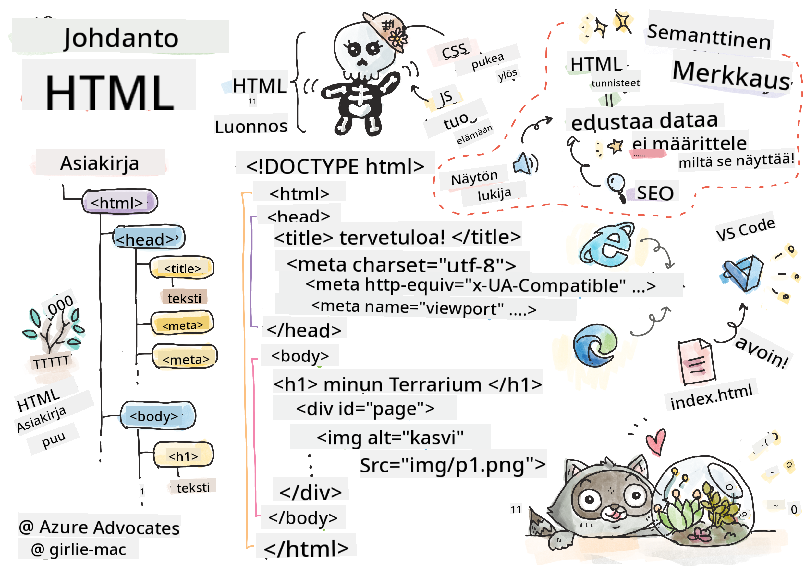

<!--
CO_OP_TRANSLATOR_METADATA:
{
  "original_hash": "20c72cf2e5b0050d38ca3cb14a75a9df",
  "translation_date": "2025-10-23T00:30:25+00:00",
  "source_file": "3-terrarium/1-intro-to-html/README.md",
  "language_code": "fi"
}
-->
# Terrarium-projekti Osa 1: Johdatus HTML:ään


> Sketchnote: [Tomomi Imura](https://twitter.com/girlie_mac)

HTML eli HyperText Markup Language on jokaisen verkkosivun perusta, jonka olet koskaan vieraillut. Ajattele HTML:ää verkkosivujen "luurankona" – se määrittää, mihin sisältö sijoitetaan, miten se järjestetään ja mitä kukin osa edustaa. Vaikka CSS myöhemmin "pukee" HTML:si väreillä ja asetteluilla ja JavaScript tuo siihen interaktiivisuutta, HTML tarjoaa olennaisen rakenteen, joka tekee kaiken muun mahdolliseksi.

Tässä oppitunnissa luot HTML-rakenteen virtuaaliselle terrarium-käyttöliittymälle. Tämä käytännön projekti opettaa sinulle HTML:n peruskäsitteitä samalla kun rakennat visuaalisesti kiinnostavaa sisältöä. Opit järjestämään sisältöä semanttisten elementtien avulla, työskentelemään kuvien kanssa ja luomaan perustan interaktiiviselle verkkosovellukselle.

Oppitunnin lopussa sinulla on toimiva HTML-sivu, joka näyttää kasvikuvat järjestetyissä sarakkeissa, valmiina tyyliteltäväksi seuraavassa oppitunnissa. Älä huoli, jos se näyttää aluksi yksinkertaiselta – juuri näin HTML:n kuuluukin toimia ennen kuin CSS lisää visuaalisen viimeistelyn.

## Ennakkokysely

[Ennakkokysely](https://ff-quizzes.netlify.app/web/quiz/15)

> 📺 **Katso ja opi**: Tutustu tähän hyödylliseen videoesittelyyn
> 
> [](https://www.youtube.com/watch?v=1TvxJKBzhyQ)

## Projektin valmistelu

Ennen kuin sukellamme HTML-koodiin, luodaan kunnollinen työtila terrarium-projektille. Jäsennellyn tiedostorakenteen luominen alusta alkaen on tärkeä tapa, joka hyödyttää sinua koko verkkokehitysmatkasi ajan.

### Tehtävä: Luo projektirakenne

Luo terrarium-projektille oma kansio ja lisää ensimmäinen HTML-tiedostosi. Tässä on kaksi lähestymistapaa:

**Vaihtoehto 1: Visual Studio Code -editorin käyttö**
1. Avaa Visual Studio Code
2. Klikkaa "File" → "Open Folder" tai käytä `Ctrl+K, Ctrl+O` (Windows/Linux) tai `Cmd+K, Cmd+O` (Mac)
3. Luo uusi kansio nimeltä `terrarium` ja valitse se
4. Explorer-paneelissa klikkaa "New File" -ikonia
5. Nimeä tiedosto `index.html`


**Vaihtoehto 2: Käytä terminaalikomentoja**
```bash
mkdir terrarium
cd terrarium
touch index.html
code index.html
```

**Mitä nämä komennot tekevät:**
- **Luo** uuden hakemiston nimeltä `terrarium` projektillesi
- **Siirtyy** terrarium-hakemistoon
- **Luo** tyhjän `index.html`-tiedoston
- **Avaa** tiedoston muokattavaksi Visual Studio Codessa

> 💡 **Vinkki**: Tiedostonimi `index.html` on erityinen verkkokehityksessä. Kun joku vierailee verkkosivustolla, selaimet etsivät automaattisesti `index.html`-tiedostoa oletussivuksi. Tämä tarkoittaa, että URL-osoite kuten `https://mysite.com/projects/` näyttää automaattisesti `index.html`-tiedoston `projects`-kansiosta ilman, että tiedostonimeä tarvitsee erikseen määrittää.

## HTML-dokumentin rakenteen ymmärtäminen

Jokainen HTML-dokumentti noudattaa tiettyä rakennetta, jonka selaimet tarvitsevat ymmärtääkseen ja näyttääkseen sisällön oikein. Ajattele tätä rakennetta kuin virallista kirjettä – siinä on vaadittavat elementit tietyssä järjestyksessä, jotka auttavat vastaanottajaa (tässä tapauksessa selainta) käsittelemään sisältöä oikein.

Aloitetaan lisäämällä jokaisen HTML-dokumentin tarvitsema perusrakenne.

### DOCTYPE-määrittely ja juurielementti

Jokaisen HTML-tiedoston kaksi ensimmäistä riviä toimivat dokumentin "esittelynä" selaimelle:

```html
<!DOCTYPE html>
<html></html>
```

**Mitä tämä koodi tekee:**
- **Määrittää** dokumenttityypin HTML5:ksi käyttämällä `<!DOCTYPE html>`
- **Luo** juurielementin `<html>`, joka sisältää kaiken sivun sisällön
- **Vakiinnuttaa** modernit verkkostandardit oikeaa selaimen renderöintiä varten
- **Varmistaa** yhtenäisen näytön eri selaimissa ja laitteissa

> 💡 **VS Code -vinkki**: Vie hiiri minkä tahansa HTML-tagin päälle Visual Studio Codessa nähdäksesi hyödyllistä tietoa MDN Web Docsista, mukaan lukien käyttöesimerkit ja selainten yhteensopivuustiedot.

> 📚 **Lisätietoa**: DOCTYPE-määrittely estää selaimia siirtymästä "quirks mode" -tilaan, jota käytettiin hyvin vanhojen verkkosivustojen tukemiseen. Moderni verkkokehitys käyttää yksinkertaista `<!DOCTYPE html>`-määrittelyä varmistaakseen [standardien mukaisen renderöinnin](https://developer.mozilla.org/docs/Web/HTML/Quirks_Mode_and_Standards_Mode).

## Välttämättömän dokumenttimetadata lisääminen

HTML-dokumentin `<head>`-osio sisältää tärkeää tietoa, jota selaimet ja hakukoneet tarvitsevat, mutta jota vierailijat eivät näe suoraan sivulla. Ajattele sitä "kulissien takana" olevana tietona, joka auttaa verkkosivua toimimaan oikein ja näkymään oikein eri laitteilla ja alustoilla.

Tämä metadata kertoo selaimille, miten sivu näytetään, mitä merkistöä käytetään ja miten eri näyttökokoja käsitellään – kaikki olennaisia asioita ammattimaisen ja saavutettavan verkkosivun luomisessa.

### Tehtävä: Lisää dokumentin pääosa

Lisää tämä `<head>`-osio avaus- ja sulkevien `<html>`-tagien väliin:

```html
<head>
	<title>Welcome to my Virtual Terrarium</title>
	<meta charset="utf-8" />
	<meta http-equiv="X-UA-Compatible" content="IE=edge" />
	<meta name="viewport" content="width=device-width, initial-scale=1" />
</head>
```

**Mitä kukin elementti tekee:**
- **Asettaa** sivun otsikon, joka näkyy selaimen välilehdissä ja hakutuloksissa
- **Määrittää** UTF-8-merkistökoodauksen tekstin oikeaa näyttämistä varten maailmanlaajuisesti
- **Varmistaa** yhteensopivuuden Internet Explorerin modernien versioiden kanssa
- **Määrittää** responsiivisen suunnittelun asettamalla näkymän leveyden laitteen leveyden mukaan
- **Säätää** alkuperäisen zoomaustason sisällön luonnollisen koon näyttämiseksi

> 🤔 **Pohdittavaa**: Mitä tapahtuisi, jos asettaisit näkymän metatagin näin: `<meta name="viewport" content="width=600">`? Tämä pakottaisi sivun aina 600 pikselin levyiseksi, mikä rikkoisi responsiivisen suunnittelun! Lue lisää [näkymän metatagin oikeasta konfiguroinnista](https://developer.mozilla.org/docs/Web/HTML/Viewport_meta_tag).

## Dokumentin rungon rakentaminen

HTML:n `<body>`-elementti sisältää kaiken verkkosivusi näkyvän sisällön – kaiken, mitä käyttäjät näkevät ja minkä kanssa he ovat vuorovaikutuksessa. Vaikka `<head>`-osio antoi ohjeita selaimelle, `<body>`-osio sisältää varsinaisen sisällön: tekstiä, kuvia, painikkeita ja muita elementtejä, jotka muodostavat käyttöliittymän.

Lisätään rungon rakenne ja ymmärretään, miten HTML-tagit toimivat yhdessä luodakseen merkityksellistä sisältöä.

### HTML-tagin rakenteen ymmärtäminen

HTML käyttää parillisia tageja elementtien määrittämiseen. Useimmilla tageilla on avaus-tagi, kuten `<p>`, ja sulkeva tagi, kuten `</p>`, joiden välissä on sisältöä: `<p>Hello, world!</p>`. Tämä luo kappale-elementin, joka sisältää tekstin "Hello, world!".

### Tehtävä: Lisää rungon elementti

Päivitä HTML-tiedostosi sisältämään `<body>`-elementti:

```html
<!DOCTYPE html>
<html>
	<head>
		<title>Welcome to my Virtual Terrarium</title>
		<meta charset="utf-8" />
		<meta http-equiv="X-UA-Compatible" content="IE=edge" />
		<meta name="viewport" content="width=device-width, initial-scale=1" />
	</head>
	<body></body>
</html>
```

**Mitä tämä kokonaisrakenne tarjoaa:**
- **Luo** HTML5-dokumentin peruskehikon
- **Sisältää** olennaisen metadatan oikeaa selaimen renderöintiä varten
- **Luo** tyhjän rungon näkyvää sisältöä varten
- **Noudattaa** modernin verkkokehityksen parhaita käytäntöjä

Nyt olet valmis lisäämään terrariumin näkyvät elementit. Käytämme `<div>`-elementtejä säiliöinä eri sisältöosioiden järjestämiseen ja ``-elementtejä kasvikuvien näyttämiseen.

### Työskentely kuvien ja asettelusäiliöiden kanssa

Kuvat ovat erityisiä HTML:ssä, koska ne käyttävät "itse sulkeutuvia" tageja. Toisin kuin elementit, kuten `<p></p>`, jotka ympäröivät sisältöä, ``-tagi sisältää kaiken tarvittavan tiedon itsessään käyttämällä attribuutteja, kuten `src` kuvatiedoston polulle ja `alt` saavutettavuuden parantamiseksi.

Ennen kuin lisäät kuvia HTML:ään, sinun on järjestettävä projektitiedostosi oikein luomalla kuvat-kansio ja lisäämällä kasvigrafiikat.

**Ensiksi, valmistele kuvasi:**
1. Luo kansio nimeltä `images` terrarium-projektikansiosi sisälle
2. Lataa kasvikuvat [ratkaisukansiosta](../../../../3-terrarium/solution/images) (yhteensä 14 kasvikuvia)
3. Kopioi kaikki kasvikuvat uuteen `images`-kansioosi

### Tehtävä: Luo kasvien näyttöasettelu

Lisää kasvikuvat järjestettyinä kahteen sarakkeeseen `<body></body>`-tagien väliin:

```html
<div id="page">
	<div id="left-container" class="container">
		<div class="plant-holder">
			
		</div>
		<div class="plant-holder">
			
		</div>
		<div class="plant-holder">
			
		</div>
		<div class="plant-holder">
			
		</div>
		<div class="plant-holder">
			
		</div>
		<div class="plant-holder">
			
		</div>
		<div class="plant-holder">
			
		</div>
	</div>
	<div id="right-container" class="container">
		<div class="plant-holder">
			
		</div>
		<div class="plant-holder">
			
		</div>
		<div class="plant-holder">
			
		</div>
		<div class="plant-holder">
			
		</div>
		<div class="plant-holder">
			
		</div>
		<div class="plant-holder">
			
		</div>
		<div class="plant-holder">
			
		</div>
	</div>
</div>
```

**Vaihe vaiheelta, mitä tässä koodissa tapahtuu:**
- **Luo** pääsivusäiliön `id="page"`, joka sisältää kaiken sisällön
- **Määrittää** kaksi sarakesäiliötä: `left-container` ja `right-container`
- **Järjestää** 7 kasvia vasempaan sarakkeeseen ja 7 kasvia oikeaan sarakkeeseen
- **Käärii** jokaisen kasvikuvan `plant-holder`-diviin yksittäistä sijoittelua varten
- **Käyttää** yhtenäisiä luokkanimiä CSS-tyylittelyä varten seuraavassa oppitunnissa
- **Antaa** yksilölliset ID:t jokaiselle kasvikuville JavaScript-interaktiota varten
- **Sisältää** oikeat tiedostopolut, jotka osoittavat kuvat-kansioon

> 🤔 **Pohdittavaa**: Huomaa, että kaikilla kuvilla on tällä hetkellä sama alt-teksti "plant". Tämä ei ole ihanteellista saavutettavuuden kannalta. Ruudunlukijan käyttäjät kuulisivat "plant" toistettuna 14 kertaa tietämättä, mitä kukin kuva esittää. Voisitko keksiä parempia, kuvaavampia alt-tekstejä jokaiselle kuvalle?

> 📝 **HTML-elementtityypit**: `<div>`-elementit ovat "block-level" ja vievät koko leveyden, kun taas `<span>`-elementit ovat "inline" ja vievät vain tarvittavan leveyden. Mitä luulet tapahtuvan, jos vaihtaisit kaikki nämä `<div>`-tagit `<span>`-tageiksi?

Kun tämä merkintä on lisätty, kasvit näkyvät näytöllä, vaikka ne eivät vielä näytä viimeistellyiltä – siihen tarvitaan CSS seuraavassa oppitunnissa! Toistaiseksi sinulla on vankka HTML-perusta, joka järjestää sisältösi oikein ja noudattaa saavutettavuuden parhaita käytäntöjä.

## Semanttisen HTML:n käyttö saavutettavuuden parantamiseksi

Semanttinen HTML tarkoittaa HTML-elementtien valitsemista niiden merkityksen ja tarkoituksen, ei vain ulkonäön perusteella. Kun käytät semanttista merkintätapaa, välität sisältösi rakenteen ja merkityksen selaimille, hakukoneille ja apuvälineille, kuten ruudunlukijoille.

Tämä lähestymistapa tekee verkkosivustoistasi saavutettavampia vammaisille käyttäjille ja auttaa hakukoneita ymmärtämään sisältöäsi paremmin. Se on modernin verkkokehityksen perusperiaate, joka luo parempia kokemuksia kaikille.

### Lisää semanttinen sivun otsikko

Lisätään asianmukainen otsikko terrarium-sivullesi. Lisää tämä rivi heti avaus-`<body>`-tagin jälkeen:

```html
<h1>My Terrarium</h1>
```

**Miksi semanttinen merkintätapa on tärkeää:**
- **Auttaa** ruudunlukijoita navigoimaan ja ymmärtämään sivun rakennetta
- **Parantaa** hakukoneoptimointia (SEO) selkeyttämällä sisällön hierarkiaa
- **Lisää** saavutettavuutta näkövammaisille tai kognitiivisista eroista kärsiville käyttäjille
- **Luo** parempia käyttäjäkokemuksia kaikilla laitteilla ja alustoilla
- **Noudattaa** verkkostandardeja ja ammatillisen kehityksen parhaita käytäntöjä

**Esimerkkejä semanttisista vs. ei-semattisista valinnoista:**

| Tarkoitus | ✅ Semanttinen valinta | ❌ Ei-semanttinen valinta |
|-----------|-----------------------|--------------------------|
| Pääotsikko | `<h1>Otsikko</h1>` | `<div class="big-text">Otsikko</div>` |
| Navigaatio | `<nav><ul><li></li></ul></nav>` | `<div class="menu"><div></div></div>` |
| Painike | `<button>Paina tästä</button>` | `<span onclick="...">Paina tästä</span>` |
| Artikkelin sisältö | `<article><p></p></article>` | `<div class="content"><div></div></div>` |

> 🎥 **Katso käytännössä**: Katso [miten ruudunlukijat toimivat verkkosivujen kanssa](https://www.youtube.com/watch?v=OUDV1gqs9GA) ymmärtääksesi, miksi semanttinen merkintätapa on tärkeää saavutettavuuden kannalta. Huomaa, miten oikea HTML-rakenne auttaa käyttäjiä navigoimaan tehokkaasti.

## Terrarium-säiliön luominen

Lisätään nyt HTML-rakenne itse terrariumille – lasisäiliölle, johon kasvit lopulta sijoitetaan. Tämä osio havainnollistaa tärkeää käsitettä: HTML tarjoaa rakenteen, mutta ilman CSS-tyylittelyä nämä elementit eivät vielä näy.

Terrarium-merkintä käyttää kuvaavia luokkanimiä, jotka tekevät CSS-tyylittelystä intuitiivista ja helposti ylläpidettävää seuraavassa oppitunnissa.

### Tehtävä: Lisää terrarium-rakenne

Lisää tämä merkintä viimeisen `</div>`-tagin yläpuolelle (ennen sivusäiliön sulkevaa tagia):

```html
<div id="terrarium">
	<div class="jar-top"></div>
	<div class="jar-walls">
		<div class="jar-glossy-long"></div>
		<div class="jar-glossy-short"></div>
	</div>
	<div class="dirt"></div>
	<div class="jar-bottom"></div>
</div>
```

**Mitä tämä terrarium-rakenne tekee:**
- **Luo** pääterrarium-säiliön, jolla on yksilöllinen ID tyylittelyä varten
- **Määrittää** erilliset elementit kullekin visuaaliselle komponentille (yläosa, seinät, multa, pohja)
- **Sisältää** sisäkkäisiä elementtejä lasin heijastusefektejä varten (kiiltävät elementit)
- **Käyttää** kuvaavia luokkanimiä, jotka selkeästi osoittavat kunkin elementin tarkoituksen
- **Valmistelee** rakenteen CSS-tyylittelyä varten, joka luo lasisen terrariumin ulkonäön

> 🤔 **Huomaa jotain?**: Vaikka lisäsit tämän merkinnän, et näe mitään uutta sivulla! Tämä havainnollistaa täydellisesti, miten HTML tarjoaa rakenteen, kun taas CSS vastaa ulkonäöstä. Nämä `<div>`-elementit ovat olemassa, mutta niillä ei ole vielä visuaalista tyylittelyä – se tulee seuraavassa oppitunnissa!

---

## GitHub Copilot Agent -haaste

Käytä Agent-tilaa suorittaaksesi seuraavan haasteen:

**Kuvaus:** Luo semanttinen HTML-rakenne kasvien hoito-ohjeiden osioon, joka voidaan lisätä terrarium-projektiin.
**Prompt:** Luo semanttinen HTML-osio, joka sisältää pääotsikon "Kasvien hoito-opas", kolme alaosiota otsikoilla "Kastelu", "Valon tarve" ja "Maan hoito", joista jokaisessa on kappale kasvien hoitoon liittyvää tietoa. Käytä asianmukaisia semanttisia HTML-tageja, kuten `<section>`, `<h2>`, `<h3>` ja `<p>`, rakenteen luomiseen.

Lue lisää [agenttitilasta](https://code.visualstudio.com/blogs/2025/02/24/introducing-copilot-agent-mode) täältä.

## Tutustu HTML:n historiaan -haaste

**Tietoa verkkokehityksen evoluutiosta**

HTML on kehittynyt merkittävästi sen jälkeen, kun Tim Berners-Lee loi ensimmäisen verkkoselaimen CERNissä vuonna 1990. Jotkin vanhemmat tagit, kuten `<marquee>`, on nyt poistettu käytöstä, koska ne eivät toimi hyvin modernien saavutettavuusstandardien ja responsiivisen suunnittelun periaatteiden kanssa.

**Kokeile tätä:**
1. Kääri `<h1>`-otsikkosi väliaikaisesti `<marquee>`-tagiin: `<marquee><h1>Oma terraario</h1></marquee>`
2. Avaa sivusi selaimessa ja tarkkaile vieritysefektiä
3. Mieti, miksi tämä tagi poistettiin käytöstä (vihje: ajattele käyttäjäkokemusta ja saavutettavuutta)
4. Poista `<marquee>`-tagi ja palaa semanttiseen merkkaustapaan

**Pohdintakysymyksiä:**
- Miten vierivä otsikko voisi vaikuttaa käyttäjiin, joilla on näkövammoja tai liikeherkkyyttä?
- Mitä moderneja CSS-tekniikoita voisi käyttää samanlaisten visuaalisten efektien saavuttamiseksi saavutettavammin?
- Miksi on tärkeää käyttää nykyisiä verkkostandardeja vanhentuneiden elementtien sijaan?

Tutustu lisää [vanhentuneisiin ja poistettuihin HTML-elementteihin](https://developer.mozilla.org/docs/Web/HTML/Element#Obsolete_and_deprecated_elements) ymmärtääksesi, miten verkkostandardit kehittyvät parantaakseen käyttäjäkokemusta.


## Luentojälkeinen kysely

[Luentojälkeinen kysely](https://ff-quizzes.netlify.app/web/quiz/16)

## Kertaus ja itseopiskelu

**Syvennä HTML-osaamistasi**

HTML on ollut verkkosivujen perusta yli 30 vuoden ajan, kehittyen yksinkertaisesta dokumenttimerkintäkielestä monimutkaiseksi alustaksi interaktiivisten sovellusten rakentamiseen. Tämän kehityksen ymmärtäminen auttaa sinua arvostamaan moderneja verkkostandardeja ja tekemään parempia kehityspäätöksiä.

**Suositellut oppimispolut:**

1. **HTML:n historia ja kehitys**
   - Tutki aikajanaa HTML 1.0:sta HTML5:een
   - Selvitä, miksi tietyt tagit poistettiin käytöstä (saavutettavuus, mobiiliystävällisyys, ylläpidettävyys)
   - Tutki uusia HTML-ominaisuuksia ja ehdotuksia

2. **Semanttisen HTML:n syväsukellus**
   - Tutustu [HTML5:n semanttisten elementtien](https://developer.mozilla.org/docs/Web/HTML/Element) täydelliseen luetteloon
   - Harjoittele, milloin käyttää `<article>`, `<section>`, `<aside>` ja `<main>`-tageja
   - Opi ARIA-attribuuteista saavutettavuuden parantamiseksi

3. **Moderni verkkokehitys**
   - Tutustu [responsiivisten verkkosivujen rakentamiseen](https://docs.microsoft.com/learn/modules/build-simple-website/?WT.mc_id=academic-77807-sagibbon) Microsoft Learn -sivustolla
   - Ymmärrä, miten HTML integroituu CSS:n ja JavaScriptin kanssa
   - Opi verkkosivuston suorituskyvyn ja SEO:n parhaista käytännöistä

**Pohdintakysymyksiä:**
- Mitä vanhentuneita HTML-tageja löysit ja miksi ne poistettiin käytöstä?
- Mitä uusia HTML-ominaisuuksia ehdotetaan tuleviin versioihin?
- Miten semanttinen HTML edistää verkkosivustojen saavutettavuutta ja hakukoneoptimointia?


## Tehtävä

[Harjoittele HTML: Rakenna blogin mallipohja](assignment.md)

---

**Vastuuvapauslauseke**:  
Tämä asiakirja on käännetty käyttämällä tekoälypohjaista käännöspalvelua [Co-op Translator](https://github.com/Azure/co-op-translator). Vaikka pyrimme tarkkuuteen, huomioithan, että automaattiset käännökset voivat sisältää virheitä tai epätarkkuuksia. Alkuperäinen asiakirja sen alkuperäisellä kielellä tulisi pitää ensisijaisena lähteenä. Kriittisen tiedon osalta suositellaan ammattimaista ihmiskäännöstä. Emme ole vastuussa väärinkäsityksistä tai virhetulkinnoista, jotka johtuvat tämän käännöksen käytöstä.