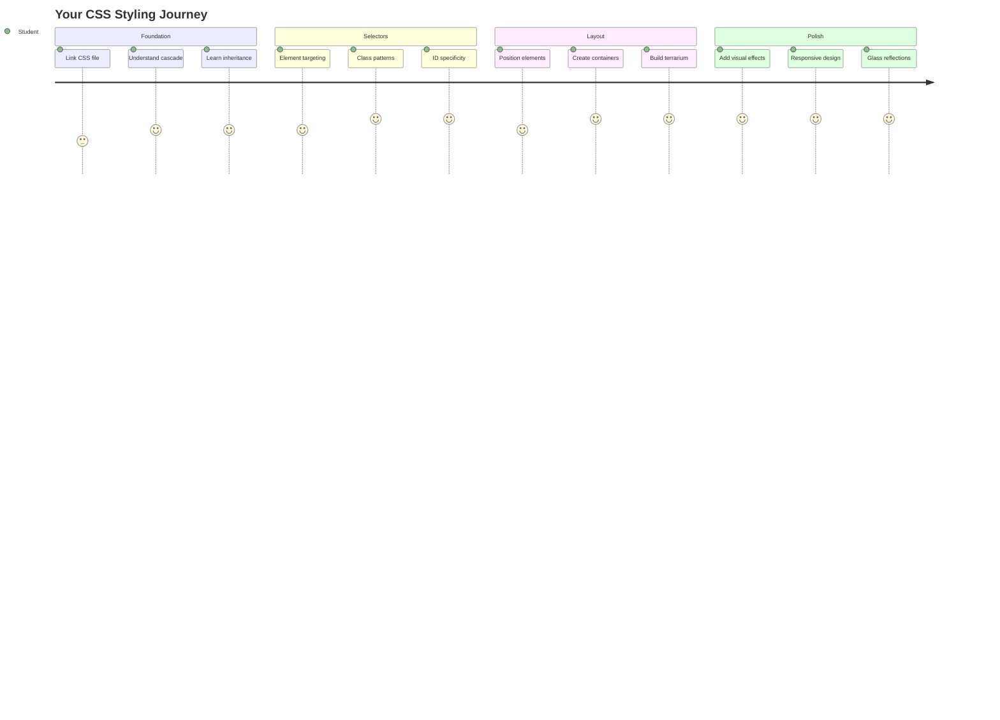
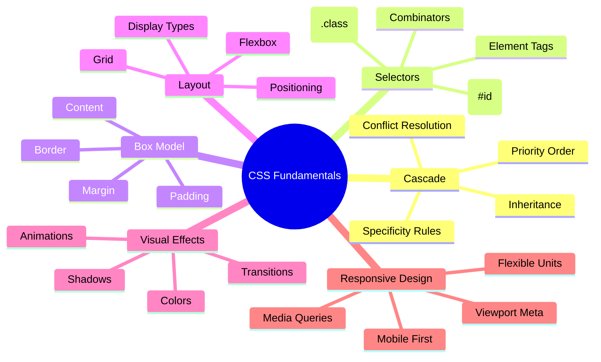
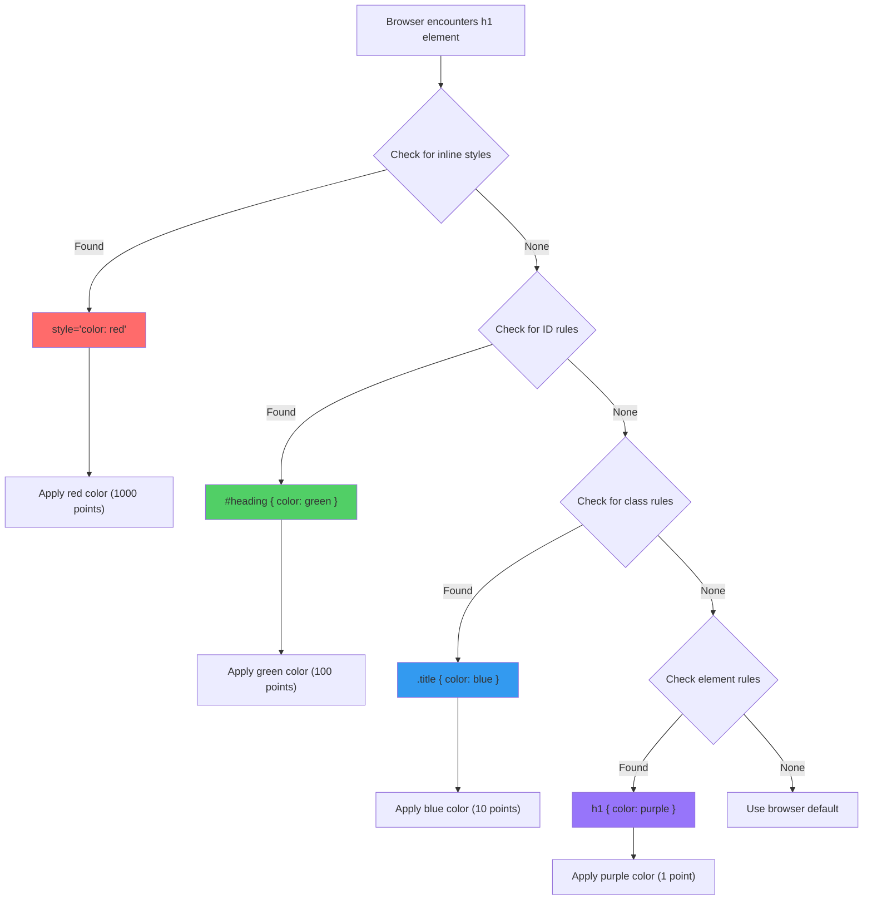
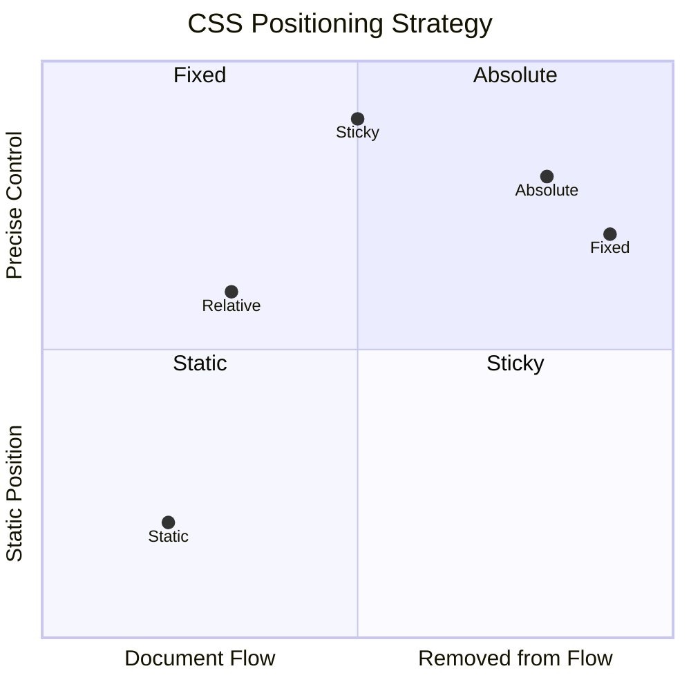
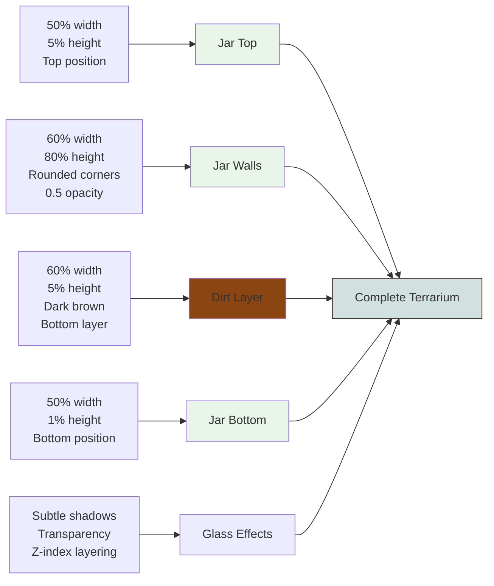
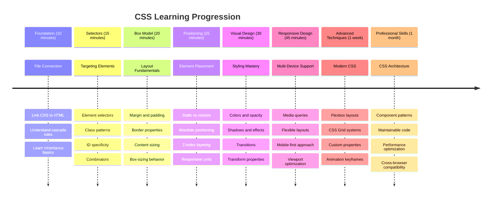

<!--
CO_OP_TRANSLATOR_METADATA:
{
  "original_hash": "e39f3a4e3bcccf94639e3af1248f8a4d",
  "translation_date": "2025-11-04T01:28:10+00:00",
  "source_file": "3-terrarium/2-intro-to-css/README.md",
  "language_code": "fi"
}
-->
# Terrarium-projekti Osa 2: Johdatus CSS:ään




> Sketchnote: [Tomomi Imura](https://twitter.com/girlie_mac)

Muistatko, kuinka HTML-terrariumisi näytti melko yksinkertaiselta? CSS:n avulla voimme muuttaa tuon pelkistetyn rakenteen visuaalisesti houkuttelevaksi.

Jos HTML on kuin talon runko, CSS on kaikki se, mikä tekee siitä kodikkaan – maalivärit, huonekalujen järjestely, valaistus ja huoneiden yhteensopivuus. Ajattele, kuinka Versailles'n palatsi alkoi yksinkertaisena metsästysmajana, mutta huolellinen koristelu ja suunnittelu muuttivat sen yhdeksi maailman upeimmista rakennuksista.

Tänään muutamme terrariumisi toimivasta viimeistellyksi. Opit sijoittamaan elementtejä tarkasti, tekemään ulkoasuista responsiivisia eri näyttökokoihin ja luomaan visuaalista vetovoimaa, joka tekee verkkosivustoista kiinnostavia.

Tämän oppitunnin lopussa näet, kuinka strateginen CSS-tyylittely voi parantaa projektiasi merkittävästi. Lisätään tyyliä terrariumiisi.



## Ennakkokysely

[Ennakkokysely](https://ff-quizzes.netlify.app/web/quiz/17)

## CSS:n perusteet

CSS:ää pidetään usein vain "asioiden kaunistamisena", mutta sen tarkoitus on paljon laajempi. CSS on kuin elokuvan ohjaaja – hallitset paitsi ulkonäköä, myös liikettä, vuorovaikutusta ja sopeutumista eri tilanteisiin.

Moderni CSS on hämmästyttävän monipuolinen. Voit kirjoittaa koodia, joka automaattisesti mukauttaa ulkoasut puhelimille, tableteille ja pöytätietokoneille. Voit luoda sulavia animaatioita, jotka ohjaavat käyttäjän huomion oikeaan paikkaan. Kun kaikki toimii yhdessä, tulokset voivat olla todella vaikuttavia.

> 💡 **Vinkki**: CSS kehittyy jatkuvasti uusien ominaisuuksien ja mahdollisuuksien myötä. Tarkista aina [CanIUse.com](https://caniuse.com), että selaimet tukevat uusimpia CSS-ominaisuuksia ennen kuin käytät niitä tuotantoprojekteissa.

**Tässä oppitunnissa saavutamme seuraavat asiat:**
- **Luomme** täydellisen visuaalisen suunnittelun terrariumillesi modernien CSS-tekniikoiden avulla
- **Tutkimme** peruskäsitteitä, kuten kaskadia, periytymistä ja CSS-valitsimia
- **Toteutamme** responsiivisia sijoittelu- ja asettelustrategioita
- **Rakennamme** terrarium-kontin CSS-muotojen ja tyylien avulla

### Esitiedot

Sinun tulisi olla suorittanut terrariumisi HTML-rakenteen edellisestä oppitunnista ja valmistellut sen tyylittelyä varten.

> 📺 **Videomateriaali**: Katso tämä hyödyllinen video-opastus
>
> [](https://www.youtube.com/watch?v=6yIdOIV9p1I)

### CSS-tiedoston luominen

Ennen kuin voimme aloittaa tyylittelyn, meidän täytyy yhdistää CSS HTML:ään. Tämä yhteys kertoo selaimelle, mistä terrariumin tyyliohjeet löytyvät.

Luo terrarium-kansioosi uusi tiedosto nimeltä `style.css` ja linkitä se HTML-dokumenttisi `<head>`-osioon:

```html
<link rel="stylesheet" href="./style.css" />
```

**Tämä koodi tekee seuraavaa:**
- **Luo** yhteyden HTML- ja CSS-tiedostojen välille
- **Kertoo** selaimelle, mistä ladata ja soveltaa tyylit `style.css`-tiedostosta
- **Käyttää** `rel="stylesheet"`-attribuuttia ilmoittaakseen, että kyseessä on CSS-tiedosto
- **Viittaa** tiedostopolkuun `href="./style.css"`

## CSS-kaskadin ymmärtäminen

Oletko koskaan miettinyt, miksi CSS:ää kutsutaan "kaskadoiviksi" tyylitiedostoiksi? Tyylit kaskadoivat alas kuin vesiputous, ja joskus ne ovat ristiriidassa keskenään.

Ajattele, kuinka sotilaallinen komentorakenne toimii – kenraalin määräys saattaa olla "kaikki joukot pukeutuvat vihreään", mutta yksikkösi erityinen määräys saattaa olla "pukeutukaa juhlapukuihin seremoniaa varten". Tarkempi ohje menee etusijalle. CSS noudattaa samanlaista logiikkaa, ja tämän hierarkian ymmärtäminen tekee virheiden korjaamisesta paljon helpompaa.

### Kokeile kaskadin prioriteettia

Katsotaan kaskadia toiminnassa luomalla tyyliristiriita. Lisää ensin inline-tyyli `<h1>`-tagiisi:

```html
<h1 style="color: red">My Terrarium</h1>
```

**Mitä tämä koodi tekee:**
- **Soveltaa** punaisen värin suoraan `<h1>`-elementtiin käyttämällä inline-tyylittelyä
- **Käyttää** `style`-attribuuttia upottaakseen CSS:n suoraan HTML:ään
- **Luo** korkeimman prioriteetin tyylisäännön tälle elementille

Lisää seuraavaksi tämä sääntö `style.css`-tiedostoosi:

```css
h1 {
  color: blue;
}
```

**Yllä olevassa olemme:**
- **Määrittäneet** CSS-säännön, joka kohdistuu kaikkiin `<h1>`-elementteihin
- **Asettaneet** tekstin väriksi sinisen ulkoisessa tyylitiedostossa
- **Luoneet** alemman prioriteetin säännön verrattuna inline-tyyleihin

✅ **Tietotesti**: Mikä väri näkyy verkkosovelluksessasi? Miksi juuri tämä väri voittaa? Voitko keksiä tilanteita, joissa haluaisit ohittaa tyylit?



> 💡 **CSS-prioriteettijärjestys (korkeimmasta matalimpaan):**
> 1. **Inline-tyylit** (style-attribuutti)
> 2. **ID:t** (#myId)
> 3. **Luokat** (.myClass) ja attribuutit
> 4. **Elementtivalitsimet** (h1, div, p)
> 5. **Selaimen oletukset**

## CSS:n periytyminen käytännössä

CSS:n periytyminen toimii kuin genetiikka – elementit perivät tiettyjä ominaisuuksia vanhemmiltaan. Jos asetat fonttiperheen body-elementille, kaikki teksti sisällä käyttää automaattisesti samaa fonttia. Se on kuin Habsburg-suvun tunnusomainen leukalinja, joka siirtyi sukupolvelta toiselle ilman, että sitä erikseen määriteltiin jokaiselle yksilölle.

Kaikki ei kuitenkaan periydy. Tekstityylit, kuten fontit ja värit, periytyvät, mutta asettelun ominaisuudet, kuten marginaalit ja reunukset, eivät. Aivan kuten lapset voivat periä fyysisiä piirteitä, mutta eivät vanhempiensa muotivalintoja.

### Fontin periytymisen havainnointi

Katsotaan periytymistä asettamalla fonttiperhe `<body>`-elementille:

```css
body {
  font-family: 'Segoe UI', Tahoma, Geneva, Verdana, sans-serif;
}
```

**Mitä tässä tapahtuu:**
- **Asettaa** fonttiperheen koko sivulle kohdistamalla `<body>`-elementtiin
- **Käyttää** fonttipinoa varavaihtoehtoineen paremman selaimen yhteensopivuuden vuoksi
- **Soveltaa** moderneja järjestelmäfontteja, jotka näyttävät hyvältä eri käyttöjärjestelmissä
- **Varmistaa**, että kaikki lapsielementit perivät tämän fontin, ellei niitä erikseen ohiteta

Avaa selaimesi kehitystyökalut (F12), siirry Elements-välilehteen ja tarkista `<h1>`-elementtisi. Näet, että se perii fonttiperheen body-elementiltä:


✅ **Kokeilua**: Kokeile asettaa muita periytyviä ominaisuuksia `<body>`-elementille, kuten `color`, `line-height` tai `text-align`. Mitä tapahtuu otsikolle ja muille elementeille?

> 📝 **Periytyvät ominaisuudet**: `color`, `font-family`, `font-size`, `line-height`, `text-align`, `visibility`
>
> **Ei-periytyvät ominaisuudet**: `margin`, `padding`, `border`, `width`, `height`, `position`

### 🔄 **Pedagoginen tarkistus**
**CSS:n perusymmärrys**: Ennen siirtymistä valitsimiin varmista, että osaat:
- ✅ Selittää kaskadin ja periytymisen eron
- ✅ Ennustaa, mikä tyyli voittaa spesifisyyden ristiriidassa
- ✅ Tunnistaa, mitkä ominaisuudet periytyvät vanhemmilta elementeiltä
- ✅ Yhdistää CSS-tiedostot HTML:ään oikein

**Pikatesti**: Jos sinulla on nämä tyylit, minkä värinen `<h1>` `<div class="special">`-sisällä on?
```css
div { color: blue; }
.special { color: green; }
h1 { color: red; }
```
*Vastaus: Punainen (elementtivalitsin kohdistaa suoraan h1:een)*

## CSS-valitsimien hallinta

CSS-valitsimet ovat tapa kohdistaa tiettyjä elementtejä tyylittelyä varten. Ne toimivat kuin tarkat ohjeet – sen sijaan, että sanoisit "talo", voit sanoa "sininen talo, jossa on punainen ovi Maple Streetillä".

CSS tarjoaa erilaisia tapoja olla tarkka, ja oikean valitsimen valitseminen on kuin sopivan työkalun valinta tehtävään. Joskus sinun täytyy tyylitellä kaikki naapuruston ovet, ja joskus vain yksi tietty ovi.

### Elementtivalitsimet (tagit)

Elementtivalitsimet kohdistavat HTML-elementtejä niiden tagin nimen perusteella. Ne sopivat täydellisesti perusmuotoiluun, joka koskee laajasti koko sivua:

```css
body {
  font-family: 'Segoe UI', Tahoma, Geneva, Verdana, sans-serif;
  margin: 0;
  padding: 0;
}

h1 {
  color: #3a241d;
  text-align: center;
  font-size: 2.5rem;
  margin-bottom: 1rem;
}
```

**Näiden tyylien ymmärtäminen:**
- **Asettaa** yhtenäisen typografian koko sivulle `body`-valitsimella
- **Poistaa** selaimen oletusmarginaalit ja -täytteet paremman hallinnan vuoksi
- **Tyylittelee** kaikki otsikkoelementit värillä, kohdistuksella ja välimatkoilla
- **Käyttää** `rem`-yksiköitä skaalautuvaan ja saavutettavaan fonttikokoon

Vaikka elementtivalitsimet toimivat hyvin yleiseen muotoiluun, tarvitset tarkempia valitsimia yksittäisten komponenttien, kuten terrariumin kasvien, tyylittelyyn.

### ID-valitsimet yksittäisille elementeille

ID-valitsimet käyttävät `#`-symbolia ja kohdistavat elementtejä, joilla on tietty `id`-attribuutti. Koska ID:t ovat ainutlaatuisia sivulla, ne sopivat täydellisesti yksittäisten, erityisten elementtien, kuten terrariumin vasemman ja oikean kasvikontin, tyylittelyyn.

Luodaan tyylit terrariumin sivukontteille, joissa kasvit sijaitsevat:

```css
#left-container {
  background-color: #f5f5f5;
  width: 15%;
  left: 0;
  top: 0;
  position: absolute;
  height: 100vh;
  padding: 1rem;
  box-sizing: border-box;
}

#right-container {
  background-color: #f5f5f5;
  width: 15%;
  right: 0;
  top: 0;
  position: absolute;
  height: 100vh;
  padding: 1rem;
  box-sizing: border-box;
}
```

**Tämä koodi tekee seuraavaa:**
- **Sijoittaa** kontit vasemmalle ja oikealle reunalle `absolute`-sijoittelulla
- **Käyttää** `vh`-yksiköitä (näkymäkorkeus) responsiiviseen korkeuteen, joka mukautuu näytön kokoon
- **Soveltaa** `box-sizing: border-box`, jotta täyte sisältyy kokonaisleveyteen
- **Poistaa** tarpeettomat `px`-yksiköt nolla-arvoista siistimmän koodin vuoksi
- **Asettaa** hienovaraisen taustavärin, joka on silmille miellyttävämpi kuin kirkas harmaa

✅ **Koodin laatuhaaste**: Huomaa, kuinka tämä CSS rikkoo DRY-periaatetta (Don't Repeat Yourself). Voitko refaktoroida sen käyttämällä sekä ID:tä että luokkaa?

**Parannettu lähestymistapa:**
```html
<div id="left-container" class="container"></div>
<div id="right-container" class="container"></div>
```

```css
.container {
  background-color: #f5f5f5;
  width: 15%;
  top: 0;
  position: absolute;
  height: 100vh;
  padding: 1rem;
  box-sizing: border-box;
}

#left-container {
  left: 0;
}

#right-container {
  right: 0;
}
```

### Luokkavalitsimet uudelleenkäytettäville tyyleille

Luokkavalitsimet käyttävät `.`-symbolia ja sopivat, kun haluat soveltaa samoja tyylejä useisiin elementteihin. Toisin kuin ID:t, luokkia voidaan käyttää uudelleen HTML:ssä, mikä tekee niistä ihanteellisia yhtenäisten tyylien luomiseen.

Terrariumissamme jokainen kasvi tarvitsee samanlaista tyylittelyä, mutta myös yksilöllistä sijoittelua. Käytämme yhdistelmää luokkia yhteisiin tyyleihin ja ID:itä yksilölliseen sijoitteluun.

**Tässä on jokaisen kasvin HTML-rakenne:**
```html
<div class="plant-holder">
  
</div>
```

**Keskeiset elementit selitettynä:**
- **Käyttää** `class="plant-holder"` yhtenäiseen kontin tyylittelyyn kaikille kasveille
- **Soveltaa** `class="plant"` yhteiseen kuvatyylittelyyn ja käyttäytymiseen
- **Sisältää** yksilöllisen `id="plant1"` yksilölliseen sijoitteluun ja JavaScript-vuorovaikutukseen
- **Tarjoaa** kuvailevan alt-tekstin ruudunlukijan saavutettavuuden vuoksi

Lisää nämä tyylit `style.css`-tiedostoosi:

```css
.plant-holder {
  position: relative;
  height: 13%;
  left: -0.6rem;
}

.plant {
  position: absolute;
  max-width: 150%;
  max-height: 150%;
  z-index: 2;
  transition: transform 0.3s ease;
}

.plant:hover {
  transform: scale(1.05);
}
```

**Näiden tyylien erittely:**
- **Luo** suhteellisen sijoittelun kasvikontille sijoittelukontekstin luomiseksi
- **Asettaa** jokaisen kasvikontin korkeudeksi 13 %, jotta kaikki kasvit mahtuvat pystysuunnassa ilman vieritystä
- **Siirtää** kontteja hieman vasemmalle, jotta kasvit keskittyvät paremmin konttiensa sisällä
- **Mahdollistaa** kasvien responsiivisen skaalautumisen `max-width`- ja `max-height`-ominaisuuksilla
- **Käyttää** `z-index`-arvoa, jotta kasvit sijoittuvat muiden terrariumin elementtien yläpuolelle
- **Lisää** hienovaraisen hover-efektin CSS-siirtymillä paremman käyttäjäkokemuksen saavuttamiseksi

✅ **Kriittinen ajattelu**: Miksi tarvitsemme sekä `.plant-holder` että `.plant`-valitsimet? Mitä tapahtuisi, jos yrittäisimme käyttää vain yhtä?

> 💡 **Suunnittelumalli**: Kontti (`.plant-holder`) hallitsee asettelua ja sijoittelua, kun taas sisältö (`.plant`) hallitsee ulkonäköä ja skaalautuvuutta. Tämä erottelu tekee koodista helpommin ylläpidettävän ja joustavan.

## CSS-sijoittelun ymmärtäminen

CSS-sijoittelu on kuin näytelmän ohjaaja – ohjaat, missä jokainen näyttelijä seisoo ja miten he liikkuvat lavalla. Jotkut näyttelijät noudattavat normaalia muodostelmaa, kun taas toiset tarvitsevat erityistä sijoittelua dramaattisen vaikutuksen vuoksi.

Kun ymmärrät sijoittelun, monet asetteluun liittyvät haasteet muuttuvat hallittaviksi. Tarvitsetko navigointipalkin, joka pysyy ylhäällä käyttäjän vierittäessä? Sijoittelu hoitaa sen. Haluatko työkaluvihjeen, joka ilmestyy tiettyyn paikkaan? Se on myös sijoittelua.

### Viisi sijoitteluarvoa



| Sijoitteluarvo | Käyttäytyminen | Käyttötapaus |
|----------------|----------------|--------------|
| `static` | Oletusvirtaus, ei huomioi top/left/right/bottom | Normaali dokumenttiasettelu |
| `relative` | Sijoitettu suhteessa normaaliin sijaintiinsa | Pienet säädöt, sijoittelukontekstin luominen |
| `absolute` | Sijoitettu lähimpään sijoitettuun esivanhempaan | Tarkka sijoittelu, päällekkäisyydet |
| `fixed` | Sijoitettu suhteessa näkymään | Navigointipalkit, kelluvat elementit |
| `sticky` | Vaihtuu suhteellisen ja kiinteän välillä vierityksen mukaan | Otsikot, jotka pysyvät vieritettäessä |

### Sijoittelu terrariumissamme

Terrariumissamme käytetään strategista yhdistelmää sijoittelutyyppejä halutun asettelun luomiseksi:

```css
/* Container positioning */
.container {
  position: absolute; /* Removes from normal flow */
  /* ... other styles ... */
}

/* Plant holder positioning */
.plant-holder {
  position: relative; /* Creates positioning context */
  /* ... other styles ... */
}

/* Plant positioning */
.plant {
  position: absolute; /* Allows precise placement within holder */
  /* ... other styles ... */
}
```

**Sijoittelustrategian ymmärtäminen:**
- **Absoluuttiset kontit** poistetaan normaalista dokumenttivirrasta ja kiinnitetään näytön reunoille
- **Suhteelliset kasvikontit** luovat sijoittelukontekstin pysyen samalla dokumenttiv
- Miten asettelu muuttuu, jos `.plant-holder` käyttää `absolute` sijasta `relative`?
- Mitä tapahtuu, kun vaihdat `.plant` suhteelliseen (`relative`) sijoitteluun?

### 🔄 **Pedagoginen tarkistus**
**CSS-sijoittelun hallinta**: Pysähdy tarkistamaan ymmärryksesi:
- ✅ Osaatko selittää, miksi kasvit tarvitsevat absoluuttista sijoittelua vedä ja pudota -toiminnossa?
- ✅ Ymmärrätkö, miten suhteelliset säiliöt luovat sijoittelukontekstin?
- ✅ Miksi sivusäiliöt käyttävät absoluuttista sijoittelua?
- ✅ Mitä tapahtuisi, jos poistaisit sijoittelumääritykset kokonaan?

**Yhteys todelliseen maailmaan**: Mieti, miten CSS-sijoittelu heijastaa todellista asettelua:
- **Static**: Kirjat hyllyssä (luonnollinen järjestys)
- **Relative**: Kirjan siirtäminen hieman mutta pitäen sen paikan
- **Absolute**: Kirjanmerkin asettaminen tarkalle sivunumerolle
- **Fixed**: Post-it-lappu, joka pysyy näkyvissä sivuja selatessa

## Terrariumin rakentaminen CSS:llä

Rakennamme nyt lasipurkin pelkästään CSS:llä – ilman kuvia tai grafiikkaohjelmistoa.

Realistisen lasin, varjojen ja syvyysefektien luominen sijoittelun ja läpinäkyvyyden avulla osoittaa CSS:n visuaaliset kyvyt. Tämä tekniikka muistuttaa, miten Bauhaus-liikkeen arkkitehdit käyttivät yksinkertaisia geometrisia muotoja luodakseen monimutkaisia, kauniita rakenteita. Kun ymmärrät nämä periaatteet, tunnistat CSS-tekniikat monien verkkosivustojen taustalla.



### Lasipurkin osien luominen

Rakennetaan terrariumpurkki pala kerrallaan. Jokainen osa käyttää absoluuttista sijoittelua ja prosenttipohjaista mitoitusta responsiivisen suunnittelun mahdollistamiseksi:

```css
.jar-walls {
  height: 80%;
  width: 60%;
  background: #d1e1df;
  border-radius: 1rem;
  position: absolute;
  bottom: 0.5%;
  left: 20%;
  opacity: 0.5;
  z-index: 1;
  box-shadow: inset 0 0 2rem rgba(0, 0, 0, 0.1);
}

.jar-top {
  width: 50%;
  height: 5%;
  background: #d1e1df;
  position: absolute;
  bottom: 80.5%;
  left: 25%;
  opacity: 0.7;
  z-index: 1;
  border-radius: 0.5rem 0.5rem 0 0;
}

.jar-bottom {
  width: 50%;
  height: 1%;
  background: #d1e1df;
  position: absolute;
  bottom: 0;
  left: 25%;
  opacity: 0.7;
  border-radius: 0 0 0.5rem 0.5rem;
}

.dirt {
  width: 60%;
  height: 5%;
  background: #3a241d;
  position: absolute;
  border-radius: 0 0 1rem 1rem;
  bottom: 1%;
  left: 20%;
  opacity: 0.7;
  z-index: -1;
}
```

**Terrariumin rakenteen ymmärtäminen:**
- **Käyttää** prosenttipohjaisia mittoja responsiiviseen skaalaamiseen kaikilla näytön kokoilla
- **Sijoittaa** elementit absoluuttisesti pinotakseen ja kohdistakseen ne tarkasti
- **Soveltaa** erilaisia läpinäkyvyysarvoja lasin läpinäkyvyysefektin luomiseksi
- **Toteuttaa** `z-index`-kerrostuksen, jotta kasvit näkyvät purkin sisällä
- **Lisää** hienovaraisen varjostuksen ja viimeistellyn pyöristetyn reunan realistisemman ulkonäön saavuttamiseksi

### Responsiivinen suunnittelu prosenttien avulla

Huomaa, että kaikki mitat käyttävät prosentteja kiinteiden pikseliarvojen sijaan:

**Miksi tämä on tärkeää:**
- **Varmistaa**, että terrarium skaalautuu suhteellisesti kaikilla näytön kokoilla
- **Säilyttää** visuaaliset suhteet purkin osien välillä
- **Tarjoaa** yhtenäisen kokemuksen mobiilipuhelimista suuriin työpöytänäyttöihin
- **Mahdollistaa**, että suunnittelu mukautuu ilman visuaalisen asettelun rikkoutumista

### CSS-yksiköt käytännössä

Käytämme `rem`-yksiköitä pyöristettyjen reunojen määrittämiseen, jotka skaalautuvat suhteessa juurikoon kokoon. Tämä luo saavutettavampia suunnitelmia, jotka kunnioittavat käyttäjän fonttiasetuksia. Lue lisää [CSS:n suhteellisista yksiköistä](https://www.w3.org/TR/css-values-3/#font-relative-lengths) virallisesta spesifikaatiosta.

✅ **Visuaalinen kokeilu**: Kokeile muuttaa näitä arvoja ja tarkkaile vaikutuksia:
- Muuta purkin läpinäkyvyys 0.5:stä 0.8:aan – miten tämä vaikuttaa lasin ulkonäköön?
- Säädä maan väriä `#3a241d`:stä `#8B4513`:een – mikä visuaalinen vaikutus tällä on?
- Muuta maan `z-index` arvoksi 2 – mitä tapahtuu kerrostukselle?

### 🔄 **Pedagoginen tarkistus**
**CSS:n visuaalisen suunnittelun ymmärtäminen**: Vahvista visuaalisen CSS:n hallintaasi:
- ✅ Miten prosenttipohjaiset mitat luovat responsiivisen suunnittelun?
- ✅ Miksi läpinäkyvyys luo lasin läpinäkyvyysefektin?
- ✅ Mikä rooli `z-index`-arvolla on elementtien kerrostuksessa?
- ✅ Miten pyöristettyjen reunojen arvot luovat purkin muodon?

**Suunnitteluperiaate**: Huomaa, miten rakennamme monimutkaisia visuaaleja yksinkertaisista muodoista:
1. **Suorakulmiot** → **Pyöristetyt suorakulmiot** → **Purkin osat**
2. **Tasaiset värit** → **Läpinäkyvyys** → **Lasiefekti**
3. **Yksittäiset elementit** → **Kerrostettu koostumus** → **3D-ulkonäkö**

---

## GitHub Copilot Agent -haaste 🚀

Käytä Agent-tilaa suorittaaksesi seuraavan haasteen:

**Kuvaus:** Luo CSS-animaatio, joka saa terrariumin kasvit heilumaan kevyesti edestakaisin, simuloiden luonnollista tuulen vaikutusta. Tämä auttaa sinua harjoittelemaan CSS-animaatioita, muunnoksia ja avainkehyksiä samalla kun parannat terrariumin visuaalista vetovoimaa.

**Ohje:** Lisää CSS-avainkehysanimaatiot, jotka saavat terrariumin kasvit heilumaan kevyesti puolelta toiselle. Luo heilumisliike, joka kiertää jokaista kasvia hieman (2-3 astetta) vasemmalle ja oikealle 3-4 sekunnin ajan, ja sovella sitä `.plant`-luokkaan. Varmista, että animaatio toistuu loputtomasti ja sisältää easing-funktion luonnollista liikettä varten.

Lue lisää [agent-tilasta](https://code.visualstudio.com/blogs/2025/02/24/introducing-copilot-agent-mode) täällä.

## 🚀 Haaste: Lasin heijastusten lisääminen

Valmis parantamaan terrariumiasi realistisilla lasin heijastuksilla? Tämä tekniikka lisää syvyyttä ja realismia suunnitteluun.

Luot hienovaraisia korostuksia, jotka simuloivat, miten valo heijastuu lasipinnoilta. Tämä lähestymistapa on samanlainen kuin miten renessanssimaalari Jan van Eyck käytti valoa ja heijastusta saadakseen maalatun lasin näyttämään kolmiulotteiselta. Tässä on tavoitteenasi:


**Haasteesi:**
- **Luo** hienovaraisia valkoisia tai vaaleanvärisiä soikeita muotoja lasin heijastuksille
- **Sijoita** ne strategisesti purkin vasemmalle puolelle
- **Sovella** sopivia läpinäkyvyys- ja sumeusvaikutuksia realistisen valon heijastuksen saavuttamiseksi
- **Käytä** `border-radius`-ominaisuutta luodaksesi orgaanisia, kuplamaisia muotoja
- **Kokeile** gradientteja tai varjostuksia lisärealismia varten

## Luentojälkeinen kysely

[Luentojälkeinen kysely](https://ff-quizzes.netlify.app/web/quiz/18)

## Laajenna CSS-tietämystäsi

CSS voi aluksi tuntua monimutkaiselta, mutta näiden ydinkonseptien ymmärtäminen tarjoaa vankan perustan edistyneemmille tekniikoille.

**Seuraavat CSS-opiskelun alueesi:**
- **Flexbox** - yksinkertaistaa elementtien kohdistamista ja jakamista
- **CSS Grid** - tarjoaa tehokkaita työkaluja monimutkaisten asettelujen luomiseen
- **CSS-muuttujat** - vähentää toistoa ja parantaa ylläpidettävyyttä
- **Responsiivinen suunnittelu** - varmistaa, että sivustot toimivat hyvin eri näytön kokoilla

### Interaktiiviset oppimisresurssit

Harjoittele näitä konsepteja näiden mukaansatempaavien, käytännönläheisten pelien avulla:
- 🐸 [Flexbox Froggy](https://flexboxfroggy.com/) - Hallitse Flexbox hauskojen haasteiden avulla
- 🌱 [Grid Garden](https://codepip.com/games/grid-garden/) - Opettele CSS Grid viljelemällä virtuaalisia porkkanoita
- 🎯 [CSS Battle](https://cssbattle.dev/) - Testaa CSS-taitojasi koodaushaasteilla

### Lisäopiskelu

CSS:n perusteiden kattavaan oppimiseen suorita tämä Microsoft Learn -moduuli: [Muotoile HTML-sovelluksesi CSS:llä](https://docs.microsoft.com/learn/modules/build-simple-website/4-css-basics/?WT.mc_id=academic-77807-sagibbon)

### ⚡ **Mitä voit tehdä seuraavan 5 minuutin aikana**
- [ ] Avaa DevTools ja tarkastele minkä tahansa verkkosivuston CSS-tyylejä Elements-paneelissa
- [ ] Luo yksinkertainen CSS-tiedosto ja linkitä se HTML-sivuun
- [ ] Kokeile värien muuttamista eri menetelmillä: heksadesimaali, RGB ja nimetty väri
- [ ] Harjoittele laatikkomallia lisäämällä paddingia ja marginaalia div-elementtiin

### 🎯 **Mitä voit saavuttaa tämän tunnin aikana**
- [ ] Suorita luennon jälkeinen kysely ja kertaa CSS:n perusteet
- [ ] Muotoile HTML-sivusi fonteilla, väreillä ja väleillä
- [ ] Luo yksinkertainen asettelu flexboxilla tai gridillä
- [ ] Kokeile CSS-siirtymiä sujuvien efektien luomiseksi
- [ ] Harjoittele responsiivista suunnittelua media-kyselyiden avulla

### 📅 **Viikon mittainen CSS-seikkailusi**
- [ ] Suorita terrariumin tyylittelytehtävä luovalla otteella
- [ ] Hallitse CSS Grid luomalla valokuvagalleria-asettelu
- [ ] Opettele CSS-animaatioita elävöittääksesi suunnitelmiasi
- [ ] Tutustu CSS-esiprosessoreihin, kuten Sass tai Less
- [ ] Tutki suunnitteluperiaatteita ja sovella niitä CSS:ään
- [ ] Analysoi ja luo uudelleen mielenkiintoisia suunnitelmia, joita löydät verkosta

### 🌟 **Kuukauden mittainen suunnittelun hallinta**
- [ ] Rakenna täydellinen responsiivinen verkkosivuston suunnittelujärjestelmä
- [ ] Opettele CSS-in-JS tai hyötylähtöisiä kehyksiä, kuten Tailwind
- [ ] Osallistu avoimen lähdekoodin projekteihin CSS-parannuksilla
- [ ] Hallitse edistyneitä CSS-konsepteja, kuten CSS-mukautettuja ominaisuuksia ja sisältöä
- [ ] Luo uudelleenkäytettäviä komponenttikirjastoja modulaarisella CSS:llä
- [ ] Mentoroida muita CSS:n oppimisessa ja jakaa suunnittelutietämystä

## 🎯 CSS-osaamisen aikajana



### 🛠️ CSS-työkalupakin yhteenveto

Tämän oppitunnin jälkeen sinulla on:
- **Kaskadin ymmärrys**: Miten tyylit periytyvät ja ohittavat toisensa
- **Valitsijoiden hallinta**: Tarkka kohdistaminen elementteihin, luokkiin ja ID:ihin
- **Sijoittelutaidot**: Strateginen elementtien sijoittaminen ja kerrostaminen
- **Visuaalinen suunnittelu**: Lasiefektien, varjojen ja läpinäkyvyyden luominen
- **Responsiiviset tekniikat**: Prosenttipohjaiset asettelut, jotka mukautuvat mihin tahansa näyttöön
- **Koodin organisointi**: Siisti, ylläpidettävä CSS-rakenne
- **Modernit käytännöt**: Suhteellisten yksiköiden ja saavutettavien suunnittelumallien käyttö

**Seuraavat askeleet**: Terrariumillasi on nyt sekä rakenne (HTML) että tyyli (CSS). Viimeinen oppitunti lisää interaktiivisuutta JavaScriptillä!

## Tehtävä

[CSS Refactoring](assignment.md)

---

**Vastuuvapauslauseke**:  
Tämä asiakirja on käännetty käyttämällä tekoälypohjaista käännöspalvelua [Co-op Translator](https://github.com/Azure/co-op-translator). Vaikka pyrimme tarkkuuteen, huomioithan, että automaattiset käännökset voivat sisältää virheitä tai epätarkkuuksia. Alkuperäinen asiakirja sen alkuperäisellä kielellä tulisi pitää ensisijaisena lähteenä. Kriittisen tiedon osalta suositellaan ammattimaista ihmiskäännöstä. Emme ole vastuussa väärinkäsityksistä tai virhetulkinnoista, jotka johtuvat tämän käännöksen käytöstä.