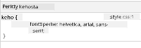
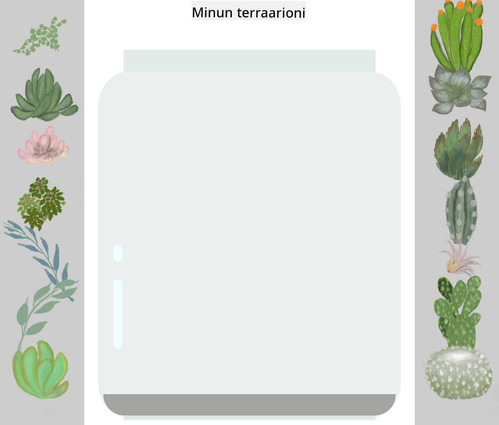

<!--
CO_OP_TRANSLATOR_METADATA:
{
  "original_hash": "92c4431eac70670b0450b02c1d11279a",
  "translation_date": "2025-10-23T00:29:25+00:00",
  "source_file": "3-terrarium/2-intro-to-css/README.md",
  "language_code": "fi"
}
-->
# Terrarium-projekti, osa 2: Johdatus CSS:ään


> Sketchnote: [Tomomi Imura](https://twitter.com/girlie_mac)

Muistatko, kuinka HTML-terrariumisi näytti melko yksinkertaiselta? CSS:n avulla voimme muuttaa tuon yksinkertaisen rakenteen visuaalisesti houkuttelevaksi.

Jos HTML on kuin talon runko, CSS on kaikki se, mikä tekee siitä kodikkaan - maalivärit, huonekalujen järjestely, valaistus ja huoneiden välinen harmonia. Ajattele, kuinka Versailles'n palatsi alkoi yksinkertaisena metsästysmajana, mutta huolellinen koristelu ja suunnittelu muuttivat sen yhdeksi maailman upeimmista rakennuksista.

Tänään muutamme terrariumisi toimivasta tyylikkääksi. Opit sijoittamaan elementtejä tarkasti, tekemään ulkoasuista responsiivisia eri näyttökokoihin ja luomaan visuaalista vetovoimaa, joka tekee verkkosivustoista kiinnostavia.

Tämän oppitunnin lopussa näet, kuinka strateginen CSS-tyylittely voi parantaa projektiasi merkittävästi. Lisätään tyyliä terrariumiisi.

## Ennakkokysely

[Ennakkokysely](https://ff-quizzes.netlify.app/web/quiz/17)

## CSS:n perusteet

CSS:ää pidetään usein vain "kaunisteluna", mutta sen tarkoitus on paljon laajempi. CSS on kuin elokuvan ohjaaja - hallitset paitsi ulkonäköä, myös liikettä, vuorovaikutusta ja sopeutumista eri tilanteisiin.

Moderni CSS on hämmästyttävän tehokas. Voit kirjoittaa koodia, joka automaattisesti mukauttaa ulkoasuja puhelimille, tableteille ja pöytätietokoneille. Voit luoda sulavia animaatioita, jotka ohjaavat käyttäjän huomion oikeaan paikkaan. Tulokset voivat olla varsin vaikuttavia, kun kaikki toimii yhdessä.

> 💡 **Vinkki**: CSS kehittyy jatkuvasti uusien ominaisuuksien ja kykyjen myötä. Tarkista aina [CanIUse.com](https://caniuse.com) varmistaaksesi selaintuen uusille CSS-ominaisuuksille ennen niiden käyttöä tuotantoprojekteissa.

**Tässä oppitunnissa saavutamme seuraavat asiat:**
- **Luomme** täydellisen visuaalisen suunnittelun terrariumillesi modernien CSS-tekniikoiden avulla
- **Tutkimme** peruskäsitteitä, kuten kaskadia, periytymistä ja CSS-valitsimia
- **Toteutamme** responsiivisia sijoittelu- ja asettelustrategioita
- **Rakennamme** terrarium-säiliön CSS-muotojen ja tyylien avulla

### Esitietovaatimukset

Sinun tulisi olla suorittanut terrariumisi HTML-rakenne edellisestä oppitunnista ja valmistellut sen tyylittelyä varten.

> 📺 **Videomateriaali**: Katso tämä hyödyllinen video-opastus
>
> [](https://www.youtube.com/watch?v=6yIdOIV9p1I)

### CSS-tiedoston valmistelu

Ennen kuin voimme aloittaa tyylittelyn, meidän täytyy yhdistää CSS HTML:ään. Tämä yhteys kertoo selaimelle, mistä löytää terrariumimme tyyliohjeet.

Luo terrarium-kansioosi uusi tiedosto nimeltä `style.css` ja linkitä se HTML-dokumenttisi `<head>`-osioon:

```html
<link rel="stylesheet" href="./style.css" />
```

**Tämä koodi tekee seuraavaa:**
- **Luo** yhteyden HTML- ja CSS-tiedostojen välille
- **Kertoo** selaimelle, että tyylit ladataan ja sovelletaan `style.css`-tiedostosta
- **Käyttää** `rel="stylesheet"`-attribuuttia määrittääkseen, että kyseessä on CSS-tiedosto
- **Viittaa** tiedostopolkuun `href="./style.css"`

## CSS-kaskadin ymmärtäminen

Oletko koskaan miettinyt, miksi CSS:ää kutsutaan "kaskadoiviksi" tyylitiedostoiksi? Tyylit kaskadoivat alas kuin vesiputous, ja joskus ne ovat ristiriidassa keskenään.

Ajattele, kuinka sotilaallinen komentorakenne toimii - kenraalin määräys saattaa olla "kaikki joukot pukeutuvat vihreään", mutta yksikkösi erityinen määräys saattaa olla "pukeutukaa juhlapukuihin seremoniaa varten". Tarkempi ohjeistus menee etusijalle. CSS noudattaa samanlaista logiikkaa, ja tämän hierarkian ymmärtäminen tekee virheiden korjaamisesta paljon helpompaa.

### Kaskadietusijan kokeileminen

Katsotaan kaskadia toiminnassa luomalla tyyliristiriita. Lisää ensin inline-tyyli `<h1>`-tunnisteeseesi:

```html
<h1 style="color: red">My Terrarium</h1>
```

**Mitä tämä koodi tekee:**
- **Soveltaa** punaisen värin suoraan `<h1>`-elementtiin käyttämällä inline-tyylittelyä
- **Käyttää** `style`-attribuuttia upottaakseen CSS:n suoraan HTML:ään
- **Luo** korkeimman etusijatyylisäännön tälle tietylle elementille

Lisää seuraavaksi tämä sääntö `style.css`-tiedostoosi:

```css
h1 {
  color: blue;
}
```

**Yllä olevassa olemme:**
- **Määrittäneet** CSS-säännön, joka kohdistuu kaikkiin `<h1>`-elementteihin
- **Asettaneet** tekstin väriksi sinisen ulkoisen tyylitiedoston avulla
- **Luoneet** alemman etusijatyylisäännön verrattuna inline-tyyleihin

✅ **Tietotesti**: Mikä väri näkyy verkkosovelluksessasi? Miksi juuri tämä väri voittaa? Voitko keksiä tilanteita, joissa haluaisit ohittaa tyylit?

> 💡 **CSS:n etusijajärjestys (korkeimmasta matalimpaan):**
> 1. **Inline-tyylit** (style-attribuutti)
> 2. **ID:t** (#myId)
> 3. **Luokat** (.myClass) ja attribuutit
> 4. **Elementtivalitsimet** (h1, div, p)
> 5. **Selaimen oletusasetukset**

## CSS:n periytyminen käytännössä

CSS:n periytyminen toimii kuin genetiikka - elementit perivät tietyt ominaisuudet vanhemmiltaan. Jos asetat fonttiperheen body-elementille, kaikki teksti sisällä käyttää automaattisesti samaa fonttia. Se on kuin Habsburg-suvun tunnusomainen leukalinja, joka näkyi sukupolvien ajan ilman, että sitä määriteltiin jokaiselle yksilölle.

Kaikki ei kuitenkaan periydy. Tekstityylit, kuten fontit ja värit, periytyvät, mutta asettelun ominaisuudet, kuten marginaalit ja reunat, eivät. Aivan kuten lapset saattavat periä fyysisiä piirteitä, mutta eivät vanhempiensa muotivalintoja.

### Fontin periytymisen havainnointi

Katsotaan periytymistä toiminnassa asettamalla fonttiperhe `<body>`-elementille:

```css
body {
  font-family: 'Segoe UI', Tahoma, Geneva, Verdana, sans-serif;
}
```

**Mitä tässä tapahtuu:**
- **Asettaa** fonttiperheen koko sivulle kohdistamalla `<body>`-elementtiin
- **Käyttää** fonttipinoa varavaihtoehtoineen paremman selaimen yhteensopivuuden takaamiseksi
- **Soveltaa** moderneja järjestelmäfontteja, jotka näyttävät hyvältä eri käyttöjärjestelmissä
- **Varmistaa**, että kaikki lapsielementit perivät tämän fontin, ellei niitä erikseen ohiteta

Avaa selaimesi kehittäjätyökalut (F12), siirry Elements-välilehteen ja tarkastele `<h1>`-elementtiäsi. Näet, että se perii fonttiperheen body-elementistä:



✅ **Kokeiluaika**: Kokeile asettaa muita periytyviä ominaisuuksia `<body>`-elementille, kuten `color`, `line-height` tai `text-align`. Mitä tapahtuu otsikolle ja muille elementeille?

> 📝 **Periytyvät ominaisuudet**: `color`, `font-family`, `font-size`, `line-height`, `text-align`, `visibility`
>
> **Ei-periytyvät ominaisuudet**: `margin`, `padding`, `border`, `width`, `height`, `position`

## CSS-valitsimien hallinta

CSS-valitsimet ovat tapa kohdistaa tiettyjä elementtejä tyylittelyä varten. Ne toimivat kuin tarkat ohjeet - sen sijaan, että sanoisit "talo", voisit sanoa "sininen talo, jossa on punainen ovi Maple Streetillä."

CSS tarjoaa erilaisia tapoja olla tarkka, ja oikean valitsimen valitseminen on kuin sopivan työkalun valitseminen tehtävään. Joskus sinun täytyy tyylitellä kaikki naapuruston ovet, ja joskus vain yksi tietty ovi.

### Elementtivalitsimet (Tunnisteet)

Elementtivalitsimet kohdistavat HTML-elementtejä niiden tunnistenimen perusteella. Ne ovat täydellisiä perusmuotoilujen asettamiseen, jotka koskevat laajasti sivuasi:

```css
body {
  font-family: 'Segoe UI', Tahoma, Geneva, Verdana, sans-serif;
  margin: 0;
  padding: 0;
}

h1 {
  color: #3a241d;
  text-align: center;
  font-size: 2.5rem;
  margin-bottom: 1rem;
}
```

**Näiden tyylien ymmärtäminen:**
- **Asettaa** johdonmukaisen typografian koko sivulle `body`-valitsimen avulla
- **Poistaa** selaimen oletusmarginaalit ja -täytteet paremman hallinnan vuoksi
- **Tyylittelee** kaikki otsikkoelementit värillä, kohdistuksella ja välistyksellä
- **Käyttää** `rem`-yksiköitä skaalautuvaan ja saavutettavaan fonttikokoon

Vaikka elementtivalitsimet toimivat hyvin yleiseen tyylittelyyn, tarvitset tarkempia valitsimia yksittäisten komponenttien, kuten terrariumin kasvien, tyylittelyyn.

### ID-valitsimet yksittäisille elementeille

ID-valitsimet käyttävät `#`-symbolia ja kohdistavat elementtejä, joilla on tietty `id`-attribuutti. Koska ID:t ovat ainutlaatuisia sivulla, ne sopivat täydellisesti yksittäisten, erityisten elementtien, kuten vasemman ja oikean kasvisäiliön, tyylittelyyn.

Luodaan tyylittely terrariumin sivusäiliöille, joissa kasvit sijaitsevat:

```css
#left-container {
  background-color: #f5f5f5;
  width: 15%;
  left: 0;
  top: 0;
  position: absolute;
  height: 100vh;
  padding: 1rem;
  box-sizing: border-box;
}

#right-container {
  background-color: #f5f5f5;
  width: 15%;
  right: 0;
  top: 0;
  position: absolute;
  height: 100vh;
  padding: 1rem;
  box-sizing: border-box;
}
```

**Tämä koodi tekee seuraavaa:**
- **Sijoittaa** säiliöt vasempaan ja oikeaan reunaan käyttämällä `absolute`-sijoittelua
- **Käyttää** `vh`-yksiköitä (näkymäkorkeus) responsiiviseen korkeuteen, joka mukautuu näytön kokoon
- **Soveltaa** `box-sizing: border-box` -asetusta, jotta täyte sisältyy kokonaisleveyteen
- **Poistaa** tarpeettomat `px`-yksiköt nolla-arvoista siistimmän koodin vuoksi
- **Asettaa** hienovaraisen taustavärin, joka on silmille miellyttävämpi kuin kirkas harmaa

✅ **Koodin laatuhaaste**: Huomaa, kuinka tämä CSS rikkoo DRY (Don't Repeat Yourself) -periaatetta. Voitko refaktoroida sen käyttämällä sekä ID:tä että luokkaa?

**Parannettu lähestymistapa:**
```html
<div id="left-container" class="container"></div>
<div id="right-container" class="container"></div>
```

```css
.container {
  background-color: #f5f5f5;
  width: 15%;
  top: 0;
  position: absolute;
  height: 100vh;
  padding: 1rem;
  box-sizing: border-box;
}

#left-container {
  left: 0;
}

#right-container {
  right: 0;
}
```

### Luokkavalitsimet uudelleenkäytettäville tyyleille

Luokkavalitsimet käyttävät `.`-symbolia ja sopivat, kun haluat soveltaa samoja tyylejä useisiin elementteihin. Toisin kuin ID:t, luokkia voidaan käyttää uudelleen HTML:ssä, mikä tekee niistä ihanteellisia johdonmukaisten tyylimallien luomiseen.

Terrariumissamme jokainen kasvi tarvitsee samanlaista tyylittelyä, mutta myös yksilöllistä sijoittelua. Käytämme yhdistelmää luokkia yhteisiin tyyleihin ja ID:tä yksilölliseen sijoitteluun.

**Tässä on kunkin kasvin HTML-rakenne:**
```html
<div class="plant-holder">
  
</div>
```

**Keskeiset elementit selitettynä:**
- **Käyttää** `class="plant-holder"` johdonmukaiseen säiliötyylittelyyn kaikille kasveille
- **Soveltaa** `class="plant"` yhteiseen kuvatyylittelyyn ja käyttäytymiseen
- **Sisältää** yksilöllisen `id="plant1"` yksilölliseen sijoitteluun ja JavaScript-vuorovaikutukseen
- **Tarjoaa** kuvailevan alt-tekstin ruudunlukijan saavutettavuuden vuoksi

Lisää nämä tyylit `style.css`-tiedostoosi:

```css
.plant-holder {
  position: relative;
  height: 13%;
  left: -0.6rem;
}

.plant {
  position: absolute;
  max-width: 150%;
  max-height: 150%;
  z-index: 2;
  transition: transform 0.3s ease;
}

.plant:hover {
  transform: scale(1.05);
}
```

**Näiden tyylien erittely:**
- **Luo** suhteellisen sijoittelun kasvisäiliölle sijoittelukontekstin luomiseksi
- **Asettaa** kunkin kasvisäiliön korkeudeksi 13 %, varmistaen, että kaikki kasvit mahtuvat pystysuunnassa ilman vieritystä
- **Siirtää** säiliöitä hieman vasemmalle, jotta kasvit keskittyvät paremmin säiliöissään
- **Mahdollistaa** kasvien skaalautumisen responsiivisesti `max-width`- ja `max-height`-ominaisuuksilla
- **Käyttää** `z-index`-arvoa kasvien kerrostamiseen muiden terrariumin elementtien yläpuolelle
- **Lisää** hienovaraisen hover-efektin CSS-siirtymillä paremman käyttäjäkokemuksen vuoksi

✅ **Kriittinen ajattelu**: Miksi tarvitsemme sekä `.plant-holder` että `.plant` -valitsimet? Mitä tapahtuisi, jos yrittäisimme käyttää vain yhtä?

> 💡 **Suunnittelumalli**: Säiliö (`.plant-holder`) hallitsee asettelua ja sijoittelua, kun taas sisältö (`.plant`) hallitsee ulkonäköä ja skaalautumista. Tämä erottelu tekee koodista helpommin ylläpidettävän ja joustavamman.

## CSS-sijoittelun ymmärtäminen

CSS-sijoittelu on kuin näytelmän ohjaaja - ohjaat, missä kukin näyttelijä seisoo ja miten he liikkuvat lavalla. Jotkut näyttelijät noudattavat normaalia muodostelmaa, kun taas toiset tarvitsevat erityistä sijoittelua dramaattisen vaikutuksen vuoksi.

Kun ymmärrät sijoittelun, monet asetteluun liittyvät haasteet muuttuvat hallittaviksi. Tarvitsetko navigointipalkin, joka pysyy ylhäällä käyttäjän vierittäessä? Sijoittelu hoitaa sen. Haluatko työkaluvihjeen, joka ilmestyy tiettyyn paikkaan? Se on myös sijoittelua.

### Viisi sijoittelu-arvoa

| Sijoittelu-arvo | Käyttäytyminen | Käyttötapaus |
|------------------|----------------|--------------|
| `static` | Oletusvirtaus, ei huomioi top/left/right/bottom | Normaali dokumenttiasettelu |
| `relative` | Sijoitettu suhteessa normaaliin sijaintiinsa | Pienet säädöt, sijoittelukontekstin luominen |
| `absolute` | Sijoitettu lähimpään sijoitettuun esivanhempaan | Tarkka sijoittelu, päällekkäisyydet |
| `fixed` | Sijoitettu suhteessa näkymään | Navigointipalkit, kelluvat elementit |
| `sticky` | Vaihtaa suhteellisen ja kiinteän välillä vierityksen mukaan | Otsikot, jotka pysyvät vierityksen aikana |

### Sijoittelu terrariumissamme

Terrariumissamme käytetään strategista yhdistelmää sijoittelutyyppejä halutun ulkoasun luomiseksi:

```css
/* Container positioning */
.container {
  position: absolute; /* Removes from normal flow */
  /* ... other styles ... */
}

/* Plant holder positioning */
.plant-holder {
  position: relative; /* Creates positioning context */
  /* ... other styles ... */
}

/* Plant positioning */
.plant {
  position: absolute; /* Allows precise placement within holder */
  /* ... other styles ... */
}
```

**Sijoittelustrategian ymmärtäminen:**
- **Absoluuttiset säiliöt** poistetaan normaalista dokumenttivirrasta ja kiinnitetään näytön reunoihin
- **Suhteelliset kasvisäiliöt** luovat sijoittelukontekstin pysyen samalla dokumenttivirrassa
- **Absoluuttiset kasvit** voidaan sijoittaa tarkasti suhteellisten säiliöiden sisällä
- **Tämä yhdistelmä** mahdollistaa kasvien pinoamisen pystysuunnassa samalla, kun ne ovat yksilöllisesti sijoitettavissa

> 🎯 **Miksi tämä on tärkeää**: `plant`-elementtien täytyy olla absoluuttisesti sijoitettuja, jotta ne voidaan siirtää seuraavassa oppitunnissa. Absoluuttinen sijoittelu poistaa ne normaalista asetteluvirrasta, mikä tekee vedä ja pudota -vuorovaikutuksista mahdollisia.

✅ **Kokeiluaika**: Kokeile
Rakennetaan terraario purkki pala palalta. Jokainen osa käyttää absoluuttista sijoittelua ja prosenttipohjaista mitoitusta responsiivisen suunnittelun saavuttamiseksi:

```css
.jar-walls {
  height: 80%;
  width: 60%;
  background: #d1e1df;
  border-radius: 1rem;
  position: absolute;
  bottom: 0.5%;
  left: 20%;
  opacity: 0.5;
  z-index: 1;
  box-shadow: inset 0 0 2rem rgba(0, 0, 0, 0.1);
}

.jar-top {
  width: 50%;
  height: 5%;
  background: #d1e1df;
  position: absolute;
  bottom: 80.5%;
  left: 25%;
  opacity: 0.7;
  z-index: 1;
  border-radius: 0.5rem 0.5rem 0 0;
}

.jar-bottom {
  width: 50%;
  height: 1%;
  background: #d1e1df;
  position: absolute;
  bottom: 0;
  left: 25%;
  opacity: 0.7;
  border-radius: 0 0 0.5rem 0.5rem;
}

.dirt {
  width: 60%;
  height: 5%;
  background: #3a241d;
  position: absolute;
  border-radius: 0 0 1rem 1rem;
  bottom: 1%;
  left: 20%;
  opacity: 0.7;
  z-index: -1;
}
```

**Terraarion rakentamisen ymmärtäminen:**
- **Käyttää** prosenttipohjaisia mittoja skaalautuakseen responsiivisesti kaikilla näytön ko'oilla
- **Sijoittaa** elementit absoluuttisesti pinotakseen ja kohdistakseen ne tarkasti
- **Soveltaa** erilaisia läpinäkyvyyden arvoja lasin läpinäkyvyysefektin luomiseksi
- **Käyttää** `z-index`-kerrostusta, jotta kasvit näyttävät olevan purkin sisällä
- **Lisää** hienovaraisen varjostuksen ja viimeistellyn pyöristetyn reunan realistisemman ulkonäön saavuttamiseksi

### Responsiivinen suunnittelu prosenttien avulla

Huomaa, kuinka kaikki mitat käyttävät prosentteja kiinteiden pikseliarvojen sijaan:

**Miksi tämä on tärkeää:**
- **Varmistaa**, että terraario skaalautuu suhteellisesti kaikilla näytön ko'oilla
- **Säilyttää** visuaaliset suhteet purkin komponenttien välillä
- **Tarjoaa** yhtenäisen kokemuksen mobiilipuhelimista suuriin työpöytänäyttöihin
- **Mahdollistaa**, että suunnittelu mukautuu rikkomatta visuaalista asettelua

### CSS-yksiköt käytännössä

Käytämme `rem`-yksiköitä pyöristettyjen reunojen määrittämiseen, jotka skaalautuvat suhteessa juuren fonttikokoon. Tämä luo saavutettavampia suunnitelmia, jotka kunnioittavat käyttäjän fonttiasetuksia. Lue lisää [CSS:n suhteellisista yksiköistä](https://www.w3.org/TR/css-values-3/#font-relative-lengths) virallisesta spesifikaatiosta.

✅ **Visuaalinen kokeilu**: Kokeile muuttaa näitä arvoja ja tarkkaile vaikutuksia:
- Muuta purkin läpinäkyvyys arvosta 0.5 arvoon 0.8 – miten tämä vaikuttaa lasin ulkonäköön?
- Säädä maan väriä arvosta `#3a241d` arvoon `#8B4513` – millainen visuaalinen vaikutus tällä on?
- Muuta maan `z-index` arvoksi 2 – mitä tapahtuu kerrostukselle?

---

## GitHub Copilot Agent -haaste 🚀

Käytä Agent-tilaa suorittaaksesi seuraavan haasteen:

**Kuvaus:** Luo CSS-animaatio, joka saa terraarion kasvit heilumaan kevyesti edestakaisin, simuloiden luonnollista tuulen vaikutusta. Tämä auttaa sinua harjoittelemaan CSS-animaatioita, muunnoksia ja avainkehyksiä samalla kun parannat terraarion visuaalista vetovoimaa.

**Ohje:** Lisää CSS-avainkehysanimaatiot, jotka saavat terraarion kasvit heilumaan kevyesti puolelta toiselle. Luo heilumis-animaatio, joka kiertää jokaista kasvia hieman (2-3 astetta) vasemmalle ja oikealle 3-4 sekunnin ajan, ja sovella sitä `.plant`-luokkaan. Varmista, että animaatio toistuu loputtomasti ja käyttää easing-funktiota luonnollisen liikkeen saavuttamiseksi.

Lue lisää [agent-tilasta](https://code.visualstudio.com/blogs/2025/02/24/introducing-copilot-agent-mode) täällä.

## 🚀 Haaste: Lasin heijastusten lisääminen

Valmis parantamaan terraariota realistisilla lasin heijastuksilla? Tämä tekniikka lisää syvyyttä ja realismia suunnitteluun.

Luot hienovaraisia korostuksia, jotka simuloivat, kuinka valo heijastuu lasipinnoilta. Tämä lähestymistapa on samanlainen kuin renessanssimaalareiden, kuten Jan van Eyckin, käyttämä tekniikka, jolla maalattu lasi saatiin näyttämään kolmiulotteiselta. Tässä on tavoitteenasi:



**Haasteesi:**
- **Luo** hienovaraisia valkoisia tai vaaleanvärisiä soikeita muotoja lasin heijastuksille
- **Sijoita** ne strategisesti purkin vasemmalle puolelle
- **Sovella** sopivia läpinäkyvyys- ja blur-efektejä realistisen valon heijastuksen saavuttamiseksi
- **Käytä** `border-radius`-ominaisuutta luodaksesi orgaanisia, kuplamaisia muotoja
- **Kokeile** gradientteja tai varjostuksia realistisuuden lisäämiseksi

## Luentojälkeinen kysely

[Luentojälkeinen kysely](https://ff-quizzes.netlify.app/web/quiz/18)

## Laajenna CSS-osaamistasi

CSS voi aluksi tuntua monimutkaiselta, mutta näiden ydinkonseptien ymmärtäminen tarjoaa vankan pohjan edistyneemmille tekniikoille.

**Seuraavat CSS-oppimisalueesi:**
- **Flexbox** - yksinkertaistaa elementtien kohdistamista ja jakelua
- **CSS Grid** - tarjoaa tehokkaita työkaluja monimutkaisten asettelujen luomiseen
- **CSS-muuttujat** - vähentää toistoa ja parantaa ylläpidettävyyttä
- **Responsiivinen suunnittelu** - varmistaa, että sivustot toimivat hyvin eri näytön ko'oilla

### Interaktiiviset oppimisresurssit

Harjoittele näitä konsepteja näiden mukaansatempaavien, käytännönläheisten pelien avulla:
- 🐸 [Flexbox Froggy](https://flexboxfroggy.com/) - Hallitse Flexbox hauskojen haasteiden avulla
- 🌱 [Grid Garden](https://codepip.com/games/grid-garden/) - Opettele CSS Grid viljelemällä virtuaalisia porkkanoita
- 🎯 [CSS Battle](https://cssbattle.dev/) - Testaa CSS-taitojasi koodaushaasteilla

### Lisäoppiminen

CSS:n perusteiden kattavaan oppimiseen suorita tämä Microsoft Learn -moduuli: [Muotoile HTML-sovelluksesi CSS:llä](https://docs.microsoft.com/learn/modules/build-simple-website/4-css-basics/?WT.mc_id=academic-77807-sagibbon)

## Tehtävä

[CSS Refactoring](assignment.md)

---

**Vastuuvapauslauseke**:  
Tämä asiakirja on käännetty käyttämällä tekoälypohjaista käännöspalvelua [Co-op Translator](https://github.com/Azure/co-op-translator). Vaikka pyrimme tarkkuuteen, huomioithan, että automaattiset käännökset voivat sisältää virheitä tai epätarkkuuksia. Alkuperäinen asiakirja sen alkuperäisellä kielellä tulisi pitää ensisijaisena lähteenä. Kriittisen tiedon osalta suositellaan ammattimaista ihmiskäännöstä. Emme ole vastuussa väärinkäsityksistä tai virhetulkinnoista, jotka johtuvat tämän käännöksen käytöstä.