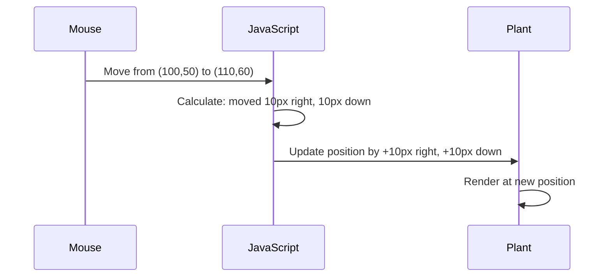

<!--
CO_OP_TRANSLATOR_METADATA:
{
  "original_hash": "bc93f6285423033ebf5b8abeb5282888",
  "translation_date": "2025-10-23T00:28:19+00:00",
  "source_file": "3-terrarium/3-intro-to-DOM-and-closures/README.md",
  "language_code": "fi"
}
-->
# Terrarium-projekti, osa 3: DOM-manipulointi ja JavaScript-sulkeet


> Sketchnote: [Tomomi Imura](https://twitter.com/girlie_mac)

Tervetuloa web-kehityksen kiehtovimpaan osaan - interaktiivisuuden luomiseen! Document Object Model (DOM) toimii sillan tavoin HTML:n ja JavaScriptin välillä, ja tänään käytämme sitä herättääksemme terrariumisi eloon. Kun Tim Berners-Lee loi ensimmäisen verkkoselaimen, hän visioi verkon, jossa dokumentit voisivat olla dynaamisia ja interaktiivisia - DOM tekee tämän vision mahdolliseksi.

Tutustumme myös JavaScript-sulkeisiin, jotka saattavat aluksi kuulostaa pelottavilta. Ajattele sulkeita "muistilokeroina", joissa funktiot voivat muistaa tärkeitä tietoja. Se on kuin jokaisella terrariumin kasvilla olisi oma tietueensa, joka seuraa sen sijaintia. Tämän oppitunnin lopussa ymmärrät, kuinka luonnollisia ja hyödyllisiä ne ovat.

Tässä on, mitä rakennamme: terrarium, jossa käyttäjät voivat siirtää kasveja mihin tahansa haluavat. Opit DOM-manipulointitekniikoita, jotka mahdollistavat kaiken drag-and-drop-tiedostojen lataamisesta interaktiivisiin peleihin. Tehdään terrariumistasi elävä.

## Ennakkokysely

[Ennakkokysely](https://ff-quizzes.netlify.app/web/quiz/19)

## Ymmärrä DOM: porttisi interaktiivisiin verkkosivuihin

Document Object Model (DOM) on tapa, jolla JavaScript kommunikoi HTML-elementtien kanssa. Kun selaimesi lataa HTML-sivun, se luo rakenteellisen esityksen sivusta muistiin - tämä on DOM. Ajattele sitä sukupuuna, jossa jokainen HTML-elementti on perheenjäsen, jonka JavaScript voi tavoittaa, muokata tai järjestää uudelleen.

DOM-manipulointi muuttaa staattiset sivut interaktiivisiksi verkkosivustoiksi. Joka kerta, kun näet painikkeen vaihtavan väriä hiiren osoittimen liikkuessa sen päällä, sisällön päivittyvän ilman sivun uudelleenlatausta tai elementtejä, joita voit siirtää, kyseessä on DOM-manipulointi.


> DOM:n ja siihen viittaavan HTML-koodin esitys. Lähde: [Olfa Nasraoui](https://www.researchgate.net/publication/221417012_Profile-Based_Focused_Crawler_for_Social_Media-Sharing_Websites)

**Mikä tekee DOM:sta tehokkaan:**
- **Tarjoaa** rakenteellisen tavan päästä käsiksi mihin tahansa elementtiin sivullasi
- **Mahdollistaa** dynaamiset sisällön päivitykset ilman sivun uudelleenlatausta
- **Sallii** reaaliaikaisen reagoinnin käyttäjän toimintoihin, kuten klikkauksiin ja siirtoihin
- **Luo** perustan moderneille interaktiivisille verkkosovelluksille

## JavaScript-sulkeet: järjestäytynyttä ja tehokasta koodia

[JavaScript-sulke](https://developer.mozilla.org/docs/Web/JavaScript/Closures) on kuin antaisi funktiolle oman yksityisen työtilan, jossa on pysyvä muisti. Mieti, kuinka Darwinin peipot Galápagossaarilla kehittivät erikoistuneita nokkia ympäristönsä mukaan - sulkeet toimivat samalla tavalla, luoden erikoistuneita funktioita, jotka "muistavat" oman kontekstinsa, vaikka niiden vanhempi funktio olisi jo päättynyt.

Terrariumissamme sulkeet auttavat jokaista kasvia muistamaan oman sijaintinsa itsenäisesti. Tämä malli esiintyy laajalti ammattimaisessa JavaScript-kehityksessä, joten sen ymmärtäminen on arvokasta.

> 💡 **Sulkeiden ymmärtäminen**: Sulkeet ovat merkittävä aihe JavaScriptissä, ja monet kehittäjät käyttävät niitä vuosia ennen kuin ymmärtävät täysin kaikki teoreettiset näkökohdat. Tänään keskitymme käytännön sovelluksiin - näet, kuinka sulkeet syntyvät luonnollisesti, kun rakennamme interaktiivisia ominaisuuksia. Ymmärrys kehittyy, kun näet, kuinka ne ratkaisevat todellisia ongelmia.


> DOM:n ja siihen viittaavan HTML-koodin esitys. Lähde: [Olfa Nasraoui](https://www.researchgate.net/publication/221417012_Profile-Based_Focused_Crawler_for_Social_Media-Sharing_Websites)

Tässä oppitunnissa viimeistelemme interaktiivisen terrarium-projektimme luomalla JavaScriptin, joka mahdollistaa käyttäjän manipuloida kasveja sivulla.

## Ennen kuin aloitamme: Valmistautuminen onnistumiseen

Tarvitset HTML- ja CSS-tiedostosi edellisistä terrarium-oppitunneista - olemme juuri tekemässä staattisesta suunnittelusta interaktiivisen. Jos olet mukana ensimmäistä kertaa, aiempien oppituntien suorittaminen tarjoaa tärkeää kontekstia.

Tässä on, mitä rakennamme:
- **Sujuva drag-and-drop** kaikille terrariumin kasveille
- **Koordinaattien seuranta**, jotta kasvit muistavat sijaintinsa
- **Täydellinen interaktiivinen käyttöliittymä** käyttämällä pelkkää JavaScriptiä
- **Siisti ja järjestäytynyt koodi** sulkemismallien avulla

## JavaScript-tiedoston luominen

Luodaan JavaScript-tiedosto, joka tekee terrariumistasi interaktiivisen.

**Vaihe 1: Luo skriptitiedosto**

Luo terrarium-kansioosi uusi tiedosto nimeltä `script.js`.

**Vaihe 2: Linkitä JavaScript HTML-tiedostoon**

Lisää tämä skriptitag HTML-tiedostosi `<head>`-osioon:

```html
<script src="./script.js" defer></script>
```

**Miksi `defer`-attribuutti on tärkeä:**
- **Varmistaa**, että JavaScript odottaa, kunnes kaikki HTML on ladattu
- **Estää** virheet, joissa JavaScript etsii elementtejä, jotka eivät ole vielä valmiita
- **Takaa**, että kaikki kasvielementit ovat käytettävissä interaktiota varten
- **Tarjoaa** paremman suorituskyvyn kuin skriptien sijoittaminen sivun alareunaan

> ⚠️ **Tärkeä huomautus**: `defer`-attribuutti estää yleisiä ajoitusongelmia. Ilman sitä JavaScript saattaa yrittää käyttää HTML-elementtejä ennen niiden latautumista, mikä aiheuttaa virheitä.

---

## JavaScriptin yhdistäminen HTML-elementteihin

Ennen kuin voimme tehdä elementtejä siirrettäviksi, JavaScriptin täytyy löytää ne DOM:sta. Ajattele tätä kuin kirjaston luettelointijärjestelmää - kun sinulla on luettelonumero, voit löytää juuri tarvitsemasi kirjan ja käyttää sen sisältöä.

Käytämme `document.getElementById()`-metodia näiden yhteyksien luomiseen. Se on kuin tarkka arkistointijärjestelmä - annat ID:n, ja se löytää juuri tarvitsemasi elementin HTML:stä.

### Siirrettävyyden mahdollistaminen kaikille kasveille

Lisää tämä koodi `script.js`-tiedostoosi:

```javascript
// Enable drag functionality for all 14 plants
dragElement(document.getElementById('plant1'));
dragElement(document.getElementById('plant2'));
dragElement(document.getElementById('plant3'));
dragElement(document.getElementById('plant4'));
dragElement(document.getElementById('plant5'));
dragElement(document.getElementById('plant6'));
dragElement(document.getElementById('plant7'));
dragElement(document.getElementById('plant8'));
dragElement(document.getElementById('plant9'));
dragElement(document.getElementById('plant10'));
dragElement(document.getElementById('plant11'));
dragElement(document.getElementById('plant12'));
dragElement(document.getElementById('plant13'));
dragElement(document.getElementById('plant14'));
```

**Tämä koodi tekee seuraavaa:**
- **Löytää** jokaisen kasvielementin DOM:sta sen yksilöllisen ID:n avulla
- **Hakee** JavaScript-viittauksen jokaiseen HTML-elementtiin
- **Välittää** jokaisen elementin `dragElement`-funktiolle (jonka luomme seuraavaksi)
- **Valmistelee** jokaisen kasvin drag-and-drop-interaktiota varten
- **Yhdistää** HTML-rakenteesi JavaScript-toiminnallisuuteen

> 🎯 **Miksi käyttää ID:tä luokkien sijaan?** ID:t tarjoavat yksilöllisiä tunnisteita tietyille elementeille, kun taas CSS-luokat on suunniteltu ryhmien tyylittelyyn. Kun JavaScriptin täytyy manipuloida yksittäisiä elementtejä, ID:t tarjoavat tarvitsemamme tarkkuuden ja suorituskyvyn.

> 💡 **Vinkki**: Huomaa, kuinka kutsumme `dragElement()`-funktiota erikseen jokaiselle kasville. Tämä lähestymistapa varmistaa, että jokainen kasvi saa oman itsenäisen siirtokäyttäytymisensä, mikä on olennaista sujuvan käyttäjäkokemuksen kannalta.

---

## Drag-elementin sulkeen rakentaminen

Nyt luomme siirtotoiminnallisuuden ytimen: sulkeen, joka hallitsee jokaisen kasvin siirtokäyttäytymistä. Tämä sulke sisältää useita sisäisiä funktioita, jotka toimivat yhdessä seuratakseen hiiren liikkeitä ja päivittääkseen elementtien sijainteja.

Sulkeet ovat täydellisiä tähän tehtävään, koska ne mahdollistavat "yksityisten" muuttujien luomisen, jotka säilyvät funktiokutsujen välillä, antaen jokaiselle kasville oman itsenäisen koordinaattien seurantajärjestelmän.

### Sulkeiden ymmärtäminen yksinkertaisella esimerkillä

Annetaan sulkeista yksinkertainen esimerkki, joka havainnollistaa konseptia:

```javascript
function createCounter() {
    let count = 0; // This is like a private variable
    
    function increment() {
        count++; // The inner function remembers the outer variable
        return count;
    }
    
    return increment; // We're giving back the inner function
}

const myCounter = createCounter();
console.log(myCounter()); // 1
console.log(myCounter()); // 2
```

**Tässä sulkemismallissa tapahtuu seuraavaa:**
- **Luo** yksityisen `count`-muuttujan, joka on olemassa vain tämän sulkeen sisällä
- **Sisäinen funktio** voi käyttää ja muokata ulkoista muuttujaa (sulkemismekanismi)
- **Kun palautamme** sisäisen funktion, se säilyttää yhteyden yksityisiin tietoihin
- **Vaikka** `createCounter()` suoritus päättyy, `count` säilyy ja muistaa arvonsa

### Miksi sulkeet sopivat täydellisesti siirtotoiminnallisuuteen

Terrariumissamme jokaisen kasvin täytyy muistaa nykyiset sijaintikoordinaattinsa. Sulkeet tarjoavat täydellisen ratkaisun:

**Keskeiset hyödyt projektissamme:**
- **Säilyttää** yksityiset sijaintimuuttujat jokaiselle kasville itsenäisesti
- **Säilyttää** koordinaattitiedot siirtotapahtumien välillä
- **Estää** muuttujien ristiriidat eri siirrettävien elementtien välillä
- **Luo** siistin ja järjestäytyneen koodirakenteen

> 🎯 **Oppimistavoite**: Sinun ei tarvitse hallita kaikkia sulkeiden teoreettisia puolia juuri nyt. Keskity siihen, kuinka ne auttavat meitä järjestämään koodia ja ylläpitämään tilaa siirtotoiminnallisuudelle.

### DragElement-funktion luominen

Rakennetaan nyt pääfunktio, joka käsittelee kaiken siirtologiikan. Lisää tämä funktio kasvielementtien määrittelyjen alle:

```javascript
function dragElement(terrariumElement) {
    // Initialize position tracking variables
    let pos1 = 0,  // Previous mouse X position
        pos2 = 0,  // Previous mouse Y position  
        pos3 = 0,  // Current mouse X position
        pos4 = 0;  // Current mouse Y position
    
    // Set up the initial drag event listener
    terrariumElement.onpointerdown = pointerDrag;
}
```

**Sijainnin seurantajärjestelmän ymmärtäminen:**
- **`pos1` ja `pos2`**: Tallentavat eron vanhojen ja uusien hiiren sijaintien välillä
- **`pos3` ja `pos4`**: Seuraavat nykyisiä hiiren koordinaatteja
- **`terrariumElement`**: Tietty kasvielementti, jota teemme siirrettäväksi
- **`onpointerdown`**: Tapahtuma, joka käynnistyy, kun käyttäjä aloittaa siirtämisen

**Sulkemismallin toiminta:**
- **Luo** yksityiset sijaintimuuttujat jokaiselle kasvielementille
- **Säilyttää** nämä muuttujat koko siirtosykliä varten
- **Varmistaa**, että jokainen kasvi seuraa omia koordinaattejaan itsenäisesti
- **Tarjoaa** siistin käyttöliittymän `dragElement`-funktion kautta

### Miksi käyttää osoitintapahtumia?

Saatat ihmetellä, miksi käytämme `onpointerdown`-tapahtumaa emmekä tutumpaa `onclick`-tapahtumaa. Tässä syy:

| Tapahtumatyyppi | Paras käyttö | Haittapuoli |
|-----------------|-------------|-------------|
| `onclick` | Yksinkertaiset painallukset | Ei voi käsitellä siirtämistä (vain klikkaukset ja vapautukset) |
| `onpointerdown` | Sekä hiiri että kosketus | Uudempi, mutta nykyään hyvin tuettu |
| `onmousedown` | Vain työpöytähiiri | Jättää mobiilikäyttäjät ulkopuolelle |

**Miksi osoitintapahtumat sopivat täydellisesti siihen, mitä rakennamme:**
- **Toimii hyvin**, käytitpä hiirtä, sormea tai jopa kynää
- **Tuntuu samalta** kannettavalla, tabletilla tai puhelimella
- **Käsittelee** varsinaista siirtoliikettä (ei vain klikkausta ja vapautusta)
- **Luo** sujuvan kokemuksen, jota käyttäjät odottavat moderneilta verkkosovelluksilta

> 💡 **Tulevaisuuden varmistaminen**: Osoitintapahtumat ovat moderni tapa käsitellä käyttäjän vuorovaikutuksia. Sen sijaan, että kirjoittaisit erillistä koodia hiirelle ja kosketukselle, saat molemmat ilmaiseksi. Aika kätevää, eikö?

---

## PointerDrag-funktio: Siirron aloituksen tallentaminen

Kun käyttäjä painaa kasvia (hiiren klikkauksella tai sormella), `pointerDrag`-funktio aktivoituu. Tämä funktio tallentaa alkuperäiset koordinaatit ja asettaa siirtojärjestelmän.

Lisää tämä funktio `dragElement`-sulkeen sisälle, heti rivin `terrariumElement.onpointerdown = pointerDrag;` jälkeen:

```javascript
function pointerDrag(e) {
    // Prevent default browser behavior (like text selection)
    e.preventDefault();
    
    // Capture the initial mouse/touch position
    pos3 = e.clientX;  // X coordinate where drag started
    pos4 = e.clientY;  // Y coordinate where drag started
    
    // Set up event listeners for the dragging process
    document.onpointermove = elementDrag;
    document.onpointerup = stopElementDrag;
}
```

**Askel askeleelta, mitä tapahtuu:**
- **Estää** oletusselaimen käyttäytymisen, joka voisi häiritä siirtämistä
- **Tallentaa** tarkat koordinaatit, joissa käyttäjä aloitti siirtoliikkeen
- **Asettaa** tapahtumakuuntelijat jatkuvalle siirtoliikkeelle
- **Valmistelee** järjestelmän seuraamaan hiiren/sormen liikettä koko dokumentin alueella

### Tapahtumien estämisen ymmärtäminen

Rivi `e.preventDefault()` on olennainen sujuvan siirtämisen kannalta:

**Ilman estämistä selaimet saattavat:**
- **Valita** tekstiä siirrettäessä sivua pitkin
- **Käynnistää** kontekstivalikoita oikean klikkauksen siirrossa
- **Häiritä** mukautettua siirtokäyttäytymistä
- **Luoda** visuaalisia artefakteja siirtotoiminnon aikana

> 🔍 **Kokeile**: Kun olet suorittanut tämän oppitunnin, kokeile poistaa `e.preventDefault()` ja katso, miten se vaikuttaa siirtokokemukseen. Ymmärrät nopeasti, miksi tämä rivi on olennainen!

### Koordinaattien seurantajärjestelmä

Ominaisuudet `e.clientX` ja `e.clientY` antavat meille tarkat hiiren/kosketuksen koordinaatit:

| Ominaisuus | Mitä se mittaa | Käyttötarkoitus |
|------------|----------------|-----------------|
| `clientX` | Vaakasuora sijainti suhteessa näkymään | Vasemman-oikean liikkeen seuranta |
| `clientY` | Pystysuora sijainti suhteessa näkymään | Ylös-alas liikkeen seuranta |

**Näiden koordinaattien ymmärtäminen:**
- **Tarjoaa** pikselintarkkaa sijaintitietoa
- **Päivittyy** reaaliajassa käyttäjän liikuttaessa osoitinta
- **Säilyy** johdonmukaisena eri näyttökokojen ja zoomaustasojen välillä
- **Mahdollistaa** sujuvat, responsiiviset siirtotoiminnot

### Dokumenttitason tapahtumakuuntelijoiden asettaminen

Huomaa, kuinka liitämme liike- ja lopetustapahtumat koko `document`-elementtiin, ei vain kasvielementtiin:

```javascript
document.onpointermove = elementDrag;
document.onpointerup = stopElementDrag;
```

**Miksi liittää dokumenttiin:**
- **Jatkaa** seurantaa, vaikka hiiri poistuisi kasvielementistä
- **Estää** siirron keskeytymisen, jos käyttäjä liikkuu nopeasti
- **Tarjoaa** sujuvan siirtämisen koko näytön alueella
- **Käsittelee** reunatapaukset, joissa osoitin siirtyy selaimen ikkunan ulkopuolelle

> ⚡ **Suorituskykyhuomio**: Puhdistamme nämä dokumenttitason kuuntelijat, kun siirto päättyy, välttääksemme muistivuodot ja suorituskykyongelmat.

## Siirtojärjestelmän viimeistely: Liike ja siivous

Lisät
- **`pos3` ja `pos4`**: Tallentavat hiiren nykyisen sijainnin seuraavaa laskentaa varten  
- **`offsetTop` ja `offsetLeft`**: Hakevat elementin nykyisen sijainnin sivulla  
- **Vähennyslogiikka**: Siirtää elementtiä saman verran kuin hiiri liikkuu  

**Liikkeen laskennan erittely:**  
1. **Mittaa** vanhan ja uuden hiiren sijainnin välisen eron  
2. **Laskee**, kuinka paljon elementtiä tulee siirtää hiiren liikkeen perusteella  
3. **Päivittää** elementin CSS-sijaintiominaisuudet reaaliajassa  
4. **Tallentaa** uuden sijainnin seuraavan liikkeen laskennan lähtökohdaksi  

### Matematiikan visuaalinen esitys  


  
### stopElementDrag-funktio: Siivous  

Lisää siivousfunktio `elementDrag`-funktion sulkevan aaltosulkeen jälkeen:  

```javascript
function stopElementDrag() {
    // Remove the document-level event listeners
    document.onpointerup = null;
    document.onpointermove = null;
}
```
  
**Miksi siivous on tärkeää:**  
- **Estää** muistivuodot jäljelle jäävistä tapahtumakuuntelijoista  
- **Lopettaa** vetämisen, kun käyttäjä vapauttaa kasvin  
- **Mahdollistaa**, että muut elementit voidaan vetää itsenäisesti  
- **Nollaa** järjestelmän seuraavaa vetotoimintoa varten  

**Mitä tapahtuu ilman siivousta:**  
- Tapahtumakuuntelijat jatkavat toimintaansa, vaikka vetäminen loppuu  
- Suorituskyky heikkenee käyttämättömien kuuntelijoiden kertyessä  
- Odottamatonta käyttäytymistä muiden elementtien kanssa  
- Selaimen resursseja tuhlaantuu tarpeettomaan tapahtumien käsittelyyn  

### CSS-sijaintiominaisuuksien ymmärtäminen  

Vetojärjestelmämme muokkaa kahta keskeistä CSS-ominaisuutta:  

| Ominaisuus | Mitä se hallitsee | Kuinka käytämme sitä |
|------------|-------------------|-----------------------|
| `top` | Etäisyys yläreunasta | Pystysuuntainen sijainti vedon aikana |
| `left` | Etäisyys vasemmasta reunasta | Vaakasuuntainen sijainti vedon aikana |

**Keskeisiä havaintoja offset-ominaisuuksista:**  
- **`offsetTop`**: Nykyinen etäisyys asemoidun vanhemman elementin yläreunasta  
- **`offsetLeft`**: Nykyinen etäisyys asemoidun vanhemman elementin vasemmasta reunasta  
- **Asemointikonteksti**: Nämä arvot ovat suhteessa lähimpään asemoituun esivanhempaan  
- **Reaaliaikaiset päivitykset**: Muutokset tapahtuvat välittömästi, kun muokkaamme CSS-ominaisuuksia  

> 🎯 **Suunnittelufilosofia**: Tämä vetojärjestelmä on tarkoituksella joustava – ei ole "pudotusalueita" tai rajoituksia. Käyttäjät voivat sijoittaa kasveja minne tahansa, mikä antaa heille täydellisen luovan vapauden terrariumin suunnittelussa.  

## Kaiken yhdistäminen: Täydellinen vetojärjestelmäsi  

Onnittelut! Olet juuri rakentanut kehittyneen vedä ja pudota -järjestelmän käyttämällä pelkkää JavaScriptiä. Täydellinen `dragElement`-funktiosi sisältää nyt tehokkaan sulkufunktion, joka hallitsee:  

**Mitä sulkusi saavuttaa:**  
- **Säilyttää** yksityiset sijaintimuuttujat jokaiselle kasville itsenäisesti  
- **Käsittelee** koko vedon elinkaaren alusta loppuun  
- **Tarjoaa** sujuvan ja responsiivisen liikkeen koko näytön alueella  
- **Siivoaa** resurssit kunnolla muistivuotojen estämiseksi  
- **Luo** intuitiivisen ja luovan käyttöliittymän terrariumin suunnitteluun  

### Testaa interaktiivista terrariumiasi  

Testaa nyt interaktiivista terrariumiasi! Avaa `index.html`-tiedosto verkkoselaimessa ja kokeile toiminnallisuutta:  

1. **Klikkaa ja pidä pohjassa** mitä tahansa kasvia aloittaaksesi vetämisen  
2. **Liikuta hiirtä tai sormea** ja katso, kuinka kasvi seuraa sujuvasti  
3. **Vapauta** pudottaaksesi kasvin uuteen sijaintiin  
4. **Kokeile** erilaisia järjestelyjä tutkiaksesi käyttöliittymää  

🥇 **Saavutus**: Olet luonut täysin interaktiivisen verkkosovelluksen käyttämällä ydinkonsepteja, joita ammattilaiskehittäjät käyttävät päivittäin. Tämä vedä ja pudota -toiminnallisuus hyödyntää samoja periaatteita kuin tiedostojen lataus, kanban-taulut ja monet muut interaktiiviset käyttöliittymät.  

  

---

## GitHub Copilot Agent -haaste 🚀  

Käytä Agent-tilaa suorittaaksesi seuraavan haasteen:  

**Kuvaus:** Paranna terrarium-projektia lisäämällä palautustoiminto, joka palauttaa kaikki kasvit alkuperäisiin paikkoihinsa sulavilla animaatioilla.  

**Ohje:** Luo palautuspainike, joka napsautettaessa animoi kaikki kasvit takaisin alkuperäisiin sivupalkin paikkoihin käyttäen CSS-siirtymiä. Funktion tulisi tallentaa alkuperäiset sijainnit sivun latautuessa ja siirtää kasvit sujuvasti takaisin näihin paikkoihin yhden sekunnin aikana, kun palautuspainiketta painetaan.  

Lisätietoja [agent mode](https://code.visualstudio.com/blogs/2025/02/24/introducing-copilot-agent-mode) -tilasta löydät täältä.  

## 🚀 Lisähaaste: Laajenna taitojasi  

Valmis viemään terrariumisi seuraavalle tasolle? Kokeile toteuttaa nämä parannukset:  

**Luovat laajennukset:**  
- **Kaksoisnapsauta** kasvia tuodaksesi sen etualalle (z-indexin manipulointi)  
- **Lisää visuaalista palautetta**, kuten hienovarainen hehku, kun viet hiiren kasvin päälle  
- **Toteuta rajat**, jotka estävät kasveja siirtymästä terrariumin ulkopuolelle  
- **Luo tallennustoiminto**, joka muistaa kasvien sijainnit käyttämällä localStoragea  
- **Lisää äänitehosteita** kasvien nostamiseen ja asettamiseen  

> 💡 **Oppimismahdollisuus**: Jokainen näistä haasteista opettaa sinulle uusia asioita DOM-manipulaatiosta, tapahtumien käsittelystä ja käyttäjäkokemuksen suunnittelusta.  

## Luentojälkeinen kysely  

[Luentojälkeinen kysely](https://ff-quizzes.netlify.app/web/quiz/20)  

## Kertaus ja itseopiskelu: Syvennä ymmärrystäsi  

Olet hallinnut DOM-manipulaation ja sulkufunktioiden perusteet, mutta aina on lisää opittavaa! Tässä muutamia polkuja, joiden avulla voit laajentaa tietämystäsi ja taitojasi.  

### Vaihtoehtoiset vedä ja pudota -lähestymistavat  

Käytimme osoitintapahtumia maksimaalisen joustavuuden saavuttamiseksi, mutta verkkokehityksessä on useita lähestymistapoja:  

| Lähestymistapa | Parhaimmillaan | Oppimisarvo |
|----------------|----------------|-------------|
| [HTML Drag and Drop API](https://developer.mozilla.org/docs/Web/API/HTML_Drag_and_Drop_API) | Tiedostojen lataukset, viralliset vetovyöhykkeet | Selaimen natiivien ominaisuuksien ymmärtäminen |
| [Kosketustapahtumat](https://developer.mozilla.org/docs/Web/API/Touch_events) | Mobiilikohtaiset vuorovaikutukset | Mobiililähtöiset kehitysmallit |
| CSS `transform` -ominaisuudet | Sulavat animaatiot | Suorituskyvyn optimointitekniikat |

### Edistyneet DOM-manipulaation aiheet  

**Seuraavat askeleet oppimismatkallasi:**  
- **Tapahtumien delegointi**: Tapahtumien tehokas käsittely useille elementeille  
- **Intersection Observer**: Havaitse, kun elementit tulevat tai poistuvat näkymästä  
- **Mutation Observer**: Seuraa muutoksia DOM-rakenteessa  
- **Web Components**: Luo uudelleenkäytettäviä, kapseloituja käyttöliittymäelementtejä  
- **Virtuaalinen DOM**: Ymmärrä, miten kehykset optimoivat DOM-päivityksiä  

### Keskeiset resurssit jatko-opiskeluun  

**Tekninen dokumentaatio:**  
- [MDN Pointer Events Guide](https://developer.mozilla.org/docs/Web/API/Pointer_events) - Kattava osoitintapahtumien viite  
- [W3C Pointer Events Specification](https://www.w3.org/TR/pointerevents1/) - Virallinen standardidokumentaatio  
- [JavaScript Closures Deep Dive](https://developer.mozilla.org/docs/Web/JavaScript/Closures) - Edistyneet sulkumallit  

**Selaimen yhteensopivuus:**  
- [CanIUse.com](https://caniuse.com/) - Tarkista ominaisuuksien tuki eri selaimissa  
- [MDN Browser Compatibility Data](https://github.com/mdn/browser-compat-data) - Yksityiskohtaiset yhteensopivuustiedot  

**Harjoittelumahdollisuudet:**  
- **Rakenna** palapeli, joka käyttää samanlaisia vetomekaniikkoja  
- **Luo** kanban-taulu, jossa on vedä ja pudota -tehtävien hallinta  
- **Suunnittele** kuvagalleria, jossa on siirrettävät valokuvajärjestelyt  
- **Kokeile** kosketuseleitä mobiilikäyttöliittymiä varten  

> 🎯 **Oppimisstrategia**: Paras tapa vahvistaa näitä konsepteja on harjoittelu. Kokeile rakentaa erilaisia vedettävien käyttöliittymien variaatioita – jokainen projekti opettaa sinulle jotain uutta käyttäjävuorovaikutuksesta ja DOM-manipulaatiosta.  

## Tehtävä  

[Työskentele hieman lisää DOM:n kanssa](assignment.md)  

---

**Vastuuvapauslauseke**:  
Tämä asiakirja on käännetty käyttämällä tekoälypohjaista käännöspalvelua [Co-op Translator](https://github.com/Azure/co-op-translator). Vaikka pyrimme tarkkuuteen, huomioithan, että automaattiset käännökset voivat sisältää virheitä tai epätarkkuuksia. Alkuperäinen asiakirja sen alkuperäisellä kielellä tulisi pitää ensisijaisena lähteenä. Kriittisen tiedon osalta suositellaan ammattimaista ihmiskäännöstä. Emme ole vastuussa väärinkäsityksistä tai virhetulkinnoista, jotka johtuvat tämän käännöksen käytöstä.