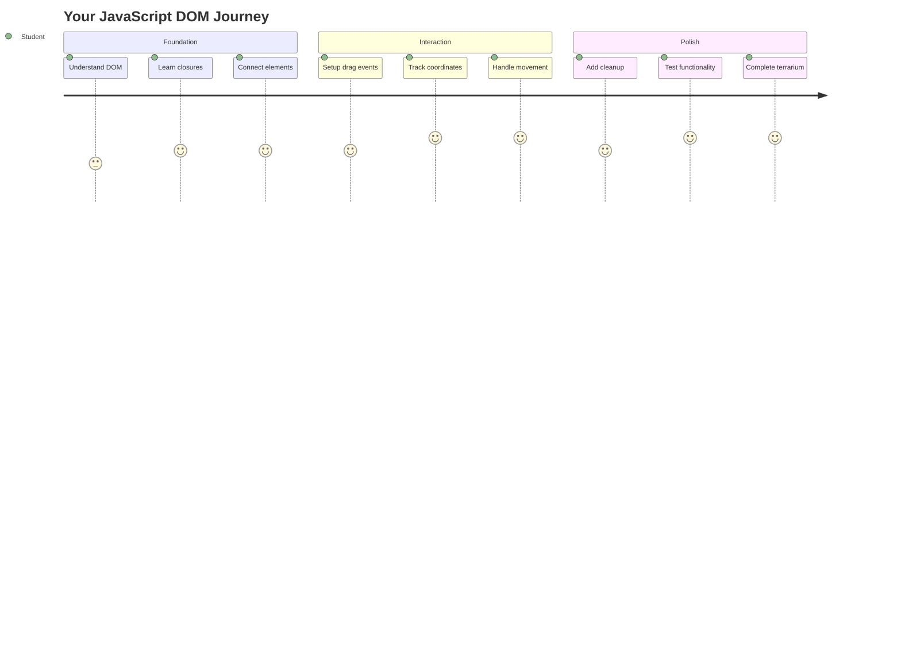
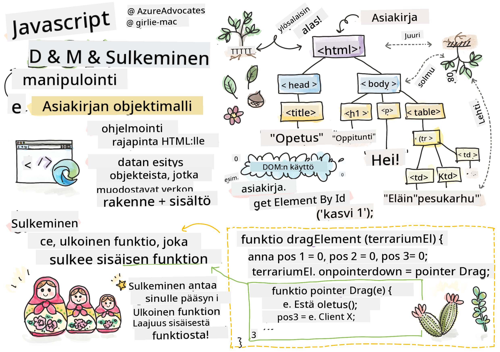
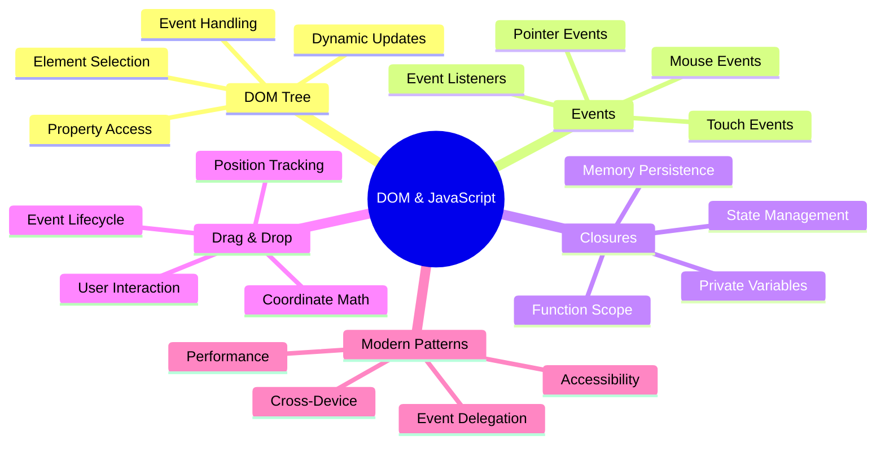
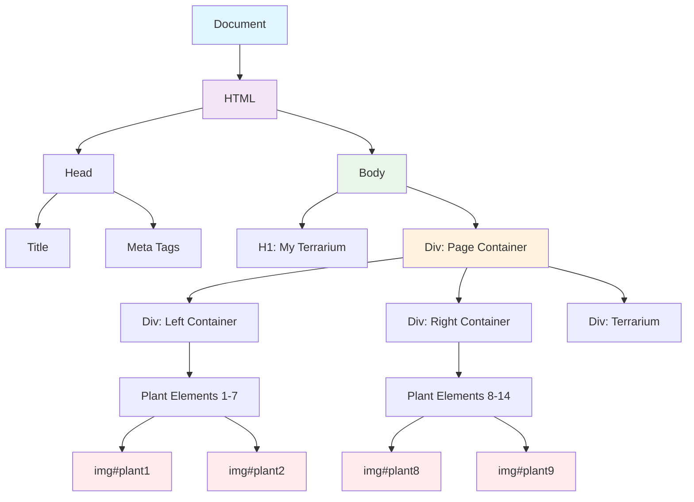
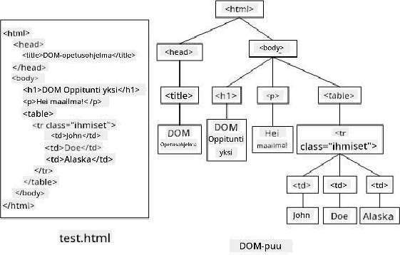
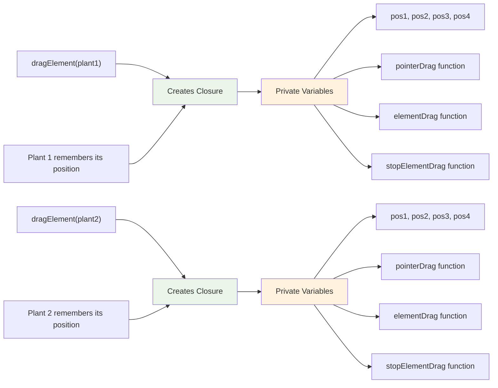
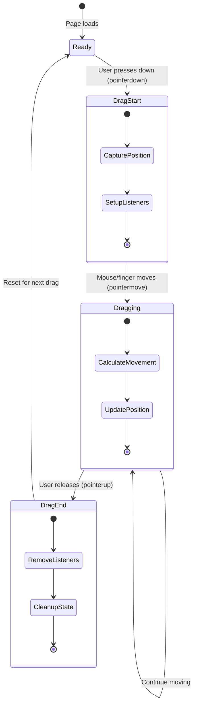
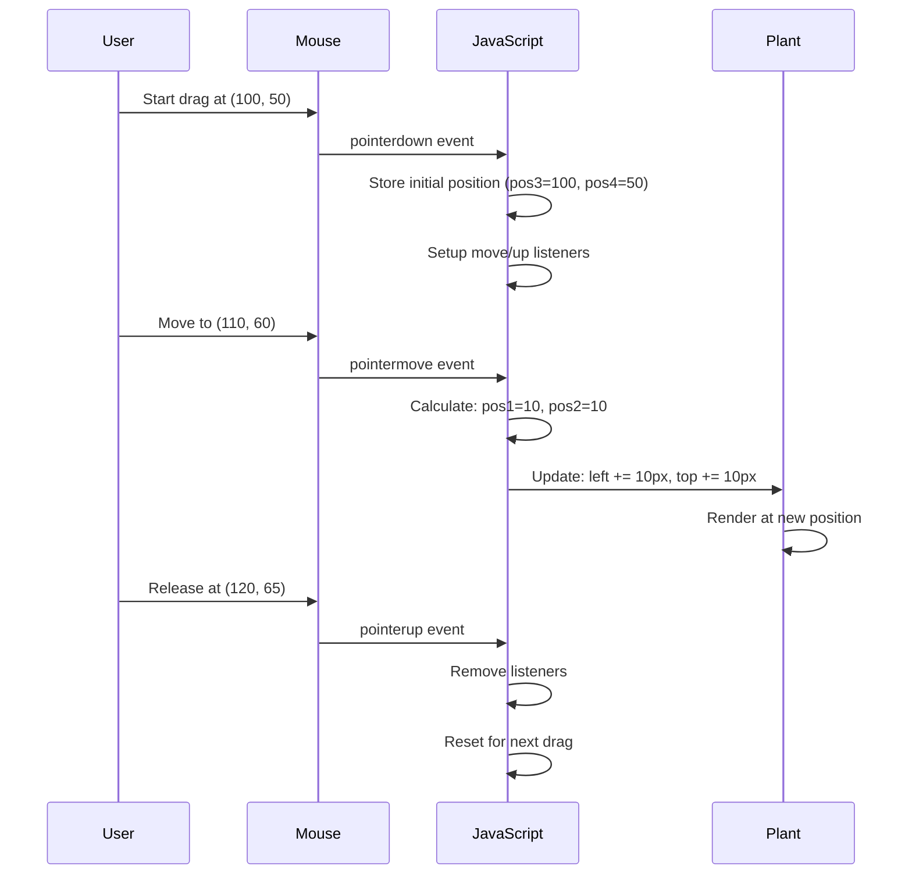
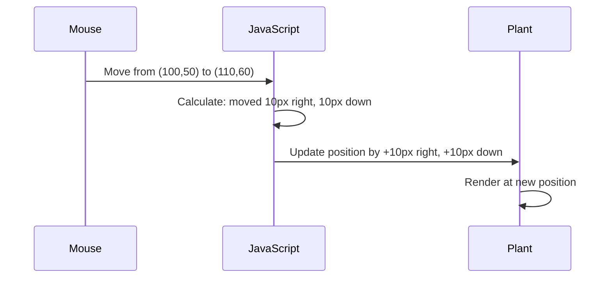
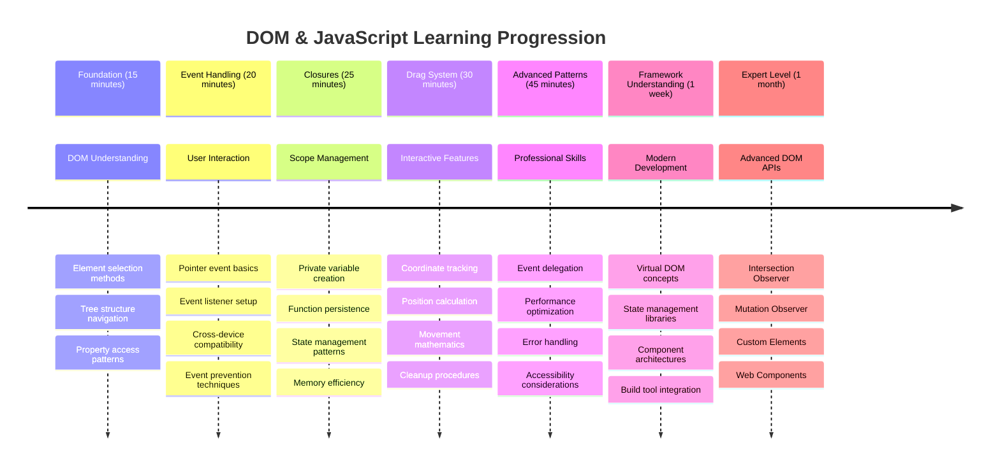

<!--
CO_OP_TRANSLATOR_METADATA:
{
  "original_hash": "973e48ad87d67bf5bb819746c9f8e302",
  "translation_date": "2025-11-04T01:27:08+00:00",
  "source_file": "3-terrarium/3-intro-to-DOM-and-closures/README.md",
  "language_code": "fi"
}
-->
# Terrarium-projekti, osa 3: DOM-manipulaatio ja JavaScript-sulkeumat




> Sketchnote: [Tomomi Imura](https://twitter.com/girlie_mac)

Tervetuloa yhteen verkkokehityksen kiehtovimmista osa-alueista – interaktiivisuuden luomiseen! Document Object Model (DOM) toimii sillan tavoin HTML:n ja JavaScriptin välillä, ja tänään käytämme sitä herättääksemme terrariosi eloon. Kun Tim Berners-Lee loi ensimmäisen verkkoselaimen, hän kuvitteli verkon, jossa dokumentit voisivat olla dynaamisia ja interaktiivisia – DOM tekee tämän vision mahdolliseksi.

Tutustumme myös JavaScript-sulkeumiin, jotka saattavat aluksi kuulostaa monimutkaisilta. Ajattele sulkeumia "muistilokeroina", joissa funktiot voivat säilyttää tärkeää tietoa. Se on kuin jokaisella terrarion kasvilla olisi oma tietueensa, joka seuraa sen sijaintia. Tämän oppitunnin lopussa ymmärrät, kuinka luonnollisia ja hyödyllisiä ne ovat.

Tässä on, mitä rakennamme: terrario, jossa käyttäjät voivat siirtää kasveja mihin tahansa haluamaansa paikkaan. Opit DOM-manipulaatiotekniikoita, jotka mahdollistavat kaiken tiedostojen vetämisestä ja pudottamisesta interaktiivisiin peleihin. Tehdään terrariostasi elävä.



## Ennakkokysely

[Ennakkokysely](https://ff-quizzes.netlify.app/web/quiz/19)

## Ymmärrä DOM: Interaktiivisten verkkosivujen portti

Document Object Model (DOM) on tapa, jolla JavaScript kommunikoi HTML-elementtien kanssa. Kun selaimesi lataa HTML-sivun, se luo rakenteellisen esityksen sivusta muistiin – tämä on DOM. Ajattele sitä sukupuuna, jossa jokainen HTML-elementti on perheenjäsen, johon JavaScript voi päästä käsiksi, muokata tai järjestellä uudelleen.

DOM-manipulaatio muuttaa staattiset sivut interaktiivisiksi verkkosivustoiksi. Joka kerta, kun näet painikkeen vaihtavan väriä hiiren osoittimen liikkuessa sen päällä, sisällön päivittyvän ilman sivun uudelleenlatausta tai elementtejä, joita voit siirtää, kyseessä on DOM-manipulaatio.





> DOM:n ja sitä vastaavan HTML-koodin esitys. Lähde: [Olfa Nasraoui](https://www.researchgate.net/publication/221417012_Profile-Based_Focused_Crawler_for_Social_Media-Sharing_Websites)

**Mikä tekee DOM:sta tehokkaan:**
- **Mahdollistaa** rakenteellisen tavan päästä käsiksi mihin tahansa elementtiin sivulla
- **Mahdollistaa** dynaamisen sisällön päivityksen ilman sivun uudelleenlatausta
- **Mahdollistaa** reaaliaikaisen reagoinnin käyttäjän toimintoihin, kuten klikkauksiin ja vetämisiin
- **Luo** perustan nykyaikaisille interaktiivisille verkkosovelluksille

## JavaScript-sulkeumat: Järjestelmällisen ja tehokkaan koodin luominen

[JavaScript-sulkeuma](https://developer.mozilla.org/docs/Web/JavaScript/Closures) on kuin antaisi funktiolle oman yksityisen työtilan, jossa on pysyvä muisti. Mieti, kuinka Darwinin peipot Galápagossaarilla kehittivät erikoistuneita nokkia ympäristönsä mukaan – sulkeumat toimivat samalla tavalla, luoden erikoistuneita funktioita, jotka "muistavat" oman kontekstinsa, vaikka niiden vanhempi funktio olisi jo suoritettu.

Terrariossamme sulkeumat auttavat jokaista kasvia muistamaan oman sijaintinsa itsenäisesti. Tämä malli esiintyy laajasti ammattimaisessa JavaScript-kehityksessä, joten sen ymmärtäminen on arvokasta.



> 💡 **Sulkeumien ymmärtäminen**: Sulkeumat ovat merkittävä aihe JavaScriptissä, ja monet kehittäjät käyttävät niitä vuosia ennen kuin täysin ymmärtävät kaikki teoreettiset näkökohdat. Tänään keskitymme käytännön sovellukseen – näet, kuinka sulkeumat syntyvät luonnollisesti interaktiivisia ominaisuuksia rakentaessamme. Ymmärrys kehittyy, kun näet, kuinka ne ratkaisevat todellisia ongelmia.


> DOM:n ja sitä vastaavan HTML-koodin esitys. Lähde: [Olfa Nasraoui](https://www.researchgate.net/publication/221417012_Profile-Based_Focused_Crawler_for_Social_Media-Sharing_Websites)

Tässä oppitunnissa viimeistelemme interaktiivisen terrarioprojektimme luomalla JavaScript-koodin, joka mahdollistaa käyttäjän kasvien siirtelyn sivulla.

## Ennen kuin aloitamme: Valmistautuminen onnistumiseen

Tarvitset HTML- ja CSS-tiedostosi edellisistä terrario-oppitunneista – olemme juuri tekemässä staattisesta suunnittelusta interaktiivista. Jos olet mukana ensimmäistä kertaa, näiden oppituntien suorittaminen ensin antaa tärkeää kontekstia.

Tässä on, mitä rakennamme:
- **Sujuva vetämis- ja pudotustoiminto** kaikille terrarion kasveille
- **Koordinaattien seuranta**, jotta kasvit muistavat sijaintinsa
- **Täydellinen interaktiivinen käyttöliittymä** pelkällä JavaScriptillä
- **Siisti ja järjestelmällinen koodi** sulkeumamallien avulla

## JavaScript-tiedoston valmistelu

Luodaan JavaScript-tiedosto, joka tekee terrariostasi interaktiivisen.

**Vaihe 1: Luo skriptitiedosto**

Luo terrario-kansioosi uusi tiedosto nimeltä `script.js`.

**Vaihe 2: Linkitä JavaScript HTML-tiedostoon**

Lisää tämä skriptitagi `index.html`-tiedostosi `<head>`-osioon:

```html
<script src="./script.js" defer></script>
```

**Miksi `defer`-attribuutti on tärkeä:**
- **Varmistaa**, että JavaScript odottaa, kunnes kaikki HTML on ladattu
- **Estää** virheet, joissa JavaScript yrittää käyttää elementtejä, jotka eivät ole vielä valmiita
- **Takaa**, että kaikki kasvielementit ovat käytettävissä interaktiota varten
- **Parantaa** suorituskykyä verrattuna skriptien sijoittamiseen sivun alareunaan

> ⚠️ **Tärkeä huomautus**: `defer`-attribuutti estää yleisiä ajoitusongelmia. Ilman sitä JavaScript saattaa yrittää käyttää HTML-elementtejä ennen niiden latautumista, mikä aiheuttaa virheitä.

---

## JavaScriptin yhdistäminen HTML-elementteihin

Ennen kuin voimme tehdä elementtejä vedettäviksi, JavaScriptin täytyy löytää ne DOM:sta. Ajattele tätä kirjaston luokitusjärjestelmänä – kun sinulla on luokitusnumero, voit löytää juuri sen kirjan, jota tarvitset, ja käyttää sen sisältöä.

Käytämme `document.getElementById()`-metodia näiden yhteyksien luomiseen. Se on kuin tarkka arkistointijärjestelmä – annat ID:n, ja se löytää juuri sen elementin, jota tarvitset HTML:stä.

### Vetotoiminnon mahdollistaminen kaikille kasveille

Lisää tämä koodi `script.js`-tiedostoosi:

```javascript
// Enable drag functionality for all 14 plants
dragElement(document.getElementById('plant1'));
dragElement(document.getElementById('plant2'));
dragElement(document.getElementById('plant3'));
dragElement(document.getElementById('plant4'));
dragElement(document.getElementById('plant5'));
dragElement(document.getElementById('plant6'));
dragElement(document.getElementById('plant7'));
dragElement(document.getElementById('plant8'));
dragElement(document.getElementById('plant9'));
dragElement(document.getElementById('plant10'));
dragElement(document.getElementById('plant11'));
dragElement(document.getElementById('plant12'));
dragElement(document.getElementById('plant13'));
dragElement(document.getElementById('plant14'));
```

**Tämä koodi tekee seuraavaa:**
- **Löytää** jokaisen kasvielementin DOM:sta sen yksilöllisen ID:n avulla
- **Hakee** JavaScript-viittauksen jokaiseen HTML-elementtiin
- **Välittää** jokaisen elementin `dragElement`-funktiolle (jonka luomme seuraavaksi)
- **Valmistelee** jokaisen kasvin vetämis- ja pudotustoimintoa varten
- **Yhdistää** HTML-rakenteesi JavaScript-toiminnallisuuteen

> 🎯 **Miksi käyttää ID:tä luokkien sijaan?** ID:t tarjoavat yksilöllisiä tunnisteita tietyille elementeille, kun taas CSS-luokat on suunniteltu ryhmien tyylittelyyn. Kun JavaScriptin täytyy manipuloida yksittäisiä elementtejä, ID:t tarjoavat tarvittavan tarkkuuden ja suorituskyvyn.

> 💡 **Vinkki**: Huomaa, kuinka kutsumme `dragElement()`-funktiota erikseen jokaiselle kasville. Tämä lähestymistapa varmistaa, että jokainen kasvi saa oman itsenäisen vetokäyttäytymisensä, mikä on olennaista sujuvan käyttäjäkokemuksen kannalta.

### 🔄 **Pedagoginen tarkistus**
**DOM-yhteyden ymmärtäminen**: Ennen kuin siirrytään vetotoimintoon, varmista, että voit:
- ✅ Selittää, kuinka `document.getElementById()` löytää HTML-elementtejä
- ✅ Ymmärtää, miksi käytämme yksilöllisiä ID-tunnisteita jokaiselle kasville
- ✅ Kuvata `defer`-attribuutin tarkoituksen skriptitageissa
- ✅ Tunnistaa, kuinka JavaScript ja HTML yhdistyvät DOM:n kautta

**Nopea itsekoe**: Mitä tapahtuisi, jos kahdella elementillä olisi sama ID? Miksi `getElementById()` palauttaa vain yhden elementin?
*Vastaus: ID:n tulee olla yksilöllinen; jos niitä on useita, vain ensimmäinen elementti palautetaan*

---

## DragElement-sulkeuman rakentaminen

Nyt luomme vetotoiminnon ytimen: sulkeuman, joka hallitsee kunkin kasvin vetokäyttäytymistä. Tämä sulkeuma sisältää useita sisäisiä funktioita, jotka toimivat yhdessä seuratakseen hiiren liikkeitä ja päivittääkseen elementtien sijainteja.

Sulkeumat sopivat täydellisesti tähän tehtävään, koska ne mahdollistavat "yksityisten" muuttujien luomisen, jotka säilyvät funktiokutsujen välillä, antaen jokaiselle kasville oman itsenäisen koordinaattiseurantajärjestelmän.

### Sulkeumien ymmärtäminen yksinkertaisella esimerkillä

Näytän sulkeumat yksinkertaisella esimerkillä, joka havainnollistaa konseptia:

```javascript
function createCounter() {
    let count = 0; // This is like a private variable
    
    function increment() {
        count++; // The inner function remembers the outer variable
        return count;
    }
    
    return increment; // We're giving back the inner function
}

const myCounter = createCounter();
console.log(myCounter()); // 1
console.log(myCounter()); // 2
```

**Tässä sulkeumamallissa tapahtuu seuraavaa:**
- **Luo** yksityisen `count`-muuttujan, joka on olemassa vain tämän sulkeuman sisällä
- **Sisäinen funktio** voi käyttää ja muokata ulkoista muuttujaa (sulkeumamekanismi)
- **Kun palautamme** sisäisen funktion, se säilyttää yhteyden yksityiseen dataan
- **Vaikka** `createCounter()` suoritetaan loppuun, `count` säilyy ja muistaa arvonsa

### Miksi sulkeumat sopivat täydellisesti vetotoimintoon

Terrariossamme jokaisen kasvin täytyy muistaa nykyiset sijaintikoordinaattinsa. Sulkeumat tarjoavat täydellisen ratkaisun:

**Keskeiset hyödyt projektissamme:**
- **Säilyttää** yksityiset sijaintimuuttujat jokaiselle kasville itsenäisesti
- **Säilyttää** koordinaattidata vetotapahtumien välillä
- **Estää** muuttujien ristiriidat eri vedettävien elementtien välillä
- **Luo** siistin ja järjestelmällisen koodirakenteen

> 🎯 **Oppimistavoite**: Sinun ei tarvitse hallita kaikkia sulkeumien yksityiskohtia juuri nyt. Keskity siihen, kuinka ne auttavat meitä järjestämään koodia ja säilyttämään tilan vetotoiminnolle.



### DragElement-funktion luominen

Rakennetaan nyt pääfunktio, joka käsittelee kaiken vetämiseen liittyvän logiikan. Lisää tämä funktio kasvielementtien määrittelyjen alle:

```javascript
function dragElement(terrariumElement) {
    // Initialize position tracking variables
    let pos1 = 0,  // Previous mouse X position
        pos2 = 0,  // Previous mouse Y position  
        pos3 = 0,  // Current mouse X position
        pos4 = 0;  // Current mouse Y position
    
    // Set up the initial drag event listener
    terrariumElement.onpointerdown = pointerDrag;
}
```

**Sijaintiseurantajärjestelmän ymmärtäminen:**
- **`pos1` ja `pos2`**: Tallentavat eron vanhojen ja uusien hiiren sijaintien välillä
- **`pos3` ja `pos4`**: Seuraavat nykyisiä hiiren koordinaatteja
- **`terrariumElement`**: Tietty kasvielementti, jota teemme vedettäväksi
- **`onpointerdown`**: Tapahtuma, joka käynnistyy, kun käyttäjä aloittaa vetämisen

**Näin sulkeumamalli toimii:**
- **Luo** yksityiset sijaintimuuttujat jokaiselle kasvielementille
- **Säilyttää** nämä muuttujat koko vetämisen ajan
- **Varmistaa**, että jokainen kasvi seuraa omia koordinaattejaan itsenäisesti
- **Tarjoaa** siistin käyttöliittymän `dragElement`-funktion kautta

### Miksi käyttää osoitintapahtumia?

Saatat miettiä, miksi käytämme `onpointerdown`-tapahtumaa emmekä tutumpaa `onclick`-tapahtumaa. Tässä syy:

| Tapahtumatyyppi | Paras käyttö | Haaste |
|-----------------|-------------|--------|
| `onclick` | Yksinkertaiset painallukset | Ei voi käsitellä vetämistä (vain klikkaukset ja vapautukset) |
| `onpointerdown` | Hiiri ja kosketus | Uudempi, mutta nykyään hyvin tuettu |
| `onmousedown` | Vain hiiri | Jättää mobiilikäyttäjät ulkopuolelle |

**Miksi osoitintapahtumat sopivat täydellisesti siihen, mitä rakennamme:**
- **Toimii hyvin**, käytetäänpä hiirtä, sormea tai jopa kynää
- **Tuntuu samalta** kannettavalla, tabletilla tai puhelimella
- **Käsittelee** varsinaisen vetoliikkeen (ei vain klikkausta ja valmista)
- **Luo** sujuvan kokemuksen, jota käyttäjät odottavat nykyaikaisilta verkkosovelluksilta

> 💡 **Tulevaisuuden varmistaminen**: Osoitintapahtumat ovat moderni tapa käsitellä käyttäjän toimintoja. Sen sijaan, että kirjoittaisit erillistä koodia hiirelle ja kosketukselle, saat molemmat ilmaiseksi. Aika kätevää, eikö?

### 🔄 **Pedagoginen tarkistus**
**Tapahtumien käsittelyn ymmärtäminen**: Pysähdy varmistaaksesi tapahtumien ymmärryksen:
- ✅ Miksi käytämme osoitintapahtumia hiiritapahtumien sijaan?
- ✅ Kuinka sulkeumamuuttujat säilyvät funktiokutsujen välillä?
- ✅ Mikä rooli `preventDefault()`-metodilla on sujuvassa vetämisessä?
- ✅ Miksi liitämme kuuntelijat dokumenttiin yksittäisten elementtien sijaan?

**Yhteys todellisuuteen**: Mieti vetämis- ja pudotuskäyttöliittymiä, joita käytät päivittäin:
- **Tiedostojen lataus**: Tiedostojen vetäminen selaimen ikkunaan
- **Kanban-taulut**: Tehtävien siirtäminen sarakkeiden välillä
- **Kuvagalleriat**: Valokuvien järjestyksen muuttaminen
- **Mobiilikäyttöliittymät**: Pyyhkäisy ja vetäminen kosketusnäytöillä

---

## PointerDrag-funktio: Vetämisen aloituksen tallentaminen

Kun käyttäjä painaa kasvia (hiiren klikkauksella tai sormella), `pointerDrag`-funktio aktivoituu. Tämä funktio tallentaa alkuperäiset koordinaatit ja valmistaa vetämisjärjestelmän.

Lisää tämä funktio `dragElement`-sulkeuman sisään, heti rivin `terrariumElement.onpointerdown = pointerDrag;` jälkeen:

```javascript
function pointerDrag(e) {
    // Prevent default browser behavior (like text selection)
    e.preventDefault();
    
    // Capture the initial mouse/touch position
    pos3 = e.clientX;  // X coordinate where drag started
    pos4 = e.clientY;  // Y coordinate where drag started
    
    // Set up event listeners for the dragging process
    document.onpointermove = elementDrag;
    document.onpointerup = stopElementDrag;
}
```

**Askel askeleelta, tässä tapahtuu:**
- **Estää** oletusselaimen toiminnot, jotka voisivat häiritä vetämistä
- **Tallentaa** tarkat koordinaatit, joissa käyttäjä aloitti vetoliikkeen
- **Asettaa** tapahtumakuuntelijat jatkuvaa vetoliikettä varten
- **Valmistaa** järjestelmän seuraamaan hiiren/sormen liikettä koko dokumentin alueella

### Tapahtumien estämisen ymmärtäminen

Rivi `e.preventDefault()` on ratkaisevan tärkeä sujuvan vetämisen kannalta:

**Ilman estämistä selaimet saattavat:**
- **Valita** tekstiä vetämisen aikana
- **Käynnistää** kontekstivalikoita oikean klikkauksen vedossa
- **Häiritä** mukautettua vetokäyttäytymistä
- **Luoda** visuaalisia häiriöitä vetotoiminnon aikana

> 🔍 **Kokeile**: Kun olet suorittanut tämän oppitunnin, kokeile poistaa `e
**Näiden koordinaattien ymmärtäminen:**
- **Tarjoaa** pikselintarkkaa sijaintitietoa
- **Päivittyy** reaaliajassa, kun käyttäjä liikuttaa osoitinta
- **Pysyy** johdonmukaisena eri näyttökokojen ja zoomaustasojen välillä
- **Mahdollistaa** sujuvan ja responsiivisen vetämisen

### Dokumenttitason tapahtumakuuntelijoiden asettaminen

Huomaa, että liike- ja pysäytystapahtumat liitetään koko `document`-elementtiin, ei pelkästään kasvielementtiin:

```javascript
document.onpointermove = elementDrag;
document.onpointerup = stopElementDrag;
```

**Miksi liittää dokumenttiin:**
- **Jatkaa** seurantaa, vaikka hiiri poistuu kasvielementistä
- **Estää** vetämisen keskeytymisen, jos käyttäjä liikkuu nopeasti
- **Tarjoaa** sujuvan vetämisen koko näytön alueella
- **Käsittelee** reunatapaukset, joissa osoitin siirtyy selaimen ikkunan ulkopuolelle

> ⚡ **Suorituskykyhuomio**: Siivoamme nämä dokumenttitason kuuntelijat, kun vetäminen loppuu, jotta vältetään muistivuodot ja suorituskykyongelmat.

## Vetojärjestelmän viimeistely: liike ja siivous

Lisätään nyt kaksi jäljellä olevaa funktiota, jotka käsittelevät varsinaista vetoliikettä ja siivousta, kun vetäminen loppuu. Nämä funktiot toimivat yhdessä luoden sujuvan ja responsiivisen kasvien liikkeen terrariumissa.

### elementDrag-funktio: liikkeen seuranta

Lisää `elementDrag`-funktio heti `pointerDrag`-funktion sulkevan aaltosulkeen jälkeen:

```javascript
function elementDrag(e) {
    // Calculate the distance moved since the last event
    pos1 = pos3 - e.clientX;  // Horizontal distance moved
    pos2 = pos4 - e.clientY;  // Vertical distance moved
    
    // Update the current position tracking
    pos3 = e.clientX;  // New current X position
    pos4 = e.clientY;  // New current Y position
    
    // Apply the movement to the element's position
    terrariumElement.style.top = (terrariumElement.offsetTop - pos2) + 'px';
    terrariumElement.style.left = (terrariumElement.offsetLeft - pos1) + 'px';
}
```

**Koordinaattimatematiikan ymmärtäminen:**
- **`pos1` ja `pos2`**: Laskevat, kuinka paljon hiiri on liikkunut viime päivityksen jälkeen
- **`pos3` ja `pos4`**: Tallentavat nykyisen hiiren sijainnin seuraavaa laskentaa varten
- **`offsetTop` ja `offsetLeft`**: Hakevat elementin nykyisen sijainnin sivulla
- **Vähennyslogiikka**: Siirtää elementtiä saman verran kuin hiiri on liikkunut



**Liikelaskennan erittely:**
1. **Mittaa** vanhan ja uuden hiiren sijainnin eron
2. **Laskee**, kuinka paljon elementtiä tulee siirtää hiiren liikkeen perusteella
3. **Päivittää** elementin CSS-sijaintiominaisuudet reaaliajassa
4. **Tallentaa** uuden sijainnin seuraavan liikelaskennan lähtökohdaksi

### Matematiikan visuaalinen esitys



### stopElementDrag-funktio: siivous

Lisää siivousfunktio `elementDrag`-funktion sulkevan aaltosulkeen jälkeen:

```javascript
function stopElementDrag() {
    // Remove the document-level event listeners
    document.onpointerup = null;
    document.onpointermove = null;
}
```

**Miksi siivous on tärkeää:**
- **Estää** muistivuodot jäljelle jäävistä tapahtumakuuntelijoista
- **Lopettaa** vetokäyttäytymisen, kun käyttäjä vapauttaa kasvin
- **Mahdollistaa** muiden elementtien itsenäisen vetämisen
- **Nollaa** järjestelmän seuraavaa vetotoimintoa varten

**Mitä tapahtuu ilman siivousta:**
- Tapahtumakuuntelijat jatkavat toimintaansa, vaikka vetäminen loppuu
- Suorituskyky heikkenee, kun käyttämättömiä kuuntelijoita kertyy
- Odottamatonta käyttäytymistä muiden elementtien kanssa
- Selaimen resursseja tuhlataan tarpeettomaan tapahtumien käsittelyyn

### CSS-sijaintiominaisuuksien ymmärtäminen

Vetojärjestelmämme muokkaa kahta keskeistä CSS-ominaisuutta:

| Ominaisuus | Mitä se hallitsee | Kuinka käytämme sitä |
|------------|-------------------|-----------------------|
| `top` | Etäisyys yläreunasta | Pystysuuntainen sijainti vedon aikana |
| `left` | Etäisyys vasemmasta reunasta | Vaakasuuntainen sijainti vedon aikana |

**Keskeisiä havaintoja offset-ominaisuuksista:**
- **`offsetTop`**: Nykyinen etäisyys sijoitetun vanhemman elementin yläreunasta
- **`offsetLeft`**: Nykyinen etäisyys sijoitetun vanhemman elementin vasemmasta reunasta
- **Sijoituskonteksti**: Nämä arvot ovat suhteessa lähimpään sijoitettuun esivanhempaan
- **Reaaliaikaiset päivitykset**: Muutokset tapahtuvat välittömästi, kun muokkaamme CSS-ominaisuuksia

> 🎯 **Suunnittelufilosofia**: Tämä vetojärjestelmä on tarkoituksella joustava – ei ole "pudotusalueita" tai rajoituksia. Käyttäjät voivat sijoittaa kasveja minne tahansa, mikä antaa heille täydellisen luovan hallinnan terrariumin suunnittelussa.

## Kaiken yhdistäminen: täydellinen vetojärjestelmäsi

Onnittelut! Olet juuri rakentanut kehittyneen vedä-ja-pudota-järjestelmän käyttämällä pelkkää JavaScriptiä. Täydellinen `dragElement`-funktiosi sisältää nyt tehokkaan sulkeuman, joka hallitsee:

**Mitä sulkeumasi saavuttaa:**
- **Säilyttää** yksityiset sijaintimuuttujat jokaiselle kasville itsenäisesti
- **Käsittelee** koko vetosykliä alusta loppuun
- **Tarjoaa** sujuvan ja responsiivisen liikkeen koko näytön alueella
- **Siivoaa** resurssit kunnolla muistivuotojen estämiseksi
- **Luo** intuitiivisen ja luovan käyttöliittymän terrariumin suunnitteluun

### Interaktiivisen terrariumin testaaminen

Testaa nyt interaktiivista terrariumiasi! Avaa `index.html`-tiedosto verkkoselaimessa ja kokeile toiminnallisuutta:

1. **Klikkaa ja pidä painettuna** mitä tahansa kasvia aloittaaksesi vetämisen
2. **Liikuta hiirtä tai sormea** ja katso, kuinka kasvi seuraa sujuvasti
3. **Vapauta** pudottaaksesi kasvin uuteen sijaintiin
4. **Kokeile** erilaisia järjestelyjä tutkiaksesi käyttöliittymää

🥇 **Saavutus**: Olet luonut täysin interaktiivisen verkkosovelluksen käyttäen ydinkonsepteja, joita ammattilaiskehittäjät käyttävät päivittäin. Tämä vedä-ja-pudota-toiminnallisuus käyttää samoja periaatteita kuin tiedostojen latausjärjestelmät, kanban-taulut ja monet muut interaktiiviset käyttöliittymät.

### 🔄 **Pedagoginen tarkistus**
**Täydellinen järjestelmän ymmärrys**: Varmista, että hallitset koko vetojärjestelmän:
- ✅ Kuinka sulkeumat säilyttävät itsenäisen tilan jokaiselle kasville?
- ✅ Miksi koordinaattilaskentamatematiikka on välttämätöntä sujuvalle liikkeelle?
- ✅ Mitä tapahtuisi, jos unohtaisimme siivota tapahtumakuuntelijat?
- ✅ Kuinka tämä malli skaalautuu monimutkaisempiin vuorovaikutuksiin?

**Koodin laadun pohdinta**: Tarkista täydellinen ratkaisusi:
- **Modulaarinen suunnittelu**: Jokainen kasvi saa oman sulkeumainstanssin
- **Tapahtumatehokkuus**: Tapahtumakuuntelijoiden asianmukainen asettaminen ja siivous
- **Laitteiden välinen tuki**: Toimii sekä työpöydällä että mobiililaitteilla
- **Suorituskyky huomioitu**: Ei muistivuotoja tai tarpeettomia laskelmia


---

## GitHub Copilot Agent -haaste 🚀

Käytä Agent-tilaa suorittaaksesi seuraavan haasteen:

**Kuvaus:** Paranna terrarium-projektia lisäämällä palautustoiminto, joka palauttaa kaikki kasvit alkuperäisiin sijainteihinsa sujuvilla animaatioilla.

**Kehote:** Luo palautuspainike, joka painettaessa animoi kaikki kasvit takaisin alkuperäisiin sivupalkin sijainteihin CSS-siirtymien avulla. Funktion tulisi tallentaa alkuperäiset sijainnit sivun latautuessa ja siirtää kasvit takaisin näihin sijainteihin yhden sekunnin aikana, kun palautuspainiketta painetaan.

Lisätietoja [agent-tilasta](https://code.visualstudio.com/blogs/2025/02/24/introducing-copilot-agent-mode) täällä.

## 🚀 Lisähaaste: Taitojen laajentaminen

Valmis viemään terrariumisi seuraavalle tasolle? Kokeile toteuttaa nämä parannukset:

**Luovat laajennukset:**
- **Kaksoisklikkaa** kasvia tuodaksesi sen etualalle (z-indexin manipulointi)
- **Lisää visuaalista palautetta**, kuten hienovarainen hehku, kun viet hiiren kasvin päälle
- **Toteuta rajat**, jotka estävät kasveja siirtymästä terrariumin ulkopuolelle
- **Luo tallennustoiminto**, joka muistaa kasvien sijainnit localStoragen avulla
- **Lisää äänitehosteita**, kun kasveja nostetaan ja asetetaan

> 💡 **Oppimismahdollisuus**: Jokainen näistä haasteista opettaa sinulle uusia näkökulmia DOM-manipulaatioon, tapahtumien käsittelyyn ja käyttäjäkokemuksen suunnitteluun.

## Luentojälkeinen kysely

[Luentojälkeinen kysely](https://ff-quizzes.netlify.app/web/quiz/20)

## Kertaus ja itseopiskelu: Ymmärryksen syventäminen

Olet hallinnut DOM-manipulaation ja sulkeumien perusteet, mutta aina on lisää opittavaa! Tässä muutamia polkuja tietosi ja taitojesi laajentamiseen.

### Vaihtoehtoiset vedä-ja-pudota-lähestymistavat

Käytimme osoitintapahtumia maksimaalisen joustavuuden saavuttamiseksi, mutta verkkokehityksessä on useita lähestymistapoja:

| Lähestymistapa | Parhaimmillaan | Oppimisarvo |
|----------------|----------------|-------------|
| [HTML Drag and Drop API](https://developer.mozilla.org/docs/Web/API/HTML_Drag_and_Drop_API) | Tiedostojen lataus, viralliset vetovyöhykkeet | Selaimen natiivien ominaisuuksien ymmärtäminen |
| [Touch Events](https://developer.mozilla.org/docs/Web/API/Touch_events) | Mobiilikohtaiset vuorovaikutukset | Mobiililähtöiset kehitysmallit |
| CSS `transform` -ominaisuudet | Sujuvat animaatiot | Suorituskyvyn optimointitekniikat |

### Edistyneet DOM-manipulaatiot

**Seuraavat askeleet oppimismatkallasi:**
- **Tapahtumien delegointi**: Tapahtumien tehokas käsittely useille elementeille
- **Intersection Observer**: Havaitse, kun elementit tulevat tai poistuvat näkökentästä
- **Mutation Observer**: Tarkkaile muutoksia DOM-rakenteessa
- **Web Components**: Luo uudelleenkäytettäviä, kapseloituja käyttöliittymäelementtejä
- **Virtuaalinen DOM**: Ymmärrä, kuinka kehykset optimoivat DOM-päivityksiä

### Keskeiset resurssit jatko-opiskeluun

**Tekninen dokumentaatio:**
- [MDN Pointer Events Guide](https://developer.mozilla.org/docs/Web/API/Pointer_events) - Kattava osoitintapahtumien opas
- [W3C Pointer Events Specification](https://www.w3.org/TR/pointerevents1/) - Virallinen standardidokumentaatio
- [JavaScript Closures Deep Dive](https://developer.mozilla.org/docs/Web/JavaScript/Closures) - Edistyneet sulkeumamallit

**Selaimen yhteensopivuus:**
- [CanIUse.com](https://caniuse.com/) - Tarkista ominaisuuksien tuki eri selaimissa
- [MDN Browser Compatibility Data](https://github.com/mdn/browser-compat-data) - Yksityiskohtaiset yhteensopivuustiedot

**Harjoittelumahdollisuudet:**
- **Rakenna** palapeli, joka käyttää samanlaisia vetomekaniikkoja
- **Luo** kanban-taulu tehtävien hallintaan vedä-ja-pudota-toiminnolla
- **Suunnittele** kuvagalleria, jossa kuvia voi järjestellä vetämällä
- **Kokeile** kosketuseleitä mobiilikäyttöliittymiä varten

> 🎯 **Oppimisstrategia**: Paras tapa vahvistaa näitä konsepteja on harjoittelu. Kokeile rakentaa erilaisia vedettävien käyttöliittymien variaatioita – jokainen projekti opettaa sinulle jotain uutta käyttäjävuorovaikutuksesta ja DOM-manipulaatiosta.

### ⚡ **Mitä voit tehdä seuraavan 5 minuutin aikana**
- [ ] Avaa selaimen DevTools ja kirjoita `document.querySelector('body')` konsoliin
- [ ] Kokeile muuttaa verkkosivun tekstiä käyttämällä `innerHTML` tai `textContent`
- [ ] Lisää klikkaustapahtumakuuntelija mihin tahansa painikkeeseen tai linkkiin verkkosivulla
- [ ] Tarkastele DOM-puun rakennetta Elements-paneelissa

### 🎯 **Mitä voit saavuttaa tämän tunnin aikana**
- [ ] Suorita luennon jälkeinen kysely ja kertaa DOM-manipulaation käsitteet
- [ ] Luo interaktiivinen verkkosivu, joka reagoi käyttäjän klikkauksiin
- [ ] Harjoittele tapahtumien käsittelyä eri tapahtumatyypeillä (klikkaus, hiiren osoitus, näppäimen painallus)
- [ ] Rakenna yksinkertainen tehtävälista tai laskuri käyttäen DOM-manipulaatiota
- [ ] Tutki HTML-elementtien ja JavaScript-objektien välistä suhdetta

### 📅 **JavaScript-matkasi viikon aikana**
- [ ] Viimeistele interaktiivinen terrarium-projekti vedä-ja-pudota-toiminnallisuudella
- [ ] Hallitse tapahtumien delegointi tehokkaaseen tapahtumien käsittelyyn
- [ ] Opi tapahtumasilmukasta ja asynkronisesta JavaScriptistä
- [ ] Harjoittele sulkeumia rakentamalla moduuleja, joissa on yksityinen tila
- [ ] Tutki moderneja DOM-rajapintoja, kuten Intersection Observer
- [ ] Rakenna interaktiivisia komponentteja ilman kehyskäyttöä

### 🌟 **Kuukauden mittainen JavaScript-mestaruus**
- [ ] Luo monimutkainen yhden sivun sovellus käyttäen pelkkää JavaScriptiä
- [ ] Opi moderni kehys (React, Vue tai Angular) ja vertaa sitä pelkkään DOM:iin
- [ ] Osallistu avoimen lähdekoodin JavaScript-projekteihin
- [ ] Hallitse edistyneitä konsepteja, kuten web-komponentit ja mukautetut elementit
- [ ] Rakenna suorituskykyisiä verkkosovelluksia optimaalisilla DOM-malleilla
- [ ] Opeta muita DOM-manipulaatiosta ja JavaScriptin perusteista

## 🎯 JavaScript DOM-mestaruuden aikajana



### 🛠️ JavaScript-työkalupakkisi yhteenveto

Tämän oppitunnin jälkeen sinulla on:
- **DOM-mestaruus**: Elementtien valinta, ominaisuuksien manipulointi ja puunavigointi
- **Tapahtumaosaaminen**: Laitteiden välinen vuorovaikutuksen käsittely osoitintapahtumilla
- **Sulkeumien ymmärrys**: Yksityisen tilan hallinta ja funktion pysyvyys
- **Interaktiiviset järjestelmät**: Täydellinen vedä-ja-pudota-toteutus alusta alkaen
- **Suorituskykytietoisuus**: Tapahtumien asianmukainen siivous ja muistinhallinta
- **Modernit mallit**: Koodin organisointitekniikat, joita ammattilaiskehittäjät käyttävät
- **Käyttäjäkokemus**: Intuitiivisten ja responsiivisten käyttöliittymien luominen

**Ammatilliset taidot**: Olet rakentanut ominaisuuksia käyttäen samoja tekniikoita kuin:
- **Trello/Kanban-taulut**: Korttien vetäminen sarakkeiden välillä
- **Tiedostojen latausjärjestelmät**: Vedä-ja-pudota-tiedostojen käsittely
- **Kuvagalleriat**: Valokuvien järjestely käyttöli

---

**Vastuuvapauslauseke**:  
Tämä asiakirja on käännetty käyttämällä tekoälypohjaista käännöspalvelua [Co-op Translator](https://github.com/Azure/co-op-translator). Vaikka pyrimme tarkkuuteen, huomioithan, että automaattiset käännökset voivat sisältää virheitä tai epätarkkuuksia. Alkuperäinen asiakirja sen alkuperäisellä kielellä tulisi pitää ensisijaisena lähteenä. Kriittisen tiedon osalta suositellaan ammattimaista ihmiskäännöstä. Emme ole vastuussa väärinkäsityksistä tai virhetulkinnoista, jotka johtuvat tämän käännöksen käytöstä.