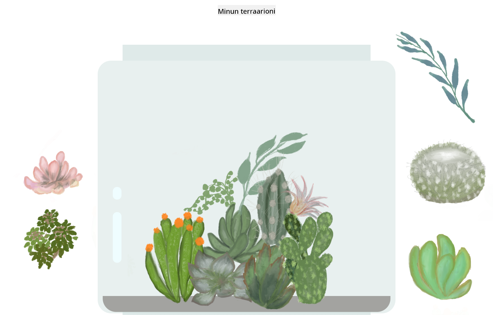

<!--
CO_OP_TRANSLATOR_METADATA:
{
  "original_hash": "6329fbe8bd936068debd78cca6f09c0a",
  "translation_date": "2025-08-27T20:11:59+00:00",
  "source_file": "3-terrarium/solution/README.md",
  "language_code": "fi"
}
-->
# Minun Terraarioni: Projekti HTML:n, CSS:n ja DOM-manipulaation oppimiseen JavaScriptin avulla 🌵🌱

Pieni vedä ja pudota -koodimeditaatio. Vähän HTML:ää, JS:ää ja CSS:ää käyttäen voit rakentaa verkkokäyttöliittymän, tyylitellä sen ja lisätä siihen vuorovaikutteisuutta.

## Tekijät

Kirjoitettu ♥️:lla [Jen Looperin](https://www.twitter.com/jenlooper) toimesta.

CSS:n avulla luotu terraario sai inspiraationsa Jakub Mandran lasipurkki [codepenistä](https://codepen.io/Rotarepmi/pen/rjpNZY).

Taide on käsin piirretty [Jen Looperin](http://jenlooper.com) toimesta Procreate-sovelluksella.

## Julkaise Terraariosi

Voit julkaista terraariosi verkkoon käyttämällä Azure Static Web Appsia.

1. Haarauta tämä repo

2. Paina tätä painiketta

3. Käy läpi ohjattu toiminto sovelluksesi luomiseksi. Varmista, että asetat sovelluksen juuren joko `/solution`-kansioon tai koodipohjasi juureen. Tässä sovelluksessa ei ole API:ta, joten siitä ei tarvitse huolehtia. Haarautettuun repoosi luodaan .github-kansio, joka auttaa Azure Static Web Appsin rakennuspalvelua rakentamaan ja julkaisemaan sovelluksesi uuteen URL-osoitteeseen.

---

**Vastuuvapauslauseke**:  
Tämä asiakirja on käännetty käyttämällä tekoälypohjaista käännöspalvelua [Co-op Translator](https://github.com/Azure/co-op-translator). Vaikka pyrimme tarkkuuteen, huomioithan, että automaattiset käännökset voivat sisältää virheitä tai epätarkkuuksia. Alkuperäinen asiakirja sen alkuperäisellä kielellä tulisi pitää ensisijaisena lähteenä. Kriittisen tiedon osalta suositellaan ammattimaista ihmiskäännöstä. Emme ole vastuussa väärinkäsityksistä tai virhetulkinnoista, jotka johtuvat tämän käännöksen käytöstä.