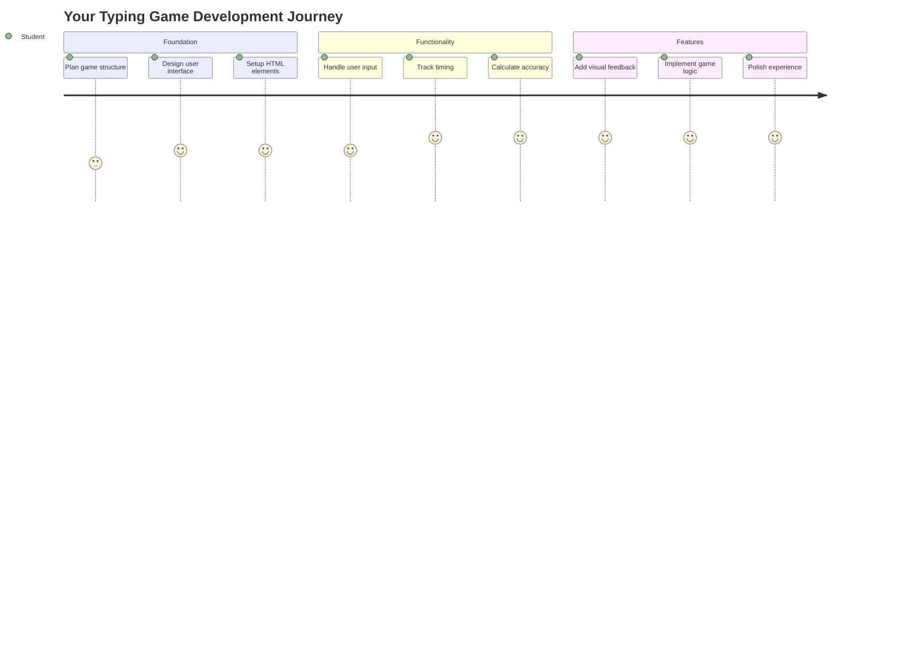
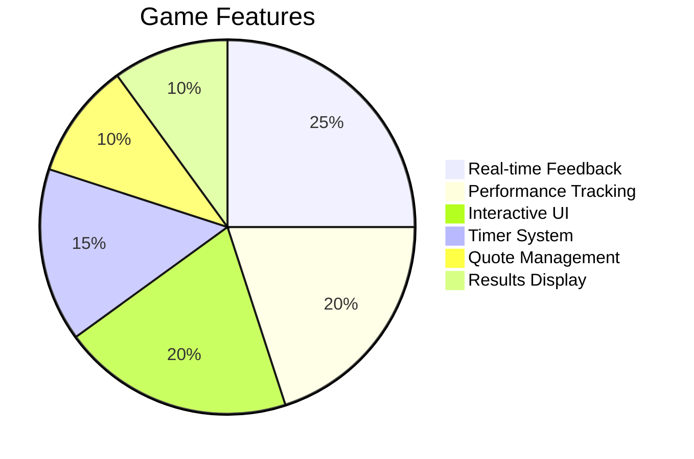
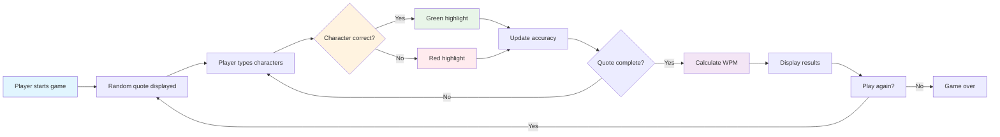
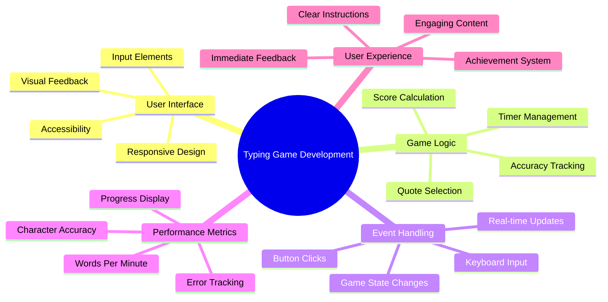
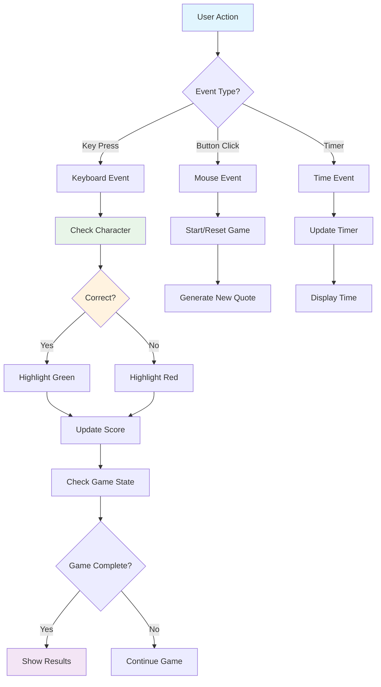
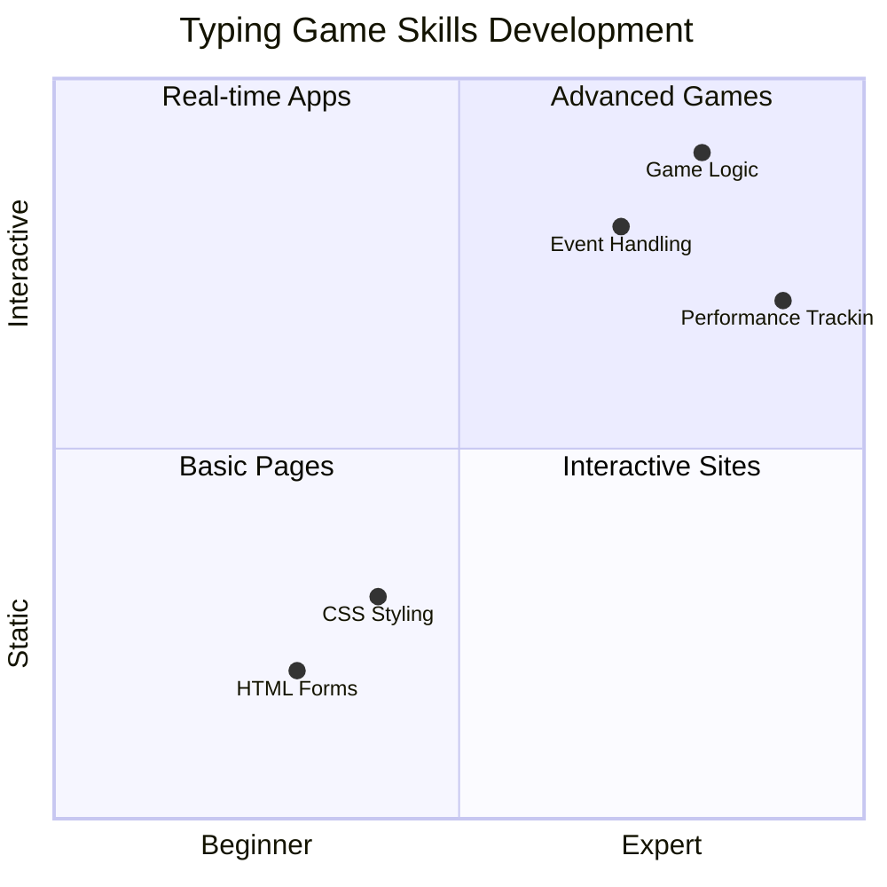
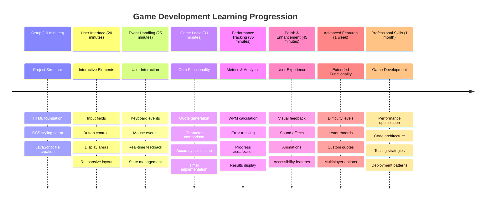

# Tapahtumapohjainen ohjelmointi - Rakenna kirjoituspeli

## Johdanto

Tässä on jotain, mitä jokainen kehittäjä tietää, mutta harvoin puhuu: nopea kirjoittaminen on supervoima! 🚀 Mieti sitä - mitä nopeammin saat ideasi siirtymään aivoistasi koodieditoriin, sitä paremmin luovuutesi pääsee valloilleen. Se on kuin suora yhteys ajatustesi ja näytön välillä.

Haluatko tietää yhden parhaista tavoista kehittää tätä taitoa? Arvasit oikein - aiomme rakentaa pelin!

> Luodaan yhdessä mahtava kirjoituspeli!

Oletko valmis hyödyntämään kaikkia niitä JavaScript-, HTML- ja CSS-taitoja, joita olet oppinut? Aiomme rakentaa kirjoituspelin, joka haastaa sinut satunnaisilla lainauksilla legendaariselta etsivältä [Sherlock Holmesilta](https://en.wikipedia.org/wiki/Sherlock_Holmes). Peli seuraa, kuinka nopeasti ja tarkasti pystyt kirjoittamaan - ja usko pois, se on koukuttavampaa kuin luuletkaan!

## Mitä sinun tulee tietää

Ennen kuin sukellamme projektiin, varmista, että hallitset nämä käsitteet (ei haittaa, jos tarvitset nopean kertauksen - me kaikki olemme olleet siinä tilanteessa!):

- Tekstisyötteen ja painikkeiden luominen
- CSS ja tyylien asettaminen luokkien avulla  
- JavaScriptin perusteet
  - Taulukon luominen
  - Satunnaisen numeron luominen
  - Nykyisen ajan hakeminen

Jos jokin näistä tuntuu hieman epävarmalta, se on täysin ok! Joskus paras tapa vahvistaa osaamistasi on hypätä projektiin ja oppia asioita matkan varrella.

### 🔄 **Pedagoginen tarkistus**
**Perustason arviointi**: Ennen kehityksen aloittamista varmista, että ymmärrät:
- ✅ Kuinka HTML-lomakkeet ja syöte-elementit toimivat
- ✅ CSS-luokat ja dynaaminen tyylittely
- ✅ JavaScriptin tapahtumakuuntelijat ja käsittelijät
- ✅ Taulukon käsittely ja satunnaisvalinta
- ✅ Ajan mittaus ja laskelmat

**Nopea itsearviointi**: Voitko selittää, miten nämä käsitteet toimivat yhdessä interaktiivisessa pelissä?
- **Tapahtumat** aktivoituvat, kun käyttäjät ovat vuorovaikutuksessa elementtien kanssa
- **Käsittelijät** käsittelevät tapahtumia ja päivittävät pelin tilaa
- **CSS** tarjoaa visuaalista palautetta käyttäjän toimista
- **Ajastus** mahdollistaa suorituskyvyn mittaamisen ja pelin etenemisen

## Rakennetaan tämä peli!

[Kirjoituspelin luominen tapahtumapohjaisen ohjelmoinnin avulla](./typing-game/README.md)

### ⚡ **Mitä voit tehdä seuraavan 5 minuutin aikana**
- [ ] Avaa selaimen konsoli ja kokeile kuunnella näppäimistötapahtumia `addEventListener`-toiminnolla
- [ ] Luo yksinkertainen HTML-sivu syötekentällä ja testaa kirjoituksen tunnistusta
- [ ] Harjoittele merkkijonojen käsittelyä vertaamalla kirjoitettua tekstiä kohdetekstiin
- [ ] Kokeile `setTimeout`-toimintoa ymmärtääksesi ajastustoimintoja

### 🎯 **Mitä voit saavuttaa tämän tunnin aikana**
- [ ] Suorita oppitunnin jälkeinen testi ja ymmärrä tapahtumapohjainen ohjelmointi
- [ ] Rakenna pelin perusversio, jossa on sanan validointi
- [ ] Lisää visuaalista palautetta oikeasta ja väärästä kirjoituksesta
- [ ] Toteuta yksinkertainen pistelaskujärjestelmä nopeuden ja tarkkuuden perusteella
- [ ] Tyylittele pelisi CSS:n avulla, jotta se näyttää houkuttelevalta

### 📅 **Viikon mittainen pelikehitys**
- [ ] Viimeistele koko kirjoituspeli kaikilla ominaisuuksilla ja viimeistelyillä
- [ ] Lisää vaikeustasoja, joissa on vaihteleva sanan monimutkaisuus
- [ ] Toteuta käyttäjätilastojen seuranta (WPM, tarkkuus ajan myötä)
- [ ] Luo äänitehosteita ja animaatioita paremman käyttäjäkokemuksen saavuttamiseksi
- [ ] Tee pelistäsi mobiiliystävällinen kosketuslaitteille
- [ ] Jaa pelisi verkossa ja kerää palautetta käyttäjiltä

### 🌟 **Kuukauden mittainen interaktiivinen kehitys**
- [ ] Rakenna useita pelejä, jotka tutkivat erilaisia vuorovaikutusmalleja
- [ ] Opettele pelisilmukoita, tilanhallintaa ja suorituskyvyn optimointia
- [ ] Osallistu avoimen lähdekoodin pelikehitysprojekteihin
- [ ] Hallitse edistyneitä ajastuskäsitteitä ja sulavia animaatioita
- [ ] Luo portfolio, joka esittelee erilaisia interaktiivisia sovelluksia
- [ ] Mentoroi muita, jotka ovat kiinnostuneita pelikehityksestä ja käyttäjävuorovaikutuksesta

## 🎯 Kirjoituspelin hallinnan aikajana

### 🛠️ Pelikehityksen työkalupakin yhteenveto

Kun olet suorittanut tämän projektin, hallitset:
- **Tapahtumapohjainen ohjelmointi**: Käyttäjän syötteisiin reagoivat käyttöliittymät
- **Reaaliaikainen palaute**: Välittömät visuaaliset ja suorituskyvyn päivitykset
- **Suorituskyvyn mittaus**: Tarkka ajastus- ja pistelaskujärjestelmä
- **Pelitilan hallinta**: Sovelluksen kulun ja käyttäjäkokemuksen hallinta
- **Interaktiivinen suunnittelu**: Houkuttelevien ja koukuttavien käyttäjäkokemusten luominen
- **Modernit verkkosovellusrajapinnat**: Selaimen ominaisuuksien hyödyntäminen rikkaisiin vuorovaikutuksiin
- **Saavutettavuusmallit**: Kaikille käyttäjille sopiva inklusiivinen suunnittelu

**Todelliset sovellukset**: Nämä taidot soveltuvat suoraan:
- **Verkkosovellukset**: Kaikki interaktiiviset käyttöliittymät tai hallintapaneelit
- **Opetusohjelmistot**: Oppimisalustat ja taitojen arviointityökalut
- **Tuottavuustyökalut**: Tekstieditorit, IDE:t ja yhteistyöohjelmistot
- **Peliteollisuus**: Selaimen pelit ja interaktiivinen viihde
- **Mobiilikehitys**: Kosketuspohjaiset käyttöliittymät ja eleiden käsittely

**Seuraava taso**: Olet valmis tutkimaan edistyneitä pelikehyksiä, reaaliaikaisia moninpelijärjestelmiä tai monimutkaisia interaktiivisia sovelluksia!

## Kiitokset

Kirjoittanut ♥️:lla [Christopher Harrison](http://www.twitter.com/geektrainer)

---

**Vastuuvapauslauseke**:  
Tämä asiakirja on käännetty käyttämällä tekoälypohjaista käännöspalvelua [Co-op Translator](https://github.com/Azure/co-op-translator). Vaikka pyrimme tarkkuuteen, huomioithan, että automaattiset käännökset voivat sisältää virheitä tai epätarkkuuksia. Alkuperäistä asiakirjaa sen alkuperäisellä kielellä tulisi pitää ensisijaisena lähteenä. Kriittisen tiedon osalta suositellaan ammattimaista ihmiskäännöstä. Emme ole vastuussa väärinkäsityksistä tai virhetulkinnoista, jotka johtuvat tämän käännöksen käytöstä.