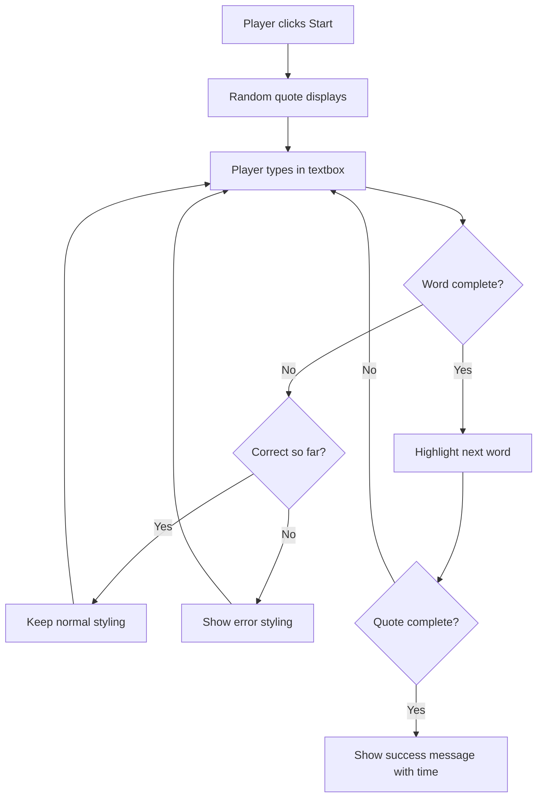
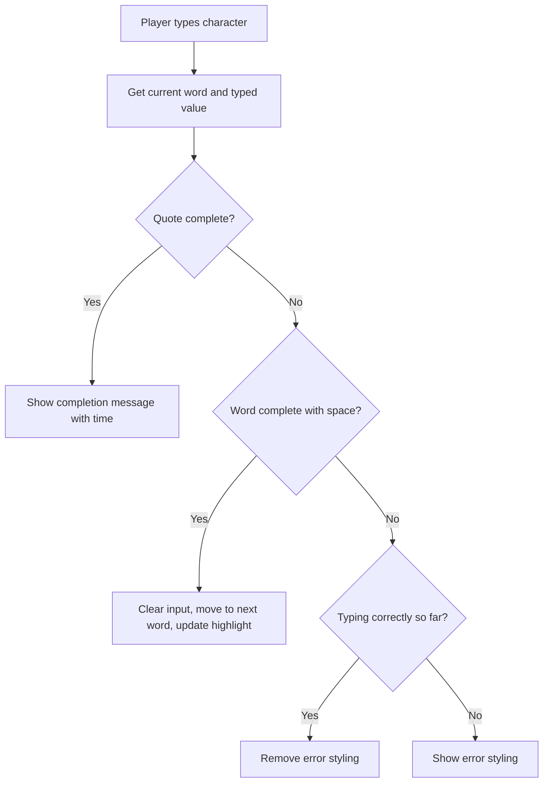
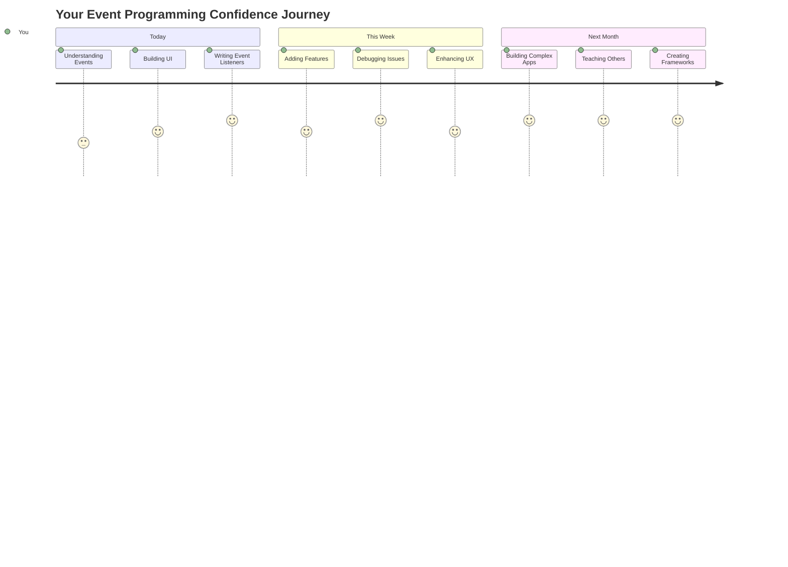

<!--
CO_OP_TRANSLATOR_METADATA:
{
  "original_hash": "da8bc72041a2bb3826a54654ee1a8844",
  "translation_date": "2025-11-04T01:37:28+00:00",
  "source_file": "4-typing-game/typing-game/README.md",
  "language_code": "fi"
}
-->
# Pelin luominen tapahtumien avulla

Oletko koskaan miettinyt, miten verkkosivustot tietävät, kun klikkaat painiketta tai kirjoitat tekstikenttään? Se on tapahtumapohjaisen ohjelmoinnin taikaa! Mikä olisikaan parempi tapa oppia tämä olennainen taito kuin rakentaa jotain hyödyllistä – kirjoitusnopeuspeli, joka reagoi jokaiseen näppäimen painallukseesi.

Tulet näkemään omin silmin, miten verkkoselaimet "keskustelevat" JavaScript-koodisi kanssa. Joka kerta kun klikkaat, kirjoitat tai liikutat hiirtä, selain lähettää pieniä viestejä (kutsumme niitä tapahtumiksi) koodillesi, ja sinä päätät, miten niihin vastataan!

Kun olemme valmiita, olet rakentanut oikean kirjoituspelin, joka seuraa nopeuttasi ja tarkkuuttasi. Vielä tärkeämpää on, että ymmärrät peruskäsitteet, jotka ovat jokaisen interaktiivisen verkkosivuston taustalla. Sukelletaanpa asiaan!

## Ennakkokysely

[Ennakkokysely](https://ff-quizzes.netlify.app/web/quiz/21)

## Tapahtumapohjainen ohjelmointi

Ajattele suosikkisovellustasi tai -verkkosivustoasi – mikä saa sen tuntumaan elävältä ja reagoivalta? Kyse on siitä, miten se reagoi toimintaasi! Jokainen napautus, klikkaus, pyyhkäisy tai näppäimen painallus luo sen, mitä kutsumme "tapahtumaksi", ja juuri siinä verkkokehityksen todellinen taika tapahtuu.

Tässä on syy, miksi ohjelmointi verkkoa varten on niin mielenkiintoista: emme koskaan tiedä, milloin joku klikkaa painiketta tai alkaa kirjoittaa tekstikenttään. Ehkä hän klikkaa heti, odottaa viisi minuuttia tai ei klikkaa ollenkaan! Tämä arvaamattomuus tarkoittaa, että meidän on ajateltava eri tavalla, kun kirjoitamme koodia.

Sen sijaan, että kirjoittaisimme koodia, joka suoritetaan ylhäältä alas kuin resepti, kirjoitamme koodia, joka odottaa kärsivällisesti, että jotain tapahtuu. Se on vähän kuin 1800-luvun lennätinoperaattorit, jotka istuivat koneidensa ääressä valmiina vastaamaan heti, kun viesti saapui.

Mikä siis tarkalleen ottaen on "tapahtuma"? Yksinkertaisesti sanottuna se on jotain, joka tapahtuu! Kun klikkaat painiketta – se on tapahtuma. Kun kirjoitat kirjaimen – se on tapahtuma. Kun liikutat hiirtä – se on toinen tapahtuma.

Tapahtumapohjainen ohjelmointi antaa meille mahdollisuuden asettaa koodimme kuuntelemaan ja reagoimaan. Luomme erityisiä funktioita, joita kutsutaan **tapahtumakuuntelijoiksi**, jotka odottavat kärsivällisesti tiettyjä asioita tapahtuvaksi ja aktivoituvat, kun ne tapahtuvat.

Ajattele tapahtumakuuntelijoita kuin koodisi ovikelloa. Asetat ovikellon (`addEventListener()`), kerrot sille, mitä ääntä kuunnella (kuten 'click' tai 'keypress'), ja määrität, mitä tapahtuu, kun joku soittaa sitä (oma funktiosi).

**Näin tapahtumakuuntelijat toimivat:**
- **Kuuntelevat** tiettyjä käyttäjän toimintoja, kuten klikkauksia, näppäinpainalluksia tai hiiren liikkeitä
- **Suorittavat** oman koodisi, kun määritelty tapahtuma tapahtuu
- **Reagoivat** välittömästi käyttäjän vuorovaikutuksiin, luoden saumattoman kokemuksen
- **Käsittelevät** useita tapahtumia samassa elementissä eri kuuntelijoiden avulla

> **NOTE:** On syytä korostaa, että tapahtumakuuntelijoita voi luoda monin eri tavoin. Voit käyttää anonyymejä funktioita tai luoda nimettyjä. Voit käyttää erilaisia oikoteitä, kuten asettamalla `click`-ominaisuuden tai käyttämällä `addEventListener()`. Harjoituksessamme keskitymme `addEventListener()`-menetelmään ja anonyymeihin funktioihin, koska se on todennäköisesti yleisin tekniikka, jota verkkokehittäjät käyttävät. Se on myös joustavin, sillä `addEventListener()` toimii kaikille tapahtumille, ja tapahtuman nimi voidaan antaa parametrina.

### Yleiset tapahtumat

Vaikka verkkoselaimet tarjoavat kymmeniä erilaisia tapahtumia, joita voit kuunnella, useimmat interaktiiviset sovellukset perustuvat vain muutamaan olennaiseen tapahtumaan. Näiden ydintapahtumien ymmärtäminen antaa sinulle perustan rakentaa kehittyneitä käyttäjävuorovaikutuksia.

On olemassa [kymmeniä tapahtumia](https://developer.mozilla.org/docs/Web/Events), joita voit kuunnella sovellusta luodessasi. Käytännössä kaikki, mitä käyttäjä tekee sivulla, synnyttää tapahtuman, mikä antaa sinulle paljon valtaa varmistaa, että käyttäjä saa haluamasi kokemuksen. Onneksi tarvitset yleensä vain pienen joukon tapahtumia. Tässä muutama yleinen (mukaan lukien kaksi, joita käytämme pelimme luomisessa):

| Tapahtuma | Kuvaus | Yleiset käyttötapaukset |
|-----------|--------|-------------------------|
| `click` | Käyttäjä klikkasi jotain | Painikkeet, linkit, interaktiiviset elementit |
| `contextmenu` | Käyttäjä klikkasi hiiren oikeaa painiketta | Mukautetut oikean klikkauksen valikot |
| `select` | Käyttäjä korosti tekstiä | Tekstieditointi, kopiointitoiminnot |
| `input` | Käyttäjä syötti tekstiä | Lomakkeiden validointi, reaaliaikainen haku |

**Näiden tapahtumatyyppien ymmärtäminen:**
- **Aktivoituu**, kun käyttäjät vuorovaikuttavat tiettyjen elementtien kanssa sivullasi
- **Tarjoaa** yksityiskohtaista tietoa käyttäjän toiminnasta tapahtumaobjektien kautta
- **Mahdollistaa** responsiivisten, interaktiivisten verkkosovellusten luomisen
- **Toimii** johdonmukaisesti eri selaimissa ja laitteissa

## Pelin luominen

Nyt kun ymmärrät, miten tapahtumat toimivat, laitetaan tieto käytäntöön rakentamalla jotain hyödyllistä. Luomme kirjoitusnopeuspeli, joka havainnollistaa tapahtumien käsittelyä samalla kun kehität tärkeää kehittäjätaitoa.

Luomme pelin tutkiaksemme, miten tapahtumat toimivat JavaScriptissä. Pelimme testaa pelaajan kirjoitustaitoa, joka on yksi aliarvostetuimmista taidoista, joita kaikilla kehittäjillä tulisi olla. Hauska fakta: QWERTY-näppäimistöasettelu, jota käytämme tänään, suunniteltiin 1870-luvulla kirjoituskoneita varten – ja hyvät kirjoitustaidot ovat edelleen yhtä arvokkaita ohjelmoijille tänään! Pelin yleinen kulku näyttää tältä:



**Näin pelimme toimii:**
- **Alkaa**, kun pelaaja klikkaa aloituspainiketta ja satunnainen lainaus näytetään
- **Seuraa** pelaajan kirjoitusprosessia sana sanalta reaaliajassa
- **Korostaa** nykyisen sanan ohjatakseen pelaajan keskittymistä
- **Antaa** välitöntä visuaalista palautetta kirjoitusvirheistä
- **Laskee** ja näyttää kokonaisajan, kun lainaus on valmis

Rakennetaan peli ja opitaan tapahtumista!

### Tiedostorakenne

Ennen kuin aloitamme koodaamisen, järjestäydytään! Selkeä tiedostorakenne alusta alkaen säästää sinut päänsäryltä myöhemmin ja tekee projektistasi ammattimaisemman. 😊

Pidämme asiat yksinkertaisina vain kolmella tiedostolla: `index.html` sivun rakenteelle, `script.js` kaikelle pelilogikalle ja `style.css`, jotta kaikki näyttäisi hyvältä. Tämä on klassinen kolmikko, joka pyörittää suurinta osaa verkosta!

**Luo uusi kansio työllesi avaamalla konsoli tai terminaali ja antamalla seuraava komento:**

```bash
# Linux or macOS
mkdir typing-game && cd typing-game

# Windows
md typing-game && cd typing-game
```

**Näin komennot toimivat:**
- **Luo** uuden hakemiston nimeltä `typing-game` projektitiedostoillesi
- **Siirtyy** automaattisesti juuri luotuun hakemistoon
- **Valmistelee** siistin työtilan pelin kehittämistä varten

**Avaa Visual Studio Code:**

```bash
code .
```

**Tämä komento:**
- **Käynnistää** Visual Studio Coden nykyisessä hakemistossa
- **Avaa** projektikansiosi editorissa
- **Tarjoaa** pääsyn kaikkiin kehitystyökaluihin, joita tarvitset

**Lisää kolme tiedostoa kansioon Visual Studio Codessa seuraavilla nimillä:**
- `index.html` – Sisältää pelin rakenteen ja sisällön
- `script.js` – Käsittelee kaiken pelilogikan ja tapahtumakuuntelijat
- `style.css` – Määrittää visuaalisen ulkoasun ja tyylin

## Käyttöliittymän luominen

Nyt rakennetaan näyttämö, jossa kaikki pelin toiminta tapahtuu! Ajattele tätä kuin avaruusaluksen ohjauspaneelin suunnittelua – meidän täytyy varmistaa, että kaikki, mitä pelaajat tarvitsevat, on juuri siellä, missä he odottavat sen olevan.

Mietitään, mitä pelimme oikeastaan tarvitsee. Jos pelaisit kirjoituspeliä, mitä haluaisit nähdä näytöllä? Tässä on, mitä tarvitsemme:

| Käyttöliittymäelementti | Tarkoitus | HTML-elementti |
|-------------------------|-----------|----------------|
| Lainauksen näyttö | Näyttää kirjoitettavan tekstin | `<p>` ja `id="quote"` |
| Viestialue | Näyttää tilan ja onnistumisen viestit | `<p>` ja `id="message"` |
| Tekstikenttä | Paikka, jossa pelaajat kirjoittavat lainauksen | `<input>` ja `id="typed-value"` |
| Aloituspainike | Käynnistää pelin | `<button>` ja `id="start"` |

**Käyttöliittymän rakenteen ymmärtäminen:**
- **Järjestää** sisällön loogisesti ylhäältä alas
- **Määrittää** yksilölliset ID:t elementeille JavaScriptin kohdistamista varten
- **Tarjoaa** selkeän visuaalisen hierarkian paremman käyttökokemuksen takaamiseksi
- **Sisältää** semanttisia HTML-elementtejä saavutettavuuden parantamiseksi

Jokaiselle näistä elementeistä tarvitaan ID:t, jotta voimme työskennellä niiden kanssa JavaScriptissä. Lisäämme myös viittaukset luotaviin CSS- ja JavaScript-tiedostoihin.

Luo uusi tiedosto nimeltä `index.html`. Lisää seuraava HTML:

```html
<!-- inside index.html -->
<html>
<head>
  <title>Typing game</title>
  <link rel="stylesheet" href="style.css">
</head>
<body>
  <h1>Typing game!</h1>
  <p>Practice your typing skills with a quote from Sherlock Holmes. Click **start** to begin!</p>
  <p id="quote"></p> <!-- This will display our quote -->
  <p id="message"></p> <!-- This will display any status messages -->
  <div>
    <input type="text" aria-label="current word" id="typed-value" /> <!-- The textbox for typing -->
    <button type="button" id="start">Start</button> <!-- To start the game -->
  </div>
  <script src="script.js"></script>
</body>
</html>
```

**Tämän HTML-rakenteen tarkoitus:**
- **Linkittää** CSS-tyylitiedoston `<head>`-osioon ulkoasua varten
- **Luo** selkeän otsikon ja ohjeet käyttäjille
- **Määrittää** paikkamerkkikappaleet, joilla on erityiset ID:t dynaamista sisältöä varten
- **Sisältää** syöttökentän saavutettavuusominaisuuksilla
- **Tarjoaa** aloituspainikkeen pelin käynnistämiseksi
- **Lataa** JavaScript-tiedoston lopussa optimaalisen suorituskyvyn takaamiseksi

### Sovelluksen käynnistäminen

Sovelluksen testaaminen kehityksen aikana auttaa havaitsemaan ongelmat ajoissa ja näkemään edistymisen reaaliajassa. Live Server on korvaamaton työkalu, joka päivittää selaimen automaattisesti aina, kun tallennat muutoksia, tehden kehityksestä paljon tehokkaampaa.

On aina parasta kehittää iteratiivisesti nähdäksesi, miltä asiat näyttävät. Käynnistetään sovellus. Visual Studio Codessa on upea laajennus nimeltä [Live Server](https://marketplace.visualstudio.com/items?itemName=ritwickdey.LiveServer&WT.mc_id=academic-77807-sagibbon), joka sekä isännöi sovelluksesi paikallisesti että päivittää selaimen aina, kun tallennat.

**Asenna [Live Server](https://marketplace.visualstudio.com/items?itemName=ritwickdey.LiveServer&WT.mc_id=academic-77807-sagibbon) seuraamalla linkkiä ja klikkaamalla Asenna:**

**Näin asennus etenee:**
- **Avaa** selaimesi Visual Studio Codeen
- **Ohjaa** sinut laajennuksen asennusprosessin läpi
- **Saattaa vaatia** Visual Studio Coden uudelleenkäynnistämistä asennuksen viimeistelyyn

**Kun laajennus on asennettu, avaa Visual Studio Codessa komentopaletti painamalla Ctrl-Shift-P (tai Cmd-Shift-P):**

**Komentopaletin ymmärtäminen:**
- **Tarjoaa** nopean pääsyn kaikkiin VS Coden komentoihin
- **Etsii** komentoja kirjoittaessasi
- **Tarjoaa** pikanäppäimiä nopeampaan kehitykseen

**Kirjoita "Live Server: Open with Live Server":**

**Live Serverin toiminta:**
- **Käynnistää** paikallisen kehityspalvelimen projektillesi
- **Päivittää** selaimen automaattisesti, kun tallennat tiedostoja
- **Palvelee** tiedostosi paikallisesta URL-osoitteesta (yleensä `localhost:5500`)

**Avaa selain ja siirry osoitteeseen `https://localhost:5500`:**

Nyt sinun pitäisi nähdä luomasi sivu! Lisätään siihen toiminnallisuutta.

## Lisää CSS

Nyt tehdään ulkoasusta houkutteleva! Visuaalinen palaute on ollut tärkeä käyttäjäliittymien kannalta tietotekniikan alkuajoista lähtien. 1980-luvulla tutkijat huomasivat, että välitön visuaalinen palaute parantaa merkittävästi käyttäjien suoritusta ja vähentää virheitä. Juuri sitä aiomme luoda.

Pelimme täytyy olla kristallinkirkas siitä, mitä tapahtuu. Pelaajien pitäisi heti tietää, mikä sana heidän pitäisi kirjoittaa, ja jos he tekevät virheen, heidän pitäisi nähdä se välittömästi. Luodaan yksinkertainen mutta tehokas ulkoasu:

Luo uusi tiedosto nimeltä `style.css` ja lisää seuraava syntaksi.

```css
/* inside style.css */
.highlight {
  background-color: yellow;
}

.error {
  background-color: lightcoral;
  border: red;
}
```

**Näiden CSS-luokkien ymmärtäminen:**
- **Korostaa** nykyisen sanan keltaisella taustalla selkeän visuaalisen ohjauksen vuoksi
- **Ilmoittaa** kirjoitusvirheistä vaalean korallin värisellä taustalla
- **Tarjoaa** välitöntä palautetta häiritsemättä käyttäjän kirjoitusvirtaa
- **Käyttää** kontrastivärejä saavutettavuuden ja selkeän visuaalisen viestinnän vuoksi

✅ CSS:n osalta voit asettaa sivusi ulkoasun haluamallasi tavalla. Käytä hieman aikaa ja tee sivusta houkuttelevampi:

- Valitse eri fontti
- Väritä otsikot
- Muuta elementtien kokoa

## JavaScript

Tässä vaiheessa asiat muuttuvat mielenkiintoisiksi! 🎉 Meillä on HTML-rakenne ja CSS-tyylit, mutta juuri nyt pelimme on kuin kaunis auto ilman moottoria. JavaScript tulee olemaan se moottori – se saa kaiken toimimaan ja reagoimaan pelaajien toimintaan.

Tässä näet luomuksesi heräävän eloon. Käymme tämän läpi askel askeleelta, jotta mikään ei tunnu ylivoimaiselta:

| Vaihe | Tarkoitus | Mitä opit |
|-------|----------|-----------|
| [Luo vakioita](../../../../4-typing-game/typing-game) | Aseta lainaukset ja DOM-viittaukset | Muuttujien hallinta ja DOM-valinta |
| [Tapahtumakuuntelija pelin aloittamiseksi](../../../../4-typing-game/typing-game) | Käsittele pelin aloitus | Tapahtumien käsittely ja käyttöliittymän päivitykset |
| [Tapahtumakuuntelija kirjoittamiseen](../../../../4-typing-game/typing-game) | Käsittele käyttäjän syötteitä reaaliajassa | Syötteen validointi ja dynaaminen palaute |

**Tämä jäsennelty lähestymistapa auttaa sinua:**
- **Järjestämään** koodisi loogisiin, hallittaviin osiin
- **Rakentamaan** toiminnallisuutta asteittain helpomman virheenkorjauksen vuoksi
- **Ymmärtämään**, miten sovelluksesi eri osat toimivat yhdessä
- **Luomaan** uudelleenkäytettäviä malleja tulevia projekteja varten

Mutta ensin, lu
| Lainauslista | Tallenna kaikki mahdolliset lainaukset peliä varten | `['Lainaus 1', 'Lainaus 2', ...]` |
| Sanalista | Jaa nykyinen lainaus yksittäisiin sanoihin | `['Kun', 'sinulla', 'on', ...]` |
| Sanan indeksi | Seuraa, mitä sanaa pelaaja kirjoittaa | `0, 1, 2, 3...` |
| Aloitusaika | Laske kulunut aika pisteytykseen | `Date.now()` |

**Tarvitsemme myös viittaukset käyttöliittymän elementteihin:**
| Elementti | ID | Tarkoitus |
|-----------|----|----------|
| Tekstikenttä | `typed-value` | Paikka, jossa pelaajat kirjoittavat |
| Lainauksen näyttö | `quote` | Näyttää kirjoitettavan lainauksen |
| Viestialue | `message` | Näyttää tilapäivitykset |

```javascript
// inside script.js
// all of our quotes
const quotes = [
    'When you have eliminated the impossible, whatever remains, however improbable, must be the truth.',
    'There is nothing more deceptive than an obvious fact.',
    'I ought to know by this time that when a fact appears to be opposed to a long train of deductions it invariably proves to be capable of bearing some other interpretation.',
    'I never make exceptions. An exception disproves the rule.',
    'What one man can invent another can discover.',
    'Nothing clears up a case so much as stating it to another person.',
    'Education never ends, Watson. It is a series of lessons, with the greatest for the last.',
];
// store the list of words and the index of the word the player is currently typing
let words = [];
let wordIndex = 0;
// the starting time
let startTime = Date.now();
// page elements
const quoteElement = document.getElementById('quote');
const messageElement = document.getElementById('message');
const typedValueElement = document.getElementById('typed-value');
```

**Mitä tämä alustus tekee:**
- **Tallentaa** Sherlock Holmes -lainaukset taulukkoon käyttäen `const`, koska lainaukset eivät muutu
- **Alustaa** seurantamuuttujat käyttäen `let`, koska arvot muuttuvat pelin aikana
- **Hakee** viittaukset DOM-elementteihin `document.getElementById()`-metodilla tehokasta käyttöä varten
- **Luo** perustan kaikelle pelin toiminnallisuudelle selkeillä ja kuvaavilla muuttujanimillä
- **Järjestää** liittyvät tiedot ja elementit loogisesti helpottaakseen koodin ylläpitoa

✅ Lisää peliisi lisää lainauksia

> 💡 **Vinkki**: Voimme hakea elementtejä koodissa milloin tahansa käyttämällä `document.getElementById()`. Koska viittaamme näihin elementteihin säännöllisesti, vältämme kirjoitusvirheet käyttämällä vakioita. Kehykset, kuten [Vue.js](https://vuejs.org/) tai [React](https://reactjs.org/), voivat auttaa sinua hallitsemaan koodin keskittämistä paremmin.
>
**Miksi tämä lähestymistapa toimii hyvin:**
- **Estää** kirjoitusvirheet, kun viitataan elementteihin useita kertoja
- **Parantaa** koodin luettavuutta kuvaavilla vakionimillä
- **Mahdollistaa** paremman IDE-tuen automaattisen täydennyksen ja virhetarkistuksen avulla
- **Helpottaa** refaktorointia, jos elementtien ID:t muuttuvat myöhemmin

Katso lyhyt video `const`, `let` ja `var`-muuttujien käytöstä

[](https://youtube.com/watch?v=JNIXfGiDWM8 "Muuttujatyypit")

> 🎥 Klikkaa yllä olevaa kuvaa katsoaksesi videon muuttujista.

### Aloituslogiikan lisääminen

Tässä kaikki loksahtaa paikoilleen! 🚀 Olet kirjoittamassa ensimmäistä oikeaa tapahtumankuuntelijaa, ja on jotain erityisen tyydyttävää nähdä koodisi reagoivan painikkeen klikkaukseen.

Ajattele: jossain joku pelaaja klikkaa "Aloita"-painiketta, ja koodisi täytyy olla valmis. Emme tiedä, milloin he klikkaavat - ehkä heti, ehkä kahvikupin jälkeen - mutta kun he tekevät sen, pelisi herää eloon.

Kun käyttäjä klikkaa `start`, meidän täytyy valita lainaus, asettaa käyttöliittymä ja aloittaa nykyisen sanan ja ajan seuranta. Alla on JavaScript-koodi, jonka tarvitset; käymme sen läpi skriptin jälkeen.

```javascript
// at the end of script.js
document.getElementById('start').addEventListener('click', () => {
  // get a quote
  const quoteIndex = Math.floor(Math.random() * quotes.length);
  const quote = quotes[quoteIndex];
  // Put the quote into an array of words
  words = quote.split(' ');
  // reset the word index for tracking
  wordIndex = 0;

  // UI updates
  // Create an array of span elements so we can set a class
  const spanWords = words.map(function(word) { return `<span>${word} </span>`});
  // Convert into string and set as innerHTML on quote display
  quoteElement.innerHTML = spanWords.join('');
  // Highlight the first word
  quoteElement.childNodes[0].className = 'highlight';
  // Clear any prior messages
  messageElement.innerText = '';

  // Setup the textbox
  // Clear the textbox
  typedValueElement.value = '';
  // set focus
  typedValueElement.focus();
  // set the event handler

  // Start the timer
  startTime = new Date().getTime();
});
```

**Koodin jaottelu loogisiin osiin:**

**📊 Sanaseurannan alustus:**
- **Valitsee** satunnaisen lainauksen käyttäen `Math.floor()` ja `Math.random()` monipuolisuuden vuoksi
- **Muuntaa** lainauksen yksittäisten sanojen taulukoksi käyttäen `split(' ')`
- **Nollaa** `wordIndex` arvoksi 0, koska pelaajat aloittavat ensimmäisestä sanasta
- **Valmistelee** pelitilan uutta kierrosta varten

**🎨 Käyttöliittymän alustus ja näyttö:**
- **Luo** taulukon `<span>`-elementtejä, jotka ympäröivät jokaisen sanan yksilöllistä tyylittelyä varten
- **Yhdistää** span-elementit yhdeksi merkkijonoksi tehokasta DOM-päivitystä varten
- **Korostaa** ensimmäisen sanan lisäämällä `highlight`-CSS-luokan
- **Tyhjentää** aiemmat peliviestit tarjotakseen puhtaan aloituksen

**⌨️ Tekstikentän valmistelu:**
- **Tyhjentää** olemassa olevan tekstin syöttökentästä
- **Asettaa kohdistuksen** tekstikenttään, jotta pelaajat voivat aloittaa kirjoittamisen heti
- **Valmistelee** syöttöalueen uutta pelikierrosta varten

**⏱️ Ajastimen alustus:**
- **Tallentaa** nykyisen aikaleiman käyttäen `new Date().getTime()`
- **Mahdollistaa** tarkan kirjoitusnopeuden ja suoritusajan laskennan
- **Käynnistää** suorituskyvyn seurannan pelisessiota varten

### Kirjoituslogiikan lisääminen

Tässä käsittelemme pelin ydintä! Älä huoli, jos tämä tuntuu aluksi paljolta - käymme läpi jokaisen osan, ja lopulta näet, kuinka loogista kaikki on.

Rakennamme jotain melko hienostunutta: joka kerta, kun joku kirjoittaa kirjaimen, koodimme tarkistaa, mitä he kirjoittivat, antaa palautetta ja päättää, mitä seuraavaksi tapahtuu. Se on samanlaista kuin varhaiset tekstinkäsittelyohjelmat, kuten WordStar 1970-luvulla, jotka antoivat reaaliaikaista palautetta kirjoittajille.

```javascript
// at the end of script.js
typedValueElement.addEventListener('input', () => {
  // Get the current word
  const currentWord = words[wordIndex];
  // get the current value
  const typedValue = typedValueElement.value;

  if (typedValue === currentWord && wordIndex === words.length - 1) {
    // end of sentence
    // Display success
    const elapsedTime = new Date().getTime() - startTime;
    const message = `CONGRATULATIONS! You finished in ${elapsedTime / 1000} seconds.`;
    messageElement.innerText = message;
  } else if (typedValue.endsWith(' ') && typedValue.trim() === currentWord) {
    // end of word
    // clear the typedValueElement for the new word
    typedValueElement.value = '';
    // move to the next word
    wordIndex++;
    // reset the class name for all elements in quote
    for (const wordElement of quoteElement.childNodes) {
      wordElement.className = '';
    }
    // highlight the new word
    quoteElement.childNodes[wordIndex].className = 'highlight';
  } else if (currentWord.startsWith(typedValue)) {
    // currently correct
    // highlight the next word
    typedValueElement.className = '';
  } else {
    // error state
    typedValueElement.className = 'error';
  }
});
```

**Kirjoituslogiikan kulun ymmärtäminen:**

Tämä funktio käyttää vesiputouslähestymistapaa, tarkistaen ehdot tarkimmasta yleisimpään. Käydään läpi jokainen skenaario:



**🏁 Lainaus valmis (Skenaario 1):**
- **Tarkistaa**, vastaako kirjoitettu arvo nykyistä sanaa JA ollaanko viimeisessä sanassa
- **Laskee** kuluneen ajan vähentämällä aloitusajan nykyisestä ajasta
- **Muuntaa** millisekunnit sekunneiksi jakamalla 1 000:lla
- **Näyttää** onnitteluviestin suoritusajalla

**✅ Sana valmis (Skenaario 2):**
- **Havaitsee** sanan valmistumisen, kun syöttö päättyy välilyöntiin
- **Vahvistaa**, että trimmattu syöttö vastaa nykyistä sanaa tarkasti
- **Tyhjentää** syöttökentän seuraavaa sanaa varten
- **Siirtyy** seuraavaan sanaan kasvattamalla `wordIndex`-arvoa
- **Päivittää** visuaalisen korostuksen poistamalla kaikki luokat ja korostamalla uuden sanan

**📝 Kirjoittaminen käynnissä (Skenaario 3):**
- **Varmistaa**, että nykyinen sana alkaa kirjoitetulla tekstillä
- **Poistaa** virhetyylittelyn osoittaakseen, että syöttö on oikein
- **Sallii** kirjoittamisen jatkamisen keskeytyksettä

**❌ Virhetilanne (Skenaario 4):**
- **Aktivoi**, kun kirjoitettu teksti ei vastaa odotettua sanan alkua
- **Lisää** virheellisen CSS-luokan tarjotakseen välitöntä visuaalista palautetta
- **Auttaa** pelaajia tunnistamaan ja korjaamaan virheet nopeasti

## Testaa sovellustasi

Katso, mitä olet saavuttanut! 🎉 Olet juuri rakentanut toimivan kirjoituspelin alusta alkaen käyttäen tapahtumapohjaista ohjelmointia. Ota hetki arvostaaksesi sitä - tämä ei ole mikään pieni saavutus!

Nyt on testausvaiheen aika! Toimiiko kaikki odotetusti? Jäikö jotain huomaamatta? Tässä on juttu: jos jokin ei toimi täydellisesti heti, se on täysin normaalia. Kokeneetkin kehittäjät löytävät säännöllisesti bugeja koodistaan. Se on osa kehitysprosessia!

Klikkaa `start` ja ala kirjoittaa! Sen pitäisi näyttää vähän samalta kuin aiemmin nähty animaatio.


**Mitä testata sovelluksessasi:**
- **Varmistaa**, että Start-painikkeen klikkaaminen näyttää satunnaisen lainauksen
- **Tarkistaa**, että kirjoittaminen korostaa nykyisen sanan oikein
- **Vahvistaa**, että virhetyylittely näkyy väärän kirjoituksen kohdalla
- **Tarkistaa**, että sanojen valmistuminen siirtää korostuksen oikein
- **Testaa**, että lainauksen valmistuminen näyttää suoritusviestin ja ajan

**Yleisiä virheenkorjausvinkkejä:**
- **Tarkista** selaimen konsoli (F12) JavaScript-virheiden varalta
- **Varmista**, että kaikki tiedostonimet täsmäävät tarkasti (kirjainkoko huomioiden)
- **Varmista**, että Live Server toimii ja päivittää kunnolla
- **Testaa** eri lainauksia varmistaaksesi satunnaisvalinnan toimivuuden

---

## GitHub Copilot Agent -haaste 🎮

Käytä Agent-tilaa suorittaaksesi seuraavan haasteen:

**Kuvaus:** Laajenna kirjoituspeliä toteuttamalla vaikeustasojärjestelmä, joka mukauttaa pelin pelaajan suorituksen perusteella. Tämä haaste auttaa sinua harjoittelemaan edistynyttä tapahtumien käsittelyä, datan analysointia ja dynaamisia käyttöliittymäpäivityksiä.

**Tehtävä:** Luo kirjoituspelille vaikeustasojärjestelmä, joka:
1. Seuraa pelaajan kirjoitusnopeutta (sanoja minuutissa) ja tarkkuusprosenttia
2. Mukautuu automaattisesti kolmeen vaikeustasoon: Helppo (yksinkertaiset lainaukset), Keskitaso (nykyiset lainaukset), Vaikea (monimutkaiset lainaukset välimerkeillä)
3. Näyttää nykyisen vaikeustason ja pelaajan tilastot käyttöliittymässä
4. Toteuttaa sarjalaskurin, joka nostaa vaikeustasoa kolmen peräkkäisen hyvän suorituksen jälkeen
5. Lisää visuaalista palautetta (värit, animaatiot) vaikeustason muutosten osoittamiseksi

Lisää tarvittavat HTML-elementit, CSS-tyylit ja JavaScript-funktiot tämän ominaisuuden toteuttamiseksi. Sisällytä asianmukainen virheenkäsittely ja varmista, että peli pysyy saavutettavana sopivilla ARIA-tunnisteilla.

Lisätietoja [agent-tilasta](https://code.visualstudio.com/blogs/2025/02/24/introducing-copilot-agent-mode) löytyy täältä.

## 🚀 Haaste

Valmis viemään kirjoituspelisi seuraavalle tasolle? Kokeile toteuttaa nämä edistyneet ominaisuudet syventääksesi ymmärrystäsi tapahtumien käsittelystä ja DOM-manipulaatiosta:

**Lisää toiminnallisuutta:**

| Ominaisuus | Kuvaus | Harjoiteltavat taidot |
|------------|--------|-----------------------|
| **Syöttökontrolli** | Poista käytöstä `input`-tapahtumankuuntelija pelin päätyttyä ja ota se uudelleen käyttöön, kun painiketta klikataan | Tapahtumien hallinta ja tilan hallinta |
| **Käyttöliittymän tilanhallinta** | Poista tekstikenttä käytöstä, kun pelaaja suorittaa lainauksen | DOM-ominaisuuksien manipulointi |
| **Modal-ikkuna** | Näytä modal-ikkuna onnistumisviestillä | Edistyneet käyttöliittymäkuviot ja saavutettavuus |
| **Ennätysjärjestelmä** | Tallenna ennätykset käyttäen `localStorage` | Selaimen tallennus-API:t ja datan pysyvyys |

**Toteutusvinkkejä:**
- **Tutki** `localStorage.setItem()` ja `localStorage.getItem()` pysyvää tallennusta varten
- **Harjoittele** tapahtumankuuntelijoiden lisäämistä ja poistamista dynaamisesti
- **Tutki** HTML-dialogielementtejä tai CSS-modal-kuvioita
- **Huomioi** saavutettavuus lomakekontrollien poistamisessa ja käyttöönottamisessa

## Luentojälkeinen kysely

[Luentojälkeinen kysely](https://ff-quizzes.netlify.app/web/quiz/22)

---

## 🚀 Kirjoituspelin hallinnan aikajana

### ⚡ **Mitä voit tehdä seuraavan 5 minuutin aikana**
- [ ] Testaa kirjoituspeliäsi eri lainauksilla varmistaaksesi sen sujuvan toiminnan
- [ ] Kokeile CSS-tyylittelyä - kokeile muuttaa korostus- ja virhevärit
- [ ] Avaa selaimesi kehittäjätyökalut (F12) ja seuraa konsolia pelatessasi
- [ ] Haasta itsesi suorittamaan lainaus mahdollisimman nopeasti

### ⏰ **Mitä voit saavuttaa tämän tunnin aikana**
- [ ] Lisää taulukkoon lisää lainauksia (vaikkapa suosikkikirjoistasi tai -elokuvistasi)
- [ ] Toteuta haasteosiossa mainittu localStorage-ennätysjärjestelmä
- [ ] Luo sanoja minuutissa laskeva laskuri, joka näkyy jokaisen pelin jälkeen
- [ ] Lisää ääniefektejä oikealle kirjoitukselle, virheille ja valmistumiselle

### 📅 **Viikon mittainen seikkailusi**
- [ ] Rakenna moninpeliversio, jossa ystävät voivat kilpailla rinnakkain
- [ ] Luo erilaisia vaikeustasoja vaihtelevilla lainauskompleksisuuksilla
- [ ] Lisää edistymispalkki, joka näyttää, kuinka paljon lainauksesta on valmis
- [ ] Toteuta käyttäjätilit henkilökohtaisella tilastoseurannalla
- [ ] Suunnittele mukautettuja teemoja ja anna käyttäjien valita suosikkityylinsä

### 🗓️ **Kuukauden mittainen muodonmuutos**
- [ ] Luo kirjoituskurssi, jossa on oppitunteja, jotka opettavat sormien oikeaa sijoittelua
- [ ] Rakenna analytiikka, joka näyttää, mitkä kirjaimet tai sanat aiheuttavat eniten virheitä
- [ ] Lisää tuki eri kielille ja näppäimistöasetteluille
- [ ] Integroi koulutuksellisiin API:hin lainauksien hakemiseksi kirjallisuusdatabankista
- [ ] Julkaise paranneltu kirjoituspelisi muiden käytettäväksi ja nautittavaksi

### 🎯 **Lopullinen pohdinta**

**Ennen kuin jatkat, ota hetki juhliaksesi:**
- Mikä oli tyydyttävin hetki pelin rakentamisen aikana?
- Miten suhtaudut tapahtumapohjaiseen ohjelmointiin nyt verrattuna siihen, kun aloitit?
- Mikä ominaisuus innostaa sinua eniten lisäämään peliisi, jotta siitä tulee ainutlaatuinen?
- Miten voisit soveltaa tapahtumien käsittelyyn liittyviä konsepteja muihin projekteihin?



> 🌟 **Muista**: Olet juuri hallinnut yhden keskeisimmistä konsepteista, joka tekee jokaisesta interaktiivisesta verkkosivustosta ja sovelluksesta elävän. Tapahtumapohjainen ohjelmointi tekee verkosta elävän ja reagoivan. Joka kerta, kun näet pudotusvalikon, lomakkeen, joka validoi kirjoitusta, tai pelin, joka reagoi klikkauksiin, ymmärrät nyt taikuuden sen takana. Et vain opi koodaamaan - opit luomaan kokemuksia, jotka tuntuvat intuitiivisilta ja mukaansatempaavilta! 🎉

---

## Kertaus ja itseopiskelu

Lue [kaikista saatavilla olevista tapahtumista](https://developer.mozilla.org/docs/Web/Events), joita kehittäjä voi käyttää verkkoselaimen kautta, ja pohdi tilanteita, joissa käyttäisit kutakin niistä.

## Tehtävä

[Luo uusi näppäimistöpeli](assignment.md)

---

**Vastuuvapauslauseke**:  
Tämä asiakirja on käännetty käyttämällä tekoälypohjaista käännöspalvelua [Co-op Translator](https://github.com/Azure/co-op-translator). Vaikka pyrimme tarkkuuteen, huomioithan, että automaattiset käännökset voivat sisältää virheitä tai epätarkkuuksia. Alkuperäinen asiakirja sen alkuperäisellä kielellä tulisi pitää ensisijaisena lähteenä. Kriittisen tiedon osalta suositellaan ammattimaista ihmiskäännöstä. Emme ole vastuussa väärinkäsityksistä tai virhetulkinnoista, jotka johtuvat tämän käännöksen käytöstä.