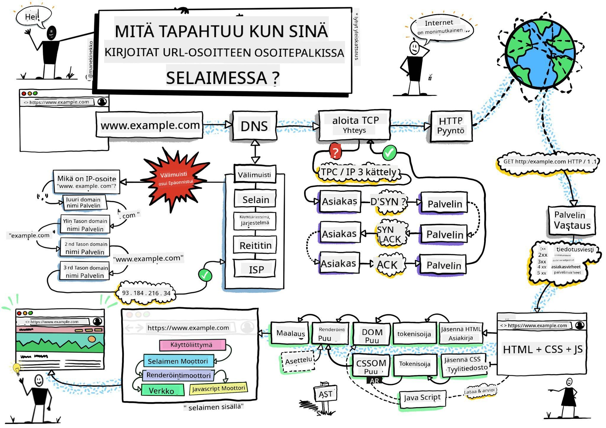
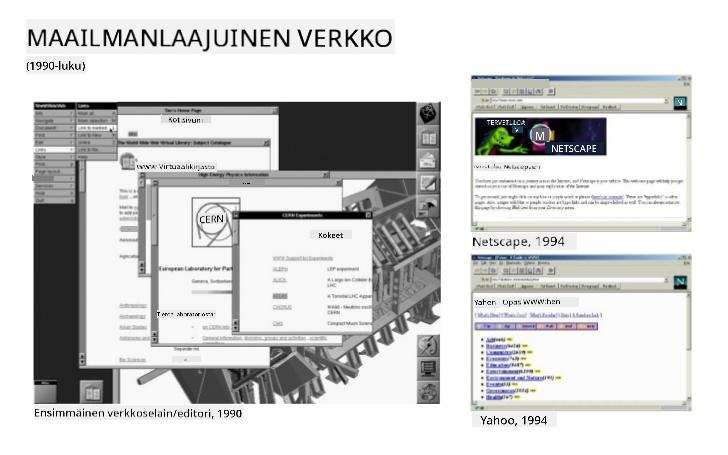
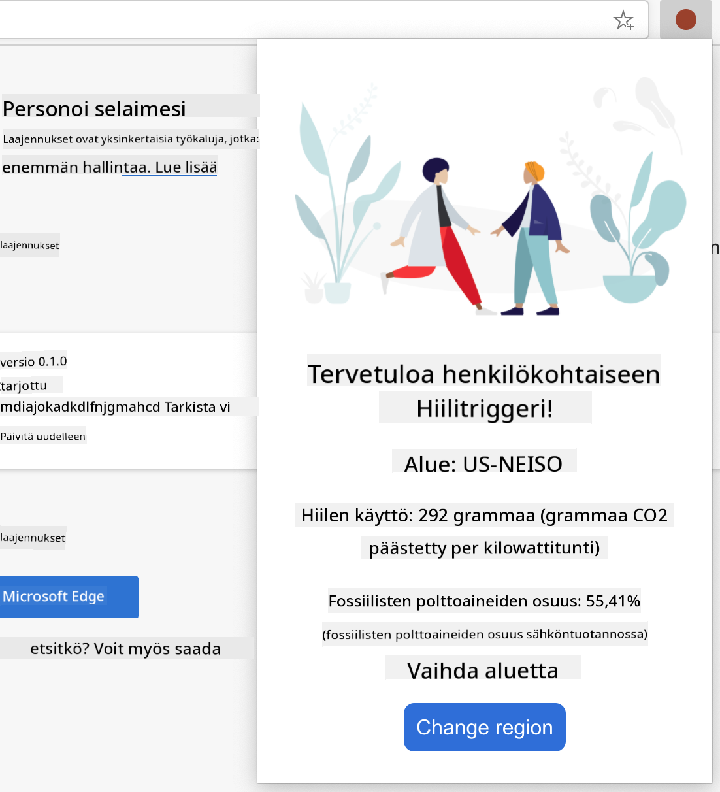

<!--
CO_OP_TRANSLATOR_METADATA:
{
  "original_hash": "2326d04e194a10aa760b51f5e5a1f61d",
  "translation_date": "2025-08-29T00:38:24+00:00",
  "source_file": "5-browser-extension/1-about-browsers/README.md",
  "language_code": "fi"
}
-->
# Selaimen laajennusprojekti Osa 1: Kaikki selaimista


> Luonnoskuva: [Wassim Chegham](https://dev.to/wassimchegham/ever-wondered-what-happens-when-you-type-in-a-url-in-an-address-bar-in-a-browser-3dob)

## Ennakkokysely

[Ennakkokysely](https://ff-quizzes.netlify.app/web/quiz/23)

### Johdanto

Selaimen laajennukset lisäävät selaimeen lisätoimintoja. Ennen kuin alat rakentaa sellaista, sinun kannattaa oppia hieman siitä, miten selaimet toimivat.

### Selaimesta

Tässä oppituntisarjassa opit rakentamaan selaimen laajennuksen, joka toimii Chrome-, Firefox- ja Edge-selaimissa. Tässä osassa tutustut siihen, miten selaimet toimivat, ja hahmottelet selaimen laajennuksen elementtejä.

Mutta mitä selain oikeastaan on? Se on ohjelmistosovellus, joka mahdollistaa loppukäyttäjän pääsyn palvelimen sisältöön ja sen näyttämisen verkkosivuilla.

✅ Pieni historia: ensimmäinen selain oli nimeltään 'WorldWideWeb', ja sen loi Sir Timothy Berners-Lee vuonna 1990.


> Joitakin varhaisia selaimia, lähde: [Karen McGrane](https://www.slideshare.net/KMcGrane/week-4-ixd-history-personal-computing)

Kun käyttäjä yhdistää internetiin URL-osoitteen (Uniform Resource Locator) avulla, yleensä Hypertext Transfer Protocolin kautta `http`- tai `https`-osoitteella, selain kommunikoi verkkopalvelimen kanssa ja hakee verkkosivun.

Tässä vaiheessa selaimen renderöintimoottori näyttää sen käyttäjän laitteella, joka voi olla matkapuhelin, pöytätietokone tai kannettava tietokone.

Selaimet voivat myös välimuistittaa sisältöä, jotta sitä ei tarvitse hakea palvelimelta joka kerta. Ne voivat tallentaa käyttäjän selaushistorian, säilyttää 'evästeitä', jotka ovat pieniä tietopaloja käyttäjän toiminnan tallentamiseen, ja paljon muuta.

On erittäin tärkeää muistaa, että kaikki selaimet eivät ole samanlaisia! Jokaisella selaimella on omat vahvuutensa ja heikkoutensa, ja ammattimaisen web-kehittäjän täytyy ymmärtää, miten verkkosivut saadaan toimimaan hyvin eri selaimissa. Tämä sisältää pienet näyttökoot, kuten matkapuhelimen, sekä käyttäjän, joka on offline-tilassa.

Todella hyödyllinen verkkosivusto, joka kannattaa lisätä kirjanmerkkeihin käyttämässäsi selaimessa, on [caniuse.com](https://www.caniuse.com). Kun rakennat verkkosivuja, caniuse-sivuston tukemien teknologioiden listat auttavat sinua tukemaan käyttäjiäsi parhaalla mahdollisella tavalla.

✅ Miten voit selvittää, mitkä selaimet ovat suosituimpia verkkosivustosi käyttäjäkunnan keskuudessa? Tarkista analytiikkasi - voit asentaa erilaisia analytiikkapaketteja osana verkkokehitysprosessiasi, ja ne kertovat, mitä selaimia käytetään eniten.

## Selaimen laajennukset

Miksi haluaisit rakentaa selaimen laajennuksen? Se on kätevä lisä selaimeen, kun tarvitset nopean pääsyn toistuviin tehtäviin. Esimerkiksi, jos sinun täytyy usein tarkistaa värejä eri verkkosivuilla, voit asentaa värinvalitsimen selaimen laajennuksen. Jos sinulla on vaikeuksia muistaa salasanoja, voit käyttää salasanojen hallintalaajennusta.

Selaimen laajennusten kehittäminen on myös hauskaa. Ne keskittyvät rajattuun määrään tehtäviä, jotka ne suorittavat hyvin.

✅ Mitkä ovat suosikkiselaimen laajennuksesi? Mitä tehtäviä ne suorittavat?

### Laajennusten asentaminen

Ennen kuin alat rakentaa, tutustu selaimen laajennuksen rakentamisen ja käyttöönoton prosessiin. Vaikka jokainen selain hallinnoi tätä tehtävää hieman eri tavalla, prosessi on samankaltainen Chrome- ja Firefox-selaimissa kuin tässä Edge-esimerkissä:


> Huomio: Varmista, että kehittäjätila on kytketty päälle ja salli laajennukset muista kaupoista.

Yleisesti ottaen prosessi on seuraava:

- rakenna laajennuksesi käyttämällä `npm run build` 
- siirry selaimessa laajennusten paneeliin käyttämällä "Asetukset ja lisää" -painiketta (kolmen pisteen kuvake) oikeassa yläkulmassa
- jos kyseessä on uusi asennus, valitse `load unpacked` ladataksesi uuden laajennuksen sen rakennuskansiosta (meidän tapauksessamme se on `/dist`) 
- tai, napsauta `reload`, jos lataat uudelleen jo asennettua laajennusta

✅ Nämä ohjeet koskevat itse rakentamiasi laajennuksia; jos haluat asentaa laajennuksia, jotka on julkaistu selaimen laajennuskauppaan, sinun tulee siirtyä näihin [kauppoihin](https://microsoftedge.microsoft.com/addons/Microsoft-Edge-Extensions-Home) ja asentaa haluamasi laajennus.

### Aloita

Rakennat selaimen laajennuksen, joka näyttää alueesi hiilijalanjäljen, energian käytön ja energian lähteen. Laajennuksessa on lomake, joka kerää API-avaimen, jotta voit käyttää CO2 Signal -API:a.

**Tarvitset:**

- [API-avain](https://www.co2signal.com/); syötä sähköpostiosoitteesi sivuston laatikkoon, ja avain lähetetään sinulle
- [aluekoodi](http://api.electricitymap.org/v3/zones), joka vastaa [Electricity Map](https://www.electricitymap.org/map) -karttaa (esimerkiksi Bostonissa käytän 'US-NEISO')
- [aloituskoodi](../../../../5-browser-extension/start). Lataa `start`-kansio; täydennät koodia tässä kansiossa.
- [NPM](https://www.npmjs.com) - NPM on pakettienhallintatyökalu; asenna se paikallisesti, ja `package.json`-tiedostossa luetellut paketit asennetaan verkkovarojesi käyttöön

✅ Lue lisää pakettienhallinnasta tästä [erinomaisesta oppimismoduulista](https://docs.microsoft.com/learn/modules/create-nodejs-project-dependencies/?WT.mc_id=academic-77807-sagibbon)

Käy hetki läpi koodikanta:

dist
    -|manifest.json (oletusasetukset täällä)
    -|index.html (HTML-merkintä täällä)
    -|background.js (taustalla toimiva JS täällä)
    -|main.js (koottu JS)
src
    -|index.js (JS-koodisi menee tänne)

✅ Kun sinulla on API-avain ja aluekoodi valmiina, tallenna ne muistiinpanoon tulevaa käyttöä varten.

### Rakenna HTML laajennukselle

Tällä laajennuksella on kaksi näkymää. Yksi API-avaimen ja aluekoodin keräämiseen:


Ja toinen alueen hiilidioksidipäästöjen näyttämiseen:



Aloitetaan rakentamalla HTML lomakkeelle ja muotoilemalla se CSS:llä.

`/dist`-kansiossa rakennat lomakkeen ja tulosalueen. `index.html`-tiedostossa täytä rajattu lomakealue:

```HTML
<form class="form-data" autocomplete="on">
	<div>
		<h2>New? Add your Information</h2>
	</div>
	<div>
		<label for="region">Region Name</label>
		<input type="text" id="region" required class="region-name" />
	</div>
	<div>
		<label for="api">Your API Key from tmrow</label>
		<input type="text" id="api" required class="api-key" />
	</div>
	<button class="search-btn">Submit</button>
</form>	
```
Tämä on lomake, jossa tallennettu tieto syötetään ja tallennetaan paikalliseen muistiin.

Seuraavaksi luo tulosalue; lisää joitakin div-elementtejä viimeisen lomaketagin alle:

```HTML
<div class="result">
	<div class="loading">loading...</div>
	<div class="errors"></div>
	<div class="data"></div>
	<div class="result-container">
		<p><strong>Region: </strong><span class="my-region"></span></p>
		<p><strong>Carbon Usage: </strong><span class="carbon-usage"></span></p>
		<p><strong>Fossil Fuel Percentage: </strong><span class="fossil-fuel"></span></p>
	</div>
	<button class="clear-btn">Change region</button>
</div>
```
Tässä vaiheessa voit kokeilla rakennusta. Varmista, että asennat tämän laajennuksen pakettiriippuvuudet:

```
npm install
```

Tämä komento käyttää npm:ää, Node Package Manageria, laajennuksen rakennusprosessin webpackin asentamiseen. Webpack on niputtaja, joka käsittelee koodin kokoamista. Voit nähdä tämän prosessin tuloksen katsomalla `/dist/main.js` -tiedostoa - näet, että koodi on niputettu.

Tällä hetkellä laajennuksen pitäisi rakentua, ja jos otat sen käyttöön Edgessä laajennuksena, näet lomakkeen siististi näytettynä.

Onnittelut, olet ottanut ensimmäiset askeleet kohti selaimen laajennuksen rakentamista. Seuraavissa oppitunneissa teet siitä toimivamman ja hyödyllisemmän.

---

## 🚀 Haaste

Tutustu selaimen laajennuskauppaan ja asenna yksi selaimeesi. Voit tarkastella sen tiedostoja mielenkiintoisilla tavoilla. Mitä huomaat?

## Jälkikysely

[Jälkikysely](https://ff-quizzes.netlify.app/web/quiz/24)

## Kertaus ja itseopiskelu

Tässä oppitunnissa opit hieman verkkoselaimen historiasta; käytä tämä tilaisuus oppiaksesi lisää World Wide Webin keksijöiden visioista lukemalla sen historiasta. Joitakin hyödyllisiä sivustoja ovat:

[Verkkoselainten historia](https://www.mozilla.org/firefox/browsers/browser-history/)

[Verkon historia](https://webfoundation.org/about/vision/history-of-the-web/)

[Haastattelu Tim Berners-Leen kanssa](https://www.theguardian.com/technology/2019/mar/12/tim-berners-lee-on-30-years-of-the-web-if-we-dream-a-little-we-can-get-the-web-we-want)

## Tehtävä 

[Muotoile laajennuksesi uudelleen](assignment.md)

---

**Vastuuvapauslauseke**:  
Tämä asiakirja on käännetty käyttämällä tekoälypohjaista käännöspalvelua [Co-op Translator](https://github.com/Azure/co-op-translator). Vaikka pyrimme tarkkuuteen, huomioithan, että automaattiset käännökset voivat sisältää virheitä tai epätarkkuuksia. Alkuperäistä asiakirjaa sen alkuperäisellä kielellä tulee pitää ensisijaisena lähteenä. Kriittisen tiedon osalta suositellaan ammattimaista ihmiskääntämistä. Emme ole vastuussa väärinkäsityksistä tai virhetulkinnoista, jotka johtuvat tämän käännöksen käytöstä.