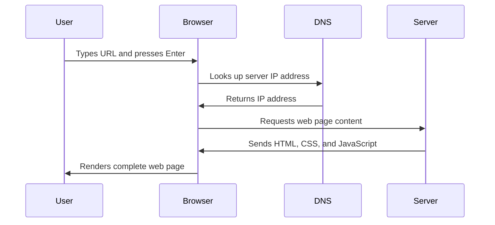

<!--
CO_OP_TRANSLATOR_METADATA:
{
  "original_hash": "33a875c522f237a2026e4653240dfc07",
  "translation_date": "2025-10-23T00:45:31+00:00",
  "source_file": "5-browser-extension/1-about-browsers/README.md",
  "language_code": "fi"
}
-->
# Selaimen laajennusprojekti Osa 1: Kaikki selaimista


> Luonnos: [Wassim Chegham](https://dev.to/wassimchegham/ever-wondered-what-happens-when-you-type-in-a-url-in-an-address-bar-in-a-browser-3dob)

## Ennakkokysely

[Ennakkokysely](https://ff-quizzes.netlify.app/web/quiz/23)

### Johdanto

Selaimen laajennukset ovat pieniä sovelluksia, jotka parantavat verkkoselauskokemusta. Kuten Tim Berners-Leen alkuperäinen visio interaktiivisesta verkosta, laajennukset laajentavat selaimen ominaisuuksia yksinkertaisen dokumenttien katselun ulkopuolelle. Salasananhallinnoista, jotka pitävät tilisi turvassa, värinvalitsimiin, jotka auttavat suunnittelijoita löytämään täydelliset sävyt, laajennukset ratkaisevat arjen selaushaasteita.

Ennen kuin rakennamme ensimmäisen laajennuksesi, ymmärretään, miten selaimet toimivat. Aivan kuten Alexander Graham Bellin piti ymmärtää äänen siirtoa ennen puhelimen keksimistä, selaimen perusteiden tunteminen auttaa sinua luomaan laajennuksia, jotka integroituvat saumattomasti olemassa oleviin selaimen järjestelmiin.

Tämän oppitunnin lopussa ymmärrät selaimen arkkitehtuurin ja olet aloittanut ensimmäisen laajennuksesi rakentamisen.

## Verkkoselainten ymmärtäminen

Verkkoselain on pohjimmiltaan kehittynyt dokumenttien tulkki. Kun kirjoitat "google.com" osoiteriville, selain suorittaa monimutkaisen sarjan operaatioita - pyytää sisältöä palvelimilta ympäri maailmaa, sitten jäsentää ja renderöi koodin interaktiivisiksi verkkosivuiksi, joita näet.

Tämä prosessi muistuttaa, kuinka ensimmäinen selain, WorldWideWeb, suunniteltiin Tim Berners-Leen toimesta vuonna 1990 tekemään hyperlinkitetyt dokumentit kaikkien saataville.

✅ **Pieni historia**: Ensimmäinen selain oli nimeltään 'WorldWideWeb' ja sen loi Sir Timothy Berners-Lee vuonna 1990.


> Joitakin varhaisia selaimia, lähde: [Karen McGrane](https://www.slideshare.net/KMcGrane/week-4-ixd-history-personal-computing)

### Kuinka selaimet käsittelevät verkkosisältöä

Prosessi URL-osoitteen syöttämisestä verkkosivun näkemiseen sisältää useita koordinoituja vaiheita, jotka tapahtuvat sekunneissa:



**Tämä prosessi saavuttaa seuraavat asiat:**
- **Kääntää** ihmisen luettavan URL-osoitteen palvelimen IP-osoitteeksi DNS-haun avulla
- **Luo** turvallisen yhteyden verkkopalvelimeen HTTP- tai HTTPS-protokollien avulla
- **Pyytää** tietyn verkkosivun sisällön palvelimelta
- **Vastaanottaa** HTML-merkintää, CSS-tyylitiedostoja ja JavaScript-koodia palvelimelta
- **Renderöi** kaiken sisällön interaktiiviseksi verkkosivuksi, jonka näet

### Selaimen keskeiset ominaisuudet

Modernit selaimet tarjoavat lukuisia ominaisuuksia, joita laajennusten kehittäjät voivat hyödyntää:

| Ominaisuus | Tarkoitus | Mahdollisuudet laajennuksille |
|------------|-----------|------------------------------|
| **Renderöintimoottori** | Näyttää HTML-, CSS- ja JavaScript-sisällön | Sisällön muokkaus, tyylien injektointi |
| **JavaScript-moottori** | Suorittaa JavaScript-koodia | Mukautetut skriptit, API-yhteydet |
| **Paikallinen tallennus** | Tallentaa dataa paikallisesti | Käyttäjäasetukset, välimuistidata |
| **Verkkopino** | Käsittelee verkkopyyntöjä | Pyynnön seuranta, datan analysointi |
| **Turvamalli** | Suojaa käyttäjiä haitalliselta sisällöltä | Sisällön suodatus, turvallisuuden parannukset |

**Näiden ominaisuuksien ymmärtäminen auttaa sinua:**
- **Tunnistamaan**, missä laajennuksesi voi tuoda eniten arvoa
- **Valitsemaan** oikeat selaimen API:t laajennuksesi toiminnallisuudelle
- **Suunnittelemaan** laajennuksia, jotka toimivat tehokkaasti selaimen järjestelmien kanssa
- **Varmistamaan**, että laajennuksesi noudattaa selaimen turvallisuusparhaita käytäntöjä

### Selainten välisten kehitysnäkökohtien huomioiminen

Eri selaimet toteuttavat standardeja pienin variaatioin, kuten eri ohjelmointikielet voivat käsitellä samaa algoritmia eri tavoin. Chrome, Firefox ja Safari omaavat kukin ainutlaatuisia ominaisuuksia, jotka kehittäjien on otettava huomioon laajennuksia kehittäessään.

> 💡 **Vinkki**: Käytä [caniuse.com](https://www.caniuse.com) tarkistaaksesi, mitkä verkkoteknologiat ovat tuettuja eri selaimissa. Tämä on korvaamatonta, kun suunnittelet laajennuksesi ominaisuuksia!

**Keskeiset näkökohdat laajennusten kehittämisessä:**
- **Testaa** laajennustasi Chrome-, Firefox- ja Edge-selaimissa
- **Sovita** eri selainten laajennus-API:t ja manifestimuodot
- **Käsittele** vaihtelevia suorituskykyominaisuuksia ja rajoituksia
- **Tarjoa** varajärjestelmiä selaimen erityisominaisuuksille, jotka eivät välttämättä ole saatavilla

✅ **Analytiikkatieto**: Voit selvittää, mitkä selaimet ovat käyttäjiesi suosikkeja asentamalla analytiikkapaketteja verkkokehitysprojekteihisi. Tämä tieto auttaa sinua priorisoimaan, mitkä selaimet kannattaa tukea ensin.

## Selaimen laajennusten ymmärtäminen

Selaimen laajennukset ratkaisevat yleisiä verkkoselaushaasteita lisäämällä toiminnallisuutta suoraan selaimen käyttöliittymään. Sen sijaan, että tarvittaisiin erillisiä sovelluksia tai monimutkaisia työnkulkuja, laajennukset tarjoavat välitöntä pääsyä työkaluihin ja ominaisuuksiin.

Tämä konsepti muistuttaa, kuinka varhaiset tietokonepioneerit, kuten Douglas Engelbart, visioivat ihmisten kykyjen laajentamista teknologian avulla - laajennukset laajentavat selaimen perustoiminnallisuutta.

**Suosittuja laajennuskategorioita ja niiden hyötyjä:**
- **Tuottavuustyökalut**: Tehtävien hallinta, muistiinpanosovellukset ja ajanseurantalaitteet, jotka auttavat sinua pysymään järjestyksessä
- **Turvallisuuden parannukset**: Salasananhallinnat, mainosten estäjät ja yksityisyystyökalut, jotka suojaavat tietojasi
- **Kehittäjätyökalut**: Koodin muotoilijat, värinvalitsimet ja virheenkorjaustyökalut, jotka tehostavat kehitystyötä
- **Sisällön parannus**: Lukutilat, videolataajat ja kuvakaappaustyökalut, jotka parantavat verkkokokemustasi

✅ **Pohdintakysymys**: Mitkä ovat suosikkiselaimen laajennuksesi? Mitä erityisiä tehtäviä ne suorittavat ja miten ne parantavat selauskokemustasi?

## Laajennusten asentaminen ja hallinta

Laajennusten asennusprosessin ymmärtäminen auttaa sinua ennakoimaan käyttäjäkokemusta, kun ihmiset asentavat laajennuksesi. Asennusprosessi on standardoitu moderneissa selaimissa, vaikka käyttöliittymän suunnittelussa on pieniä eroja.


> **Tärkeää**: Varmista, että kehittäjätila on päällä ja salli laajennusten asentaminen muista kaupoista, kun testaat omia laajennuksiasi.

### Kehityslaajennuksen asennusprosessi

Kun kehität ja testaat omia laajennuksiasi, noudata tätä työprosessia:

```bash
# Step 1: Build your extension
npm run build
```

**Mitä tämä komento tekee:**
- **Kääntää** lähdekoodisi selaimelle valmiiksi tiedostoiksi
- **Pakkaa** JavaScript-moduulit optimoiduiksi paketeiksi
- **Generoi** lopulliset laajennustiedostot `/dist`-kansioon
- **Valmistelee** laajennuksesi asennusta ja testausta varten

**Vaihe 2: Siirry selaimen laajennuksiin**
1. **Avaa** selaimesi laajennusten hallintasivu
2. **Klikkaa** "Asetukset ja lisää" -painiketta (kolme pistettä) oikeassa yläkulmassa
3. **Valitse** "Laajennukset" pudotusvalikosta

**Vaihe 3: Lataa laajennuksesi**
- **Uusille asennuksille**: Valitse `load unpacked` ja valitse `/dist`-kansiosi
- **Päivityksille**: Klikkaa `reload` jo asennetun laajennuksen vieressä
- **Testausta varten**: Ota käyttöön "Kehittäjätila" saadaksesi lisävirheenkorjausominaisuuksia

### Julkaistun laajennuksen asennus

> ✅ **Huomio**: Nämä kehitysohjeet koskevat erityisesti itse rakentamiasi laajennuksia. Julkaistujen laajennusten asentamiseksi käy virallisissa selaimen laajennuskaupoissa, kuten [Microsoft Edge Add-ons store](https://microsoftedge.microsoft.com/addons/Microsoft-Edge-Extensions-Home).

**Erojen ymmärtäminen:**
- **Kehitysasennukset** antavat sinun testata julkaisemattomia laajennuksia kehityksen aikana
- **Kauppa-asennukset** tarjoavat tarkastettuja, julkaistuja laajennuksia automaattisilla päivityksillä
- **Sivulataus** mahdollistaa laajennusten asentamisen virallisten kauppojen ulkopuolelta (vaatii kehittäjätilan)

## Hiilijalanjälkilaajennuksen rakentaminen

Luomme selaimen laajennuksen, joka näyttää alueesi energiankäytön hiilijalanjäljen. Tämä projekti havainnollistaa keskeisiä laajennusten kehityskonsepteja samalla kun luodaan käytännöllinen työkalu ympäristötietoisuuden lisäämiseksi.

Tämä lähestymistapa noudattaa "tekemällä oppimisen" periaatetta, joka on osoittautunut tehokkaaksi John Deweyn pedagogisten teorioiden mukaan - yhdistämällä tekniset taidot merkityksellisiin tosielämän sovelluksiin.

### Projektin vaatimukset

Ennen kehityksen aloittamista kerätään tarvittavat resurssit ja riippuvuudet:

**Vaadittu API-pääsy:**
- **[CO2 Signal API -avain](https://www.co2signal.com/)**: Syötä sähköpostiosoitteesi saadaksesi ilmaisen API-avaimen
- **[Aluekoodi](http://api.electricitymap.org/v3/zones)**: Löydä aluekoodisi [Electricity Map](https://www.electricitymap.org/map) -sivustolta (esimerkiksi Boston käyttää 'US-NEISO')

**Kehitystyökalut:**
- **[Node.js ja NPM](https://www.npmjs.com)**: Pakettienhallintatyökalu projektin riippuvuuksien asentamiseen
- **[Aloituskoodi](../../../../5-browser-extension/start)**: Lataa `start`-kansio kehityksen aloittamiseksi

✅ **Lisätietoja**: Paranna pakettienhallintataitojasi tällä [kattavalla oppimismoduulilla](https://docs.microsoft.com/learn/modules/create-nodejs-project-dependencies/?WT.mc_id=academic-77807-sagibbon)

### Projektirakenteen ymmärtäminen

Projektirakenteen ymmärtäminen auttaa organisoimaan kehitystyötä tehokkaasti. Kuten Aleksandrian kirjasto oli järjestetty helppoa tiedonhakua varten, hyvin organisoitu koodipohja tekee kehityksestä tehokkaampaa:

```
project-root/
├── dist/                    # Built extension files
│   ├── manifest.json        # Extension configuration
│   ├── index.html           # User interface markup
│   ├── background.js        # Background script functionality
│   └── main.js              # Compiled JavaScript bundle
└── src/                     # Source development files
    └── index.js             # Your main JavaScript code
```

**Mitä kukin tiedosto tekee:**
- **`manifest.json`**: **Määrittää** laajennuksen metatiedot, käyttöoikeudet ja aloituspisteet
- **`index.html`**: **Luo** käyttöliittymän, joka näkyy, kun käyttäjät klikkaavat laajennustasi
- **`background.js`**: **Käsittelee** taustatehtäviä ja selaimen tapahtumakuuntelijoita
- **`main.js`**: **Sisältää** lopullisen pakatun JavaScriptin rakennusprosessin jälkeen
- **`src/index.js`**: **Sisältää** pääkehityskoodisi, joka käännetään `main.js`:ksi

> 💡 **Organisointivinkki**: Tallenna API-avaimesi ja aluekoodisi turvalliseen muistiinpanoon, jotta voit helposti viitata niihin kehityksen aikana. Tarvitset näitä arvoja testataksesi laajennuksesi toiminnallisuutta.

✅ **Turvallisuusvinkki**: Älä koskaan tallenna API-avaimia tai arkaluontoisia tunnistetietoja koodivarastoon. Näytämme sinulle, kuinka käsitellä näitä turvallisesti seuraavissa vaiheissa.

## Laajennuksen käyttöliittymän luominen

Nyt rakennamme käyttöliittymäkomponentit. Laajennus käyttää kaksivaiheista lähestymistapaa: asetusten määrittämisnäkymä alkuasetuksille ja tulosnäkymä datan näyttämiseen.

Tämä noudattaa progressiivisen paljastamisen periaatetta, jota on käytetty käyttöliittymäsuunnittelussa tietotekniikan alkuajoista lähtien - tietojen ja vaihtoehtojen paljastaminen loogisessa järjestyksessä, jotta käyttäjät eivät kuormitu liikaa.

### Laajennusnäkymien yleiskatsaus

**Asetusnäkymä** - Ensimmäisen käyttökerran asetusten määrittäminen:


**Tulosnäkymä** - Hiilijalanjälkitietojen näyttäminen:


### Asetuslomakkeen rakentaminen

Asetuslomake kerää käyttäjän konfigurointitiedot ensimmäisen käytön aikana. Kun asetukset on määritetty, tiedot säilyvät selaimen muistissa tulevia istuntoja varten.

Lisää tämä lomakerakenne tiedostoon `/dist/index.html`:

```html
<form class="form-data" autocomplete="on">
    <div>
        <h2>New? Add your Information</h2>
    </div>
    <div>
        <label for="region">Region Name</label>
        <input type="text" id="region" required class="region-name" />
    </div>
    <div>
        <label for="api">Your API Key from tmrow</label>
        <input type="text" id="api" required class="api-key" />
    </div>
    <button class="search-btn">Submit</button>
</form>
```

**Tämä lomake saavuttaa seuraavat asiat:**
- **Luo** semanttisen lomakerakenteen oikeilla etiketeillä ja syöttöyhdistelmillä
- **Mahdollistaa** selaimen automaattisen täydennystoiminnon parantaakseen käyttäjäkokemusta
- **Vaatii** molempien kenttien täyttämisen ennen lähettämistä `required`-attribuutin avulla
- **Järjestää** syötteet kuvaavilla luokkanimillä helppoa tyylittelyä ja JavaScriptin kohdistamista varten
- **Tarjoaa** selkeät ohjeet käyttäjille, jotka määrittävät laajennuksen ensimmäistä kertaa

### Tulosnäkymän rakentaminen

Seuraavaksi luodaan tulosalue, joka näyttää hiilijalanjälkitiedot. Lisää tämä HTML-lomake lomakkeen alle:

```html
<div class="result">
    <div class="loading">loading...</div>
    <div class="errors"></div>
    <div class="data"></div>
    <div class="result-container">
        <p><strong>Region: </strong><span class="my-region"></span></p>
        <p><strong>Carbon Usage: </strong><span class="carbon-usage"></span></p>
        <p><strong>Fossil Fuel Percentage: </strong><span class="fossil-fuel"></span></p>
    </div>
    <button class="clear-btn">Change region</button>
</div>
```

**Mitä tämä rakenne tarjoaa:**
- **`loading`**: **Näyttää** latausviestin, kun API-dataa haetaan
- **`errors`**: **Näyttää** virheilmoituksia, jos API-kutsut epäonnistuvat tai data on virheellistä
- **`data`**: **Sisältää** raakadataa virheenkorjausta varten kehityksen aikana
- **`result-container`**: **Esittää** muotoiltua hiilijalanjälkitietoa käyttäjille
- **`clear-btn`**: **Mahdollistaa** käyttäjien vaihtaa aluetta ja määrittää laajennuksen uudelleen

### Rakennusprosessin asettaminen

Asennetaan projekt
**Kuvaus:** Paranna selainlaajennusta lisäämällä lomakevalidointi ja käyttäjäpalautetoimintoja, jotta käyttäjäkokemus API-avainten ja aluekoodien syöttämisessä paranee.

**Tehtävä:** Luo JavaScript-validointifunktioita, jotka tarkistavat, että API-avainkentässä on vähintään 20 merkkiä ja että aluekoodi noudattaa oikeaa muotoa (esim. 'US-NEISO'). Lisää visuaalista palautetta muuttamalla syöttökentän reunaväriä vihreäksi, jos syöte on kelvollinen, ja punaiseksi, jos se on virheellinen. Lisää myös ominaisuus, jolla API-avain voidaan näyttää/piilottaa turvallisuussyistä.

Lue lisää [agent mode](https://code.visualstudio.com/blogs/2025/02/24/introducing-copilot-agent-mode) -toiminnosta täältä.

## 🚀 Haaste

Tutustu selainlaajennuskauppaan ja asenna jokin laajennus selaimeesi. Voit tarkastella sen tiedostoja mielenkiintoisilla tavoilla. Mitä löydät?

## Jälkiluennon kysely

[Jälkiluennon kysely](https://ff-quizzes.netlify.app/web/quiz/24)

## Kertaus & Itseopiskelu

Tässä oppitunnissa opit hieman verkkoselaimen historiasta; käytä tämä tilaisuus oppiaksesi lisää siitä, miten World Wide Webin keksijät näkivät sen käytön lukemalla lisää sen historiasta. Hyödyllisiä sivustoja ovat esimerkiksi:

[Verkkoselainten historia](https://www.mozilla.org/firefox/browsers/browser-history/)

[Verkon historia](https://webfoundation.org/about/vision/history-of-the-web/)

[Haastattelu Tim Berners-Leen kanssa](https://www.theguardian.com/technology/2019/mar/12/tim-berners-lee-on-30-years-of-the-web-if-we-dream-a-little-we-can-get-the-web-we-want)

## Tehtävä

[Muokkaa laajennuksesi ulkoasua](assignment.md)

---

**Vastuuvapauslauseke**:  
Tämä asiakirja on käännetty käyttämällä tekoälypohjaista käännöspalvelua [Co-op Translator](https://github.com/Azure/co-op-translator). Vaikka pyrimme tarkkuuteen, huomioithan, että automaattiset käännökset voivat sisältää virheitä tai epätarkkuuksia. Alkuperäinen asiakirja sen alkuperäisellä kielellä tulisi pitää ensisijaisena lähteenä. Kriittisen tiedon osalta suositellaan ammattimaista ihmiskäännöstä. Emme ole vastuussa väärinkäsityksistä tai virhetulkinnoista, jotka johtuvat tämän käännöksen käytöstä.