<!--
CO_OP_TRANSLATOR_METADATA:
{
  "original_hash": "00aa85715e1efd4930c17a23e3012e69",
  "translation_date": "2025-11-04T01:46:41+00:00",
  "source_file": "5-browser-extension/1-about-browsers/README.md",
  "language_code": "fi"
}
-->
# Selaimen laajennusprojekti Osa 1: Kaikki selaimista

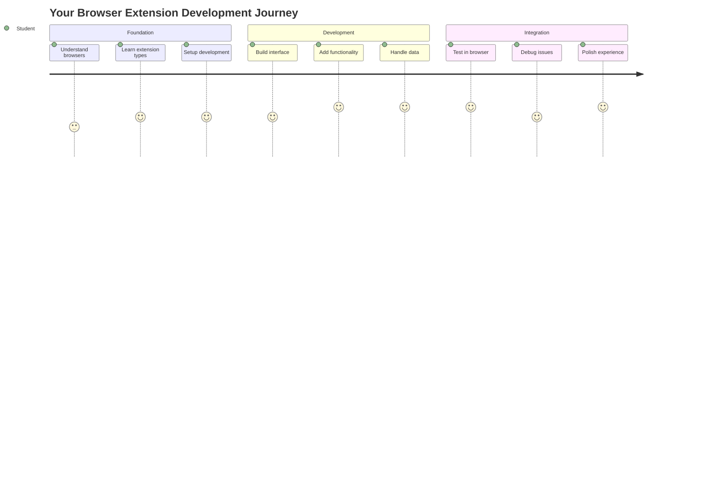

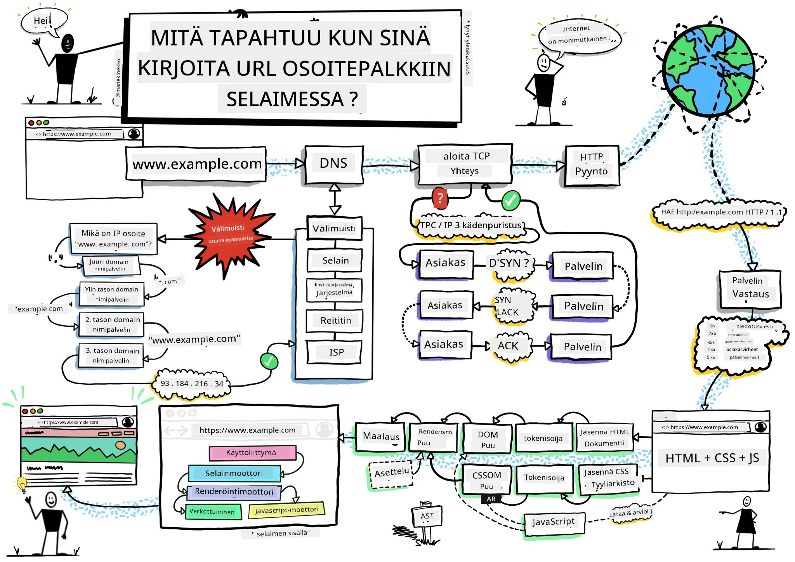
> Luonnos: [Wassim Chegham](https://dev.to/wassimchegham/ever-wondered-what-happens-when-you-type-in-a-url-in-an-address-bar-in-a-browser-3dob)

## Ennakkokysely

[Ennakkokysely](https://ff-quizzes.netlify.app/web/quiz/23)

### Johdanto

Selaimen laajennukset ovat pieniä sovelluksia, jotka parantavat verkkoselauskokemustasi. Kuten Tim Berners-Leen alkuperäinen visio interaktiivisesta verkosta, laajennukset laajentavat selaimen ominaisuuksia yksinkertaisen dokumenttien katselun ulkopuolelle. Salasananhallinnasta, joka pitää tilisi turvassa, värinvalitsimiin, jotka auttavat suunnittelijoita löytämään täydelliset sävyt, laajennukset ratkaisevat arjen selaushaasteita.

Ennen kuin rakennamme ensimmäisen laajennuksesi, ymmärretään, miten selaimet toimivat. Aivan kuten Alexander Graham Bellin piti ymmärtää äänen siirtoa ennen puhelimen keksimistä, selaimen perusteiden tunteminen auttaa sinua luomaan laajennuksia, jotka integroituvat saumattomasti olemassa oleviin selaimen järjestelmiin.

Tämän oppitunnin lopussa ymmärrät selaimen arkkitehtuurin ja olet aloittanut ensimmäisen laajennuksesi rakentamisen.

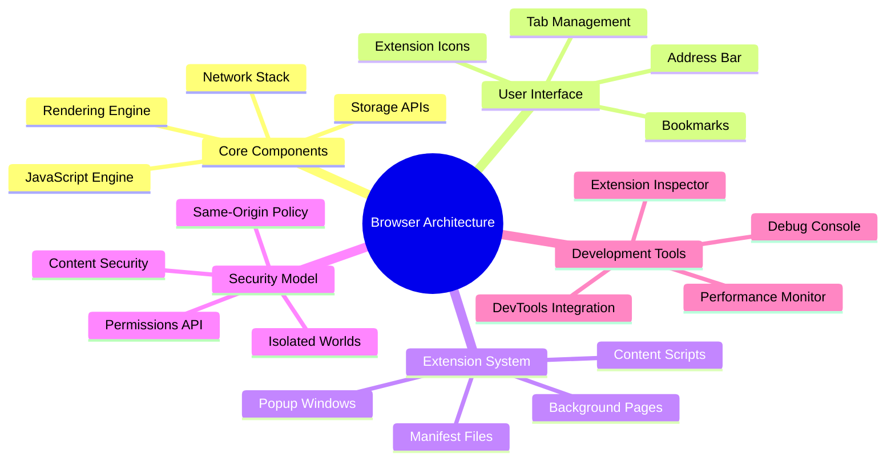

## Verkkoselainten ymmärtäminen

Verkkoselain on pohjimmiltaan kehittynyt dokumenttien tulkki. Kun kirjoitat "google.com" osoiteriville, selain suorittaa monimutkaisen sarjan operaatioita - pyytää sisältöä palvelimilta ympäri maailmaa, sitten jäsentää ja renderöi koodin interaktiivisiksi verkkosivuiksi, joita näet.

Tämä prosessi muistuttaa, kuinka ensimmäinen selain, WorldWideWeb, suunniteltiin Tim Berners-Leen toimesta vuonna 1990, jotta hyperlinkitetyt dokumentit olisivat kaikkien saatavilla.

✅ **Pieni historia**: Ensimmäinen selain oli nimeltään 'WorldWideWeb' ja sen loi Sir Timothy Berners-Lee vuonna 1990.

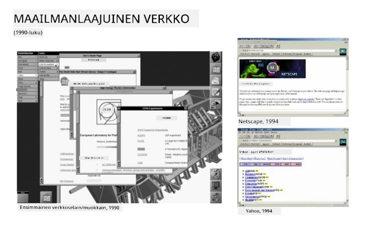
> Joitakin varhaisia selaimia, lähde: [Karen McGrane](https://www.slideshare.net/KMcGrane/week-4-ixd-history-personal-computing)

### Kuinka selaimet käsittelevät verkkosisältöä

Prosessi URL-osoitteen syöttämisestä verkkosivun näkemiseen sisältää useita koordinoituja vaiheita, jotka tapahtuvat sekunneissa:

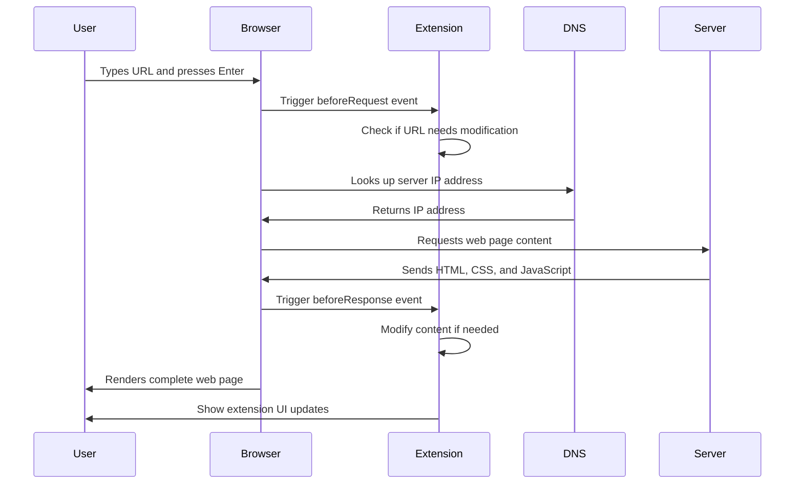

**Tämä prosessi saavuttaa seuraavat asiat:**
- **Muuntaa** ihmisen luettavan URL-osoitteen palvelimen IP-osoitteeksi DNS-haun avulla
- **Luo** turvallisen yhteyden verkkopalvelimeen HTTP- tai HTTPS-protokollien avulla
- **Pyytää** tietyn verkkosivun sisällön palvelimelta
- **Vastaanottaa** HTML-merkintää, CSS-tyylitiedostoja ja JavaScript-koodia palvelimelta
- **Renderöi** kaiken sisällön interaktiiviseksi verkkosivuksi, jonka näet

### Selaimen keskeiset ominaisuudet

Modernit selaimet tarjoavat lukuisia ominaisuuksia, joita laajennusten kehittäjät voivat hyödyntää:

| Ominaisuus | Tarkoitus | Mahdollisuudet laajennuksille |
|------------|-----------|------------------------------|
| **Renderöintimoottori** | Näyttää HTML-, CSS- ja JavaScript-sisällön | Sisällön muokkaus, tyylien injektio |
| **JavaScript-moottori** | Suorittaa JavaScript-koodia | Mukautetut skriptit, API-yhteydet |
| **Paikallinen tallennus** | Tallentaa dataa paikallisesti | Käyttäjäasetukset, välimuistidata |
| **Verkkopino** | Käsittelee verkkopyyntöjä | Pyynnön seuranta, datan analysointi |
| **Turvamalli** | Suojaa käyttäjiä haitalliselta sisällöltä | Sisällön suodatus, turvallisuuden parannukset |

**Näiden ominaisuuksien ymmärtäminen auttaa sinua:**
- **Tunnistamaan**, missä laajennuksesi voi tuoda eniten arvoa
- **Valitsemaan** oikeat selaimen API:t laajennuksesi toiminnallisuudelle
- **Suunnittelemaan** laajennuksia, jotka toimivat tehokkaasti selaimen järjestelmien kanssa
- **Varmistamaan**, että laajennuksesi noudattaa selaimen turvallisuusparhaita käytäntöjä

### Selainten välinen kehityksen huomioiminen

Eri selaimet toteuttavat standardeja pienillä eroilla, kuten eri ohjelmointikielet voivat käsitellä samaa algoritmia eri tavoin. Chrome, Firefox ja Safari omaavat jokainen ainutlaatuisia ominaisuuksia, jotka kehittäjien tulee ottaa huomioon laajennusten kehityksen aikana.

> 💡 **Vinkki**: Käytä [caniuse.com](https://www.caniuse.com) tarkistaaksesi, mitkä verkkoteknologiat ovat tuettuja eri selaimissa. Tämä on korvaamatonta laajennuksesi ominaisuuksien suunnittelussa!

**Keskeiset huomiot laajennusten kehityksessä:**
- **Testaa** laajennuksesi Chromessa, Firefoxissa ja Edgessä
- **Sovita** eri selainten laajennus-API:t ja manifest-muodot
- **Käsittele** vaihtelevat suorituskykyominaisuudet ja rajoitukset
- **Tarjoa** varajärjestelmiä selaimen erityisominaisuuksille, jotka eivät ehkä ole saatavilla

✅ **Analytiikkatieto**: Voit selvittää, mitkä selaimet käyttäjäsi suosivat asentamalla analytiikkapaketteja verkkokehitysprojekteihisi. Tämä data auttaa sinua priorisoimaan, mitkä selaimet kannattaa tukea ensin.

## Selaimen laajennusten ymmärtäminen

Selaimen laajennukset ratkaisevat yleisiä verkkoselaushaasteita lisäämällä toiminnallisuutta suoraan selaimen käyttöliittymään. Sen sijaan, että tarvittaisiin erillisiä sovelluksia tai monimutkaisia työnkulkuja, laajennukset tarjoavat välittömän pääsyn työkaluihin ja ominaisuuksiin.

Tämä konsepti muistuttaa, kuinka varhaiset tietokonepioneerit kuten Douglas Engelbart visioivat ihmisten kykyjen laajentamista teknologian avulla - laajennukset laajentavat selaimen perustoiminnallisuutta.

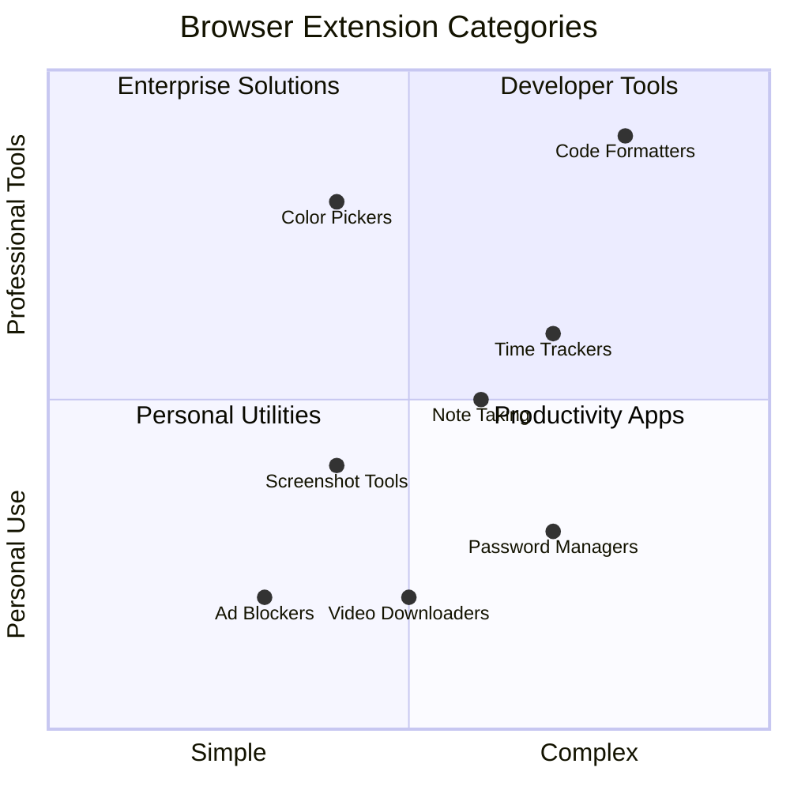

**Suosittuja laajennuskategorioita ja niiden hyödyt:**
- **Tuottavuustyökalut**: Tehtävienhallinta, muistiinpanosovellukset ja ajanseurantalaitteet, jotka auttavat sinua pysymään järjestyksessä
- **Turvallisuuden parannukset**: Salasananhallinta, mainosten estäjät ja yksityisyystyökalut, jotka suojaavat tietojasi
- **Kehittäjätyökalut**: Koodin muotoilijat, värinvalitsimet ja virheenkorjaustyökalut, jotka tehostavat kehitystä
- **Sisällön parannukset**: Lukutilat, videolataajat ja kuvakaappaustyökalut, jotka parantavat verkkokokemustasi

✅ **Pohdintakysymys**: Mitkä ovat suosikkiselaimen laajennuksesi? Mitä erityisiä tehtäviä ne suorittavat ja miten ne parantavat selauskokemustasi?

### 🔄 **Pedagoginen tarkistus**
**Selaimen arkkitehtuurin ymmärtäminen**: Ennen kuin siirryt laajennusten kehittämiseen, varmista, että osaat:
- ✅ Selittää, kuinka selaimet käsittelevät verkkopyyntöjä ja renderöivät sisältöä
- ✅ Tunnistaa selaimen arkkitehtuurin pääkomponentit
- ✅ Ymmärtää, kuinka laajennukset integroituvat selaimen toiminnallisuuteen
- ✅ Tunnistaa turvamallin, joka suojaa käyttäjiä

**Nopea itsearviointi**: Osaatko jäljittää polun URL-osoitteen kirjoittamisesta verkkosivun näkemiseen?
1. **DNS-haku** muuntaa URL-osoitteen IP-osoitteeksi
2. **HTTP-pyyntö** hakee sisältöä palvelimelta
3. **Jäsentäminen** käsittelee HTML-, CSS- ja JavaScript-sisällön
4. **Renderöinti** näyttää lopullisen verkkosivun
5. **Laajennukset** voivat muokata sisältöä useissa vaiheissa

## Laajennusten asentaminen ja hallinta

Laajennuksen asennusprosessin ymmärtäminen auttaa sinua ennakoimaan käyttäjäkokemusta, kun ihmiset asentavat laajennuksesi. Asennusprosessi on standardoitu moderneissa selaimissa, pienillä käyttöliittymäsuunnittelun eroilla.

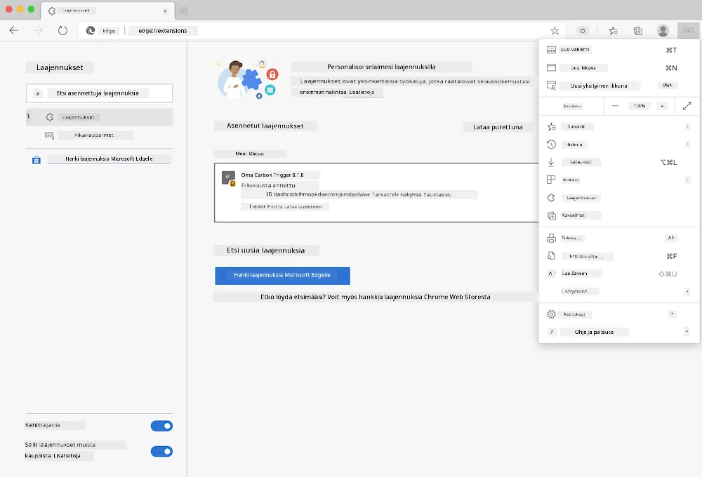

> **Tärkeää**: Varmista, että kehittäjätila on kytketty päälle ja salli laajennusten asentaminen muista kaupoista testatessasi omia laajennuksiasi.

### Kehityslaajennuksen asennusprosessi

Kun kehität ja testaat omia laajennuksiasi, noudata tätä työnkulkua:

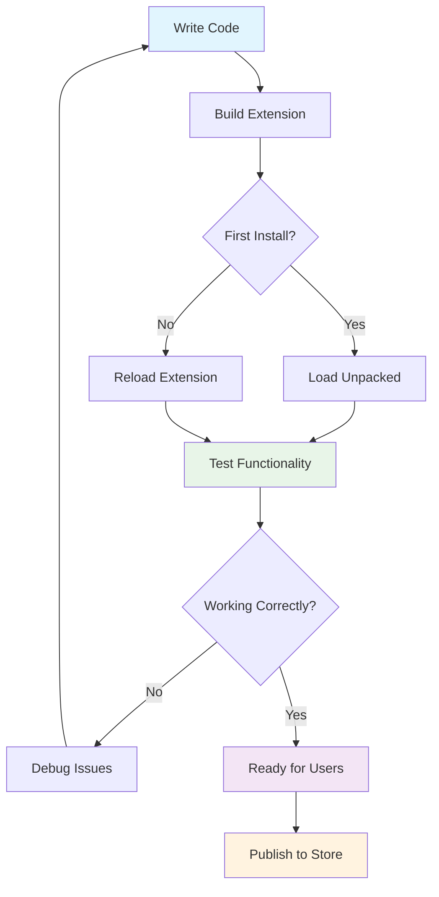

```bash
# Step 1: Build your extension
npm run build
```

**Mitä tämä komento saavuttaa:**
- **Kääntää** lähdekoodisi selaimelle valmiiksi tiedostoiksi
- **Paketoi** JavaScript-moduulit optimoiduiksi paketeiksi
- **Generoi** lopulliset laajennustiedostot `/dist`-kansioon
- **Valmistelee** laajennuksesi asennusta ja testausta varten

**Vaihe 2: Siirry selaimen laajennuksiin**
1. **Avaa** selaimesi laajennusten hallintasivu
2. **Klikkaa** "Asetukset ja lisää" -painiketta (kolmen pisteen kuvake) oikeassa yläkulmassa
3. **Valitse** "Laajennukset" pudotusvalikosta

**Vaihe 3: Lataa laajennuksesi**
- **Uusille asennuksille**: Valitse `load unpacked` ja valitse `/dist`-kansiosi
- **Päivityksille**: Klikkaa `reload` jo asennetun laajennuksen vieressä
- **Testausta varten**: Ota käyttöön "Kehittäjätila" saadaksesi lisävirheenkorjausominaisuuksia

### Julkaistun laajennuksen asennus

> ✅ **Huomio**: Nämä kehitysohjeet ovat erityisesti itse rakentamillesi laajennuksille. Julkaistujen laajennusten asentamiseksi käy virallisissa selaimen laajennuskaupoissa, kuten [Microsoft Edge Add-ons store](https://microsoftedge.microsoft.com/addons/Microsoft-Edge-Extensions-Home).

**Erojen ymmärtäminen:**
- **Kehitysasennukset** antavat sinun testata julkaisemattomia laajennuksia kehityksen aikana
- **Kauppa-asennukset** tarjoavat tarkastettuja, julkaistuja laajennuksia automaattisilla päivityksillä
- **Sivulataus** mahdollistaa laajennusten asentamisen virallisten kauppojen ulkopuolelta (vaatii kehittäjätilan)

## Hiilijalanjälkilaajennuksen rakentaminen

Luomme selaimen laajennuksen, joka näyttää alueesi energiankäytön hiilijalanjäljen. Tämä projekti esittelee olennaisia laajennusten kehityskonsepteja samalla kun luodaan käytännöllinen työkalu ympäristötietoisuuden lisäämiseksi.

Tämä lähestymistapa seuraa "tekemällä oppimisen" periaatetta, joka on osoittautunut tehokkaaksi John Deweyn koulutusteorioista lähtien - yhdistämällä tekniset taidot merkityksellisiin tosielämän sovelluksiin.

### Projektin vaatimukset

Ennen kehityksen aloittamista kerätään tarvittavat resurssit ja riippuvuudet:

**Vaadittu API-pääsy:**
- **[CO2 Signal API-avain](https://www.co2signal.com/)**: Syötä sähköpostiosoitteesi saadaksesi ilmaisen API-avaimen
- **[Aluekoodi](http://api.electricitymap.org/v3/zones)**: Löydä aluekoodisi käyttämällä [Electricity Map](https://www.electricitymap.org/map) -sivustoa (esimerkiksi Boston käyttää 'US-NEISO')

**Kehitystyökalut:**
- **[Node.js ja NPM](https://www.npmjs.com)**: Pakettienhallintatyökalu projektin riippuvuuksien asentamiseen
- **[Aloituskoodi](../../../../5-browser-extension/start)**: Lataa `start`-kansio aloittaaksesi kehityksen

✅ **Lisätietoja**: Paranna pakettienhallintataitojasi tällä [kattavalla oppimismoduulilla](https://docs.microsoft.com/learn/modules/create-nodejs-project-dependencies/?WT.mc_id=academic-77807-sagibbon)

### Projektirakenteen ymmärtäminen

Projektirakenteen ymmärtäminen auttaa järjestämään kehitystyötä tehokkaasti. Kuten Aleksandrian kirjasto oli järjestetty tiedon helppoa hakua varten, hyvin organisoitu koodipohja tekee kehityksestä tehokkaampaa:

```
project-root/
├── dist/                    # Built extension files
│   ├── manifest.json        # Extension configuration
│   ├── index.html           # User interface markup
│   ├── background.js        # Background script functionality
│   └── main.js              # Compiled JavaScript bundle
├── src/                     # Source development files
│   └── index.js             # Your main JavaScript code
├── package.json             # Project dependencies and scripts
└── webpack.config.js        # Build configuration
```

**Mitä kukin tiedosto tekee:**
- **`manifest.json`**: **Määrittää** laajennuksen metatiedot, käyttöoikeudet ja aloituspisteet
- **`index.html`**: **Luo** käyttöliittymän, joka näkyy, kun käyttäjät klikkaavat laajennustasi
- **`background.js`**: **Käsittelee** taustatehtäviä ja selaimen tapahtumakuuntelijoita
- **`main.js`**: **Sisältää** lopullisen käännetyn JavaScriptin rakennusprosessin jälkeen
- **`src/index.js`**: **Sisältää** pääkehityskoodisi, joka käännetään `main.js`-tiedostoksi

> 💡 **Organisointivinkki**: Tallenna API-avaimesi ja aluekoodisi turvalliseen muistiinpanoon, jotta voit helposti viitata niihin kehityksen aikana. Tarvitset näitä arvoja testataksesi laajennuksesi toiminnallisuutta.

✅ **Turvallisuusmuistutus**: Älä koskaan tallenna API-avaimia tai arkaluontoisia tunnuksia koodivarastoosi. Näytämme sinulle, kuinka käsitellä näitä turvallisesti seuraavissa vaiheissa.

## Laajennuksen käyttöliittymän luominen

Nyt rakennamme käyttöliittymäkomponentit. Laajennus käyttää kahden näytön lähestymistapaa: asetusten näyttö alkuasetuksille ja tulosnäyttö datan esittämiseen.

Tämä noudattaa progressiivisen paljastamisen periaatetta, jota on käytetty käyttöliittymäsuunnittelussa tietokoneiden alkuajoista lähtien - tietojen ja vaihtoehtojen paljastaminen loogisessa järjestyksessä, jotta käyttäjät eivät tunne itseään ylivoimaisiksi.

### Laajennusnäkymien yleiskatsaus

**Asetusnäkymä** - Ensimmäisen käyttökerran asetukset:
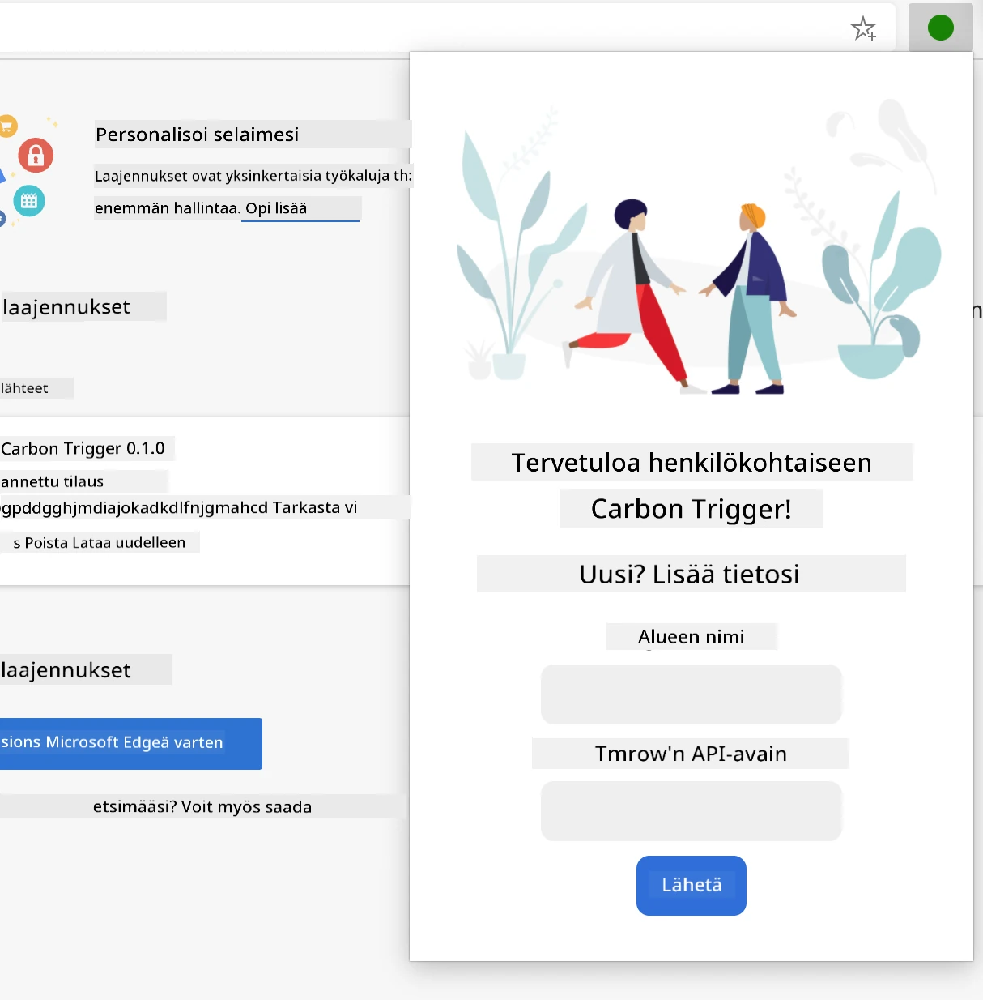

**Tulosnäkymä** - Hiilijalanjälkitietojen näyttö:
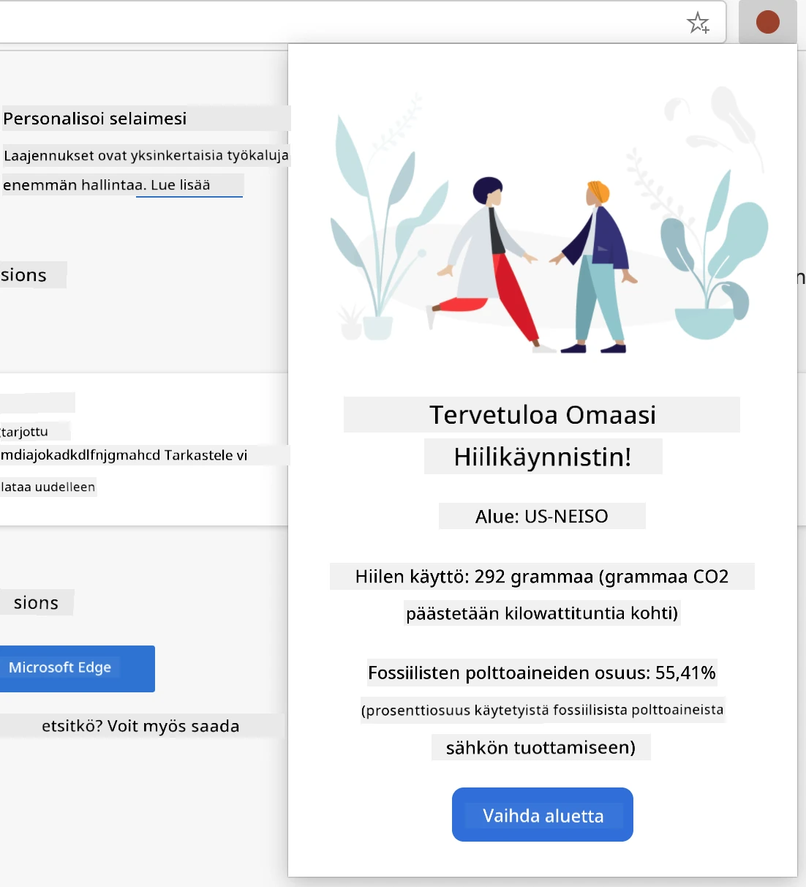

### Asetuslomakkeen rakentaminen

Asetuslomake kerää käyttäjän asetustiedot ensimmäisen käytön aikana. Kun asetukset on määritetty, tiedot säilyvät selaimen muistissa tulevia istuntoja varten.

Lisää `/dist/index.html`-tiedostoon tämä lomakerakenne:

```html
<form class="form-data" autocomplete="on">
    <div>
        <h2>New? Add your Information</h2>
    </div>
    <div>
        <label for="region">Region Name</label>
        <input type="text" id="region" required class="region-name" />
    </div>
    <div>
        <label for="api">Your API Key from tmrow</label>
        <input type="text" id="api" required class="api-key" />
    </div>
    <button class="search-btn">Submit</button>
</form>
```

**Mitä tämä lomake saavuttaa:**
- **Luo** semanttisen lomakerakenteen oikeilla etiketeillä ja syöttöyhdistyksillä
- **Mahdollistaa** selaimen automaattisen täydennystoiminnon paremman käyttökokemuksen saavuttamiseksi
- **Vaatii** molempien kenttien täyttämisen ennen lähettämistä `required`-attribuutin avulla
- **Järjestää** syötteet kuvaavilla luokkanim
1. **Suorita** build-komento koodisi kääntämiseksi  
2. **Lataa** laajennus selaimeesi kehittäjätilassa  
3. **Varmista**, että lomake näkyy oikein ja näyttää ammattimaiselta  
4. **Tarkista**, että kaikki lomakkeen elementit ovat oikein linjassa ja toimivat  

**Mitä olet saavuttanut:**  
- **Rakentanut** laajennuksesi perustavan HTML-rakenteen  
- **Luonut** sekä asetusten että tulosten käyttöliittymät oikealla semanttisella merkinnällä  
- **Ottanut käyttöön** modernin kehitystyönkulun alan standardityökaluilla  
- **Valmistellut** pohjan interaktiivisen JavaScript-toiminnallisuuden lisäämiselle  

### 🔄 **Pedagoginen välikatsaus**  
**Laajennuksen kehityksen eteneminen**: Varmista ymmärryksesi ennen jatkamista:  
- ✅ Osaatko selittää projektirakenteen jokaisen tiedoston tarkoituksen?  
- ✅ Ymmärrätkö, miten build-prosessi muuntaa lähdekoodisi?  
- ✅ Miksi erottelemme asetukset ja tulokset eri käyttöliittymäosioihin?  
- ✅ Miten lomakerakenne tukee sekä käytettävyyttä että saavutettavuutta?  

**Kehitystyönkulun ymmärtäminen**: Sinun pitäisi nyt pystyä:  
1. **Muokkaamaan** HTML- ja CSS-tiedostoja laajennuksen käyttöliittymää varten  
2. **Suorittamaan** build-komento muutosten kääntämiseksi  
3. **Lataamaan** laajennuksen uudelleen selaimeesi testataksesi päivityksiä  
4. **Vianetsimään** ongelmia selaimen kehittäjätyökaluilla  

Olet suorittanut selaimen laajennuksen kehityksen ensimmäisen vaiheen. Kuten Wrightin veljekset ensin tarvitsivat aerodynamiikan ymmärtämistä ennen lentämistä, näiden peruskäsitteiden ymmärtäminen valmistaa sinut rakentamaan monimutkaisempia interaktiivisia ominaisuuksia seuraavassa oppitunnissa.  

## GitHub Copilot Agent -haaste 🚀  

Käytä Agent-tilaa suorittaaksesi seuraavan haasteen:  

**Kuvaus:** Paranna selaimen laajennusta lisäämällä lomakkeen validointi ja käyttäjäpalautetoiminnot, jotka parantavat käyttökokemusta API-avainten ja aluekoodien syöttämisessä.  

**Ohje:** Luo JavaScript-validointifunktioita, jotka tarkistavat, että API-avainkentässä on vähintään 20 merkkiä ja että aluekoodi noudattaa oikeaa muotoa (kuten 'US-NEISO'). Lisää visuaalista palautetta muuttamalla syöttökentän reunaväriä vihreäksi kelvollisille syötteille ja punaiseksi virheellisille. Lisää myös ominaisuus, jolla API-avain voidaan näyttää/piilottaa turvallisuussyistä.  

Lisätietoja [agent-tilasta](https://code.visualstudio.com/blogs/2025/02/24/introducing-copilot-agent-mode) täällä.  

## 🚀 Haaste  

Tutustu selaimen laajennuskauppaan ja asenna yksi selaimeesi. Voit tutkia sen tiedostoja mielenkiintoisilla tavoilla. Mitä löydät?  

## Oppitunnin jälkeinen kysely  

[Oppitunnin jälkeinen kysely](https://ff-quizzes.netlify.app/web/quiz/24)  

## Kertaus ja itseopiskelu  

Tässä oppitunnissa opit hieman verkkoselaimen historiasta; käytä tämä tilaisuus oppiaksesi lisää siitä, miten World Wide Webin keksijät näkivät sen käytön lukemalla sen historiasta. Hyödyllisiä sivustoja:  

[Verkkoselainten historia](https://www.mozilla.org/firefox/browsers/browser-history/)  

[Verkon historia](https://webfoundation.org/about/vision/history-of-the-web/)  

[Haastattelu Tim Berners-Leen kanssa](https://www.theguardian.com/technology/2019/mar/12/tim-berners-lee-on-30-years-of-the-web-if-we-dream-a-little-we-can-get-the-web-we-want)  

### ⚡ **Mitä voit tehdä seuraavan 5 minuutin aikana**  
- [ ] Avaa Chrome/Edge-laajennussivu (chrome://extensions) ja tutki, mitä olet asentanut  
- [ ] Katso selaimesi DevTools Network-välilehteä verkkosivua ladatessasi  
- [ ] Kokeile sivun lähdekoodin katsomista (Ctrl+U) nähdäksesi HTML-rakenteen  
- [ ] Tarkastele mitä tahansa verkkosivuelementtiä ja muokkaa sen CSS:ää DevToolsissa  

### 🎯 **Mitä voit saavuttaa tämän tunnin aikana**  
- [ ] Suorita oppitunnin jälkeinen kysely ja ymmärrä selaimen perusteet  
- [ ] Luo yksinkertainen manifest.json-tiedosto selaimen laajennusta varten  
- [ ] Rakenna yksinkertainen "Hello World" -laajennus, joka näyttää ponnahdusikkunan  
- [ ] Testaa laajennuksen lataamista kehittäjätilassa  
- [ ] Tutustu kohdeselaimesi laajennusdokumentaatioon  

### 📅 **Viikon mittainen laajennusmatkasi**  
- [ ] Suorita toiminnallinen selaimen laajennus, jolla on todellista hyötyä  
- [ ] Opi sisältöscripteistä, taustascripteistä ja ponnahdusikkunan vuorovaikutuksista  
- [ ] Hallitse selaimen API:t, kuten tallennus, välilehdet ja viestintä  
- [ ] Suunnittele käyttäjäystävällisiä käyttöliittymiä laajennuksellesi  
- [ ] Testaa laajennustasi eri verkkosivustoilla ja skenaarioissa  
- [ ] Julkaise laajennuksesi selaimen laajennuskauppaan  

### 🌟 **Kuukauden mittainen selaimen kehitysmatka**  
- [ ] Rakenna useita laajennuksia, jotka ratkaisevat erilaisia käyttäjäongelmia  
- [ ] Opi edistyneitä selaimen API:ita ja turvallisuuden parhaat käytännöt  
- [ ] Osallistu avoimen lähdekoodin selaimen laajennusprojekteihin  
- [ ] Hallitse selainten yhteensopivuus ja progressiivinen parannus  
- [ ] Luo laajennuskehitystyökaluja ja -malleja muille  
- [ ] Tule selaimen laajennusasiantuntijaksi, joka auttaa muita kehittäjiä  

## 🎯 Selaimen laajennusosaamisen aikajana  

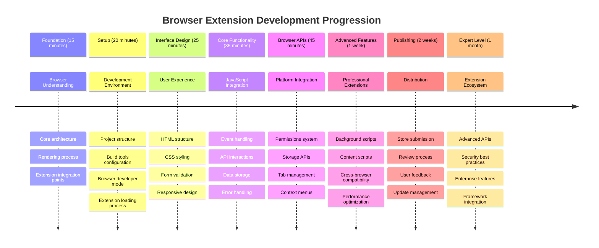
  
### 🛠️ Laajennuskehitystyökalujen yhteenveto  

Tämän oppitunnin jälkeen sinulla on:  
- **Selaimen arkkitehtuurin tuntemus**: Ymmärrys renderöintimoottoreista, turvallisuusmalleista ja laajennusten integroinnista  
- **Kehitysympäristö**: Moderni työkaluketju Webpackilla, NPM:llä ja vianetsintäominaisuuksilla  
- **UI/UX-perusta**: Semanttinen HTML-rakenne progressiivisilla paljastusmalleilla  
- **Turvallisuustietoisuus**: Ymmärrys selaimen käyttöoikeuksista ja turvallisista kehityskäytännöistä  
- **Selainten yhteensopivuus**: Tieto yhteensopivuuden huomioimisesta ja testausmenetelmistä  
- **API-integraatio**: Perusta ulkoisten tietolähteiden kanssa työskentelyyn  
- **Ammattimainen työnkulku**: Alan standardien mukaiset kehitys- ja testausmenetelmät  

**Todelliset sovellukset**: Nämä taidot soveltuvat suoraan:  
- **Verkkokehitys**: Yksisivuiset sovellukset ja progressiiviset verkkosovellukset  
- **Työpöytäsovellukset**: Electron ja verkkopohjaiset työpöytäsovellukset  
- **Mobiilikehitys**: Hybridisovellukset ja verkkopohjaiset mobiiliratkaisut  
- **Yritystyökalut**: Sisäiset tuottavuussovellukset ja työnkulun automatisointi  
- **Avoin lähdekoodi**: Osallistuminen selaimen laajennusprojekteihin ja verkkostandardeihin  

**Seuraava taso**: Olet valmis lisäämään interaktiivista toiminnallisuutta, työskentelemään selaimen API:iden kanssa ja luomaan laajennuksia, jotka ratkaisevat todellisia käyttäjäongelmia!  

## Tehtävä  

[Muokkaa laajennuksesi ulkoasua](assignment.md)  

---

**Vastuuvapauslauseke**:  
Tämä asiakirja on käännetty käyttämällä tekoälypohjaista käännöspalvelua [Co-op Translator](https://github.com/Azure/co-op-translator). Vaikka pyrimme tarkkuuteen, huomioithan, että automaattiset käännökset voivat sisältää virheitä tai epätarkkuuksia. Alkuperäinen asiakirja sen alkuperäisellä kielellä tulisi pitää ensisijaisena lähteenä. Kriittisen tiedon osalta suositellaan ammattimaista ihmiskäännöstä. Emme ole vastuussa väärinkäsityksistä tai virhetulkinnoista, jotka johtuvat tämän käännöksen käytöstä.