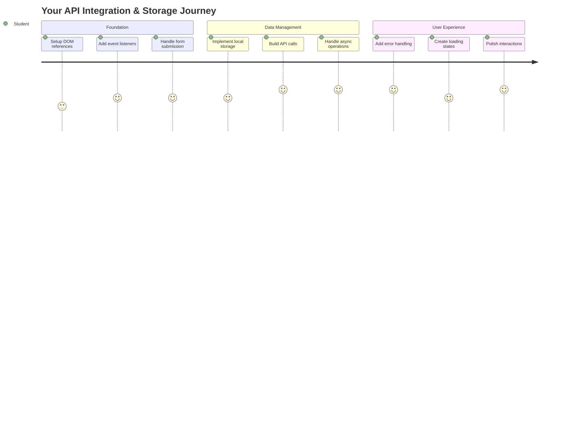
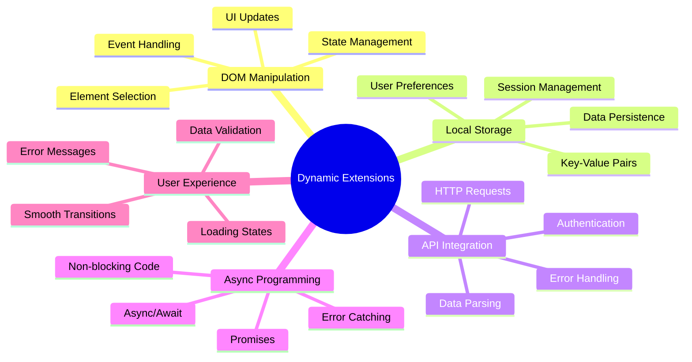
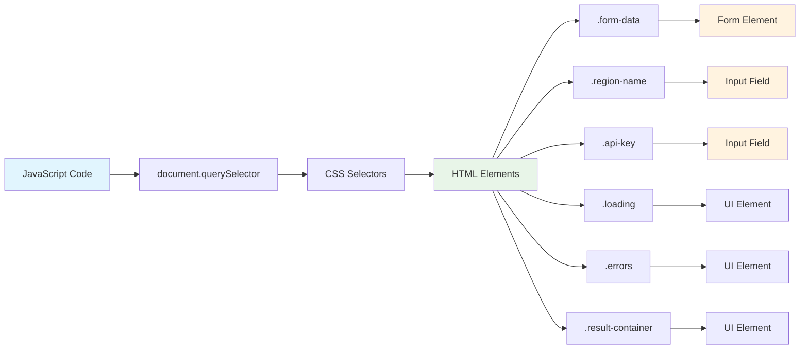
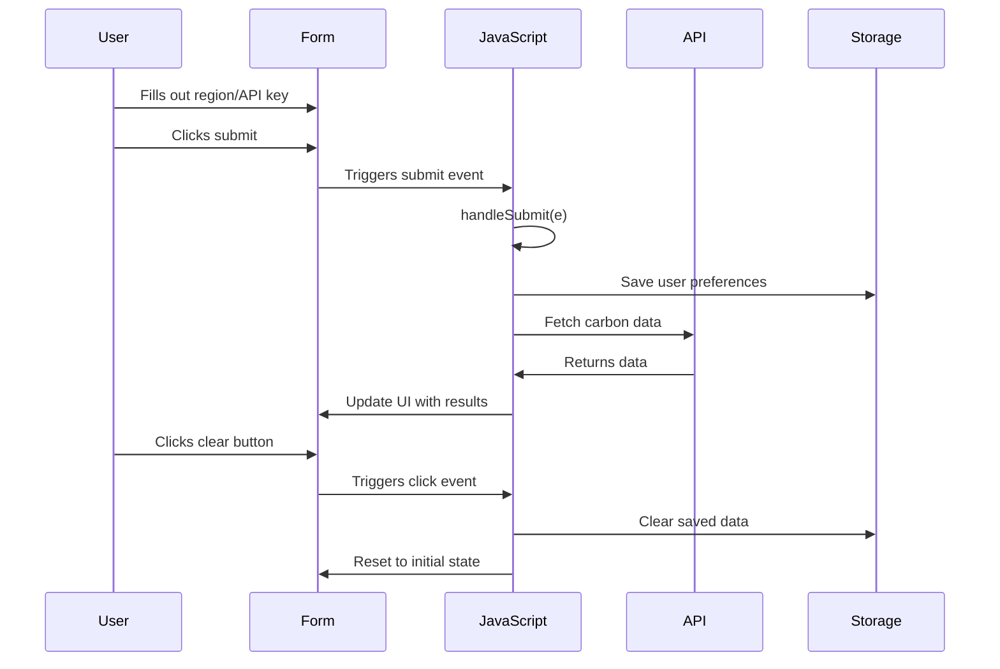
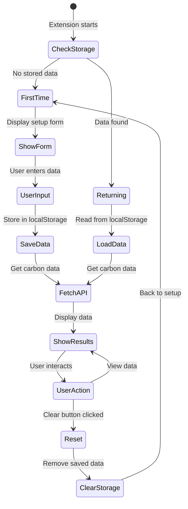
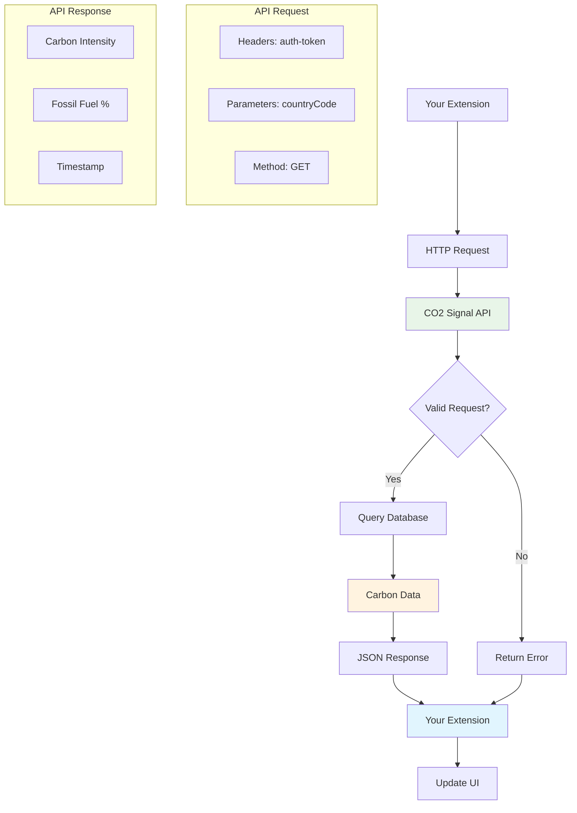
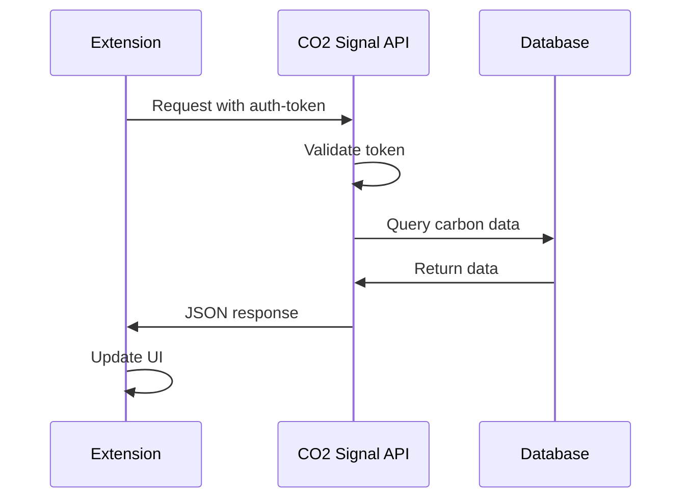
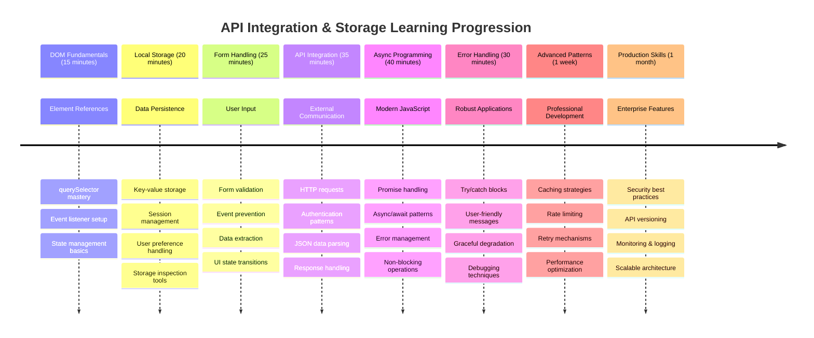

<!--
CO_OP_TRANSLATOR_METADATA:
{
  "original_hash": "2b6203a48c48d8234e0948353b47d84e",
  "translation_date": "2025-11-04T01:45:13+00:00",
  "source_file": "5-browser-extension/2-forms-browsers-local-storage/README.md",
  "language_code": "fi"
}
-->
# Selaimen laajennusprojekti Osa 2: API-kutsut ja paikallinen tallennus



## Ennakkokysely

[Ennakkokysely](https://ff-quizzes.netlify.app/web/quiz/25)

## Johdanto

Muistatko sen selaimen laajennuksen, jonka aloitit rakentamaan? Tällä hetkellä sinulla on hienon näköinen lomake, mutta se on käytännössä staattinen. Tänään herätämme sen eloon yhdistämällä sen oikeaan dataan ja antamalla sille muistin.

Ajattele Apollo-mission ohjauskeskuksen tietokoneita - ne eivät vain näyttäneet kiinteää tietoa. Ne kommunikoivat jatkuvasti avaruusaluksen kanssa, päivittivät telemetriatietoja ja muistivat kriittiset tehtäväparametrit. Juuri tällaista dynaamista toimintaa rakennamme tänään. Laajennuksesi hakee internetistä oikeaa ympäristötietoa ja muistaa asetuksesi seuraavaa kertaa varten.

API-integraatio saattaa kuulostaa monimutkaiselta, mutta se on oikeastaan vain koodin opettamista kommunikoimaan muiden palveluiden kanssa. Olipa kyseessä säätiedot, sosiaalisen median syötteet tai hiilijalanjälkitiedot, kuten tänään, kyse on digitaalisten yhteyksien luomisesta. Tutustumme myös siihen, miten selaimet voivat säilyttää tietoa - kuten kirjastot ovat käyttäneet korttiluetteloita muistaakseen, missä kirjat sijaitsevat.

Tämän oppitunnin lopussa sinulla on selaimen laajennus, joka hakee oikeaa dataa, tallentaa käyttäjän asetukset ja tarjoaa sujuvan käyttökokemuksen. Aloitetaan!



✅ Seuraa numeroituja osioita oikeissa tiedostoissa tietääksesi, mihin koodi sijoitetaan

## Aseta laajennuksen muokattavat elementit

Ennen kuin JavaScript voi muokata käyttöliittymää, sen täytyy saada viittaukset tiettyihin HTML-elementteihin. Ajattele sitä kuin teleskoopin suuntaamista tiettyihin tähtiin - ennen kuin Galileo pystyi tutkimaan Jupiterin kuita, hänen täytyi löytää ja keskittyä Jupiteriin.

`index.js`-tiedostossasi luomme `const`-muuttujia, jotka tallentavat viittaukset jokaiseen tärkeään lomake-elementtiin. Tämä on kuin tiedemiehet nimeäisivät laitteensa - sen sijaan, että etsisivät koko laboratorion läpi joka kerta, he voivat suoraan käyttää sitä, mitä tarvitsevat.



```javascript
// form fields
const form = document.querySelector('.form-data');
const region = document.querySelector('.region-name');
const apiKey = document.querySelector('.api-key');

// results
const errors = document.querySelector('.errors');
const loading = document.querySelector('.loading');
const results = document.querySelector('.result-container');
const usage = document.querySelector('.carbon-usage');
const fossilfuel = document.querySelector('.fossil-fuel');
const myregion = document.querySelector('.my-region');
const clearBtn = document.querySelector('.clear-btn');
```

**Tämä koodi tekee seuraavaa:**
- **Taltioi** lomake-elementit käyttämällä `document.querySelector()`-metodia CSS-luokkavalitsimilla
- **Luo** viittaukset syöttökenttiin alueen nimeä ja API-avainta varten
- **Yhdistää** tulosnäyttöelementit hiilidioksidinkäyttötietojen näyttämiseksi
- **Asettaa** käyttöliittymäelementtien, kuten latausilmaisimien ja virheilmoitusten, käytön
- **Tallentaa** jokaisen elementtiviittauksen `const`-muuttujaan helppoa uudelleenkäyttöä varten

## Lisää tapahtumakuuntelijat

Nyt saamme laajennuksesi reagoimaan käyttäjän toimintoihin. Tapahtumakuuntelijat ovat koodisi tapa seurata käyttäjän vuorovaikutuksia. Ajattele niitä kuin varhaisten puhelinkeskusten operaattoreita - he kuuntelivat saapuvia puheluita ja yhdistivät oikeat piirit, kun joku halusi soittaa.



```javascript
form.addEventListener('submit', (e) => handleSubmit(e));
clearBtn.addEventListener('click', (e) => reset(e));
init();
```

**Näiden käsitteiden ymmärtäminen:**
- **Liittää** lomakkeeseen lähetyskuuntelijan, joka aktivoituu, kun käyttäjä painaa Enteriä tai klikkaa lähetä-painiketta
- **Yhdistää** klikkauskuuntelijan tyhjennä-painikkeeseen lomakkeen nollaamiseksi
- **Välittää** tapahtumaobjektin `(e)` käsittelijäfunktioille lisäohjauksen mahdollistamiseksi
- **Kutsuu** `init()`-funktion välittömästi laajennuksen alkuasetusten määrittämiseksi

✅ Huomaa tässä käytetty lyhyt nuolifunktiosyntaksi. Tämä moderni JavaScript-lähestymistapa on siistimpi kuin perinteiset funktioilmaisut, mutta molemmat toimivat yhtä hyvin!

### 🔄 **Pedagoginen tarkistus**
**Tapahtumien käsittelyn ymmärtäminen**: Ennen kuin siirryt alkuasetuksiin, varmista, että osaat:
- ✅ Selittää, miten `addEventListener` yhdistää käyttäjän toiminnot JavaScript-funktioihin
- ✅ Ymmärtää, miksi välitämme tapahtumaobjektin `(e)` käsittelijäfunktioille
- ✅ Tunnistaa eron `submit`- ja `click`-tapahtumien välillä
- ✅ Kuvata, milloin `init()`-funktio suoritetaan ja miksi

**Pikatesti**: Mitä tapahtuisi, jos unohtaisit `e.preventDefault()` lomakkeen lähetyksessä?
*Vastaus: Sivusto latautuisi uudelleen, jolloin kaikki JavaScript-tila menetettäisiin ja käyttäjäkokemus keskeytyisi*

## Luo alkuasetukset ja nollausfunktiot

Luodaan laajennuksesi alkuasetusten logiikka. `init()`-funktio on kuin laivan navigointijärjestelmä, joka tarkistaa instrumenttinsa - se määrittää nykyisen tilan ja säätää käyttöliittymän sen mukaisesti. Se tarkistaa, onko joku käyttänyt laajennustasi aiemmin ja lataa heidän aiemmat asetuksensa.

`reset()`-funktio tarjoaa käyttäjille uuden alun - kuten tiedemiehet nollaavat instrumenttinsa kokeiden välillä varmistaakseen puhtaat tiedot.

```javascript
function init() {
	// Check if user has previously saved API credentials
	const storedApiKey = localStorage.getItem('apiKey');
	const storedRegion = localStorage.getItem('regionName');

	// Set extension icon to generic green (placeholder for future lesson)
	// TODO: Implement icon update in next lesson

	if (storedApiKey === null || storedRegion === null) {
		// First-time user: show the setup form
		form.style.display = 'block';
		results.style.display = 'none';
		loading.style.display = 'none';
		clearBtn.style.display = 'none';
		errors.textContent = '';
	} else {
		// Returning user: load their saved data automatically
		displayCarbonUsage(storedApiKey, storedRegion);
		results.style.display = 'none';
		form.style.display = 'none';
		clearBtn.style.display = 'block';
	}
}

function reset(e) {
	e.preventDefault();
	// Clear stored region to allow user to choose a new location
	localStorage.removeItem('regionName');
	// Restart the initialization process
	init();
}
```

**Tässä tapahtuu seuraavaa:**
- **Hakee** tallennetun API-avaimen ja alueen selaimen paikallisesta tallennuksesta
- **Tarkistaa**, onko kyseessä ensimmäistä kertaa käyttävä käyttäjä (ei tallennettuja tietoja) vai palaava käyttäjä
- **Näyttää** asetuslomakkeen uusille käyttäjille ja piilottaa muut käyttöliittymäelementit
- **Lataa** tallennetut tiedot automaattisesti palaaville käyttäjille ja näyttää nollausvaihtoehdon
- **Hallinnoi** käyttöliittymän tilaa saatavilla olevan datan perusteella

**Keskeisiä käsitteitä paikallisesta tallennuksesta:**
- **Säilyttää** dataa selaimen istuntojen välillä (toisin kuin session storage)
- **Tallentaa** dataa avain-arvo-pareina käyttäen `getItem()` ja `setItem()`
- **Palauttaa** `null`, kun tiettyä avainta vastaavaa dataa ei ole olemassa
- **Tarjoaa** yksinkertaisen tavan muistaa käyttäjän asetukset ja tiedot

> 💡 **Selaimen tallennuksen ymmärtäminen**: [LocalStorage](https://developer.mozilla.org/docs/Web/API/Window/localStorage) antaa laajennuksellesi pysyvän muistin. Ajattele, kuinka muinainen Aleksandrian kirjasto säilytti kääröjä - tieto pysyi saatavilla, vaikka tutkijat lähtivät ja palasivat.
>
> **Keskeiset ominaisuudet:**
> - **Säilyttää** dataa, vaikka sulkisit selaimen
> - **Selviää** tietokoneen uudelleenkäynnistyksistä ja selaimen kaatumisista
> - **Tarjoaa** merkittävän tallennustilan käyttäjän asetuksille
> - **Mahdollistaa** välittömän pääsyn ilman verkkoviiveitä

Voit tarkastella tallennettua dataa avaamalla selaimen kehittäjätyökalut (F12), siirtymällä **Application**-välilehdelle ja laajentamalla **Local Storage**-osio.




> ⚠️ **Tietoturvahuomio**: Tuotantosovelluksissa API-avainten tallentaminen LocalStorageen aiheuttaa tietoturvariskejä, koska JavaScript voi käyttää näitä tietoja. Oppimiskäyttöön tämä lähestymistapa toimii hyvin, mutta oikeissa sovelluksissa tulisi käyttää turvallista palvelinpuolen tallennusta arkaluontoisille tunnuksille.

## Lomakkeen lähetyksen käsittely

Nyt käsittelemme, mitä tapahtuu, kun joku lähettää lomakkeesi. Oletuksena selaimet lataavat sivun uudelleen, kun lomakkeet lähetetään, mutta estämme tämän toiminnan luodaksemme sujuvamman kokemuksen.

Tämä lähestymistapa muistuttaa, miten ohjauskeskus käsittelee avaruusaluksen viestintää - sen sijaan, että järjestelmä nollattaisiin jokaisen lähetyksen yhteydessä, se ylläpitää jatkuvaa toimintaa samalla kun käsittelee uutta tietoa.

Luo funktio, joka taltioi lomakkeen lähetyksen tapahtuman ja poimii käyttäjän syötteen:

```javascript
function handleSubmit(e) {
	e.preventDefault();
	setUpUser(apiKey.value, region.value);
}
```

**Yllä olevassa olemme:**
- **Estäneet** lomakkeen oletuslähetyskäyttäytymisen, joka päivittäisi sivun
- **Poimineet** käyttäjän syöttöarvot API-avaimen ja aluekenttien kautta
- **Välittäneet** lomakedatan `setUpUser()`-funktiolle käsittelyä varten
- **Säilyttäneet** yhden sivun sovelluskäyttäytymisen välttämällä sivun uudelleenlatauksia

✅ Muista, että HTML-lomakekentissäsi on `required`-attribuutti, joten selain validoi automaattisesti, että käyttäjä antaa sekä API-avaimen että alueen ennen tämän funktion suorittamista.

## Käyttäjäasetusten määrittäminen

`setUpUser`-funktio vastaa käyttäjän tunnusten tallentamisesta ja ensimmäisen API-kutsun aloittamisesta. Tämä luo sujuvan siirtymän asetuksista tulosten näyttämiseen.

```javascript
function setUpUser(apiKey, regionName) {
	// Save user credentials for future sessions
	localStorage.setItem('apiKey', apiKey);
	localStorage.setItem('regionName', regionName);
	
	// Update UI to show loading state
	loading.style.display = 'block';
	errors.textContent = '';
	clearBtn.style.display = 'block';
	
	// Fetch carbon usage data with user's credentials
	displayCarbonUsage(apiKey, regionName);
}
```

**Askel askeleelta, tässä tapahtuu:**
- **Tallentaa** API-avaimen ja alueen nimen paikalliseen tallennukseen tulevaa käyttöä varten
- **Näyttää** latausilmaisimen, joka kertoo käyttäjille, että dataa haetaan
- **Tyhjentää** aiemmat virheilmoitukset näytöstä
- **Paljastaa** tyhjennä-painikkeen, jotta käyttäjät voivat nollata asetuksensa myöhemmin
- **Aloittaa** API-kutsun oikean hiilidioksidinkäyttötiedon hakemiseksi

Tämä funktio luo saumattoman käyttökokemuksen hallitsemalla sekä datan pysyvyyttä että käyttöliittymän päivityksiä yhdessä koordinoidussa toiminnossa.

## Näytä hiilidioksidinkäyttötiedot

Nyt yhdistämme laajennuksesi ulkoisiin tietolähteisiin API:iden kautta. Tämä muuttaa laajennuksesi itsenäisestä työkalusta sellaiseksi, joka voi käyttää reaaliaikaista tietoa internetistä.

**API:iden ymmärtäminen**

[API:t](https://www.webopedia.com/TERM/A/API.html) ovat tapa, jolla eri sovellukset kommunikoivat keskenään. Ajattele niitä kuin 1800-luvun kaupunkeja yhdistänyttä lennätinjärjestelmää - operaattorit lähettivät pyyntöjä kaukaisiin asemiin ja saivat vastauksia pyydetyllä tiedolla. Joka kerta kun tarkistat sosiaalista mediaa, kysyt kysymyksen ääniavustajalta tai käytät toimitussovellusta, API:t mahdollistavat nämä tiedonvaihdot.



**Keskeisiä käsitteitä REST API:ista:**
- **REST** tarkoittaa 'Representational State Transfer'
- **Käyttää** standardeja HTTP-metodeja (GET, POST, PUT, DELETE) datan käsittelyyn
- **Palauttaa** dataa ennustettavissa olevissa muodoissa, yleensä JSON
- **Tarjoaa** johdonmukaisia, URL-pohjaisia päätepisteitä eri tyyppisille pyynnöille

✅ [CO2 Signal API](https://www.co2signal.com/), jota käytämme, tarjoaa reaaliaikaista hiilidioksidipäästöjen intensiteettitietoa sähköverkoista ympäri maailmaa. Tämä auttaa käyttäjiä ymmärtämään sähkönkulutuksensa ympäristövaikutuksia!

> 💡 **Asynkronisen JavaScriptin ymmärtäminen**: [`async`-avainsana](https://developer.mozilla.org/docs/Web/JavaScript/Reference/Statements/async_function) mahdollistaa koodisi käsittelemään useita operaatioita samanaikaisesti. Kun pyydät dataa palvelimelta, et halua koko laajennuksen jäätyvän - se olisi kuin lennonjohtokeskus pysäyttäisi kaikki toiminnot odottaessaan yhden lentokoneen vastausta.
>
> **Keskeiset hyödyt:**
> - **Ylläpitää** laajennuksen reagointikykyä datan lataamisen aikana
> - **Mahdollistaa** muun koodin suorittamisen verkkopyyntöjen aikana
> - **Parantaa** koodin luettavuutta verrattuna perinteisiin callback-malleihin
> - **Mahdollistaa** sujuvan virheenkäsittelyn verkkohäiriöiden varalta

Tässä lyhyt video `async`-toiminnasta:

[](https://youtube.com/watch?v=YwmlRkrxvkk "Async ja Await lupauksien hallintaan")

> 🎥 Klikkaa yllä olevaa kuvaa nähdäksesi videon async/awaitista.

### 🔄 **Pedagoginen tarkistus**
**Asynkronisen ohjelmoinnin ymmärtäminen**: Ennen API-funktioon siirtymistä varmista, että ymmärrät:
- ✅ Miksi käytämme `async/await` sen sijaan, että jäädään odottamaan koko laajennuksen jäätyessä
- ✅ Miten `try/catch`-lohkot käsittelevät verkkovirheitä sujuvasti
- ✅ Ero synkronisten ja asynkronisten operaatioiden välillä
- ✅ Miksi API-kutsut voivat epäonnistua ja miten näitä epäonnistumisia käsitellään

**Reaaliaikainen yhteys**: Mieti näitä arjen asynkronisia esimerkkejä:
- **Ruokatilaus**: Et odota keittiössä - saat kuitin ja jatkat muita toimintoja
- **Sähköpostin lähettäminen**: Sähköpostisovelluksesi ei jäädy lähetyksen aikana - voit kirjoittaa lisää sähköposteja
- **Verkkosivujen lataaminen**: Kuvat latautuvat vähitellen, kun voit jo lukea tekstiä

**API-todennusprosessi**:


Luo funktio hiilidioksidinkäyttötiedon hakemiseen ja näyttämiseen:

```javascript
// Modern fetch API approach (no external dependencies needed)
async function displayCarbonUsage(apiKey, region) {
	try {
		// Fetch carbon intensity data from CO2 Signal API
		const response = await fetch('https://api.co2signal.com/v1/latest', {
			method: 'GET',
			headers: {
				'auth-token': apiKey,
				'Content-Type': 'application/json'
			},
			// Add query parameters for the specific region
			...new URLSearchParams({ countryCode: region }) && {
				url: `https://api.co2signal.com/v1/latest?countryCode=${region}`
			}
		});

		// Check if the API request was successful
		if (!response.ok) {
			throw new Error(`API request failed: ${response.status}`);
		}

		const data = await response.json();
		const carbonData = data.data;

		// Calculate rounded carbon intensity value
		const carbonIntensity = Math.round(carbonData.carbonIntensity);

		// Update the user interface with fetched data
		loading.style.display = 'none';
		form.style.display = 'none';
		myregion.textContent = region.toUpperCase();
		usage.textContent = `${carbonIntensity} grams (grams CO₂ emitted per kilowatt hour)`;
		fossilfuel.textContent = `${carbonData.fossilFuelPercentage.toFixed(2)}% (percentage of fossil fuels used to generate electricity)`;
		results.style.display = 'block';

		// TODO: calculateColor(carbonIntensity) - implement in next lesson

	} catch (error) {
		console.error('Error fetching carbon data:', error);
		
		// Show user-friendly error message
		loading.style.display = 'none';
		results.style.display = 'none';
		errors.textContent = 'Sorry, we couldn\'t fetch data for that region. Please check your API key and region code.';
	}
}
```

**Tässä tapahtuu seuraavaa:**
- **Käyttää** modernia `fetch()`-API:ta ulkoisten kirjastojen, kuten Axiosin, sijaan puhtaamman ja riippumattoman koodin vuoksi
- **Toteuttaa** asianmukaisen virhetarkistuksen `response.ok`-menetelmällä API-virheiden varhaiseksi havaitsemiseksi
- **Käsittelee** asynkronisia operaatioita `async/await`-menetelmällä luettavamman koodin virtausta varten
- **Todentaa** CO2 Signal API:n `auth-token`-otsikon avulla
- **Jäsentää** JSON-vastausdatan ja poimii hiilidioksidipäästöjen intensiteettitiedot
- **Päivittää** useita käyttöliittymäelementtejä muotoillulla ympäristötiedolla
- **Tarjoaa** käyttäjäystävällisiä virheilmoituksia, kun API-kutsut epäonnistuvat

**Keskeiset modernin JavaScriptin käsitteet:**
- **Mallimerkkijonot** `${}`-syntaksilla siistiä merkkijonojen muotoilua varten
- **Virheenkäsittely** try/catch-lohkoilla vankkojen sovellusten luomiseksi
- **Async/await**-malli verkkopyyntöjen sujuvaan käsittelyyn
- **Objektin purkaminen** tiettyjen tietojen poimimiseksi API-vastauksista
- **Metodiketjutus** useiden DOM-muokkausten suorittamiseksi

✅ Tämä funktio havainnollistaa useita tärkeitä web-kehityksen käsitteitä - kommunikointia ulkoisten palvelimien kanssa, todennusta, datan käsittelyä, käyttöliittymän päivittämistä ja virheiden hallintaa sujuvasti. Nämä ovat perustaitoja, joita ammattilaiskehittäjät käyttävät säännöll
**Kuvaus:** Paranna selaimen laajennusta lisäämällä virheenkäsittelyä ja käyttäjäkokemusta parantavia ominaisuuksia. Tämä haaste auttaa sinua harjoittelemaan API:iden, paikallisen tallennuksen ja DOM-manipulaation käyttöä nykyaikaisilla JavaScript-malleilla.

**Tehtävä:** Luo paranneltu versio displayCarbonUsage-funktiosta, joka sisältää: 1) Uudelleenyritysmekanismin epäonnistuneille API-kutsuille eksponentiaalisella viiveellä, 2) Syötteen validoinnin aluekoodille ennen API-kutsua, 3) Latausanimaation ja etenemisen indikaattorit, 4) API-vastausten välimuistituksen localStorageen vanhenemisleimoilla (välimuisti 30 minuutiksi) ja 5) Ominaisuuden, joka näyttää aiempien API-kutsujen historiallisen datan. Lisää myös asianmukaiset TypeScript-tyyliset JSDoc-kommentit dokumentoimaan kaikki funktion parametrit ja palautustyypit.

Lue lisää [agent mode](https://code.visualstudio.com/blogs/2025/02/24/introducing-copilot-agent-mode) -tilasta täältä.

## 🚀 Haaste

Laajenna ymmärrystäsi API:ista tutkimalla verkkokehitykseen saatavilla olevia selaimen API:ita. Valitse yksi näistä selaimen API:ista ja rakenna pieni demonstraatio:

- [Geolocation API](https://developer.mozilla.org/docs/Web/API/Geolocation_API) - Hanki käyttäjän nykyinen sijainti
- [Notification API](https://developer.mozilla.org/docs/Web/API/Notifications_API) - Lähetä työpöytäilmoituksia
- [HTML Drag and Drop API](https://developer.mozilla.org/docs/Web/API/HTML_Drag_and_Drop_API) - Luo interaktiivisia raahauskäyttöliittymiä
- [Web Storage API](https://developer.mozilla.org/docs/Web/API/Web_Storage_API) - Kehittyneet paikallisen tallennuksen tekniikat
- [Fetch API](https://developer.mozilla.org/docs/Web/API/Fetch_API) - Moderni vaihtoehto XMLHttpRequestille

**Tutkimuskysymyksiä pohdittavaksi:**
- Mitä todellisia ongelmia tämä API ratkaisee?
- Miten API käsittelee virheitä ja reunatapauksia?
- Mitä turvallisuuskysymyksiä liittyy tämän API:n käyttöön?
- Kuinka laajasti tämä API on tuettu eri selaimissa?

Tutkimuksen jälkeen tunnista, mitkä ominaisuudet tekevät API:sta kehittäjäystävällisen ja luotettavan.

## Luentojälkeinen kysely

[Luentojälkeinen kysely](https://ff-quizzes.netlify.app/web/quiz/26)

## Kertaus ja itseopiskelu

Tässä oppitunnissa opit LocalStoragen ja API:iden käytöstä, jotka ovat erittäin hyödyllisiä ammattilaiselle verkkokehittäjälle. Voitko miettiä, miten nämä kaksi asiaa toimivat yhdessä? Mieti, miten suunnittelisit verkkosivuston, joka tallentaa kohteita API:n käytettäväksi.

### ⚡ **Mitä voit tehdä seuraavan viiden minuutin aikana**
- [ ] Avaa DevTools-sovelluksen välilehti ja tutki localStoragea millä tahansa verkkosivustolla
- [ ] Luo yksinkertainen HTML-lomake ja testaa lomakkeen validointia selaimessa
- [ ] Kokeile tietojen tallentamista ja hakemista localStoragesta selaimen konsolissa
- [ ] Tarkastele lomaketietojen lähettämistä verkon välilehdellä

### 🎯 **Mitä voit saavuttaa tunnin aikana**
- [ ] Suorita luentojälkeinen kysely ja ymmärrä lomakkeiden käsittelykonseptit
- [ ] Rakenna selaimen laajennuslomake, joka tallentaa käyttäjän asetukset
- [ ] Toteuta asiakaspuolen lomakevalidointi hyödyllisillä virheilmoituksilla
- [ ] Harjoittele chrome.storage API:n käyttöä laajennuksen tietojen pysyvyyden hallintaan
- [ ] Luo käyttöliittymä, joka reagoi tallennettuihin käyttäjäasetuksiin

### 📅 **Viikon mittainen laajennuksen rakentaminen**
- [ ] Viimeistele täysin toimiva selaimen laajennus, jossa on lomaketoiminnallisuus
- [ ] Hallitse eri tallennusvaihtoehdot: paikallinen, synkronoitu ja istuntotallennus
- [ ] Toteuta kehittyneitä lomaketoimintoja, kuten automaattinen täydennys ja validointi
- [ ] Lisää tuonti/vienti-toiminnallisuus käyttäjätiedoille
- [ ] Testaa laajennustasi perusteellisesti eri selaimilla
- [ ] Viimeistele laajennuksesi käyttäjäkokemus ja virheenkäsittely

### 🌟 **Kuukauden mittainen Web API -osaaminen**
- [ ] Rakenna monimutkaisia sovelluksia käyttäen erilaisia selaimen tallennus-API:ita
- [ ] Opi offline-ensimmäinen kehitysmalli
- [ ] Osallistu avoimen lähdekoodin projekteihin, jotka liittyvät tietojen pysyvyyteen
- [ ] Hallitse yksityisyyteen keskittyvä kehitys ja GDPR-vaatimusten noudattaminen
- [ ] Luo uudelleenkäytettäviä kirjastoja lomakkeiden käsittelyyn ja tietojen hallintaan
- [ ] Jaa tietoa Web API:ista ja laajennusten kehittämisestä

## 🎯 Laajennuskehityksen osaamisen aikajana



### 🛠️ Full-Stack-kehitystyökalujen yhteenveto

Tämän oppitunnin jälkeen sinulla on:
- **DOM-osaaminen**: Tarkka elementtien kohdistaminen ja manipulointi
- **Tallennusasiantuntemus**: Pysyvä tietojen hallinta localStoragella
- **API-integraatio**: Reaaliaikainen tietojen haku ja autentikointi
- **Asynkroninen ohjelmointi**: Ei-estävät toiminnot modernilla JavaScriptillä
- **Virheenkäsittely**: Vahvat sovellukset, jotka käsittelevät virheitä sulavasti
- **Käyttäjäkokemus**: Lataustilat, validointi ja sujuvat vuorovaikutukset
- **Modernit mallit**: fetch API, async/await ja ES6+ ominaisuudet

**Ammatilliset taidot:** Olet toteuttanut malleja, joita käytetään:
- **Verkkosovelluksissa**: Yksisivuiset sovellukset ulkoisilla tietolähteillä
- **Mobiilikehityksessä**: API-pohjaiset sovellukset offline-ominaisuuksilla
- **Työpöytäohjelmistoissa**: Electron-sovellukset pysyvällä tallennuksella
- **Yritysjärjestelmissä**: Autentikointi, välimuisti ja virheenkäsittely
- **Modernit kehykset**: React/Vue/Angular tietojen hallintamallit

**Seuraava taso:** Olet valmis tutkimaan edistyneitä aiheita, kuten välimuististrategioita, reaaliaikaisia WebSocket-yhteyksiä tai monimutkaista tilanhallintaa!

## Tehtävä

[Adoptoi API](assignment.md)

---

**Vastuuvapauslauseke**:  
Tämä asiakirja on käännetty käyttämällä tekoälypohjaista käännöspalvelua [Co-op Translator](https://github.com/Azure/co-op-translator). Vaikka pyrimme tarkkuuteen, huomioithan, että automaattiset käännökset voivat sisältää virheitä tai epätarkkuuksia. Alkuperäinen asiakirja sen alkuperäisellä kielellä tulisi pitää ensisijaisena lähteenä. Kriittisen tiedon osalta suositellaan ammattimaista ihmiskäännöstä. Emme ole vastuussa väärinkäsityksistä tai virhetulkinnoista, jotka johtuvat tämän käännöksen käytöstä.