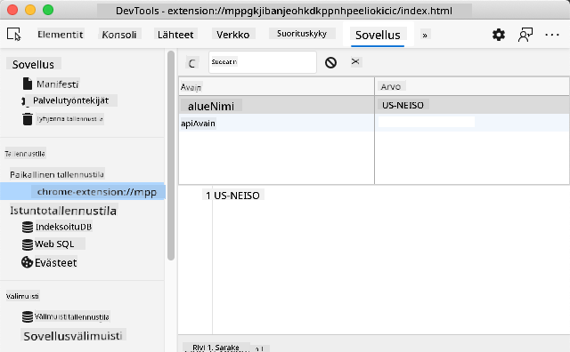

<!--
CO_OP_TRANSLATOR_METADATA:
{
  "original_hash": "8c8cd4af6086cc1d47e1d43aa4983d20",
  "translation_date": "2025-10-23T00:44:02+00:00",
  "source_file": "5-browser-extension/2-forms-browsers-local-storage/README.md",
  "language_code": "fi"
}
-->
# Selaimen laajennusprojekti Osa 2: API-kutsut ja paikallinen tallennus

## Ennen luentoa - Kysely

[Ennen luentoa - kysely](https://ff-quizzes.netlify.app/web/quiz/25)

## Johdanto

Muistatko selaimen laajennuksen, jonka aloitit rakentamaan? Tällä hetkellä sinulla on hienon näköinen lomake, mutta se on käytännössä staattinen. Tänään herätämme sen eloon yhdistämällä sen oikeaan dataan ja antamalla sille muistin.

Ajattele Apollo-mission ohjaustietokoneita - ne eivät vain näyttäneet kiinteää tietoa. Ne kommunikoivat jatkuvasti avaruusalusten kanssa, päivittivät telemetriatietoja ja muistivat kriittiset tehtäväparametrit. Juuri tällaista dynaamista toimintaa rakennamme tänään. Laajennuksesi hakee internetistä oikeaa ympäristötietoa ja muistaa asetuksesi seuraavaa kertaa varten.

API-integraatio saattaa kuulostaa monimutkaiselta, mutta se on pohjimmiltaan vain koodin opettamista kommunikoimaan muiden palveluiden kanssa. Olipa kyseessä säätiedot, sosiaalisen median syötteet tai hiilijalanjälkitiedot, kuten tänään, kyse on digitaalisten yhteyksien luomisesta. Tutustumme myös siihen, miten selaimet voivat säilyttää tietoa - kuten kirjastot ovat käyttäneet kortistokatalogeja kirjojen sijainnin muistamiseen.

Tämän oppitunnin lopussa sinulla on selaimen laajennus, joka hakee oikeaa dataa, tallentaa käyttäjän asetukset ja tarjoaa sujuvan käyttökokemuksen. Aloitetaan!

✅ Seuraa numeroituja osioita asianmukaisissa tiedostoissa tietääksesi, mihin koodi sijoitetaan.

## Aseta elementit laajennuksen käsittelyä varten

Ennen kuin JavaScript voi käsitellä käyttöliittymää, sen täytyy viitata tiettyihin HTML-elementteihin. Ajattele sitä kuin teleskoopin täytyy kohdistaa tiettyihin tähtiin - ennen kuin Galileo pystyi tutkimaan Jupiterin kuita, hänen täytyi ensin löytää ja kohdistaa Jupiteriin.

`index.js`-tiedostossasi luomme `const`-muuttujia, jotka tallentavat viittaukset jokaiseen tärkeään lomake-elementtiin. Tämä on kuin tiedemiehet merkitsisivät laitteensa - sen sijaan, että he etsisivät koko laboratoriota joka kerta, he voivat suoraan käyttää sitä, mitä tarvitsevat.

```javascript
// form fields
const form = document.querySelector('.form-data');
const region = document.querySelector('.region-name');
const apiKey = document.querySelector('.api-key');

// results
const errors = document.querySelector('.errors');
const loading = document.querySelector('.loading');
const results = document.querySelector('.result-container');
const usage = document.querySelector('.carbon-usage');
const fossilfuel = document.querySelector('.fossil-fuel');
const myregion = document.querySelector('.my-region');
const clearBtn = document.querySelector('.clear-btn');
```

**Mitä tämä koodi tekee:**
- **Taltioi** lomake-elementit käyttämällä `document.querySelector()`-metodia CSS-luokkavalitsimilla
- **Luo** viittaukset syöttökenttiin alueen nimeä ja API-avainta varten
- **Muodostaa** yhteydet tulosten näyttöelementteihin hiilenkäyttötietoja varten
- **Asettaa** pääsyn käyttöliittymäelementteihin, kuten latausindikaattoreihin ja virheilmoituksiin
- **Tallentaa** jokaisen elementtiviittauksen `const`-muuttujaan helppoa uudelleenkäyttöä varten koodissa

## Lisää tapahtumakuuntelijat

Nyt saamme laajennuksesi reagoimaan käyttäjän toimintoihin. Tapahtumakuuntelijat ovat koodisi tapa seurata käyttäjän vuorovaikutuksia. Ajattele niitä kuin varhaisten puhelinkeskusten operaattoreita - he kuuntelivat saapuvia puheluita ja yhdistivät oikeat piirit, kun joku halusi soittaa.

```javascript
form.addEventListener('submit', (e) => handleSubmit(e));
clearBtn.addEventListener('click', (e) => reset(e));
init();
```

**Näiden käsitteiden ymmärtäminen:**
- **Liittää** lomakkeeseen tapahtumakuuntelijan, joka aktivoituu, kun käyttäjä painaa Enteriä tai klikkaa lähetä-painiketta
- **Yhdistää** klikkauskuuntelijan tyhjennä-painikkeeseen lomakkeen nollaamiseksi
- **Välittää** tapahtumaobjektin `(e)` käsittelyfunktioille lisäohjaukseen
- **Kutsuu** `init()`-funktion välittömästi laajennuksen alkuasetusten määrittämiseksi

✅ Huomaa tässä käytetty lyhyt nuolifunktion syntaksi. Tämä moderni JavaScript-lähestymistapa on siistimpi kuin perinteiset funktioilmaisut, mutta molemmat toimivat yhtä hyvin!

## Luo alustus- ja nollausfunktiot

Luodaan laajennuksesi alustuslogiikka. `init()`-funktio on kuin laivan navigointijärjestelmä, joka tarkistaa instrumenttinsa - se määrittää nykyisen tilan ja säätää käyttöliittymän sen mukaisesti. Se tarkistaa, onko joku käyttänyt laajennustasi aiemmin ja lataa heidän aiemmat asetuksensa.

`reset()`-funktio tarjoaa käyttäjille uuden alun - kuten tiedemiehet nollaavat instrumenttinsa kokeiden välillä varmistaakseen puhtaat tiedot.

```javascript
function init() {
	// Check if user has previously saved API credentials
	const storedApiKey = localStorage.getItem('apiKey');
	const storedRegion = localStorage.getItem('regionName');

	// Set extension icon to generic green (placeholder for future lesson)
	// TODO: Implement icon update in next lesson

	if (storedApiKey === null || storedRegion === null) {
		// First-time user: show the setup form
		form.style.display = 'block';
		results.style.display = 'none';
		loading.style.display = 'none';
		clearBtn.style.display = 'none';
		errors.textContent = '';
	} else {
		// Returning user: load their saved data automatically
		displayCarbonUsage(storedApiKey, storedRegion);
		results.style.display = 'none';
		form.style.display = 'none';
		clearBtn.style.display = 'block';
	}
}

function reset(e) {
	e.preventDefault();
	// Clear stored region to allow user to choose a new location
	localStorage.removeItem('regionName');
	// Restart the initialization process
	init();
}
```

**Tässä tapahtuu seuraavaa:**
- **Hakee** tallennetun API-avaimen ja alueen selaimen paikallisesta tallennuksesta
- **Tarkistaa**, onko kyseessä ensimmäistä kertaa laajennusta käyttävä käyttäjä (ei tallennettuja tietoja) vai palaava käyttäjä
- **Näyttää** asetuslomakkeen uusille käyttäjille ja piilottaa muut käyttöliittymäelementit
- **Lataa** tallennetut tiedot automaattisesti palaaville käyttäjille ja näyttää nollausvaihtoehdon
- **Hallinnoi** käyttöliittymän tilaa saatavilla olevan datan perusteella

**Keskeisiä käsitteitä paikallisesta tallennuksesta:**
- **Säilyttää** tietoa selaimen istuntojen välillä (toisin kuin istuntotallennus)
- **Tallentaa** tietoa avain-arvo-pareina käyttäen `getItem()`- ja `setItem()`-metodeja
- **Palauttaa** `null`, kun tiettyä avainta vastaavaa tietoa ei ole
- **Tarjoaa** yksinkertaisen tavan muistaa käyttäjän mieltymykset ja asetukset

> 💡 **Ymmärrä selaimen tallennus**: [LocalStorage](https://developer.mozilla.org/docs/Web/API/Window/localStorage) antaa laajennuksellesi pysyvän muistin. Mieti, kuinka muinainen Aleksandrian kirjasto säilytti kääröjä - tieto pysyi saatavilla, vaikka tutkijat lähtivät ja palasivat.
>
> **Keskeiset ominaisuudet:**
> - **Säilyttää** tietoa, vaikka sulkisit selaimen
> - **Selviää** tietokoneen uudelleenkäynnistyksistä ja selaimen kaatumisista
> - **Tarjoaa** huomattavan tallennustilan käyttäjän asetuksille
> - **Mahdollistaa** välittömän pääsyn ilman verkkoviiveitä

> **Tärkeä huomautus**: Selaimen laajennuksella on oma erillinen paikallinen tallennustila, joka on erillään tavallisista verkkosivuista. Tämä tarjoaa turvallisuutta ja estää ristiriidat muiden verkkosivustojen kanssa.

Voit tarkastella tallennettuja tietoja avaamalla selaimen kehittäjätyökalut (F12), siirtymällä **Application**-välilehdelle ja laajentamalla **Local Storage**-osio.



> ⚠️ **Turvallisuushuomio**: Tuotantosovelluksissa API-avainten tallentaminen LocalStorageen aiheuttaa turvallisuusriskin, koska JavaScript voi käyttää näitä tietoja. Oppimiskäyttöön tämä lähestymistapa toimii hyvin, mutta oikeissa sovelluksissa tulisi käyttää turvallista palvelinpuolen tallennusta arkaluontoisille tunnuksille.

## Lomakkeen lähetyksen käsittely

Nyt käsittelemme, mitä tapahtuu, kun joku lähettää lomakkeesi. Oletuksena selaimet lataavat sivun uudelleen, kun lomakkeet lähetetään, mutta me estämme tämän toiminnan luodaksemme sujuvamman käyttökokemuksen.

Tämä lähestymistapa muistuttaa, kuinka tehtävänhallinta käsittelee avaruusalusten viestintää - sen sijaan, että järjestelmä nollattaisiin jokaisen lähetyksen yhteydessä, se ylläpitää jatkuvaa toimintaa samalla kun käsittelee uutta tietoa.

Luo funktio, joka taltioi lomakkeen lähetyksen ja poimii käyttäjän syötteen:

```javascript
function handleSubmit(e) {
	e.preventDefault();
	setUpUser(apiKey.value, region.value);
}
```

**Yllä olevassa tapahtuu:**
- **Estää** oletusarvoisen lomakkeen lähetyskäyttäytymisen, joka päivittäisi sivun
- **Poimii** käyttäjän syöttöarvot API-avaimen ja alueen kentistä
- **Välittää** lomakedatan `setUpUser()`-funktiolle käsittelyä varten
- **Säilyttää** yhden sivun sovelluskäyttäytymisen välttämällä sivun uudelleenlatauksia

✅ Muista, että HTML-lomakekentissäsi on `required`-attribuutti, joten selain varmistaa automaattisesti, että käyttäjät antavat sekä API-avaimen että alueen ennen kuin tämä funktio suoritetaan.

## Aseta käyttäjän mieltymykset

`setUpUser`-funktio vastaa käyttäjän tunnusten tallentamisesta ja ensimmäisen API-kutsun aloittamisesta. Tämä luo sujuvan siirtymän asetuksista tulosten näyttämiseen.

```javascript
function setUpUser(apiKey, regionName) {
	// Save user credentials for future sessions
	localStorage.setItem('apiKey', apiKey);
	localStorage.setItem('regionName', regionName);
	
	// Update UI to show loading state
	loading.style.display = 'block';
	errors.textContent = '';
	clearBtn.style.display = 'block';
	
	// Fetch carbon usage data with user's credentials
	displayCarbonUsage(apiKey, regionName);
}
```

**Vaihe vaiheelta, tässä tapahtuu:**
- **Tallentaa** API-avaimen ja alueen nimen paikalliseen tallennukseen tulevaa käyttöä varten
- **Näyttää** latausindikaattorin, joka kertoo käyttäjille datan hakemisesta
- **Poistaa** aiemmat virheilmoitukset näytöstä
- **Paljastaa** tyhjennä-painikkeen, jotta käyttäjät voivat myöhemmin nollata asetuksensa
- **Aloittaa** API-kutsun oikean hiilenkäyttötiedon hakemiseksi

Tämä funktio luo saumattoman käyttökokemuksen hallitsemalla sekä datan pysyvyyttä että käyttöliittymän päivityksiä yhdessä koordinoidussa toiminnossa.

## Näytä hiilenkäyttötiedot

Nyt yhdistämme laajennuksesi ulkoisiin tietolähteisiin API:en kautta. Tämä muuttaa laajennuksesi itsenäisestä työkalusta sellaiseksi, joka voi käyttää reaaliaikaista tietoa internetistä.

**API:en ymmärtäminen**

[API:t](https://www.webopedia.com/TERM/A/API.html) ovat tapa, jolla eri sovellukset kommunikoivat keskenään. Ajattele niitä kuin lennätinjärjestelmää, joka yhdisti kaukaisia kaupunkeja 1800-luvulla - operaattorit lähettivät pyyntöjä kaukaisiin asemiin ja saivat vastauksia pyydetyllä tiedolla. Joka kerta kun tarkistat sosiaalista mediaa, kysyt kysymyksen ääniavustajalta tai käytät toimitussovellusta, API:t mahdollistavat nämä tiedonvaihdot.

**Keskeisiä käsitteitä REST API:sta:**
- **REST** tarkoittaa 'Representational State Transfer'
- **Käyttää** standardoituja HTTP-menetelmiä (GET, POST, PUT, DELETE) datan käsittelyyn
- **Palauttaa** dataa ennustettavissa olevissa muodoissa, yleensä JSON
- **Tarjoaa** johdonmukaisia, URL-pohjaisia päätepisteitä eri tyyppisille pyynnöille

✅ [CO2 Signal API](https://www.co2signal.com/), jota käytämme, tarjoaa reaaliaikaista hiilen intensiteettitietoa sähköverkoista ympäri maailmaa. Tämä auttaa käyttäjiä ymmärtämään sähkönkulutuksensa ympäristövaikutuksia!

> 💡 **Asynkronisen JavaScriptin ymmärtäminen**: [`async`-avainsana](https://developer.mozilla.org/docs/Web/JavaScript/Reference/Statements/async_function) mahdollistaa koodisi käsittelemään useita operaatioita samanaikaisesti. Kun pyydät dataa palvelimelta, et halua koko laajennuksen jäätyvän - se olisi kuin lennonjohto pysäyttäisi kaikki toiminnot odottaessaan yhden lentokoneen vastausta.
>
> **Keskeiset edut:**
> - **Säilyttää** laajennuksen reagointikyvyn datan lataamisen aikana
> - **Mahdollistaa**, että muu koodi jatkaa suorittamista verkkopyyntöjen aikana
> - **Parantaa** koodin luettavuutta verrattuna perinteisiin callback-malleihin
> - **Mahdollistaa** sujuvan virheenkäsittelyn verkkohäiriöiden varalta

Tässä on lyhyt video `async`-toiminnosta:

[](https://youtube.com/watch?v=YwmlRkrxvkk "Async ja Await lupauksien hallintaan")

> 🎥 Klikkaa yllä olevaa kuvaa katsoaksesi videon async/awaitista.

Luo funktio hiilenkäyttötiedon hakemiseen ja näyttämiseen:

```javascript
// Modern fetch API approach (no external dependencies needed)
async function displayCarbonUsage(apiKey, region) {
	try {
		// Fetch carbon intensity data from CO2 Signal API
		const response = await fetch('https://api.co2signal.com/v1/latest', {
			method: 'GET',
			headers: {
				'auth-token': apiKey,
				'Content-Type': 'application/json'
			},
			// Add query parameters for the specific region
			...new URLSearchParams({ countryCode: region }) && {
				url: `https://api.co2signal.com/v1/latest?countryCode=${region}`
			}
		});

		// Check if the API request was successful
		if (!response.ok) {
			throw new Error(`API request failed: ${response.status}`);
		}

		const data = await response.json();
		const carbonData = data.data;

		// Calculate rounded carbon intensity value
		const carbonIntensity = Math.round(carbonData.carbonIntensity);

		// Update the user interface with fetched data
		loading.style.display = 'none';
		form.style.display = 'none';
		myregion.textContent = region.toUpperCase();
		usage.textContent = `${carbonIntensity} grams (grams CO₂ emitted per kilowatt hour)`;
		fossilfuel.textContent = `${carbonData.fossilFuelPercentage.toFixed(2)}% (percentage of fossil fuels used to generate electricity)`;
		results.style.display = 'block';

		// TODO: calculateColor(carbonIntensity) - implement in next lesson

	} catch (error) {
		console.error('Error fetching carbon data:', error);
		
		// Show user-friendly error message
		loading.style.display = 'none';
		results.style.display = 'none';
		errors.textContent = 'Sorry, we couldn\'t fetch data for that region. Please check your API key and region code.';
	}
}
```

**Tässä tapahtuu seuraavaa:**
- **Käyttää** modernia `fetch()`-API:a ulkoisten kirjastojen, kuten Axiosin, sijaan puhtaamman ja riippumattoman koodin vuoksi
- **Toteuttaa** asianmukaisen virhetarkistuksen `response.ok`-menetelmällä API-virheiden varhaiseksi havaitsemiseksi
- **Käsittelee** asynkronisia operaatioita `async/await`-menetelmällä koodin selkeyden parantamiseksi
- **Autentikoi** CO2 Signal API:n kanssa käyttämällä `auth-token`-otsikkoa
- **Jäsentää** JSON-vastausdatan ja poimii hiilen intensiteettitiedot
- **Päivittää** useita käyttöliittymäelementtejä muotoillulla ympäristötiedolla
- **Tarjoaa** käyttäjäystävällisiä virheilmoituksia, kun API-kutsut epäonnistuvat

**Keskeisiä moderneja JavaScript-käsitteitä:**
- **Mallilausekkeet** `${}`-syntaksilla siistiin merkkijonojen muotoiluun
- **Virheenkäsittely** try/catch-lohkoilla vankkoja sovelluksia varten
- **Async/await**-malli verkkopyyntöjen sujuvaan käsittelyyn
- **Olioiden purkaminen** tiettyjen tietojen poimimiseen API-vastauksista
- **Metodiketjutus** useiden DOM-muokkausten suorittamiseen

✅ Tämä funktio havainnollistaa useita tärkeitä web-kehityksen käsitteitä - kommunikointia ulkoisten palvelimien kanssa, autentikointia, datan käsittelyä, käyttöliittymän päivittämistä ja virheiden hallintaa sujuvasti. Nämä ovat keskeisiä taitoja, joita ammattilaiskehittäjät käyttävät säännöllisesti.

🎉 **Mitä olet saavuttanut:** Olet luonut selaimen laajennuksen, joka:
- **Yhdistyy** internetiin ja hakee oikeaa ympäristötietoa
- **Säilyttää** käyttäjän asetukset istuntojen välillä
- **Käsittelee** virheitä sujuvasti sen sijaan, että kaatuisi
- **Tarjoaa** sujuvan ja ammattimaisen käyttökokemuksen

Testaa työsi suorittamalla `npm run build` ja päivittämällä laajennuksesi selaimessa. Sinulla on nyt toimiva hiilijalanjäljen seurantaohjelma. Seuraavassa oppitunnissa lisätään dynaaminen kuvake toiminnallisuus laajennuksen viimeistelemiseksi.

---

## GitHub Copilot Agent -haaste 🚀

Käytä Agent-tilaa suorittaaksesi seuraavan haasteen:

**Kuvaus:** Paranna selaimen laajennusta lisäämällä virheenkäsittelyä ja käyttökokemuksen ominaisuuksia. Tämä haaste auttaa sinua harjoittelemaan API:en, paikallisen tallennuksen ja DOM-manipulaation käyttöä moderneilla JavaScript-malleilla.

**Tehtävä:** Luo parannettu versio displayCarbonUsage-funktiosta, joka sisältää: 1) Uudelleenyritysmekanismin epäonnistuneille API-kutsuille eksponentiaalisella viiveellä, 2) Syötteen validoinnin aluekoodille ennen API-kutsua, 3) Latausanimaation edistymisindikaattoreilla, 4) API-vastausten välimuistituksen localStoragessa vanhenemisaikaleimoilla (välimuisti 30 minuutiksi), ja 5) Ominaisuuden näyttää historialliset tiedot aiemmista API-kutsuista. Lisää myös asianmukaiset TypeScript-tyyliset JSDoc-kommentit dokumentoimaan kaikki funktion parametrit ja palautustyypit.

Lisätietoja [Agent-tilasta](https://code.visualstudio.com/blog
Tässä oppitunnissa opit LocalStoragesta ja API:ista, jotka molemmat ovat erittäin hyödyllisiä ammattimaiselle web-kehittäjälle. Voitko miettiä, miten nämä kaksi asiaa toimivat yhdessä? Mieti, miten suunnittelisit verkkosivuston, joka tallentaisi kohteita API:n käytettäväksi.

## Tehtävä

[Ota API käyttöön](assignment.md)

---

**Vastuuvapauslauseke**:  
Tämä asiakirja on käännetty käyttämällä tekoälypohjaista käännöspalvelua [Co-op Translator](https://github.com/Azure/co-op-translator). Vaikka pyrimme tarkkuuteen, huomioithan, että automaattiset käännökset voivat sisältää virheitä tai epätarkkuuksia. Alkuperäinen asiakirja sen alkuperäisellä kielellä tulisi pitää ensisijaisena lähteenä. Kriittisen tiedon osalta suositellaan ammattimaista ihmiskäännöstä. Emme ole vastuussa väärinkäsityksistä tai virhetulkinnoista, jotka johtuvat tämän käännöksen käytöstä.