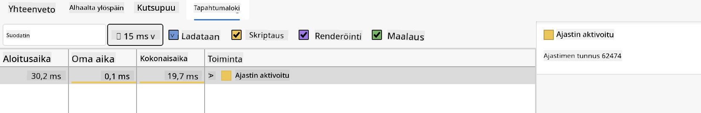

<!--
CO_OP_TRANSLATOR_METADATA:
{
  "original_hash": "eb358f3f4c2c082f9f3a4f98efa1d337",
  "translation_date": "2025-10-23T00:43:12+00:00",
  "source_file": "5-browser-extension/3-background-tasks-and-performance/README.md",
  "language_code": "fi"
}
-->
# Selaimen laajennusprojekti Osa 3: Taustatehtävät ja suorituskyky

Oletko koskaan miettinyt, miksi jotkut selaimen laajennukset tuntuvat nopeilta ja reagoivilta, kun taas toiset vaikuttavat hitailta? Salaisuus piilee kulissien takana tapahtuvassa toiminnassa. Sillä aikaa kun käyttäjät klikkailevat laajennuksesi käyttöliittymässä, taustaprosessit hoitavat hiljaisesti datan hakua, kuvakkeiden päivitystä ja järjestelmäresurssien hallintaa.

Tämä on viimeinen oppituntimme selaimen laajennussarjassa, ja aiomme saada hiilijalanjäljen seurantalaitteesi toimimaan sujuvasti. Lisäät dynaamiset kuvakepäivitykset ja opit tunnistamaan suorituskykyongelmat ennen kuin ne muuttuvat ongelmiksi. Se on kuin kilpa-auton virittäminen - pienet optimoinnit voivat tehdä suuren eron toiminnassa.

Kun olemme valmiita, sinulla on viimeistelty laajennus ja ymmärrät suorituskyvyn periaatteet, jotka erottavat hyvät verkkosovellukset erinomaisista. Sukelletaan selaimen optimoinnin maailmaan.

## Ennakkokysely

[Ennakkokysely](https://ff-quizzes.netlify.app/web/quiz/27)

### Johdanto

Edellisissä oppitunneissamme loit lomakkeen, yhdistit sen API:in ja käsittelit asynkronista datan hakua. Laajennuksesi alkaa muotoutua hienosti.

Nyt meidän täytyy lisätä viimeiset silaukset - kuten saada laajennuksen kuvake vaihtamaan väriä hiilidioksididatan perusteella. Tämä muistuttaa minua siitä, kuinka NASA joutui optimoimaan jokaisen järjestelmän Apollo-avaruusaluksessa. Heillä ei ollut varaa hukata yhtään sykliä tai muistia, koska suorituskyky oli elintärkeää. Vaikka selaimen laajennuksemme ei ole aivan yhtä kriittinen, samat periaatteet pätevät - tehokas koodi luo parempia käyttäjäkokemuksia.

## Verkkosuorituskyvyn perusteet

Kun koodisi toimii tehokkaasti, ihmiset voivat *tuntea* eron. Tiedät sen hetken, kun sivu latautuu välittömästi tai animaatio sujuu sulavasti? Se on hyvää suorituskykyä.

Suorituskyky ei ole pelkästään nopeutta - kyse on verkkokokemusten luomisesta, jotka tuntuvat luonnollisilta sen sijaan, että ne olisivat kömpelöitä ja turhauttavia. Tietotekniikan alkuvaiheessa Grace Hopper piti työpöydällään nanosekuntia (noin jalan mittainen lankapätkä) osoittaakseen, kuinka pitkälle valo kulkee sekunnin miljardisosassa. Se oli hänen tapansa selittää, miksi jokainen mikrosekunti on tärkeä tietotekniikassa. Tutustutaanpa työkaluihin, jotka auttavat sinua selvittämään, mikä hidastaa asioita.

> "Verkkosivuston suorituskyky liittyy kahteen asiaan: kuinka nopeasti sivu latautuu ja kuinka nopeasti sen koodi toimii." -- [Zack Grossbart](https://www.smashingmagazine.com/2012/06/javascript-profiling-chrome-developer-tools/)

Aihe siitä, miten tehdä verkkosivustoista salamannopeita kaikilla laitteilla, kaikille käyttäjille ja kaikissa tilanteissa, on odotetusti laaja. Tässä muutamia huomionarvoisia seikkoja, kun rakennat joko tavallista verkkoprojektia tai selaimen laajennusta.

Ensimmäinen askel sivustosi optimoinnissa on ymmärtää, mitä kulissien takana oikeasti tapahtuu. Onneksi selaimessasi on tehokkaita työkaluja tähän tarkoitukseen.

Avaa Developer Tools Edge-selaimessa klikkaamalla oikeassa yläkulmassa olevia kolmea pistettä, valitse sitten Lisää työkaluja > Developer Tools. Tai käytä näppäinyhdistelmää: `Ctrl` + `Shift` + `I` Windowsissa tai `Option` + `Command` + `I` Macilla. Kun olet siellä, klikkaa Performance-välilehteä - täällä teet tutkimuksesi.

**Tässä on suorituskyvyn tutkimustyökalusi:**
- **Avaa** Developer Tools (tulet käyttämään näitä jatkuvasti kehittäjänä!)
- **Siirry** Performance-välilehdelle - ajattele sitä verkkosovelluksesi kuntoseurantalaitteena
- **Paina** Record-painiketta ja katso sivusi toimintaa
- **Tutki** tuloksia löytääksesi, mikä hidastaa toimintaa

Kokeillaan tätä. Avaa verkkosivusto (Microsoft.com toimii hyvin tähän) ja klikkaa 'Record'-painiketta. Päivitä sivu ja katso, kuinka profiler tallentaa kaiken, mitä tapahtuu. Kun lopetat tallennuksen, näet yksityiskohtaisen erittelyn siitä, kuinka selain 'skriptaa', 'renderöi' ja 'maalaa' sivuston. Se muistuttaa minua siitä, kuinka ohjauskeskus seuraa jokaista järjestelmää raketin laukaisun aikana - saat reaaliaikaista dataa siitä, mitä tapahtuu ja milloin.


✅ [Microsoftin dokumentaatio](https://docs.microsoft.com/microsoft-edge/devtools-guide/performance/?WT.mc_id=academic-77807-sagibbon) sisältää paljon lisätietoa, jos haluat syventyä aiheeseen.

> Vinkki: Tyhjennä selaimesi välimuisti ennen testausta nähdäksesi, miten sivustosi toimii ensikertalaisille kävijöille - se on yleensä melko erilaista kuin toistuvilla vierailuilla!

Valitse profiilin aikajanan elementtejä zoomataksesi tapahtumiin, jotka tapahtuvat sivusi latautuessa.

Saat yleiskuvan sivusi suorituskyvystä valitsemalla osan profiilin aikajanasta ja tarkastelemalla yhteenvetopaneelia:


Tarkista Event Log -paneeli nähdäksesi, kestikö jokin tapahtuma yli 15 ms:



✅ Tutustu profileriin! Avaa kehitystyökalut tällä sivustolla ja katso, onko pullonkauloja. Mikä on hitaimmin latautuva resurssi? Nopein?

## Mitä etsiä profiloinnin aikana

Profilerin käyttäminen on vasta alkua - todellinen taito on oppia tulkitsemaan, mitä nuo värikkäät kaaviot oikeasti kertovat. Älä huoli, opit lukemaan niitä. Kokeneet kehittäjät ovat oppineet tunnistamaan varoitusmerkit ennen kuin ne muuttuvat täysimittaisiksi ongelmiksi.

Puhutaanpa tavallisista epäillyistä - suorituskykyongelmista, jotka yleensä hiipivät verkkoprojekteihin. Kuten Marie Curie joutui tarkkailemaan säteilytasoa laboratoriossaan, meidän täytyy tarkkailla tiettyjä malleja, jotka viittaavat ongelmien syntymiseen. Näiden varhainen havaitseminen säästää sinulta (ja käyttäjiltäsi) paljon turhautumista.

**Resurssien koot**: Verkkosivustot ovat vuosien varrella "lihavampia", ja suuri osa tästä lisäpainosta tulee kuvista. Se on kuin olisimme pakkaamassa yhä enemmän digitaalisiin matkalaukkuihimme.

✅ Tutustu [Internet Archiveen](https://httparchive.org/reports/page-weight) nähdäksesi, kuinka sivukoot ovat kasvaneet ajan myötä - se on varsin paljastavaa.

**Näin pidät resurssit optimoituina:**
- **Pakkaa** kuvat! Modernit formaatit, kuten WebP, voivat pienentää tiedostokokoja merkittävästi
- **Tarjoa** oikean kokoinen kuva kullekin laitteelle - ei tarvitse lähettää suuria työpöytäkuvia puhelimille
- **Minimoi** CSS ja JavaScript - jokainen tavu merkitsee
- **Käytä** laiskaa latausta, jotta kuvat latautuvat vain, kun käyttäjät vierittävät niiden kohdalle

**DOM-läpikäynnit**: Selaimen täytyy rakentaa Document Object Model (DOM) kirjoittamasi koodin perusteella, joten hyvän sivun suorituskyvyn kannalta on tärkeää pitää tagit minimissä, käyttäen ja tyylittäen vain sitä, mitä sivu tarvitsee. Esimerkiksi ylimääräinen CSS, joka liittyy sivuun, voidaan optimoida; tyylit, joita käytetään vain yhdellä sivulla, eivät tarvitse olla mukana päätyylitiedostossa.

**Keskeiset strategiat DOM-optimointiin:**
- **Minimoi** HTML-elementtien ja sisäkkäisten tasojen määrä
- **Poista** käyttämättömät CSS-säännöt ja yhdistä tyylitiedostot tehokkaasti
- **Järjestä** CSS lataamaan vain tarvittavat tyylit kullekin sivulle
- **Rakenna** HTML semanttisesti paremman selaimen tulkinnan vuoksi

**JavaScript**: Jokaisen JavaScript-kehittäjän tulisi varoa 'renderöintiä estäviä' skriptejä, jotka täytyy ladata ennen kuin DOM voidaan käydä läpi ja maalata selaimeen. Harkitse `defer`-attribuutin käyttöä inline-skripteissä (kuten Terrarium-moduulissa).

**Modernit JavaScript-optimointitekniikat:**
- **Käytä** `defer`-attribuuttia skriptien lataamiseen DOM-parsinnan jälkeen
- **Toteuta** koodin jakaminen ladataksesi vain tarvittavan JavaScriptin
- **Sovella** laiskaa latausta ei-kriittiselle toiminnallisuudelle
- **Minimoi** raskaiden kirjastojen ja kehysten käyttö mahdollisuuksien mukaan

✅ Kokeile joitakin sivustoja [Site Speed Test -sivustolla](https://www.webpagetest.org/) oppiaksesi lisää yleisistä tarkistuksista, joita tehdään sivuston suorituskyvyn määrittämiseksi.

Nyt kun sinulla on käsitys siitä, kuinka selain renderöi lähettämiäsi resursseja, katsotaan viimeiset asiat, jotka sinun täytyy tehdä laajennuksesi viimeistelyyn:

### Luo funktio värin laskemiseen

Nyt luomme funktion, joka muuttaa numeerisen datan merkityksellisiksi väreiksi. Ajattele sitä liikennevalojärjestelmänä - vihreä puhtaalle energialle, punainen korkealle hiili-intensiteetille.

Tämä funktio ottaa CO2-datan API:sta ja määrittää, mikä väri parhaiten edustaa ympäristövaikutusta. Se on samanlainen kuin tapa, jolla tiedemiehet käyttävät värikoodausta lämpökartoissa visualisoidakseen monimutkaisia datamalleja - valtamerien lämpötiloista tähtien muodostumiseen. Lisätään tämä tiedostoon `/src/index.js`, heti niiden `const`-muuttujien jälkeen, jotka määritimme aiemmin:

```javascript
function calculateColor(value) {
	// Define CO2 intensity scale (grams per kWh)
	const co2Scale = [0, 150, 600, 750, 800];
	// Corresponding colors from green (clean) to dark brown (high carbon)
	const colors = ['#2AA364', '#F5EB4D', '#9E4229', '#381D02', '#381D02'];

	// Find the closest scale value to our input
	const closestNum = co2Scale.sort((a, b) => {
		return Math.abs(a - value) - Math.abs(b - value);
	})[0];
	
	console.log(`${value} is closest to ${closestNum}`);
	
	// Find the index for color mapping
	const num = (element) => element > closestNum;
	const scaleIndex = co2Scale.findIndex(num);

	const closestColor = colors[scaleIndex];
	console.log(scaleIndex, closestColor);

	// Send color update message to background script
	chrome.runtime.sendMessage({ action: 'updateIcon', value: { color: closestColor } });
}
```

**Puretaan tämä nokkela pieni funktio osiin:**
- **Määrittää** kaksi taulukkoa - yhden CO2-tasoille, toisen väreille (vihreä = puhdas, ruskea = likainen!)
- **Löytää** lähimmän vastaavuuden todelliseen CO2-arvoomme käyttämällä siistiä taulukon lajittelua
- **Hakee** vastaavan värin findIndex()-metodilla
- **Lähettää** viestin Chromen taustaskriptille valitsemallamme värillä
- **Käyttää** template literal -merkintää (takakautta olevat lainausmerkit) siistimpään merkkijonojen muotoiluun
- **Pitää** kaiken järjestyksessä const-määrittelyillä

`chrome.runtime` [API](https://developer.chrome.com/extensions/runtime) on kuin laajennuksesi hermosto - se hoitaa kaiken kulissien takana tapahtuvan viestinnän ja tehtävät:

> "Käytä chrome.runtime API:a hakeaksesi taustasivun, saadaksesi tietoja manifestista ja kuunnellaksesi sekä vastataksesi sovelluksen tai laajennuksen elinkaaren tapahtumiin. Voit myös käyttää tätä API:a muuntaaksesi URL-osoitteiden suhteelliset polut täysin määritellyiksi URL-osoitteiksi."

**Miksi Chrome Runtime API on kätevä:**
- **Mahdollistaa** laajennuksen eri osien välisen viestinnän
- **Hoitaa** taustatyöt ilman käyttöliittymän jäätymistä
- **Hallinnoi** laajennuksen elinkaaren tapahtumia
- **Helpottaa** viestien välittämistä skriptien välillä

✅ Jos kehität tätä selaimen laajennusta Edgelle, saattaa yllättää, että käytät Chrome API:a. Uudemmat Edge-selaimen versiot toimivat Chromium-selainmoottorilla, joten voit hyödyntää näitä työkaluja.

> **Vinkki**: Jos haluat profiloida selaimen laajennusta, avaa kehitystyökalut laajennuksen sisältä, koska se on oma erillinen selaininstanssinsa. Tämä antaa sinulle pääsyn laajennuskohtaisiin suorituskykymittareihin.

### Aseta oletuskuvakkeen väri

Ennen kuin aloitamme todellisen datan hakemisen, annetaan laajennuksellemme lähtökohta. Kukaan ei pidä tyhjästä tai rikkinäisen näköisestä kuvakkeesta. Aloitamme vihreällä värillä, jotta käyttäjät tietävät laajennuksen toimivan heti asennuksen jälkeen.

Lisätään `init()`-funktioon oletusvihreä kuvake:

```javascript
chrome.runtime.sendMessage({
	action: 'updateIcon',
	value: {
		color: 'green',
	},
});
```

**Mitä tämä alustus saavuttaa:**
- **Asettaa** neutraalin vihreän värin oletustilaksi
- **Tarjoaa** välitöntä visuaalista palautetta, kun laajennus latautuu
- **Vakiinnuttaa** viestintämallin taustaskriptiin
- **Varmistaa**, että käyttäjät näkevät toimivan laajennuksen ennen datan lataamista

### Kutsu funktio, suorita kutsu

Nyt yhdistetään kaikki yhteen niin, että kun uutta CO2-dataa saapuu, kuvakkeesi päivittyy automaattisesti oikealla värillä. Se on kuin viimeisen piirin yhdistäminen elektronisessa laitteessa - yhtäkkiä kaikki yksittäiset komponentit toimivat yhtenä järjestelmänä.

Lisää tämä rivi heti sen jälkeen, kun saat CO2-datan API:sta:

```javascript
// After retrieving CO2 data from the API
// let CO2 = data.data[0].intensity.actual;
calculateColor(CO2);
```

**Tämä integrointi saavuttaa:**
- **Yhdistää** API-datavirran visuaalisen indikaattorijärjestelmän kanssa
- **Laukaisee** kuvakepäivitykset automaattisesti, kun uutta dataa saapuu
- **Varmistaa** reaaliaikaisen visuaalisen palautteen nykyisen hiili-intensiteetin perusteella
- **Säilyttää** datan haun ja näyttölogiikan erottelun

Ja lopuksi, lisää `/dist/background.js`-tiedostoon kuuntelija näille taustatoimintakutsuille:

```javascript
// Listen for messages from the content script
chrome.runtime.onMessage.addListener(function (msg, sender, sendResponse) {
	if (msg.action === 'updateIcon') {
		chrome.action.setIcon({ imageData: drawIcon(msg.value) });
	}
});

// Draw dynamic icon using Canvas API
// Borrowed from energy lollipop extension - nice feature!
function drawIcon(value) {
	// Create an offscreen canvas for better performance
	const canvas = new OffscreenCanvas(200, 200);
	const context = canvas.getContext('2d');

	// Draw a colored circle representing carbon intensity
	context.beginPath();
	context.fillStyle = value.color;
	context.arc(100, 100, 50, 0, 2 * Math.PI);
	context.fill();

	// Return the image data for the browser icon
	return context.getImageData(50, 50, 100, 100);
}
```

**Mitä tämä taustaskripti tekee:**
- **Kuuntelee** viestejä pääskriptistäsi (kuten vastaanottovirkailija, joka ottaa puheluita)
- **Käsittelee** 'updateIcon'-pyyntöjä muuttaakseen työkalupalkin kuvaketta
- **Luo** uusia kuvakkeita lennossa Canvas API:n avulla
- **Piirtää** yksinkertaisen värillisen ympyrän, joka näyttää nykyisen hiili-intensiteetin
- **Päivittää** selaimen työkalupalkin tuoreella kuvakkeella
- **Käyttää** OffscreenCanvasia sujuvan suorituskyvyn takaamiseksi (ei UI:n estämistä)

✅ Opit lisää Canvas API:sta [Avaruuspeli-oppitunneilla](../../6-space-game/2-drawing-to-canvas/README.md).

**Testaa laajennustasi:**
- **Rakenna** kaikki komennolla `npm run build`
- **Lataa** laajennuksesi uudelleen selaimeen (älä unohda tätä vaihetta)
- **Avaa** laajennuksesi ja katso, kuinka kuvake vaihtaa väriä
- **Tarkista**, miten se reagoi todelliseen hiilidioksididataaan ympäri maailmaa

Nyt tiedät yhdellä silmäyksellä, onko hyvä aika pestä pyykkiä vai kannattaako odottaa puhtaampaa energiaa. Olet juuri rakentanut jotain aidosti hyödyllistä ja oppinut selaimen suorituskyvystä samalla.

## GitHub Copilot Agent -haaste 🚀

Käytä Agent-tilaa suorittaaksesi seuraavan haasteen:

**Kuvaus:** Paranna selaimen laajennuksen suorituskyvyn seurantakykyä lisäämällä ominaisuus, joka seuraa ja näyttää laajennuksen eri komponenttien latausaikoja.

**Tehtävä:** Luo suorituskyvyn seurantaj
Tässä on mielenkiintoinen etsivätehtävä: valitse muutama avoimen lähdekoodin verkkosivusto, joka on ollut olemassa jo vuosia (kuten Wikipedia, GitHub tai Stack Overflow), ja tutki niiden commit-historiaa. Voitko löytää kohtia, joissa ne ovat tehneet suorituskykyparannuksia? Mitkä ongelmat toistuvat jatkuvasti?

**Tutkimusmenetelmäsi:**
- **Etsi** commit-viesteistä sanoja kuten "optimize", "performance" tai "faster"
- **Tarkkaile** kaavoja - korjaavatko he jatkuvasti samoja ongelmatyyppejä?
- **Tunnista** yleiset syyt, jotka hidastavat verkkosivustoja
- **Jaa** löytösi - muut kehittäjät oppivat tosielämän esimerkeistä

## Luentojälkeinen kysely

[Luentojälkeinen kysely](https://ff-quizzes.netlify.app/web/quiz/28)

## Kertaus ja itseopiskelu

Harkitse tilaamista [suorituskykyuutiskirjeeseen](https://perf.email/)

Tutki joitakin tapoja, joilla selaimet arvioivat verkkosivujen suorituskykyä, tarkastelemalla niiden web-työkalujen suorituskyky-välilehtiä. Löydätkö merkittäviä eroja?

## Tehtävä

[Analysoi sivuston suorituskykyä](assignment.md)

---

**Vastuuvapauslauseke**:  
Tämä asiakirja on käännetty käyttämällä tekoälypohjaista käännöspalvelua [Co-op Translator](https://github.com/Azure/co-op-translator). Vaikka pyrimme tarkkuuteen, huomioithan, että automaattiset käännökset voivat sisältää virheitä tai epätarkkuuksia. Alkuperäistä asiakirjaa sen alkuperäisellä kielellä tulisi pitää ensisijaisena lähteenä. Tärkeissä tiedoissa suositellaan ammattimaista ihmiskäännöstä. Emme ole vastuussa väärinkäsityksistä tai virhetulkinnoista, jotka johtuvat tämän käännöksen käytöstä.