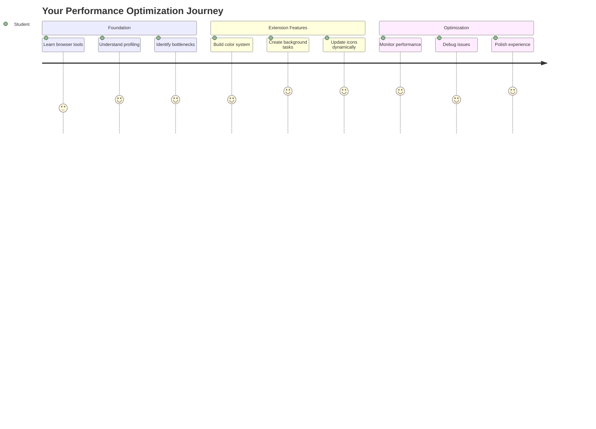
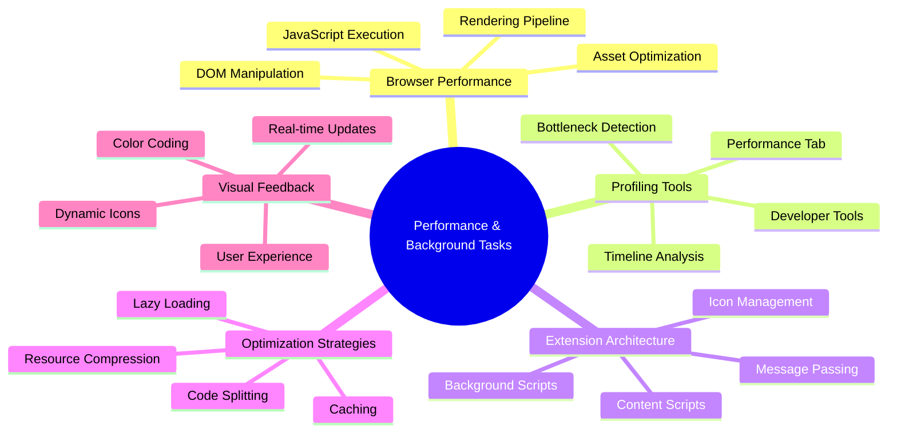
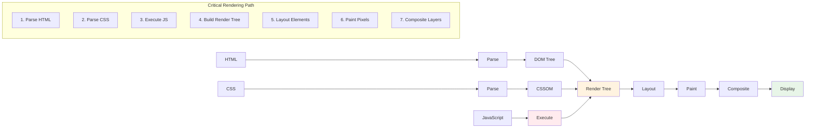
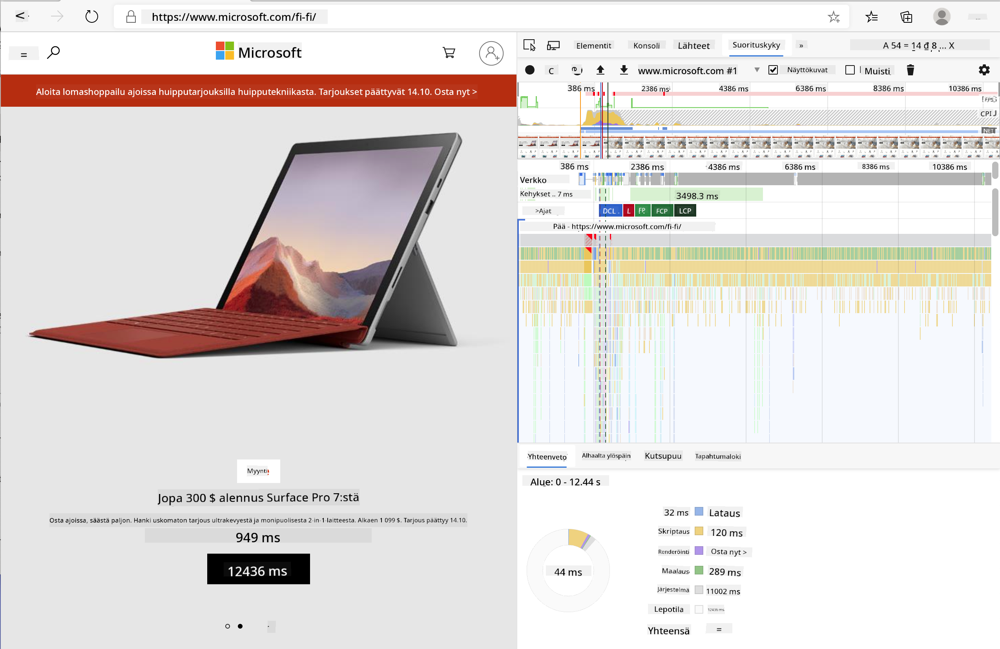
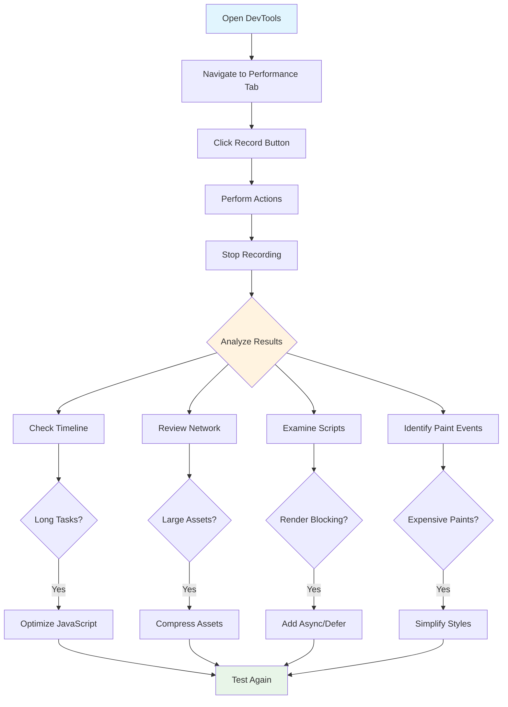
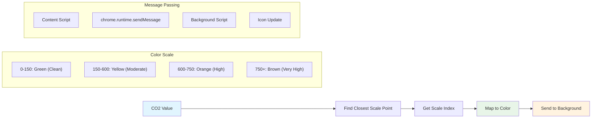
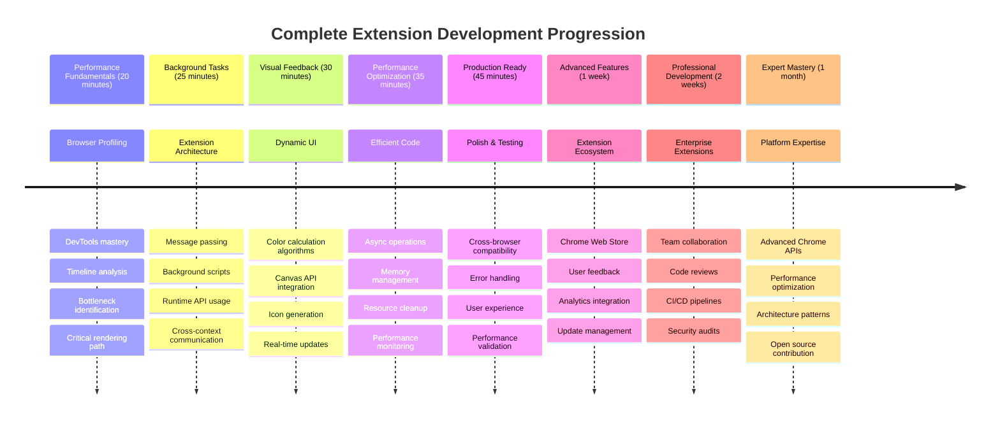

<!--
CO_OP_TRANSLATOR_METADATA:
{
  "original_hash": "b275fed2c6fc90d2b9b6661a3225faa2",
  "translation_date": "2025-11-04T01:43:38+00:00",
  "source_file": "5-browser-extension/3-background-tasks-and-performance/README.md",
  "language_code": "fi"
}
-->
# Selaimen laajennusprojekti Osa 3: Taustatehtävät ja suorituskyky



Oletko koskaan miettinyt, miksi jotkut selaimen laajennukset tuntuvat nopeilta ja reagoivilta, kun taas toiset vaikuttavat hitailta? Salaisuus piilee kulissien takana tapahtuvassa toiminnassa. Sillä aikaa kun käyttäjät klikkailevat laajennuksen käyttöliittymässä, taustaprosessit hoitavat hiljaisesti datan hakua, kuvakkeiden päivitystä ja järjestelmäresurssien hallintaa.

Tämä on viimeinen oppituntimme selaimen laajennussarjassa, ja aiomme saada hiilijalanjäljen seurantalaitteesi toimimaan sujuvasti. Lisäät dynaamiset kuvakepäivitykset ja opit tunnistamaan suorituskykyongelmat ennen kuin ne muuttuvat ongelmiksi. Se on kuin kilpa-auton virittäminen – pienet optimoinnit voivat tehdä suuren eron toiminnassa.

Kun olemme valmiita, sinulla on viimeistelty laajennus ja ymmärrys suorituskykyperiaatteista, jotka erottavat hyvät verkkosovellukset erinomaisista. Sukelletaan selaimen optimoinnin maailmaan.

## Ennakkokysely

[Ennakkokysely](https://ff-quizzes.netlify.app/web/quiz/27)

### Johdanto

Edellisissä oppitunneissa rakensit lomakkeen, yhdistit sen API:iin ja käsittelit asynkronista datan hakua. Laajennuksesi alkaa muotoutua hienosti.

Nyt meidän täytyy lisätä viimeiset silaukset – kuten saada laajennuksen kuvake vaihtamaan väriä hiilidatan perusteella. Tämä muistuttaa minua siitä, kuinka NASA joutui optimoimaan jokaisen järjestelmän Apollo-avaruusaluksessa. Heillä ei ollut varaa hukattuihin sykleihin tai muistiin, koska suorituskyky oli elintärkeää. Vaikka selaimen laajennuksemme ei ole aivan yhtä kriittinen, samat periaatteet pätevät – tehokas koodi luo parempia käyttäjäkokemuksia.



## Verkkosuorituskyvyn perusteet

Kun koodisi toimii tehokkaasti, ihmiset voivat *tuntea* eron. Tiedät sen hetken, kun sivu latautuu välittömästi tai animaatio sujuu sulavasti? Se on hyvää suorituskykyä.

Suorituskyky ei ole pelkästään nopeutta – kyse on verkkokokemusten luomisesta, jotka tuntuvat luonnollisilta sen sijaan, että ne olisivat kömpelöitä ja turhauttavia. Tietokoneiden alkuvaiheissa Grace Hopper piti nanosekuntia (noin jalan mittaista lankapätkää) työpöydällään osoittaakseen, kuinka pitkälle valo kulkee sekunnin miljardisosassa. Se oli hänen tapansa selittää, miksi jokainen mikrosekunti on tärkeä tietojenkäsittelyssä. Tutustutaan työkaluihin, jotka auttavat sinua selvittämään, mikä hidastaa asioita.

> "Verkkosivuston suorituskyky liittyy kahteen asiaan: kuinka nopeasti sivu latautuu ja kuinka nopeasti sen koodi toimii." -- [Zack Grossbart](https://www.smashingmagazine.com/2012/06/javascript-profiling-chrome-developer-tools/)

Aihe siitä, kuinka tehdä verkkosivustoista salamannopeita kaikilla laitteilla, kaikille käyttäjille ja kaikissa tilanteissa, on odotetusti laaja. Tässä muutamia huomioitavia asioita, kun rakennat joko tavallista verkkoprojektia tai selaimen laajennusta.

Ensimmäinen askel sivustosi optimoinnissa on ymmärtää, mitä oikeasti tapahtuu kulissien takana. Onneksi selaimessasi on tehokkaita työkaluja tähän tarkoitukseen.



Avaa Edge-selaimen kehitystyökalut klikkaamalla oikeassa yläkulmassa olevia kolmea pistettä, valitse Lisää työkaluja > Kehitystyökalut. Tai käytä pikanäppäintä: `Ctrl` + `Shift` + `I` Windowsilla tai `Option` + `Command` + `I` Macilla. Kun olet siellä, klikkaa Suorituskyky-välilehteä – täällä teet tutkimuksesi.

**Tässä on suorituskyvyn tutkimustyökalusi:**
- **Avaa** kehitystyökalut (käytät näitä jatkuvasti kehittäjänä!)
- **Siirry** Suorituskyky-välilehdelle – ajattele sitä verkkosovelluksesi kuntoseurantalaitteena
- **Paina** Tallenna-painiketta ja katso sivusi toimintaa
- **Tutki** tuloksia löytääksesi, mikä hidastaa asioita

Kokeillaan tätä. Avaa verkkosivusto (Microsoft.com toimii hyvin tähän) ja klikkaa 'Tallenna'-painiketta. Päivitä sivu ja katso, kuinka profiilintyökalu tallentaa kaiken, mitä tapahtuu. Kun lopetat tallennuksen, näet yksityiskohtaisen erittelyn siitä, kuinka selain 'skriptasi', 'renderöi' ja 'maalasi' sivuston. Se muistuttaa minua siitä, kuinka ohjauskeskus seuraa jokaista järjestelmää raketin laukaisun aikana – saat reaaliaikaista dataa siitä, mitä tapahtuu ja milloin.



✅ [Microsoftin dokumentaatio](https://docs.microsoft.com/microsoft-edge/devtools-guide/performance/?WT.mc_id=academic-77807-sagibbon) sisältää paljon lisätietoa, jos haluat syventyä aiheeseen.

> Vinkki: Tyhjennä selaimen välimuisti ennen testausta nähdäksesi, miten sivustosi toimii ensikertalaisille kävijöille – se on yleensä hyvin erilaista kuin toistuvilla vierailuilla!

Valitse profiilin aikajanan osia zoomataksesi tapahtumiin, jotka tapahtuvat sivun latauksen aikana.

Saat yleiskuvan sivusi suorituskyvystä valitsemalla osan profiilin aikajanasta ja katsomalla yhteenvetopaneelia:


Tarkista Tapahtumaloki-paneeli nähdäksesi, kestikö jokin tapahtuma yli 15 ms:


✅ Tutustu profiilityökaluusi! Avaa kehitystyökalut tällä sivustolla ja katso, onko pullonkauloja. Mikä on hitaimmin latautuva resurssi? Nopein?



## Mitä etsiä profiilityökalua käytettäessä

Profiilityökalun käyttäminen on vasta alkua – todellinen taito on tietää, mitä nuo värikkäät kaaviot oikeasti kertovat. Älä huoli, opit lukemaan niitä. Kokeneet kehittäjät ovat oppineet tunnistamaan varoitusmerkit ennen kuin ne muuttuvat täysimittaisiksi ongelmiksi.

Puhutaanpa tavallisista epäillyistä – suorituskykyongelmista, jotka yleensä hiipivät verkkoprojekteihin. Kuten Marie Curie joutui tarkkailemaan säteilytasoa laboratoriossaan, meidän täytyy tarkkailla tiettyjä malleja, jotka viittaavat ongelmiin. Näiden varhainen havaitseminen säästää sinulta (ja käyttäjiltäsi) paljon turhautumista.

**Resurssien koot**: Verkkosivustot ovat vuosien varrella "lihavampia", ja suuri osa tästä lisäpainosta tulee kuvista. Se on kuin olisimme pakkaamassa yhä enemmän digitaalisiin matkalaukkuihimme.

✅ Katso [Internet Archive](https://httparchive.org/reports/page-weight) nähdäksesi, kuinka sivukoot ovat kasvaneet ajan myötä – se on varsin paljastavaa.

**Näin pidät resurssisi optimoituina:**
- **Pakkaa** kuvat! Modernit formaatit, kuten WebP, voivat pienentää tiedostokokoja merkittävästi
- **Tarjoa** oikea kuvan koko jokaiselle laitteelle – ei tarvitse lähettää suuria työpöytäkuvia puhelimille
- **Minimoi** CSS ja JavaScript – jokainen tavu merkitsee
- **Käytä** laiskaa latausta, jotta kuvat latautuvat vain, kun käyttäjät oikeasti selaavat niitä

**DOM-läpikäynnit**: Selaimen täytyy rakentaa dokumenttiobjektimalli (DOM) kirjoittamasi koodin perusteella, joten hyvän sivun suorituskyvyn kannalta on tärkeää pitää tagit minimissä, käyttäen ja tyylittäen vain sitä, mitä sivu tarvitsee. Esimerkiksi ylimääräinen CSS, joka liittyy sivuun, voisi optimoida; tyylit, joita tarvitaan vain yhdellä sivulla, eivät tarvitse olla mukana päätyylitiedostossa.

**DOM-optimoinnin avainstrategiat:**
- **Minimoi** HTML-elementtien ja sisäkkäisten tasojen määrä
- **Poista** käyttämättömät CSS-säännöt ja yhdistä tyylitiedostot tehokkaasti
- **Järjestä** CSS lataamaan vain tarvittavat tyylit kullekin sivulle
- **Rakenna** HTML semanttisesti paremman selaimen tulkinnan vuoksi

**JavaScript**: Jokaisen JavaScript-kehittäjän tulisi varoa 'renderöintiä estäviä' skriptejä, jotka täytyy ladata ennen kuin DOM voidaan käydä läpi ja maalata selaimeen. Harkitse `defer`-attribuutin käyttöä sisäisissä skripteissä (kuten Terrarium-moduulissa tehdään).

**Modernit JavaScript-optimointitekniikat:**
- **Käytä** `defer`-attribuuttia skriptien lataamiseen DOM-parsinnan jälkeen
- **Toteuta** koodin jakaminen ladataksesi vain tarvittavan JavaScriptin
- **Sovella** laiskaa latausta ei-kriittiselle toiminnallisuudelle
- **Minimoi** raskaiden kirjastojen ja kehysten käyttö mahdollisuuksien mukaan

✅ Kokeile joitakin sivustoja [Site Speed Test -sivustolla](https://www.webpagetest.org/) oppiaksesi lisää yleisistä tarkistuksista, joita tehdään sivuston suorituskyvyn määrittämiseksi.

### 🔄 **Pedagoginen tarkistus**
**Suorituskyvyn ymmärtäminen**: Ennen laajennusominaisuuksien rakentamista varmista, että osaat:
- ✅ Selittää kriittisen renderöintipolun HTML:stä pikseleihin
- ✅ Tunnistaa yleiset suorituskyvyn pullonkaulat verkkosovelluksissa
- ✅ Käyttää selaimen kehitystyökaluja sivun suorituskyvyn profilointiin
- ✅ Ymmärtää, miten resurssien koko ja DOM-monimutkaisuus vaikuttavat nopeuteen

**Nopea itsekoe**: Mitä tapahtuu, kun sinulla on renderöintiä estävä JavaScript?
*Vastaus: Selaimen täytyy ladata ja suorittaa skripti ennen kuin se voi jatkaa HTML:n parsintaa ja sivun renderöintiä*

**Suorituskyvyn vaikutus tosielämässä**:
- **100 ms viive**: Käyttäjät huomaavat hidastumisen
- **1 sekunnin viive**: Käyttäjät alkavat menettää keskittymistä
- **3+ sekunnin viive**: 40 % käyttäjistä hylkää sivun
- **Mobiiliverkot**: Suorituskyvyllä on vielä enemmän merkitystä

Nyt kun sinulla on käsitys siitä, kuinka selain renderöi lähettämäsi resurssit, katsotaan viimeiset asiat, jotka sinun täytyy tehdä laajennuksesi viimeistelemiseksi:

### Luo funktio värin laskemiseen

Nyt luomme funktion, joka muuttaa numeerisen datan merkityksellisiksi väreiksi. Ajattele sitä liikennevalojärjestelmänä – vihreä puhtaalle energialle, punainen korkealle hiili-intensiteetille.

Tämä funktio ottaa CO2-datan API:sta ja määrittää, mikä väri parhaiten edustaa ympäristövaikutusta. Se on samanlaista kuin miten tutkijat käyttävät värikoodausta lämpökartoissa visualisoidakseen monimutkaisia datamalleja – valtamerien lämpötiloista tähtien muodostumiseen. Lisätään tämä tiedostoon `/src/index.js`, heti niiden `const`-muuttujien jälkeen, jotka asetimme aiemmin:



```javascript
function calculateColor(value) {
	// Define CO2 intensity scale (grams per kWh)
	const co2Scale = [0, 150, 600, 750, 800];
	// Corresponding colors from green (clean) to dark brown (high carbon)
	const colors = ['#2AA364', '#F5EB4D', '#9E4229', '#381D02', '#381D02'];

	// Find the closest scale value to our input
	const closestNum = co2Scale.sort((a, b) => {
		return Math.abs(a - value) - Math.abs(b - value);
	})[0];
	
	console.log(`${value} is closest to ${closestNum}`);
	
	// Find the index for color mapping
	const num = (element) => element > closestNum;
	const scaleIndex = co2Scale.findIndex(num);

	const closestColor = colors[scaleIndex];
	console.log(scaleIndex, closestColor);

	// Send color update message to background script
	chrome.runtime.sendMessage({ action: 'updateIcon', value: { color: closestColor } });
}
```

**Puretaan tämä nokkela pieni funktio:**
- **Asettaa** kaksi taulukkoa – yksi CO2-tasoille, toinen väreille (vihreä = puhdas, ruskea = likainen!)
- **Löytää** lähimmän vastaavuuden todelliseen CO2-arvoon käyttämällä siistiä taulukon lajittelua
- **Hakee** vastaavan värin findIndex()-metodilla
- **Lähettää** viestin Chromen taustaskriptille valitsemallamme värillä
- **Käyttää** mallilausekkeita (ne takamerkit) siistimpään merkkijonojen muotoiluun
- **Pitää** kaiken järjestyksessä const-määrittelyillä

`chrome.runtime` [API](https://developer.chrome.com/extensions/runtime) on kuin laajennuksesi hermosto – se hoitaa kaikki kulissien takana tapahtuvat viestinnät ja tehtävät:

> "Käytä chrome.runtime API:ta hakeaksesi taustasivun, saadaksesi tietoja manifestista ja kuunnellaksesi sekä vastataksesi sovelluksen tai laajennuksen elinkaaren tapahtumiin. Voit myös käyttää tätä API:ta muuntaaksesi URL-osoitteiden suhteelliset polut täysin määritellyiksi URL-osoitteiksi."

**Miksi Chrome Runtime API on niin kätevä:**
- **Mahdollistaa** laajennuksen eri osien välisen viestinnän
- **Hoitaa** taustatyöt ilman käyttöliittymän jäätymistä
- **Hallinnoi** laajennuksesi elinkaaren tapahtumia
- **Tekee** viestien välittämisestä skriptien välillä erittäin helppoa

✅ Jos kehität tätä selaimen laajennusta Edgelle, voi yllättää, että käytät Chrome API:ta. Uudemmat Edge-selaimen versiot toimivat Chromium-selainmoottorilla, joten voit hyödyntää näitä työkaluja.

```mermaid
architecture-beta
    group browser(logos:chrome)[Browser]
    
    service popup(logos:html5)[Popup UI] in browser
    service content(logos:javascript)[Content Script] in browser
    service background(database)[Background Script] in browser
    service api(logos:api)[External API] in browser
    
    popup:R -- L:content
    content:R -- L:background
    background:T -- B:api
    content:T -- B:api
    
    junction junctionCenter in browser
    popup:R -- L:junctionCenter
    junctionCenter:R -- L:background
```



> **Vinkki**: Jos haluat profiloida selaimen laajennuksen, avaa kehitystyökalut laajennuksen sisältä, koska se on oma erillinen selaimen instanssi. Tämä antaa sinulle pääsyn laajennuskohtaisiin suorituskykymittareihin.

### Aseta oletuskuvakkeen väri

Ennen kuin aloitamme todellisen datan hakemisen, annetaan laajennukselle lähtökohta. Kukaan ei pidä tyhjästä tai rikkinäisen näköisestä kuvakkeesta. Aloitamme vihreällä värillä, jotta käyttäjät tietävät laajennuksen toimivan heti, kun he asentavat sen.

Lisää `init()`-funktioosi oletusvihreä kuvake:

```javascript
chrome.runtime.sendMessage({
	action: 'updateIcon',
	value: {
		color: 'green',
	},
});
```

**Mitä tämä alustus tekee:**
- **Asettaa** neutraalin vihreän värin oletustilaksi
- **Tarjoaa** välitöntä visuaalista palautetta, kun laajennus latautuu
- **Vakiinnuttaa** viestintämallin taustaskriptille
- **Varmistaa**, että käyttäjät näkevät toimivan laajennuksen ennen datan lataamista

### Kutsu funktio, suorita kutsu

Nyt yhdistetään kaikki yhteen niin, että kun uutta CO2-dataa saapuu, kuvakkeesi päivittyy automaattisesti oikealla värillä. Se on kuin viimeisen piirin yhdistäminen elektronisessa laitteessa – yhtäkkiä kaikki yksittäiset komponentit toimivat yhtenä järjestelmänä.

Lisää tämä rivi heti, kun saat CO2-datan API:sta:

```javascript
// After retrieving CO2 data from the API
// let CO2 = data.data[0].intensity.actual;
calculateColor(CO2);
```

**Tämä integrointi tekee:**
- **Yhdistää** API-datavirran visuaalisen indikaattorijärjestelmän kanssa
- **Laukaisee** kuvakepäivitykset automaattisesti, kun uutta dataa saapuu
- **Varmistaa** reaaliaikaisen visuaalisen palautteen nykyisen hiili-intensiteetin perusteella
- **Säilyttää** datan haun ja näyttölogiikan erottelun

Ja lopuksi, lisää `/dist/background.js`-tiedostoon kuuntelija näille taustatoimintakutsuille:

```javascript
// Listen for messages from the content script
chrome.runtime.onMessage.addListener(function (msg, sender, sendResponse) {
	if (msg.action === 'updateIcon') {
		chrome.action.setIcon({ imageData: drawIcon(msg.value) });
	}
});

// Draw dynamic icon using Canvas API
// Borrowed from energy lollipop extension - nice feature!
function drawIcon(value) {
	// Create an offscreen canvas for better performance
	const canvas = new OffscreenCanvas(200, 200);
	const context = canvas.getContext('2d');

	// Draw a colored circle representing carbon intensity
	context.beginPath();
	context.fillStyle = value.color;
	context.arc(100, 100, 50, 0, 2 * Math.PI);
	context.fill();

	// Return the image data for the browser icon
	return context.getImageData(50, 50, 100, 100);
}
```

**Tämä taustaskripti tekee:**
- **Kuuntelee** viestejä pääskriptistäsi (kuten vastaanottovirkailija, joka ottaa puheluita)
- **Käsittelee** 'updateIcon'-pyyntöjä muuttaakseen työkalupalkin kuvaketta
- **Luo** uusia kuvakkeita lennossa Canvas API:n avulla
- **Piirtää
- ✅ Mikä rooli Chrome Runtime API:lla on laajennuksen arkkitehtuurissa?
- ✅ Kuinka värilaskenta-algoritmi muuntaa datan visuaaliseksi palautteeksi?

**Suorituskykyhuomiot**: Laajennuksesi osoittaa nyt:
- **Tehokasta viestintää**: Selkeä kommunikointi skriptikontekstien välillä
- **Optimoitua renderöintiä**: OffscreenCanvas estää käyttöliittymän tukkeutumisen
- **Reaaliaikaisia päivityksiä**: Dynaamiset kuvakevaihdot reaaliaikaisen datan perusteella
- **Muistin hallintaa**: Asianmukainen siivous ja resurssien hallinta

**Aika testata laajennustasi:**
- **Rakenna** kaikki komennolla `npm run build`
- **Lataa** laajennuksesi uudelleen selaimessa (älä unohda tätä vaihetta)
- **Avaa** laajennuksesi ja katso, kuinka kuvake vaihtaa väriä
- **Tarkista**, miten se reagoi todelliseen hiilidioksididataan eri puolilta maailmaa

Nyt tiedät yhdellä silmäyksellä, onko hyvä hetki pestä pyykkiä vai kannattaako odottaa puhtaampaa energiaa. Olet juuri rakentanut jotain aidosti hyödyllistä ja oppinut samalla selaimen suorituskyvystä.

## GitHub Copilot Agent -haaste 🚀

Käytä Agent-tilaa suorittaaksesi seuraavan haasteen:

**Kuvaus:** Paranna selaimen laajennuksen suorituskyvyn seurantakykyä lisäämällä ominaisuus, joka seuraa ja näyttää eri komponenttien latausaikoja.

**Tehtävä:** Luo suorituskyvyn seurantajärjestelmä selaimen laajennukselle, joka mittaa ja kirjaa ajan, joka kuluu CO2-datan hakemiseen API:sta, värien laskemiseen ja kuvakkeen päivittämiseen. Lisää funktio nimeltä `performanceTracker`, joka käyttää Performance API:ta näiden operaatioiden mittaamiseen ja näyttää tulokset selaimen konsolissa aikaleimojen ja keston metrikkojen kera.

Lisätietoja [agent-tilasta](https://code.visualstudio.com/blogs/2025/02/24/introducing-copilot-agent-mode) löytyy täältä.

## 🚀 Haaste

Tässä mielenkiintoinen etsivätehtävä: valitse muutama avoimen lähdekoodin verkkosivusto, joka on ollut olemassa vuosia (esim. Wikipedia, GitHub tai Stack Overflow), ja tutki niiden commit-historiaa. Voitko havaita, missä ne ovat tehneet suorituskykyparannuksia? Mitkä ongelmat toistuvat?

**Tutkimusmenetelmäsi:**
- **Etsi** commit-viesteistä sanoja kuten "optimize", "performance" tai "faster"
- **Tarkkaile** kaavoja - korjaavatko he jatkuvasti samoja ongelmatyyppejä?
- **Tunnista** yleiset syyt, jotka hidastavat verkkosivustoja
- **Jaa** havaintosi - muut kehittäjät oppivat tosielämän esimerkeistä

## Luentojälkeinen kysely

[Luentojälkeinen kysely](https://ff-quizzes.netlify.app/web/quiz/28)

## Kertaus ja itseopiskelu

Harkitse ilmoittautumista [suorituskykyuutiskirjeeseen](https://perf.email/)

Tutki joitakin tapoja, joilla selaimet mittaavat verkkosuorituskykyä tarkastelemalla niiden web-työkalujen suorituskyky-välilehtiä. Löydätkö merkittäviä eroja?

### ⚡ **Mitä voit tehdä seuraavan 5 minuutin aikana**
- [ ] Avaa selaimen tehtävienhallinta (Shift+Esc Chromessa) nähdäksesi laajennuksen resurssien käytön
- [ ] Käytä DevTools-suorituskyky-välilehteä verkkosivun suorituskyvyn tallentamiseen ja analysointiin
- [ ] Tarkista selaimen laajennussivu nähdäksesi, mitkä laajennukset vaikuttavat käynnistysaikaan
- [ ] Kokeile laajennusten väliaikaista poistamista nähdäksesi suorituskykyerot

### 🎯 **Mitä voit saavuttaa tunnin aikana**
- [ ] Suorita luennonjälkeinen kysely ja ymmärrä suorituskykykonseptit
- [ ] Toteuta taustaskripti selaimen laajennukselle
- [ ] Opettele käyttämään browser.alarms tehokkaisiin taustatehtäviin
- [ ] Harjoittele viestien välittämistä sisältöskriptien ja taustaskriptien välillä
- [ ] Mittaa ja optimoi laajennuksesi resurssien käyttöä

### 📅 **Viikon mittainen suorituskykyseikkailusi**
- [ ] Viimeistele korkeasuorituskykyinen selaimen laajennus taustatoiminnallisuudella
- [ ] Hallitse palvelutyöntekijät ja moderni laajennusarkkitehtuuri
- [ ] Toteuta tehokkaat datan synkronointi- ja välimuististrategiat
- [ ] Opettele edistyneitä virheenkorjaustekniikoita laajennuksen suorituskyvyn parantamiseksi
- [ ] Optimoi laajennuksesi sekä toiminnallisuuden että resurssitehokkuuden osalta
- [ ] Luo kattavat testit laajennuksen suorituskykyskenaarioille

### 🌟 **Kuukauden mittainen optimointimestaruus**
- [ ] Rakenna yritystason selaimen laajennuksia optimaalisella suorituskyvyllä
- [ ] Opettele Web Workers, Service Workers ja moderni verkkosuorituskyky
- [ ] Osallistu avoimen lähdekoodin projekteihin, jotka keskittyvät suorituskyvyn optimointiin
- [ ] Hallitse selaimen sisäiset toiminnot ja edistyneet virheenkorjaustekniikat
- [ ] Luo suorituskyvyn seurantatyökaluja ja parhaiden käytäntöjen oppaita
- [ ] Tule suorituskyvyn asiantuntijaksi, joka auttaa optimoimaan verkkosovelluksia

## 🎯 Selaimen laajennusosaamisen aikajana



### 🛠️ Täydellinen laajennuskehityksen työkalupakkisi

Tämän trilogian suorittamisen jälkeen olet hallinnut:
- **Selaimen arkkitehtuuri**: Syvällinen ymmärrys siitä, miten laajennukset integroituvat selaimen järjestelmiin
- **Suorituskyvyn profilointi**: Kyky tunnistaa ja korjata pullonkauloja kehittäjätyökaluilla
- **Asynkroninen ohjelmointi**: Modernit JavaScript-mallit responsiivisiin, ei-tukkeutuviin operaatioihin
- **API-integraatio**: Ulkoisen datan haku autentikoinnilla ja virheenkäsittelyllä
- **Visuaalinen suunnittelu**: Dynaamiset käyttöliittymäpäivitykset ja Canvas-pohjainen grafiikan luonti
- **Viestien välitys**: Skriptien välinen kommunikointi laajennusarkkitehtuurissa
- **Käyttäjäkokemus**: Lataustilat, virheenkäsittely ja intuitiiviset vuorovaikutukset
- **Tuotantotaidot**: Testaus, virheenkorjaus ja optimointi todellista käyttöönottoa varten

**Tosielämän sovellukset**: Laajennuskehitystaitosi soveltuvat suoraan:
- **Progressiiviset verkkosovellukset**: Samanlainen arkkitehtuuri ja suorituskykymallit
- **Electron-työpöytäsovellukset**: Alustariippumattomat sovellukset verkkoteknologioilla
- **Mobiilihybridisovellukset**: Cordova/PhoneGap-kehitys verkkosovellusrajapinnoilla
- **Yrityksen verkkosovellukset**: Monimutkaiset hallintapaneelit ja tuottavuustyökalut
- **Chrome DevTools -laajennukset**: Edistyneet kehittäjätyökalut ja virheenkorjaus
- **Web API -integraatio**: Kaikki sovellukset, jotka kommunikoivat ulkoisten palveluiden kanssa

**Ammatillinen vaikutus**: Nyt voit:
- **Rakentaa** tuotantovalmiita selaimen laajennuksia ideasta käyttöönottoon
- **Optimoida** verkkosovellusten suorituskykyä alan standardien mukaisilla profilointityökaluilla
- **Suunnitella** skaalautuvia järjestelmiä asianmukaisella vastuiden jaolla
- **Virheenkorjata** monimutkaisia asynkronisia operaatioita ja kontekstien välistä viestintää
- **Osallistua** avoimen lähdekoodin laajennusprojekteihin ja selaimen standardeihin

**Seuraavan tason mahdollisuudet**:
- **Chrome Web Store -kehittäjä**: Julkaise laajennuksia miljoonille käyttäjille
- **Verkkosuorituskykyinsinööri**: Erikoistu optimointiin ja käyttäjäkokemukseen
- **Selaimen alustakehittäjä**: Osallistu selaimen moottorin kehitykseen
- **Laajennuskehysluoja**: Rakenna työkaluja, jotka auttavat muita kehittäjiä
- **Kehittäjäsuhteet**: Jaa tietoa opettamisen ja sisällöntuotannon kautta

🌟 **Saavutus avattu**: Olet rakentanut täydellisen, toimivan selaimen laajennuksen, joka osoittaa ammattimaisia kehityskäytäntöjä ja moderneja verkkostandardeja!

## Tehtävä

[Analysoi sivuston suorituskykyä](assignment.md)

---

**Vastuuvapauslauseke**:  
Tämä asiakirja on käännetty käyttämällä tekoälypohjaista käännöspalvelua [Co-op Translator](https://github.com/Azure/co-op-translator). Vaikka pyrimme tarkkuuteen, huomioithan, että automaattiset käännökset voivat sisältää virheitä tai epätarkkuuksia. Alkuperäistä asiakirjaa sen alkuperäisellä kielellä tulisi pitää ensisijaisena lähteenä. Kriittisen tiedon osalta suositellaan ammattimaista ihmiskäännöstä. Emme ole vastuussa väärinkäsityksistä tai virhetulkinnoista, jotka johtuvat tämän käännöksen käytöstä.