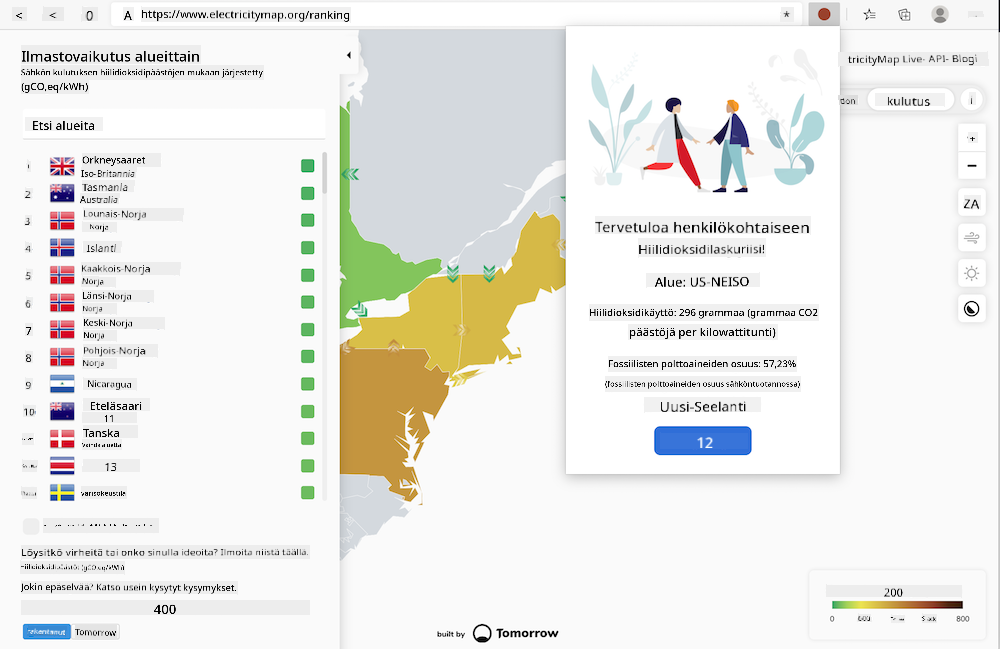

<!--
CO_OP_TRANSLATOR_METADATA:
{
  "original_hash": "9361268ca430b2579375009e1eceb5e5",
  "translation_date": "2025-08-27T20:53:15+00:00",
  "source_file": "5-browser-extension/solution/translation/README.fr.md",
  "language_code": "fi"
}
-->
# Carbon Trigger -selainlaajennus: Valmis koodi

Käyttämällä tmrow'n CO2 Signal -API:ta sähkönkulutuksen seuraamiseen, luo selainlaajennus, joka muistuttaa sinua suoraan selaimessasi alueesi sähkönkulutuksesta. Tämän ad hoc -laajennuksen käyttö auttaa sinua tekemään päätöksiä toimintasi suhteen näiden tietojen perusteella.



## Aloittaminen

Sinulla tulee olla [npm](https://npmjs.com) asennettuna. Lataa kopio tästä koodista tietokoneesi kansioon.

Asenna kaikki tarvittavat paketit:

```
npm install
```

Rakenna laajennus webpackilla

```
npm run build
```

Asentaaksesi laajennuksen Edge-selaimeen, käytä selaimen oikean yläkulman 'kolmen pisteen' valikkoa löytääksesi Laajennukset-paneelin. Valitse sieltä 'Lataa purkamaton laajennus' ladataksesi uuden laajennuksen. Avaa 'dist'-kansio kehotteessa, ja laajennus latautuu. Käyttääksesi laajennusta tarvitset API-avaimen CO2 Signal -API:lle ([hanki avain sähköpostitse täältä](https://www.co2signal.com/) - syötä sähköpostiosoitteesi sivun laatikkoon) sekä [alueesi koodin](http://api.electricitymap.org/v3/zones), joka vastaa [Electricity Map -karttaa](https://www.electricitymap.org/map) (esimerkiksi Bostonissa käytän 'US-NEISO').


Kun API-avain ja alue on syötetty laajennuksen käyttöliittymään, selaimen laajennuspalkin värillisen pisteen tulisi muuttua heijastamaan alueesi energiankulutusta ja antaa sinulle vihjeen siitä, millaisia energiaintensiivisiä toimintoja olisi sopivaa tehdä. Tämän 'pistejärjestelmän' konsepti on saanut inspiraationsa [Energy Lollipop -laajennuksesta](https://energylollipop.com/) Kalifornian päästöjen osalta.

---

**Vastuuvapauslauseke**:  
Tämä asiakirja on käännetty käyttämällä tekoälypohjaista käännöspalvelua [Co-op Translator](https://github.com/Azure/co-op-translator). Vaikka pyrimme tarkkuuteen, huomioithan, että automaattiset käännökset voivat sisältää virheitä tai epätarkkuuksia. Alkuperäinen asiakirja sen alkuperäisellä kielellä tulisi pitää ensisijaisena lähteenä. Kriittisen tiedon osalta suositellaan ammattimaista ihmiskäännöstä. Emme ole vastuussa väärinkäsityksistä tai virhetulkinnoista, jotka johtuvat tämän käännöksen käytöstä.