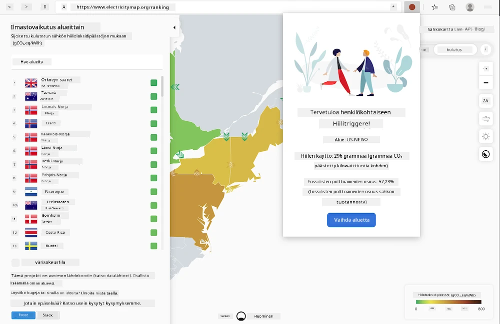
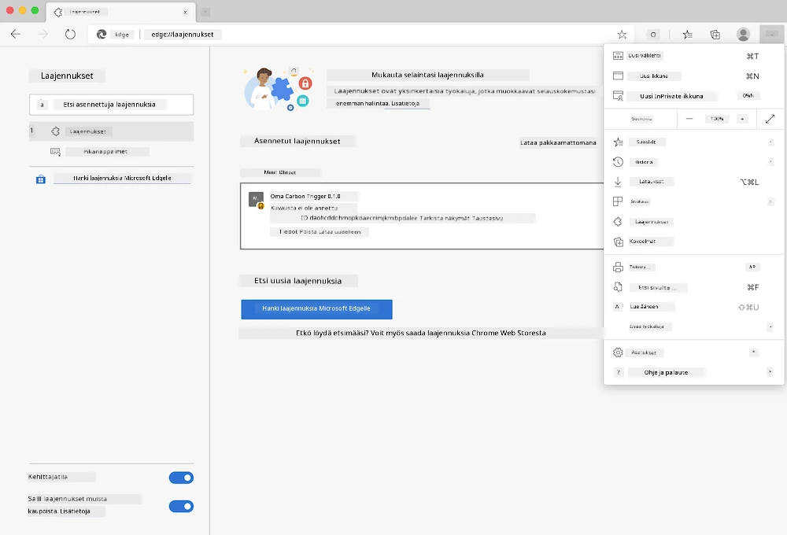

<!--
CO_OP_TRANSLATOR_METADATA:
{
  "original_hash": "3f5e6821e0febccfc5d05e7c944d9e3d",
  "translation_date": "2025-08-27T20:54:15+00:00",
  "source_file": "5-browser-extension/solution/translation/README.ja.md",
  "language_code": "fi"
}
-->
# Carbon Trigger - selainlaajennus: Valmis koodi

Rakennetaan selainlaajennus, joka käyttää tmrow:n CO2 Signal API:ta seuratakseen energiankulutusta ja näyttää muistutuksena, kuinka paljon sähköä alueellasi käytetään. Tämän laajennuksen avulla voit tehdä päätöksiä toiminnastasi tämän tiedon perusteella.



## Aloitus

Sinulla tulee olla [npm](https://npmjs.com) asennettuna. Lataa tämän koodin kopio tietokoneesi kansioon.

Asenna kaikki tarvittavat paketit.

```
npm install
```

Rakenna laajennus webpackin avulla.

```
npm run build
```

Asentaaksesi laajennuksen Edge-selaimeen, etsi selaimen oikeasta yläkulmasta "kolmen pisteen" valikosta "Laajennukset"-paneeli. Valitse sieltä "Load Unpacked" ja lataa uusi laajennus. Kun sinua kehotetaan, avaa "dist"-kansio, jolloin laajennus latautuu. Käyttääksesi laajennusta tarvitset CO2 Signal API:n API-avaimen ([hanki yksi sähköpostitse täältä](https://www.co2signal.com/) - syötä sähköpostisi tämän sivun laatikkoon) sekä [Electricity Map](https://www.electricitymap.org/map) -sivuston mukaisen [aluekoodin](http://api.electricitymap.org/v3/zones) (esimerkiksi Bostonissa käytetään 'US-NEISO').



Kun syötät API-avaimen ja aluekoodin laajennuksen käyttöliittymään, selainlaajennuspalkissa näkyvä värillinen piste muuttuu ja heijastaa alueesi energiankulutusta. Tämä auttaa sinua arvioimaan, millaisia energiaa vaativia toimintoja on sopivaa tehdä. Tämän "piste"-järjestelmän idea tuli minulle Kalifornian päästöjen [Energy Lollipop -laajennuksesta](https://energylollipop.com/).

---

**Vastuuvapauslauseke**:  
Tämä asiakirja on käännetty käyttämällä tekoälypohjaista käännöspalvelua [Co-op Translator](https://github.com/Azure/co-op-translator). Vaikka pyrimme tarkkuuteen, huomioithan, että automaattiset käännökset voivat sisältää virheitä tai epätarkkuuksia. Alkuperäinen asiakirja sen alkuperäisellä kielellä tulisi pitää ensisijaisena lähteenä. Kriittisen tiedon osalta suositellaan ammattimaista ihmiskäännöstä. Emme ole vastuussa väärinkäsityksistä tai virhetulkinnoista, jotka johtuvat tämän käännöksen käytöstä.