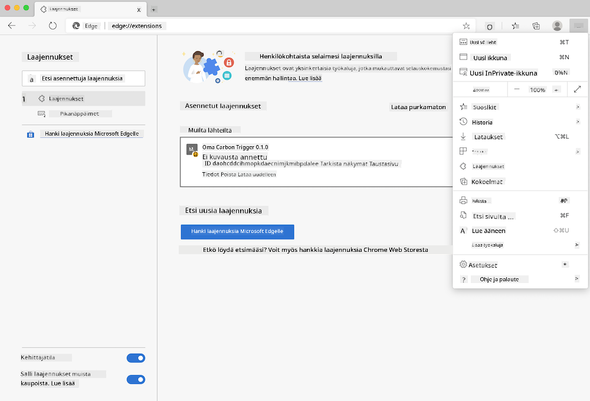

<!--
CO_OP_TRANSLATOR_METADATA:
{
  "original_hash": "21b364c158c8e4f698de65eeac16c9fe",
  "translation_date": "2025-08-27T20:52:48+00:00",
  "source_file": "5-browser-extension/solution/translation/README.ms.md",
  "language_code": "fi"
}
-->
# Carbon Trigger - Selaimen laajennus: Täydellinen koodi

Käyttämällä tmrow:n CO2 Signal -API:ta sähkönkulutuksen seuraamiseen, rakenna selaimen laajennus, joka antaa sinulle ilmoituksia siitä, kuinka raskasta alueesi sähkönkulutus on. Tämän laajennuksen käyttö auttaa sinua tekemään tietoisempia päätöksiä toiminnastasi näiden tietojen perusteella.


## Aloita tästä

Sinun täytyy asentaa [npm](https://npmjs.com). Lataa kopio tästä koodista tietokoneesi kansioon.

Asenna kaikki tarvittavat paketit:

```
npm install
```

Rakenna laajennus webpackilla:

```
npm run build
```

Asentaaksesi laajennuksen Edge-selaimeen, käytä selaimen oikeassa yläkulmassa olevaa "kolmen pisteen" valikkoa löytääksesi Laajennukset-paneelin. Valitse sieltä 'Load Unpacked' ladataksesi uuden laajennuksen. Avaa 'dist'-kansio pyynnön mukaisesti, ja laajennus latautuu. Käyttääksesi sitä tarvitset API-avaimen CO2 Signal -API:lle ([hanki avain sähköpostitse täältä](https://www.co2signal.com/) - syötä sähköpostiosoitteesi sivun laatikkoon) sekä [alueesi koodin](http://api.electricitymap.org/v3/zones), joka vastaa [Electricity Map](https://www.electricitymap.org/map) -karttaa (esimerkiksi Bostonissa käytän 'US-NEISO').



Kun API-avain ja aluekoodi on syötetty laajennuksen käyttöliittymään, selaimen laajennuspalkin värillinen piste muuttuu heijastamaan alueesi energiankulutusta ja antaa sinulle vihjeitä siitä, millaisia raskaita toimintoja kannattaa tehdä. Tämän "pistejärjestelmän" konsepti tuli minulle [Energy Lollipop -selaimen laajennuksesta](https://energylollipop.com/) Kalifornian päästöjen seuraamiseen.

---

**Vastuuvapauslauseke**:  
Tämä asiakirja on käännetty käyttämällä tekoälypohjaista käännöspalvelua [Co-op Translator](https://github.com/Azure/co-op-translator). Vaikka pyrimme tarkkuuteen, huomioithan, että automaattiset käännökset voivat sisältää virheitä tai epätarkkuuksia. Alkuperäinen asiakirja sen alkuperäisellä kielellä tulisi pitää ensisijaisena lähteenä. Kriittisen tiedon osalta suositellaan ammattimaista ihmiskäännöstä. Emme ole vastuussa väärinkäsityksistä tai virhetulkinnoista, jotka johtuvat tämän käännöksen käytöstä.