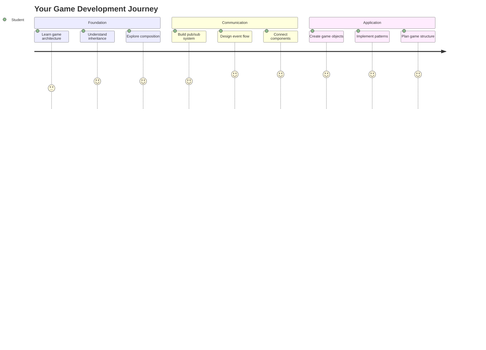
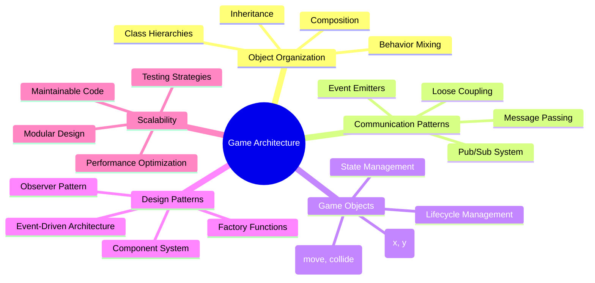
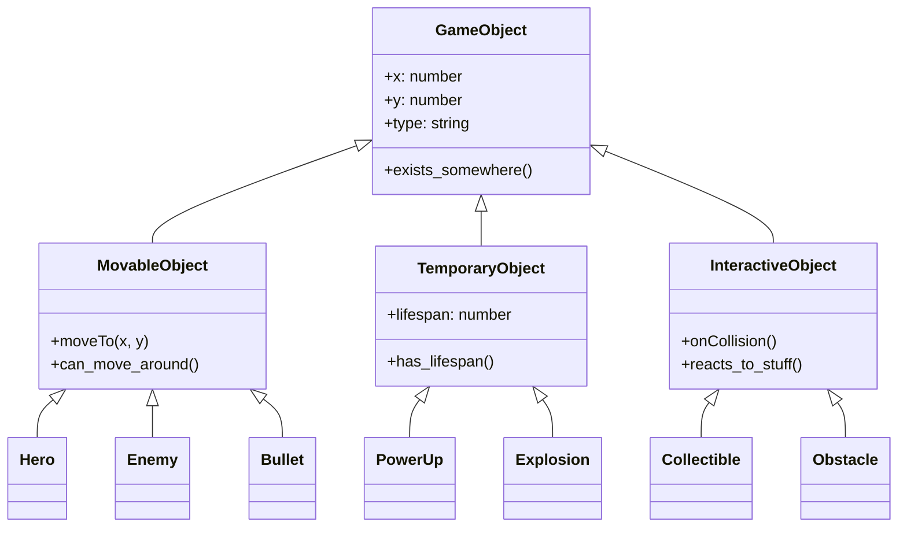
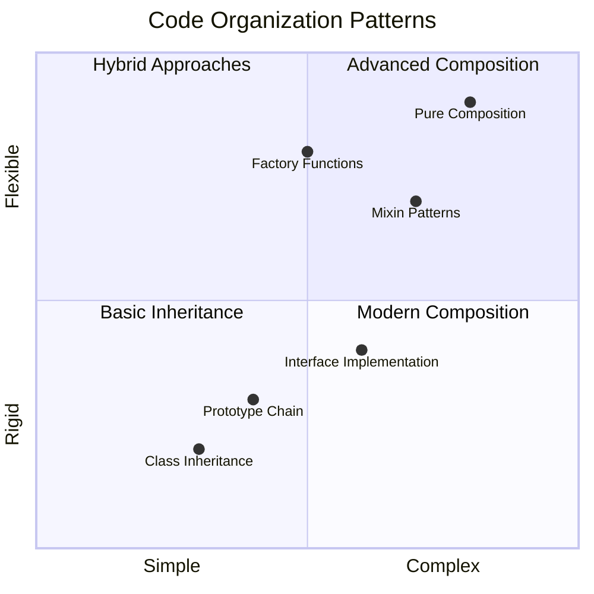
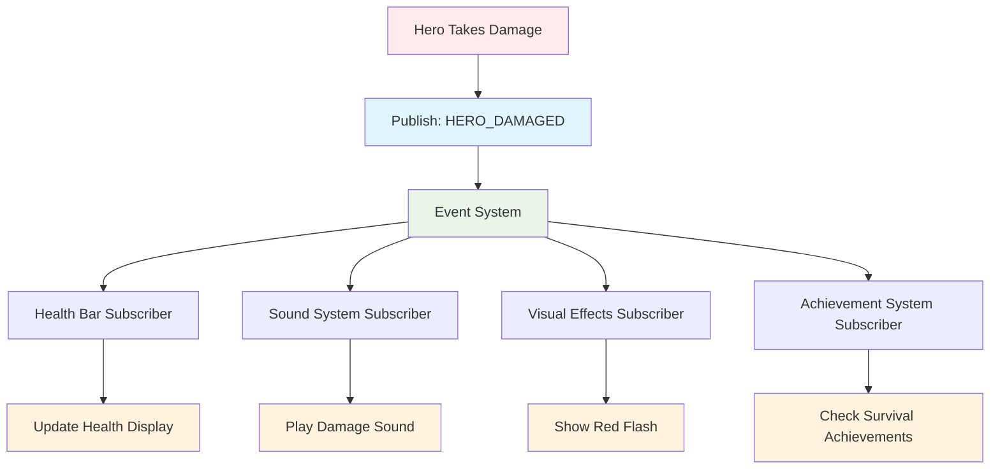
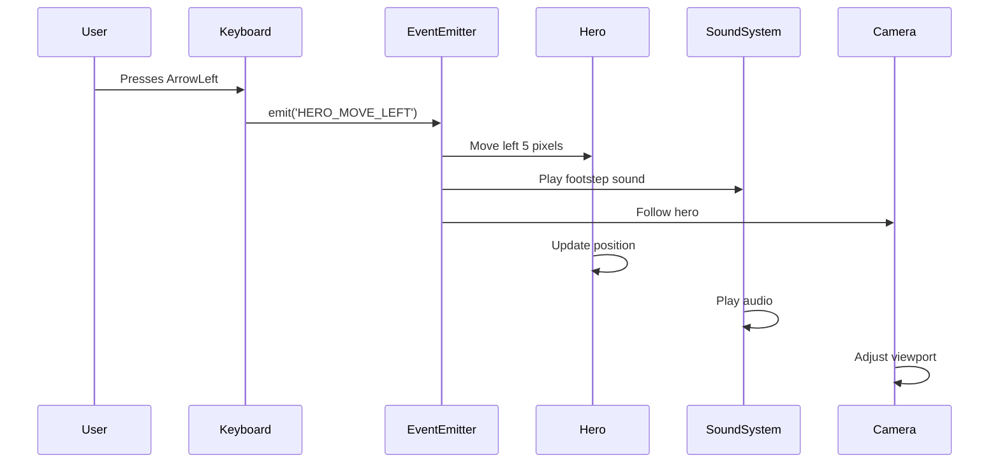
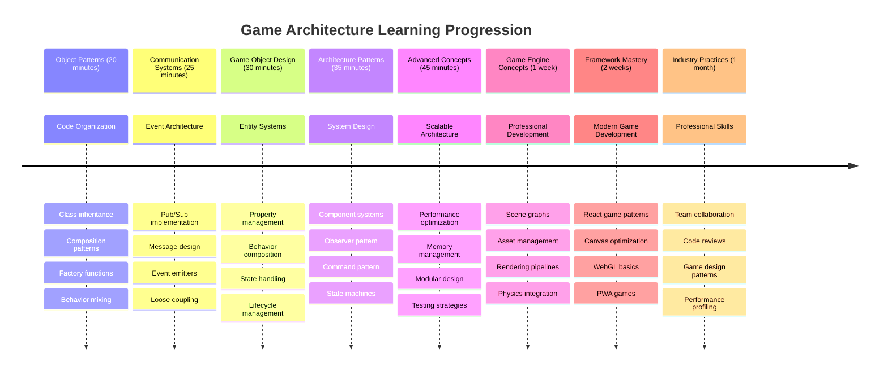

# Rakenna avaruuspeli Osa 1: Johdanto




Aivan kuten NASAn lennonjohto koordinoi useita järjestelmiä avaruuslähdön aikana, aiomme rakentaa avaruuspelin, joka havainnollistaa, kuinka ohjelman eri osat voivat toimia saumattomasti yhdessä. Luodessasi jotain, mitä voit oikeasti pelata, opit keskeisiä ohjelmointikonsepteja, jotka pätevät mihin tahansa ohjelmistoprojektiin.

Tutkimme kahta perustavanlaatuista lähestymistapaa koodin järjestämiseen: perintä ja koostaminen. Nämä eivät ole vain akateemisia käsitteitä – ne ovat samoja malleja, jotka pyörittävät kaikkea videopeleistä pankkijärjestelmiin. Toteutamme myös viestintäjärjestelmän nimeltä pub/sub, joka toimii kuten avaruusalusten viestintäverkot, mahdollistaen eri komponenttien tiedon jakamisen ilman riippuvuuksia.

Tämän sarjan lopussa ymmärrät, kuinka rakentaa sovelluksia, jotka voivat laajentua ja kehittyä – olipa kyseessä pelien, verkkosovellusten tai minkä tahansa muun ohjelmistojärjestelmän kehittäminen.



## Ennakkokysely

[Ennakkokysely](https://ff-quizzes.netlify.app/web/quiz/29)

## Perintä ja koostaminen pelikehityksessä

Kun projektit kasvavat monimutkaisemmiksi, koodin järjestäminen tulee kriittiseksi. Se, mikä alkaa yksinkertaisena skriptinä, voi muuttua vaikeasti ylläpidettäväksi ilman asianmukaista rakennetta – aivan kuten Apollo-lennot vaativat huolellista koordinointia tuhansien komponenttien välillä.

Tutkimme kahta perustavanlaatuista lähestymistapaa koodin järjestämiseen: perintä ja koostaminen. Molemmilla on omat etunsa, ja molempien ymmärtäminen auttaa valitsemaan oikean lähestymistavan eri tilanteisiin. Havainnollistamme näitä käsitteitä avaruuspelimme kautta, jossa sankarien, vihollisten, lisävoimien ja muiden objektien on toimittava tehokkaasti yhdessä.

✅ Yksi kuuluisimmista ohjelmointikirjoista käsittelee [suunnittelumalleja](https://en.wikipedia.org/wiki/Design_Patterns).

Missä tahansa pelissä on `pelin objekteja` – vuorovaikutteisia elementtejä, jotka täyttävät pelimaailman. Sankarit, viholliset, lisävoimat ja visuaaliset efektit ovat kaikki pelin objekteja. Jokainen niistä sijaitsee tietyissä näytön koordinaateissa käyttäen `x`- ja `y`-arvoja, aivan kuten pisteiden sijoittaminen koordinaatistoon.

Huolimatta visuaalisista eroista, näillä objekteilla on usein yhteisiä peruskäyttäytymisiä:

- **Ne sijaitsevat jossain** – Jokaisella objektilla on x- ja y-koordinaatit, jotta peli tietää, mihin se piirretään
- **Monet voivat liikkua** – Sankarit juoksevat, viholliset jahtaavat, luodit lentävät ruudun poikki
- **Niillä on elinkaari** – Jotkut pysyvät ikuisesti, toiset (kuten räjähdykset) ilmestyvät hetkeksi ja katoavat
- **Ne reagoivat asioihin** – Kun objektit törmäävät, lisävoimat kerätään, elämänpalkit päivittyvät

✅ Mieti peliä kuten Pac-Man. Voitko tunnistaa neljä yllä mainittua objektityyppiä tässä pelissä?



### Käyttäytymisen ilmaiseminen koodin kautta

Nyt kun ymmärrät pelin objektien yhteiset käyttäytymiset, tutkitaan, kuinka nämä käyttäytymiset voidaan toteuttaa JavaScriptissä. Voit ilmaista objektin käyttäytymistä menetelmien avulla, jotka liitetään joko luokkiin tai yksittäisiin objekteihin, ja valittavana on useita lähestymistapoja.

**Luokkapohjainen lähestymistapa**

Luokat ja perintä tarjoavat jäsennellyn lähestymistavan pelin objektien järjestämiseen. Kuten Carl Linnaeuksen kehittämä taksonominen luokittelujärjestelmä, aloitat perusluokalla, joka sisältää yhteiset ominaisuudet, ja luot sitten erikoistuneita luokkia, jotka perivät nämä perusominaisuudet ja lisäävät erityisiä kykyjä.

✅ Perintä on tärkeä käsite ymmärtää. Lue lisää [MDN:n artikkelista perinnästä](https://developer.mozilla.org/docs/Web/JavaScript/Inheritance_and_the_prototype_chain).

Näin voit toteuttaa pelin objektit käyttämällä luokkia ja perintää:

```javascript
// Step 1: Create the base GameObject class
class GameObject {
  constructor(x, y, type) {
    this.x = x;
    this.y = y;
    this.type = type;
  }
}
```

**Puretaan tämä vaihe vaiheelta:**
- Luomme perusmallin, jota jokainen pelin objekti voi käyttää
- Konstruktori tallentaa, missä objekti sijaitsee (`x`, `y`) ja minkä tyyppinen se on
- Tämä muodostaa perustan, jolle kaikki pelin objektit rakentuvat

```javascript
// Step 2: Add movement capability through inheritance
class Movable extends GameObject {
  constructor(x, y, type) {
    super(x, y, type); // Call parent constructor
  }

  // Add the ability to move to a new position
  moveTo(x, y) {
    this.x = x;
    this.y = y;
  }
}
```

**Yllä olemme:**
- **Laajentaneet** GameObject-luokkaa lisätäksemme liikkumistoiminnallisuutta
- **Kutsuneet** vanhemman konstruktorin käyttämällä `super()`-metodia perittyjen ominaisuuksien alustamiseen
- **Lisänneet** `moveTo()`-metodin, joka päivittää objektin sijainnin

```javascript
// Step 3: Create specific game object types
class Hero extends Movable {
  constructor(x, y) {
    super(x, y, 'Hero'); // Set type automatically
  }
}

class Tree extends GameObject {
  constructor(x, y) {
    super(x, y, 'Tree'); // Trees don't need movement
  }
}

// Step 4: Use your game objects
const hero = new Hero(0, 0);
hero.moveTo(5, 5); // Hero can move!

const tree = new Tree(10, 15);
// tree.moveTo() would cause an error - trees can't move
```

**Näiden käsitteiden ymmärtäminen:**
- **Luo** erikoistuneita objektityyppejä, jotka perivät sopivat käyttäytymiset
- **Havainnollistaa**, kuinka perintä mahdollistaa valikoivan ominaisuuksien sisällyttämisen
- **Näyttää**, että sankarit voivat liikkua, kun taas puut pysyvät paikallaan
- **Kuvastaa**, kuinka luokkahierarkia estää sopimattomat toiminnot

✅ Käytä muutama minuutti uudelleenkuvitellaksesi Pac-Man-sankarin (esim. Inky, Pinky tai Blinky) ja kuinka se kirjoitettaisiin JavaScriptissä.

**Koostamislähestymistapa**

Koostaminen noudattaa modulaarista suunnittelufilosofiaa, aivan kuten insinöörit suunnittelevat avaruusaluksia vaihdettavilla komponenteilla. Sen sijaan, että perittäisiin vanhemmalta luokalta, yhdistät tiettyjä käyttäytymisiä luodaksesi objekteja, joilla on juuri tarvittava toiminnallisuus. Tämä lähestymistapa tarjoaa joustavuutta ilman jäykkiä hierarkkisia rajoitteita.

```javascript
// Step 1: Create base behavior objects
const gameObject = {
  x: 0,
  y: 0,
  type: ''
};

const movable = {
  moveTo(x, y) {
    this.x = x;
    this.y = y;
  }
};
```

**Tämä koodi tekee seuraavaa:**
- **Määrittää** perus `gameObject`-objektin sijainti- ja tyyppiominaisuuksilla
- **Luo** erillisen `movable`-käyttäytymisobjektin liikkumistoiminnallisuudella
- **Erottaa** vastuut pitämällä sijaintitiedot ja liikkumislogiikan erillään

```javascript
// Step 2: Compose objects by combining behaviors
const movableObject = { ...gameObject, ...movable };

// Step 3: Create factory functions for different object types
function createHero(x, y) {
  return {
    ...movableObject,
    x,
    y,
    type: 'Hero'
  };
}

function createStatic(x, y, type) {
  return {
    ...gameObject,
    x,
    y,
    type
  };
}
```

**Yllä olemme:**
- **Yhdistäneet** perusobjektin ominaisuudet ja liikkumiskäyttäytymisen spread-syntaksilla
- **Luoneet** tehdasfunktioita, jotka palauttavat räätälöityjä objekteja
- **Mahdollistaneet** joustavan objektien luomisen ilman jäykkiä luokkahierarkioita
- **Antaneet** objekteille juuri ne käyttäytymiset, joita ne tarvitsevat

```javascript
// Step 4: Create and use your composed objects
const hero = createHero(10, 10);
hero.moveTo(5, 5); // Works perfectly!

const tree = createStatic(0, 0, 'Tree');
// tree.moveTo() is undefined - no movement behavior was composed
```

**Tärkeät asiat muistaa:**
- **Koostaa** objekteja sekoittamalla käyttäytymisiä perimisen sijaan
- **Tarjoaa** enemmän joustavuutta kuin jäykät perintähierarkiat
- **Mahdollistaa** objekteille juuri tarvittavat ominaisuudet
- **Käyttää** modernia JavaScriptin spread-syntaksia siistiin objektien yhdistämiseen
```

**Which Pattern Should You Choose?**

**Which Pattern Should You Choose?**



> 💡 **Vinkki**: Molemmilla malleilla on paikkansa modernissa JavaScript-kehityksessä. Luokat toimivat hyvin selkeästi määritellyissä hierarkioissa, kun taas koostaminen loistaa, kun tarvitaan maksimaalista joustavuutta.
> 
**Milloin käyttää kumpaakin lähestymistapaa:**
- **Valitse** perintä, kun sinulla on selkeitä "on-a" suhteita (sankari *on* liikkuva objekti)
- **Valitse** koostaminen, kun tarvitset "has-a" suhteita (sankari *omistaa* liikkumiskyvyn)
- **Harkitse** tiimisi mieltymyksiä ja projektin vaatimuksia
- **Muista**, että voit yhdistää molemmat lähestymistavat samassa sovelluksessa

### 🔄 **Pedagoginen tarkistus**
**Objektien järjestämisen ymmärtäminen**: Ennen siirtymistä viestintämalleihin, varmista, että osaat:
- ✅ Selittää perinnän ja koostamisen eron
- ✅ Tunnistaa, milloin käyttää luokkia vs tehdasfunktioita
- ✅ Ymmärtää, kuinka `super()`-avainsana toimii perinnässä
- ✅ Tunnistaa molempien lähestymistapojen edut pelikehityksessä

**Nopea itsekoe**: Kuinka loisit lentävän vihollisen, joka voi sekä liikkua että lentää?
- **Perintälähestymistapa**: `class FlyingEnemy extends Movable`
- **Koostamislähestymistapa**: `{ ...movable, ...flyable, ...gameObject }`

**Yhteys tosielämään**: Nämä mallit näkyvät kaikkialla:
- **React-komponentit**: Props (koostaminen) vs luokkaperintä
- **Pelimoottorit**: Entiteetti-komponenttijärjestelmät käyttävät koostamista
- **Mobiilisovellukset**: UI-kehykset käyttävät usein perintähierarkioita

## Viestintämallit: Pub/Sub-järjestelmä

Kun sovellukset kasvavat monimutkaisiksi, komponenttien välisen viestinnän hallinta muuttuu haastavaksi. Julkaisu-tilausmalli (pub/sub) ratkaisee tämän ongelman käyttämällä periaatteita, jotka muistuttavat radiolähetystä – yksi lähettäjä voi tavoittaa useita vastaanottajia tietämättä, kuka kuuntelee.

Ajattele, mitä tapahtuu, kun sankari ottaa vahinkoa: elämänpalkki päivittyy, äänitehosteet soivat, visuaalinen palaute ilmestyy. Sen sijaan, että sankariobjekti olisi suoraan kytketty näihin järjestelmiin, pub/sub mahdollistaa sankarin lähettämään "vahinkoa otettu" -viestin. Kaikki järjestelmät, jotka tarvitsevat reagoida, voivat tilata tämän viestityypin ja reagoida sen mukaisesti.

✅ **Pub/Sub** tarkoittaa 'julkaisu-tilaus'



### Pub/Sub-arkkitehtuurin ymmärtäminen

Pub/sub-malli pitää sovelluksen eri osat löyhästi kytkettyinä, mikä tarkoittaa, että ne voivat toimia yhdessä olematta suoraan riippuvaisia toisistaan. Tämä erottelu tekee koodistasi helpommin ylläpidettävää, testattavaa ja muutoksiin mukautuvaa.

**Pub/sub-mallin keskeiset osat:**
- **Viestit** – Yksinkertaisia tekstilappuja, kuten `'PLAYER_SCORED'`, jotka kuvaavat tapahtunutta (plus mahdolliset lisätiedot)
- **Julkaisijat** – Objektit, jotka huutavat "Jotain tapahtui!" kaikille kuuntelijoille
- **Tilaajat** – Objektit, jotka sanovat "Minua kiinnostaa tuo tapahtuma" ja reagoivat siihen
- **Tapahtumajärjestelmä** – Välikäsi, joka varmistaa, että viestit päätyvät oikeille kuuntelijoille

### Tapahtumajärjestelmän rakentaminen

Luodaan yksinkertainen mutta tehokas tapahtumajärjestelmä, joka havainnollistaa näitä käsitteitä:

```javascript
// Step 1: Create the EventEmitter class
class EventEmitter {
  constructor() {
    this.listeners = {}; // Store all event listeners
  }
  
  // Register a listener for a specific message type
  on(message, listener) {
    if (!this.listeners[message]) {
      this.listeners[message] = [];
    }
    this.listeners[message].push(listener);
  }
  
  // Send a message to all registered listeners
  emit(message, payload = null) {
    if (this.listeners[message]) {
      this.listeners[message].forEach(listener => {
        listener(message, payload);
      });
    }
  }
}
```

**Puretaan, mitä tässä tapahtuu:**
- **Luo** keskeisen tapahtumien hallintajärjestelmän yksinkertaisella luokalla
- **Tallentaa** kuuntelijat objektiin, joka on järjestetty viestityypin mukaan
- **Rekisteröi** uusia kuuntelijoita `on()`-metodin avulla
- **Lähettää** viestejä kaikille kiinnostuneille kuuntelijoille `emit()`-metodilla
- **Tukee** valinnaisia tietopaketteja olennaisen tiedon välittämiseksi

### Kaiken yhdistäminen: Käytännön esimerkki

Katsotaanpa, miten tämä toimii käytännössä! Rakennamme yksinkertaisen liikkumisjärjestelmän, joka näyttää, kuinka siisti ja joustava pub/sub voi olla:

```javascript
// Step 1: Define your message types
const Messages = {
  HERO_MOVE_LEFT: 'HERO_MOVE_LEFT',
  HERO_MOVE_RIGHT: 'HERO_MOVE_RIGHT',
  ENEMY_SPOTTED: 'ENEMY_SPOTTED'
};

// Step 2: Create your event system and game objects
const eventEmitter = new EventEmitter();
const hero = createHero(0, 0);
```

**Tämä koodi tekee seuraavaa:**
- **Määrittää** vakio-objektin estääkseen kirjoitusvirheet viestinimissä
- **Luo** tapahtumaemitterin käsittelemään kaikkea viestintää
- **Alustaa** sankariobjektin aloitussijainnissa

```javascript
// Step 3: Set up event listeners (subscribers)
eventEmitter.on(Messages.HERO_MOVE_LEFT, () => {
  hero.moveTo(hero.x - 5, hero.y);
  console.log(`Hero moved to position: ${hero.x}, ${hero.y}`);
});

eventEmitter.on(Messages.HERO_MOVE_RIGHT, () => {
  hero.moveTo(hero.x + 5, hero.y);
  console.log(`Hero moved to position: ${hero.x}, ${hero.y}`);
});
```

**Yllä olemme:**
- **Rekisteröineet** tapahtumakuuntelijat, jotka reagoivat liikkumisviesteihin
- **Päivittäneet** sankarin sijainnin liikkumissuunnan perusteella
- **Lisänneet** konsolilokituksen sankarin sijainnin muutosten seuraamiseksi
- **Erottaneet** liikkumislogiikan syötteen käsittelystä

```javascript
// Step 4: Connect keyboard input to events (publishers)
window.addEventListener('keydown', (event) => {
  switch(event.key) {
    case 'ArrowLeft':
      eventEmitter.emit(Messages.HERO_MOVE_LEFT);
      break;
    case 'ArrowRight':
      eventEmitter.emit(Messages.HERO_MOVE_RIGHT);
      break;
  }
});
```

**Näiden käsitteiden ymmärtäminen:**
- **Yhdistää** näppäimistön syötteen pelitapahtumiin ilman tiukkaa kytkentää
- **Mahdollistaa** syöttöjärjestelmän viestimisen pelin objekteille epäsuorasti
- **Sallii** useiden järjestelmien reagoida samoihin näppäimistötapahtumiin
- **Helpottaa** näppäinkomentojen muuttamista tai uusien syöttömenetelmien lisäämistä



> 💡 **Vinkki**: Tämän mallin kauneus on sen joustavuus! Voit helposti lisätä äänitehosteita, ruudun tärinää tai hiukkasefektejä yksinkertaisesti lisäämällä lisää tapahtumakuuntelijoita – ei tarvitse muokata olemassa olevaa näppäimistö- tai liikkumiskoodia.
> 
**Miksi rakastat tätä lähestymistapaa:**
- Uusien ominaisuuksien lisääminen on todella helppoa – kuuntele vain tapahtumia, jotka kiinnostavat sinua
- Useat asiat voivat reagoida samaan tapahtumaan ilman, että ne häiritsevät toisiaan
- Testaaminen on paljon yksinkertaisempaa, koska jokainen osa toimii itsenäisesti
- Kun jokin menee pieleen, tiedät tarkalleen, mistä etsiä

### Miksi Pub/Sub skaalautuu tehokkaasti

Pub/sub-malli säilyttää yksinkertaisuuden, kun sovellukset kasvavat monimutkaisiksi. Olipa kyseessä kymmenet viholliset, dynaamiset käyttöliittymäpäivitykset tai äänijärjestelmät, malli käsittelee kasvavaa skaalaa ilman arkkitehtuurimuutoksia. Uudet ominaisuudet integroituvat olemassa olevaan tapahtumajärjestelmään vaikuttamatta vakiintuneeseen toiminnallisuuteen.

> ⚠️ **Yleinen virhe**: Älä luo liian monta spesifistä viestityyppiä alussa. Aloita laajoilla kategorioilla ja tarkenna niitä pelin tarpeiden mukaan.
> 
**Parhaat käytännöt:**
- **Ryhmittele** liittyvät viestit loogisiin kategorioihin
- **Käytä** kuvaavia nimiä, jotka selkeästi ilmaisevat, mitä tapahtui
- **Pidä** viestien tietopaketit yksinkertaisina ja keskittyneinä
- **Dokumentoi** viestityypit tiimiyhteistyötä varten

### 🔄 **Pedagoginen tarkistus**
**Tapahtumapohjaisen arkkitehtuurin ymmärtäminen**: Varmista, että ymmärrät koko järjestelmän:
- ✅ Kuinka pub/sub-malli estää tiukan kytkennän komponenttien välillä?
- ✅ Miksi uusien ominaisuuksien lisääminen on helpompaa tapahtumapohjaisessa arkkitehtuurissa?
- ✅ Mikä rooli EventEmitterillä on viestintävirrassa?
- ✅ Kuinka viestivakiot estävät virheitä ja parantavat ylläpidettävyyttä?

**Suunnittelutehtävä**: Kuinka käsittelisit nä
Harkitse, kuinka pub-sub-malli voi parantaa pelin arkkitehtuuria. Tunnista, mitkä komponentit lähettävät tapahtumia ja miten järjestelmän tulisi reagoida. Suunnittele pelikonsepti ja kartoita viestintäkuviot sen komponenttien välillä.

## Luentojälkeinen kysely

[Luentojälkeinen kysely](https://ff-quizzes.netlify.app/web/quiz/30)

## Kertaus ja itseopiskelu

Opi lisää Pub/Sub-mallista [lukemalla siitä](https://docs.microsoft.com/azure/architecture/patterns/publisher-subscriber/?WT.mc_id=academic-77807-sagibbon).

### ⚡ **Mitä voit tehdä seuraavan 5 minuutin aikana**
- [ ] Avaa mikä tahansa HTML5-peli verkossa ja tarkastele sen koodia DevToolsilla
- [ ] Luo yksinkertainen HTML5 Canvas -elementti ja piirrä perusmuoto
- [ ] Kokeile käyttää `setInterval`-metodia yksinkertaisen animaatiosilmukan luomiseen
- [ ] Tutustu Canvas API -dokumentaatioon ja kokeile jotain piirrostapaa

### 🎯 **Mitä voit saavuttaa tunnin aikana**
- [ ] Suorita luentojälkeinen kysely ja ymmärrä pelinkehityksen peruskäsitteet
- [ ] Rakenna peliprojektin perusrakenne HTML-, CSS- ja JavaScript-tiedostoilla
- [ ] Luo yksinkertainen pelisilmukka, joka päivittää ja renderöi jatkuvasti
- [ ] Piirrä ensimmäiset pelispritet canvasille
- [ ] Toteuta perusresurssien lataus kuville ja äänille

### 📅 **Viikon mittainen pelin luominen**
- [ ] Viimeistele koko avaruuspeli kaikilla suunnitelluilla ominaisuuksilla
- [ ] Lisää viimeisteltyjä grafiikoita, äänitehosteita ja sulavia animaatioita
- [ ] Toteuta pelitilat (aloitusnäyttö, pelitila, pelin loppu)
- [ ] Luo pistelaskujärjestelmä ja pelaajan edistymisen seuranta
- [ ] Tee pelistä responsiivinen ja saavutettava eri laitteilla
- [ ] Jaa pelisi verkossa ja kerää palautetta pelaajilta

### 🌟 **Kuukauden mittainen pelinkehitys**
- [ ] Rakenna useita pelejä, joissa tutkitaan eri genrejä ja mekaniikkoja
- [ ] Opettele pelinkehityskehys, kuten Phaser tai Three.js
- [ ] Osallistu avoimen lähdekoodin pelinkehitysprojekteihin
- [ ] Hallitse edistyneitä peliohjelmointimalleja ja optimointia
- [ ] Luo portfolio, joka esittelee pelinkehitystaitojasi
- [ ] Mentoroi muita, jotka ovat kiinnostuneita pelinkehityksestä ja interaktiivisesta mediasta

## 🎯 Pelinkehityksen hallinnan aikajana



### 🛠️ Pelin arkkitehtuurityökalupakin yhteenveto

Tämän oppitunnin jälkeen sinulla on:
- **Suunnittelumallien hallinta**: Ymmärrys periytymisen ja koostamisen välisistä kompromisseista
- **Tapahtumapohjainen arkkitehtuuri**: Pub/sub-toteutus skaalautuvaan viestintään
- **Olio-ohjelmoinnin suunnittelu**: Luokkahierarkiat ja käyttäytymisen koostaminen
- **Moderni JavaScript**: Tehdasfunktiot, spread-syntaksi ja ES6+ -mallit
- **Skaalautuva arkkitehtuuri**: Löyhästi kytketyt ja modulaariset suunnitteluperiaatteet
- **Pelinkehityksen perusta**: Entiteettijärjestelmät ja komponenttimallit
- **Ammatilliset mallit**: Teollisuusstandardit koodin organisointiin

**Käytännön sovellukset**: Nämä mallit soveltuvat suoraan:
- **Frontend-kehykset**: React/Vue-komponenttiarkkitehtuuri ja tilanhallinta
- **Backend-palvelut**: Mikroservice-viestintä ja tapahtumapohjaiset järjestelmät
- **Mobiilikehitys**: iOS/Android-sovellusarkkitehtuuri ja ilmoitusjärjestelmät
- **Pelimoottorit**: Unity, Unreal ja verkkopohjainen pelinkehitys
- **Yritysohjelmistot**: Tapahtumalähteet ja hajautettujen järjestelmien suunnittelu
- **API-suunnittelu**: RESTful-palvelut ja reaaliaikainen viestintä

**Ammatilliset taidot**: Nyt osaat:
- **Suunnitella** skaalautuvia ohjelmistoarkkitehtuureja käyttäen todistettuja malleja
- **Toteuttaa** tapahtumapohjaisia järjestelmiä, jotka käsittelevät monimutkaisia vuorovaikutuksia
- **Valita** sopivia koodin organisointistrategioita eri tilanteisiin
- **Debugata** ja ylläpitää löyhästi kytkettyjä järjestelmiä tehokkaasti
- **Kommunikoida** teknisiä päätöksiä käyttäen teollisuusstandardin terminologiaa

**Seuraava taso**: Olet valmis toteuttamaan nämä mallit oikeassa pelissä, tutkimaan edistyneitä pelinkehityksen aiheita tai soveltamaan näitä arkkitehtuurikäsitteitä verkkosovelluksiin!

🌟 **Saavutus avattu**: Olet hallinnut ohjelmistoarkkitehtuurin perusmallit, jotka tukevat kaikkea yksinkertaisista peleistä monimutkaisiin yritysjärjestelmiin!

## Tehtävä

[Luonnostele peli](assignment.md)

---

**Vastuuvapauslauseke**:  
Tämä asiakirja on käännetty käyttämällä tekoälypohjaista käännöspalvelua [Co-op Translator](https://github.com/Azure/co-op-translator). Vaikka pyrimme tarkkuuteen, huomioithan, että automaattiset käännökset voivat sisältää virheitä tai epätarkkuuksia. Alkuperäistä asiakirjaa sen alkuperäisellä kielellä tulisi pitää ensisijaisena lähteenä. Tärkeissä tiedoissa suositellaan ammattimaista ihmiskäännöstä. Emme ole vastuussa väärinkäsityksistä tai virhetulkinnoista, jotka johtuvat tämän käännöksen käytöstä.