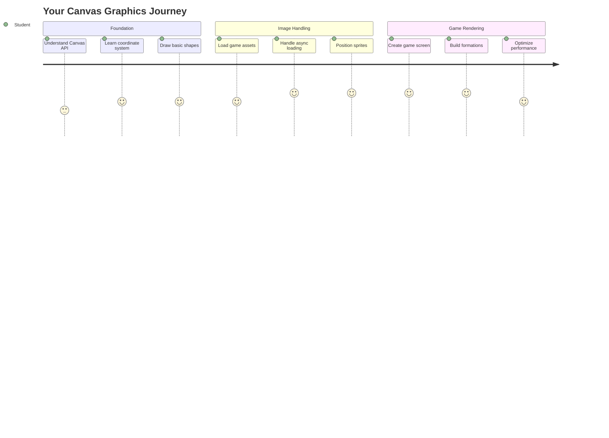
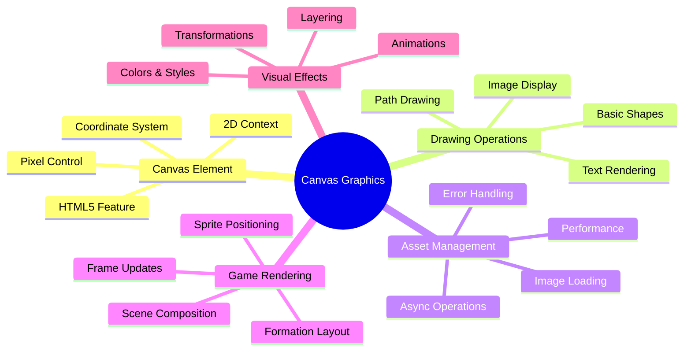
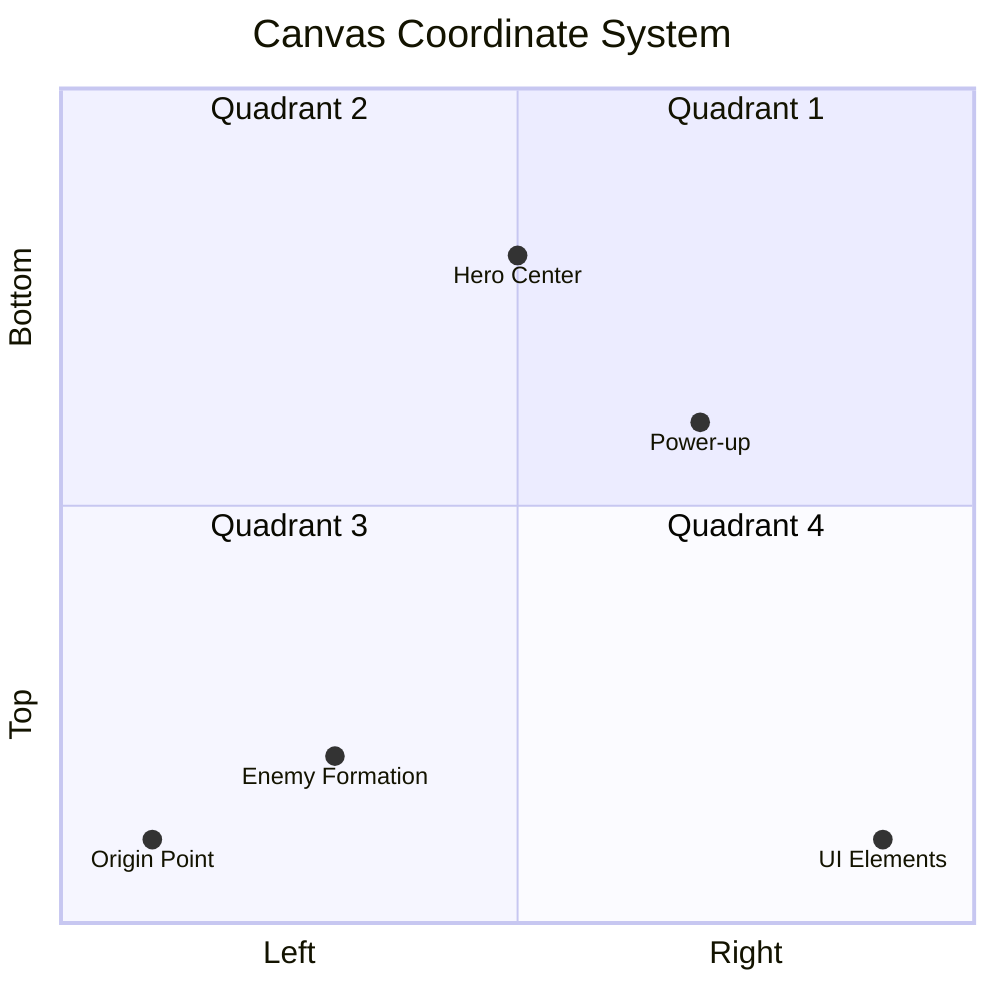
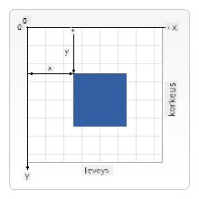
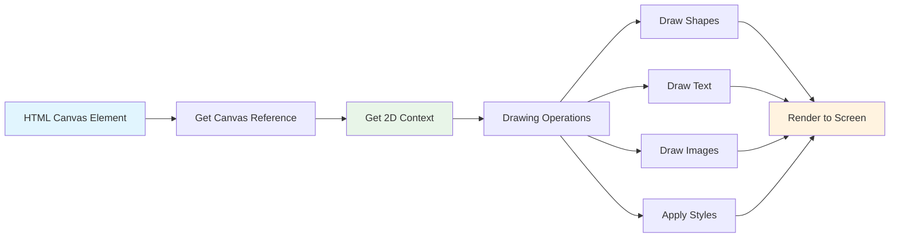
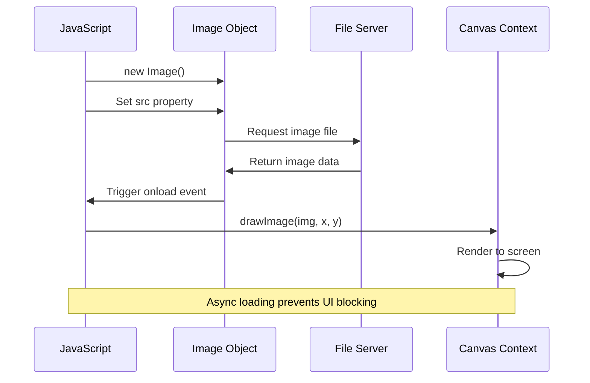
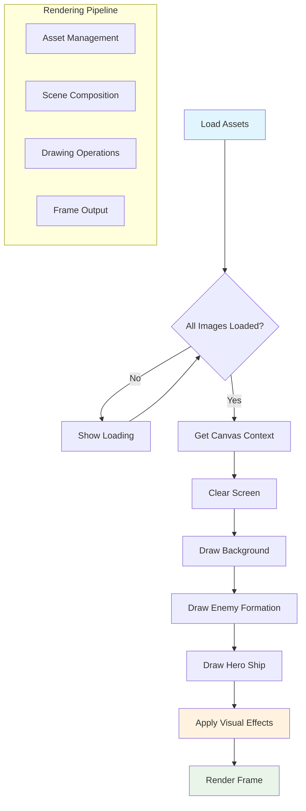
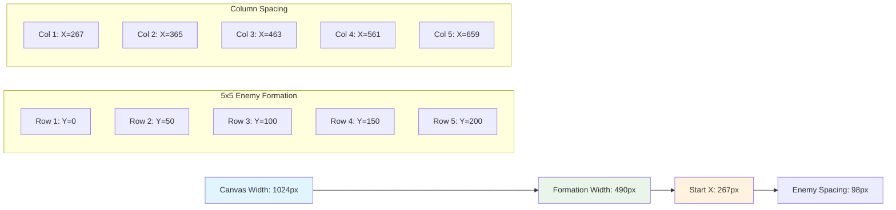
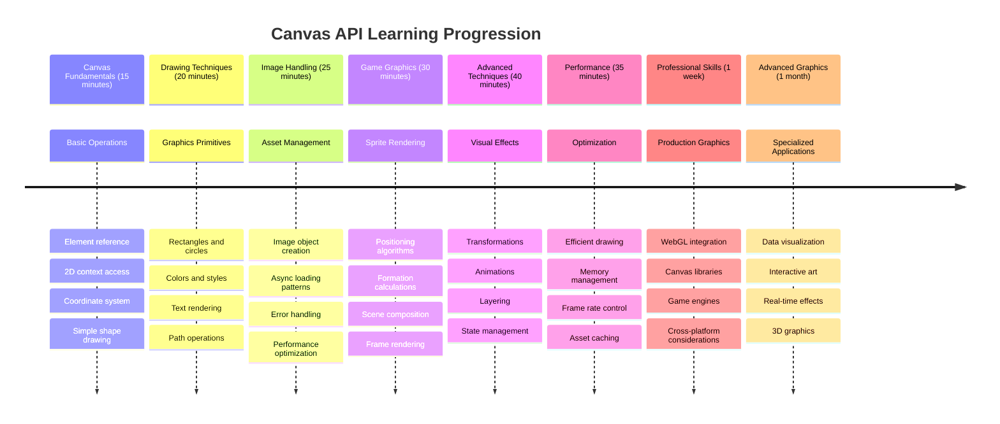

<!--
CO_OP_TRANSLATOR_METADATA:
{
  "original_hash": "7994743c5b21fdcceb36307916ef249a",
  "translation_date": "2025-11-04T01:39:23+00:00",
  "source_file": "6-space-game/2-drawing-to-canvas/README.md",
  "language_code": "fi"
}
-->
# Rakenna avaruuspeli osa 2: Piirrä sankari ja hirviöt kankaalle



Canvas API on yksi verkkokehityksen tehokkaimmista ominaisuuksista, joka mahdollistaa dynaamisten ja interaktiivisten grafiikoiden luomisen suoraan selaimessasi. Tässä osiossa muutamme tyhjän HTML `<canvas>` -elementin pelimaailmaksi, joka on täynnä sankareita ja hirviöitä. Ajattele canvasia digitaalisena tauluna, jossa koodi muuttuu visuaaliseksi.

Rakennamme aiemmin oppimasi päälle ja sukellamme nyt visuaalisiin elementteihin. Opit lataamaan ja näyttämään pelin spritejä, sijoittamaan elementtejä tarkasti ja luomaan visuaalisen perustan avaruuspelillesi. Tämä yhdistää staattiset verkkosivut ja dynaamiset, interaktiiviset kokemukset.

Tämän osion lopussa sinulla on valmis pelikohtaus, jossa sankarilaivasi on sijoitettu oikein ja vihollisjoukot valmiina taisteluun. Ymmärrät, miten modernit pelit renderöivät grafiikkaa selaimissa ja saat taitoja luoda omia interaktiivisia visuaalisia kokemuksia. Tutkitaan canvas-grafiikkaa ja herätetään avaruuspelisi eloon!



## Ennakkokysely

[Ennakkokysely](https://ff-quizzes.netlify.app/web/quiz/31)

## Canvas

Mikä tämä `<canvas>`-elementti oikeastaan on? Se on HTML5:n ratkaisu dynaamisten grafiikoiden ja animaatioiden luomiseen verkkoselaimissa. Toisin kuin tavalliset kuvat tai videot, jotka ovat staattisia, canvas antaa sinulle pikselitason hallinnan kaikesta, mitä näytöllä näkyy. Tämä tekee siitä täydellisen peleille, datavisualisoinneille ja interaktiiviselle taiteelle. Ajattele sitä ohjelmoitavana piirtoalustana, jossa JavaScript toimii siveltimenäsi.

Oletusarvoisesti canvas-elementti näyttää tyhjältä, läpinäkyvältä suorakulmiolta sivullasi. Mutta juuri tässä piilee sen potentiaali! Sen todellinen voima tulee esiin, kun käytät JavaScriptiä muotojen piirtämiseen, kuvien lataamiseen, animaatioiden luomiseen ja asioiden reagoimiseen käyttäjän vuorovaikutukseen. Se on samanlaista kuin varhaiset tietokonegrafiikan pioneerit Bell Labsissa 1960-luvulla, jotka ohjelmoivat jokaisen pikselin luodakseen ensimmäiset digitaaliset animaatiot.

✅ Lue [lisää Canvas API:sta](https://developer.mozilla.org/docs/Web/API/Canvas_API) MDN:ssä.

Näin se yleensä määritellään osana sivun bodya:

```html
<canvas id="myCanvas" width="200" height="100"></canvas>
```

**Mitä tämä koodi tekee:**
- **Asettaa** `id`-attribuutin, jotta voit viitata tähän tiettyyn canvas-elementtiin JavaScriptissä
- **Määrittää** leveyden pikseleinä hallitakseen canvasin vaakasuoraa kokoa
- **Asettaa** korkeuden pikseleinä määrittääkseen canvasin pystysuorat mitat

## Yksinkertaisten geometristen muotojen piirtäminen

Nyt kun tiedät, mikä canvas-elementti on, tutustutaan sen käyttöön piirtämisessä! Canvas käyttää koordinaattijärjestelmää, joka saattaa tuntua tutulta matematiikan tunneilta, mutta siinä on yksi tärkeä ero, joka liittyy tietokonegrafiikkaan.

Canvas käyttää kartesiolaista koordinaatistoa, jossa on x-akseli (vaakasuora) ja y-akseli (pystysuora) kaiken piirtämisen sijainnin määrittämiseen. Mutta tässä on tärkeä ero: toisin kuin matematiikan koordinaatistossa, alkuperäpiste `(0,0)` alkaa vasemmasta yläkulmasta, ja x-arvot kasvavat siirryttäessä oikealle ja y-arvot kasvavat siirryttäessä alaspäin. Tämä lähestymistapa juontaa juurensa varhaisiin tietokonenäyttöihin, joissa elektronisäteet skannasivat ylhäältä alas, tehden vasemmasta yläkulmasta luonnollisen lähtöpisteen.




> Kuva [MDN:stä](https://developer.mozilla.org/docs/Web/API/Canvas_API/Tutorial/Drawing_shapes)

Canvas-elementille piirtäminen noudattaa samaa kolmen vaiheen prosessia, joka muodostaa kaikkien canvas-grafiikoiden perustan. Kun teet tämän muutaman kerran, se muuttuu toiseksi luonteeksi:



1. **Hanki viittaus** canvas-elementtiisi DOM:sta (kuten mihin tahansa muuhun HTML-elementtiin)
2. **Hanki 2D-renderointikonteksti** – tämä tarjoaa kaikki piirtomenetelmät
3. **Aloita piirtäminen!** Käytä kontekstin sisäänrakennettuja menetelmiä grafiikan luomiseen

Näin tämä näyttää koodissa:

```javascript
// Step 1: Get the canvas element
const canvas = document.getElementById("myCanvas");

// Step 2: Get the 2D rendering context
const ctx = canvas.getContext("2d");

// Step 3: Set fill color and draw a rectangle
ctx.fillStyle = 'red';
ctx.fillRect(0, 0, 200, 200); // x, y, width, height
```

**Puretaan tämä vaihe vaiheelta:**
- **Haemme** canvas-elementtimme sen ID:n avulla ja tallennamme sen muuttujaan
- **Hankimme** 2D-renderointikontekstin – tämä on työkalupakkimme täynnä piirtomenetelmiä
- **Käskemme** canvasia täyttämään asiat punaisella käyttämällä `fillStyle`-ominaisuutta
- **Piirrämme** suorakulmion, joka alkaa vasemmasta yläkulmasta (0,0) ja on 200 pikseliä leveä ja korkea

✅ Canvas API keskittyy pääasiassa 2D-muotoihin, mutta voit myös piirtää 3D-elementtejä verkkosivulle; tätä varten voit käyttää [WebGL API:ta](https://developer.mozilla.org/docs/Web/API/WebGL_API).

Canvas API:lla voit piirtää kaikenlaisia asioita, kuten:

- **Geometrisia muotoja**, olemme jo näyttäneet, miten suorakulmio piirretään, mutta voit piirtää paljon muutakin.
- **Tekstiä**, voit piirtää tekstiä millä tahansa fontilla ja värillä.
- **Kuvia**, voit piirtää kuvan esimerkiksi .jpg- tai .png-tiedostosta.

✅ Kokeile! Tiedät, miten suorakulmio piirretään, osaatko piirtää ympyrän sivulle? Katso joitakin mielenkiintoisia Canvas-piirroksia CodePenissä. Tässä on [erityisen vaikuttava esimerkki](https://codepen.io/dissimulate/pen/KrAwx).

### 🔄 **Pedagoginen tarkistus**
**Canvasin perusteiden ymmärtäminen**: Ennen kuin siirryt kuvien lataamiseen, varmista, että osaat:
- ✅ Selittää, miten canvasin koordinaattijärjestelmä eroaa matemaattisista koordinaateista
- ✅ Ymmärtää kolmen vaiheen prosessin canvas-piirto-operaatioille
- ✅ Tunnistaa, mitä 2D-renderointikonteksti tarjoaa
- ✅ Kuvata, miten fillStyle ja fillRect toimivat yhdessä

**Nopea itsearviointi**: Miten piirtäisit sinisen ympyrän sijaintiin (100, 50) säteellä 25?
```javascript
ctx.fillStyle = 'blue';
ctx.beginPath();
ctx.arc(100, 50, 25, 0, 2 * Math.PI);
ctx.fill();
```

**Canvas-piirtomenetelmät, jotka nyt tunnet**:
- **fillRect()**: Piirtää täytettyjä suorakulmioita
- **fillStyle**: Asettaa värit ja kuviot
- **beginPath()**: Aloittaa uusia piirto-polkuja
- **arc()**: Luo ympyröitä ja kaaria

## Kuvan lataaminen ja piirtäminen

Perusmuotojen piirtäminen on hyödyllistä alkuun pääsemiseksi, mutta useimmat pelit tarvitsevat oikeita kuvia! Spritet, taustat ja tekstuurit antavat peleille niiden visuaalisen houkuttelevuuden. Kuvien lataaminen ja näyttäminen canvasilla toimii eri tavalla kuin geometristen muotojen piirtäminen, mutta se on yksinkertaista, kun ymmärrät prosessin.

Meidän täytyy luoda `Image`-objekti, ladata kuvatiedostomme (tämä tapahtuu asynkronisesti, eli "taustalla") ja sitten piirtää se canvasille, kun se on valmis. Tämä lähestymistapa varmistaa, että kuvasi näkyvät oikein estämättä sovellustasi latauksen aikana.



### Peruskuvan lataaminen

```javascript
const img = new Image();
img.src = 'path/to/my/image.png';
img.onload = () => {
  // Image loaded and ready to be used
  console.log('Image loaded successfully!');
};
```

**Mitä tässä koodissa tapahtuu:**
- **Luomme** aivan uuden Image-objektin spriteä tai tekstuuria varten
- **Käskemme** sitä lataamaan tietyn kuvatiedoston asettamalla lähdepolun
- **Kuuntelemme** lataustapahtumaa, jotta tiedämme tarkalleen, milloin kuva on valmis käytettäväksi

### Parempi tapa ladata kuvia

Tässä on ammattimaisempi tapa käsitellä kuvien lataamista, jota kehittäjät usein käyttävät. Kääritään kuvien lataaminen Promise-pohjaiseen funktioon – tämä lähestymistapa, joka yleistyi JavaScriptin Promises-standardin myötä ES6:ssa, tekee koodistasi järjestelmällisempää ja käsittelee virheitä sujuvasti:

```javascript
function loadAsset(path) {
  return new Promise((resolve, reject) => {
    const img = new Image();
    img.src = path;
    img.onload = () => {
      resolve(img);
    };
    img.onerror = () => {
      reject(new Error(`Failed to load image: ${path}`));
    };
  });
}

// Modern usage with async/await
async function initializeGame() {
  try {
    const heroImg = await loadAsset('hero.png');
    const monsterImg = await loadAsset('monster.png');
    // Images are now ready to use
  } catch (error) {
    console.error('Failed to load game assets:', error);
  }
}
```

**Mitä olemme tehneet tässä:**
- **Kääritty** kaikki kuvien latauslogiikka Promiseen, jotta voimme käsitellä sitä paremmin
- **Lisätty** virheenkäsittely, joka oikeasti kertoo, kun jokin menee pieleen
- **Käytetty** modernia async/await-syntaksia, koska se on niin paljon selkeämpää lukea
- **Sisällytetty** try/catch-lohkoja, jotta latausongelmat käsitellään sujuvasti

Kun kuvasi on ladattu, niiden piirtäminen canvasille on itse asiassa melko suoraviivaista:

```javascript
async function renderGameScreen() {
  try {
    // Load game assets
    const heroImg = await loadAsset('hero.png');
    const monsterImg = await loadAsset('monster.png');

    // Get canvas and context
    const canvas = document.getElementById("myCanvas");
    const ctx = canvas.getContext("2d");

    // Draw images to specific positions
    ctx.drawImage(heroImg, canvas.width / 2, canvas.height / 2);
    ctx.drawImage(monsterImg, 0, 0);
  } catch (error) {
    console.error('Failed to render game screen:', error);
  }
}
```

**Käydään tämä läpi vaihe vaiheelta:**
- **Lataamme** sekä sankari- että hirviökuvat taustalla käyttämällä awaitia
- **Haemme** canvas-elementtimme ja hankimme tarvittavan 2D-renderointikontekstin
- **Sijoitamme** sankarikuvan keskelle käyttämällä nopeaa koordinaattimatematiikkaa
- **Asetamme** hirviökuvan vasempaan yläkulmaan aloittaaksemme vihollisjoukon
- **Käsittelemme** mahdolliset virheet, jotka saattavat tapahtua latauksen tai renderoinnin aikana



## Nyt on aika aloittaa pelin rakentaminen

Nyt yhdistämme kaiken luodaksemme avaruuspelisi visuaalisen perustan. Sinulla on vahva ymmärrys canvasin perusteista ja kuvien lataustekniikoista, joten tämä käytännön osio opastaa sinut rakentamaan täydellisen pelinäytön, jossa spritet on sijoitettu oikein.

### Mitä rakentaa

Sinun tulee rakentaa verkkosivu, jossa on Canvas-elementti. Sen tulisi näyttää musta ruutu `1024*768`. Olemme antaneet sinulle kaksi kuvaa:

- Sankarilaiva

   

- 5*5 hirviöjoukko

   

### Suositellut kehitysvaiheet

Etsi aloitustiedostot, jotka on luotu sinulle `your-work`-alikansiossa. Projektirakenteesi tulisi sisältää:

```bash
your-work/
├── assets/
│   ├── enemyShip.png
│   └── player.png
├── index.html
├── app.js
└── package.json
```

**Tässä on, mitä sinulla on käytössäsi:**
- **Pelinspritet** sijaitsevat `assets/`-kansiossa, jotta kaikki pysyy järjestyksessä
- **Pää-HTML-tiedostosi** asettaa canvas-elementin ja valmistaa kaiken
- **JavaScript-tiedosto**, jossa kirjoitat kaiken pelin renderointitaikuuden
- **package.json**, joka asettaa kehityspalvelimen, jotta voit testata paikallisesti

Avaa tämä kansio Visual Studio Codessa aloittaaksesi kehityksen. Tarvitset paikallisen kehitysympäristön, jossa on Visual Studio Code, NPM ja Node.js asennettuna. Jos sinulla ei ole `npm`-asetuksia tietokoneellasi, [tässä ohjeet sen asentamiseen](https://www.npmjs.com/get-npm).

Käynnistä kehityspalvelimesi siirtymällä `your-work`-kansioon:

```bash
cd your-work
npm start
```

**Tämä komento tekee melko siistejä juttuja:**
- **Käynnistää** paikallisen palvelimen osoitteessa `http://localhost:5000`, jotta voit testata peliäsi
- **Palvelee** kaikki tiedostosi oikein, jotta selaimesi voi ladata ne oikein
- **Tarkkailee** tiedostojasi muutosten varalta, jotta voit kehittää sujuvasti
- **Tarjoaa** ammattimaisen kehitysympäristön kaiken testaamiseen

> 💡 **Huomio**: Selaimesi näyttää aluksi tyhjän sivun – se on odotettua! Kun lisäät koodia, päivitä selaimesi nähdäksesi muutokset. Tämä iteratiivinen kehitystapa on samanlainen kuin NASA:n Apollo-ohjaustietokoneen rakentaminen – testaten jokainen komponentti ennen sen integroimista suurempaan järjestelmään.

### Lisää koodi

Lisää tarvittava koodi `your-work/app.js`-tiedostoon suorittaaksesi seuraavat tehtävät:

1. **Piirrä canvas mustalla taustalla**
   > 💡 **Näin teet sen**: Etsi TODO `/app.js`-tiedostosta ja lisää vain kaksi riviä. Aseta `ctx.fillStyle` mustaksi, sitten käytä `ctx.fillRect()` alkaen (0,0) canvasin mittojen mukaan. Helppoa!

2. **Lataa pelin tekstuurit**
   > 💡 **Näin teet sen**: Käytä `await loadAsset()` ladataksesi pelaajan ja vihollisen kuvat. Tallenna ne muuttujiksi, jotta voit käyttää niitä myöhemmin. Muista – ne eivät näy ennen kuin oikeasti piirrät ne!

3. **Piirrä sankarilaiva keskelle alareunaan**
   > 💡 **Näin teet sen**: Käytä `ctx.drawImage()` sijoittaaksesi sankarisi. X-koordinaatille kokeile `canvas.width / 2 - 45` keskittämiseen ja y-koordinaatille käytä `canvas.height - canvas.height / 4` sijoittaaksesi sen ala-alueelle.

4. **Piirrä 5×5 vihollislaivojen muodostelma**
   > 💡 **Näin teet sen**: Etsi `createEnemies`-funktio ja aseta sisäkkäinen silmukka. Sinun täytyy tehdä hieman matematiikkaa tilan ja sijoittelun suhteen, mutta älä huoli – näytän sinulle tarkalleen, miten!

Ensin, määritä vakioita vihollisjoukon oikeaa asettelua varten:

```javascript
const ENEMY_TOTAL = 5;
const ENEMY_SPACING = 98;
const FORMATION_WIDTH = ENEMY_TOTAL * ENEMY_SPACING;
const START_X = (canvas.width - FORMATION_WIDTH) / 2;
const STOP_X = START_X + FORMATION_WIDTH;
```

**Puretaan, mitä nämä vakiot tekevät:**
- **Asetamme** 5 vihollista per rivi ja sarake (mukava 5×5 ruudukko)
- **Määritämme** kuinka paljon tilaa vihollisten väliin, jotta ne eivät näytä ahtailta
- **Laskemme** kuinka leveä koko muodostelma tulee olemaan
- **Selvitämme** mistä aloittaa ja lopettaa, jotta muodostelma näyttää keskitettyltä



Sitten, luo sisäkkäiset silmukat vihollisjoukon piirtämiseksi:

```javascript
for (let x = START_X; x < STOP_X; x += ENEMY_SPACING) {
  for (let y = 0; y < 50 * 5; y += 50) {
    ctx.drawImage(enemyImg, x, y);
  }
}
```

**Tässä on, mitä tämä sisäkkäinen silmukka tekee:**
- Ulompi silmukka **liikkuu** vasemmalta oikealle muodostelman läpi
- Sisempi silmukka **kulkee** ylhäältä alas luoden siistejä rivejä
- **Piirrämme** jokaisen vihollisspriten tarkalleen laskettuihin x,y-koordinaatteihin
- Kaikki pysyy **tasaisesti sijoitettuna**, jotta se näyttää ammattimaiselta ja järjestelmälliseltä

### 🔄 **Pedagoginen tarkistus**
**Pelin renderöinnin hallinta**: Varmista ymmärryksesi koko renderöintijärjestelmästä:
- ✅ Miten asynkroninen kuvien lataus estää käyttöliittymän estymisen pelin käynnistyessä?
- ✅ Miksi laskemme vihollisjoukon sijainnit vakioiden avulla emmekä kovakoodaa niitä?
- ✅ Mikä rooli 2D-renderointikontekstilla on piirto-operaatioissa?
- ✅ Miten sisäkkäiset silmukat luovat järjestelmällisiä sprite-muodostelmia?

**Suorituskykyhuomiot**: Pelisi nyt osoittaa:
- **Tehokasta resurssien latausta**: Promise-pohjainen kuvien hallinta
- **Järjestelmällistä renderöintiä**: Rakenteelliset piirto-operaatiot
- **Matemaattista sijoittelua**: L
- **Koordinaattijärjestelmät**: Matematiikan kääntäminen näytön sijainteihin
- **Sprite-hallinta**: Pelin grafiikan lataaminen ja näyttäminen
- **Muodostusalgoritmit**: Matemaattiset kuviot järjestettyihin asetteluihin
- **Asynkroniset operaatiot**: Moderni JavaScript sujuvaan käyttökokemukseen

## Tulos

Valmis tulos näyttää tältä:


## Ratkaisu

Yritä ratkaista itse ensin, mutta jos jäät jumiin, katso [ratkaisu](../../../../6-space-game/2-drawing-to-canvas/solution/app.js)

---

## GitHub Copilot Agent -haaste 🚀

Käytä Agent-tilaa suorittaaksesi seuraavan haasteen:

**Kuvaus:** Paranna avaruuspeliäsi lisäämällä visuaalisia tehosteita ja interaktiivisia elementtejä käyttäen oppimiasi Canvas API -tekniikoita.

**Tehtävä:** Luo uusi tiedosto nimeltä `enhanced-canvas.html`, jossa on canvas, joka näyttää animoituja tähtiä taustalla, sykkivän terveyspalkin sankarialukselle ja vihollisaluksia, jotka liikkuvat hitaasti alaspäin. Sisällytä JavaScript-koodi, joka piirtää välkkyviä tähtiä satunnaisilla sijainneilla ja opasiteetilla, toteuttaa terveyspalkin, joka vaihtaa väriä terveyden tason mukaan (vihreä > keltainen > punainen), ja animoi vihollisalukset liikkumaan eri nopeuksilla alaspäin.

Lue lisää [agent-tilasta](https://code.visualstudio.com/blogs/2025/02/24/introducing-copilot-agent-mode) täältä.

## 🚀 Haaste

Olet oppinut piirtämään 2D-keskeisellä Canvas API:lla; tutustu [WebGL API:iin](https://developer.mozilla.org/docs/Web/API/WebGL_API) ja yritä piirtää 3D-objekti.

## Luentojälkeinen kysely

[Luentojälkeinen kysely](https://ff-quizzes.netlify.app/web/quiz/32)

## Kertaus ja itseopiskelu

Lue lisää Canvas API:sta [täältä](https://developer.mozilla.org/docs/Web/API/Canvas_API).

### ⚡ **Mitä voit tehdä seuraavan 5 minuutin aikana**
- [ ] Avaa selaimen konsoli ja luo canvas-elementti `document.createElement('canvas')` avulla
- [ ] Kokeile piirtää suorakulmio käyttämällä `fillRect()` canvas-kontekstissa
- [ ] Kokeile eri värejä käyttämällä `fillStyle`-ominaisuutta
- [ ] Piirrä yksinkertainen ympyrä `arc()`-metodilla

### 🎯 **Mitä voit saavuttaa tämän tunnin aikana**
- [ ] Suorita luennon jälkeinen kysely ja ymmärrä canvasin perusteet
- [ ] Luo canvas-piirto-ohjelma, jossa on useita muotoja ja värejä
- [ ] Toteuta kuvien lataus ja spritejen renderöinti peliäsi varten
- [ ] Rakenna yksinkertainen animaatio, joka liikuttaa objekteja canvasilla
- [ ] Harjoittele canvas-muunnoksia, kuten skaalausta, kiertoa ja siirtoa

### 📅 **Viikon mittainen canvas-matka**
- [ ] Viimeistele avaruuspeli hiotuilla grafiikoilla ja sprite-animaatioilla
- [ ] Hallitse edistyneitä canvas-tekniikoita, kuten gradientteja, kuvioita ja yhdistämistä
- [ ] Luo interaktiivisia visualisointeja canvasilla datan esittämiseen
- [ ] Opettele canvasin optimointitekniikoita sujuvan suorituskyvyn saavuttamiseksi
- [ ] Rakenna piirustus- tai maalaussovellus erilaisilla työkaluilla
- [ ] Tutki luovaa koodausta ja generatiivista taidetta canvasilla

### 🌟 **Kuukauden mittainen grafiikkamestaruus**
- [ ] Rakenna monimutkaisia visuaalisia sovelluksia käyttäen Canvas 2D:tä ja WebGL:ää
- [ ] Opettele grafiikkaohjelmoinnin käsitteitä ja shaderien perusteita
- [ ] Osallistu avoimen lähdekoodin grafiikkakirjastoihin ja visualisointityökaluihin
- [ ] Hallitse suorituskyvyn optimointi grafiikkaintensiivisille sovelluksille
- [ ] Luo opetusmateriaalia canvas-ohjelmoinnista ja tietokonegrafiikasta
- [ ] Tule grafiikkaohjelmoinnin asiantuntijaksi, joka auttaa muita luomaan visuaalisia kokemuksia

## 🎯 Canvas-grafiikkamestaruuden aikajana



### 🛠️ Canvas-grafiikkatyökalujen yhteenveto

Tämän oppitunnin jälkeen sinulla on:
- **Canvas API -mestaruus**: Täydellinen ymmärrys 2D-grafiikkaohjelmoinnista
- **Koordinaattimatematiikka**: Tarkka sijainti- ja asettelualgoritmi
- **Resurssien hallinta**: Ammattimainen kuvien lataus ja virheenkäsittely
- **Renderöintiputki**: Jäsennelty lähestymistapa kohtauksen koostamiseen
- **Peligrafiikka**: Spritejen sijoittelu ja muodostuslaskelmat
- **Asynkroninen ohjelmointi**: Modernit JavaScript-mallit sujuvaan suorituskykyyn
- **Visuaalinen ohjelmointi**: Matemaattisten käsitteiden kääntäminen näytön grafiikaksi

**Käytännön sovellukset**: Canvas-taitosi soveltuvat suoraan:
- **Datan visualisointi**: Kaaviot, grafiikat ja interaktiiviset hallintapaneelit
- **Pelikehitys**: 2D-pelit, simulaatiot ja interaktiiviset kokemukset
- **Digitaalinen taide**: Luova koodaus ja generatiiviset taideprojektit
- **UI/UX-suunnittelu**: Räätälöidyt grafiikat ja interaktiiviset elementit
- **Opetussovellukset**: Visuaaliset oppimistyökalut ja simulaatiot
- **Web-sovellukset**: Dynaamiset grafiikat ja reaaliaikaiset visualisoinnit

**Ammatilliset taidot**: Nyt osaat:
- **Rakentaa** räätälöityjä grafiikkaratkaisuja ilman ulkoisia kirjastoja
- **Optimoida** renderöintisuorituskykyä sujuvan käyttökokemuksen saavuttamiseksi
- **Vianmäärittää** monimutkaisia visuaalisia ongelmia selaimen kehitystyökaluilla
- **Suunnitella** skaalautuvia grafiikkajärjestelmiä matemaattisten periaatteiden avulla
- **Integroi** Canvas-grafiikkaa moderneihin verkkosovelluskehyksiin

**Canvas API -menetelmät, jotka olet hallinnut**:
- **Elementtien hallinta**: getElementById, getContext
- **Piirto-operaatiot**: fillRect, drawImage, fillStyle
- **Resurssien lataus**: Kuvaobjektit, Promise-mallit
- **Matemaattinen sijoittelu**: Koordinaattilaskelmat, muodostusalgoritmit

**Seuraava taso**: Olet valmis lisäämään animaatiota, käyttäjäinteraktiota, törmäystunnistusta tai tutkimaan WebGL:ää 3D-grafiikkaa varten!

🌟 **Saavutus avattu**: Olet rakentanut täydellisen pelin renderöintijärjestelmän käyttäen Canvas API:n perustekniikoita!

## Tehtävä

[Kokeile Canvas API:ta](assignment.md)

---

**Vastuuvapauslauseke**:  
Tämä asiakirja on käännetty käyttämällä tekoälypohjaista käännöspalvelua [Co-op Translator](https://github.com/Azure/co-op-translator). Vaikka pyrimme tarkkuuteen, huomioithan, että automaattiset käännökset voivat sisältää virheitä tai epätarkkuuksia. Alkuperäinen asiakirja sen alkuperäisellä kielellä tulisi pitää ensisijaisena lähteenä. Kriittisen tiedon osalta suositellaan ammattimaista ihmiskäännöstä. Emme ole vastuussa väärinkäsityksistä tai virhetulkinnoista, jotka johtuvat tämän käännöksen käytöstä.