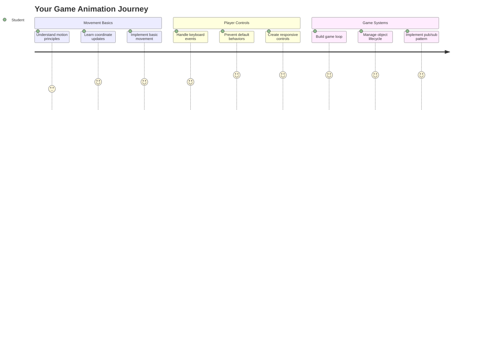
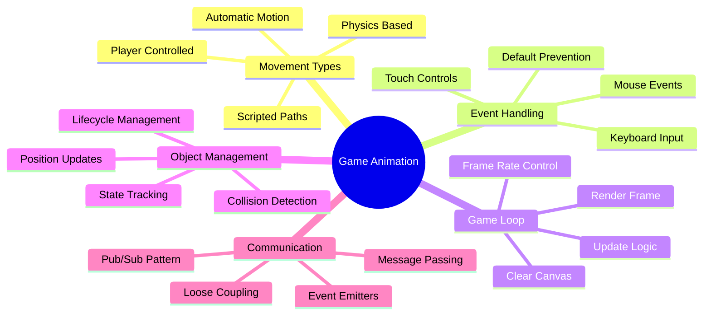
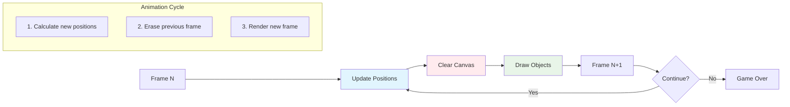
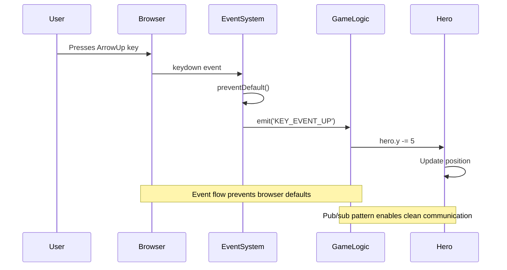
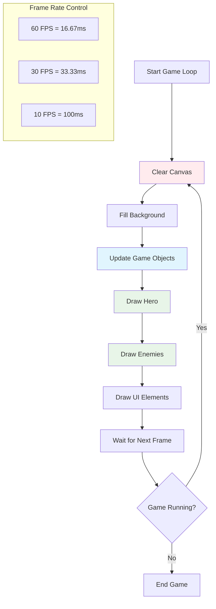
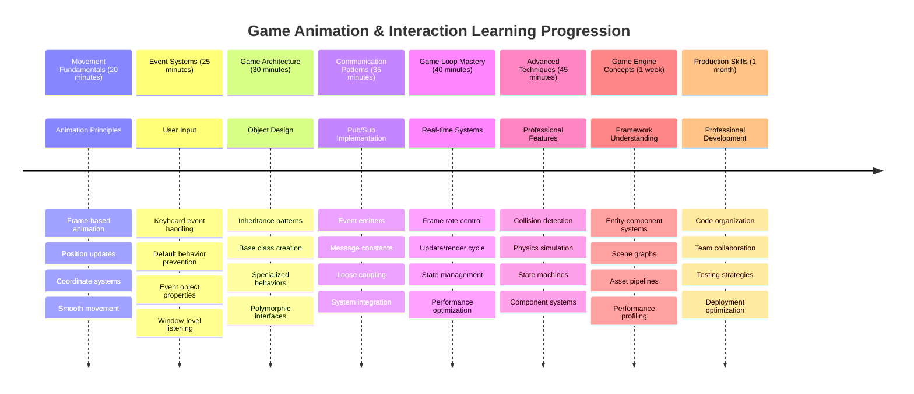

<!--
CO_OP_TRANSLATOR_METADATA:
{
  "original_hash": "8c55a2bd4bc0ebe4c88198fd563a9e09",
  "translation_date": "2025-11-04T01:38:27+00:00",
  "source_file": "6-space-game/3-moving-elements-around/README.md",
  "language_code": "fi"
}
-->
# Rakenna avaruuspeli osa 3: Liikkeen lisääminen



Ajattele suosikkipelejäsi – niiden kiehtovuus ei johdu pelkästään kauniista grafiikoista, vaan siitä, miten kaikki liikkuu ja reagoi toimintoihisi. Tällä hetkellä avaruuspelisi on kuin kaunis maalaus, mutta nyt lisäämme liikettä, joka herättää sen eloon.

Kun NASAn insinöörit ohjelmoivat Apollo-lentojen ohjaustietokoneen, he kohtasivat samanlaisen haasteen: miten saada avaruusalus reagoimaan pilotin syötteisiin samalla kun se automaattisesti korjaa kurssia? Tänään opimme periaatteita, jotka muistuttavat näitä samoja konsepteja – pelaajan ohjaaman liikkeen hallintaa yhdessä automaattisten järjestelmätoimintojen kanssa.

Tässä oppitunnissa opit, miten avaruusalukset liukuvat ruudulla, reagoivat pelaajan komentoihin ja luovat sulavia liikeratoja. Pilkomme kaiken hallittaviin osiin, jotka rakentuvat luonnollisesti toistensa päälle.

Lopuksi pelaajat voivat lennättää sankarialustaan ruudulla samalla kun vihollisalukset partioivat yläpuolella. Vielä tärkeämpää on, että ymmärrät peliliikettä ohjaavat keskeiset periaatteet.



## Ennakkokysely

[Ennakkokysely](https://ff-quizzes.netlify.app/web/quiz/33)

## Peliliikkeen ymmärtäminen

Pelit heräävät eloon, kun asiat alkavat liikkua, ja periaatteessa tämä tapahtuu kahdella tavalla:

- **Pelaajan ohjaama liike**: Kun painat näppäintä tai klikkaat hiirtä, jokin liikkuu. Tämä on suora yhteys sinun ja pelimaailman välillä.
- **Automaattinen liike**: Kun peli itse päättää liikuttaa asioita – kuten vihollisaluksia, jotka partioivat ruudulla riippumatta siitä, teetkö mitään.

Objektien liikuttaminen tietokoneruudulla on yksinkertaisempaa kuin luuletkaan. Muistatko matematiikan tunnilta x- ja y-koordinaatit? Juuri niiden kanssa työskentelemme täällä. Kun Galileo seurasi Jupiterin kuita vuonna 1610, hän teki pohjimmiltaan samaa – kartoitti sijainteja ajan kuluessa ymmärtääkseen liikeratoja.

Liikuttaminen ruudulla on kuin flipbook-animaation luomista – sinun täytyy noudattaa näitä kolmea yksinkertaista vaihetta:



1. **Päivitä sijainti** – Muuta objektin sijaintia (esimerkiksi siirrä sitä 5 pikseliä oikealle)
2. **Poista vanha ruutu** – Tyhjennä ruutu, jotta et näe haamujälkiä kaikkialla
3. **Piirrä uusi ruutu** – Aseta objektisi uuteen paikkaan

Tee tämä tarpeeksi nopeasti, ja voilà! Sinulla on sulava liike, joka tuntuu luonnolliselta pelaajille.

Tältä se voi näyttää koodissa:

```javascript
// Set the hero's location
hero.x += 5;
// Clear the rectangle that hosts the hero
ctx.clearRect(0, 0, canvas.width, canvas.height);
// Redraw the game background and hero
ctx.fillRect(0, 0, canvas.width, canvas.height);
ctx.fillStyle = "black";
ctx.drawImage(heroImg, hero.x, hero.y);
```

**Tämä koodi tekee seuraavaa:**
- **Päivittää** sankarin x-koordinaatin 5 pikselillä liikuttaakseen sitä vaakasuunnassa
- **Tyhjentää** koko kanvasalueen poistaakseen edellisen ruudun
- **Täyttää** kanvasalueen mustalla taustavärillä
- **Piirtää** sankarin kuvan sen uudessa sijainnissa

✅ Voitko keksiä syyn, miksi sankarin uudelleenpiirtäminen monta kertaa sekunnissa saattaisi aiheuttaa suorituskykyongelmia? Lue lisää [vaihtoehdoista tähän malliin](https://developer.mozilla.org/en-US/docs/Web/API/Canvas_API/Tutorial/Optimizing_canvas).

## Näppäimistötapahtumien käsittely

Tässä kohtaa yhdistämme pelaajan syötteen pelitoimintaan. Kun joku painaa välilyöntiä laukaistakseen laserin tai napauttaa nuolinäppäintä väistääkseen asteroidin, pelisi täytyy havaita ja reagoida tähän syötteeseen.

Näppäimistötapahtumat tapahtuvat ikkunatasolla, mikä tarkoittaa, että koko selaimen ikkuna kuuntelee näitä näppäinpainalluksia. Hiiren klikkaukset puolestaan voidaan sitoa tiettyihin elementteihin (kuten painikkeen klikkaamiseen). Avaruuspelissämme keskitymme näppäimistöohjaukseen, koska se antaa pelaajille klassisen arcade-tunnelman.

Tämä muistuttaa minua siitä, miten 1800-luvun lennätinoperaattorit joutuivat kääntämään morsekoodin syötteen merkityksellisiksi viesteiksi – teemme jotain vastaavaa, kääntäen näppäinpainallukset pelikomennoksi.

Tapahtuman käsittelemiseksi sinun täytyy käyttää ikkunan `addEventListener()`-metodia ja antaa sille kaksi syöteparametria. Ensimmäinen parametri on tapahtuman nimi, esimerkiksi `keyup`. Toinen parametri on funktio, joka tulisi kutsua tapahtuman tapahtuessa.

Tässä esimerkki:

```javascript
window.addEventListener('keyup', (evt) => {
  // evt.key = string representation of the key
  if (evt.key === 'ArrowUp') {
    // do something
  }
});
```

**Mitä tässä tapahtuu:**
- **Kuuntelee** näppäimistötapahtumia koko ikkunassa
- **Tallentaa** tapahtumaobjektin, joka sisältää tiedon siitä, mikä näppäin painettiin
- **Tarkistaa**, vastaako painettu näppäin tiettyä näppäintä (tässä tapauksessa ylänuolta)
- **Suorittaa** koodia, kun ehto täyttyy

Näppäintapahtumille on kaksi ominaisuutta, joiden avulla voit nähdä, mitä näppäintä painettiin:

- `key` - tämä on painetun näppäimen merkkijonoversio, esimerkiksi `'ArrowUp'`
- `keyCode` - tämä on numeroversio, esimerkiksi `37`, joka vastaa `ArrowLeft`

✅ Näppäintapahtumien käsittely on hyödyllistä myös pelikehityksen ulkopuolella. Mitä muita käyttötarkoituksia keksit tälle tekniikalle?



### Erikoisnäppäimet: huomio!

Joillakin näppäimillä on sisäänrakennettuja selaimen toimintoja, jotka voivat häiritä peliäsi. Nuolinäppäimet vierittävät sivua ja välilyönti hyppää alas – toimintoja, joita et halua, kun joku yrittää ohjata avaruusalustaan.

Voimme estää nämä oletustoiminnot ja antaa pelimme käsitellä syötteen sen sijaan. Tämä on samanlaista kuin miten varhaiset tietokoneohjelmoijat joutuivat ohittamaan järjestelmän keskeytykset luodakseen mukautettuja toimintoja – me teemme sen vain selaintasolla. Näin se tehdään:

```javascript
const onKeyDown = function (e) {
  console.log(e.keyCode);
  switch (e.keyCode) {
    case 37:
    case 39:
    case 38:
    case 40: // Arrow keys
    case 32:
      e.preventDefault();
      break; // Space
    default:
      break; // do not block other keys
  }
};

window.addEventListener('keydown', onKeyDown);
```

**Tämän estokoodin ymmärtäminen:**
- **Tarkistaa** tiettyjä näppäinkoodeja, jotka saattavat aiheuttaa ei-toivottua selaimen toimintaa
- **Estää** nuolinäppäinten ja välilyönnin oletustoiminnon
- **Sallii** muiden näppäinten toimia normaalisti
- **Käyttää** `e.preventDefault()`-metodia pysäyttääkseen selaimen sisäänrakennetun toiminnan

### 🔄 **Pedagoginen tarkistus**
**Tapahtumien käsittelyn ymmärtäminen**: Ennen siirtymistä automaattiseen liikkeeseen varmista, että osaat:
- ✅ Selittää eron `keydown`- ja `keyup`-tapahtumien välillä
- ✅ Ymmärtää, miksi estämme selaimen oletustoiminnot
- ✅ Kuvata, miten tapahtumankuuntelijat yhdistävät käyttäjän syötteen pelilogiikkaan
- ✅ Tunnistaa, mitkä näppäimet saattavat häiritä pelin ohjausta

**Nopea itsearviointi**: Mitä tapahtuisi, jos et estäisi nuolinäppäinten oletustoimintoa?
*Vastaus: Selaimen sivu vierisi, mikä häiritsisi pelin liikettä*

**Tapahtumajärjestelmän arkkitehtuuri**: Nyt ymmärrät:
- **Ikkunatasoinen kuuntelu**: Tapahtumien kaappaus selaintasolla
- **Tapahtumaobjektin ominaisuudet**: `key`-merkkijonot vs. `keyCode`-numerot
- **Oletustoiminnon estäminen**: Ei-toivottujen selaimen toimintojen pysäyttäminen
- **Ehtolauseet**: Reagointi tiettyihin näppäinyhdistelmiin

## Pelin aiheuttama liike

Puhutaan nyt objekteista, jotka liikkuvat ilman pelaajan syötettä. Ajattele vihollisaluksia, jotka risteilevät ruudulla, luoteja, jotka lentävät suoraan eteenpäin, tai taustalla leijuvia pilviä. Tämä autonominen liike saa pelimaailmasi tuntumaan elävältä, vaikka kukaan ei koskisi ohjaimiin.

Käytämme JavaScriptin sisäänrakennettuja ajastimia päivittääksemme sijainteja säännöllisin väliajoin. Tämä konsepti on samanlainen kuin heilurikellojen toiminta – säännöllinen mekanismi, joka laukaisee johdonmukaisia, ajastettuja toimintoja. Näin yksinkertaista se voi olla:

```javascript
const id = setInterval(() => {
  // Move the enemy on the y axis
  enemy.y += 10;
}, 100);
```

**Tämä liikkumiskoodi tekee seuraavaa:**
- **Luo** ajastimen, joka käynnistyy joka 100 millisekunti
- **Päivittää** vihollisen y-koordinaatin 10 pikselillä joka kerta
- **Tallentaa** intervallitunnuksen, jotta sen voi tarvittaessa pysäyttää myöhemmin
- **Liikuttaa** vihollista automaattisesti alaspäin ruudulla

## Pelisilmukka

Tässä on konsepti, joka sitoo kaiken yhteen – pelisilmukka. Jos pelisi olisi elokuva, pelisilmukka olisi filmiprojektori, joka näyttää ruutuja niin nopeasti, että kaikki näyttää liikkuvan sulavasti.

Jokaisessa pelissä on tällainen silmukka taustalla. Se on funktio, joka päivittää kaikki peliobjektit, piirtää ruudun uudelleen ja toistaa tämän prosessin jatkuvasti. Tämä pitää kirjaa sankaristasi, kaikista vihollisista, lentävistä lasereista – koko pelitilasta.

Tämä konsepti muistuttaa minua siitä, miten varhaiset animaattorit, kuten Walt Disney, joutuivat piirtämään hahmot ruutu ruudulta luodakseen liikkeen illuusion. Me teemme samaa, mutta koodilla kynien sijaan.

Tältä pelisilmukka yleensä näyttää koodissa:



```javascript
const gameLoopId = setInterval(() => {
  function gameLoop() {
    ctx.clearRect(0, 0, canvas.width, canvas.height);
    ctx.fillStyle = "black";
    ctx.fillRect(0, 0, canvas.width, canvas.height);
    drawHero();
    drawEnemies();
    drawStaticObjects();
  }
  gameLoop();
}, 200);
```

**Pelisilmukan rakenteen ymmärtäminen:**
- **Tyhjentää** koko kanvasalueen poistaakseen edellisen ruudun
- **Täyttää** taustan yhtenäisellä värillä
- **Piirtää** kaikki peliobjektit niiden nykyisiin sijainteihin
- **Toistaa** tämän prosessin joka 200 millisekunti luodakseen sulavan animaation
- **Hallinnoi** ruutunopeutta ohjaamalla intervalliaikaa

## Avaruuspeli jatkuu

Nyt lisäämme liikettä aiemmin rakentamaasi staattiseen kohtaukseen. Muutamme sen kuvakaappauksesta interaktiiviseksi kokemukseksi. Käymme tämän läpi askel askeleelta varmistaaksemme, että jokainen osa rakentuu edellisen päälle.

Hae koodi siitä, mihin jäimme edellisessä oppitunnissa (tai aloita koodilla [Osa II - aloitus](../../../../6-space-game/3-moving-elements-around/your-work) -kansiossa, jos tarvitset uuden aloituksen).

**Tätä rakennamme tänään:**
- **Sankarin ohjaus**: Nuolinäppäimillä ohjataan avaruusalusta ruudulla
- **Vihollisten liike**: Nuo avaruusolentojen alukset aloittavat etenemisensä

Aloitetaan näiden ominaisuuksien toteuttaminen.

## Suositellut vaiheet

Etsi tiedostot, jotka on luotu sinulle `your-work`-alikansioon. Sen pitäisi sisältää seuraavat:

```bash
-| assets
  -| enemyShip.png
  -| player.png
-| index.html
-| app.js
-| package.json
```

Aloita projektisi `your-work`-kansiossa kirjoittamalla:

```bash
cd your-work
npm start
```

**Mitä tämä komento tekee:**
- **Siirtyy** projektihakemistoosi
- **Käynnistää** HTTP-palvelimen osoitteessa `http://localhost:5000`
- **Palvelee** pelitiedostosi, jotta voit testata niitä selaimessa

Yllä oleva käynnistää HTTP-palvelimen osoitteessa `http://localhost:5000`. Avaa selain ja syötä kyseinen osoite, tällä hetkellä sen pitäisi näyttää sankari ja kaikki viholliset; mikään ei kuitenkaan vielä liiku!

### Lisää koodia

1. **Lisää omistetut objektit** `hero`, `enemy` ja `game object` -tyypeille, joilla tulisi olla `x`- ja `y`-ominaisuudet. (Muista osio [Periytyminen tai koostumus](../README.md)).

   *VINKKI* `game object` tulisi olla se, jolla on `x`- ja `y`-ominaisuudet sekä kyky piirtää itsensä kanvakseen.

   > **Vinkki**: Aloita lisäämällä uusi `GameObject`-luokka, jonka konstruktori on määritelty alla, ja piirrä se sitten kanvakseen:

    ```javascript
    class GameObject {
      constructor(x, y) {
        this.x = x;
        this.y = y;
        this.dead = false;
        this.type = "";
        this.width = 0;
        this.height = 0;
        this.img = undefined;
      }
    
      draw(ctx) {
        ctx.drawImage(this.img, this.x, this.y, this.width, this.height);
      }
    }
    ```

    **Tämän perusluokan ymmärtäminen:**
    - **Määrittää** yhteiset ominaisuudet, jotka kaikki peliobjektit jakavat (sijainti, koko, kuva)
    - **Sisältää** `dead`-lipun, joka seuraa, pitäisikö objekti poistaa
    - **Tarjoaa** `draw()`-metodin, joka piirtää objektin kanvakseen
    - **Asettaa** oletusarvot kaikille ominaisuuksille, joita lapsiluokat voivat ohittaa

    ```mermaid
    classDiagram
        class GameObject {
            +x: number
            +y: number
            +dead: boolean
            +type: string
            +width: number
            +height: number
            +img: Image
            +draw(ctx)
        }
        
        class Hero {
            +speed: number
            +type: "Hero"
            +width: 98
            +height: 75
        }
        
        class Enemy {
            +type: "Enemy"
            +width: 98
            +height: 50
            +setInterval()
        }
        
        GameObject <|-- Hero
        GameObject <|-- Enemy
        
        class EventEmitter {
            +listeners: object
            +on(message, listener)
            +emit(message, payload)
        }
    ```

    Nyt laajenna tätä `GameObject`-luokkaa luodaksesi `Hero` ja `Enemy`:
    
    ```javascript
    class Hero extends GameObject {
      constructor(x, y) {
        super(x, y);
        this.width = 98;
        this.height = 75;
        this.type = "Hero";
        this.speed = 5;
      }
    }
    ```

    ```javascript
    class Enemy extends GameObject {
      constructor(x, y) {
        super(x, y);
        this.width = 98;
        this.height = 50;
        this.type = "Enemy";
        const id = setInterval(() => {
          if (this.y < canvas.height - this.height) {
            this.y += 5;
          } else {
            console.log('Stopped at', this.y);
            clearInterval(id);
          }
        }, 300);
      }
    }
    ```

    **Näiden luokkien keskeiset käsitteet:**
    - **Perii** `GameObject`-luokasta käyttäen `extends`-avainsanaa
    - **Kutsuu** vanhemman konstruktorin `super(x, y)`-koodilla
    - **Asettaa** erityiset mitat ja ominaisuudet kullekin objektityypille
    - **Toteuttaa** automaattisen liikkeen vihollisille käyttäen `setInterval()`

2. **Lisää näppäintapahtumien käsittelijät** ohjaamaan sankaria (liikuta sankaria ylös/alas vasemmalle/oikealle)

   *MUISTA*, että kyseessä on kartesiolainen järjestelmä, vasen yläkulma on `0,0`. Muista myös lisätä koodi oletustoiminnon estämiseksi.

   > **Vinkki**: Luo `onKeyDown`-funktiosi ja liitä se ikkunaan:

   ```javascript
   const onKeyDown = function (e) {
     console.log(e.keyCode);
     // Add the code from the lesson above to stop default behavior
     switch (e.keyCode) {
       case 37:
       case 39:
       case 38:
       case 40: // Arrow keys
       case 32:
         e.preventDefault();
         break; // Space
       default:
         break; // do not block other keys
     }
   };

   window.addEventListener("keydown", onKeyDown);
   ```
    
   **Mitä tämä tapahtumankäsittelijä tekee:**
   - **Kuuntelee** näppäinten painalluksia koko ikkunassa
   - **Kirjaa** näppäinkoodin auttaakseen sinua selvittämään, mitä näppäimiä painetaan
   - **Estää** nuolinäppäinten ja välilyönnin oletustoiminnon
   - **Sallii** muiden näppäinten toimia normaalisti
   
   Tarkista selaimesi konsoli tässä vaiheessa ja katso, kuinka näppäinpainallukset kirjautuvat.

3. **Toteuta** [Pub sub -malli](../README.md), tämä pitää koodisi siistinä, kun seuraat jäljellä olevia osia.

   Publish-Subscribe-malli auttaa järjestämään koodisi erottamalla tapahtumien havaitsemisen niiden käsittelystä. Tämä tekee koodistasi modulaarisemman ja helpommin ylläpidettävän.

   Tämän viimeisen osan tekemiseksi voit:

   1. **Lisätä tapahtumankuuntelijan** ikkunaan:

       ```javascript
       window.addEventListener("keyup", (evt) => {
         if (evt.key === "ArrowUp") {
           eventEmitter.emit(Messages.KEY_EVENT_UP);
         } else if (evt.key === "ArrowDown") {
           eventEmitter.emit(Messages.KEY_EVENT_DOWN);
         } else if (evt.key === "ArrowLeft") {
           eventEmitter.emit(Messages.KEY_EVENT_LEFT);
         } else if (evt.key === "ArrowRight") {
           eventEmitter.emit(Messages.KEY_EVENT_RIGHT);
         }
       });
       ```

   **Mitä tämä tapahtumajärjestelmä tekee:**
   - **Havaitsee** näppäimistön syötteen ja muuntaa sen mukautetuiksi pelitapahtumiksi
   - **Erottaa** syötteen havaitsemisen pelilogiikasta
   - **Helpottaa** ohjainten muuttamista myöhemmin vaikuttamatta pelin koodiin
   - **Mahdollistaa**, että useat järjestelmät voivat reagoida samaan syötteeseen

   ```mermaid
   flowchart TD
       A["Keyboard Input"] --> B["Window Event Listener"]
       B --> C["Event Emitter"]
       C --> D["KEY_EVENT_UP"]
       C --> E["KEY_EVENT_DOWN"]
       C --> F["KEY_EVENT_LEFT"]
       C --> G["KEY_EVENT_RIGHT"]
       
       D --> H["Hero Movement"]
       D --> I["Sound System"]
       D --> J["Visual Effects"]
       
       E --> H
       F --> H
       G --> H
       
       style A fill:#e1f5fe
       style C fill:#e8f5e8
       style H fill:#fff3e0
   ```

   2. **Luo EventEmitter-luokka** viestien julkaisemista ja tilaamista varten:

       ```javascript
       class EventEmitter {
         constructor() {
           this.listeners = {};
         }
       
         on(message, listener) {
           if (!this.listeners[message]) {
             this.listeners[message] = [];
           }
           this.listeners[message].push(listener);
         }
       
   3. **Lisää vakioita** ja aseta EventEmitter:

       ```javascript
       const Messages = {
         KEY_EVENT_UP: "KEY_EVENT_UP",
         KEY_EVENT_DOWN: "KEY_EVENT_DOWN",
         KEY_EVENT_LEFT: "KEY_EVENT_LEFT",
         KEY_EVENT_RIGHT: "KEY_EVENT_RIGHT",
       };
       
       let heroImg, 
           enemyImg, 
           laserImg,
           canvas, ctx, 
           gameObjects = [], 
           hero, 
           eventEmitter = new EventEmitter();
       ```

   **Ymmärrä asetukset:**
   - **M
   - **Alustaa** taulukon kaikkien pelin objektien tallentamista varten

   4. **Alusta peli**

       ```javascript
       function initGame() {
         gameObjects = [];
         createEnemies();
         createHero();
       
         eventEmitter.on(Messages.KEY_EVENT_UP, () => {
           hero.y -= 5;
         });
       
         eventEmitter.on(Messages.KEY_EVENT_DOWN, () => {
           hero.y += 5;
         });
       
         eventEmitter.on(Messages.KEY_EVENT_LEFT, () => {
           hero.x -= 5;
         });
       
4. **Aseta pelisilmukka**

   Refaktoroi `window.onload` -funktio alustamaan peli ja asettamaan pelisilmukka sopivalla aikavälillä. Lisää myös laser-säde:

    ```javascript
    window.onload = async () => {
      canvas = document.getElementById("canvas");
      ctx = canvas.getContext("2d");
      heroImg = await loadTexture("assets/player.png");
      enemyImg = await loadTexture("assets/enemyShip.png");
      laserImg = await loadTexture("assets/laserRed.png");
    
      initGame();
      const gameLoopId = setInterval(() => {
        ctx.clearRect(0, 0, canvas.width, canvas.height);
        ctx.fillStyle = "black";
        ctx.fillRect(0, 0, canvas.width, canvas.height);
        drawGameObjects(ctx);
      }, 100);
    };
    ```

   **Peliasetusten ymmärtäminen:**
   - **Odottaa**, että sivu latautuu kokonaan ennen aloittamista
   - **Hakee** canvas-elementin ja sen 2D-renderointikontekstin
   - **Lataa** kaikki kuvatiedostot asynkronisesti käyttäen `await`
   - **Käynnistää** pelisilmukan, joka pyörii 100ms välein (10 FPS)
   - **Tyhjentää** ja piirtää koko näytön uudelleen jokaisella ruudulla

5. **Lisää koodi**, joka liikuttaa vihollisia tietyin välein

    Refaktoroi `createEnemies()` -funktio luomaan viholliset ja lisäämään ne uuteen gameObjects-luokkaan:

    ```javascript
    function createEnemies() {
      const MONSTER_TOTAL = 5;
      const MONSTER_WIDTH = MONSTER_TOTAL * 98;
      const START_X = (canvas.width - MONSTER_WIDTH) / 2;
      const STOP_X = START_X + MONSTER_WIDTH;
    
      for (let x = START_X; x < STOP_X; x += 98) {
        for (let y = 0; y < 50 * 5; y += 50) {
          const enemy = new Enemy(x, y);
          enemy.img = enemyImg;
          gameObjects.push(enemy);
        }
      }
    }
    ```

    **Mitä vihollisten luonti tekee:**
    - **Laskee** sijainnit keskittääkseen viholliset näytölle
    - **Luo** vihollisten ruudukon käyttäen sisäkkäisiä silmukoita
    - **Määrittää** viholliskuvan jokaiselle vihollisobjektille
    - **Lisää** jokaisen vihollisen globaaliin pelin objektien taulukkoon
    
    ja lisää `createHero()` -funktion tekemään saman prosessin sankarille.
    
    ```javascript
    function createHero() {
      hero = new Hero(
        canvas.width / 2 - 45,
        canvas.height - canvas.height / 4
      );
      hero.img = heroImg;
      gameObjects.push(hero);
    }
    ```

    **Mitä sankarin luonti tekee:**
    - **Asettaa** sankarin näytön alareunan keskelle
    - **Määrittää** sankarille kuvan sankariobjektiin
    - **Lisää** sankarin pelin objektien taulukkoon piirtämistä varten

    ja lopuksi lisää `drawGameObjects()` -funktio aloittamaan piirtämisen:

    ```javascript
    function drawGameObjects(ctx) {
      gameObjects.forEach(go => go.draw(ctx));
    }
    ```

    **Piirtämisfunktion ymmärtäminen:**
    - **Käy läpi** kaikki pelin objektit taulukossa
    - **Kutsuu** `draw()` -metodia jokaiselle objektille
    - **Välittää** canvas-kontekstin, jotta objektit voivat piirtää itsensä

    ### 🔄 **Pedagoginen tarkistus**
    **Täydellinen pelijärjestelmän ymmärrys**: Varmista, että hallitset koko arkkitehtuurin:
    - ✅ Miten perintä mahdollistaa sankarin ja vihollisten jakaa yhteiset GameObject-ominaisuudet?
    - ✅ Miksi pub/sub-malli tekee koodistasi helpommin ylläpidettävän?
    - ✅ Mikä rooli pelisilmukalla on sujuvan animaation luomisessa?
    - ✅ Miten tapahtumakuuntelijat yhdistävät käyttäjän syötteen pelin objektien käyttäytymiseen?

    **Järjestelmän integrointi**: Pelisi nyt osoittaa:
    - **Olio-ohjelmoinnin suunnittelu**: Perusluokat erikoistuneella perinnällä
    - **Tapahtumapohjainen arkkitehtuuri**: Pub/sub-malli löyhään kytkentään
    - **Animaatiokehys**: Pelisilmukka tasaisilla ruutupäivityksillä
    - **Syötteen käsittely**: Näppäimistötapahtumat oletuskäytön estämisellä
    - **Resurssien hallinta**: Kuvien lataus ja sprite-piirtäminen

    **Ammatilliset mallit**: Olet toteuttanut:
    - **Vastuiden erottelu**: Syöte, logiikka ja renderointi erillään
    - **Polymorfismi**: Kaikki pelin objektit jakavat yhteisen piirtorajapinnan
    - **Viestinvälitys**: Selkeä kommunikointi komponenttien välillä
    - **Resurssien hallinta**: Tehokas sprite- ja animaatiokäsittely

    Vihollisten pitäisi alkaa edetä kohti sankarisi avaruusalusta!
      }
    }
    ```
    
    and add a `createHero()` function to do a similar process for the hero.
    
    ```javascript
    function createHero() {
      hero = new Hero(
        canvas.width / 2 - 45,
        canvas.height - canvas.height / 4
      );
      hero.img = heroImg;
      gameObjects.push(hero);
    }
    ```

    ja lopuksi lisää `drawGameObjects()` -funktio aloittamaan piirtämisen:

    ```javascript
    function drawGameObjects(ctx) {
      gameObjects.forEach(go => go.draw(ctx));
    }
    ```

    Vihollisten pitäisi alkaa edetä kohti sankarisi avaruusalusta!

---

## GitHub Copilot Agent -haaste 🚀

Tässä on haaste, joka parantaa pelisi viimeistelyä: lisää rajat ja sujuvat ohjaimet. Tällä hetkellä sankarisi voi lentää pois näytöltä, ja liike saattaa tuntua nykivältä.

**Tehtäväsi:** Tee avaruusaluksesta realistisempi toteuttamalla näytön rajat ja sulavat ohjaimet. Kun pelaajat pitävät nuolinäppäintä painettuna, aluksen pitäisi liukua jatkuvasti sen sijaan, että se liikkuisi erillisinä askelina. Harkitse visuaalisen palautteen lisäämistä, kun alus saavuttaa pelialueen reunat – esimerkiksi hienovarainen efekti, joka osoittaa pelialueen reunan.

Lisätietoja [agent mode](https://code.visualstudio.com/blogs/2025/02/24/introducing-copilot-agent-mode) -tilasta löydät täältä.

## 🚀 Haaste

Koodin organisointi tulee yhä tärkeämmäksi projektien kasvaessa. Olet ehkä huomannut, että tiedostosi täyttyy funktioista, muuttujista ja luokista, jotka ovat kaikki sekaisin keskenään. Tämä muistuttaa Apollo-mission insinöörejä, jotka joutuivat luomaan selkeitä ja ylläpidettäviä järjestelmiä, joiden parissa useat tiimit pystyivät työskentelemään samanaikaisesti.

**Tehtäväsi:**
Ajattele kuin ohjelmistoarkkitehti. Miten järjestäisit koodisi niin, että kuuden kuukauden päästä sinä (tai tiimikaverisi) ymmärtäisitte, mitä tapahtuu? Vaikka kaikki pysyisivät yhdessä tiedostossa toistaiseksi, voit luoda paremman järjestyksen:

- **Ryhmittele liittyvät funktiot** selkeillä kommenttiosioilla
- **Erota vastuut** – pidä pelin logiikka erillään renderoinnista
- **Käytä johdonmukaisia nimeämiskäytäntöjä** muuttujille ja funktioille
- **Luo moduuleja** tai nimiavaruuksia pelin eri osa-alueiden järjestämiseksi
- **Lisää dokumentaatiota**, joka selittää kunkin pääosan tarkoituksen

**Pohdintakysymykset:**
- Mitkä osat koodistasi ovat vaikeimpia ymmärtää, kun palaat niiden pariin?
- Miten voisit järjestää koodisi, jotta joku muu voisi helpommin osallistua?
- Mitä tapahtuisi, jos haluaisit lisätä uusia ominaisuuksia, kuten voimaesineitä tai erilaisia vihollistyyppejä?

## Luentojälkeinen kysely

[Luentojälkeinen kysely](https://ff-quizzes.netlify.app/web/quiz/34)

## Kertaus ja itseopiskelu

Olemme rakentaneet kaiken alusta alkaen, mikä on loistavaa oppimisen kannalta, mutta tässä pieni salaisuus – on olemassa upeita JavaScript-kehyksiä, jotka voivat hoitaa paljon raskasta työtä puolestasi. Kun tunnet olosi mukavaksi käsiteltyjen perusteiden kanssa, kannattaa [tutkia, mitä on tarjolla](https://github.com/collections/javascript-game-engines).

Ajattele kehyksiä kuin hyvin varusteltua työkalupakkia sen sijaan, että tekisit jokaisen työkalun itse. Ne voivat ratkaista monia niitä koodin organisointiin liittyviä haasteita, joista puhuimme, ja tarjota ominaisuuksia, joiden rakentaminen itse veisi viikkoja.

**Tutustumisen arvoisia asioita:**
- Miten pelimoottorit järjestävät koodin – hämmästyt niiden käyttämistä älykkäistä malleista
- Suorituskykytemppuja, jotka tekevät canvas-peleistä sulavia  
- Modernit JavaScript-ominaisuudet, jotka voivat tehdä koodistasi siistimpää ja helpommin ylläpidettävää
- Eri lähestymistavat pelin objektien ja niiden suhteiden hallintaan

## 🎯 Pelianimaation hallinnan aikajana



### 🛠️ Pelikehitystyökalujen yhteenveto

Tämän oppitunnin jälkeen hallitset nyt:
- **Animaatioperiaatteet**: Ruudukkopohjainen liike ja sujuvat siirtymät
- **Tapahtumapohjainen ohjelmointi**: Näppäimistön syötteen käsittely ja asianmukainen tapahtumien hallinta
- **Olio-ohjelmoinnin suunnittelu**: Perintähierarkiat ja polymorfiset rajapinnat
- **Kommunikointimallit**: Pub/sub-arkkitehtuuri ylläpidettävälle koodille
- **Pelisilmukka-arkkitehtuuri**: Reaaliaikaiset päivitys- ja renderointisyklit
- **Syöttöjärjestelmät**: Käyttäjän ohjausten kartoitus oletuskäytön estämisellä
- **Resurssien hallinta**: Spriten lataus ja tehokkaat renderointitekniikat

### ⚡ **Mitä voit tehdä seuraavan 5 minuutin aikana**
- [ ] Avaa selaimen konsoli ja kokeile `addEventListener('keydown', console.log)` nähdäksesi näppäimistötapahtumat
- [ ] Luo yksinkertainen div-elementti ja liikuta sitä nuolinäppäimillä
- [ ] Kokeile `setInterval` luodaksesi jatkuvaa liikettä
- [ ] Kokeile estää oletuskäyttäytyminen `event.preventDefault()` avulla

### 🎯 **Mitä voit saavuttaa tämän tunnin aikana**
- [ ] Suorita luennonjälkeinen kysely ja ymmärrä tapahtumapohjainen ohjelmointi
- [ ] Rakenna liikkuva sankarialus täydellisillä näppäimistöohjauksilla
- [ ] Toteuta sujuvat vihollisten liikkumismallit
- [ ] Lisää rajat estämään pelin objektien poistuminen näytöltä
- [ ] Luo peruskollisiotarkistus pelin objektien välillä

### 📅 **Viikon mittainen animaatiomatkasi**
- [ ] Viimeistele koko avaruuspeli hiotuilla liikkeillä ja vuorovaikutuksilla
- [ ] Lisää edistyneitä liikkumismalleja, kuten kaaria, kiihtyvyyttä ja fysiikkaa
- [ ] Toteuta sujuvat siirtymät ja easing-funktiot
- [ ] Luo partikkeliefektejä ja visuaalisia palautesysteemejä
- [ ] Optimoi pelin suorituskyky sulavaan 60fps pelattavuuteen
- [ ] Lisää mobiilikosketusohjaukset ja responsiivinen suunnittelu

### 🌟 **Kuukauden mittainen interaktiivinen kehitys**
- [ ] Rakenna monimutkaisia interaktiivisia sovelluksia edistyneillä animaatiojärjestelmillä
- [ ] Opettele animaatiokirjastoja, kuten GSAP, tai luo oma animaatiomoottori
- [ ] Osallistu avoimen lähdekoodin pelikehitys- ja animaatioprojekteihin
- [ ] Hallitse suorituskyvyn optimointi grafiikkaintensiivisille sovelluksille
- [ ] Luo opetusmateriaalia pelikehityksestä ja animaatiosta
- [ ] Rakenna portfolio, joka esittelee edistyneitä interaktiivisen ohjelmoinnin taitoja

**Todelliset sovellukset**: Pelianimaatiotaitosi soveltuvat suoraan:
- **Interaktiiviset verkkosovellukset**: Dynaamiset hallintapaneelit ja reaaliaikaiset käyttöliittymät
- **Datan visualisointi**: Animoidut kaaviot ja interaktiiviset grafiikat
- **Opetussovellukset**: Interaktiiviset simulaatiot ja oppimistyökalut
- **Mobiilikehitys**: Kosketuspohjaiset pelit ja eleiden käsittely
- **Työpöytäsovellukset**: Electron-sovellukset sulavilla animaatioilla
- **Verkkoanimaatiot**: CSS- ja JavaScript-animaatiokirjastot

**Ammatilliset taidot**: Nyt osaat:
- **Suunnitella** tapahtumapohjaisia järjestelmiä, jotka skaalautuvat monimutkaisuuden mukana
- **Toteuttaa** sulavia animaatioita matemaattisten periaatteiden avulla
- **Vianetsintä** monimutkaisissa vuorovaikutusjärjestelmissä selaimen kehitystyökaluilla
- **Optimoida** pelin suorituskyky eri laitteille ja selaimille
- **Suunnitella** ylläpidettäviä koodirakenteita käyttäen todistettuja malleja

**Pelikehityksen käsitteet hallussa**:
- **Ruudunpäivityksen hallinta**: FPS:n ja ajoituksen hallinnan ymmärtäminen
- **Syötteen käsittely**: Monialustaiset näppäimistö- ja tapahtumajärjestelmät
- **Objektien elinkaari**: Luomisen, päivityksen ja tuhoamisen mallit
- **Tilojen synkronointi**: Pelitilan pitäminen johdonmukaisena ruutujen välillä
- **Tapahtuma-arkkitehtuuri**: Irrotettu kommunikointi pelijärjestelmien välillä

**Seuraava taso**: Olet valmis lisäämään törmäystarkistuksen, pistelaskujärjestelmän, ääniefektit tai tutkimaan moderneja pelikehyksiä, kuten Phaser tai Three.js!

🌟 **Saavutus avattu**: Olet rakentanut täydellisen interaktiivisen pelijärjestelmän ammattimaisilla arkkitehtuurimalleilla!

## Tehtävä

[Kommentoi koodisi](assignment.md)

---

**Vastuuvapauslauseke**:  
Tämä asiakirja on käännetty käyttämällä tekoälypohjaista käännöspalvelua [Co-op Translator](https://github.com/Azure/co-op-translator). Vaikka pyrimme tarkkuuteen, huomioithan, että automaattiset käännökset voivat sisältää virheitä tai epätarkkuuksia. Alkuperäinen asiakirja sen alkuperäisellä kielellä tulisi pitää ensisijaisena lähteenä. Kriittisen tiedon osalta suositellaan ammattimaista ihmiskäännöstä. Emme ole vastuussa väärinkäsityksistä tai virhetulkinnoista, jotka johtuvat tämän käännöksen käytöstä.