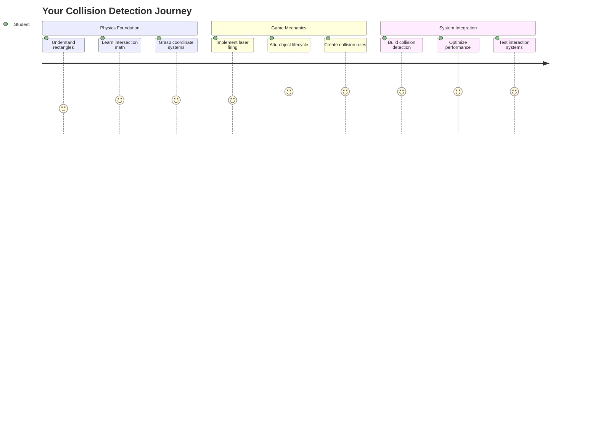
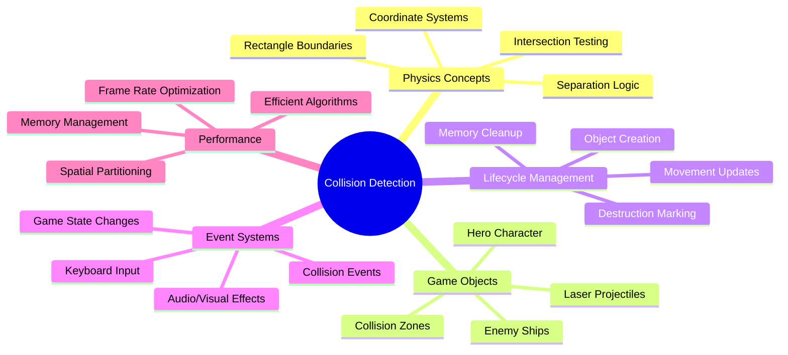
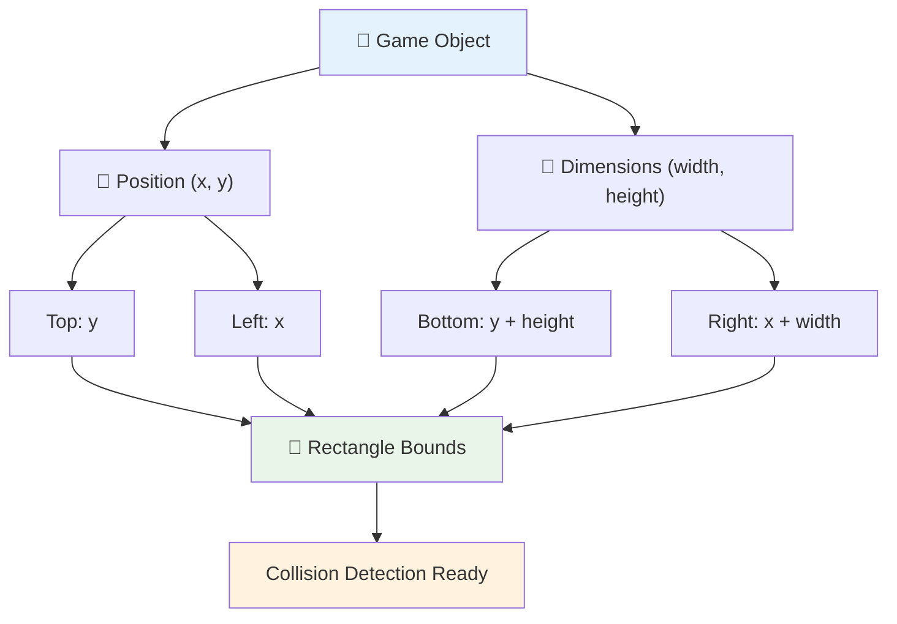
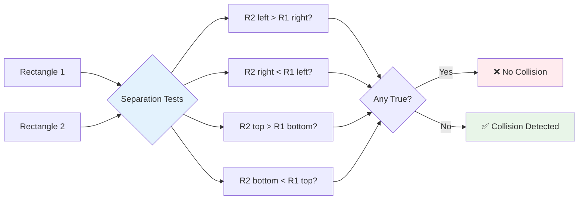
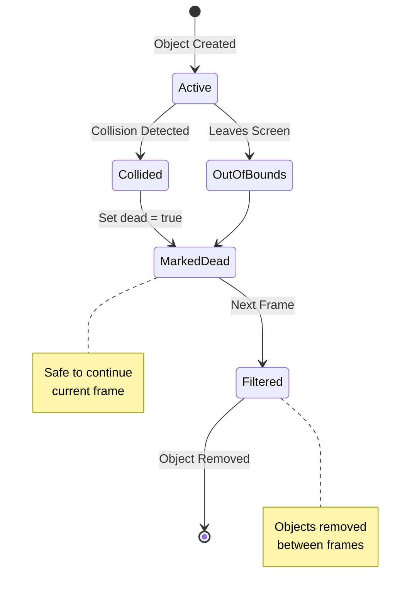
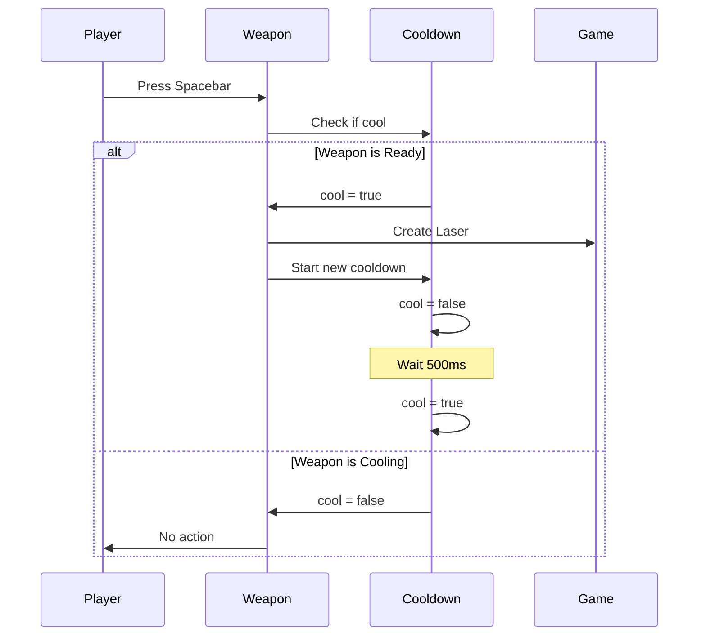
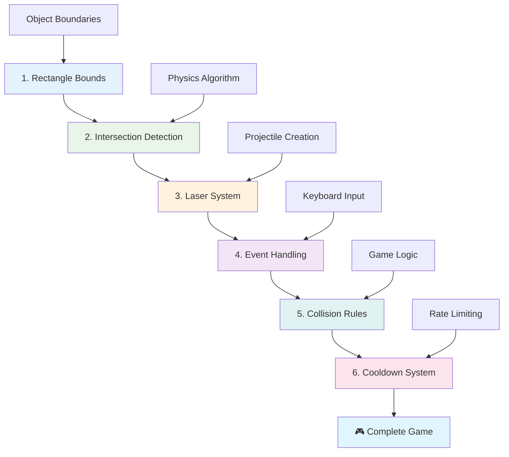
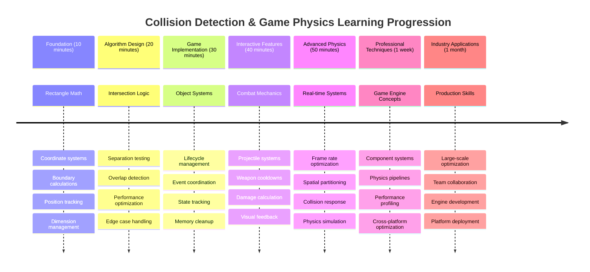

# Rakenna avaruuspeli osa 4: Lisää laser ja tunnista törmäykset



## Ennakkokysely

[Ennakkokysely](https://ff-quizzes.netlify.app/web/quiz/35)

Ajattele hetkeä Star Warsissa, kun Luken protonitorpedot osuivat Kuolemantähden pakoputkeen. Juuri tuo tarkka törmäyksen tunnistus muutti galaksin kohtalon! Peleissä törmäyksen tunnistus toimii samalla tavalla – se määrittää, milloin objektit ovat vuorovaikutuksessa ja mitä tapahtuu seuraavaksi.

Tässä oppitunnissa lisäät laseraseet avaruuspeliisi ja toteutat törmäyksen tunnistuksen. Aivan kuten NASAn tehtäväsuunnittelijat laskevat avaruusalusten reittejä välttääkseen roskia, opit tunnistamaan, milloin pelin objektit leikkaavat toisiaan. Jaamme tämän hallittaviin vaiheisiin, jotka rakentuvat toistensa päälle.

Lopuksi sinulla on toimiva taistelujärjestelmä, jossa laserit tuhoavat vihollisia ja törmäykset käynnistävät pelitapahtumia. Näitä samoja törmäyksen periaatteita käytetään kaikkeen fysiikkasimulaatioista interaktiivisiin verkkokäyttöliittymiin.



✅ Tee hieman tutkimusta ensimmäisestä koskaan kirjoitetusta tietokonepelistä. Mitä toiminnallisuuksia siinä oli?

## Törmäyksen tunnistus

Törmäyksen tunnistus toimii kuin Apollo-kuumoduulin läheisyysanturit – se tarkistaa jatkuvasti etäisyyksiä ja käynnistää hälytyksiä, kun objektit tulevat liian lähelle. Peleissä tämä järjestelmä määrittää, milloin objektit ovat vuorovaikutuksessa ja mitä pitäisi tapahtua seuraavaksi.

Käyttämämme lähestymistapa käsittelee jokaista pelin objektia suorakulmiona, aivan kuten lennonjohtojärjestelmät käyttävät yksinkertaistettuja geometrisia muotoja lentokoneiden seuraamiseen. Tämä suorakulmainen menetelmä saattaa vaikuttaa yksinkertaiselta, mutta se on laskennallisesti tehokas ja toimii hyvin useimmissa pelitilanteissa.

### Suorakulmion määrittely

Jokaisella pelin objektilla on oltava koordinaattirajat, aivan kuten Mars Pathfinder -mönkijä kartoitti sijaintinsa Marsin pinnalla. Näin määrittelemme nämä rajakoordinaatit:



```javascript
rectFromGameObject() {
  return {
    top: this.y,
    left: this.x,
    bottom: this.y + this.height,
    right: this.x + this.width
  }
}
```

**Puretaan tämä osiin:**
- **Yläreuna**: Se on vain kohta, jossa objektisi alkaa pystysuunnassa (sen y-sijainti)
- **Vasemmassa reuna**: Kohta, jossa se alkaa vaakasuunnassa (sen x-sijainti)
- **Alareuna**: Lisää korkeus y-sijaintiin – nyt tiedät, missä se päättyy!
- **Oikea reuna**: Lisää leveys x-sijaintiin – ja sinulla on täydelliset rajat

### Leikkausalgoritmi

Suorakulmion leikkausten tunnistus käyttää logiikkaa, joka on samanlainen kuin Hubble-avaruusteleskoopin tapa määrittää, ovatko taivaankappaleet päällekkäin sen näkökentässä. Algoritmi tarkistaa erottelun:



```javascript
function intersectRect(r1, r2) {
  return !(r2.left > r1.right ||
    r2.right < r1.left ||
    r2.top > r1.bottom ||
    r2.bottom < r1.top);
}
```

**Erottelutesti toimii kuten tutkajärjestelmät:**
- Onko suorakulmio 2 kokonaan suorakulmion 1 oikealla puolella?
- Onko suorakulmio 2 kokonaan suorakulmion 1 vasemmalla puolella?
- Onko suorakulmio 2 kokonaan suorakulmion 1 alapuolella?
- Onko suorakulmio 2 kokonaan suorakulmion 1 yläpuolella?

Jos mikään näistä ehdoista ei pidä paikkaansa, suorakulmiot ovat päällekkäin. Tämä lähestymistapa muistuttaa, kuinka tutkaoperaattorit määrittävät, ovatko kaksi lentokonetta turvallisella etäisyydellä toisistaan.

## Objektien elinkaaren hallinta

Kun laser osuu viholliseen, molemmat objektit on poistettava pelistä. Objektien poistaminen kesken silmukan voi kuitenkin aiheuttaa kaatumisia – oppitunti, joka opittiin kantapään kautta varhaisissa tietokonejärjestelmissä, kuten Apollo Guidance Computerissa. Sen sijaan käytämme "poistettavaksi merkitsemisen" lähestymistapaa, joka poistaa objektit turvallisesti ruutujen välillä.



Näin merkitsemme jotain poistettavaksi:

```javascript
// Mark object for removal
enemy.dead = true;
```

**Miksi tämä lähestymistapa toimii:**
- Merkitsemme objektin "kuolleeksi", mutta emme poista sitä heti
- Tämä antaa nykyisen peliruudun valmistua turvallisesti
- Ei kaatumisia, kun yritetään käyttää jotain, joka on jo poistettu!

Sitten suodatamme merkityt objektit pois ennen seuraavaa renderöintikierrosta:

```javascript
gameObjects = gameObjects.filter(go => !go.dead);
```

**Mitä tämä suodatus tekee:**
- Luo uuden listan, jossa on vain "elävät" objektit
- Poistaa kaiken, mikä on merkitty kuolleeksi
- Pitää pelin sujuvana
- Estää muistin täyttymisen tuhoutuneista objekteista

## Laserin mekaniikan toteuttaminen

Laserprojektiilit peleissä toimivat samalla periaatteella kuin fotonitorpedot Star Trekissä – ne ovat erillisiä objekteja, jotka liikkuvat suoraviivaisesti, kunnes ne osuvat johonkin. Jokainen välilyöntinäppäimen painallus luo uuden laserobjektin, joka liikkuu ruudun poikki.

Tämän toteuttamiseksi meidän on koordinoitava muutamia eri osia:

**Keskeiset toteutettavat osat:**
- **Luo** laserobjekteja, jotka syntyvät sankarin sijainnista
- **Käsittele** näppäimistön syötteet laserin luomisen käynnistämiseksi
- **Hallitse** laserin liikettä ja elinkaarta
- **Toteuta** visuaalinen esitys laserprojektiileille

## Tulinopeuden hallinnan toteuttaminen

Rajoittamaton tulinopeus kuormittaisi pelimoottoria ja tekisi pelaamisesta liian helppoa. Todelliset asejärjestelmät kohtaavat samanlaisia rajoituksia – jopa USS Enterprisen faaserit tarvitsivat aikaa latautua laukausten välillä.

Toteutamme jäähdytysjärjestelmän, joka estää nopean tulituksen spammaamisen samalla kun säilytämme ohjainten reagoivuuden:



```javascript
class Cooldown {
  constructor(time) {
    this.cool = false;
    setTimeout(() => {
      this.cool = true;
    }, time);
  }
}

class Weapon {
  constructor() {
    this.cooldown = null;
  }
  
  fire() {
    if (!this.cooldown || this.cooldown.cool) {
      // Create laser projectile
      this.cooldown = new Cooldown(500);
    } else {
      // Weapon is still cooling down
    }
  }
}
```

**Kuinka jäähdytys toimii:**
- Kun ase luodaan, se alkaa "kuumana" (ei voi ampua vielä)
- Aikakatkaisun jälkeen se muuttuu "viileäksi" (valmis ampumaan)
- Ennen ampumista tarkistamme: "Onko ase viileä?"
- Tämä estää spammaamisen samalla kun ohjaimet pysyvät reagoivina

✅ Katso avaruuspelisarjan ensimmäinen oppitunti muistuttaaksesi itseäsi jäähdytyksistä.

## Törmäysjärjestelmän rakentaminen

Laajennat olemassa olevaa avaruuspelikoodiasi luodaksesi törmäyksen tunnistusjärjestelmän. Kuten Kansainvälisen avaruusaseman automatisoitu törmäyksen välttämisjärjestelmä, pelisi seuraa jatkuvasti objektien sijainteja ja reagoi leikkauksiin.

Aloittaen edellisen oppitunnin koodista, lisäät törmäyksen tunnistuksen erityisillä säännöillä, jotka ohjaavat objektien vuorovaikutusta.

> 💡 **Vinkki**: Laser-sprite on jo mukana omaisuuskansiossasi ja viitattu koodissasi, valmiina toteutettavaksi.

### Toteutettavat törmäyssäännöt

**Lisättävät pelimekaniikat:**
1. **Laser osuu viholliseen**: Vihollisobjekti tuhoutuu, kun laserprojektiili osuu siihen
2. **Laser osuu ruudun reunaan**: Laser poistetaan, kun se saavuttaa ruudun yläreunan
3. **Vihollinen ja sankari törmäävät**: Molemmat objektit tuhoutuvat, kun ne leikkaavat
4. **Vihollinen saavuttaa pohjan**: Pelin loppumistila, kun viholliset saavuttavat ruudun pohjan

### 🔄 **Pedagoginen tarkistus**
**Törmäyksen tunnistuksen perusteet**: Ennen toteutusta varmista, että ymmärrät:
- ✅ Kuinka suorakulmion rajat määrittävät törmäysalueet
- ✅ Miksi erottelutestaus on tehokkaampaa kuin leikkauslaskenta
- ✅ Objektien elinkaaren hallinnan merkitys pelisilmukoissa
- ✅ Kuinka tapahtumapohjaiset järjestelmät koordinoivat törmäysreaktioita

**Nopea itsekoe**: Mitä tapahtuisi, jos poistaisit objektit heti sen sijaan, että merkitsisit ne?
*Vastaus: Kesken silmukan poistaminen voisi aiheuttaa kaatumisia tai ohittaa objekteja iteraatiossa*

**Fysiikan ymmärtäminen**: Nyt ymmärrät:
- **Koordinaattijärjestelmät**: Kuinka sijainti ja mitat luovat rajat
- **Leikkauslogiikka**: Matemaattiset periaatteet törmäyksen tunnistuksen takana
- **Suorituskyvyn optimointi**: Miksi tehokkaat algoritmit ovat tärkeitä reaaliaikaisissa järjestelmissä
- **Muistin hallinta**: Turvalliset objektien elinkaarimallit vakauden takaamiseksi

## Kehitysympäristön asettaminen

Hyviä uutisia – olemme jo valmistelleet suurimman osan perustasta sinulle! Kaikki pelin omaisuudet ja perusrakenne odottavat `your-work`-alikansiossa, valmiina lisättäväksi siisteihin törmäystoimintoihin.

### Projektin rakenne

```bash
-| assets
  -| enemyShip.png
  -| player.png
  -| laserRed.png
-| index.html
-| app.js
-| package.json
```

**Tiedostorakenteen ymmärtäminen:**
- **Sisältää** kaikki pelin objektien sprite-kuvat
- **Sisältää** pääasiallisen HTML-dokumentin ja JavaScript-sovellustiedoston
- **Tarjoaa** pakettikonfiguraation paikalliselle kehityspalvelimelle

### Kehityspalvelimen käynnistäminen

Siirry projektikansioosi ja käynnistä paikallinen palvelin:

```bash
cd your-work
npm start
```

**Tämä komentojono:**
- **Siirtyy** työprojektikansioon
- **Käynnistää** paikallisen HTTP-palvelimen osoitteessa `http://localhost:5000`
- **Palvelee** pelitiedostosi testaukseen ja kehitykseen
- **Mahdollistaa** live-kehityksen automaattisella uudelleenlatauksella

Avaa selaimesi ja siirry osoitteeseen `http://localhost:5000` nähdäksesi nykyisen pelitilasi, jossa sankari ja viholliset on renderöity ruudulle.

### Toteutuksen vaiheittainen eteneminen

Kuten NASA:n järjestelmällinen lähestymistapa Voyager-avaruusaluksen ohjelmointiin, toteutamme törmäyksen tunnistuksen metodisesti, rakentamalla jokaisen komponentin vaihe vaiheelta.



#### 1. Lisää suorakulmion törmäysrajat

Ensiksi opetetaan pelin objekteille, kuinka ne kuvaavat rajansa. Lisää tämä metodi `GameObject`-luokkaasi:

```javascript
rectFromGameObject() {
    return {
      top: this.y,
      left: this.x,
      bottom: this.y + this.height,
      right: this.x + this.width,
    };
  }
```

**Tämä metodi tekee:**
- **Luo** suorakulmion objektin tarkkojen rajakoordinaattien kanssa
- **Laskee** alareunan ja oikean reunan sijainnin plus mitat
- **Palauttaa** objektin, joka on valmis törmäyksen tunnistusalgoritmeille
- **Tarjoaa** standardoidun rajapinnan kaikille pelin objekteille

#### 2. Toteuta leikkausten tunnistus

Nyt luodaan törmäysetsivä – funktio, joka osaa kertoa, milloin kaksi suorakulmiota ovat päällekkäin:

```javascript
function intersectRect(r1, r2) {
  return !(
    r2.left > r1.right ||
    r2.right < r1.left ||
    r2.top > r1.bottom ||
    r2.bottom < r1.top
  );
}
```

**Tämä algoritmi toimii:**
- **Testaa** neljä erotteluehtoa suorakulmioiden välillä
- **Palauttaa** `false`, jos jokin erotteluehto pitää paikkansa
- **Ilmaisee** törmäyksen, kun erottelua ei ole
- **Käyttää** negatiivista logiikkaa tehokkaaseen leikkaustestaukseen

#### 3. Toteuta laserin ampumisjärjestelmä

Tässä kohtaa asiat muuttuvat jännittäviksi! Luodaan laserin ampumisjärjestelmä.

##### Viestivakiot

Määritellään ensin joitakin viestityyppejä, jotta pelin eri osat voivat kommunikoida keskenään:

```javascript
KEY_EVENT_SPACE: "KEY_EVENT_SPACE",
COLLISION_ENEMY_LASER: "COLLISION_ENEMY_LASER",
COLLISION_ENEMY_HERO: "COLLISION_ENEMY_HERO",
```

**Nämä vakiot tarjoavat:**
- **Vakioi** tapahtumien nimet koko sovelluksessa
- **Mahdollistaa** johdonmukaisen viestinnän pelijärjestelmien välillä
- **Estää** kirjoitusvirheet tapahtumakäsittelijöiden rekisteröinnissä

##### Näppäimistön syötteen käsittely

Lisää välilyöntinäppäimen tunnistus näppäintapahtumien kuuntelijaan:

```javascript
} else if(evt.keyCode === 32) {
  eventEmitter.emit(Messages.KEY_EVENT_SPACE);
}
```

**Tämä syötteen käsittelijä:**
- **Tunnistaa** välilyöntinäppäimen painallukset käyttämällä keyCode 32
- **Lähettää** standardoidun tapahtumaviestin
- **Mahdollistaa** irrotetun ampumislogiikan

##### Tapahtumakuuntelijan asettaminen

Rekisteröi ampumiskäyttäytyminen `initGame()`-funktiossasi:

```javascript
eventEmitter.on(Messages.KEY_EVENT_SPACE, () => {
 if (hero.canFire()) {
   hero.fire();
 }
});
```

**Tämä tapahtumakuuntelija:**
- **Reagoi** välilyöntinäppäimen tapahtumiin
- **Tarkistaa** ampumisen jäähdytysstatus
- **Käynnistää** laserin luomisen, kun se on sallittua

Lisää törmäyksen käsittely laser-vihollisvuorovaikutuksille:

```javascript
eventEmitter.on(Messages.COLLISION_ENEMY_LASER, (_, { first, second }) => {
  first.dead = true;
  second.dead = true;
});
```

**Tämä törmäyskäsittelijä:**
- **Vastaanottaa** törmäystapahtuman tiedot molemmista objekteista
- **Merkitsee** molemmat objektit poistettaviksi
- **Varmistaa** asianmukaisen siivouksen törmäyksen jälkeen

#### 4. Luo Laser-luokka

Toteuta laserprojektiili, joka liikkuu ylöspäin ja hallitsee omaa elinkaartaan:

```javascript
class Laser extends GameObject {
  constructor(x, y) {
    super(x, y);
    this.width = 9;
    this.height = 33;
    this.type = 'Laser';
    this.img = laserImg;
    
    let id = setInterval(() => {
      if (this.y > 0) {
        this.y -= 15;
      } else {
        this.dead = true;
        clearInterval(id);
      }
    }, 100);
  }
}
```

**Tämä luokan toteutus:**
- **Laajentaa** GameObjectia perustoiminnallisuuden perimiseksi
- **Asettaa** sopivat mitat laser-spriteille
- **Luo** automaattisen ylöspäin liikkeen käyttämällä `setInterval()`
- **Käsittelee** itsensä tuhoamisen, kun se saavuttaa ruudun yläreunan
- **Hallinnoi** omaa animaatiota ja siivousta

#### 5. Toteuta törmäyksen tunnistusjärjestelmä

Luo kattava törmäyksen tunnistusfunktio:

```javascript
function updateGameObjects() {
  const enemies = gameObjects.filter(go => go.type === 'Enemy');
  const lasers = gameObjects.filter(go => go.type === "Laser");
  
  // Test laser-enemy collisions
  lasers.forEach((laser) => {
    enemies.forEach((enemy) => {
      if (intersectRect(laser.rectFromGameObject(), enemy.rectFromGameObject())) {
        eventEmitter.emit(Messages.COLLISION_ENEMY_LASER, {
          first: laser,
          second: enemy,
        });
      }
    });
  });

  // Remove destroyed objects
  gameObjects = gameObjects.filter(go => !go.dead);
}
```

**Tämä törmäysjärjestelmä:**
- **Suodattaa** pelin objektit tyypin mukaan tehokasta testausta varten
- **Testaa** jokaisen laserin jokaisen vihollisen kanssa leikkauksia
- **Lähettää** törmäystapahtumia, kun leikkauksia havaitaan
- **Siivoaa** tuhotut objektit törmäyskäsittelyn jälkeen

> ⚠️ **Tärkeää**: Lisää `updateGameObjects()` pääpelisilmukkaasi `window.onload`-kohdassa, jotta törmäyksen tunnistus aktivoituu.

#### 6. Lisää jäähdytysjärjestelmä Hero-luokkaan

Paranna Hero-luokkaa ampumismekaniikalla ja tulinopeuden rajoituksella:

```javascript
class Hero extends GameObject {
  constructor(x, y) {
    super(x, y);
    this.width = 99;
    this.height = 75;
    this.type = "Hero";
    this.speed = { x: 0, y: 0 };
    this.cooldown = 0;
  }
  
  fire() {
    gameObjects.push(new Laser(this.x + 45, this.y - 10));
    this.cooldown = 500;

    let id = setInterval(() => {
      if (this.cooldown > 0) {
        this.cooldown -= 100;
      } else {
        clearInterval(id);
      }
    }, 200);
  }
  
  canFire() {
    return this.cooldown === 0;
  }
}
```

**Parannetun Hero-luokan ymmärtäminen:**
- **Alustaa** jäähdytystimerin nollaan (valmis ampumaan)
- **Luo** laserobjekteja sankarialuksen yläpuolelle
- **Asettaa** jäähdytysajan estääkseen nopean ampumisen
- **Vähentää** jäähdytystimeriä intervallipohjaisilla päivityksillä
- **Tarjoaa** ampumisstatus-tarkistuksen `canFire()`-metodin kautta

### 🔄 **Pedagoginen tarkistus**
**Täydellinen järjestelmän ymmärrys**: Varmista törmäysjärjestelmän hallinta:
- ✅ Kuinka suorakulmion rajat mahdollistavat tehokkaan törmäyksen tunnistuksen?
- ✅ Miksi objektien elinkaaren hallinta on kriittistä pelin vakaudelle?
- ✅ Kuinka jäähdytysjärjestelmä est
- [ ] Lisää `console.log` -komentoja törmäystapahtumien seuraamiseksi reaaliajassa

### 🎯 **Mitä voit saavuttaa tämän tunnin aikana**
- [ ] Suorita oppitunnin jälkeinen testi ja ymmärrä törmäyksen tunnistusalgoritmit
- [ ] Lisää visuaalisia tehosteita, kuten räjähdyksiä törmäysten yhteydessä
- [ ] Toteuta erilaisia ammuksia, joilla on vaihtelevia ominaisuuksia
- [ ] Luo voimaesineitä, jotka parantavat pelaajan kykyjä väliaikaisesti
- [ ] Lisää äänitehosteita, jotka tekevät törmäyksistä tyydyttävämpiä

### 📅 **Viikon mittainen fysiikkapohjainen ohjelmointi**
- [ ] Viimeistele koko avaruuspeli hiotuilla törmäysjärjestelmillä
- [ ] Toteuta edistyneitä törmäysmuotoja suorakulmioiden lisäksi (ympyrät, monikulmiot)
- [ ] Lisää partikkelijärjestelmiä realististen räjähdystehosteiden luomiseksi
- [ ] Luo monimutkaista viholliskäyttäytymistä törmäysten välttämiseksi
- [ ] Optimoi törmäyksen tunnistus parempaa suorituskykyä varten monien objektien kanssa
- [ ] Lisää fysiikkasimulaatioita, kuten liikemäärä ja realistinen liike

### 🌟 **Kuukauden mittainen pelifysiikan hallinta**
- [ ] Rakenna pelejä edistyneillä fysiikkamoottoreilla ja realistisilla simulaatioilla
- [ ] Opettele 3D-törmäyksen tunnistus ja tilan jakamisalgoritmit
- [ ] Osallistu avoimen lähdekoodin fysiikkakirjastoihin ja pelimoottoreihin
- [ ] Hallitse suorituskyvyn optimointi grafiikkaintensiivisissä sovelluksissa
- [ ] Luo opetusmateriaalia pelifysiikasta ja törmäyksen tunnistuksesta
- [ ] Rakenna portfolio, joka esittelee edistyneitä fysiikkaohjelmointitaitoja

## 🎯 Törmäyksen tunnistuksen hallinnan aikajana



### 🛠️ Pelifysiikan työkalupakin yhteenveto

Tämän oppitunnin jälkeen olet hallinnut:
- **Törmäysmatematiikka**: Suorakulmion leikkausalgoritmit ja koordinaattijärjestelmät
- **Suorituskyvyn optimointi**: Tehokas törmäyksen tunnistus reaaliaikaisiin sovelluksiin
- **Objektien elinkaaren hallinta**: Turvalliset luomis-, päivitys- ja tuhoamismallit
- **Tapahtumapohjainen arkkitehtuuri**: Irrotetut järjestelmät törmäysvasteelle
- **Peliloopin integrointi**: Kehykseen perustuvat fysiikkapäivitykset ja renderöinnin koordinointi
- **Syöttöjärjestelmät**: Reagoivat ohjaimet rajoituksilla ja palautteella
- **Muistinhallinta**: Tehokkaat objektien poolaus- ja siivousstrategiat

**Todelliset sovellukset**: Törmäyksen tunnistustaitosi soveltuvat suoraan:
- **Interaktiiviset simulaatiot**: Tieteellinen mallinnus ja opetusvälineet
- **Käyttöliittymäsuunnittelu**: Vedä ja pudota -toiminnot ja kosketustunnistus
- **Datan visualisointi**: Interaktiiviset kaaviot ja klikattavat elementit
- **Mobiilikehitys**: Kosketuseleiden tunnistus ja törmäyksen käsittely
- **Robotiikkaohjelmointi**: Reittisuunnittelu ja esteiden välttäminen
- **Tietokonegrafiikka**: Säteenjäljitys ja tilan jakamisalgoritmit

**Ammatilliset taidot**: Nyt osaat:
- **Suunnitella** tehokkaita algoritmeja reaaliaikaiseen törmäyksen tunnistukseen
- **Toteuttaa** fysiikkajärjestelmiä, jotka skaalautuvat objektien monimutkaisuuden mukaan
- **Vianetsintä** monimutkaisissa vuorovaikutusjärjestelmissä matemaattisten periaatteiden avulla
- **Optimoida** suorituskykyä eri laitteistoille ja selaimille
- **Rakentaa** ylläpidettäviä pelijärjestelmiä käyttäen todistettuja suunnittelumalleja

**Pelikehityksen käsitteet hallussa**:
- **Fysiikkasimulaatio**: Reaaliaikainen törmäyksen tunnistus ja vaste
- **Suorituskykytekniikka**: Optimoidut algoritmit interaktiivisiin sovelluksiin
- **Tapahtumajärjestelmät**: Irrotettu viestintä pelikomponenttien välillä
- **Objektien hallinta**: Tehokkaat elinkaarimallit dynaamiselle sisällölle
- **Syötön käsittely**: Reagoivat ohjaimet asianmukaisella palautteella

**Seuraava taso**: Olet valmis tutkimaan edistyneitä fysiikkamoottoreita, kuten Matter.js, toteuttamaan 3D-törmäyksen tunnistusta tai rakentamaan monimutkaisia partikkelijärjestelmiä!

🌟 **Saavutus avattu**: Olet rakentanut täydellisen fysiikkapohjaisen vuorovaikutusjärjestelmän ammattimaisella törmäyksen tunnistuksella!

## GitHub Copilot Agent -haaste 🚀

Käytä Agent-tilaa suorittaaksesi seuraavan haasteen:

**Kuvaus:** Paranna törmäyksen tunnistusjärjestelmää toteuttamalla voimaesineitä, jotka ilmestyvät satunnaisesti ja tarjoavat väliaikaisia kykyjä, kun sankarialus kerää ne.

**Ohje:** Luo PowerUp-luokka, joka laajentaa GameObjectia, ja toteuta törmäyksen tunnistus sankarin ja voimaesineiden välillä. Lisää vähintään kaksi voimaesinetyyppiä: yksi, joka lisää tulitusnopeutta (vähentää viiveaikaa), ja toinen, joka luo väliaikaisen suojan. Sisällytä luomislogiikka, joka luo voimaesineitä satunnaisin väliajoin ja paikoissa.

---

## 🚀 Haaste

Lisää räjähdys! Tutustu pelin materiaaleihin [Space Art -repo](../../../../6-space-game/solution/spaceArt/readme.txt) ja yritä lisätä räjähdys, kun laser osuu muukalaiseen.

## Oppitunnin jälkeinen testi

[Oppitunnin jälkeinen testi](https://ff-quizzes.netlify.app/web/quiz/36)

## Katsaus ja itseopiskelu

Kokeile pelisi aikavälejä tähän mennessä. Mitä tapahtuu, kun muutat niitä? Lue lisää [JavaScriptin ajoitustapahtumista](https://www.freecodecamp.org/news/javascript-timing-events-settimeout-and-setinterval/).

## Tehtävä

[Tutustu törmäyksiin](assignment.md)

---

**Vastuuvapauslauseke**:  
Tämä asiakirja on käännetty AI-käännöspalvelulla [Co-op Translator](https://github.com/Azure/co-op-translator). Vaikka pyrimme tarkkuuteen, huomioithan, että automaattiset käännökset voivat sisältää virheitä tai epätarkkuuksia. Alkuperäistä asiakirjaa sen alkuperäisellä kielellä tulisi pitää ensisijaisena lähteenä. Tärkeissä tiedoissa suositellaan ammattimaista ihmiskäännöstä. Emme ole vastuussa väärinkäsityksistä tai virhetulkinnoista, jotka johtuvat tämän käännöksen käytöstä.