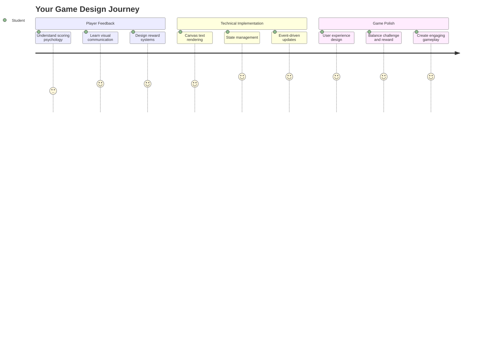
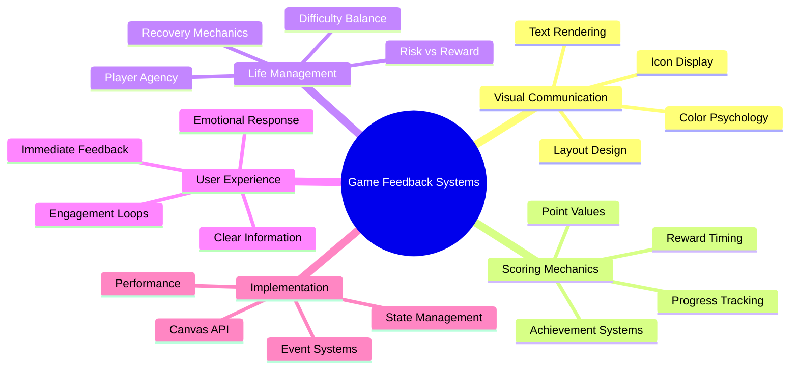
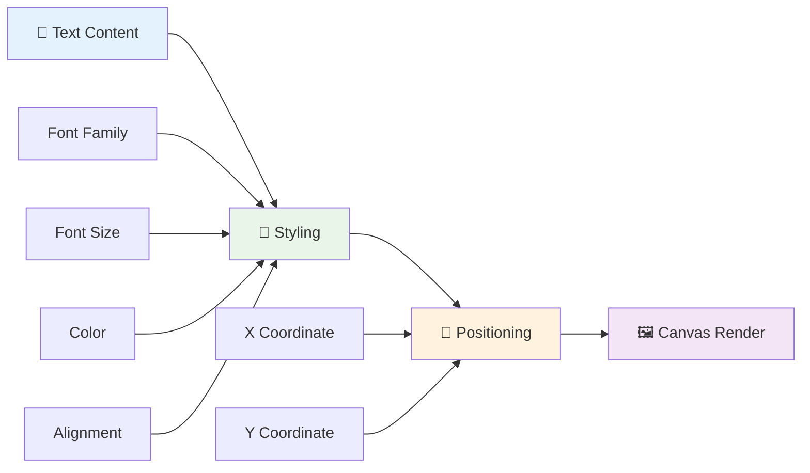
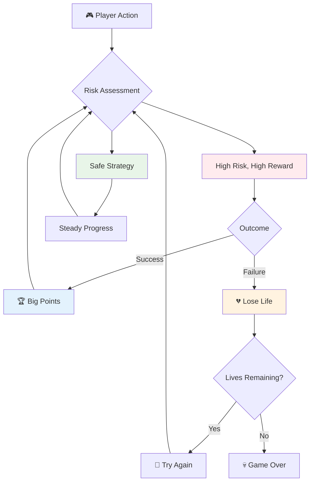
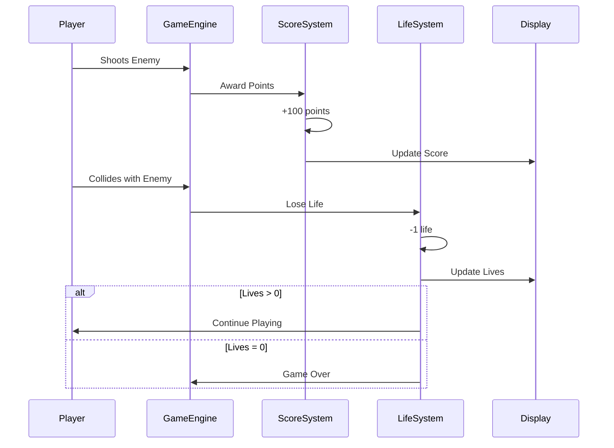
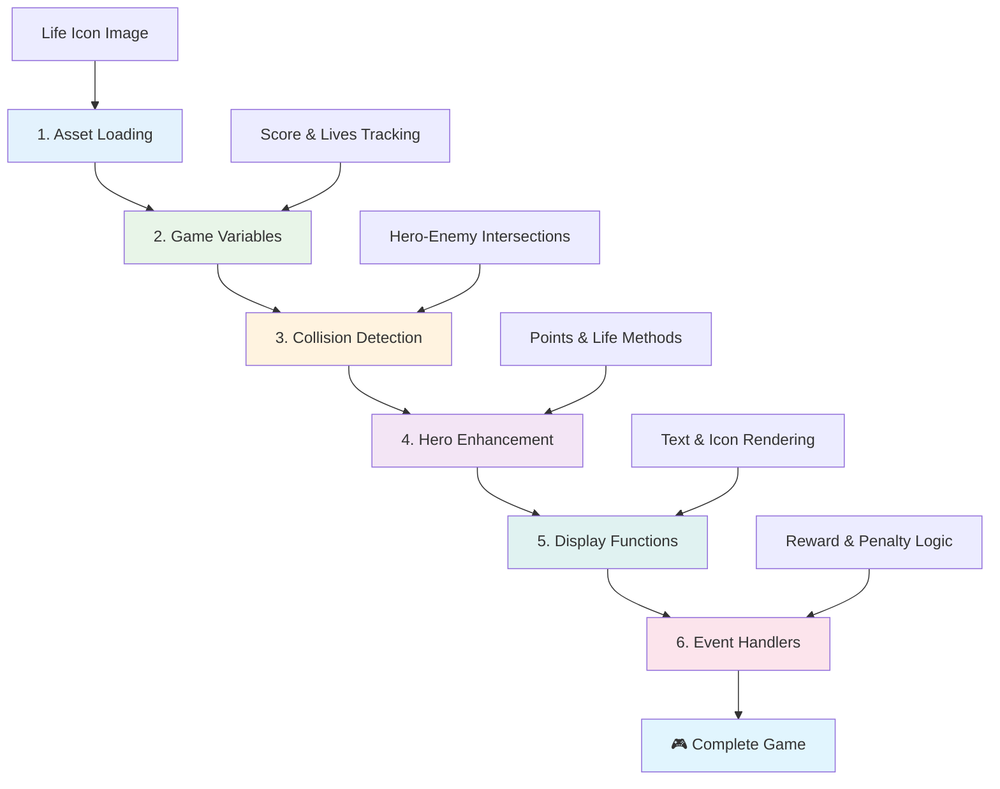
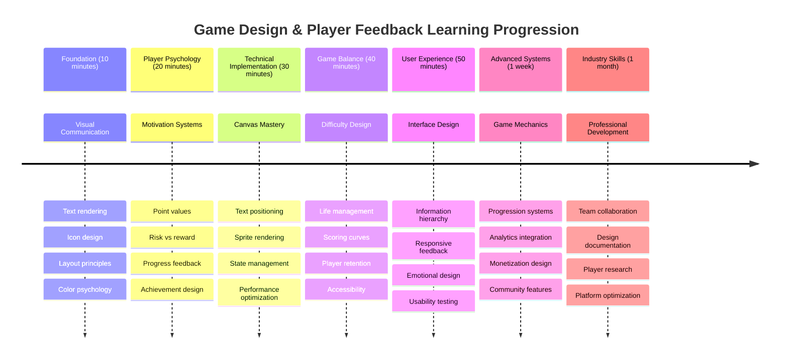

<!--
CO_OP_TRANSLATOR_METADATA:
{
  "original_hash": "2ed9145a16cf576faa2a973dff84d099",
  "translation_date": "2025-11-04T01:43:07+00:00",
  "source_file": "6-space-game/5-keeping-score/README.md",
  "language_code": "fi"
}
-->
# Rakenna avaruuspeli osa 5: Pisteet ja elämät



## Ennakkokysely

[Ennakkokysely](https://ff-quizzes.netlify.app/web/quiz/37)

Valmis tekemään avaruuspelistäsi oikean pelin? Lisätään pisteiden kerääminen ja elämien hallinta – ydintoiminnot, jotka muuttivat varhaiset arcade-pelit, kuten Space Invaders, yksinkertaisista demonstraatioista koukuttavaksi viihteeksi. Tässä vaiheessa pelisi muuttuu todella pelattavaksi.



## Tekstin piirtäminen ruudulle - Pelisi ääni

Näyttääksemme pisteet meidän täytyy oppia, kuinka tekstiä renderoidaan canvas-elementille. `fillText()`-metodi on päätyökalusi tähän – sama tekniikka, jota käytettiin klassisissa arcade-peleissä pisteiden ja tilatietojen näyttämiseen.



Sinulla on täysi hallinta tekstin ulkoasusta:

```javascript
ctx.font = "30px Arial";
ctx.fillStyle = "red";
ctx.textAlign = "right";
ctx.fillText("show this on the screen", 0, 0);
```

✅ Sukella syvemmälle [tekstin lisäämiseen canvas-elementille](https://developer.mozilla.org/docs/Web/API/Canvas_API/Tutorial/Drawing_text) – saatat yllättyä, kuinka luovaksi voit olla fonttien ja tyylien kanssa!

## Elämät - Enemmän kuin vain numero

Pelisuunnittelussa "elämä" edustaa pelaajan virhemarginaalia. Tämä konsepti juontaa juurensa flipperikoneista, joissa pelaajalla oli useita palloja pelattavana. Varhaisissa videopeleissä, kuten Asteroids, elämät antoivat pelaajille luvan ottaa riskejä ja oppia virheistään.



Visuaalinen esitys on erittäin tärkeää – näyttämällä aluksen ikoneita pelkän "Elämät: 3" sijaan luodaan välitön visuaalinen tunnistus, aivan kuten varhaiset arcade-kaapit käyttivät ikonografiaa viestinnässä kielimuurien yli.

## Pelin palkitsemisjärjestelmän rakentaminen

Nyt toteutamme keskeiset palautesysteemit, jotka pitävät pelaajat mukana:



- **Pistejärjestelmä**: Jokainen tuhottu vihollisalus antaa 100 pistettä (pyöreät numerot ovat helpompia pelaajien laskea mielessään). Pisteet näytetään vasemmassa alakulmassa.
- **Elämälaskuri**: Sankarisi aloittaa kolmella elämällä – standardi, jonka varhaiset arcade-pelit asettivat tasapainottamaan haastetta ja pelattavuutta. Jokainen törmäys viholliseen maksaa yhden elämän. Näytämme jäljellä olevat elämät oikeassa alakulmassa aluksen ikoneilla .

## Aloitetaan rakentaminen!

Ensiksi, aseta työtilasi. Siirry tiedostoihin `your-work`-alikansiossa. Sinun pitäisi nähdä nämä tiedostot:

```bash
-| assets
  -| enemyShip.png
  -| player.png
  -| laserRed.png
-| index.html
-| app.js
-| package.json
```

Testataksesi peliäsi, käynnistä kehityspalvelin `your_work`-kansiosta:

```bash
cd your-work
npm start
```

Tämä käynnistää paikallisen palvelimen osoitteessa `http://localhost:5000`. Avaa tämä osoite selaimessasi nähdäksesi pelisi. Testaa ohjaimia nuolinäppäimillä ja kokeile ampua vihollisia varmistaaksesi, että kaikki toimii.



### Koodauksen aika!

1. **Hanki tarvitsemasi visuaaliset resurssit**. Kopioi `life.png`-resurssi `solution/assets/`-kansiosta `your-work`-kansioon. Lisää sitten lifeImg `window.onload`-funktioon: 

    ```javascript
    lifeImg = await loadTexture("assets/life.png");
    ```

1. Älä unohda lisätä `lifeImg` resurssilistaan:

    ```javascript
    let heroImg,
    ...
    lifeImg,
    ...
    eventEmitter = new EventEmitter();
    ```
  
2. **Aseta pelimuuttujat**. Lisää koodi, joka seuraa kokonaispisteitäsi (alkaen 0) ja jäljellä olevia elämiä (alkaen 3). Näytämme nämä ruudulla, jotta pelaajat tietävät aina tilanteensa.

3. **Toteuta törmäysten tunnistus**. Laajenna `updateGameObjects()`-funktiota tunnistamaan, kun viholliset törmäävät sankariisi:

    ```javascript
    enemies.forEach(enemy => {
        const heroRect = hero.rectFromGameObject();
        if (intersectRect(heroRect, enemy.rectFromGameObject())) {
          eventEmitter.emit(Messages.COLLISION_ENEMY_HERO, { enemy });
        }
      })
    ```

4. **Lisää elämien ja pisteiden seuranta sankarillesi**. 
   1. **Alusta laskurit**. Lisää `this.cooldown = 0`-kohdan alle `Hero`-luokassasi elämien ja pisteiden laskurit:

        ```javascript
        this.life = 3;
        this.points = 0;
        ```

   1. **Näytä nämä arvot pelaajalle**. Luo funktiot, jotka piirtävät nämä arvot ruudulle:

        ```javascript
        function drawLife() {
          // TODO, 35, 27
          const START_POS = canvas.width - 180;
          for(let i=0; i < hero.life; i++ ) {
            ctx.drawImage(
              lifeImg, 
              START_POS + (45 * (i+1) ), 
              canvas.height - 37);
          }
        }
        
        function drawPoints() {
          ctx.font = "30px Arial";
          ctx.fillStyle = "red";
          ctx.textAlign = "left";
          drawText("Points: " + hero.points, 10, canvas.height-20);
        }
        
        function drawText(message, x, y) {
          ctx.fillText(message, x, y);
        }

        ```

   1. **Liitä kaikki pelisilmukkaan**. Lisää nämä funktiot `window.onload`-funktioon heti `updateGameObjects()`-kohdan jälkeen:

        ```javascript
        drawPoints();
        drawLife();
        ```

### 🔄 **Pedagoginen tarkistus**
**Pelisuunnittelun ymmärtäminen**: Ennen seurausten toteuttamista varmista, että ymmärrät:
- ✅ Kuinka visuaalinen palaute viestii pelitilasta pelaajille
- ✅ Miksi käyttöliittymäelementtien johdonmukainen sijoittelu parantaa käytettävyyttä
- ✅ Psykologia pistearvojen ja elämänhallinnan takana
- ✅ Kuinka canvas-tekstin renderöinti eroaa HTML-tekstistä

**Pikainen itsearviointi**: Miksi arcade-pelit yleensä käyttävät pyöreitä numeroita pistearvoina?
*Vastaus: Pyöreät numerot ovat helpompia pelaajien laskea mielessään ja luovat tyydyttäviä psykologisia palkintoja*

**Käyttäjäkokemuksen periaatteet**: Sovellat nyt:
- **Visuaalinen hierarkia**: Tärkeät tiedot sijoitettu näkyvästi
- **Välitön palaute**: Pelaajan toimien reaaliaikainen päivitys
- **Kognitiivinen kuormitus**: Yksinkertainen ja selkeä tiedon esitys
- **Emotionaalinen suunnittelu**: Ikonit ja värit, jotka luovat yhteyden pelaajaan

1. **Toteuta pelin seuraukset ja palkinnot**. Nyt lisätään palautesysteemit, jotka tekevät pelaajan toimista merkityksellisiä:

   1. **Törmäykset maksavat elämiä**. Joka kerta, kun sankarisi törmää viholliseen, menetät yhden elämän.
   
      Lisää tämä metodi `Hero`-luokkaasi:

        ```javascript
        decrementLife() {
          this.life--;
          if (this.life === 0) {
            this.dead = true;
          }
        }
        ```

   2. **Vihollisten ampuminen ansaitsee pisteitä**. Jokainen onnistunut osuma antaa 100 pistettä, tarjoten välitöntä positiivista palautetta tarkasta ampumisesta.

      Laajenna Hero-luokkaasi tällä lisäysmetodilla:
    
        ```javascript
          incrementPoints() {
            this.points += 100;
          }
        ```

        Nyt yhdistä nämä funktiot törmäystapahtumiin:

        ```javascript
        eventEmitter.on(Messages.COLLISION_ENEMY_LASER, (_, { first, second }) => {
           first.dead = true;
           second.dead = true;
           hero.incrementPoints();
        })

        eventEmitter.on(Messages.COLLISION_ENEMY_HERO, (_, { enemy }) => {
           enemy.dead = true;
           hero.decrementLife();
        });
        ```

✅ Kiinnostunut muista JavaScriptillä ja Canvasilla tehdyistä peleistä? Tutki lisää – saatat yllättyä siitä, mitä kaikkea on mahdollista tehdä!

Kun olet toteuttanut nämä ominaisuudet, testaa peliäsi nähdäksesi täydellisen palautesysteemin toiminnassa. Sinun pitäisi nähdä elämäikoneita oikeassa alakulmassa, pisteesi vasemmassa alakulmassa, ja huomata, kuinka törmäykset vähentävät elämiä samalla kun onnistuneet laukaukset lisäävät pisteitä.

Pelissäsi on nyt olennaiset mekaniikat, jotka tekivät varhaisista arcade-peleistä niin koukuttavia – selkeät tavoitteet, välitön palaute ja merkitykselliset seuraukset pelaajan toimille.

### 🔄 **Pedagoginen tarkistus**
**Täydellinen pelisuunnittelujärjestelmä**: Varmista, että hallitset pelaajapalautesysteemit:
- ✅ Kuinka pisteytysmekaniikat luovat pelaajamotiivaatioita ja sitoutumista?
- ✅ Miksi visuaalinen johdonmukaisuus on tärkeää käyttöliittymän suunnittelussa?
- ✅ Kuinka elämäsysteemi tasapainottaa haastetta ja pelaajien pysyvyyttä?
- ✅ Mikä rooli välittömällä palautteella on tyydyttävän pelattavuuden luomisessa?

**Järjestelmän integrointi**: Palautesysteemisi osoittaa:
- **Käyttäjäkokemuksen suunnittelu**: Selkeä visuaalinen viestintä ja tiedon hierarkia
- **Tapahtumapohjainen arkkitehtuuri**: Pelaajan toimien responsiiviset päivitykset
- **Tilanhallinta**: Dynaamisen pelidatan seuranta ja näyttäminen
- **Canvas-osaaminen**: Tekstin renderöinti ja spritejen sijoittelu
- **Pelipsykologia**: Pelaajamotiivaatioiden ja sitoutumisen ymmärtäminen

**Ammatilliset käytännöt**: Olet toteuttanut:
- **MVC-arkkitehtuuri**: Pelilogiikan, datan ja esityksen erottaminen
- **Observer Pattern**: Tapahtumapohjaiset päivitykset pelitilan muutoksille
- **Komponenttisuunnittelu**: Uudelleenkäytettävät funktiot renderöintiin ja logiikkaan
- **Suorituskyvyn optimointi**: Tehokas renderöinti pelisilmukoissa

### ⚡ **Mitä voit tehdä seuraavan 5 minuutin aikana**
- [ ] Kokeile eri fonttikokoja ja värejä pistelaskun näyttämiseen
- [ ] Muuta pistearvoja ja katso, miten se vaikuttaa pelin tuntumaan
- [ ] Lisää console.log-komentoja seuraamaan pisteiden ja elämien muutoksia
- [ ] Testaa reunatapauksia, kuten elämien loppuminen tai korkeiden pisteiden saavuttaminen

### 🎯 **Mitä voit saavuttaa tämän tunnin aikana**
- [ ] Suorita jälkitunnin kysely ja ymmärrä pelisuunnittelun psykologiaa
- [ ] Lisää äänitehosteet pisteiden keräämiseen ja elämien menettämiseen
- [ ] Toteuta korkeiden pisteiden järjestelmä käyttämällä localStoragea
- [ ] Luo eri pistearvot eri vihollistyypeille
- [ ] Lisää visuaalisia efektejä, kuten ruudun tärinä elämän menettämisen yhteydessä

### 📅 **Viikon mittainen pelisuunnittelumatkasi**
- [ ] Viimeistele koko avaruuspeli hiotuilla palautesysteemeillä
- [ ] Toteuta edistyneet pisteytysmekaniikat, kuten kombokertoimet
- [ ] Lisää saavutuksia ja avattavaa sisältöä
- [ ] Luo vaikeusasteen etenemistä ja tasapainotusjärjestelmiä
- [ ] Suunnittele käyttöliittymät valikoille ja pelin päättymisnäytöille
- [ ] Tutki muita pelejä ymmärtääksesi sitouttamismekanismeja

### 🌟 **Kuukauden mittainen pelikehityksen mestaruus**
- [ ] Rakenna kokonaisia pelejä kehittyneillä etenemisjärjestelmillä
- [ ] Opettele pelianalytiikkaa ja pelaajakäyttäytymisen mittaamista
- [ ] Osallistu avoimen lähdekoodin pelikehitysprojekteihin
- [ ] Hallitse kehittyneitä pelisuunnittelumalleja ja kaupallistamista
- [ ] Luo opetusmateriaalia pelisuunnittelusta ja käyttäjäkokemuksesta
- [ ] Rakenna portfolio, joka esittelee pelisuunnittelu- ja kehitystaitojasi

## 🎯 Pelisuunnittelun mestaruusaikataulu



### 🛠️ Pelisuunnittelutyökalupakin yhteenveto

Tämän oppitunnin jälkeen olet hallinnut:
- **Pelaajapsykologia**: Motiivien, riskien/palkkioiden ja sitoutumissilmukoiden ymmärtäminen
- **Visuaalinen viestintä**: Tehokas käyttöliittymäsuunnittelu tekstin, ikonien ja asettelun avulla
- **Palautesysteemit**: Reaaliaikainen vastaus pelaajan toimille ja pelitapahtumille
- **Tilanhallinta**: Dynaamisen pelidatan tehokas seuranta ja näyttäminen
- **Canvas-tekstin renderöinti**: Ammattimainen tekstin näyttäminen tyylillä ja sijoittelulla
- **Tapahtumien integrointi**: Käyttäjätoimien yhdistäminen merkityksellisiin pelin seurauksiin
- **Pelitasapaino**: Vaikeuskäyrien ja pelaajan etenemisjärjestelmien suunnittelu

**Todelliset sovellukset**: Pelisuunnittelutaitosi soveltuvat suoraan:
- **Käyttöliittymäsuunnittelu**: Houkuttelevien ja intuitiivisten käyttöliittymien luominen
- **Tuotekehitys**: Käyttäjämotiivien ja palautesilmukoiden ymmärtäminen
- **Koulutusteknologia**: Pelillistämisen ja oppimisen sitouttamissysteemit
- **Datavisualisointi**: Monimutkaisen tiedon tekeminen helposti ymmärrettäväksi ja houkuttelevaksi
- **Mobiilisovelluskehitys**: Pysyvyyden mekanismit ja käyttäjäkokemuksen suunnittelu
- **Markkinointiteknologia**: Käyttäytymisen ymmärtäminen ja konversioiden optimointi

**Ammatilliset taidot**: Nyt osaat:
- **Suunnitella** käyttäjäkokemuksia, jotka motivoivat ja sitouttavat käyttäjiä
- **Toteuttaa** palautesysteemejä, jotka ohjaavat käyttäjän toimintaa tehokkaasti
- **Tasapainottaa** haastetta ja saavutettavuutta interaktiivisissa järjestelmissä
- **Luoda** visuaalista viestintää, joka toimii eri käyttäjäryhmille
- **Analysoida** käyttäjäkäyttäytymistä ja kehittää suunnittelua

**Pelikehityksen käsitteet hallussa**:
- **Pelaajamotiivaatio**: Ymmärrys siitä, mikä ohjaa sitoutumista ja pysyvyyttä
- **Visuaalinen suunnittelu**: Selkeiden, houkuttelevien ja toimivien käyttöliittymien luominen
- **Järjestelmäintegraatio**: Useiden pelisysteemien yhdistäminen yhtenäiseksi kokemukseksi
- **Suorituskyvyn optimointi**: Tehokas renderöinti ja tilanhallinta
- **Saavutettavuus**: Suunnittelu eri taitotasoille ja pelaajien tarpeille

**Seuraava taso**: Olet valmis tutkimaan kehittyneitä pelisuunnittelumalleja, toteuttamaan analytiikkajärjestelmiä tai opiskelemaan pelien kaupallistamista ja pelaajien sitouttamisstrategioita!

🌟 **Saavutus avattu**: Olet rakentanut täydellisen pelaajapalautesysteemin ammattimaisilla pelisuunnitteluperiaatteilla!

---

## GitHub Copilot Agent -haaste 🚀

Käytä Agent-tilaa suorittaaksesi seuraavan haasteen:

**Kuvaus:** Paranna avaruuspelin pisteytysjärjestelmää toteuttamalla korkeiden pisteiden ominaisuus pysyvällä tallennuksella ja bonuspisteiden mekaniikalla.

**Tehtävä:** Luo korkeiden pisteiden järjestelmä, joka tallentaa pelaajan parhaan pistemäärän localStorageen. Lisää bonuspisteitä peräkkäisistä vihollistaposta (kombosysteemi) ja toteuta eri pistearvot eri vihollistyypeille. Sisällytä visuaalinen indikaattori, kun pelaaja saavuttaa uuden korkeimman pistemäärän, ja näytä nykyinen korkein pistemäärä peliruudulla.

## 🚀 Haaste

Sinulla on nyt toimiva peli pisteiden ja elämien kanssa. Mieti, mitkä lisäominaisuudet voisivat parantaa pelaajakokemusta.

## Jälkitunnin kysely

[Jälkitunnin kysely](https://ff-quizzes.netlify.app/web/quiz/38)

## Kertaus & Itseopiskelu

Haluatko tutkia lisää? Tutki erilaisia lähestymistapoja pelien pisteytys- ja elämäsysteemeihin. On olemassa kiehtovia pelimoottoreita, kuten [PlayFab](https://playfab.com), jotka käsittelevät pisteytyksen, tulostaulut ja pelaajien etenemisen. Kuinka tällaisen integrointi voisi viedä pelisi seuraavalle tasolle?

## Tehtävä

[Rakenna pisteytyspeli](assignment.md)

---

**Vastuuvapauslauseke**:  
Tämä asiakirja on käännetty käyttämällä tekoälypohjaista käännöspalvelua [Co-op Translator](https://github.com/Azure/co-op-translator). Vaikka pyrimme tarkkuuteen, huomioithan, että automaattiset käännökset voivat sisältää virheitä tai epätarkkuuksia. Alkuperäinen asiakirja sen alkuperäisellä kielellä tulisi pitää ensisijaisena lähteenä. Kriittisen tiedon osalta suositellaan ammattimaista ihmiskäännöstä. Emme ole vastuussa väärinkäsityksistä tai virhetulkinnoista, jotka johtuvat tämän käännöksen käytöstä.