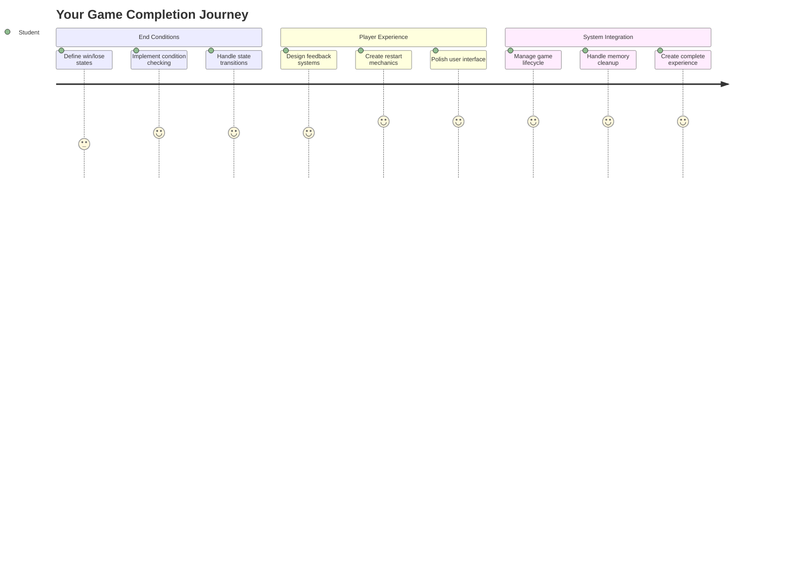
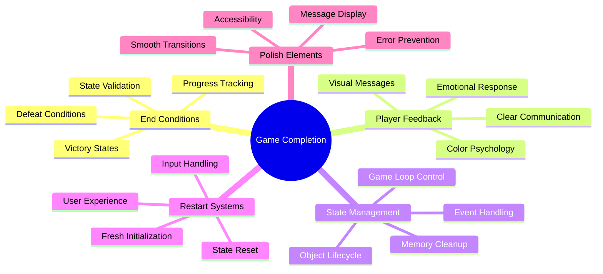
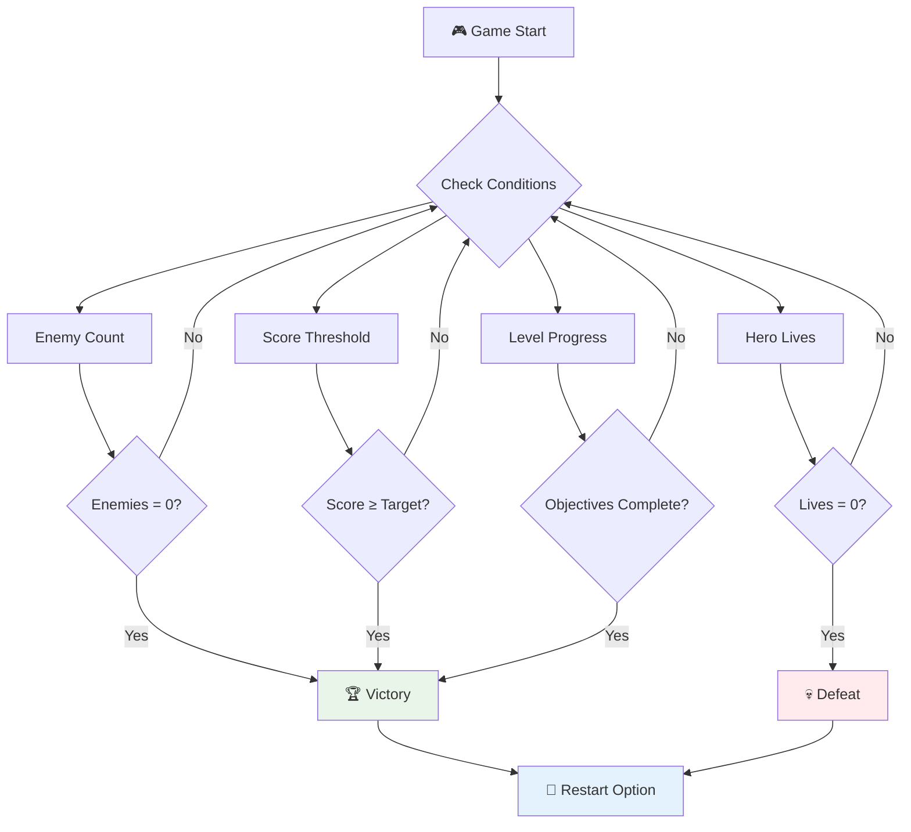
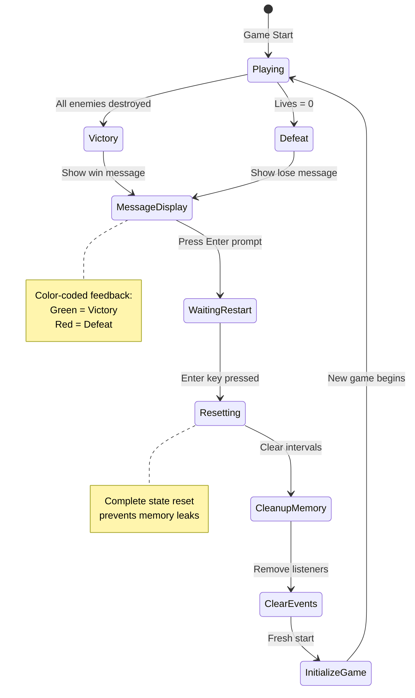
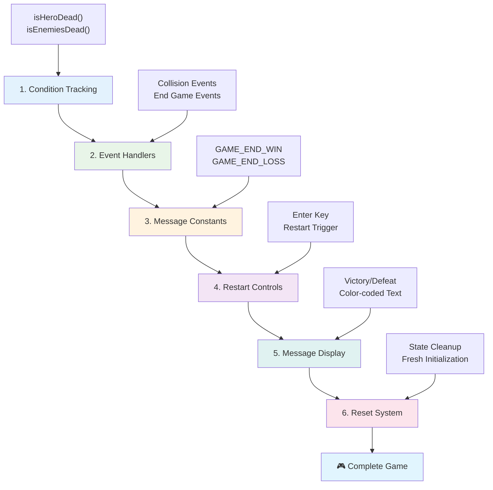
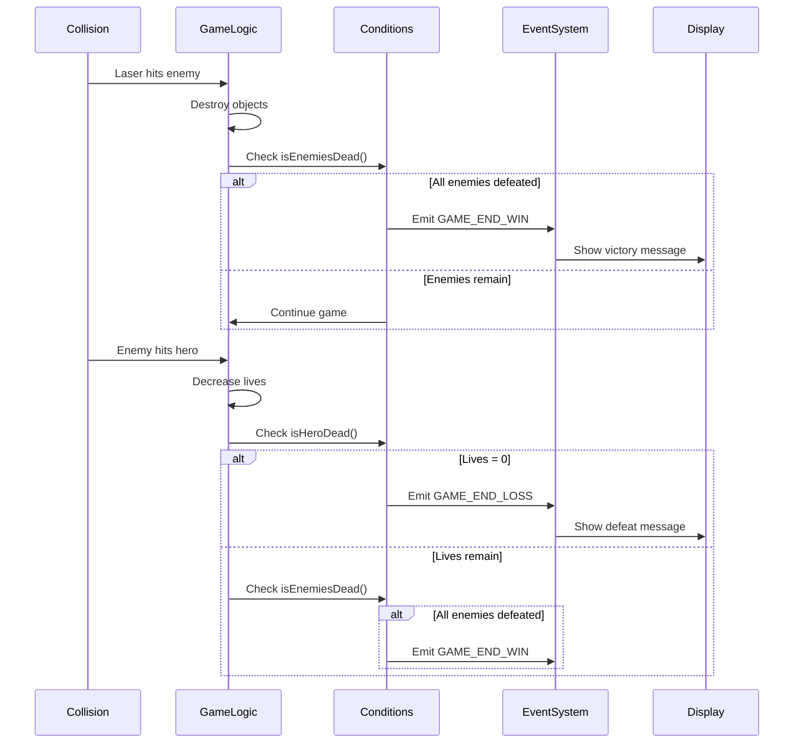
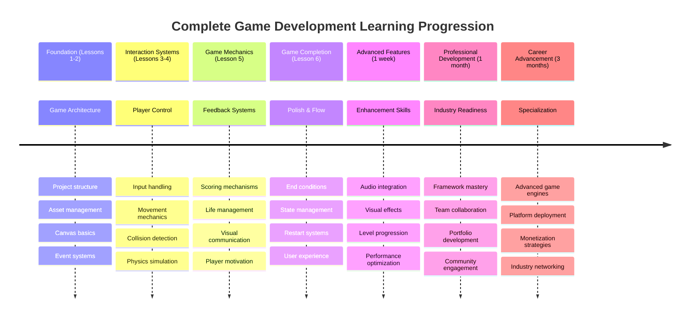

<!--
CO_OP_TRANSLATOR_METADATA:
{
  "original_hash": "a4b78043f4d64bf3ee24e0689b8b391d",
  "translation_date": "2025-11-04T01:40:10+00:00",
  "source_file": "6-space-game/6-end-condition/README.md",
  "language_code": "fi"
}
-->
# Rakenna avaruuspeli osa 6: Loppu ja uudelleenkäynnistys


  
Jokainen loistava peli tarvitsee selkeät loppuehdot ja sujuvan uudelleenkäynnistysmekanismin. Olet rakentanut vaikuttavan avaruuspelin, jossa on liikkumista, taistelua ja pisteiden keräämistä – nyt on aika lisätä viimeiset palaset, jotka tekevät siitä täydellisen.

Pelisi pyörii tällä hetkellä loputtomasti, kuten NASA:n vuonna 1977 laukaisemat Voyager-luotaimet – ne matkustavat yhä avaruudessa vuosikymmeniä myöhemmin. Vaikka tämä sopii avaruustutkimukseen, peleissä tarvitaan selkeitä päätepisteitä, jotta kokemus olisi tyydyttävä.

Tänään toteutamme kunnolliset voitto-/häviöehdot ja uudelleenkäynnistysjärjestelmän. Tämän oppitunnin lopussa sinulla on viimeistelty peli, jonka pelaajat voivat suorittaa ja pelata uudelleen, aivan kuten klassiset arcade-pelit, jotka määrittelivät pelialan.


  
## Ennakkokysely

[Ennakkokysely](https://ff-quizzes.netlify.app/web/quiz/39)

## Pelin loppuehtojen ymmärtäminen

Milloin pelisi pitäisi päättyä? Tämä perustavanlaatuinen kysymys on muokannut pelisuunnittelua jo varhaisesta arcade-aikakaudesta lähtien. Pac-Man päättyy, kun haamut saavat sinut kiinni tai kaikki pisteet on kerätty, kun taas Space Invaders päättyy, kun avaruusolennot saavuttavat pohjan tai kun olet tuhonnut ne kaikki.

Pelintekijänä sinä määrittelet voitto- ja häviöehdot. Avaruuspeliämme varten tässä on todistettuja lähestymistapoja, jotka luovat mukaansatempaavaa pelattavuutta:


  
- **`N` vihollisalusta on tuhottu**: On melko yleistä, että pelin eri tasot jaetaan siten, että sinun täytyy tuhota `N` vihollisalusta päästäksesi tasosta läpi.  
- **Aluksesi on tuhottu**: On varmasti pelejä, joissa häviät pelin, jos aluksesi tuhoutuu. Toinen yleinen lähestymistapa on elämien käsite. Joka kerta, kun aluksesi tuhoutuu, menetät yhden elämän. Kun kaikki elämät on menetetty, peli päättyy.  
- **Olet kerännyt `N` pistettä**: Toinen yleinen loppuehto on pisteiden kerääminen. Miten pisteitä kerätään, on sinun päätettävissäsi, mutta usein pisteitä annetaan erilaisista toiminnoista, kuten vihollisaluksen tuhoamisesta tai esineiden keräämisestä, jotka putoavat, kun ne tuhoutuvat.  
- **Tason suorittaminen**: Tämä voi sisältää useita ehtoja, kuten `X` vihollisaluksen tuhoaminen, `Y` pisteiden kerääminen tai ehkä tietyn esineen kerääminen.  

## Pelin uudelleenkäynnistystoiminnon toteuttaminen

Hyvät pelit kannustavat uudelleenpelattavuuteen sujuvien uudelleenkäynnistysmekanismien avulla. Kun pelaajat suorittavat pelin (tai häviävät), he haluavat usein yrittää uudelleen heti – joko parantaakseen pisteitään tai suoritustaan.


  
Tetris on tästä täydellinen esimerkki: kun palikat saavuttavat huipun, voit aloittaa uuden pelin välittömästi ilman monimutkaisia valikoita. Rakennamme samanlaisen uudelleenkäynnistysjärjestelmän, joka puhdistaa pelitilan ja palauttaa pelaajat nopeasti toimintaan.

✅ **Pohdinta**: Mieti pelejä, joita olet pelannut. Millä ehdoilla ne päättyvät, ja miten sinua kehotetaan aloittamaan uudelleen? Mikä tekee uudelleenkäynnistyskokemuksesta sujuvan verrattuna turhauttavaan?

## Mitä rakennat

Toteutat viimeiset ominaisuudet, jotka muuttavat projektisi täydelliseksi pelikokemukseksi. Nämä elementit erottavat viimeistellyt pelit yksinkertaisista prototyypeistä.

**Tässä mitä lisäämme tänään:**

1. **Voittoehto**: Tuhota kaikki viholliset ja saada kunnollinen juhla (olet ansainnut sen!)  
2. **Häviöehto**: Menettää kaikki elämät ja kohdata tappion ruudulla  
3. **Uudelleenkäynnistysmekanismi**: Paina Enter ja hyppää takaisin peliin – koska yksi peli ei koskaan riitä  
4. **Tilanhallinta**: Puhdas aloitus joka kerta – ei jäljelle jääneitä vihollisia tai outoja häiriöitä edellisestä pelistä  

## Aloittaminen

Valmista kehitysympäristösi. Sinulla pitäisi olla kaikki avaruuspelin tiedostot aiemmista oppitunneista valmiina.

**Projektisi pitäisi näyttää suunnilleen tältä:**

```bash
-| assets
  -| enemyShip.png
  -| player.png
  -| laserRed.png
  -| life.png
-| index.html
-| app.js
-| package.json
```
  
**Käynnistä kehityspalvelin:**

```bash
cd your-work
npm start
```
  
**Tämä komento:**  
- Käynnistää paikallisen palvelimen osoitteessa `http://localhost:5000`  
- Palvelee tiedostosi oikein  
- Päivittää automaattisesti, kun teet muutoksia  

Avaa `http://localhost:5000` selaimessasi ja varmista, että pelisi toimii. Sinun pitäisi pystyä liikkumaan, ampumaan ja vuorovaikuttamaan vihollisten kanssa. Kun tämä on vahvistettu, voimme siirtyä toteutukseen.

> 💡 **Vinkki**: Välttääksesi varoituksia Visual Studio Codessa, määritä `gameLoopId` tiedostosi yläosassa `let gameLoopId;` sen sijaan, että määrittäisit sen `window.onload`-funktion sisällä. Tämä noudattaa modernin JavaScriptin muuttujien määrittämisen parhaita käytäntöjä.


  
## Toteutusvaiheet

### Vaihe 1: Luo loppuehtojen seurantafunktiot

Tarvitsemme funktioita, jotka seuraavat, milloin pelin pitäisi päättyä. Kuten kansainvälisen avaruusaseman sensorit, jotka jatkuvasti tarkkailevat kriittisiä järjestelmiä, nämä funktiot tarkistavat jatkuvasti pelitilaa.

```javascript
function isHeroDead() {
  return hero.life <= 0;
}

function isEnemiesDead() {
  const enemies = gameObjects.filter((go) => go.type === "Enemy" && !go.dead);
  return enemies.length === 0;
}
```
  
**Näin tapahtuu kulissien takana:**  
- **Tarkistaa**, onko sankarimme menettänyt kaikki elämät (auts!)  
- **Laskee**, kuinka monta vihollista on vielä elossa ja toiminnassa  
- **Palauttaa** `true`, kun taistelukenttä on tyhjä vihollisista  
- **Käyttää** yksinkertaista tosi/epätosi-logiikkaa pitääkseen asiat selkeinä  
- **Suodattaa** kaikki pelin objektit löytääkseen selviytyjät  

### Vaihe 2: Päivitä tapahtumakäsittelijät loppuehtoja varten

Nyt yhdistämme nämä ehtojen tarkistukset pelin tapahtumajärjestelmään. Joka kerta, kun törmäys tapahtuu, peli arvioi, aiheuttaako se loppuehdon. Tämä luo välitöntä palautetta kriittisille pelitapahtumille.


  
```javascript
eventEmitter.on(Messages.COLLISION_ENEMY_LASER, (_, { first, second }) => {
    first.dead = true;
    second.dead = true;
    hero.incrementPoints();

    if (isEnemiesDead()) {
      eventEmitter.emit(Messages.GAME_END_WIN);
    }
});

eventEmitter.on(Messages.COLLISION_ENEMY_HERO, (_, { enemy }) => {
    enemy.dead = true;
    hero.decrementLife();
    if (isHeroDead())  {
      eventEmitter.emit(Messages.GAME_END_LOSS);
      return; // loss before victory
    }
    if (isEnemiesDead()) {
      eventEmitter.emit(Messages.GAME_END_WIN);
    }
});

eventEmitter.on(Messages.GAME_END_WIN, () => {
    endGame(true);
});
  
eventEmitter.on(Messages.GAME_END_LOSS, () => {
  endGame(false);
});
```
  
**Mitä täällä tapahtuu:**  
- **Laser osuu viholliseen**: Molemmat katoavat, saat pisteitä, ja tarkistamme, oletko voittanut  
- **Vihollinen osuu sinuun**: Menetät elämän, ja tarkistamme, oletko vielä hengissä  
- **Älykäs järjestys**: Tarkistamme ensin tappion (kukapa haluaisi voittaa ja hävitä samaan aikaan!)  
- **Välittömät reaktiot**: Heti kun jotain tärkeää tapahtuu, peli tietää siitä  

### Vaihe 3: Lisää uusia viestivakioita

Sinun täytyy lisätä uusia viestityyppejä `Messages`-vakio-objektiisi. Nämä vakiot auttavat ylläpitämään johdonmukaisuutta ja estämään kirjoitusvirheitä tapahtumajärjestelmässäsi.

```javascript
GAME_END_LOSS: "GAME_END_LOSS",
GAME_END_WIN: "GAME_END_WIN",
```
  
**Yllä olevassa olemme:**  
- **Lisänneet** vakiot pelin lopputapahtumia varten johdonmukaisuuden ylläpitämiseksi  
- **Käyttäneet** kuvailevia nimiä, jotka selkeästi ilmaisevat tapahtuman tarkoituksen  
- **Noudattaneet** olemassa olevaa viestityyppien nimeämiskäytäntöä  

### Vaihe 4: Toteuta uudelleenkäynnistyksen ohjaimet

Nyt lisäät näppäimistöohjaimet, jotka mahdollistavat pelin uudelleenkäynnistyksen. Enter-näppäin on luonnollinen valinta, koska se yhdistetään usein toiminnan vahvistamiseen ja uusien pelien aloittamiseen.

**Lisää Enter-näppäimen tunnistus olemassa olevaan keydown-tapahtumankuuntelijaasi:**

```javascript
else if(evt.key === "Enter") {
   eventEmitter.emit(Messages.KEY_EVENT_ENTER);
}
```
  
**Lisää uusi viestivakio:**

```javascript
KEY_EVENT_ENTER: "KEY_EVENT_ENTER",
```
  
**Mitä sinun tulee tietää:**  
- **Laajentaa** olemassa olevaa näppäimistötapahtumien käsittelyjärjestelmää  
- **Käyttää** Enter-näppäintä uudelleenkäynnistyskäskynä intuitiivisen käyttäjäkokemuksen vuoksi  
- **Lähettää** mukautetun tapahtuman, jota pelin muut osat voivat kuunnella  
- **Ylläpitää** samaa kaavaa kuin muut näppäimistöohjaimet  

### Vaihe 5: Luo viestien näyttöjärjestelmä

Pelisi tarvitsee selkeän tavan viestiä tulokset pelaajille. Luomme viestijärjestelmän, joka näyttää voitto- ja tappiotilat värikoodatulla tekstillä, kuten varhaisten tietokonejärjestelmien terminaaliliittymissä, joissa vihreä tarkoitti onnistumista ja punainen virheitä.

**Luo `displayMessage()`-funktio:**

```javascript
function displayMessage(message, color = "red") {
  ctx.font = "30px Arial";
  ctx.fillStyle = color;
  ctx.textAlign = "center";
  ctx.fillText(message, canvas.width / 2, canvas.height / 2);
}
```
  
**Askel askeleelta, näin tapahtuu:**  
- **Asettaa** fonttikoon ja -perheen selkeän ja luettavan tekstin vuoksi  
- **Soveltaa** väriparametria, jossa "punainen" on oletusvaroituksille  
- **Keskittää** tekstin vaakasuunnassa ja pystysuunnassa kankaalle  
- **Käyttää** modernin JavaScriptin oletusparametreja joustavien värivaihtoehtojen vuoksi  
- **Hyödyntää** canvas 2D -kontekstia suoraan tekstin renderöintiin  

**Luo `endGame()`-funktio:**

```javascript
function endGame(win) {
  clearInterval(gameLoopId);

  // Set a delay to ensure any pending renders complete
  setTimeout(() => {
    ctx.clearRect(0, 0, canvas.width, canvas.height);
    ctx.fillStyle = "black";
    ctx.fillRect(0, 0, canvas.width, canvas.height);
    if (win) {
      displayMessage(
        "Victory!!! Pew Pew... - Press [Enter] to start a new game Captain Pew Pew",
        "green"
      );
    } else {
      displayMessage(
        "You died !!! Press [Enter] to start a new game Captain Pew Pew"
      );
    }
  }, 200)  
}
```
  
**Mitä tämä funktio tekee:**  
- **Pysäyttää** kaiken paikoilleen – ei enää liikkuvia aluksia tai lasereita  
- **Ottaa** pienen tauon (200 ms), jotta viimeinen ruutu ehtii piirtyä  
- **Pyyhkii** ruudun puhtaaksi ja maalaa sen mustaksi dramaattisen vaikutuksen vuoksi  
- **Näyttää** erilaiset viestit voittajille ja häviäjille  
- **Värikoodaa** uutiset – vihreä hyville uutisille, punainen... no, ei niin hyville  
- **Kertoo** pelaajille, miten hypätä takaisin peliin  

### 🔄 **Pedagoginen välikatsaus**  
**Pelitilan hallinta**: Ennen kuin toteutat uudelleenkäynnistystoiminnon, varmista, että ymmärrät:  
- ✅ Kuinka loppuehdot luovat selkeitä pelitavoitteita  
- ✅ Miksi visuaalinen palaute on tärkeää pelaajan ymmärryksen kannalta  
- ✅ Oikean siivouksen merkitys muistivuotojen estämisessä  
- ✅ Kuinka tapahtumapohjainen arkkitehtuuri mahdollistaa puhtaat tilasiirtymät  

**Nopea itsearviointi**: Mitä tapahtuisi, jos et poistaisi tapahtumankuuntelijoita uudelleenkäynnistyksen aikana?  
*Vastaus: Muistivuodot ja päällekkäiset tapahtumankäsittelijät, jotka aiheuttavat ennakoimatonta käyttäytymistä*  

**Pelisuunnittelun periaatteet**: Toteutat nyt:  
- **Selkeät tavoitteet**: Pelaajat tietävät tarkalleen, mikä määrittää onnistumisen ja epäonnistumisen  
- **Välitön palaute**: Pelitilan muutokset viestitään välittömästi  
- **Käyttäjän hallinta**: Pelaajat voivat käynnistää pelin uudelleen, kun he ovat valmiita  
- **Järjestelmän luotettavuus**: Oikea siivous estää virheet ja suorituskykyongelmat  

### Vaihe 6: Toteuta pelin uudelleenkäynnistystoiminto

Uudelleenkäynnistysjärjestelmän on täysin siivottava nykyinen pelitila ja alustettava uusi pelisessio. Tämä varmistaa, että pelaajat saavat puhtaan aloituksen ilman edellisen pelin jäänteitä.

**Luo `resetGame()`-funktio:**

```javascript
function resetGame() {
  if (gameLoopId) {
    clearInterval(gameLoopId);
    eventEmitter.clear();
    initGame();
    gameLoopId = setInterval(() => {
      ctx.clearRect(0, 0, canvas.width, canvas.height);
      ctx.fillStyle = "black";
      ctx.fillRect(0, 0, canvas.width, canvas.height);
      drawPoints();
      drawLife();
      updateGameObjects();
      drawGameObjects(ctx);
    }, 100);
  }
}
```
  
**Ymmärretään jokainen osa:**  
- **Tarkistaa**, onko pelisilmukka tällä hetkellä käynnissä ennen uudelleenkäynnistystä  
- **Puhdistaa** olemassa olevan pelisilmukan pysäyttääkseen kaiken nykyisen pelitoiminnan  
- **Poistaa** kaikki tapahtumankuuntelijat muistivuotojen estämiseksi  
- **Alustaa** pelitilan uudelleen uusilla objekteilla ja muuttujilla  
- **Käynnistää** uuden pelisilmukan kaikilla olennaisilla pelitoiminnoilla  
- **Ylläpitää** saman 100 ms välin johdonmukaisen pelisuorituskyvyn vuoksi  

**Lisää Enter-näppäimen tapahtumankuuntelija `initGame()`-funktioosi:**

```javascript
eventEmitter.on(Messages.KEY_EVENT_ENTER, () => {
  resetGame();
});
```
  
**Lisää `clear()`-metodi EventEmitter-luokkaasi:**

```javascript
clear() {
  this.listeners = {};
}
```
  
**Tärkeät kohdat muistaa:**  
- **Yhdistää** Enter-näppäimen painalluksen pelin uudelleenkäynnistystoimintoon  
- **Rekisteröi** tämän tapahtumankuuntelijan pelin alustuksen aikana  
- **Tarjoaa** selkeän tavan poistaa kaikki tapahtumankuuntelijat uudelleenkäynnistyksen yhteydessä  
- **Estää** muistivuodot poistamalla tapahtumankäsittelijät pelien välillä  
- **Nollaa** kuuntelijaobjektin tyhjään tilaan uutta aloitusta varten  

## Onnittelut! 🎉  

👽 💥 🚀 Olet onnistuneesti rakentanut täydellisen pelin alusta alkaen. Kuten ohjelmoijat, jotka loivat ensimmäiset videopelit 1970-luvulla, olet muuttanut koodirivejä interaktiiviseksi kokemukseksi, jossa on asianmukaiset pelimekaniikat ja käyttäjäpalaute. 🚀 💥 👽  

**Olet saavuttanut:**  
- **Toteuttanut** täydelliset voitto- ja häviöehdot käyttäjäpalautteella  
- **Luonut** saumattoman uudelleenkäynnistysjärjestelmän jatkuvaa pelaamista varten  
- **Suunnitellut** selkeän visuaalisen viestinnän pelitiloille  
- **Hallinnut** monimutkaisia pelitilan siirtymiä ja siivousta  
- **Koonnut** kaikki komponentit yhtenäiseksi, pelattavaksi peliksi  

### 🔄 **Pedagoginen välikatsaus**  
**Täydellinen pelinkehitysjärjestelmä**: Juhli täyden pelinkehityssyklin hallintaa:  
- ✅ Kuinka loppuehdot luovat tyydyttäviä pelaajakokemuksia?  
- ✅ Miksi oikea tilanhallinta on kriittistä pelin vakauden kannalta?  
- ✅ Kuinka visuaalinen palaute parantaa pelaajan ymmärrystä?  
- ✅ Mikä rooli uudelleenkäynnistysjärjestelmällä on pelaajien sitoutumisen kannalta?  

**Järjestelmän hallinta**: Täydellinen pelisi osoittaa:  
- **Koko pelinkehityksen hallinta**: Grafiikasta syötteisiin ja tilanhallintaan  
- **Ammattimainen arkkitehtuuri**: Tapahtumapohjaiset järjestelmät, jotka skaalautuvat tehokkaasti  
- **Käyttäjäkokemuksen suunnittelu**: Selkeä palaute ja intuitiiviset ohjaimet  
- **Suorituskyvyn optimointi**: Tehokas renderöinti ja muistinhallinta  
- **Viimeistely ja täydellisyys**: Kaikki yksityiskohdat, jotka saavat pelin tuntumaan valmiilta  

**Teollisuusvalmiit taidot**: Olet toteuttanut:  
- **Pelisilmukka-arkkitehtuuri**: Reaaliaikaiset järjestelm
### 🌟 **Kuukauden mittainen pelinkehityksen ura**
- [ ] Rakenna useita valmiita pelejä tutkien eri genrejä ja mekaniikkoja
- [ ] Opettele edistyneitä pelinkehityksen kehyksiä, kuten Phaser tai Three.js
- [ ] Osallistu avoimen lähdekoodin pelinkehitysprojekteihin
- [ ] Tutki pelisuunnittelun periaatteita ja pelaajapsykologiaa
- [ ] Luo portfolio, joka esittelee pelinkehitystaitojasi
- [ ] Yhdistäydy pelinkehitysyhteisön kanssa ja jatka oppimista

## 🎯 Täydellinen pelinkehityksen hallinnan aikajana



### 🛠️ Yhteenveto pelinkehityksen työkalupakistasi

Kun olet suorittanut koko tämän avaruuspeli-sarjan, olet nyt hallinnut:
- **Peliarkkitehtuuri**: Tapahtumapohjaiset järjestelmät, pelisilmukat ja tilanhallinta
- **Grafiikkaohjelmointi**: Canvas API, sprite-renderointi ja visuaaliset efektit
- **Syöttöjärjestelmät**: Näppäimistön käsittely, törmäystunnistus ja responsiiviset ohjaimet
- **Pelisuunnittelu**: Pelaajapalautteet, etenemisjärjestelmät ja sitouttamismekaniikat
- **Suorituskyvyn optimointi**: Tehokas renderointi, muistinhallinta ja ruudunpäivitysnopeuden hallinta
- **Käyttäjäkokemus**: Selkeä viestintä, intuitiiviset ohjaimet ja viimeistely
- **Ammatilliset käytännöt**: Siisti koodi, virheenkorjaustekniikat ja projektin organisointi

**Todelliset sovelluskohteet**: Pelinkehitystaitosi soveltuvat suoraan:
- **Interaktiiviset verkkosovellukset**: Dynaamiset käyttöliittymät ja reaaliaikaiset järjestelmät
- **Datan visualisointi**: Animoidut kaaviot ja interaktiiviset grafiikat
- **Opetusteknologia**: Pelillistäminen ja mukaansatempaavat oppimiskokemukset
- **Mobiilikehitys**: Kosketuspohjaiset vuorovaikutukset ja suorituskyvyn optimointi
- **Simulaatio-ohjelmistot**: Fysiikkamoottorit ja reaaliaikainen mallinnus
- **Luovat alat**: Interaktiivinen taide, viihde ja digitaaliset kokemukset

**Ammatilliset taidot, jotka olet saavuttanut**: Nyt osaat:
- **Suunnitella** monimutkaisia interaktiivisia järjestelmiä alusta alkaen
- **Virheenkorjata** reaaliaikaisia sovelluksia järjestelmällisillä menetelmillä
- **Optimoida** suorituskykyä sujuvan käyttäjäkokemuksen takaamiseksi
- **Suunnitella** mukaansatempaavia käyttöliittymiä ja vuorovaikutusmalleja
- **Tehdä yhteistyötä** tehokkaasti teknisissä projekteissa asianmukaisella koodin organisoinnilla

**Pelinkehityksen käsitteet, jotka olet hallinnut**:
- **Reaaliaikaiset järjestelmät**: Pelisilmukat, ruudunpäivitysnopeuden hallinta ja suorituskyky
- **Tapahtumapohjainen arkkitehtuuri**: Irrotetut järjestelmät ja viestien välitys
- **Tilanhallinta**: Monimutkainen datan käsittely ja elinkaaren hallinta
- **Käyttöliittymäohjelmointi**: Canvas-grafiikka ja responsiivinen suunnittelu
- **Pelisuunnittelun teoria**: Pelaajapsykologia ja sitouttamismekaniikat

**Seuraava taso**: Olet valmis tutkimaan edistyneitä pelinkehityskehyksiä, 3D-grafiikkaa, moninpelijärjestelmiä tai siirtymään ammatillisiin pelinkehitysrooleihin!

🌟 **Saavutus avattu**: Olet suorittanut täydellisen pelinkehitysmatkan ja rakentanut ammattitasoisen interaktiivisen kokemuksen alusta alkaen!

**Tervetuloa pelinkehitysyhteisöön!** 🎮✨

## GitHub Copilot Agent -haaste 🚀

Käytä Agent-tilaa suorittaaksesi seuraavan haasteen:

**Kuvaus:** Paranna avaruuspeliä toteuttamalla tasojen etenemisjärjestelmä, jossa vaikeus ja bonusominaisuudet kasvavat.

**Ohje:** Luo monitasoinen avaruuspeli, jossa jokaisella tasolla on enemmän vihollisaluksia, joiden nopeus ja kestävyys kasvavat. Lisää pistekerroin, joka kasvaa jokaisen tason myötä, ja toteuta voimaesineitä (kuten nopea ampuminen tai kilpi), jotka ilmestyvät satunnaisesti vihollisten tuhoutumisen yhteydessä. Sisällytä tasojen suoritusbonus ja näytä nykyinen taso ruudulla olemassa olevan pistemäärän ja elämien rinnalla.

Lisätietoja [agent-tilasta](https://code.visualstudio.com/blogs/2025/02/24/introducing-copilot-agent-mode) löydät täältä.

## 🚀 Valinnainen parannushaaste

**Lisää ääni peliisi**: Paranna pelikokemusta toteuttamalla äänitehosteita! Harkitse seuraavien äänien lisäämistä:

- **Laserlaukaukset**, kun pelaaja ampuu
- **Vihollisten tuhoaminen**, kun alukset osuvat
- **Sankarin vahingoittuminen**, kun pelaaja ottaa osumia
- **Voittomusiikki**, kun peli voitetaan
- **Tappioääni**, kun peli hävitään

**Äänien toteutusesimerkki:**

```javascript
// Create audio objects
const laserSound = new Audio('assets/laser.wav');
const explosionSound = new Audio('assets/explosion.wav');

// Play sounds during game events
function playLaserSound() {
  laserSound.currentTime = 0; // Reset to beginning
  laserSound.play();
}
```

**Mitä sinun tulee tietää:**
- **Luo** Audio-objekteja eri äänitehosteille
- **Nollaa** `currentTime` mahdollistamaan nopean tulituksen äänitehosteet
- **Käsittelee** selaimen automaattisen toiston käytännöt aktivoimalla äänet käyttäjän vuorovaikutuksesta
- **Hallinnoi** äänenvoimakkuutta ja ajoitusta paremman pelikokemuksen takaamiseksi

> 💡 **Oppimisresurssi**: Tutustu tähän [audio sandboxiin](https://www.w3schools.com/jsref/tryit.asp?filename=tryjsref_audio_play) oppiaksesi lisää äänen toteuttamisesta JavaScript-peleissä.

## Luentojälkeinen kysely

[Luentojälkeinen kysely](https://ff-quizzes.netlify.app/web/quiz/40)

## Kertaus ja itseopiskelu

Tehtäväsi on luoda uusi näytepeli, joten tutustu joihinkin mielenkiintoisiin peleihin ja mieti, millaisen pelin haluaisit rakentaa.

## Tehtävä

[Rakenna näytepeli](assignment.md)

---

**Vastuuvapauslauseke**:  
Tämä asiakirja on käännetty käyttämällä tekoälypohjaista käännöspalvelua [Co-op Translator](https://github.com/Azure/co-op-translator). Vaikka pyrimme tarkkuuteen, huomioithan, että automaattiset käännökset voivat sisältää virheitä tai epätarkkuuksia. Alkuperäinen asiakirja sen alkuperäisellä kielellä tulisi pitää ensisijaisena lähteenä. Kriittisen tiedon osalta suositellaan ammattimaista ihmiskäännöstä. Emme ole vastuussa väärinkäsityksistä tai virhetulkinnoista, jotka johtuvat tämän käännöksen käytöstä.