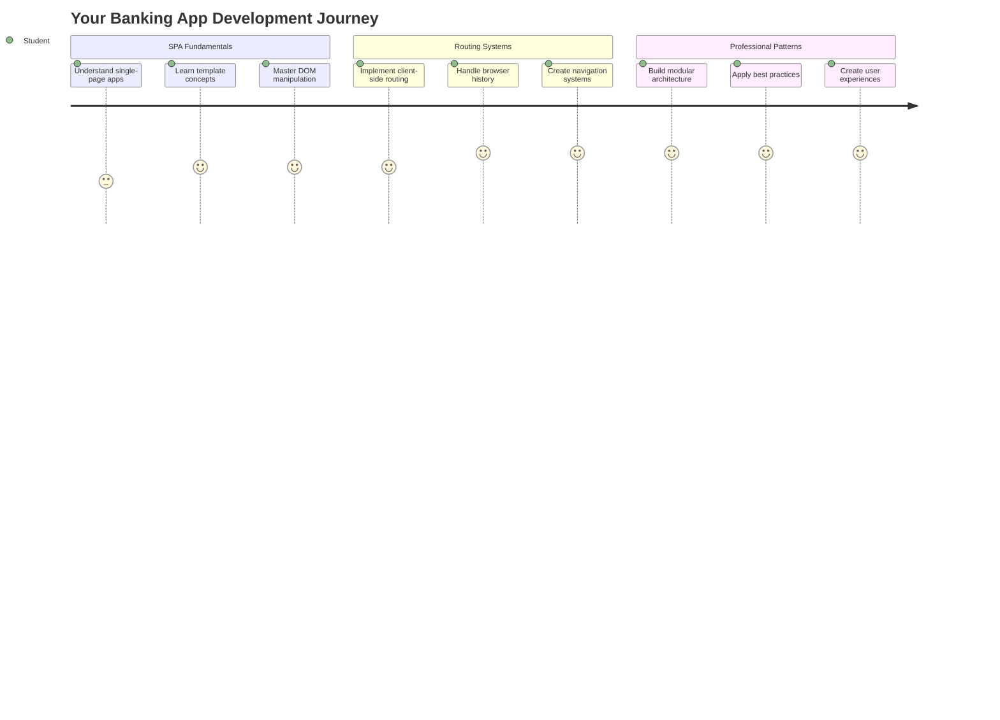
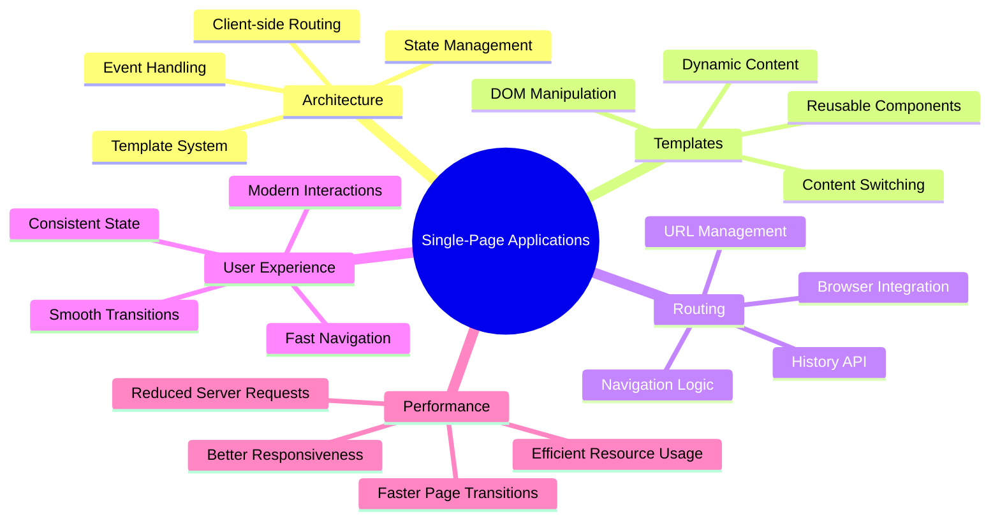
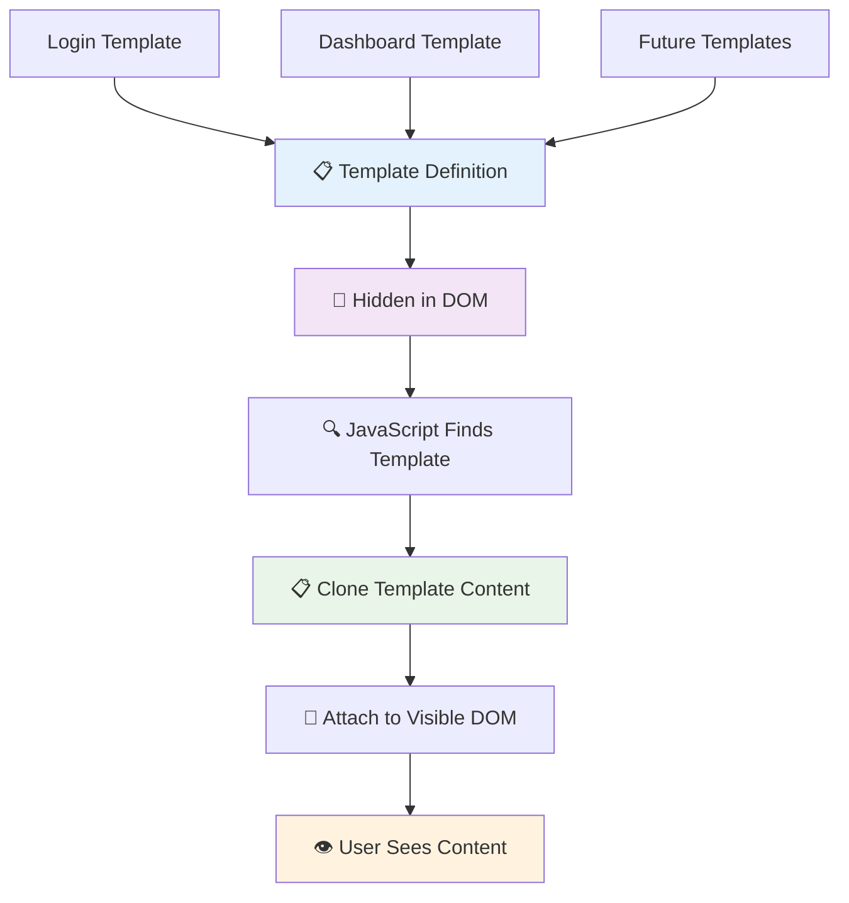
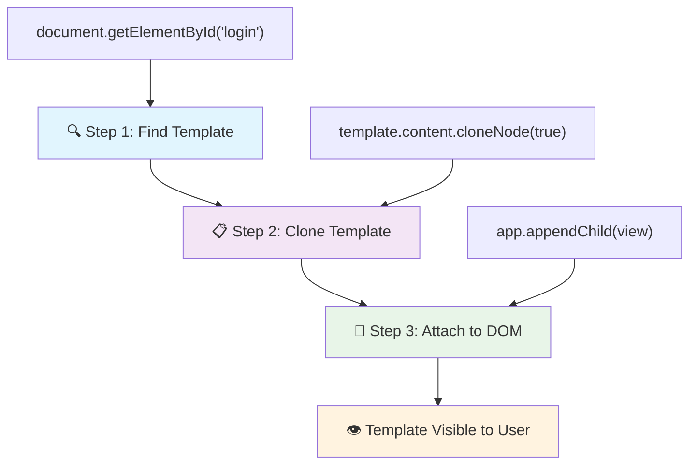
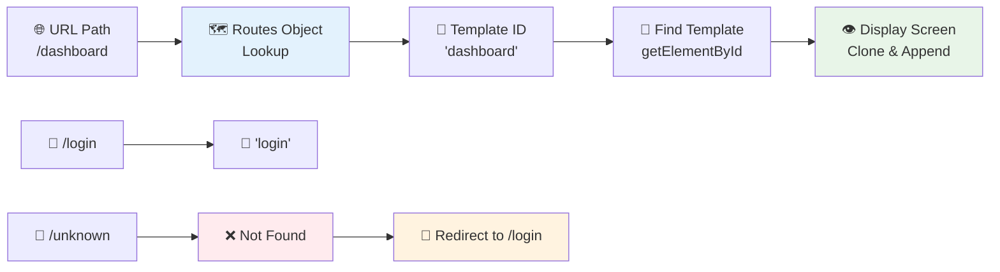
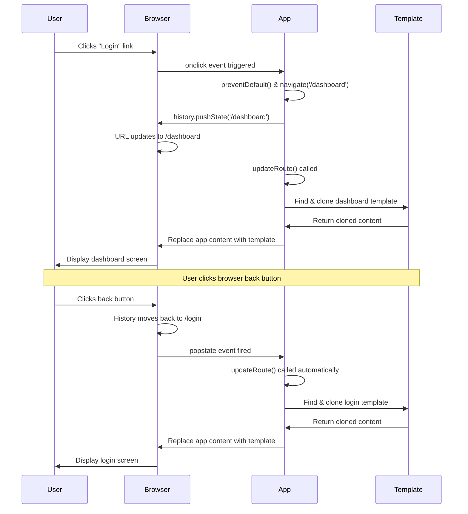
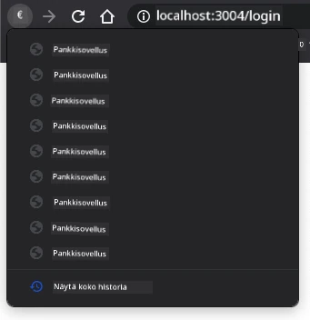
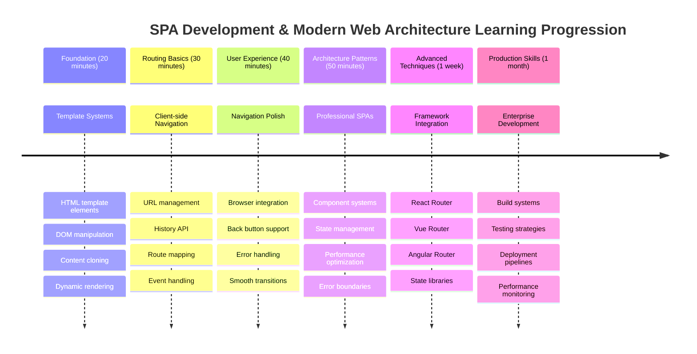

# Rakenna pankkisovellus Osa 1: HTML-mallit ja reitit verkkosovelluksessa



Kun Apollo 11:n ohjaustietokone navigoi kuuhun vuonna 1969, sen täytyi vaihtaa ohjelmien välillä ilman, että koko järjestelmä käynnistettiin uudelleen. Modernit verkkosovellukset toimivat samalla tavalla – ne muuttavat näkymää lataamatta kaikkea alusta asti. Tämä luo sujuvan ja responsiivisen käyttökokemuksen, jota käyttäjät odottavat nykyään.

Toisin kuin perinteiset verkkosivustot, jotka lataavat kokonaisia sivuja jokaisen vuorovaikutuksen yhteydessä, modernit verkkosovellukset päivittävät vain ne osat, jotka tarvitsevat muutosta. Tämä lähestymistapa, aivan kuten ohjauskeskus vaihtaa näyttöjen välillä säilyttäen jatkuvan yhteyden, luo sen sulavan kokemuksen, johon olemme tottuneet.

Tässä on syy, miksi ero on niin merkittävä:

| Perinteiset monisivuiset sovellukset | Modernit yksisivuiset sovellukset |
|-------------------------------------|----------------------------------|
| **Navigointi** | Koko sivun lataus jokaiselle näytölle | Välitön sisällön vaihto |
| **Suorituskyky** | Hitaampi, koska HTML ladataan kokonaan | Nopeampi osittaisilla päivityksillä |
| **Käyttökokemus** | Häiritsevät sivun välähdykset | Sulavat, sovellusmaiset siirtymät |
| **Tietojen jakaminen** | Vaikeaa sivujen välillä | Helppo tilanhallinta |
| **Kehitys** | Useita HTML-tiedostoja ylläpidettäväksi | Yksi HTML dynaamisilla malleilla |

**Evoluution ymmärtäminen:**
- **Perinteiset sovellukset** vaativat palvelinpyyntöjä jokaiselle navigointitoiminnolle
- **Modernit yksisivuiset sovellukset (SPA)** latautuvat kerran ja päivittävät sisältöä dynaamisesti JavaScriptin avulla
- **Käyttäjien odotukset** suosivat välittömiä, saumattomia vuorovaikutuksia
- **Suorituskykyedut** sisältävät pienemmän kaistanleveyden käytön ja nopeammat vastaukset

Tässä oppitunnissa rakennamme pankkisovelluksen, jossa on useita näyttöjä, jotka sulautuvat yhteen saumattomasti. Kuten tiedemiehet käyttävät modulaarisia instrumentteja, joita voidaan muokata eri kokeisiin, käytämme HTML-malleja uudelleenkäytettävinä komponentteina, jotka voidaan näyttää tarpeen mukaan.

Työskentelet HTML-mallien (uudelleenkäytettävät suunnitelmat eri näytöille), JavaScript-reitityksen (järjestelmä, joka vaihtaa näyttöjen välillä) ja selaimen historia-API:n (joka pitää takaisin-painikkeen toiminnassa) kanssa. Nämä ovat samoja perusmenetelmiä, joita käytetään kehyksissä kuten React, Vue ja Angular.

Lopuksi sinulla on toimiva pankkisovellus, joka esittelee ammattimaisia yksisivuisen sovelluksen periaatteita.



## Ennakkokysely

[Ennakkokysely](https://ff-quizzes.netlify.app/web/quiz/41)

### Mitä tarvitset

Tarvitsemme paikallisen verkkopalvelimen testataksemme pankkisovellustamme – älä huoli, se on helpompaa kuin miltä kuulostaa! Jos sinulla ei ole sellaista jo asennettuna, asenna vain [Node.js](https://nodejs.org) ja suorita `npx lite-server` projektikansiostasi. Tämä kätevä komento käynnistää paikallisen palvelimen ja avaa sovelluksesi automaattisesti selaimessa.

### Valmistelu

Luo tietokoneellesi kansio nimeltä `bank` ja sen sisälle tiedosto nimeltä `index.html`. Aloitamme tästä HTML [pohjakoodista](https://en.wikipedia.org/wiki/Boilerplate_code):

```html
<!DOCTYPE html>
<html lang="en">
  <head>
    <meta charset="UTF-8">
    <meta name="viewport" content="width=device-width, initial-scale=1.0">
    <title>Bank App</title>
  </head>
  <body>
    <!-- This is where you'll work -->
  </body>
</html>
```

**Tämä pohjakoodi tarjoaa:**
- **Määrittää** HTML5-dokumentin rakenteen oikealla DOCTYPE-ilmoituksella
- **Konfiguroi** merkistökoodauksen UTF-8:ksi kansainvälisen tekstituen vuoksi
- **Mahdollistaa** responsiivisen suunnittelun viewport-meta-tagin avulla mobiiliyhteensopivuuden vuoksi
- **Asettaa** kuvailevan otsikon, joka näkyy selaimen välilehdessä
- **Luo** siistin runko-osan, jossa rakennamme sovelluksemme

> 📁 **Projektirakenteen esikatselu**
> 
> **Oppitunnin lopussa projektisi sisältää:**
> ```
> bank/
> ├── index.html      <!-- Main HTML with templates -->
> ├── app.js          <!-- Routing and navigation logic -->
> └── style.css       <!-- (Optional for future lessons) -->
> ```
> 
> **Tiedostojen vastuut:**
> - **index.html**: Sisältää kaikki mallit ja tarjoaa sovelluksen rakenteen
> - **app.js**: Käsittelee reititystä, navigointia ja mallien hallintaa
> - **Mallit**: Määrittelee käyttöliittymän kirjautumiselle, hallintapaneelille ja muille näytöille

---

## HTML-mallit

Mallit ratkaisevat perustavanlaatuisen ongelman verkkokehityksessä. Kun Gutenberg keksi irtokirjasinpainamisen 1440-luvulla, hän ymmärsi, että sen sijaan, että kaivertaisi kokonaisia sivuja, hän voisi luoda uudelleenkäytettäviä kirjaimia ja järjestää ne tarpeen mukaan. HTML-mallit toimivat samalla periaatteella – sen sijaan, että luot erillisiä HTML-tiedostoja jokaiselle näytölle, määrittelet uudelleenkäytettäviä rakenteita, jotka voidaan näyttää tarvittaessa.



Ajattele malleja suunnitelmina sovelluksesi eri osille. Aivan kuten arkkitehti luo yhden suunnitelman ja käyttää sitä useita kertoja sen sijaan, että piirtäisi identtisiä huoneita uudelleen, me luomme mallit kerran ja otamme ne käyttöön tarpeen mukaan. Selain pitää nämä mallit piilossa, kunnes JavaScript aktivoi ne.

Jos haluat luoda useita näyttöjä verkkosivulle, yksi ratkaisu olisi luoda yksi HTML-tiedosto jokaista näytettävää näyttöä varten. Tämä ratkaisu tuo kuitenkin mukanaan joitakin hankaluuksia:

- Koko HTML täytyy ladata uudelleen näytön vaihdon yhteydessä, mikä voi olla hidasta.
- Tietojen jakaminen eri näyttöjen välillä on vaikeaa.

Toinen lähestymistapa on käyttää vain yhtä HTML-tiedostoa ja määritellä useita [HTML-malleja](https://developer.mozilla.org/docs/Web/HTML/Element/template) `<template>`-elementin avulla. Malli on uudelleenkäytettävä HTML-lohko, jota selain ei näytä, ja se täytyy ottaa käyttöön ajonaikaisesti JavaScriptin avulla.

### Rakennetaan se

Luomme pankkisovelluksen, jossa on kaksi pääasiallista näyttöä: kirjautumissivu ja hallintapaneeli. Aloitetaan lisäämällä paikkamerkki HTML-runkoon – tämä on paikka, jossa kaikki eri näytöt näkyvät:

```html
<div id="app">Loading...</div>
```

**Tämän paikkamerkin ymmärtäminen:**
- **Luo** säilön, jonka ID on "app", jossa kaikki näytöt näytetään
- **Näyttää** latausviestin, kunnes JavaScript alustaa ensimmäisen näytön
- **Tarjoaa** yhden kiinnityspisteen dynaamiselle sisällölle
- **Mahdollistaa** helpon kohdistamisen JavaScriptillä käyttämällä `document.getElementById()`

> 💡 **Vinkki**: Koska tämän elementin sisältö korvataan, voimme laittaa siihen latausviestin tai -ilmaisimen, joka näkyy sovelluksen latautuessa.

Seuraavaksi lisätään HTML-malli kirjautumissivulle. Toistaiseksi laitamme siihen vain otsikon ja osion, joka sisältää linkin navigointia varten.

```html
<template id="login">
  <h1>Bank App</h1>
  <section>
    <a href="/dashboard">Login</a>
  </section>
</template>
```

**Tämän kirjautumismallin erittely:**
- **Määrittää** mallin ainutlaatuisella tunnisteella "login" JavaScriptin kohdistamista varten
- **Sisältää** pääotsikon, joka luo sovelluksen brändäyksen
- **Sisältää** semanttisen `<section>`-elementin, joka ryhmittelee liittyvän sisällön
- **Tarjoaa** navigointilinkin, joka ohjaa käyttäjät hallintapaneeliin

Lisätään sitten toinen HTML-malli hallintapaneelisivulle. Tämä sivu sisältää eri osioita:

- Otsikko, jossa on otsikko ja uloskirjautumislinkki
- Pankkitilin nykyinen saldo
- Tapahtumien lista, joka näytetään taulukossa

```html
<template id="dashboard">
  <header>
    <h1>Bank App</h1>
    <a href="/login">Logout</a>
  </header>
  <section>
    Balance: 100$
  </section>
  <section>
    <h2>Transactions</h2>
    <table>
      <thead>
        <tr>
          <th>Date</th>
          <th>Object</th>
          <th>Amount</th>
        </tr>
      </thead>
      <tbody></tbody>
    </table>
  </section>
</template>
```

**Ymmärretään hallintapaneelin osat:**
- **Rakentaa** sivun semanttisella `<header>`-elementillä, joka sisältää navigoinnin
- **Näyttää** sovelluksen otsikon johdonmukaisesti näytöillä brändäystä varten
- **Tarjoaa** uloskirjautumislinkin, joka ohjaa takaisin kirjautumissivulle
- **Näyttää** nykyisen tilin saldon omassa osiossaan
- **Järjestää** tapahtumatiedot asianmukaisesti rakennetussa HTML-taulukossa
- **Määrittää** taulukon otsikot päivämäärälle, kohteelle ja summalle
- **Jättää** taulukon rungon tyhjäksi dynaamista sisällön lisäystä varten

> 💡 **Vinkki**: Kun luot HTML-malleja, jos haluat nähdä, miltä ne näyttävät, voit kommentoida `<template>` ja `</template>` rivit ympäröimällä ne `<!-- -->`.

### 🔄 **Pedagoginen tarkistus**
**Mallijärjestelmän ymmärtäminen**: Ennen JavaScriptin toteuttamista varmista, että ymmärrät:
- ✅ Miten mallit eroavat tavallisista HTML-elementeistä
- ✅ Miksi mallit pysyvät piilossa, kunnes JavaScript aktivoi ne
- ✅ Semanttisen HTML-rakenteen merkitys malleissa
- ✅ Miten mallit mahdollistavat uudelleenkäytettävät käyttöliittymäkomponentit

**Nopea itsearviointi**: Mitä tapahtuu, jos poistat `<template>`-tagit HTML:stäsi?
*Vastaus: Sisältö tulee näkyviin heti ja menettää mallitoiminnallisuutensa*

**Arkkitehtuurin edut**: Mallit tarjoavat:
- **Uudelleenkäytettävyyttä**: Yksi määritelmä, useita instansseja
- **Suorituskykyä**: Ei tarpeetonta HTML:n jäsentämistä
- **Ylläpidettävyyttä**: Keskitetty käyttöliittymärakenne
- **Joustavuutta**: Dynaaminen sisällön vaihto

✅ Miksi käytämme `id`-attribuutteja malleissa? Voisimmeko käyttää jotain muuta, kuten luokkia?

## Mallien herättäminen eloon JavaScriptillä

Nyt meidän täytyy tehdä malleista toimivia. Aivan kuten 3D-tulostin ottaa digitaalisen suunnitelman ja luo fyysisen objektin, JavaScript ottaa piilotetut mallit ja luo näkyviä, interaktiivisia elementtejä, joita käyttäjät voivat nähdä ja käyttää.

Prosessi noudattaa kolmea johdonmukaista vaihetta, jotka muodostavat modernin verkkokehityksen perustan. Kun ymmärrät tämän kaavan, tunnistat sen monista kehyksistä ja kirjastoista.

Jos kokeilet nykyistä HTML-tiedostoasi selaimessa, näet, että se jää näyttämään `Loading...`. Tämä johtuu siitä, että meidän täytyy lisätä JavaScript-koodia mallien instansioimiseksi ja näyttämiseksi.

Mallin instansiointi tehdään yleensä kolmessa vaiheessa:

1. Hae mallielementti DOM:sta, esimerkiksi käyttämällä [`document.getElementById`](https://developer.mozilla.org/docs/Web/API/Document/getElementById).
2. Kopioi mallielementti, käyttämällä [`cloneNode`](https://developer.mozilla.org/docs/Web/API/Node/cloneNode).
3. Liitä se DOM:iin näkyvän elementin alle, esimerkiksi käyttämällä [`appendChild`](https://developer.mozilla.org/docs/Web/API/Node/appendChild).



**Prosessin visuaalinen erittely:**
- **Vaihe 1** paikantaa piilotetun mallin DOM-rakenteessa
- **Vaihe 2** luo toimivan kopion, jota voidaan turvallisesti muokata
- **Vaihe 3** lisää kopion näkyvään sivualueeseen
- **Tuloksena** on toimiva näyttö, jonka käyttäjät voivat nähdä ja käyttää

✅ Miksi meidän täytyy kopioida malli ennen sen liittämistä DOM:iin? Mitä luulet tapahtuvan, jos ohitamme tämän vaiheen?

### Tehtävä

Luo uusi tiedosto nimeltä `app.js` projektikansioosi ja tuo tämä tiedosto HTML:n `<head>`-osioon:

```html
<script src="app.js" defer></script>
```

**Tämän skriptin tuonnin ymmärtäminen:**
- **Linkittää** JavaScript-tiedoston HTML-dokumenttiin
- **Käyttää** `defer`-attribuuttia varmistaakseen, että skripti suoritetaan HTML:n jäsentämisen jälkeen
- **Mahdollistaa** pääsyn kaikkiin DOM-elementteihin, koska ne ovat täysin ladattuja ennen skriptin suorittamista
- **Noudattaa** moderneja parhaita käytäntöjä skriptin lataamisessa ja suorituskyvyssä

Nyt `app.js`-tiedostossa luomme uuden funktion `updateRoute`:

```js
function updateRoute(templateId) {
  const template = document.getElementById(templateId);
  const view = template.content.cloneNode(true);
  const app = document.getElementById('app');
  app.innerHTML = '';
  app.appendChild(view);
}
```

**Vaihe vaiheelta, mitä tapahtuu:**
- **Paikantaa** mallielementin sen ainutlaatuisen ID:n avulla
- **Luo** syvän kopion mallin sisällöstä käyttämällä `cloneNode(true)`
- **Löytää** sovellussäilön, jossa sisältö näytetään
- **Tyhjentää** olemassa olevan sisällön sovellussäilöstä
- **Lisää** kopioidun mallisisällön näkyvään DOM:iin

Kutsu nyt tätä funktiota yhdellä mallilla ja katso tulos.

```js
updateRoute('login');
```

**Mitä tämä funktion kutsu tekee:**
- **Aktivoi** kirjautumismallin välittämällä sen ID:n parametrina
- **Havainnollistaa** kuinka ohjelmallisesti vaihdetaan eri sovellusnäyttöjen välillä
- **Näyttää** kirjautumissivun "Loading..."-viestin tilalla

✅ Mikä on tämän koodin tarkoitus `app.innerHTML = '';`? Mitä tapahtuu ilman sitä?

## Reittien luominen

Reititys tarkoittaa käytännössä URL-osoitteiden yhdistämistä oikeaan sisältöön. Mieti, kuinka varhaiset puhelinoperaattorit käyttivät kytkentätauluja yhdistääkseen puhelut – he ottivat vastaan saapuvan pyynnön ja ohjasivat sen oikeaan kohteeseen. Verkkoreititys toimii samalla tavalla, ottaen vastaan URL-pyynnön ja määrittäen, mikä sisältö näytetään.



Perinteisesti verkkopalvelimet hoitivat tämän tarjoamalla eri HTML-tiedostoja eri URL-osoitteille. Koska rakennamme yksisivuista sovellusta, meidän täytyy hoitaa tämä reititys itse JavaScriptillä. Tämä lähestymistapa antaa meille enemmän hallintaa käyttökokemuksesta ja suorituskyvystä.


**Reitityksen kulun ymmärtäminen:**
- **URL-muutokset** käynnistävät haun reittikonfiguraatiossa
- **Kelvolliset reitit** yhdistetään tiettyihin mallien ID:ihin renderöintiä varten
- **Virheelliset reitit** käynnistävät varatoiminnon estääkseen rikkoutuneet tilat
- **Mallien renderöinti** noudattaa aiemmin opittua kolmen vaiheen prosessia

Kun puhutaan verkkosovelluksesta, kutsumme *reititystä* pyrkimykseksi yhdistää **URL-osoitteet** tiettyihin näyttöihin, jotka pitäisi näyttää. Verkkosivustolla, jossa on useita HTML-tiedostoja, tämä tapahtuu automaattisesti, koska tiedostopolut heijastuvat URL-osoitteeseen. Esimerkiksi, jos projektikansiossasi on nämä tiedostot:

```
mywebsite/index.html
mywebsite/login.html
mywebsite/admin/index.html
```

Jos luot verkkopalvelimen, jonka juurena on `mywebsite`, URL-mapping on:

```
https://site.com            --> mywebsite/index.html
https://site.com/login.html --> mywebsite/login.html
https://site.com/admin/     --> mywebsite/admin/index.html
```

Kuitenkin verkkosovelluksessamme käytämme yhtä HTML-tiedostoa, joka sisältää kaikki näytöt, joten tämä oletuskäyttäytyminen ei auta meitä. Meidän täytyy luoda tämä kartta manuaalisesti ja päivittää näytettävä malli JavaScriptin avulla.

### Tehtävä

Käytämme yksinkertaista objektia toteuttaaksemme [kartta](https://en.wikipedia.org/wiki/Associative_array)-yhdistämisen URL-polkujen ja malliemme välillä. Lisää tämä objek
Nyt muokataan hieman `updateRoute`-funktiota. Sen sijaan, että välitämme suoraan `templateId`-argumentin, haluamme ensin hakea sen nykyisestä URL-osoitteesta ja käyttää sitten karttaamme saadaksemme vastaavan template ID -arvon. Voimme käyttää [`window.location.pathname`](https://developer.mozilla.org/docs/Web/API/Location/pathname) saadaksemme vain polkuosan URL-osoitteesta.

```js
function updateRoute() {
  const path = window.location.pathname;
  const route = routes[path];

  const template = document.getElementById(route.templateId);
  const view = template.content.cloneNode(true);
  const app = document.getElementById('app');
  app.innerHTML = '';
  app.appendChild(view);
}
```

**Tässä tapahtuu seuraavaa:**
- **Hakee** nykyisen polun selaimen URL-osoitteesta käyttäen `window.location.pathname`
- **Etsii** vastaavan reittikonfiguraation routes-objektistamme
- **Hakee** template ID:n reittikonfiguraatiosta
- **Seuraa** samaa template-renderöintiprosessia kuin aiemmin
- **Luo** dynaamisen järjestelmän, joka reagoi URL-muutoksiin

Tässä yhdistimme määritetyt reitit vastaaviin templateihin. Voit kokeilla, että se toimii oikein muuttamalla URL-osoitetta manuaalisesti selaimessasi.

✅ Mitä tapahtuu, jos syötät tuntemattoman polun URL-osoitteeseen? Kuinka voisimme ratkaista tämän?

## Navigoinnin lisääminen

Kun reititys on luotu, käyttäjien täytyy pystyä navigoimaan sovelluksessa. Perinteiset verkkosivut lataavat kokonaisia sivuja uudelleen linkkejä klikatessa, mutta me haluamme päivittää sekä URL-osoitteen että sisällön ilman sivun uudelleenlatausta. Tämä luo sujuvamman kokemuksen, joka muistuttaa työpöytäsovellusten näkymien vaihtamista.

Meidän täytyy yhdistää kaksi asiaa: päivittää selaimen URL-osoite, jotta käyttäjät voivat tallentaa sivuja kirjanmerkkeihin ja jakaa linkkejä, sekä näyttää oikea sisältö. Kun tämä toteutetaan oikein, se luo saumattoman navigoinnin, jota nykyaikaisilta sovelluksilta odotetaan.



### 🔄 **Pedagoginen tarkistus**
**Yhden sivun sovelluksen arkkitehtuuri**: Varmista ymmärryksesi koko järjestelmästä:
- ✅ Kuinka asiakaspuolen reititys eroaa perinteisestä palvelinpuolen reitityksestä?
- ✅ Miksi History API on välttämätön toimivan SPA-navigoinnin kannalta?
- ✅ Kuinka templatet mahdollistavat dynaamisen sisällön ilman sivun uudelleenlatausta?
- ✅ Mikä rooli tapahtumien käsittelyllä on navigoinnin ohjaamisessa?

**Järjestelmän integrointi**: SPA-sovelluksesi osoittaa:
- **Template-hallinta**: Uudelleenkäytettävät käyttöliittymäkomponentit dynaamisella sisällöllä
- **Asiakaspuolen reititys**: URL-hallinta ilman palvelinpyyntöjä
- **Tapahtumapohjainen arkkitehtuuri**: Reagoiva navigointi ja käyttäjäinteraktiot
- **Selaimen integrointi**: Oikea historia ja taaksepäin/eteenpäin-painikkeiden tuki
- **Suorituskyvyn optimointi**: Nopeat siirtymät ja vähennetty palvelimen kuormitus

**Ammatilliset käytännöt**: Olet toteuttanut:
- **Mallin ja näkymän erottelu**: Templatet erillään sovelluslogiikasta
- **Tilanhallinta**: URL-tila synkronoitu näytetyn sisällön kanssa
- **Progressiivinen parannus**: JavaScript parantaa perus-HTML:n toiminnallisuutta
- **Käyttäjäkokemus**: Sujuva, sovellusmainen navigointi ilman sivun uudelleenlatausta

> � **Arkkitehtuurin oivallus**: Navigointijärjestelmän komponentit
>
> **Mitä olet rakentamassa:**
> - **🔄 URL-hallinta**: Päivittää selaimen osoiterivin ilman sivun uudelleenlatausta
> - **📋 Template-järjestelmä**: Vaihtaa sisältöä dynaamisesti nykyisen reitin mukaan  
> - **📚 Historian integrointi**: Säilyttää selaimen taaksepäin/eteenpäin-painikkeiden toiminnallisuuden
> - **🛡️ Virheenkäsittely**: Tyylikkäät varajärjestelmät virheellisille tai puuttuville reiteille
>
> **Kuinka komponentit toimivat yhdessä:**
> - **Kuuntelee** navigointitapahtumia (klikkauksia, historiamuutoksia)
> - **Päivittää** URL-osoitteen History API:n avulla
> - **Renderöi** oikean templaten uudelle reitille
> - **Säilyttää** saumattoman käyttäjäkokemuksen koko ajan

Sovelluksemme seuraava askel on lisätä mahdollisuus navigoida sivujen välillä ilman, että URL-osoitetta täytyy muuttaa manuaalisesti. Tämä tarkoittaa kahta asiaa:

  1. Nykyisen URL-osoitteen päivittäminen
  2. Näytettävän templaten päivittäminen uuden URL-osoitteen perusteella

Olemme jo hoitaneet toisen osan `updateRoute`-funktiolla, joten meidän täytyy selvittää, kuinka päivittää nykyinen URL-osoite.

Meidän täytyy käyttää JavaScriptiä ja tarkemmin [`history.pushState`](https://developer.mozilla.org/docs/Web/API/History/pushState), joka mahdollistaa URL-osoitteen päivittämisen ja uuden merkinnän luomisen selaimen historiassa ilman HTML:n uudelleenlatausta.

> ⚠️ **Tärkeä huomautus**: Vaikka HTML:n ankkurielementti [`<a href>`](https://developer.mozilla.org/docs/Web/HTML/Element/a) voi itsessään luoda hyperlinkkejä eri URL-osoitteisiin, se aiheuttaa selaimen HTML:n uudelleenlatauksen oletuksena. Tämä käyttäytyminen täytyy estää, kun käsittelemme reititystä mukautetulla JavaScriptillä, käyttämällä preventDefault()-funktiota klikkaustapahtumassa.

### Tehtävä

Luodaan uusi funktio, jota voimme käyttää navigointiin sovelluksessamme:

```js
function navigate(path) {
  window.history.pushState({}, path, path);
  updateRoute();
}
```

**Ymmärtäen tätä navigointifunktiota:**
- **Päivittää** selaimen URL-osoitteen uuteen polkuun käyttäen `history.pushState`
- **Lisää** uuden merkinnän selaimen historiapinoon taaksepäin/eteenpäin-painikkeiden oikeaa toimintaa varten
- **Käynnistää** `updateRoute()`-funktion näyttääkseen vastaavan templaten
- **Säilyttää** yhden sivun sovelluksen kokemuksen ilman sivun uudelleenlatausta

Tämä menetelmä päivittää ensin nykyisen URL-osoitteen annetun polun perusteella ja sitten päivittää templaten. Ominaisuus `window.location.origin` palauttaa URL-juuren, mikä mahdollistaa täydellisen URL-osoitteen rakentamisen annetusta polusta.

Nyt kun meillä on tämä funktio, voimme ratkaista ongelman, joka syntyy, jos polku ei vastaa mitään määritettyä reittiä. Muokkaamme `updateRoute`-funktiota lisäämällä varajärjestelmän olemassa olevaan reittiin, jos emme löydä vastaavuutta.

```js
function updateRoute() {
  const path = window.location.pathname;
  const route = routes[path];

  if (!route) {
    return navigate('/login');
  }

  const template = document.getElementById(route.templateId);
  const view = template.content.cloneNode(true);
  const app = document.getElementById('app');
  app.innerHTML = '';
  app.appendChild(view);
}
```

**Tärkeät muistettavat kohdat:**
- **Tarkistaa**, onko nykyiselle polulle olemassa reitti
- **Ohjaa** kirjautumissivulle, kun virheellinen reitti avataan
- **Tarjoaa** varajärjestelmän, joka estää rikkoutuneen navigoinnin
- **Varmistaa**, että käyttäjät näkevät aina kelvollisen näkymän, vaikka URL-osoite olisi virheellinen

Jos reittiä ei löydy, ohjaamme nyt käyttäjän `login`-sivulle.

Luodaan nyt funktio, joka hakee URL-osoitteen, kun linkkiä klikataan, ja estää selaimen oletuslinkkikäyttäytymisen:

```js
function onLinkClick(event) {
  event.preventDefault();
  navigate(event.target.href);
}
```

**Tämän klikkauskäsittelijän purkaminen:**
- **Estää** selaimen oletuslinkkikäyttäytymisen käyttäen `preventDefault()`
- **Hakee** kohde-URL-osoitteen klikattavasta linkkielementistä
- **Kutsuu** mukautettua navigate-funktiota sivun uudelleenlatauksen sijaan
- **Säilyttää** sujuvan yhden sivun sovelluksen kokemuksen

```html
<a href="/dashboard" onclick="onLinkClick(event)">Login</a>
...
<a href="/login" onclick="onLinkClick(event)">Logout</a>
```

**Mitä tämä onclick-sidonta saavuttaa:**
- **Yhdistää** jokaisen linkin mukautettuun navigointijärjestelmään
- **Välittää** klikkaustapahtuman `onLinkClick`-funktiolle käsittelyä varten
- **Mahdollistaa** sujuvan navigoinnin ilman sivun uudelleenlatausta
- **Säilyttää** oikean URL-rakenteen, jonka käyttäjät voivat tallentaa kirjanmerkkeihin tai jakaa

[`onclick`](https://developer.mozilla.org/docs/Web/API/GlobalEventHandlers/onclick)-attribuutti sitoo `click`-tapahtuman JavaScript-koodiin, tässä kutsuun `navigate()`-funktiolle.

Kokeile klikkaamalla näitä linkkejä, sinun pitäisi nyt pystyä navigoimaan sovelluksesi eri näkymien välillä.

✅ `history.pushState`-metodi on osa HTML5-standardia ja toteutettu [kaikissa moderneissa selaimissa](https://caniuse.com/?search=pushState). Jos rakennat verkkosovellusta vanhemmille selaimille, voit käyttää tämän API:n sijasta kikkaa: käyttämällä [hash-merkkiä (`#`)](https://en.wikipedia.org/wiki/URI_fragment) ennen polkua voit toteuttaa reitityksen, joka toimii tavallisella ankkurinavigoinnilla eikä lataa sivua uudelleen, sillä sen tarkoitus oli luoda sisäisiä linkkejä sivun sisällä.

## Takaisin- ja eteenpäin-painikkeiden toiminnan varmistaminen

Takaisin- ja eteenpäin-painikkeet ovat olennainen osa verkkoselaamista, aivan kuten NASA:n ohjauskeskus voi tarkastella aiempia järjestelmän tiloja avaruuslentoja varten. Käyttäjät odottavat näiden painikkeiden toimivan, ja kun ne eivät toimi, se rikkoo odotettua selauskokemusta.

Yhden sivun sovelluksemme tarvitsee lisäkonfiguraatiota tukeakseen tätä. Selaimen historia ylläpitää historiapinoa (johon olemme lisänneet merkintöjä `history.pushState`-toiminnolla), mutta kun käyttäjät navigoivat tämän historian läpi, sovelluksemme täytyy reagoida päivittämällä näytetty sisältö vastaavasti.


**Keskeiset vuorovaikutuspisteet:**
- **Käyttäjän toiminnot** käynnistävät navigoinnin klikkauksilla tai selaimen painikkeilla
- **Sovellus sieppaa** linkkiklikkaukset estääkseen sivun uudelleenlatauksen
- **History API** hallitsee URL-muutoksia ja selaimen historiapinoa
- **Templatet** tarjoavat sisältörakenteen jokaiselle näkymälle
- **Tapahtumakuuntelijat** varmistavat, että sovellus reagoi kaikkiin navigointityyppeihin

`history.pushState` luo uusia merkintöjä selaimen navigointihistoriaan. Voit tarkistaa tämän pitämällä *takaisin-painiketta* painettuna selaimessasi, sen pitäisi näyttää jotain tällaista:



Jos yrität klikata takaisin-painiketta muutaman kerran, huomaat, että nykyinen URL-osoite muuttuu ja historia päivittyy, mutta sama template pysyy näytettynä.

Tämä johtuu siitä, että sovellus ei tiedä, että meidän täytyy kutsua `updateRoute()` aina, kun historia muuttuu. Jos tarkastelet [`history.pushState`-dokumentaatiota](https://developer.mozilla.org/docs/Web/API/History/pushState), näet, että jos tila muuttuu - eli siirrymme eri URL-osoitteeseen - [`popstate`](https://developer.mozilla.org/docs/Web/API/Window/popstate_event)-tapahtuma käynnistyy. Käytämme sitä korjataksemme tämän ongelman.

### Tehtävä

Varmistaaksemme, että näytetty template päivitetään, kun selaimen historia muuttuu, liitämme uuden funktion, joka kutsuu `updateRoute()`-funktiota. Teemme tämän `app.js`-tiedoston loppuun:

```js
window.onpopstate = () => updateRoute();
updateRoute();
```

**Ymmärtäen tätä historian integrointia:**
- **Kuuntelee** `popstate`-tapahtumia, jotka tapahtuvat, kun käyttäjät navigoivat selaimen painikkeilla
- **Käyttää** nuolifunktiota tiiviiseen tapahtumakäsittelijän syntaksiin
- **Kutsuu** `updateRoute()`-funktiota automaattisesti aina, kun historiatila muuttuu
- **Alustaa** sovelluksen kutsumalla `updateRoute()`-funktiota, kun sivu latautuu ensimmäistä kertaa
- **Varmistaa**, että oikea template näytetään riippumatta siitä, miten käyttäjät navigoivat

> 💡 **Pro-vinkki**: Käytimme [nuolifunktiota](https://developer.mozilla.org/docs/Web/JavaScript/Reference/Functions/Arrow_functions) täällä `popstate`-tapahtumakäsittelijän määrittämiseen tiiviyden vuoksi, mutta tavallinen funktio toimisi samalla tavalla.

Tässä on lyhyt video nuolifunktioista:

[](https://youtube.com/watch?v=OP6eEbOj2sc "Nuolifunktiot")

> 🎥 Klikkaa yllä olevaa kuvaa katsoaksesi videon nuolifunktioista.

Kokeile nyt käyttää selaimesi takaisin- ja eteenpäin-painikkeita ja tarkista, että näytetty reitti päivittyy oikein tällä kertaa.

### ⚡ **Mitä voit tehdä seuraavan 5 minuutin aikana**
- [ ] Testaa pankkisovelluksesi navigointia selaimen takaisin/eteenpäin-painikkeilla
- [ ] Kokeile syöttää eri URL-osoitteita manuaalisesti osoiteriville testataksesi reititystä
- [ ] Avaa selaimen DevTools ja tarkista, kuinka templatet kloonataan DOM:iin
- [ ] Kokeile lisätä console.log-lauseita seurataksesi reitityksen kulkua

### 🎯 **Mitä voit saavuttaa tämän tunnin aikana**
- [ ] Suorita oppitunnin jälkeinen kysely ja ymmärrä SPA-arkkitehtuurin käsitteet
- [ ] Lisää CSS-tyylit, jotta pankkisovelluksesi templatet näyttävät ammattimaisilta
- [ ] Toteuta 404-virhesivun haaste asianmukaisella virheenkäsittelyllä
- [ ] Luo credits-sivun haaste lisäreititystoiminnolla
- [ ] Lisää lataustilat ja siirtymät template-vaihtojen välillä

### 📅 **Viikon mittainen SPA-kehitysmatka**
- [ ] Viimeistele koko pankkisovellus lomakkeilla, datanhallinnalla ja pysyvyydellä
- [ ] Lisää kehittyneitä reititysominaisuuksia, kuten reittiparametrit ja sisäkkäiset reitit
- [ ] Toteuta navigointisuojat ja autentikointiin perustuva reititys
- [ ] Luo uudelleenkäytettäviä template-komponentteja ja komponenttikirjasto
- [ ] Lisää animaatioita ja siirtymiä sujuvamman käyttäjäkokemuksen saavuttamiseksi
- [ ] Julkaise SPA-sovelluksesi hosting-alustalle ja konfiguroi reititys oikein

### 🌟 **Kuukauden mittainen frontend-arkkitehtuurin hallinta**
- [ ] Rakenna monimutkaisia SPA-sovelluksia moderneilla kehyksillä, kuten React, Vue tai Angular
- [ ] Opettele kehittyneitä tilanhallintamalleja ja kirjastoja
- [ ] Hallitse rakennustyökalut ja kehitystyönkulut SPA-kehityksessä
- [ ] Toteuta progressiivisen verkkosovelluksen ominaisuuksia ja offline-toiminnallisuutta
- [ ] Tutki suorituskyvyn optimointitekniikoita laajamittaisille SPA-sovelluksille
- [ ] Osallistu avoimen lähdekoodin SPA-projekteihin ja jaa tietosi

## 🎯 Yhden sivun sovelluksen hallinnan aikajana



### 🛠️ Yhden sivun sovelluksen kehitystyökalujen yhteenveto

Tämän oppitunnin jälkeen olet hallinnut:
- **Template-arkkitehtuuri**: Uudelleenkäytettävät HTML-komponentit dynaamisella sisällön renderöinnillä
- **Asiakaspuolen reititys**: URL-hallinta ja navigointi ilman sivun uudelleenlatausta
- **Selaimen inte
- **Suunnittele** yksisivuisia sovelluksia, joissa on selkeä vastuunjako  
- **Toteuta** asiakaspuolen reititysjärjestelmiä, jotka skaalautuvat sovelluksen monimutkaisuuden mukaan  
- **Vianmääritys** monimutkaisissa navigointivirroissa selaimen kehitystyökaluilla  
- **Optimoi** sovelluksen suorituskyky tehokkaalla mallien hallinnalla  
- **Suunnittele** käyttäjäkokemuksia, jotka tuntuvat luonnollisilta ja reagoivilta  

**Hallitut frontend-kehityksen käsitteet**:  
- **Komponenttiarkkitehtuuri**: Uudelleenkäytettävät käyttöliittymäkuviot ja mallijärjestelmät  
- **Tilasynkronointi**: URL-tilan hallinta ja selaimen historia  
- **Tapahtumapohjainen ohjelmointi**: Käyttäjän vuorovaikutusten käsittely ja navigointi  
- **Suorituskyvyn optimointi**: Tehokas DOM-manipulointi ja sisällön lataus  
- **Käyttäjäkokemuksen suunnittelu**: Sulavat siirtymät ja intuitiivinen navigointi  

**Seuraava taso**: Olet valmis tutkimaan moderneja frontend-kehyksiä, edistynyttä tilanhallintaa tai rakentamaan monimutkaisia yrityssovelluksia!  

🌟 **Saavutus avattu**: Olet rakentanut ammattimaisen yksisivuisen sovelluksen perustan modernien verkkosovellusarkkitehtuurien avulla!  

---

## GitHub Copilot Agent -haaste 🚀  

Käytä Agent-tilaa suorittaaksesi seuraavan haasteen:  

**Kuvaus:** Paranna pankkisovellusta toteuttamalla virheenkäsittely ja 404-sivupohja virheellisille reiteille, jotta käyttäjäkokemus paranee navigoidessa olemattomille sivuille.  

**Ohje:** Luo uusi HTML-pohja, jonka id on "not-found", ja joka näyttää käyttäjäystävällisen 404-virhesivun tyylillä. Muokkaa sitten JavaScript-reitityksen logiikkaa näyttämään tämä pohja, kun käyttäjät navigoivat virheellisiin URL-osoitteisiin, ja lisää "Mene kotiin" -painike, joka vie takaisin kirjautumissivulle.  

Lisätietoja [agent-tilasta](https://code.visualstudio.com/blogs/2025/02/24/introducing-copilot-agent-mode) löytyy täältä.  

## 🚀 Haaste  

Lisää uusi pohja ja reitti kolmannelle sivulle, joka näyttää sovelluksen tekijätiedot.  

**Haasteen tavoitteet:**  
- **Luo** uusi HTML-pohja, jossa on asianmukainen sisältörakenne  
- **Lisää** uusi reitti reittien konfiguraatio-objektiin  
- **Sisällytä** navigointilinkit tekijätietosivulle ja takaisin  
- **Testaa**, että kaikki navigointi toimii oikein selaimen historiassa  

## Luentojälkeinen kysely  

[Luentojälkeinen kysely](https://ff-quizzes.netlify.app/web/quiz/42)  

## Katsaus ja itseopiskelu  

Reititys on yksi yllättävän haastavista osista verkkokehityksessä, erityisesti kun verkkosovellukset siirtyvät sivun päivityskäyttäytymisestä yksisivuisten sovellusten päivityksiin. Lue hieman siitä, [miten Azure Static Web App -palvelu](https://docs.microsoft.com/azure/static-web-apps/routes/?WT.mc_id=academic-77807-sagibbon) käsittelee reititystä. Voitko selittää, miksi jotkut dokumentissa kuvatut päätökset ovat välttämättömiä?  

**Lisäoppimateriaalit:**  
- **Tutki**, miten suositut kehykset, kuten React Router ja Vue Router, toteuttavat asiakaspuolen reititystä  
- **Tutki** hash-pohjaisen reitityksen ja history API -reitityksen eroja  
- **Opi** palvelinpuolen renderöinnistä (SSR) ja sen vaikutuksesta reititysstrategioihin  
- **Tutki**, miten progressiiviset verkkosovellukset (PWA:t) käsittelevät reititystä ja navigointia  

## Tehtävä  

[Paranna reititystä](assignment.md)  

---

**Vastuuvapauslauseke**:  
Tämä asiakirja on käännetty käyttämällä tekoälypohjaista käännöspalvelua [Co-op Translator](https://github.com/Azure/co-op-translator). Vaikka pyrimme tarkkuuteen, huomioithan, että automaattiset käännökset voivat sisältää virheitä tai epätarkkuuksia. Alkuperäistä asiakirjaa sen alkuperäisellä kielellä tulisi pitää ensisijaisena lähteenä. Tärkeää tietoa varten suositellaan ammattimaista ihmiskäännöstä. Emme ole vastuussa väärinkäsityksistä tai virhetulkinnoista, jotka johtuvat tämän käännöksen käytöstä.