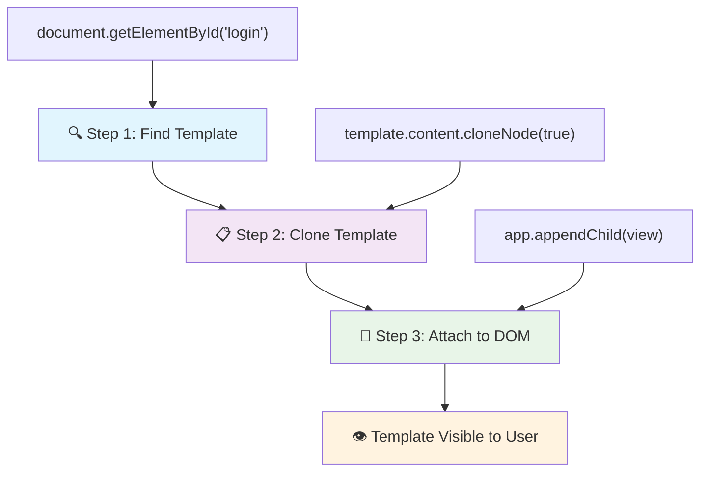
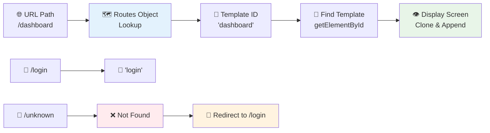
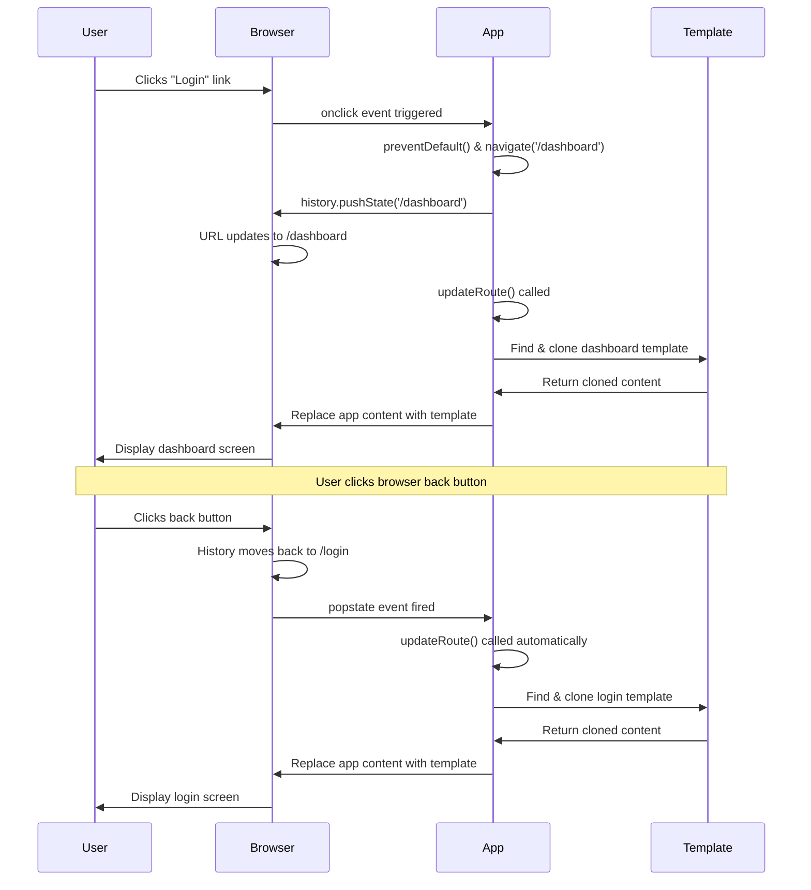

<!--
CO_OP_TRANSLATOR_METADATA:
{
  "original_hash": "5d259f6962464ad91e671083aa0398f4",
  "translation_date": "2025-10-23T00:34:56+00:00",
  "source_file": "7-bank-project/1-template-route/README.md",
  "language_code": "fi"
}
-->
# Rakenna pankkisovellus Osa 1: HTML-mallit ja reitit verkkosovelluksessa

Kun Apollo 11:n ohjaustietokone navigoi kuuhun vuonna 1969, sen täytyi vaihtaa ohjelmien välillä ilman, että koko järjestelmä käynnistettiin uudelleen. Modernit verkkosovellukset toimivat samalla tavalla – ne muuttavat näytettävää sisältöä ilman, että kaikki ladataan uudelleen alusta. Tämä luo sujuvan ja responsiivisen käyttökokemuksen, jota käyttäjät nykyään odottavat.

Toisin kuin perinteiset verkkosivustot, jotka lataavat koko sivun uudelleen jokaisen vuorovaikutuksen yhteydessä, modernit verkkosovellukset päivittävät vain ne osat, jotka tarvitsevat muutosta. Tämä lähestymistapa, aivan kuten lennonjohto vaihtaa näyttöjä säilyttäen jatkuvan yhteyden, luo sen sulavan kokemuksen, johon olemme tottuneet.

Tässä on syy, miksi ero on niin merkittävä:

| Perinteiset monisivuiset sovellukset | Modernit yksisivuiset sovellukset |
|-------------------------------------|----------------------------------|
| **Navigointi** | Koko sivun lataus jokaiselle näytölle | Välitön sisällön vaihto |
| **Suorituskyky** | Hitaampi, koska HTML ladataan kokonaan | Nopeampi osittaisilla päivityksillä |
| **Käyttökokemus** | Häiritsevät sivun välähdykset | Sulavat, sovellusmaiset siirtymät |
| **Tietojen jakaminen** | Vaikeaa sivujen välillä | Helppo tilanhallinta |
| **Kehitys** | Useita HTML-tiedostoja ylläpidettäväksi | Yksi HTML dynaamisilla malleilla |

**Evoluution ymmärtäminen:**
- **Perinteiset sovellukset** vaativat palvelinpyyntöjä jokaiselle navigointitoiminnolle
- **Modernit SPA:t** latautuvat kerran ja päivittävät sisältöä dynaamisesti JavaScriptin avulla
- **Käyttäjien odotukset** suosivat nyt välittömiä, saumattomia vuorovaikutuksia
- **Suorituskykyedut** sisältävät pienemmän kaistanleveyden käytön ja nopeammat vastaukset

Tässä oppitunnissa rakennamme pankkisovelluksen, jossa on useita näyttöjä, jotka sulautuvat yhteen saumattomasti. Kuten tiedemiehet käyttävät modulaarisia instrumentteja, joita voidaan konfiguroida eri kokeisiin, käytämme HTML-malleja uudelleenkäytettävinä komponentteina, jotka voidaan näyttää tarpeen mukaan.

Työskentelet HTML-mallien (uudelleenkäytettävät suunnitelmat eri näytöille), JavaScript-reitityksen (järjestelmä, joka vaihtaa näyttöjen välillä) ja selaimen historia-API:n (joka pitää takaisin-painikkeen toiminnassa) kanssa. Nämä ovat samoja perusmenetelmiä, joita käytetään esimerkiksi React-, Vue- ja Angular-kehyksissä.

Lopuksi sinulla on toimiva pankkisovellus, joka demonstroi ammattimaisia yksisivuisen sovelluksen periaatteita.

## Ennakkokysely

[Ennakkokysely](https://ff-quizzes.netlify.app/web/quiz/41)

### Mitä tarvitset

Tarvitsemme paikallisen verkkopalvelimen testataksemme pankkisovellustamme – älä huoli, se on helpompaa kuin miltä kuulostaa! Jos sinulla ei ole vielä sellaista, asenna [Node.js](https://nodejs.org) ja suorita `npx lite-server` projektikansiossasi. Tämä kätevä komento käynnistää paikallisen palvelimen ja avaa sovelluksesi automaattisesti selaimessa.

### Valmistelu

Luo tietokoneellesi kansio nimeltä `bank` ja sen sisälle tiedosto nimeltä `index.html`. Aloitamme tästä HTML [pohjasta](https://en.wikipedia.org/wiki/Boilerplate_code):

```html
<!DOCTYPE html>
<html lang="en">
  <head>
    <meta charset="UTF-8">
    <meta name="viewport" content="width=device-width, initial-scale=1.0">
    <title>Bank App</title>
  </head>
  <body>
    <!-- This is where you'll work -->
  </body>
</html>
```

**Tämä pohja tarjoaa seuraavaa:**
- **Määrittää** HTML5-dokumentin rakenteen oikealla DOCTYPE-määrittelyllä
- **Konfiguroi** merkistökoodauksen UTF-8:ksi kansainvälisen tekstituen takaamiseksi
- **Mahdollistaa** responsiivisen suunnittelun viewport-meta-tagin avulla mobiiliyhteensopivuuden vuoksi
- **Asettaa** kuvailevan otsikon, joka näkyy selaimen välilehdessä
- **Luo** selkeän body-osan, johon rakennamme sovelluksemme

> 📁 **Projektirakenteen esikatselu**
> 
> **Oppitunnin lopussa projektisi sisältää:**
> ```
> bank/
> ├── index.html      <!-- Main HTML with templates -->
> ├── app.js          <!-- Routing and navigation logic -->
> └── style.css       <!-- (Optional for future lessons) -->
> ```
> 
> **Tiedostojen vastuut:**
> - **index.html**: Sisältää kaikki mallit ja tarjoaa sovelluksen rakenteen
> - **app.js**: Käsittelee reititystä, navigointia ja mallien hallintaa
> - **Mallit**: Määrittelevät käyttöliittymän kirjautumiselle, hallintapaneelille ja muille näytöille

---

## HTML-mallit

Mallit ratkaisevat perustavanlaatuisen ongelman verkkokehityksessä. Kun Gutenberg keksi irtokirjasimet 1440-luvulla, hän ymmärsi, että sen sijaan, että kaivertaisi kokonaisia sivuja, hän voisi luoda uudelleenkäytettäviä kirjaimia ja järjestää ne tarpeen mukaan. HTML-mallit toimivat samalla periaatteella – sen sijaan, että luot erillisiä HTML-tiedostoja jokaiselle näytölle, määrittelet uudelleenkäytettäviä rakenteita, jotka voidaan näyttää tarpeen mukaan.

Ajattele malleja suunnitelmina sovelluksesi eri osille. Aivan kuten arkkitehti luo yhden suunnitelman ja käyttää sitä useita kertoja sen sijaan, että piirtäisi identtisiä huoneita uudelleen, me luomme mallit kerran ja otamme ne käyttöön tarpeen mukaan. Selain pitää nämä mallit piilossa, kunnes JavaScript aktivoi ne.

Jos haluat luoda useita näyttöjä verkkosivulle, yksi ratkaisu olisi luoda yksi HTML-tiedosto jokaiselle näytölle, jonka haluat näyttää. Tämä ratkaisu tuo kuitenkin mukanaan joitakin hankaluuksia:

- Koko HTML-tiedosto täytyy ladata uudelleen näytön vaihtuessa, mikä voi olla hidasta.
- Tietojen jakaminen eri näyttöjen välillä on vaikeaa.

Toinen lähestymistapa on käyttää vain yhtä HTML-tiedostoa ja määritellä useita [HTML-malleja](https://developer.mozilla.org/docs/Web/HTML/Element/template) `<template>`-elementin avulla. Malli on uudelleenkäytettävä HTML-lohko, jota selain ei näytä, ja joka täytyy ottaa käyttöön ajonaikaisesti JavaScriptin avulla.

### Rakennetaan se

Luomme pankkisovelluksen, jossa on kaksi pääasiallista näyttöä: kirjautumissivu ja hallintapaneeli. Aloitetaan lisäämällä paikkamerkki HTML-bodyyn – tämä on paikka, jossa kaikki eri näytöt näkyvät:

```html
<div id="app">Loading...</div>
```

**Ymmärrä tämä paikkamerkki:**
- **Luo** säiliön, jonka ID on "app", ja jossa kaikki näytöt näytetään
- **Näyttää** latausviestin, kunnes JavaScript alustaa ensimmäisen näytön
- **Tarjoaa** yhden kiinnityspisteen dynaamiselle sisällölle
- **Mahdollistaa** helpon kohdistamisen JavaScriptillä käyttämällä `document.getElementById()`

> 💡 **Vinkki**: Koska tämän elementin sisältö korvataan, voimme laittaa siihen latausviestin tai -ilmaisimen, joka näkyy sovelluksen latautuessa.

Seuraavaksi lisätään HTML-malli kirjautumissivulle. Toistaiseksi laitamme siihen vain otsikon ja osion, joka sisältää linkin, jota käytämme navigointiin.

```html
<template id="login">
  <h1>Bank App</h1>
  <section>
    <a href="/dashboard">Login</a>
  </section>
</template>
```

**Tämän kirjautumismallin erittely:**
- **Määrittää** mallin, jolla on yksilöllinen tunniste "login" JavaScriptin kohdistamista varten
- **Sisältää** pääotsikon, joka luo sovelluksen brändäyksen
- **Sisältää** semanttisen `<section>`-elementin, joka ryhmittelee liittyvän sisällön
- **Tarjoaa** navigointilinkin, joka ohjaa käyttäjät hallintapaneeliin

Lisätään sitten toinen HTML-malli hallintapaneelin sivulle. Tämä sivu sisältää eri osioita:

- Otsikko, jossa on otsikko ja uloskirjautumislinkki
- Pankkitilin nykyinen saldo
- Lista tapahtumista, jotka näytetään taulukossa

```html
<template id="dashboard">
  <header>
    <h1>Bank App</h1>
    <a href="/login">Logout</a>
  </header>
  <section>
    Balance: 100$
  </section>
  <section>
    <h2>Transactions</h2>
    <table>
      <thead>
        <tr>
          <th>Date</th>
          <th>Object</th>
          <th>Amount</th>
        </tr>
      </thead>
      <tbody></tbody>
    </table>
  </section>
</template>
```

**Ymmärretään hallintapaneelin osat:**
- **Rakentaa** sivun semanttisella `<header>`-elementillä, joka sisältää navigoinnin
- **Näyttää** sovelluksen otsikon johdonmukaisesti näytöillä brändäystä varten
- **Tarjoaa** uloskirjautumislinkin, joka ohjaa takaisin kirjautumissivulle
- **Näyttää** nykyisen tilin saldon omassa osiossaan
- **Järjestää** tapahtumatiedot asianmukaisesti rakennetussa HTML-taulukossa
- **Määrittää** taulukon otsikot päivämäärälle, kohteelle ja summalle
- **Jättää** taulukon rungon tyhjäksi dynaamista sisällön lisäystä varten

> 💡 **Vinkki**: Kun luot HTML-malleja, jos haluat nähdä, miltä ne näyttävät, voit kommentoida `<template>` ja `</template>`-rivien ympärille `<!-- -->`.

✅ Miksi luulet, että käytämme `id`-attribuutteja malleissa? Voisimmeko käyttää jotain muuta, kuten luokkia?

## Mallien herättäminen eloon JavaScriptillä

Nyt meidän täytyy tehdä malleista toimivia. Aivan kuten 3D-tulostin ottaa digitaalisen suunnitelman ja luo fyysisen objektin, JavaScript ottaa piilotetut mallit ja luo näkyviä, interaktiivisia elementtejä, joita käyttäjät voivat nähdä ja käyttää.

Prosessi noudattaa kolmea johdonmukaista vaihetta, jotka muodostavat modernin verkkokehityksen perustan. Kun ymmärrät tämän kaavan, tunnistat sen monista kehyksistä ja kirjastoista.

Jos kokeilet nykyistä HTML-tiedostoasi selaimessa, huomaat, että se jää näyttämään `Loading...`. Tämä johtuu siitä, että meidän täytyy lisätä JavaScript-koodia mallien instanssoimiseksi ja näyttämiseksi.

Mallin instanssointi tehdään yleensä kolmessa vaiheessa:

1. Haetaan mallielementti DOM:sta, esimerkiksi [`document.getElementById`](https://developer.mozilla.org/docs/Web/API/Document/getElementById)-metodilla.
2. Kopioidaan mallielementti [`cloneNode`](https://developer.mozilla.org/docs/Web/API/Node/cloneNode)-metodilla.
3. Liitetään se DOM:iin näkyvän elementin alle, esimerkiksi [`appendChild`](https://developer.mozilla.org/docs/Web/API/Node/appendChild)-metodilla.



**Prosessin visuaalinen erittely:**
- **Vaihe 1** löytää piilotetun mallin DOM-rakenteesta
- **Vaihe 2** luo toimivan kopion, jota voidaan turvallisesti muokata
- **Vaihe 3** lisää kopion näkyvään sivualueeseen
- **Tuloksena** on toimiva näyttö, jonka käyttäjät voivat nähdä ja käyttää

✅ Miksi meidän täytyy kopioida malli ennen sen liittämistä DOM:iin? Mitä luulet tapahtuvan, jos jättäisimme tämän vaiheen väliin?

### Tehtävä

Luo uusi tiedosto nimeltä `app.js` projektikansioosi ja tuo tämä tiedosto HTML-tiedoston `<head>`-osioon:

```html
<script src="app.js" defer></script>
```

**Ymmärrä tämä skriptin tuonti:**
- **Linkittää** JavaScript-tiedoston HTML-dokumenttiin
- **Käyttää** `defer`-attribuuttia varmistaakseen, että skripti suoritetaan HTML:n jäsentelyn jälkeen
- **Mahdollistaa** pääsyn kaikkiin DOM-elementteihin, koska ne ovat täysin ladattuja ennen skriptin suorittamista
- **Noudattaa** moderneja parhaita käytäntöjä skriptin lataamisessa ja suorituskyvyssä

Nyt `app.js`-tiedostossa luomme uuden funktion nimeltä `updateRoute`:

```js
function updateRoute(templateId) {
  const template = document.getElementById(templateId);
  const view = template.content.cloneNode(true);
  const app = document.getElementById('app');
  app.innerHTML = '';
  app.appendChild(view);
}
```

**Vaihe vaiheelta, mitä tapahtuu:**
- **Löytää** mallielementin sen yksilöllisen ID:n avulla
- **Luo** syväkopion mallin sisällöstä käyttämällä `cloneNode(true)`-metodia
- **Etsii** sovellussäiliön, jossa sisältö näytetään
- **Tyhjentää** olemassa olevan sisällön sovellussäiliöstä
- **Lisää** kopioidun mallisisällön näkyvään DOM:iin

Nyt kutsu tätä funktiota yhdellä mallilla ja katso tulos.

```js
updateRoute('login');
```

**Mitä tämä funktiokutsu tekee:**
- **Aktivoi** kirjautumismallin välittämällä sen ID:n parametrina
- **Havainnollistaa** kuinka ohjelmallisesti vaihdetaan eri sovellusnäyttöjen välillä
- **Näyttää** kirjautumisnäytön "Loading..."-viestin tilalla

✅ Mikä on tämän koodin tarkoitus `app.innerHTML = '';`? Mitä tapahtuu ilman sitä?

## Reittien luominen

Reititys tarkoittaa pohjimmiltaan URL-osoitteiden yhdistämistä oikeaan sisältöön. Mieti, kuinka varhaiset puhelinoperaattorit käyttivät kytkentätauluja puheluiden yhdistämiseen – he ottivat saapuvan pyynnön ja ohjasivat sen oikeaan kohteeseen. Verkkoreititys toimii samalla tavalla, ottaen URL-pyynnön ja määrittäen, mikä sisältö näytetään.

Perinteisesti verkkopalvelimet hoitivat tämän tarjoamalla eri HTML-tiedostoja eri URL-osoitteille. Koska rakennamme yksisivuista sovellusta, meidän täytyy hoitaa tämä reititys itse JavaScriptillä. Tämä lähestymistapa antaa meille enemmän hallintaa käyttökokemukseen ja suorituskykyyn.



**Reitityksen kulun ymmärtäminen:**
- **URL-muutokset** käynnistävät haun reittikonfiguraatiossa
- **Kelvolliset reitit** yhdistetään tiettyihin mallien ID-tunnisteisiin
- **Virheelliset reitit** käynnistävät varatoiminnon estääkseen virhetilanteet
- **Mallien renderöinti** noudattaa aiemmin opittua kolmen vaiheen prosessia

Kun puhumme verkkosovelluksesta, kutsumme *reititykseksi* tarkoitusta yhdistää **URL-osoitteet** tiettyihin näyttöihin, jotka pitäisi näyttää. Verkkosivustolla, jossa on useita HTML-tiedostoja, tämä tapahtuu automaattisesti, koska tiedostopolut heijastuvat URL-osoitteeseen. Esimerkiksi, jos projektikansiossasi on nämä tiedostot:

```
mywebsite/index.html
mywebsite/login.html
mywebsite/admin/index.html
```

Jos luot verkkopalvelimen, jonka juurena on `mywebsite`, URL-mapping on:

```
https://site.com            --> mywebsite/index.html
https://site.com/login.html --> mywebsite/login.html
https://site.com/admin/     --> mywebsite/admin/index.html
```

Kuitenkin, koska verkkosovelluksemme käyttää yhtä HTML-tiedostoa, joka sisältää kaikki näytöt, tämä oletuskäyttäytyminen ei auta meitä. Meidän täytyy luoda tämä kartta manuaalisesti ja päivittää näytettävä malli JavaScriptin avulla.

### Tehtävä

Käytämme yksinkertaista objektia toteuttaaksemme [kartoituksen](https://en.wikipedia.org/wiki/Associative_array) URL-polkujen ja mallien välillä. Lisää tämä objekti `app.js`-tiedoston alkuun.

```js
const routes = {
  '/login': { templateId: 'login' },
  '/dashboard': { templateId: 'dashboard' },
};
```

**Ymmärrä tämä reittikonfiguraatio:**
- **Määrittää** kartoituksen URL-polkujen ja mallien tunnisteiden välillä
- **Käyttää** objektisyntaksia, jossa avaimet ovat URL-polkuja ja arvot sisältävät mallien tiedot
- **Mahdollistaa** helpon haun siitä, mikä malli näytetään millekin URL-polulle
- **Tarjoaa** skaalautuvan rakenteen uusien reittien lisäämiseen tulevaisuudessa

Nyt muokataan hieman `updateRoute`-funktiota. Sen sijaan, että välitämme suoraan `templateId`-tunnisteen argumenttina, haluamme ensin tarkistaa nykyisen URL-osoitteen ja käyttää karttaamme saadaksemme vastaavan mallin ID-arvon. Voimme käyttää [`window.location.pathname`](https://developer.mozilla.org/docs/Web/API/Location/pathname)-metodia saadaksemme vain polkuosan URL-osoitteesta.

```js
function updateRoute() {
  const path = window.location.pathname;
  const route = routes[path];

  const template = document.getElementById(route.templateId);
  const view = template.content.cloneNode(true);
  const app = document.getElementById('app');
  app.innerHTML = '';
  app.appendChild(view);
}
```

**Mitä tässä tapahtuu:**
- **Hakee** nykyisen polun selaimen URL-osoitteesta käyttämällä `window.location.pathname`

✅ Mitä tapahtuu, jos syötät tuntemattoman polun URL-osoitteeseen? Miten voisimme ratkaista tämän?

## Navigoinnin lisääminen

Kun reititys on määritetty, käyttäjien täytyy pystyä navigoimaan sovelluksessa. Perinteiset verkkosivut lataavat kokonaisia sivuja uudelleen linkkejä klikattaessa, mutta me haluamme päivittää sekä URL-osoitteen että sisällön ilman sivun uudelleenlatausta. Tämä luo sujuvamman käyttökokemuksen, joka muistuttaa työpöytäsovellusten näkymien vaihtamista.

Meidän täytyy yhdistää kaksi asiaa: päivittää selaimen URL-osoite, jotta käyttäjät voivat tallentaa sivuja kirjanmerkkeihin ja jakaa linkkejä, sekä näyttää oikea sisältö. Kun tämä toteutetaan oikein, se luo saumattoman navigoinnin, jota käyttäjät odottavat moderneilta sovelluksilta.

> 🏗️ **Arkkitehtuurin näkökulma**: Navigointijärjestelmän komponentit
>
> **Mitä rakennat:**
> - **🔄 URL-hallinta**: Päivittää selaimen osoiterivin ilman sivun uudelleenlatausta
> - **📋 Mallijärjestelmä**: Vaihtaa sisältöä dynaamisesti nykyisen reitin perusteella  
> - **📚 Historia-integraatio**: Säilyttää selaimen takaisin/eteenpäin-painikkeiden toiminnallisuuden
> - **🛡️ Virheenkäsittely**: Sulavat varajärjestelmät virheellisille tai puuttuville reiteille
>
> **Miten komponentit toimivat yhdessä:**
> - **Kuuntelee** navigointitapahtumia (klikkauksia, historiamuutoksia)
> - **Päivittää** URL-osoitteen History API:n avulla
> - **Renderöi** oikean mallin uudelle reitille
> - **Säilyttää** saumattoman käyttökokemuksen

Seuraava askel sovelluksessamme on lisätä mahdollisuus navigoida sivujen välillä ilman, että URL-osoitetta täytyy muuttaa manuaalisesti. Tämä tarkoittaa kahta asiaa:

  1. Päivittää nykyinen URL-osoite
  2. Päivittää näytettävä malli uuden URL-osoitteen perusteella

Olemme jo hoitaneet toisen osan `updateRoute`-funktiolla, joten meidän täytyy selvittää, miten päivittää nykyinen URL-osoite.

Meidän täytyy käyttää JavaScriptiä ja tarkemmin sanottuna [`history.pushState`](https://developer.mozilla.org/docs/Web/API/History/pushState), joka mahdollistaa URL-osoitteen päivittämisen ja uuden merkinnän luomisen selaushistoriaan ilman HTML:n uudelleenlatausta.

> ⚠️ **Tärkeä huomautus**: Vaikka HTML:n ankkurielementti [`<a href>`](https://developer.mozilla.org/docs/Web/HTML/Element/a) voi itsessään luoda hyperlinkkejä eri URL-osoitteisiin, se lataa HTML:n uudelleen oletuksena. Tämä käyttäytyminen täytyy estää, kun käsitellään reititystä mukautetulla JavaScriptillä, käyttämällä preventDefault()-funktiota klikkaustapahtumassa.

### Tehtävä

Luodaan uusi funktio, jota voimme käyttää navigointiin sovelluksessamme:

```js
function navigate(path) {
  window.history.pushState({}, path, path);
  updateRoute();
}
```

**Navigointifunktion ymmärtäminen:**
- **Päivittää** selaimen URL-osoitteen uuteen polkuun käyttäen `history.pushState`
- **Lisää** uuden merkinnän selaimen historiapinoon, jotta takaisin/eteenpäin-painikkeet toimivat oikein
- **Käynnistää** `updateRoute()`-funktion näyttääkseen vastaavan mallin
- **Säilyttää** yhden sivun sovelluskokemuksen ilman sivun uudelleenlatausta

Tämä menetelmä päivittää ensin nykyisen URL-osoitteen annetun polun perusteella ja sitten päivittää mallin. Ominaisuus `window.location.origin` palauttaa URL-juuren, mikä mahdollistaa täydellisen URL-osoitteen rakentamisen annetusta polusta.

Nyt kun meillä on tämä funktio, voimme ratkaista ongelman, joka syntyy, jos polku ei vastaa mitään määriteltyä reittiä. Muokkaamme `updateRoute`-funktiota lisäämällä varajärjestelmän, joka ohjaa olemassa olevalle reitille, jos vastaavuutta ei löydy.

```js
function updateRoute() {
  const path = window.location.pathname;
  const route = routes[path];

  if (!route) {
    return navigate('/login');
  }

  const template = document.getElementById(route.templateId);
  const view = template.content.cloneNode(true);
  const app = document.getElementById('app');
  app.innerHTML = '';
  app.appendChild(view);
}
```

**Tärkeät muistettavat asiat:**
- **Tarkistaa**, onko nykyiselle polulle olemassa reitti
- **Ohjaa** kirjautumissivulle, kun virheellinen reitti avataan
- **Tarjoaa** varajärjestelmän, joka estää navigoinnin rikkoutumisen
- **Varmistaa**, että käyttäjät näkevät aina kelvollisen näkymän, vaikka URL-osoite olisi virheellinen

Jos reittiä ei löydy, ohjaamme nyt `login`-sivulle.

Luodaan nyt funktio, joka hakee URL-osoitteen, kun linkkiä klikataan, ja estää selaimen oletuslinkkikäyttäytymisen:

```js
function onLinkClick(event) {
  event.preventDefault();
  navigate(event.target.href);
}
```

**Klikkauskäsittelijän erittely:**
- **Estää** selaimen oletuslinkkikäyttäytymisen käyttämällä `preventDefault()`
- **Hakee** kohde-URL-osoitteen klikattavasta linkkielementistä
- **Kutsuu** mukautetun navigointifunktion sivun uudelleenlatauksen sijaan
- **Säilyttää** sujuvan yhden sivun sovelluskokemuksen

```html
<a href="/dashboard" onclick="onLinkClick(event)">Login</a>
...
<a href="/login" onclick="onLinkClick(event)">Logout</a>
```

**Mitä tämä onclick-sidonta saavuttaa:**
- **Yhdistää** jokaisen linkin mukautettuun navigointijärjestelmään
- **Välittää** klikkaustapahtuman `onLinkClick`-funktiolle käsittelyä varten
- **Mahdollistaa** sujuvan navigoinnin ilman sivun uudelleenlatausta
- **Säilyttää** oikean URL-rakenteen, jonka käyttäjät voivat tallentaa kirjanmerkkeihin tai jakaa

[`onclick`](https://developer.mozilla.org/docs/Web/API/GlobalEventHandlers/onclick)-attribuutti sitoo `click`-tapahtuman JavaScript-koodiin, tässä kutsuun `navigate()`-funktiolle.

Kokeile klikata näitä linkkejä, nyt pitäisi olla mahdollista navigoida sovelluksen eri näkymien välillä.

✅ `history.pushState`-menetelmä on osa HTML5-standardia ja toteutettu [kaikissa moderneissa selaimissa](https://caniuse.com/?search=pushState). Jos rakennat verkkosovellusta vanhemmille selaimille, voit käyttää tämän API:n sijasta kikkaa: käyttämällä [hash-merkkiä (`#`)](https://en.wikipedia.org/wiki/URI_fragment) ennen polkua voit toteuttaa reitityksen, joka toimii tavallisella ankkurinavigoinnilla eikä lataa sivua uudelleen, sillä sen tarkoitus oli luoda sisäisiä linkkejä sivun sisällä.

## Takaisin- ja eteenpäin-painikkeiden toiminnan varmistaminen

Takaisin- ja eteenpäin-painikkeet ovat olennainen osa verkkoselaamista, aivan kuten NASA:n ohjauskeskus voi tarkastella aiempia järjestelmän tiloja avaruuslentoja varten. Käyttäjät odottavat näiden painikkeiden toimivan, ja jos ne eivät toimi, se rikkoo odotettua selauskokemusta.

Yhden sivun sovelluksemme tarvitsee lisäkonfiguraatiota tukeakseen tätä. Selaimen historiapino (johon olemme lisänneet merkintöjä `history.pushState`-menetelmällä) täytyy päivittää, mutta kun käyttäjät navigoivat tämän historian läpi, sovelluksemme täytyy reagoida päivittämällä näytettävä sisältö vastaavasti.



**Keskeiset vuorovaikutuspisteet:**
- **Käyttäjän toiminnot** käynnistävät navigoinnin klikkauksilla tai selaimen painikkeilla
- **Sovellus sieppaa** linkkiklikkaukset estääkseen sivun uudelleenlatauksen
- **Historia-API** hallitsee URL-muutoksia ja selaimen historiapinoa
- **Mallit** tarjoavat sisältörakenteen jokaiselle näkymälle
- **Tapahtumakuuntelijat** varmistavat, että sovellus reagoi kaikkiin navigointityyppeihin

`history.pushState`-menetelmän käyttö luo uusia merkintöjä selaimen navigointihistoriaan. Voit tarkistaa tämän pitämällä selaimen *takaisin-painiketta* painettuna, jolloin sen pitäisi näyttää jotain tällaista:


Jos yrität klikata takaisin-painiketta muutaman kerran, huomaat, että nykyinen URL-osoite muuttuu ja historia päivittyy, mutta sama malli pysyy näkyvissä.

Tämä johtuu siitä, että sovellus ei tiedä, että meidän täytyy kutsua `updateRoute()` aina, kun historia muuttuu. Jos tarkastelet [`history.pushState`](https://developer.mozilla.org/docs/Web/API/History/pushState)-dokumentaatiota, näet, että kun tila muuttuu - eli siirrymme eri URL-osoitteeseen - [`popstate`](https://developer.mozilla.org/docs/Web/API/Window/popstate_event)-tapahtuma käynnistyy. Käytämme tätä korjataksemme ongelman.

### Tehtävä

Jotta näytettävä malli päivittyy, kun selaimen historia muuttuu, liitämme uuden funktion, joka kutsuu `updateRoute()`-funktiota. Teemme tämän `app.js`-tiedoston loppuun:

```js
window.onpopstate = () => updateRoute();
updateRoute();
```

**Historiaintegration ymmärtäminen:**
- **Kuuntelee** `popstate`-tapahtumia, jotka tapahtuvat, kun käyttäjät navigoivat selaimen painikkeilla
- **Käyttää** nuolifunktiota tiiviiseen tapahtumakäsittelijän syntaksiin
- **Kutsuu** `updateRoute()` automaattisesti aina, kun historiatila muuttuu
- **Alustaa** sovelluksen kutsumalla `updateRoute()`-funktiota, kun sivu latautuu ensimmäistä kertaa
- **Varmistaa**, että oikea malli näkyy riippumatta siitä, miten käyttäjät navigoivat

> 💡 **Vinkki**: Käytimme [nuolifunktiota](https://developer.mozilla.org/docs/Web/JavaScript/Reference/Functions/Arrow_functions) `popstate`-tapahtumakäsittelijän määrittämiseen tiiviyden vuoksi, mutta tavallinen funktio toimisi samalla tavalla.

Tässä on video nuolifunktioista:

[](https://youtube.com/watch?v=OP6eEbOj2sc "Nuolifunktiot")

> 🎥 Klikkaa yllä olevaa kuvaa katsoaksesi videon nuolifunktioista.

Kokeile nyt käyttää selaimesi takaisin- ja eteenpäin-painikkeita ja tarkista, että näytettävä reitti päivittyy tällä kertaa oikein.

---

## GitHub Copilot Agent -haaste 🚀

Käytä Agent-tilaa suorittaaksesi seuraavan haasteen:

**Kuvaus:** Paranna pankkisovellusta toteuttamalla virheenkäsittely ja 404-sivumalli virheellisille reiteille, parantaen käyttäjäkokemusta navigoidessa olemattomiin sivuihin.

**Tehtävä:** Luo uusi HTML-malli id:llä "not-found", joka näyttää käyttäjäystävällisen 404-virhesivun tyylittelyineen. Muokkaa sitten JavaScript-reitityslogiikkaa näyttämään tämä malli, kun käyttäjät navigoivat virheellisiin URL-osoitteisiin, ja lisää "Mene kotiin" -painike, joka ohjaa takaisin kirjautumissivulle.

Lisätietoja [Agent-tilasta](https://code.visualstudio.com/blogs/2025/02/24/introducing-copilot-agent-mode) täällä.

## 🚀 Haaste

Lisää uusi malli ja reitti kolmannelle sivulle, joka näyttää tämän sovelluksen tekijätiedot.

**Haasteen tavoitteet:**
- **Luo** uusi HTML-malli, jossa on asianmukainen sisältörakenne
- **Lisää** uusi reitti reittikonfiguraatio-objektiisi
- **Sisällytä** navigointilinkit tekijätiedot-sivulle ja sieltä pois
- **Testaa**, että kaikki navigointi toimii oikein selaimen historiassa

## Luentojälkeinen kysely

[Luentojälkeinen kysely](https://ff-quizzes.netlify.app/web/quiz/42)

## Kertaus ja itseopiskelu

Reititys on yksi yllättävän haastavista verkkokehityksen osa-alueista, erityisesti kun verkkosivut siirtyvät sivun uudelleenlatauskäyttäytymisestä yhden sivun sovellusten päivityksiin. Lue hieman [Azure Static Web App -palvelun](https://docs.microsoft.com/azure/static-web-apps/routes/?WT.mc_id=academic-77807-sagibbon) reitityksen käsittelystä. Voitko selittää, miksi jotkut dokumentissa kuvatut päätökset ovat välttämättömiä?

**Lisäoppimateriaalit:**
- **Tutki**, miten suositut kehykset kuten React Router ja Vue Router toteuttavat asiakaspuolen reitityksen
- **Tutki**, hash-pohjaisen reitityksen ja History API -reitityksen erot
- **Opi**, mitä palvelinpuolen renderöinti (SSR) on ja miten se vaikuttaa reititysstrategioihin
- **Tutki**, miten Progressiiviset verkkosovellukset (PWA:t) käsittelevät reititystä ja navigointia

## Tehtävä

[Paranna reititystä](assignment.md)

---

**Vastuuvapauslauseke**:  
Tämä asiakirja on käännetty käyttämällä tekoälypohjaista käännöspalvelua [Co-op Translator](https://github.com/Azure/co-op-translator). Vaikka pyrimme tarkkuuteen, huomioithan, että automaattiset käännökset voivat sisältää virheitä tai epätarkkuuksia. Alkuperäinen asiakirja sen alkuperäisellä kielellä tulisi pitää ensisijaisena lähteenä. Kriittisen tiedon osalta suositellaan ammattimaista ihmiskäännöstä. Emme ole vastuussa väärinkäsityksistä tai virhetulkinnoista, jotka johtuvat tämän käännöksen käytöstä.