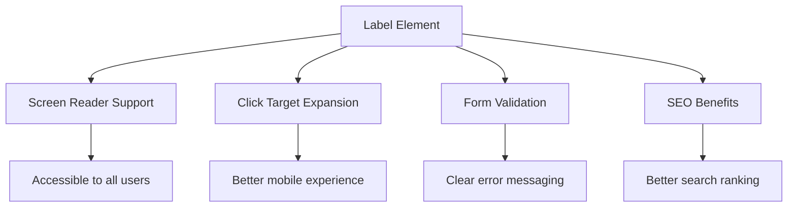
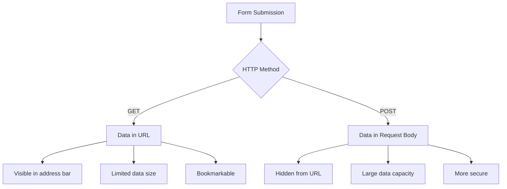
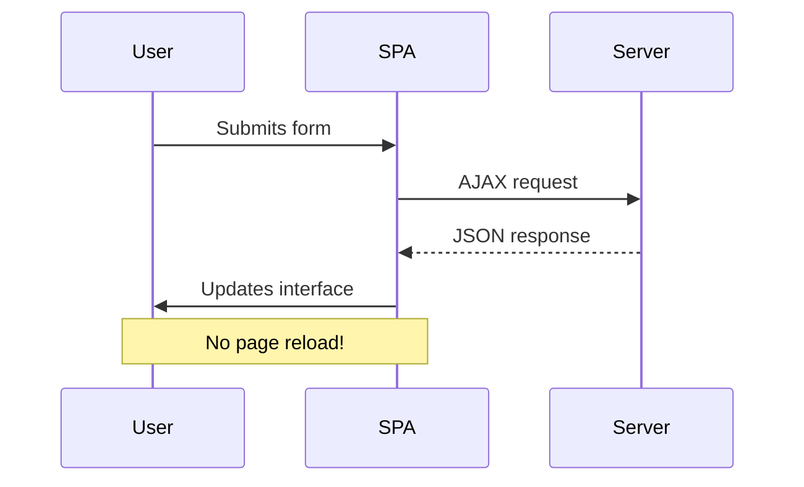
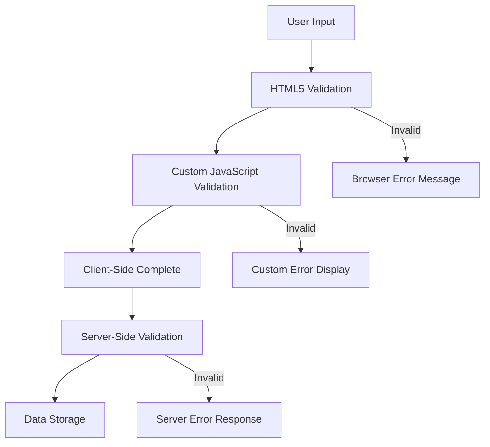
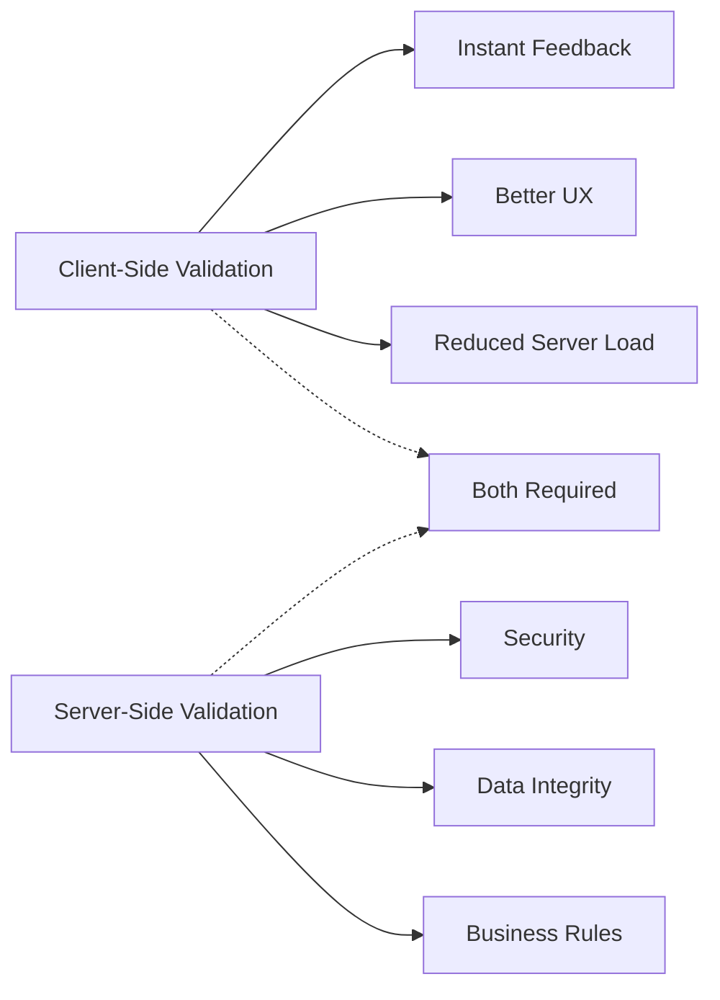

<!--
CO_OP_TRANSLATOR_METADATA:
{
  "original_hash": "b24f28fc46dd473aa9080f174182adde",
  "translation_date": "2025-10-23T00:36:48+00:00",
  "source_file": "7-bank-project/2-forms/README.md",
  "language_code": "fi"
}
-->
# Rakenna pankkisovellus, osa 2: Kirjautumis- ja rekisteröintilomakkeen luominen

## Ennakkokysely

[Ennakkokysely](https://ff-quizzes.netlify.app/web/quiz/43)

Oletko koskaan täyttänyt verkkolomaketta, joka hylkää sähköpostiosoitteesi muodon? Tai menettänyt kaikki tiedot painettuasi "lähetä"-painiketta? Me kaikki olemme kohdanneet näitä turhauttavia tilanteita.

Lomakkeet ovat silta käyttäjien ja sovelluksesi toiminnallisuuden välillä. Kuten lennonjohtajien tarkat protokollat, jotka ohjaavat lentokoneet turvallisesti määränpäähänsä, hyvin suunnitellut lomakkeet antavat selkeää palautetta ja estävät kalliita virheitä. Huonosti suunnitellut lomakkeet taas voivat karkottaa käyttäjät yhtä nopeasti kuin väärinkäsitys vilkkaalla lentokentällä.

Tässä oppitunnissa muutamme staattisen pankkisovelluksesi interaktiiviseksi sovellukseksi. Opit rakentamaan lomakkeita, jotka validoivat käyttäjän syötteet, kommunikoivat palvelimien kanssa ja antavat hyödyllistä palautetta. Ajattele tätä ohjausliittymän rakentamisena, joka antaa käyttäjille mahdollisuuden navigoida sovelluksesi ominaisuuksissa.

Lopuksi sinulla on täydellinen kirjautumis- ja rekisteröintijärjestelmä, joka ohjaa käyttäjiä onnistumiseen turhautumisen sijaan.

## Esivaatimukset

Ennen kuin aloitamme lomakkeiden rakentamisen, varmistetaan, että kaikki on asetettu oikein. Tämä oppitunti jatkuu suoraan siitä, mihin edellinen jäi, joten jos olet hypännyt eteenpäin, kannattaa palata takaisin ja varmistaa perusasioiden toimivuus ensin.

### Vaadittavat asetukset

| Komponentti | Tila | Kuvaus |
|-------------|------|--------|
| [HTML-mallit](../1-template-route/README.md) | ✅ Vaadittu | Pankkisovelluksesi perusrakenne |
| [Node.js](https://nodejs.org) | ✅ Vaadittu | JavaScript-ajonaika palvelimelle |
| [Pankin API-palvelin](../api/README.md) | ✅ Vaadittu | Tietojen tallennuksen taustapalvelu |

> 💡 **Kehitysvinkki**: Sinulla tulee olla kaksi erillistä palvelinta käynnissä samanaikaisesti – yksi pankkisovelluksen käyttöliittymälle ja toinen taustapalvelulle. Tämä asettelu jäljittelee todellista kehitysympäristöä, jossa käyttöliittymä ja taustapalvelut toimivat itsenäisesti.

### Palvelimen konfigurointi

**Kehitysympäristösi sisältää:**
- **Käyttöliittymäpalvelin**: Palvelee pankkisovellustasi (tyypillisesti portti `3000`)
- **Taustapalvelin**: Käsittelee tietojen tallennuksen ja haun (portti `5000`)
- **Molemmat palvelimet** voivat toimia samanaikaisesti ilman konflikteja

**API-yhteyden testaaminen:**
```bash
curl http://localhost:5000/api
# Expected response: "Bank API v1.0.0"
```

**Jos näet API-version vastauksen, voit jatkaa!**

---

## HTML-lomakkeiden ja kontrollien ymmärtäminen

HTML-lomakkeet ovat tapa, jolla käyttäjät kommunikoivat verkkosovelluksesi kanssa. Ajattele niitä kuin 1800-luvun lennätinjärjestelmää, joka yhdisti kaukaiset paikat – ne ovat viestintäprotokolla käyttäjän tarkoituksen ja sovelluksen vastauksen välillä. Huolellisesti suunnitellut lomakkeet havaitsevat virheet, ohjaavat syötteen muotoilua ja antavat hyödyllisiä ehdotuksia.

Modernit lomakkeet ovat huomattavasti kehittyneempiä kuin perinteiset tekstikentät. HTML5 esitteli erikoistuneita syötetyyppejä, jotka käsittelevät sähköpostin validointia, numeromuotoilua ja päivämäärän valintaa automaattisesti. Nämä parannukset hyödyttävät sekä saavutettavuutta että mobiilikäyttäjäkokemuksia.

### Keskeiset lomake-elementit

**Rakennuspalikat, joita jokainen lomake tarvitsee:**

```html
<!-- Basic form structure -->
<form id="userForm" method="POST">
  <label for="username">Username</label>
  <input id="username" name="username" type="text" required>
  
  <button type="submit">Submit</button>
</form>
```

**Mitä tämä koodi tekee:**
- **Luo** lomakekontainerin, jolla on yksilöllinen tunniste
- **Määrittää** HTTP-menetelmän tietojen lähettämiseen
- **Yhdistää** etiketit syötteisiin saavutettavuuden parantamiseksi
- **Määrittää** lähetyspainikkeen lomakkeen käsittelyyn

### Modernit syötetyypit ja attribuutit

| Syötetyyppi | Tarkoitus | Esimerkki |
|-------------|-----------|-----------|
| `text` | Yleinen tekstisyöte | `<input type="text" name="username">` |
| `email` | Sähköpostin validointi | `<input type="email" name="email">` |
| `password` | Piilotettu tekstisyöte | `<input type="password" name="password">` |
| `number` | Numeraalinen syöte | `<input type="number" name="balance" min="0">` |
| `tel` | Puhelinnumerot | `<input type="tel" name="phone">` |

> 💡 **Modernin HTML5:n etu**: Erityisten syötetyyppien käyttö tarjoaa automaattisen validoinnin, sopivat mobiilinäppäimistöt ja paremman saavutettavuuden ilman lisättyä JavaScriptiä!

### Painiketyypit ja niiden toiminta

```html
<!-- Different button behaviors -->
<button type="submit">Save Data</button>     <!-- Submits the form -->
<button type="reset">Clear Form</button>    <!-- Resets all fields -->
<button type="button">Custom Action</button> <!-- No default behavior -->
```

**Mitä kukin painiketyyppi tekee:**
- **Lähetyspainikkeet**: Käynnistävät lomakkeen lähetyksen ja lähettävät tiedot määritettyyn osoitteeseen
- **Palautuspainikkeet**: Palauttavat kaikki lomakekentät alkuperäiseen tilaan
- **Tavalliset painikkeet**: Eivät tarjoa oletustoimintoa, vaativat mukautettua JavaScriptiä toimiakseen

> ⚠️ **Tärkeä huomio**: `<input>`-elementti on itsestään sulkeutuva eikä vaadi sulkevaa tagia. Moderni käytäntö on kirjoittaa `<input>` ilman vinoviivaa.

### Kirjautumislomakkeen rakentaminen

Rakennetaan käytännöllinen kirjautumislomake, joka demonstroi moderneja HTML-lomakekäytäntöjä. Aloitamme perusrakenteesta ja parannamme sitä vähitellen saavutettavuusominaisuuksilla ja validoinnilla.

```html
<template id="login">
  <h1>Bank App</h1>
  <section>
    <h2>Login</h2>
    <form id="loginForm" novalidate>
      <div class="form-group">
        <label for="username">Username</label>
        <input id="username" name="user" type="text" required 
               autocomplete="username" placeholder="Enter your username">
      </div>
      <button type="submit">Login</button>
    </form>
  </section>
</template>
```

**Mitä tässä tapahtuu:**
- **Rakentaa** lomakkeen semanttisilla HTML5-elementeillä
- **Ryhmittelee** liittyvät elementit `div`-kontainereihin merkityksellisillä luokilla
- **Yhdistää** etiketit syötteisiin `for`- ja `id`-attribuuttien avulla
- **Sisältää** moderneja attribuutteja, kuten `autocomplete` ja `placeholder`, paremman käyttökokemuksen takaamiseksi
- **Lisää** `novalidate`-attribuutin, jotta validointi voidaan hoitaa JavaScriptillä selaimen oletusten sijaan

### Oikeiden etikettien voima

**Miksi etiketit ovat tärkeitä modernissa verkkokehityksessä:**



**Mitä oikeat etiketit saavuttavat:**
- **Mahdollistavat** ruudunlukijoiden selkeän ilmoituksen lomakekentistä
- **Laajentavat** klikkausaluetta (etiketin klikkaaminen kohdistaa syötteen)
- **Parantavat** mobiilikäytettävyyttä suuremmilla kosketuskohteilla
- **Tukevat** lomakevalidointia merkityksellisillä virheilmoituksilla
- **Parantavat** hakukoneoptimointia antamalla semanttista merkitystä lomake-elementeille

> 🎯 **Saavutettavuustavoite**: Jokaisella lomakekentällä tulisi olla siihen liittyvä etiketti. Tämä yksinkertainen käytäntö tekee lomakkeistasi käytettäviä kaikille, mukaan lukien vammaiset käyttäjät, ja parantaa kaikkien käyttäjien kokemusta.

### Rekisteröintilomakkeen luominen

Rekisteröintilomake vaatii yksityiskohtaisempia tietoja täydellisen käyttäjätilin luomiseksi. Rakennetaan se moderneilla HTML5-ominaisuuksilla ja parannetulla saavutettavuudella.

```html
<hr/>
<h2>Register</h2>
<form id="registerForm" novalidate>
  <div class="form-group">
    <label for="user">Username</label>
    <input id="user" name="user" type="text" required 
           autocomplete="username" placeholder="Choose a username">
  </div>
  
  <div class="form-group">
    <label for="currency">Currency</label>
    <input id="currency" name="currency" type="text" value="$" 
           required maxlength="3" placeholder="USD, EUR, etc.">
  </div>
  
  <div class="form-group">
    <label for="description">Account Description</label>
    <input id="description" name="description" type="text" 
           maxlength="100" placeholder="Personal savings, checking, etc.">
  </div>
  
  <div class="form-group">
    <label for="balance">Starting Balance</label>
    <input id="balance" name="balance" type="number" value="0" 
           min="0" step="0.01" placeholder="0.00">
  </div>
  
  <button type="submit">Create Account</button>
</form>
```

**Yllä olevassa olemme:**
- **Järjestäneet** jokaisen kentän kontainer-diveihin paremman tyylin ja asettelun vuoksi
- **Lisänneet** sopivat `autocomplete`-attribuutit selaimen automaattisen täytön tukemiseksi
- **Sisällyttäneet** hyödyllistä placeholder-tekstiä ohjaamaan käyttäjän syötettä
- **Asettaneet** järkevät oletusarvot `value`-attribuutin avulla
- **Soveltaneet** validointiattribuutteja, kuten `required`, `maxlength` ja `min`
- **Käyttäneet** `type="number"`-syötettä saldo-kentässä desimaalitarkkuuden tukemiseksi

### Syötetyyppien ja toiminnan tutkiminen

**Modernit syötetyypit tarjoavat parannettua toiminnallisuutta:**

| Ominaisuus | Hyöty | Esimerkki |
|------------|-------|-----------|
| `type="number"` | Numeronäppäimistö mobiilissa | Helpompi saldon syöttö |
| `step="0.01"` | Desimaalitarkkuuden hallinta | Mahdollistaa senttien käytön valuutassa |
| `autocomplete` | Selaimen automaattinen täyttö | Nopeampi lomakkeen täyttö |
| `placeholder` | Kontekstuaaliset vihjeet | Ohjaa käyttäjän odotuksia |

> 🎯 **Saavutettavuushaaste**: Kokeile navigoida lomakkeissa pelkästään näppäimistön avulla! Käytä `Tab`-näppäintä siirtyäksesi kenttien välillä, `Space`-näppäintä valintaruutujen valitsemiseen ja `Enter`-näppäintä lomakkeen lähettämiseen. Tämä kokemus auttaa ymmärtämään, miten ruudunlukijan käyttäjät vuorovaikuttavat lomakkeidesi kanssa.

## Lomakkeen lähetysmenetelmien ymmärtäminen

Kun joku täyttää lomakkeesi ja painaa "lähetä", tiedot täytyy lähettää jonnekin – yleensä palvelimelle, joka voi tallentaa ne. Tämä voi tapahtua eri tavoilla, ja oikean menetelmän valitseminen voi säästää sinut myöhemmiltä ongelmilta.

Katsotaanpa, mitä oikeastaan tapahtuu, kun joku klikkaa lähetyspainiketta.

### Lomakkeen oletuskäyttäytyminen

Ensin tarkastellaan, mitä tapahtuu peruslomakkeen lähetyksessä:

**Testaa nykyiset lomakkeesi:**
1. Klikkaa lomakkeesi *Rekisteröidy*-painiketta
2. Tarkkaile muutoksia selaimen osoiterivillä
3. Huomaa, kuinka sivu latautuu uudelleen ja tiedot näkyvät URL-osoitteessa


### HTTP-menetelmien vertailu



**Ymmärrä erot:**

| Menetelmä | Käyttötapaus | Tietojen sijainti | Turvallisuustaso | Kokorajoitus |
|-----------|--------------|-------------------|------------------|--------------|
| `GET` | Hakukyselyt, suodattimet | URL-parametrit | Matala (näkyvä) | ~2000 merkkiä |
| `POST` | Käyttäjätilit, arkaluontoiset tiedot | Pyynnön runko | Korkea (piilotettu) | Ei käytännön rajoitusta |

**Peruserojen ymmärtäminen:**
- **GET**: Liittää lomaketiedot URL-osoitteeseen kyselyparametreina (sopii hakutoimintoihin)
- **POST**: Sisältää tiedot pyynnön rungossa (välttämätön arkaluontoisille tiedoille)
- **GET-rajoitukset**: Koon rajoitukset, näkyvät tiedot, pysyvä selaushistoria
- **POST-edut**: Suuri tietokapasiteetti, yksityisyyden suoja, tiedostojen lataustuki

> 💡 **Paras käytäntö**: Käytä `GET`-menetelmää hakulomakkeisiin ja suodattimiin (tietojen haku), käytä `POST`-menetelmää käyttäjätilien luomiseen, kirjautumiseen ja tietojen luomiseen.

### Lomakkeen lähetyksen konfigurointi

Konfiguroidaan rekisteröintilomake kommunikoimaan oikein taustapalvelimen API:n kanssa POST-menetelmää käyttäen:

```html
<form id="registerForm" action="//localhost:5000/api/accounts" 
      method="POST" novalidate>
```

**Mitä tämä konfiguraatio tekee:**
- **Ohjaa** lomakkeen lähetyksen API-päätepisteeseen
- **Käyttää** POST-menetelmää turvalliseen tiedonsiirtoon
- **Sisältää** `novalidate`-attribuutin, jotta validointi voidaan hoitaa JavaScriptillä

### Lomakkeen lähetyksen testaaminen

**Seuraa näitä vaiheita testataksesi lomakettasi:**
1. **Täytä** rekisteröintilomake omilla tiedoillasi
2. **Klikkaa** "Luo tili" -painiketta
3. **Tarkkaile** palvelimen vastausta selaimessasi


**Mitä sinun pitäisi nähdä:**
- **Selaimen uudelleenohjaus** API-päätepisteen URL-osoitteeseen
- **JSON-vastaus**, joka sisältää juuri luodut tilitiedot
- **Palvelimen vahvistus** siitä, että tili on luotu onnistuneesti

> 🧪 **Kokeiluaika**: Kokeile rekisteröityä uudelleen samalla käyttäjänimellä. Minkälaisen vastauksen saat? Tämä auttaa sinua ymmärtämään, miten palvelin käsittelee päällekkäisiä tietoja ja virhetilanteita.

### JSON-vastausten ymmärtäminen

**Kun palvelin käsittelee lomakkeesi onnistuneesti:**
```json
{
  "user": "john_doe",
  "currency": "$",
  "description": "Personal savings",
  "balance": 100,
  "id": "unique_account_id"
}
```

**Tämä vastaus vahvistaa:**
- **Luo** uuden tilin määritetyillä tiedoillasi
- **Määrittää** yksilöllisen tunnisteen tulevaa käyttöä varten
- **Palauttaa** kaikki tilitiedot tarkistusta varten
- **Ilmoittaa** onnistuneesta tietokannan tallennuksesta

## Moderni lomakkeiden käsittely JavaScriptillä

Perinteiset lomakelähetykset aiheuttavat koko sivun uudelleenlatauksia, kuten varhaiset avaruuslennot vaativat täydellisiä järjestelmän nollauksia kurssikorjauksia varten. Tämä lähestymistapa häiritsee käyttäjäkokemusta ja menettää sovelluksen tilan.

JavaScript-lomakkeiden käsittely toimii kuin modernien avaruusalusten jatkuvat ohjausjärjestelmät – tehden reaaliaikaisia säätöjä menettämättä navigointikontekstia. Voimme siepata lomakelähetykset, antaa välitöntä palautetta, käsitellä virheitä sujuvasti ja päivittää käyttöliittymää palvelimen vastausten perusteella samalla, kun säilytämme käyttäjän sijainnin sovelluksessa.

### Miksi välttää sivun uudelleenlatauksia?



**JavaScript-lomakkeiden käsittelyn edut:**
- **Säilyttää** sovelluksen tilan ja käyttäjän kontekstin
- **Tarjoaa** välitöntä palautetta ja latausindikaattoreita
- **Mahdollistaa** dynaamisen virheenkäsittelyn ja validoinnin
- **Luo** sujuvia, sovellusmaisia käyttäjäkokemuksia
- **Mahdollistaa** ehdollisen logiikan palvelimen vastausten perusteella

### Siirtyminen perinteisistä moderneihin lomakkeisiin

**Perinteisen lähestymistavan haasteet:**
- **Uudelleenohjaa** käyttäjät pois sovelluksestasi
- **Menettää** nykyisen sovelluksen tilan ja kontekstin
- **Vaatii** koko sivun uudelleenlatauksia yksinkertaisille toiminnoille
- **Tarjoaa** rajallisen hallinnan käyttäjäpalautteesta

**Modernin JavaScript-lähestymistavan edut:**
- **Pitää** käyttäjät sovelluksesi sisällä
- **Säilyttää** kaikki sovelluksen tilan ja tiedot
- **Mahdollistaa** reaaliaikaisen validoinnin ja palautteen
- **Tukee** progressiivista parannusta ja saavutettavuutta

### JavaScript-lomakke
- **Tarjoaa** yksityiskohtaisia virheilmoituksia virheenkorjaukseen
- **Palauttaa** johdonmukaisen tietorakenteen onnistumis- ja virhetapauksissa

### Modernin Fetch API:n voima

**Fetch API:n edut vanhempiin menetelmiin verrattuna:**

| Ominaisuus | Etu | Toteutus |
|------------|-----|----------|
| Lupauspohjainen | Selkeä asynkroninen koodi | `await fetch()` |
| Pyynnön räätälöinti | Täysi HTTP-kontrolli | Otsikot, metodit, sisältö |
| Vastauksen käsittely | Joustava datan jäsentely | `.json()`, `.text()`, `.blob()` |
| Virheenkäsittely | Kattava virheiden hallinta | Try/catch-lohkot |

> 🎥 **Lisätietoja**: [Async/Await-opas](https://youtube.com/watch?v=YwmlRkrxvkk) - Ymmärrä asynkronisen JavaScriptin mallit modernia web-kehitystä varten.

**Keskeiset käsitteet palvelimen kanssa kommunikointiin:**
- **Asynkroniset funktiot** mahdollistavat suorituksen keskeyttämisen palvelimen vastauksia odotettaessa
- **Await-avainsana** tekee asynkronisesta koodista helpommin luettavaa
- **Fetch API** tarjoaa modernin, lupauspohjaisen HTTP-pyyntöjen käsittelyn
- **Virheenkäsittely** varmistaa, että sovellus reagoi verkko-ongelmiin sujuvasti

### Rekisteröintifunktion viimeistely

Kootaan kaikki yhteen ja luodaan valmis, tuotantokäyttöön sopiva rekisteröintifunktio:

```javascript
async function register() {
  const registerForm = document.getElementById('registerForm');
  const submitButton = registerForm.querySelector('button[type="submit"]');
  
  try {
    // Show loading state
    submitButton.disabled = true;
    submitButton.textContent = 'Creating Account...';
    
    // Process form data
    const formData = new FormData(registerForm);
    const jsonData = JSON.stringify(Object.fromEntries(formData));
    
    // Send to server
    const result = await createAccount(jsonData);
    
    if (result.error) {
      console.error('Registration failed:', result.error);
      alert(`Registration failed: ${result.error}`);
      return;
    }
    
    console.log('Account created successfully!', result);
    alert(`Welcome, ${result.user}! Your account has been created.`);
    
    // Reset form after successful registration
    registerForm.reset();
    
  } catch (error) {
    console.error('Unexpected error:', error);
    alert('An unexpected error occurred. Please try again.');
  } finally {
    // Restore button state
    submitButton.disabled = false;
    submitButton.textContent = 'Create Account';
  }
}
```

**Tämä parannettu toteutus sisältää:**
- **Tarjoaa** visuaalista palautetta lomakkeen lähetyksen aikana
- **Poistaa käytöstä** lähetyspainikkeen kaksoislähetysten estämiseksi
- **Käsittelee** sekä odotetut että odottamattomat virheet sujuvasti
- **Näyttää** käyttäjäystävälliset onnistumis- ja virheilmoitukset
- **Nollaa** lomakkeen onnistuneen rekisteröinnin jälkeen
- **Palauttaa** käyttöliittymän tilan riippumatta lopputuloksesta

### Toteutuksen testaaminen

**Avaa selaimen kehittäjätyökalut ja testaa rekisteröinti:**

1. **Avaa** selaimen konsoli (F12 → Konsoli-välilehti)
2. **Täytä** rekisteröintilomake
3. **Klikkaa** "Luo tili"
4. **Tarkkaile** konsoliviestejä ja käyttäjäpalautetta


**Mitä sinun pitäisi nähdä:**
- **Lataustila** näkyy lähetyspainikkeessa
- **Konsolilokit** näyttävät yksityiskohtaista tietoa prosessista
- **Onnistumisviesti** ilmestyy, kun tilin luominen onnistuu
- **Lomake nollautuu** automaattisesti onnistuneen lähetyksen jälkeen

> 🔒 **Tietoturva huomio**: Tällä hetkellä data kulkee HTTP:n kautta, mikä ei ole turvallista tuotantokäyttöön. Oikeissa sovelluksissa käytä aina HTTPS:ää datan salaukseen. Lue lisää [HTTPS-turvallisuudesta](https://en.wikipedia.org/wiki/HTTPS) ja miksi se on tärkeää käyttäjätietojen suojaamiseksi.

## Kattava lomakkeen validointi

Lomakkeen validointi estää turhauttavan kokemuksen, jossa virheet havaitaan vasta lähetyksen jälkeen. Kuten Kansainvälisen avaruusaseman moninkertaiset varajärjestelmät, tehokas validointi käyttää useita turvakerroksia.

Optimaalinen lähestymistapa yhdistää selaintason validoinnin välittömän palautteen antamiseksi, JavaScript-validoinnin käyttäjäkokemuksen parantamiseksi ja palvelinpuolen validoinnin turvallisuuden ja tietojen eheyden varmistamiseksi. Tämä redundanssi takaa sekä käyttäjätyytyväisyyden että järjestelmän suojan.

### Validointikerrosten ymmärtäminen



**Monikerroksinen validointistrategia:**
- **HTML5-validointi**: Välittömät selaimen suorittamat tarkistukset
- **JavaScript-validointi**: Räätälöity logiikka ja parempi käyttäjäkokemus
- **Palvelinvalidointi**: Lopulliset turvallisuus- ja tietojen eheyden tarkistukset
- **Progressiivinen parannus**: Toimii myös ilman JavaScriptiä

### HTML5-validointiominaisuudet

**Modernit validointityökalut käytettävissäsi:**

| Ominaisuus | Tarkoitus | Käyttöesimerkki | Selaimen toiminta |
|------------|-----------|-----------------|-------------------|
| `required` | Pakolliset kentät | `<input required>` | Estää tyhjän lähetyksen |
| `minlength`/`maxlength` | Tekstin pituusrajat | `<input maxlength="20">` | Varmistaa merkkirajat |
| `min`/`max` | Numeraaliset rajat | `<input min="0" max="1000">` | Tarkistaa numerorajat |
| `pattern` | Mukautetut regex-säännöt | `<input pattern="[A-Za-z]+">` | Varmistaa tietyn muodon |
| `type` | Datatyypin validointi | `<input type="email">` | Muotokohtainen validointi |

### CSS-validointityylit

**Luo visuaalista palautetta validointitiloille:**

```css
/* Valid input styling */
input:valid {
  border-color: #28a745;
  background-color: #f8fff9;
}

/* Invalid input styling */
input:invalid {
  border-color: #dc3545;
  background-color: #fff5f5;
}

/* Focus states for better accessibility */
input:focus:valid {
  box-shadow: 0 0 0 0.2rem rgba(40, 167, 69, 0.25);
}

input:focus:invalid {
  box-shadow: 0 0 0 0.2rem rgba(220, 53, 69, 0.25);
}
```

**Mitä nämä visuaaliset vihjeet saavuttavat:**
- **Vihreät reunat**: Ilmaisevat onnistunutta validointia, kuten vihreät valot ohjauskeskuksessa
- **Punaiset reunat**: Osoittavat validointivirheitä, jotka vaativat huomiota
- **Kohdistuksen korostukset**: Antavat selkeän visuaalisen kontekstin nykyiselle syöttökohdalle
- **Johdonmukainen tyyli**: Luo ennakoitavia käyttöliittymämalleja, joita käyttäjät voivat oppia

> 💡 **Vinkki**: Käytä `:valid` ja `:invalid` CSS-pseudoluokkia antaaksesi välitöntä visuaalista palautetta käyttäjille heidän kirjoittaessaan, luoden reagoivan ja hyödyllisen käyttöliittymän.

### Kattavan validoinnin toteuttaminen

Parannetaan rekisteröintilomakettasi vankalla validoinnilla, joka tarjoaa erinomaisen käyttäjäkokemuksen ja datan laadun:

```html
<form id="registerForm" method="POST" novalidate>
  <div class="form-group">
    <label for="user">Username <span class="required">*</span></label>
    <input id="user" name="user" type="text" required 
           minlength="3" maxlength="20" 
           pattern="[a-zA-Z0-9_]+" 
           autocomplete="username"
           title="Username must be 3-20 characters, letters, numbers, and underscores only">
    <small class="form-text">Choose a unique username (3-20 characters)</small>
  </div>
  
  <div class="form-group">
    <label for="currency">Currency <span class="required">*</span></label>
    <input id="currency" name="currency" type="text" required 
           value="$" maxlength="3" 
           pattern="[A-Z$€£¥₹]+" 
           title="Enter a valid currency symbol or code">
    <small class="form-text">Currency symbol (e.g., $, €, £)</small>
  </div>
  
  <div class="form-group">
    <label for="description">Account Description</label>
    <input id="description" name="description" type="text" 
           maxlength="100" 
           placeholder="Personal savings, checking, etc.">
    <small class="form-text">Optional description (up to 100 characters)</small>
  </div>
  
  <div class="form-group">
    <label for="balance">Starting Balance</label>
    <input id="balance" name="balance" type="number" 
           value="0" min="0" step="0.01" 
           title="Enter a positive number for your starting balance">
    <small class="form-text">Initial account balance (minimum $0.00)</small>
  </div>
  
  <button type="submit">Create Account</button>
</form>
```

**Parannetun validoinnin ymmärtäminen:**
- **Yhdistää** pakollisten kenttien merkinnät hyödyllisiin kuvauksiin
- **Sisältää** `pattern`-ominaisuudet muotovalidointiin
- **Tarjoaa** `title`-ominaisuudet saavutettavuuden ja työkaluvihjeiden vuoksi
- **Lisää** aputekstiä ohjaamaan käyttäjän syöttöä
- **Käyttää** semanttista HTML-rakennetta paremman saavutettavuuden vuoksi

### Kehittyneet validointisäännöt

**Mitä kukin validointisääntö saavuttaa:**

| Kenttä | Validointisäännöt | Käyttäjän hyöty |
|--------|-------------------|-----------------|
| Käyttäjänimi | `required`, `minlength="3"`, `maxlength="20"`, `pattern="[a-zA-Z0-9_]+"` | Varmistaa kelvolliset, yksilölliset tunnisteet |
| Valuutta | `required`, `maxlength="3"`, `pattern="[A-Z$€£¥₹]+"` | Hyväksyy yleiset valuuttasymbolit |
| Saldo | `min="0"`, `step="0.01"`, `type="number"` | Estää negatiiviset saldot |
| Kuvaus | `maxlength="100"` | Kohtuulliset pituusrajat |

### Validointikäyttäytymisen testaaminen

**Kokeile näitä validointitilanteita:**
1. **Lähetä** lomake tyhjillä pakollisilla kentillä
2. **Syötä** käyttäjänimi, joka on alle 3 merkkiä pitkä
3. **Kokeile** erikoismerkkejä käyttäjänimi-kentässä
4. **Syötä** negatiivinen saldo


**Mitä huomaat:**
- **Selaimen näyttämät** natiivivalidointiviestit
- **Tyylimuutokset** perustuvat `:valid` ja `:invalid`-tiloihin
- **Lomakkeen lähetys** estetään, kunnes kaikki validoinnit läpäistään
- **Kohdistus siirtyy automaattisesti** ensimmäiseen virheelliseen kenttään

### Asiakas- vs palvelinpuolen validointi



**Miksi tarvitset molemmat kerrokset:**
- **Asiakaspuolen validointi**: Tarjoaa välitöntä palautetta ja parantaa käyttäjäkokemusta
- **Palvelinpuolen validointi**: Varmistaa turvallisuuden ja käsittelee monimutkaiset liiketoimintasäännöt
- **Yhdistetty lähestymistapa**: Luo vankan, käyttäjäystävällisen ja turvallisen sovelluksen
- **Progressiivinen parannus**: Toimii myös, kun JavaScript on pois päältä

> 🛡️ **Tietoturvamuistutus**: Älä koskaan luota pelkkään asiakaspuolen validointiin! Haitalliset käyttäjät voivat ohittaa asiakaspuolen tarkistukset, joten palvelinpuolen validointi on välttämätöntä turvallisuuden ja tietojen eheyden varmistamiseksi.

---


---

## GitHub Copilot Agent -haaste 🚀

Käytä Agent-tilaa suorittaaksesi seuraavan haasteen:

**Kuvaus:** Paranna rekisteröintilomaketta kattavalla asiakaspuolen validoinnilla ja käyttäjäpalautteella. Tämä haaste auttaa sinua harjoittelemaan lomakkeen validointia, virheenkäsittelyä ja käyttäjäkokemuksen parantamista interaktiivisella palautteella.

**Tehtävä:** Luo täydellinen lomakkeen validointijärjestelmä rekisteröintilomakkeelle, joka sisältää: 1) Reaaliaikaisen validointipalautteen jokaiselle kentälle käyttäjän kirjoittaessa, 2) Mukautetut validointiviestit, jotka näkyvät kunkin syöttökentän alla, 3) Salasanan vahvistuskentän, jossa on vastaavuusvalidointi, 4) Visuaaliset indikaattorit (kuten vihreät valintamerkit kelvollisille kentille ja punaiset varoitukset virheellisille), 5) Lähetyspainikkeen, joka aktivoituu vasta, kun kaikki validoinnit läpäistään. Käytä HTML5-validointiominaisuuksia, CSS:ää validointitilojen tyylittelyyn ja JavaScriptiä interaktiiviseen käyttäytymiseen.

Lue lisää [agent-tilasta](https://code.visualstudio.com/blogs/2025/02/24/introducing-copilot-agent-mode) täältä.

## 🚀 Haaste

Näytä virheilmoitus HTML:ssä, jos käyttäjä on jo olemassa.

Tässä esimerkki siitä, miltä lopullinen kirjautumissivu voi näyttää pienen tyylittelyn jälkeen:


## Luentojälkeinen kysely

[Luentojälkeinen kysely](https://ff-quizzes.netlify.app/web/quiz/44)

## Kertaus ja itseopiskelu

Kehittäjät ovat olleet erittäin luovia lomakkeiden rakentamisessa, erityisesti validointistrategioiden osalta. Tutustu erilaisiin lomakevirtoihin selaamalla [CodePen](https://codepen.com); löydätkö mielenkiintoisia ja inspiroivia lomakkeita?

## Tehtävä

[Tyylittele pankkisovelluksesi](assignment.md)

---

**Vastuuvapauslauseke**:  
Tämä asiakirja on käännetty käyttämällä tekoälypohjaista käännöspalvelua [Co-op Translator](https://github.com/Azure/co-op-translator). Vaikka pyrimme tarkkuuteen, huomioithan, että automaattiset käännökset voivat sisältää virheitä tai epätarkkuuksia. Alkuperäinen asiakirja sen alkuperäisellä kielellä tulisi pitää ensisijaisena lähteenä. Kriittisen tiedon osalta suositellaan ammattimaista ihmiskäännöstä. Emme ole vastuussa väärinkäsityksistä tai virhetulkinnoista, jotka johtuvat tämän käännöksen käytöstä.