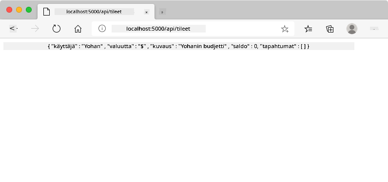
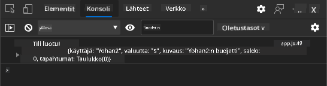
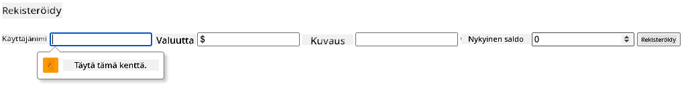
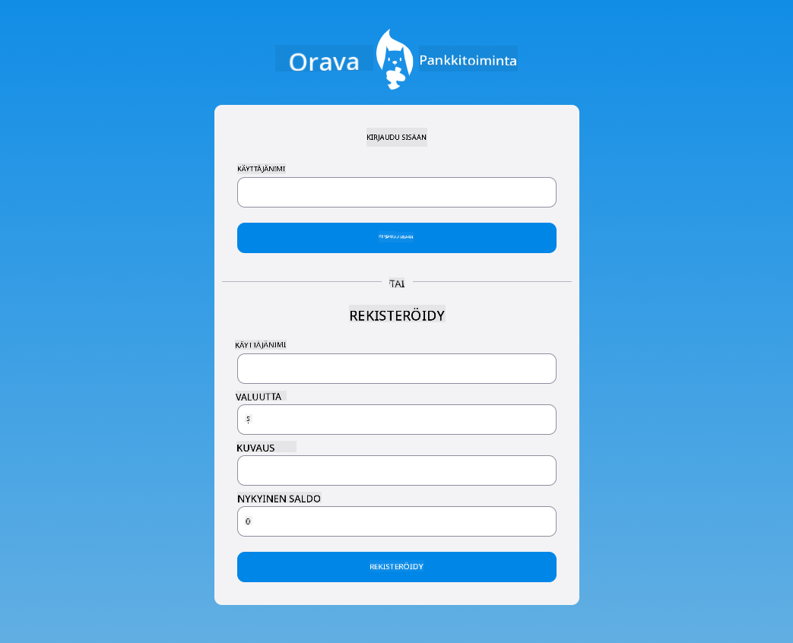

<!--
CO_OP_TRANSLATOR_METADATA:
{
  "original_hash": "b667b7d601e2ee19acb5aa9d102dc9f3",
  "translation_date": "2025-08-27T20:55:33+00:00",
  "source_file": "7-bank-project/2-forms/README.md",
  "language_code": "fi"
}
-->
# Rakenna pankkisovellus Osa 2: Luo kirjautumis- ja rekisteröintilomake

## Ennakkokysely

[Ennakkokysely](https://ashy-river-0debb7803.1.azurestaticapps.net/quiz/43)

### Johdanto

Lähes kaikissa moderneissa verkkosovelluksissa voit luoda tilin saadaksesi oman yksityisen tilan. Koska useat käyttäjät voivat käyttää verkkosovellusta samanaikaisesti, tarvitset mekanismin, jolla tallennat kunkin käyttäjän henkilökohtaiset tiedot erikseen ja valitset, mitä tietoja näytetään. Emme käsittele [käyttäjän identiteetin turvallista hallintaa](https://en.wikipedia.org/wiki/Authentication), koska se on laaja aihe itsessään, mutta varmistamme, että jokainen käyttäjä voi luoda yhden (tai useamman) pankkitilin sovelluksessamme.

Tässä osassa käytämme HTML-lomakkeita lisätäksemme kirjautumis- ja rekisteröintitoiminnot verkkosovellukseemme. Opimme lähettämään tietoja palvelimen API:lle ohjelmallisesti ja määrittelemään perusvalidaatiosäännöt käyttäjän syötteille.

### Esitiedot

Sinun tulee olla suorittanut verkkosovelluksen [HTML-mallien ja reitityksen](../1-template-route/README.md) osio ennen tämän oppitunnin aloittamista. Sinun tulee myös asentaa [Node.js](https://nodejs.org) ja [käynnistää palvelimen API](../api/README.md) paikallisesti, jotta voit lähettää tietoja tilien luomista varten.

**Huomioi**
Sinulla tulee olla kaksi terminaalia käynnissä samanaikaisesti seuraavasti:
1. Pääpankkisovellukselle, jonka rakensimme [HTML-mallien ja reitityksen](../1-template-route/README.md) oppitunnissa.
2. [Pankkisovelluksen palvelimen API:lle](../api/README.md), jonka juuri asensimme.

Molempien palvelimien tulee olla käynnissä, jotta voit jatkaa oppituntia. Ne kuuntelevat eri porteilla (portti `3000` ja portti `5000`), joten kaiken pitäisi toimia ongelmitta.

Voit testata, että palvelin toimii oikein suorittamalla tämän komennon terminaalissa:

```sh
curl http://localhost:5000/api
# -> should return "Bank API v1.0.0" as a result
```

---

## Lomake ja ohjaimet

`<form>`-elementti kapseloi HTML-dokumentin osan, jossa käyttäjä voi syöttää ja lähettää tietoja interaktiivisten ohjainten avulla. Lomakkeessa voi käyttää monenlaisia käyttöliittymäohjaimia, joista yleisimpiä ovat `<input>`- ja `<button>`-elementit.

`<input>`-elementillä on monia [tyyppejä](https://developer.mozilla.org/docs/Web/HTML/Element/input). Esimerkiksi käyttäjänimen syöttökentän luomiseen voit käyttää seuraavaa:

```html
<input id="username" name="username" type="text">
```

`name`-attribuuttia käytetään ominaisuuden nimenä, kun lomaketiedot lähetetään. `id`-attribuuttia käytetään yhdistämään `<label>` lomakeohjaimeen.

> Tutustu [`<input>`-tyyppien](https://developer.mozilla.org/docs/Web/HTML/Element/input) ja [muiden lomakeohjainten](https://developer.mozilla.org/docs/Learn/Forms/Other_form_controls) luetteloon saadaksesi käsityksen kaikista natiivielementeistä, joita voit käyttää käyttöliittymän rakentamisessa.

✅ Huomaa, että `<input>` on [tyhjä elementti](https://developer.mozilla.org/docs/Glossary/Empty_element), jolle ei tule lisätä sulkevaa tagia. Voit kuitenkin käyttää itse sulkevaa `<input/>`-merkintää, mutta se ei ole pakollista.

`<button>`-elementti lomakkeessa on hieman erityinen. Jos et määritä sen `type`-attribuuttia, se lähettää lomaketiedot palvelimelle, kun sitä painetaan. Mahdolliset `type`-arvot ovat:

- `submit`: Oletusarvo lomakkeessa, painike käynnistää lomakkeen lähetyksen.
- `reset`: Painike palauttaa kaikki lomakeohjaimet alkuarvoihinsa.
- `button`: Ei määritä oletuskäyttäytymistä painettaessa. Voit määrittää sille mukautettuja toimintoja JavaScriptin avulla.

### Tehtävä

Aloitetaan lisäämällä lomake `login`-malliin. Tarvitsemme *käyttäjänimi*-kentän ja *Kirjaudu sisään* -painikkeen.

```html
<template id="login">
  <h1>Bank App</h1>
  <section>
    <h2>Login</h2>
    <form id="loginForm">
      <label for="username">Username</label>
      <input id="username" name="user" type="text">
      <button>Login</button>
    </form>
  </section>
</template>
```

Jos katsot tarkemmin, huomaat, että lisäsimme myös `<label>`-elementin. `<label>`-elementtejä käytetään lisäämään nimi käyttöliittymäohjaimille, kuten käyttäjänimikentällemme. Tunnisteet ovat tärkeitä lomakkeiden luettavuuden kannalta, mutta niillä on myös muita etuja:

- Yhdistämällä tunniste lomakeohjaimeen se auttaa avustavia teknologioita (kuten ruudunlukijoita) ymmärtämään, mitä tietoja käyttäjältä odotetaan.
- Voit klikata tunnistetta asettaaksesi kohdistuksen suoraan siihen liittyvään syöttökenttään, mikä helpottaa käyttöä kosketusnäytöllisillä laitteilla.

> [Saavutettavuus](https://developer.mozilla.org/docs/Learn/Accessibility/What_is_accessibility) verkossa on erittäin tärkeä aihe, jota usein laiminlyödään. [Semanttisten HTML-elementtien](https://developer.mozilla.org/docs/Learn/Accessibility/HTML) ansiosta saavutettavan sisällön luominen ei ole vaikeaa, jos käytät niitä oikein. Voit [lukea lisää saavutettavuudesta](https://developer.mozilla.org/docs/Web/Accessibility) välttääksesi yleiset virheet ja tullaksesi vastuulliseksi kehittäjäksi.

Lisätään nyt toinen lomake rekisteröintiä varten, heti edellisen alle:

```html
<hr/>
<h2>Register</h2>
<form id="registerForm">
  <label for="user">Username</label>
  <input id="user" name="user" type="text">
  <label for="currency">Currency</label>
  <input id="currency" name="currency" type="text" value="$">
  <label for="description">Description</label>
  <input id="description" name="description" type="text">
  <label for="balance">Current balance</label>
  <input id="balance" name="balance" type="number" value="0">
  <button>Register</button>
</form>
```

`value`-attribuutilla voimme määrittää oletusarvon tietylle syöttökentälle. Huomaa myös, että `balance`-kentällä on `number`-tyyppi. Näyttääkö se erilaiselta kuin muut syöttökentät? Kokeile vuorovaikuttaa sen kanssa.

✅ Voitko navigoida ja käyttää lomakkeita pelkällä näppäimistöllä? Miten tekisit sen?

## Tietojen lähettäminen palvelimelle

Nyt kun meillä on toimiva käyttöliittymä, seuraava askel on lähettää tiedot palvelimelle. Tehdään nopea testi nykyisellä koodillamme: mitä tapahtuu, kun klikkaat *Kirjaudu sisään* tai *Rekisteröidy* -painiketta?

Huomasitko muutoksen selaimen URL-osoiteosiossa?


Lomakkeen oletustoiminto on lähettää tiedot nykyiseen palvelimen URL-osoitteeseen [GET-metodilla](https://www.w3.org/Protocols/rfc2616/rfc2616-sec9.html#sec9.3), liittämällä lomaketiedot suoraan URL-osoitteeseen. Tässä metodissa on kuitenkin joitakin rajoituksia:

- Lähetettävien tietojen koko on hyvin rajallinen (noin 2000 merkkiä).
- Tiedot näkyvät suoraan URL-osoitteessa (ei hyvä salasanoille).
- Se ei toimi tiedostojen latausten kanssa.

Siksi voit vaihtaa sen käyttämään [POST-metodia](https://www.w3.org/Protocols/rfc2616/rfc2616-sec9.html#sec9.5), joka lähettää lomaketiedot palvelimelle HTTP-pyynnön rungossa ilman edellä mainittuja rajoituksia.

> Vaikka POST on yleisimmin käytetty metodi tietojen lähettämiseen, [tietyissä tilanteissa](https://www.w3.org/2001/tag/doc/whenToUseGet.html) on suositeltavaa käyttää GET-metodia, esimerkiksi hakukentän toteutuksessa.

### Tehtävä

Lisää `action`- ja `method`-ominaisuudet rekisteröintilomakkeeseen:

```html
<form id="registerForm" action="//localhost:5000/api/accounts" method="POST">
```

Yritä nyt rekisteröidä uusi tili omalla nimelläsi. Kun klikkaat *Rekisteröidy*-painiketta, sinun pitäisi nähdä jotain tällaista:



Jos kaikki toimii oikein, palvelin vastaa pyyntöösi [JSON](https://www.json.org/json-en.html)-vastauksella, joka sisältää luodun tilin tiedot.

✅ Yritä rekisteröityä uudelleen samalla nimellä. Mitä tapahtuu?

## Tietojen lähettäminen ilman sivun uudelleenlatausta

Kuten olet ehkä huomannut, edellisessä lähestymistavassa on pieni ongelma: kun lomake lähetetään, poistumme sovelluksestamme ja selain ohjautuu palvelimen URL-osoitteeseen. Yritämme välttää kaikki sivun uudelleenlataukset verkkosovelluksessamme, koska teemme [yksisivuisen sovelluksen (SPA)](https://en.wikipedia.org/wiki/Single-page_application).

Jotta voimme lähettää lomaketiedot palvelimelle ilman sivun uudelleenlatausta, meidän on käytettävä JavaScript-koodia. Sen sijaan, että asettaisimme URL-osoitteen `<form>`-elementin `action`-ominaisuuteen, voimme käyttää mitä tahansa JavaScript-koodia, joka alkaa `javascript:`-merkkijonolla suorittaaksemme mukautetun toiminnon. Tämä tarkoittaa myös sitä, että meidän on toteutettava joitakin tehtäviä, jotka selain hoiti aiemmin automaattisesti:

- Lomaketietojen hakeminen.
- Lomaketietojen muuntaminen ja koodaaminen sopivaan muotoon.
- HTTP-pyynnön luominen ja lähettäminen palvelimelle.

### Tehtävä

Korvaa rekisteröintilomakkeen `action` seuraavalla:

```html
<form id="registerForm" action="javascript:register()">
```

Avaa `app.js` ja lisää uusi funktio nimeltä `register`:

```js
function register() {
  const registerForm = document.getElementById('registerForm');
  const formData = new FormData(registerForm);
  const data = Object.fromEntries(formData);
  const jsonData = JSON.stringify(data);
}
```

Tässä haemme lomake-elementin `getElementById()`-metodilla ja käytämme [`FormData`](https://developer.mozilla.org/docs/Web/API/FormData)-apuvälinettä lomakeohjaimien arvojen hakemiseen avain/arvo-pareina. Sitten muunnamme tiedot tavalliseksi objektiksi [`Object.fromEntries()`](https://developer.mozilla.org/docs/Web/JavaScript/Reference/Global_Objects/Object/fromEntries)-metodilla ja lopuksi sarjoitamme tiedot [JSON](https://www.json.org/json-en.html)-muotoon, joka on yleisesti käytetty tiedonvaihtomuoto verkossa.

Tiedot ovat nyt valmiita lähetettäväksi palvelimelle. Luo uusi funktio nimeltä `createAccount`:

```js
async function createAccount(account) {
  try {
    const response = await fetch('//localhost:5000/api/accounts', {
      method: 'POST',
      headers: { 'Content-Type': 'application/json' },
      body: account
    });
    return await response.json();
  } catch (error) {
    return { error: error.message || 'Unknown error' };
  }
}
```

Mitä tämä funktio tekee? Huomaa ensin `async`-avainsana. Tämä tarkoittaa, että funktio sisältää koodia, joka suoritetaan [**asynkronisesti**](https://developer.mozilla.org/docs/Web/JavaScript/Reference/Statements/async_function). Kun sitä käytetään yhdessä `await`-avainsanan kanssa, se mahdollistaa odottamisen asynkronisen koodin suorittamiselle - kuten tässä palvelimen vastauksen odottamiselle - ennen kuin jatketaan.

Tässä käytämme `fetch()`-API:a JSON-tietojen lähettämiseen palvelimelle. Tämä metodi ottaa kaksi parametria:

- Palvelimen URL-osoitteen, joten laitamme tähän `//localhost:5000/api/accounts`.
- Pyynnön asetukset. Tässä asetamme metodiksi `POST` ja annamme pyynnön `body`-sisällön. Koska lähetämme JSON-tietoja palvelimelle, meidän on myös asetettava `Content-Type`-otsikko arvoksi `application/json`, jotta palvelin tietää, miten sisältö tulkitaan.

Koska palvelin vastaa pyyntöön JSON-muodossa, voimme käyttää `await response.json()`-metodia JSON-sisällön jäsentämiseen ja tuloksena olevan objektin palauttamiseen. Huomaa, että tämä metodi on asynkroninen, joten käytämme `await`-avainsanaa varmistaaksemme, että mahdolliset virheet jäsentämisen aikana havaitaan.

Lisää nyt koodia `register`-funktioon kutsumaan `createAccount()`:

```js
const result = await createAccount(jsonData);
```

Koska käytämme `await`-avainsanaa tässä, meidän on lisättävä `async`-avainsana ennen `register`-funktiota:

```js
async function register() {
```

Lopuksi lisätään lokit tarkistamaan tulos. Lopullisen funktion tulisi näyttää tältä:

```js
async function register() {
  const registerForm = document.getElementById('registerForm');
  const formData = new FormData(registerForm);
  const jsonData = JSON.stringify(Object.fromEntries(formData));
  const result = await createAccount(jsonData);

  if (result.error) {
    return console.log('An error occurred:', result.error);
  }

  console.log('Account created!', result);
}
```

Se oli hieman pitkä, mutta pääsimme perille! Jos avaat [selaimen kehittäjätyökalut](https://developer.mozilla.org/docs/Learn/Common_questions/What_are_browser_developer_tools) ja yrität rekisteröidä uuden tilin, et näe muutosta verkkosivulla, mutta konsolissa näkyy viesti, joka vahvistaa kaiken toimivan.



✅ Onko mielestäsi tiedot lähetetty palvelimelle turvallisesti? Entä jos joku pystyisi sieppaamaan pyynnön? Voit lukea lisää [HTTPS:stä](https://en.wikipedia.org/wiki/HTTPS) saadaksesi tietoa turvallisesta tiedonsiirrosta.

## Tietojen validointi

Jos yrität rekisteröidä uuden tilin ilman, että asetat käyttäjänimeä ensin, näet, että palvelin palauttaa virheen tilakoodilla [400 (Bad Request)](https://developer.mozilla.org/docs/Web/HTTP/Status/400#:~:text=The%20HyperText%20Transfer%20Protocol%20(HTTP,%2C%20or%20deceptive%20request%20routing).).

Ennen tietojen lähettämistä palvelimelle on hyvä käytäntö [validoida lomaketiedot](https://developer.mozilla.org/docs/Learn/Forms/Form_validation) etukäteen, kun se on mahdollista, varmistaaksesi, että lähetät kelvollisen pyynnön. HTML5-lomakeohjaimet tarjoavat sisäänrakennetun validoinnin eri attribuuttien avulla:

- `required`: kenttä on täytettävä, muuten lomaketta ei voi lähettää.
- `minlength` ja `maxlength`: määrittävät tekstikenttien vähimmäis- ja enimmäismerkkimäärän.
- `min` ja `max`: määrittävät numeerisen kentän vähimmäis- ja enimmäisarvon.
- `type`: määrittää odotetun tietotyypin, kuten `number`, `email`, `file` tai [muut sisäänrakennetut tyypit](https://developer.mozilla.org/docs/Web/HTML/Element/input). Tämä attribuutti voi myös muuttaa lomakeohjaimen visuaalista ulkoasua.
- `pattern`: mahdollistaa [säännöllisen lausekkeen](https://developer.mozilla.org/docs/Web/JavaScript/Guide/Regular_Expressions) määrittämisen, jolla testataan, onko syötetty tieto kelvollinen vai ei.
> Vinkki: Voit mukauttaa lomakekontrolliesi ulkoasua sen mukaan, ovatko ne kelvollisia vai eivät, käyttämällä CSS-pseudoluokkia `:valid` ja `:invalid`.
### Tehtävä

Uuden tilin luomiseen vaaditaan kaksi pakollista kenttää: käyttäjänimi ja valuutta. Muut kentät ovat vapaaehtoisia. Päivitä lomakkeen HTML niin, että käytät sekä `required`-attribuuttia että tekstiä kentän nimikkeessä:

```html
<label for="user">Username (required)</label>
<input id="user" name="user" type="text" required>
...
<label for="currency">Currency (required)</label>
<input id="currency" name="currency" type="text" value="$" required>
```

Vaikka tämä palvelinimplementaatio ei aseta erityisiä rajoituksia kenttien maksimipituudelle, on aina hyvä käytäntö määritellä kohtuulliset rajat käyttäjän syöttämälle tekstille.

Lisää `maxlength`-attribuutti tekstikenttiin:

```html
<input id="user" name="user" type="text" maxlength="20" required>
...
<input id="currency" name="currency" type="text" value="$" maxlength="5" required>
...
<input id="description" name="description" type="text" maxlength="100">
```

Kun nyt painat *Rekisteröidy*-painiketta ja jokin kenttä ei täytä määriteltyjä validointisääntöjä, näet jotain tällaista:



Tällaista validointia, joka suoritetaan *ennen* datan lähettämistä palvelimelle, kutsutaan **asiakaspuolen** validoinniksi. On kuitenkin hyvä huomata, että kaikkia tarkistuksia ei voida tehdä ilman datan lähettämistä. Esimerkiksi emme voi tarkistaa tässä, onko käyttäjänimellä jo olemassa tili, ilman että lähetämme pyynnön palvelimelle. Lisävalidointi, joka suoritetaan palvelimella, tunnetaan nimellä **palvelinpuolen** validointi.

Yleensä molemmat validointitavat on syytä toteuttaa. Asiakaspuolen validointi parantaa käyttäjäkokemusta tarjoamalla välitöntä palautetta, mutta palvelinpuolen validointi on välttämätöntä, jotta käsittelemäsi käyttäjätiedot ovat luotettavia ja turvallisia.

---

## 🚀 Haaste

Näytä virheilmoitus HTML:ssä, jos käyttäjä on jo olemassa.

Tässä on esimerkki siitä, miltä lopullinen kirjautumissivu voi näyttää pienen tyylittelyn jälkeen:



## Luentojälkeinen Kysely

[Luentojälkeinen kysely](https://ashy-river-0debb7803.1.azurestaticapps.net/quiz/44)

## Kertaus & Itseopiskelu

Kehittäjät ovat olleet erittäin luovia lomakkeiden rakentamisessa, erityisesti validointistrategioiden osalta. Tutustu erilaisiin lomakevirtoihin selaamalla [CodePen](https://codepen.com); löydätkö mielenkiintoisia ja inspiroivia lomakkeita?

## Tehtävä

[Tyylittele pankkisovelluksesi](assignment.md)

---

**Vastuuvapauslauseke**:  
Tämä asiakirja on käännetty käyttämällä tekoälypohjaista käännöspalvelua [Co-op Translator](https://github.com/Azure/co-op-translator). Vaikka pyrimme tarkkuuteen, huomioithan, että automaattiset käännökset voivat sisältää virheitä tai epätarkkuuksia. Alkuperäistä asiakirjaa sen alkuperäisellä kielellä tulisi pitää ensisijaisena lähteenä. Kriittisen tiedon osalta suositellaan ammattimaista ihmiskäännöstä. Emme ole vastuussa väärinkäsityksistä tai virhetulkinnoista, jotka johtuvat tämän käännöksen käytöstä.