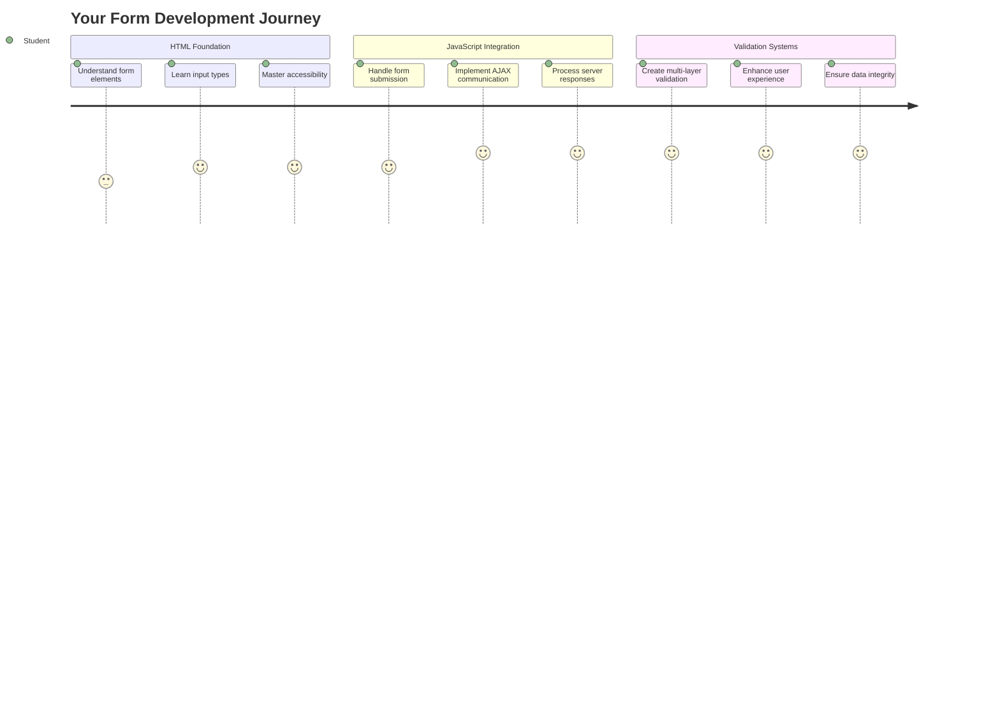
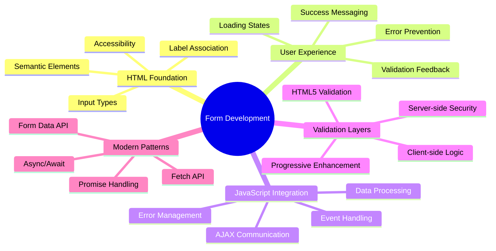
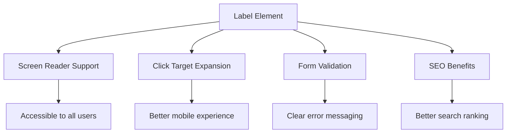
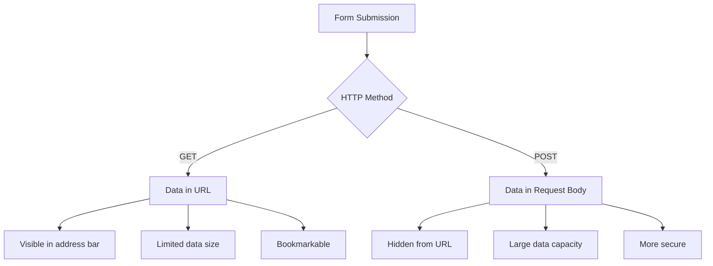
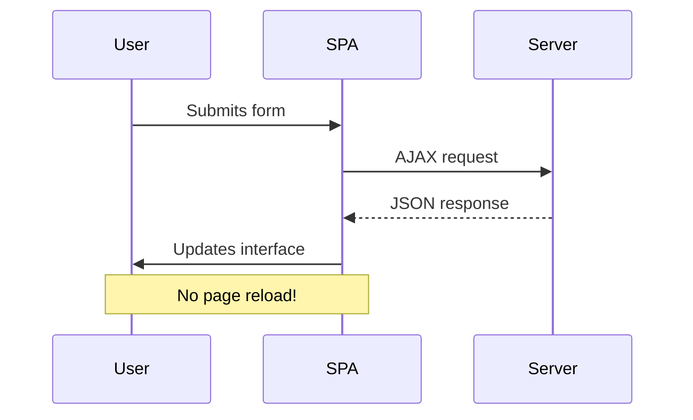
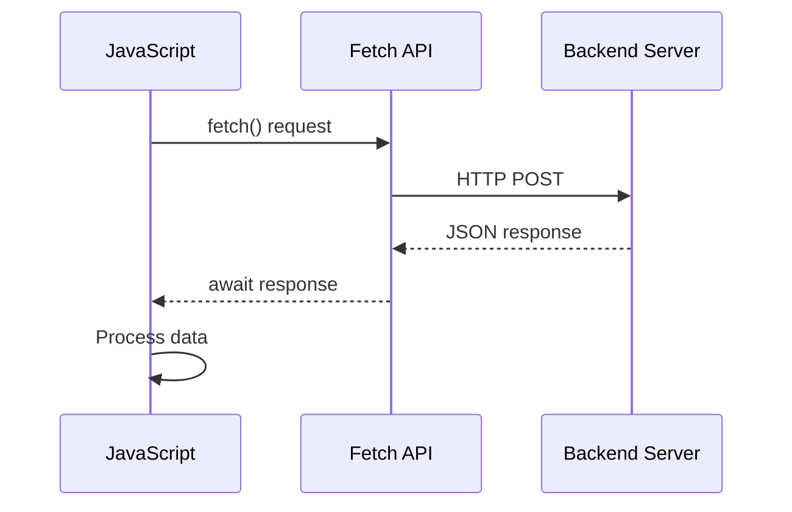
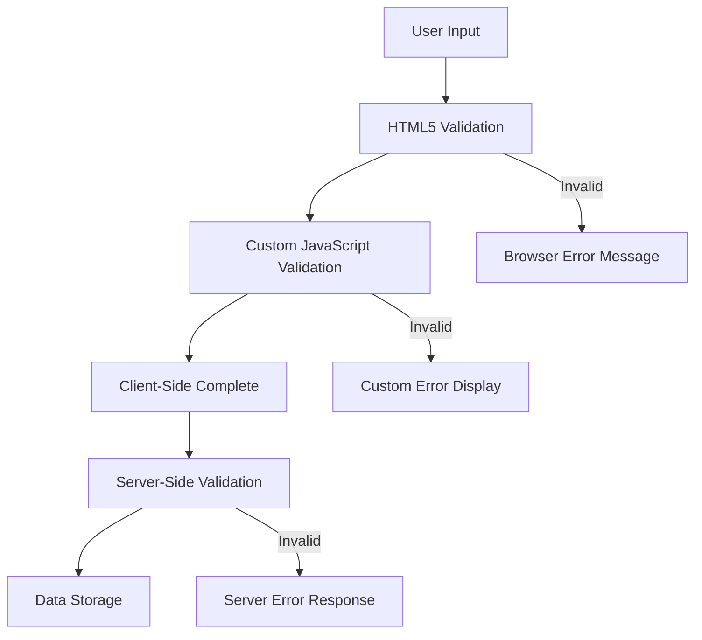
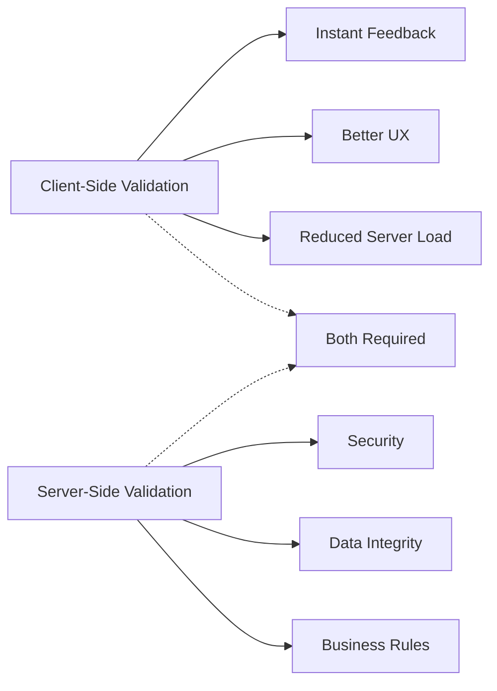
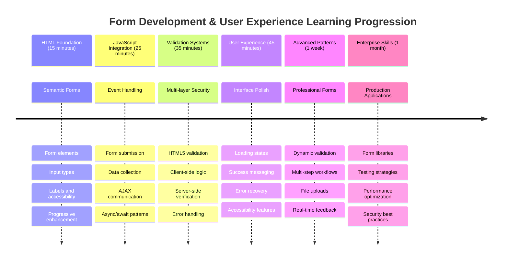

<!--
CO_OP_TRANSLATOR_METADATA:
{
  "original_hash": "7cbdbd132d39a2bb493e85bc2a9387cc",
  "translation_date": "2025-11-04T01:36:11+00:00",
  "source_file": "7-bank-project/2-forms/README.md",
  "language_code": "fi"
}
-->
# Rakenna pankkisovellus, osa 2: Luo kirjautumis- ja rekisteröintilomake



## Ennakkokysely

[Ennakkokysely](https://ff-quizzes.netlify.app/web/quiz/43)

Oletko koskaan täyttänyt lomaketta verkossa ja saanut virheilmoituksen sähköpostiosoitteen muodosta? Tai menettänyt kaikki tiedot, kun klikkasit "lähetä"? Me kaikki olemme kokeneet näitä turhauttavia tilanteita.

Lomakkeet ovat silta käyttäjien ja sovelluksesi toiminnallisuuden välillä. Kuten lennonjohtajien tarkat protokollat, jotka ohjaavat lentokoneet turvallisesti määränpäähänsä, hyvin suunnitellut lomakkeet antavat selkeää palautetta ja estävät kalliita virheitä. Huonot lomakkeet taas voivat karkottaa käyttäjät nopeammin kuin väärinkäsitys vilkkaassa lentokentässä.

Tässä oppitunnissa muutamme staattisen pankkisovelluksesi interaktiiviseksi sovellukseksi. Opit rakentamaan lomakkeita, jotka validoivat käyttäjän syötteet, kommunikoivat palvelimien kanssa ja antavat hyödyllistä palautetta. Ajattele tätä ohjausliittymän rakentamisena, joka antaa käyttäjille mahdollisuuden navigoida sovelluksesi ominaisuuksissa.

Lopuksi sinulla on täydellinen kirjautumis- ja rekisteröintijärjestelmä, jossa on validointi, joka ohjaa käyttäjiä kohti onnistumista eikä turhautumista.



## Esivaatimukset

Ennen kuin aloitamme lomakkeiden rakentamisen, varmistetaan, että kaikki on asetettu oikein. Tämä oppitunti jatkuu suoraan siitä, mihin edellinen jäi, joten jos olet hypännyt eteenpäin, kannattaa palata ja varmistaa perusasiat ensin.

### Vaadittavat asetukset

| Komponentti | Tila | Kuvaus |
|-------------|------|--------|
| [HTML-mallit](../1-template-route/README.md) | ✅ Vaadittu | Pankkisovelluksesi perusrakenne |
| [Node.js](https://nodejs.org) | ✅ Vaadittu | JavaScript-ajoympäristö palvelimelle |
| [Pankin API-palvelin](../api/README.md) | ✅ Vaadittu | Tietojen tallennuksen taustapalvelu |

> 💡 **Kehitysvinkki**: Sinulla tulee olla kaksi erillistä palvelinta käynnissä samanaikaisesti – yksi pankkisovelluksen käyttöliittymälle ja toinen taustapalvelun API:lle. Tämä asetus jäljittelee todellista kehitysympäristöä, jossa käyttöliittymä ja taustapalvelut toimivat itsenäisesti.

### Palvelimen konfigurointi

**Kehitysympäristösi sisältää:**
- **Käyttöliittymäpalvelin**: Palvelee pankkisovellustasi (tyypillisesti portti `3000`)
- **Taustapalvelimen API**: Käsittelee tietojen tallennusta ja hakua (portti `5000`)
- **Molemmat palvelimet** voivat toimia samanaikaisesti ilman konflikteja

**API-yhteyden testaaminen:**
```bash
curl http://localhost:5000/api
# Expected response: "Bank API v1.0.0"
```

**Jos näet API-version vastauksen, voit jatkaa!**

---

## HTML-lomakkeiden ja kontrollien ymmärtäminen

HTML-lomakkeet ovat tapa, jolla käyttäjät kommunikoivat verkkosovelluksesi kanssa. Ajattele niitä kuin 1800-luvun lennätinjärjestelmää – ne ovat viestintäprotokolla käyttäjän tarkoituksen ja sovelluksen vastauksen välillä. Huolellisesti suunniteltuina ne havaitsevat virheet, ohjaavat syötteen muotoilua ja antavat hyödyllisiä ehdotuksia.

Modernit lomakkeet ovat huomattavasti kehittyneempiä kuin pelkät tekstikentät. HTML5 esitteli erikoistuneita syötetyyppejä, jotka käsittelevät sähköpostin validointia, numeromuotoilua ja päivämäärän valintaa automaattisesti. Nämä parannukset hyödyttävät sekä saavutettavuutta että mobiilikäyttäjäkokemusta.

### Välttämättömät lomake-elementit

**Rakennuspalikat, joita jokainen lomake tarvitsee:**

```html
<!-- Basic form structure -->
<form id="userForm" method="POST">
  <label for="username">Username</label>
  <input id="username" name="username" type="text" required>
  
  <button type="submit">Submit</button>
</form>
```

**Tämä koodi tekee seuraavaa:**
- **Luo** lomakekontainerin, jolla on yksilöllinen tunniste
- **Määrittää** HTTP-menetelmän tietojen lähettämiseen
- **Yhdistää** etiketit syötteisiin saavutettavuuden parantamiseksi
- **Määrittää** lähetyspainikkeen lomakkeen käsittelyyn

### Modernit syötetyypit ja attribuutit

| Syötetyyppi | Tarkoitus | Esimerkki |
|-------------|----------|-----------|
| `text` | Yleinen tekstisyöte | `<input type="text" name="username">` |
| `email` | Sähköpostin validointi | `<input type="email" name="email">` |
| `password` | Piilotettu tekstisyöte | `<input type="password" name="password">` |
| `number` | Numeerinen syöte | `<input type="number" name="balance" min="0">` |
| `tel` | Puhelinnumerot | `<input type="tel" name="phone">` |

> 💡 **Modernin HTML5:n etu**: Käyttämällä tiettyjä syötetyyppejä saat automaattisen validoinnin, sopivat mobiilinäppäimistöt ja paremman saavutettavuuden ilman lisättyä JavaScriptiä!

### Painiketyypit ja niiden toiminta

```html
<!-- Different button behaviors -->
<button type="submit">Save Data</button>     <!-- Submits the form -->
<button type="reset">Clear Form</button>    <!-- Resets all fields -->
<button type="button">Custom Action</button> <!-- No default behavior -->
```

**Tässä mitä kukin painiketyyppi tekee:**
- **Lähetyspainikkeet**: Käynnistävät lomakkeen lähetyksen ja lähettävät tiedot määritettyyn päätepisteeseen
- **Palautuspainikkeet**: Palauttavat kaikki lomakekentät alkuperäiseen tilaansa
- **Tavalliset painikkeet**: Eivät tarjoa oletustoimintoa, vaativat mukautettua JavaScriptiä toiminnallisuuteen

> ⚠️ **Tärkeä huomio**: `<input>`-elementti on itsestään sulkeutuva eikä vaadi sulkevaa tagia. Moderni paras käytäntö on kirjoittaa `<input>` ilman vinoviivaa.

### Kirjautumislomakkeen rakentaminen

Rakennetaan nyt käytännöllinen kirjautumislomake, joka havainnollistaa moderneja HTML-lomakekäytäntöjä. Aloitamme perusrakenteesta ja parannamme sitä asteittain saavutettavuusominaisuuksilla ja validoinnilla.

```html
<template id="login">
  <h1>Bank App</h1>
  <section>
    <h2>Login</h2>
    <form id="loginForm" novalidate>
      <div class="form-group">
        <label for="username">Username</label>
        <input id="username" name="user" type="text" required 
               autocomplete="username" placeholder="Enter your username">
      </div>
      <button type="submit">Login</button>
    </form>
  </section>
</template>
```

**Tässä mitä tapahtuu:**
- **Rakentaa** lomakkeen semanttisilla HTML5-elementeillä
- **Ryhmittelee** liittyvät elementit `div`-kontainereihin merkityksellisillä luokilla
- **Yhdistää** etiketit syötteisiin `for`- ja `id`-attribuuttien avulla
- **Sisältää** moderneja attribuutteja kuten `autocomplete` ja `placeholder` paremman käyttökokemuksen vuoksi
- **Lisää** `novalidate` käsittelemään validointia JavaScriptillä selaimen oletusten sijaan

### Oikeiden etikettien voima

**Miksi etiketit ovat tärkeitä modernissa verkkokehityksessä:**



**Mitä oikeat etiketit saavuttavat:**
- **Mahdollistavat** ruudunlukijoiden selkeän ilmoituksen lomakekentistä
- **Laajentavat** klikkausaluetta (etiketin klikkaaminen kohdistaa syötteen)
- **Parantavat** mobiilikäytettävyyttä suuremmilla kosketuskohteilla
- **Tukevat** lomakevalidointia merkityksellisillä virheilmoituksilla
- **Parantavat** SEO:ta antamalla semanttista merkitystä lomake-elementeille

> 🎯 **Saavutettavuustavoite**: Jokaisella lomakesyötteellä tulisi olla siihen liittyvä etiketti. Tämä yksinkertainen käytäntö tekee lomakkeistasi kaikkien, myös vammaisten käyttäjien, käytettävissä ja parantaa kaikkien käyttäjien kokemusta.

### Rekisteröintilomakkeen luominen

Rekisteröintilomake vaatii yksityiskohtaisempia tietoja täydellisen käyttäjätilin luomiseksi. Rakennetaan se moderneilla HTML5-ominaisuuksilla ja parannetulla saavutettavuudella.

```html
<hr/>
<h2>Register</h2>
<form id="registerForm" novalidate>
  <div class="form-group">
    <label for="user">Username</label>
    <input id="user" name="user" type="text" required 
           autocomplete="username" placeholder="Choose a username">
  </div>
  
  <div class="form-group">
    <label for="currency">Currency</label>
    <input id="currency" name="currency" type="text" value="$" 
           required maxlength="3" placeholder="USD, EUR, etc.">
  </div>
  
  <div class="form-group">
    <label for="description">Account Description</label>
    <input id="description" name="description" type="text" 
           maxlength="100" placeholder="Personal savings, checking, etc.">
  </div>
  
  <div class="form-group">
    <label for="balance">Starting Balance</label>
    <input id="balance" name="balance" type="number" value="0" 
           min="0" step="0.01" placeholder="0.00">
  </div>
  
  <button type="submit">Create Account</button>
</form>
```

**Yllä olevassa olemme:**
- **Järjestäneet** jokaisen kentän kontainer-diveihin paremman tyylin ja asettelun vuoksi
- **Lisänneet** sopivat `autocomplete`-attribuutit selaimen automaattisen täytön tueksi
- **Sisällyttäneet** hyödyllistä placeholder-tekstiä ohjaamaan käyttäjän syötettä
- **Asettaneet** järkevät oletusarvot `value`-attribuutin avulla
- **Soveltaneet** validointiattribuutteja kuten `required`, `maxlength` ja `min`
- **Käyttäneet** `type="number"` saldo-kentässä desimaalitarkkuuden tukemiseksi

### Syötetyyppien ja toiminnan tutkiminen

**Modernit syötetyypit tarjoavat parannettua toiminnallisuutta:**

| Ominaisuus | Hyöty | Esimerkki |
|------------|-------|----------|
| `type="number"` | Numeerinen näppäimistö mobiilissa | Helpompi saldon syöttö |
| `step="0.01"` | Desimaalitarkkuuden hallinta | Mahdollistaa senttien käytön valuutassa |
| `autocomplete` | Selaimen automaattinen täyttö | Nopeampi lomakkeen täyttö |
| `placeholder` | Kontekstuaaliset vihjeet | Ohjaa käyttäjän odotuksia |

> 🎯 **Saavutettavuushaaste**: Kokeile navigoida lomakkeissa vain näppäimistön avulla! Käytä `Tab` siirtyäksesi kenttien välillä, `Space` valintaruutujen valintaan ja `Enter` lomakkeen lähettämiseen. Tämä kokemus auttaa ymmärtämään, miten ruudunlukijakäyttäjät vuorovaikuttavat lomakkeidesi kanssa.

### 🔄 **Pedagoginen tarkistus**
**Lomakeperustan ymmärtäminen**: Ennen JavaScriptin käyttöönottoa varmista, että ymmärrät:
- ✅ Kuinka semanttinen HTML luo saavutettavia lomakerakenteita
- ✅ Miksi syötetyypit ovat tärkeitä mobiilinäppäimistöille ja validoinnille
- ✅ Etikettien ja lomakekontrollien välinen suhde
- ✅ Kuinka lomakeattribuutit vaikuttavat selaimen oletuskäyttäytymiseen

**Nopea itsearviointi**: Mitä tapahtuu, jos lähetät lomakkeen ilman JavaScript-käsittelyä?
*Vastaus: Selaimen oletuslähetys tapahtuu, yleensä uudelleenohjaus action-URL:ään*

**HTML5-lomakkeiden edut**: Modernit lomakkeet tarjoavat:
- **Sisäänrakennettu validointi**: Automaattinen sähköpostin ja numeron muodon tarkistus
- **Mobiilioptimointi**: Sopivat näppäimistöt eri syötetyypeille
- **Saavutettavuus**: Ruudunlukijatuki ja näppäimistönavigointi
- **Progressiivinen parannus**: Toimii myös, kun JavaScript on pois päältä

## Lomakkeen lähetysmenetelmien ymmärtäminen

Kun joku täyttää lomakkeesi ja painaa "lähetä", tiedot täytyy lähettää jonnekin – yleensä palvelimelle, joka voi tallentaa ne. On olemassa muutamia eri tapoja, joilla tämä voi tapahtua, ja oikean valitseminen voi säästää sinut myöhemmiltä päänsäryiltä.

Katsotaanpa, mitä oikeastaan tapahtuu, kun joku klikkaa lähetyspainiketta.

### Lomakkeen oletuskäyttäytyminen

Ensiksi tarkastellaan, mitä tapahtuu peruslomakkeen lähetyksessä:

**Testaa nykyiset lomakkeesi:**
1. Klikkaa lomakkeesi *Rekisteröidy*-painiketta
2. Tarkkaile muutoksia selaimesi osoiterivillä
3. Huomaa, kuinka sivu latautuu uudelleen ja tiedot näkyvät URL-osoitteessa


### HTTP-menetelmien vertailu



**Ymmärrä erot:**

| Menetelmä | Käyttötapaus | Tietojen sijainti | Turvallisuustaso | Kokorajoitus |
|-----------|--------------|-------------------|------------------|--------------|
| `GET` | Hakukyselyt, suodattimet | URL-parametrit | Matala (näkyvä) | ~2000 merkkiä |
| `POST` | Käyttäjätilit, arkaluontoiset tiedot | Pyynnön runko | Korkeampi (piilotettu) | Ei käytännön rajoitusta |

**Peruserojen ymmärtäminen:**
- **GET**: Lisää lomaketiedot URL-osoitteeseen kyselyparametreina (sopii hakutoimintoihin)
- **POST**: Sisältää tiedot pyynnön rungossa (välttämätön arkaluontoisille tiedoille)
- **GET-rajoitukset**: Kokorajoitukset, näkyvät tiedot, pysyvä selaushistoria
- **POST-edut**: Suuri tietokapasiteetti, yksityisyyden suoja, tiedostojen lataustuki

> 💡 **Paras käytäntö**: Käytä `GET` hakulomakkeisiin ja suodattimiin (tietojen haku), käytä `POST` käyttäjätilien luomiseen, kirjautumiseen ja tietojen luomiseen.

### Lomakkeen lähetyksen konfigurointi

Konfiguroidaan rekisteröintilomakkeesi kommunikoimaan oikein taustapalvelimen API:n kanssa POST-menetelmää käyttäen:

```html
<form id="registerForm" action="//localhost:5000/api/accounts" 
      method="POST" novalidate>
```

**Tämä konfiguraatio tekee seuraavaa:**
- **Ohjaa** lomakkeen lähetyksen API-päätepisteeseen
- **Käyttää** POST-menetelmää turvalliseen tiedonsiirtoon
- **Sisältää** `novalidate` käsittelemään validointia JavaScriptillä

### Lomakkeen lähetyksen testaaminen

**Seuraa näitä vaiheita testataksesi lomakettasi:**
1. **Täytä** rekisteröintilomake tiedoillasi
2. **Klikkaa** "Luo tili" -painiketta
3. **Tarkkaile** palvelimen vastausta selaimessasi


**Mitä sinun pitäisi nähdä:**
- **Selaimen uudelleenohjaus** API-päätepisteen URL-osoitteeseen
- **JSON-vastaus**, joka sisältää juuri luodun tilin tiedot
- **Palvelimen vahvistus**, että tili luotiin onnistuneesti

> 🧪 **Kokeiluaika**: Kokeile rekisteröityä uudelleen samalla käyttäjänimellä. Minkälaisen vastauksen saat? Tämä auttaa sinua ymmärtämään, miten palvelin käsittelee päällekkäisiä tietoja ja virhetilanteita.

### JSON-vastausten ymmärtäminen

**Kun palvelin käsittelee lomakkeesi onnistuneesti:**
```json
{
  "user": "john_doe",
  "currency": "$",
  "description": "Personal savings",
  "balance": 100,
  "id": "unique_account_id"
}
```

**Tämä vastaus vahvistaa:**
- **Luo** uuden tilin määritetyillä tiedoillasi
- **Määrittää** yksilöllisen tunnisteen tulevaa käyttöä varten
- **Palauttaa** kaikki tilitiedot tarkistusta varten
- **Ilmoittaa** onnistuneesta tietokannan tallennuksesta

## Moderni lomakkeiden käsittely JavaScriptillä

Perinteiset lomakelähetykset aiheuttavat koko sivun uudelleenlatauksia, kuten varhaiset avaruuslennot vaativat täydellisiä järjestelmän nollauksia kurssikorjauksia varten. Tämä lähestymistapa häiritsee käyttäjäkokemusta ja menettää sovelluksen tilan.

JavaScript-lomakkeiden käsittely toimii kuten modernien avaruusalusten jatkuvat ohjausjärjestelmät – tehden reaaliaikaisia säätöjä menettämättä navigointikontekstia. Voimme estää lomakelähetykset, antaa välitöntä palautetta, käsitellä virheitä sujuvasti ja päivittää käyttöliittymää palvelimen vastausten perusteella samalla, kun säilytämme käyttäjän sijainnin sovelluksessa.

### Miksi välttää sivun uudelleenlatauksia?



**JavaScript-lomakkeiden käsittelyn edut:**
- **Säilyttää** sovelluksen tilan ja käyttäjän kontekstin
- **Tarjoaa** välit
```javascript
// Example of what FormData captures
const formData = new FormData(registerForm);

// FormData automatically captures:
// {
//   "user": "john_doe",
//   "currency": "$", 
//   "description": "Personal account",
//   "balance": "100"
// }
```

**FormData API:n edut:**
- **Kattava kokoelma**: Tallentaa kaikki lomakeelementit, kuten teksti, tiedostot ja monimutkaiset syötteet
- **Tyyppitietoisuus**: Käsittelee automaattisesti eri syöttötyypit ilman räätälöityä koodausta
- **Tehokkuus**: Poistaa tarpeen kerätä kenttiä manuaalisesti yhdellä API-kutsulla
- **Mukautuvuus**: Säilyttää toiminnallisuuden lomakerakenteen muuttuessa

### Palvelinviestintäfunktion luominen

Rakennetaan nyt vankka funktio, joka kommunikoi API-palvelimesi kanssa käyttäen moderneja JavaScript-malleja:

```javascript
async function createAccount(account) {
  try {
    const response = await fetch('//localhost:5000/api/accounts', {
      method: 'POST',
      headers: { 
        'Content-Type': 'application/json',
        'Accept': 'application/json'
      },
      body: account
    });
    
    // Check if the response was successful
    if (!response.ok) {
      throw new Error(`HTTP error! status: ${response.status}`);
    }
    
    return await response.json();
  } catch (error) {
    console.error('Account creation failed:', error);
    return { error: error.message || 'Network error occurred' };
  }
}
```

**Asynkronisen JavaScriptin ymmärtäminen:**



**Mitä tämä moderni toteutus saavuttaa:**
- **Käyttää** `async/await`-rakenteita luettavan asynkronisen koodin luomiseen
- **Sisältää** asianmukaisen virheenkäsittelyn try/catch-lohkoilla
- **Tarkistaa** vastauksen tilan ennen datan käsittelyä
- **Asettaa** oikeat otsikot JSON-kommunikaatiota varten
- **Tarjoaa** yksityiskohtaisia virheilmoituksia virheenkorjaukseen
- **Palauttaa** johdonmukaisen tietorakenteen onnistumis- ja virhetapauksissa

### Modernin Fetch API:n voima

**Fetch API:n edut vanhempiin menetelmiin verrattuna:**

| Ominaisuus | Etu | Toteutus |
|------------|-----|----------|
| Lupauspohjainen | Selkeä asynkroninen koodi | `await fetch()` |
| Pyynnön räätälöinti | Täysi HTTP-ohjaus | Otsikot, metodit, runko |
| Vastauksen käsittely | Joustava datan jäsentäminen | `.json()`, `.text()`, `.blob()` |
| Virheenkäsittely | Kattava virheiden hallinta | Try/catch-lohkot |

> 🎥 **Lisätietoja**: [Async/Await-opas](https://youtube.com/watch?v=YwmlRkrxvkk) - Ymmärrä asynkronisen JavaScriptin mallit modernia web-kehitystä varten.

**Keskeiset käsitteet palvelinviestinnässä:**
- **Asynkroniset funktiot** mahdollistavat suorittamisen keskeyttämisen palvelinvastausten odottamiseksi
- **Await-avainsana** tekee asynkronisesta koodista synkronisen näköistä
- **Fetch API** tarjoaa modernin, lupauspohjaisen HTTP-pyynnön
- **Virheenkäsittely** varmistaa, että sovelluksesi reagoi verkko-ongelmiin sulavasti

### Rekisteröintifunktion viimeistely

Tuodaan kaikki yhteen täydellisen, tuotantovalmiin rekisteröintifunktion avulla:

```javascript
async function register() {
  const registerForm = document.getElementById('registerForm');
  const submitButton = registerForm.querySelector('button[type="submit"]');
  
  try {
    // Show loading state
    submitButton.disabled = true;
    submitButton.textContent = 'Creating Account...';
    
    // Process form data
    const formData = new FormData(registerForm);
    const jsonData = JSON.stringify(Object.fromEntries(formData));
    
    // Send to server
    const result = await createAccount(jsonData);
    
    if (result.error) {
      console.error('Registration failed:', result.error);
      alert(`Registration failed: ${result.error}`);
      return;
    }
    
    console.log('Account created successfully!', result);
    alert(`Welcome, ${result.user}! Your account has been created.`);
    
    // Reset form after successful registration
    registerForm.reset();
    
  } catch (error) {
    console.error('Unexpected error:', error);
    alert('An unexpected error occurred. Please try again.');
  } finally {
    // Restore button state
    submitButton.disabled = false;
    submitButton.textContent = 'Create Account';
  }
}
```

**Tämä parannettu toteutus sisältää:**
- **Tarjoaa** visuaalista palautetta lomakkeen lähetyksen aikana
- **Poistaa käytöstä** lähetyspainikkeen estääkseen kaksoislähetykset
- **Käsittelee** sekä odotettuja että odottamattomia virheitä sulavasti
- **Näyttää** käyttäjäystävälliset onnistumis- ja virheilmoitukset
- **Nollaa** lomakkeen onnistuneen rekisteröinnin jälkeen
- **Palauttaa** käyttöliittymän tilan riippumatta lopputuloksesta

### Toteutuksen testaaminen

**Avaa selaimen kehittäjätyökalut ja testaa rekisteröinti:**

1. **Avaa** selaimen konsoli (F12 → Konsoli-välilehti)
2. **Täytä** rekisteröintilomake
3. **Klikkaa** "Luo tili"
4. **Tarkkaile** konsoliviestejä ja käyttäjäpalautetta


**Mitä sinun pitäisi nähdä:**
- **Lataustila** näkyy lähetyspainikkeessa
- **Konsolilokit** näyttävät yksityiskohtaisia tietoja prosessista
- **Onnistumisviesti** ilmestyy, kun tilin luominen onnistuu
- **Lomake nollautuu** automaattisesti onnistuneen lähetyksen jälkeen

> 🔒 **Tietoturva huomio**: Tällä hetkellä data kulkee HTTP:n kautta, mikä ei ole turvallista tuotantokäyttöön. Todellisissa sovelluksissa käytä aina HTTPS:ää datan salaukseen. Lue lisää [HTTPS-turvallisuudesta](https://en.wikipedia.org/wiki/HTTPS) ja miksi se on tärkeää käyttäjädatan suojaamiseksi.

### 🔄 **Pedagoginen tarkistus**
**Moderni JavaScript-integraatio**: Varmista ymmärryksesi asynkronisesta lomakekäsittelystä:
- ✅ Miten `event.preventDefault()` muuttaa lomakkeen oletuskäyttäytymistä?
- ✅ Miksi FormData API on tehokkaampi kuin manuaalinen kenttien keräys?
- ✅ Miten async/await-mallit parantavat koodin luettavuutta?
- ✅ Mikä rooli virheenkäsittelyllä on käyttäjäkokemuksessa?

**Järjestelmäarkkitehtuuri**: Lomakekäsittelysi osoittaa:
- **Tapahtumapohjainen ohjelmointi**: Lomakkeet reagoivat käyttäjän toimintoihin ilman sivun uudelleenlatausta
- **Asynkroninen viestintä**: Palvelinpyynnöt eivät estä käyttöliittymää
- **Virheenkäsittely**: Sulava toiminta verkko-ongelmien sattuessa
- **Tilanhallinta**: Käyttöliittymä päivittyy palvelimen vastausten mukaisesti
- **Progressiivinen parannus**: Perustoiminnallisuus toimii, JavaScript parantaa sitä

**Ammatilliset mallit**: Olet toteuttanut:
- **Yhden vastuun periaate**: Funktiot ovat selkeitä ja keskittyvät yhteen tarkoitukseen
- **Virherajat**: Try/catch-lohkot estävät sovelluksen kaatumisen
- **Käyttäjäpalaute**: Lataustilat ja onnistumis-/virheilmoitukset
- **Datan muuntaminen**: FormData JSON-muotoon palvelinkommunikaatiota varten

## Kattava lomakevalidointi

Lomakevalidointi estää turhauttavan kokemuksen, jossa virheet havaitaan vasta lähetyksen jälkeen. Kuten Kansainvälisen avaruusaseman moninkertaiset varajärjestelmät, tehokas validointi käyttää useita kerroksia turvallisuustarkistuksia.

Paras lähestymistapa yhdistää selaintason validoinnin välittömän palautteen saamiseksi, JavaScript-validoinnin käyttäjäkokemuksen parantamiseksi ja palvelinpuolen validoinnin turvallisuuden ja datan eheyden varmistamiseksi. Tämä redundanssi takaa sekä käyttäjätyytyväisyyden että järjestelmän suojauksen.

### Validointikerrosten ymmärtäminen



**Monikerroksinen validointistrategia:**
- **HTML5-validointi**: Välittömät selaimen suorittamat tarkistukset
- **JavaScript-validointi**: Räätälöity logiikka ja käyttäjäkokemuksen parantaminen
- **Palvelinvalidointi**: Lopulliset turvallisuus- ja datan eheystarkistukset
- **Progressiivinen parannus**: Toimii myös, jos JavaScript on pois päältä

### HTML5-validointiominaisuudet

**Modernit validointityökalut käytettävissäsi:**

| Ominaisuus | Tarkoitus | Esimerkki | Selaimen käyttäytyminen |
|------------|-----------|-----------|-------------------------|
| `required` | Pakolliset kentät | `<input required>` | Estää tyhjän lähetyksen |
| `minlength`/`maxlength` | Tekstin pituusrajat | `<input maxlength="20">` | Varmistaa merkkirajat |
| `min`/`max` | Numeraaliset rajat | `<input min="0" max="1000">` | Tarkistaa lukurajat |
| `pattern` | Mukautetut regex-säännöt | `<input pattern="[A-Za-z]+">` | Varmistaa tietyn muodon |
| `type` | Datatyypin validointi | `<input type="email">` | Muotokohtainen validointi |

### CSS-validointityylit

**Luo visuaalista palautetta validointitiloille:**

```css
/* Valid input styling */
input:valid {
  border-color: #28a745;
  background-color: #f8fff9;
}

/* Invalid input styling */
input:invalid {
  border-color: #dc3545;
  background-color: #fff5f5;
}

/* Focus states for better accessibility */
input:focus:valid {
  box-shadow: 0 0 0 0.2rem rgba(40, 167, 69, 0.25);
}

input:focus:invalid {
  box-shadow: 0 0 0 0.2rem rgba(220, 53, 69, 0.25);
}
```

**Mitä nämä visuaaliset vihjeet saavuttavat:**
- **Vihreät reunat**: Osoittavat onnistunutta validointia, kuten vihreät valot ohjauskeskuksessa
- **Punaiset reunat**: Ilmaisevat validointivirheitä, jotka vaativat huomiota
- **Fokuskorostukset**: Antavat selkeän visuaalisen kontekstin nykyiselle syöttökohdalle
- **Johdonmukainen tyyli**: Luo ennustettavia käyttöliittymämalleja, joita käyttäjät voivat oppia

> 💡 **Vinkki**: Käytä `:valid` ja `:invalid` CSS-pseudoluokkia tarjotaksesi välitöntä visuaalista palautetta käyttäjille heidän kirjoittaessaan, luoden reagoivan ja hyödyllisen käyttöliittymän.

### Kattavan validoinnin toteuttaminen

Parannetaan rekisteröintilomakettasi vankalla validoinnilla, joka tarjoaa erinomaisen käyttäjäkokemuksen ja datan laadun:

```html
<form id="registerForm" method="POST" novalidate>
  <div class="form-group">
    <label for="user">Username <span class="required">*</span></label>
    <input id="user" name="user" type="text" required 
           minlength="3" maxlength="20" 
           pattern="[a-zA-Z0-9_]+" 
           autocomplete="username"
           title="Username must be 3-20 characters, letters, numbers, and underscores only">
    <small class="form-text">Choose a unique username (3-20 characters)</small>
  </div>
  
  <div class="form-group">
    <label for="currency">Currency <span class="required">*</span></label>
    <input id="currency" name="currency" type="text" required 
           value="$" maxlength="3" 
           pattern="[A-Z$€£¥₹]+" 
           title="Enter a valid currency symbol or code">
    <small class="form-text">Currency symbol (e.g., $, €, £)</small>
  </div>
  
  <div class="form-group">
    <label for="description">Account Description</label>
    <input id="description" name="description" type="text" 
           maxlength="100" 
           placeholder="Personal savings, checking, etc.">
    <small class="form-text">Optional description (up to 100 characters)</small>
  </div>
  
  <div class="form-group">
    <label for="balance">Starting Balance</label>
    <input id="balance" name="balance" type="number" 
           value="0" min="0" step="0.01" 
           title="Enter a positive number for your starting balance">
    <small class="form-text">Initial account balance (minimum $0.00)</small>
  </div>
  
  <button type="submit">Create Account</button>
</form>
```

**Parannetun validoinnin ymmärtäminen:**
- **Yhdistää** pakollisten kenttien indikaattorit hyödyllisiin kuvauksiin
- **Sisältää** `pattern`-attribuutit muotovalidointia varten
- **Tarjoaa** `title`-attribuutit saavutettavuuden ja työkaluvihjeiden vuoksi
- **Lisää** aputekstiä ohjaamaan käyttäjän syötettä
- **Käyttää** semanttista HTML-rakennetta paremman saavutettavuuden vuoksi

### Edistyneet validointisäännöt

**Mitä kukin validointisääntö saavuttaa:**

| Kenttä | Validointisäännöt | Käyttäjän hyöty |
|--------|-------------------|-----------------|
| Käyttäjänimi | `required`, `minlength="3"`, `maxlength="20"`, `pattern="[a-zA-Z0-9_]+"` | Varmistaa kelvolliset, yksilölliset tunnisteet |
| Valuutta | `required`, `maxlength="3"`, `pattern="[A-Z$€£¥₹]+"` | Hyväksyy yleiset valuuttasymbolit |
| Saldo | `min="0"`, `step="0.01"`, `type="number"` | Estää negatiiviset saldot |
| Kuvaus | `maxlength="100"` | Kohtuulliset pituusrajat |

### Validointikäyttäytymisen testaaminen

**Kokeile näitä validointiskenaarioita:**
1. **Lähetä** lomake tyhjillä pakollisilla kentillä
2. **Syötä** käyttäjänimi, joka on alle 3 merkkiä pitkä
3. **Kokeile** erikoismerkkejä käyttäjänimi-kentässä
4. **Anna** negatiivinen saldo


**Mitä huomaat:**
- **Selaimen näyttämät** natiivivalidointiviestit
- **Tyylimuutokset** perustuvat `:valid` ja `:invalid`-tiloihin
- **Lomakkeen lähetys** estetään, kunnes kaikki validoinnit läpäistään
- **Fokus siirtyy automaattisesti** ensimmäiseen virheelliseen kenttään

### Asiakaspuolen vs palvelinpuolen validointi



**Miksi tarvitset molemmat kerrokset:**
- **Asiakaspuolen validointi**: Tarjoaa välitöntä palautetta ja parantaa käyttäjäkokemusta
- **Palvelinpuolen validointi**: Varmistaa turvallisuuden ja käsittelee monimutkaisia liiketoimintasääntöjä
- **Yhdistetty lähestymistapa**: Luo vankkoja, käyttäjäystävällisiä ja turvallisia sovelluksia
- **Progressiivinen parannus**: Toimii myös, kun JavaScript on pois päältä

> 🛡️ **Tietoturvamuistutus**: Älä koskaan luota pelkkään asiakaspuolen validointiin! Haitalliset käyttäjät voivat ohittaa asiakaspuolen tarkistukset, joten palvelinpuolen validointi on välttämätöntä turvallisuuden ja datan eheyden varmistamiseksi.

### ⚡ **Mitä voit tehdä seuraavan 5 minuutin aikana**
- [ ] Testaa lomakettasi virheellisillä tiedoilla nähdäksesi validointiviestit
- [ ] Kokeile lomakkeen lähettämistä ilman JavaScriptiä nähdäksesi HTML5-validoinnin
- [ ] Avaa selaimen kehittäjätyökalut ja tarkista palvelimelle lähetettävä lomakedata
- [ ] Kokeile erilaisia syöttötyyppejä nähdäksesi mobiilin näppäimistön muutokset

### 🎯 **Mitä voit saavuttaa tämän tunnin aikana**
- [ ] Suorita oppitunnin jälkeinen kysely ja ymmärrä lomakekäsittelyn käsitteet
- [ ] Toteuta kattava validointihaaste reaaliaikaisella palautteella
- [ ] Lisää CSS-tyylit ammattimaisen näköisten lomakkeiden luomiseksi
- [ ] Luo virheenkäsittelyä kaksoiskäyttäjänimille ja palvelinvirheille
- [ ] Lisää salasanan vahvistuskentät vastaavuusvalidoinnilla

### 📅 **Viikon mittainen lomakemestaruusmatkasi**
- [ ] Viimeistele koko pankkisovellus edistyneillä lomaketoiminnoilla
- [ ] Toteuta tiedostojen latausominaisuudet profiilikuville tai asiakirjoille
- [ ] Lisää monivaiheiset lomakkeet etenemisen ilmaisimilla ja tilanhallinnalla
- [ ] Luo dynaamisia lomakkeita, jotka mukautuvat käyttäjän valintojen mukaan
- [ ] Toteuta lomakkeen automaattinen tallennus ja palautus paremman käyttäjäkokemuksen vuoksi
- [ ] Lisää edistynyttä validointia, kuten sähköpostin vahvistus ja puhelinnumeron muotoilu

### 🌟 **Kuukauden mittainen frontend-kehityksen mestaruus**
- [ ] Rakenna monimutkaisia lomakesovelluksia ehdollisella logiikalla ja työnkuluilla
- [ ] Opi lomakekirjastoja ja -kehyksiä nopeaan kehitykseen
- [ ] Hallitse saavutettavuusohjeet ja inklusiivisen suunnittelun periaatteet
- [ ] Toteuta kansainvälistäminen ja lokalisaatio globaalien lomakkeiden luomiseksi
- [ ] Luo uudelleenkäytettäviä lomakekomponenttikirjastoja ja suunnittelujärjestelmiä
- [ ] Osallistu avoimen lähdekoodin lomakeprojekteihin ja jaa parhaita käytäntöjä

## 🎯 Lomakekehityksen mestaruusaikataulusi



### 🛠️ Lomakekehityksen työkalupakin yhteenveto

Tämän oppitunnin jälkeen olet hallinnut:
- **HTML5-lomakkeet**: Semanttinen rakenne, syöttötyypit ja saavutettavuusominaisuudet
- **JavaScript-lomakekäsittely**: Tapahtumien hallinta, datan keräys ja AJAX-kommunikaatio
- **Validointiarkkitehtuuri**: Monikerroksinen validointi turvallisuutta ja käyttäjäkokemusta varten
- **Asynkroninen ohjelmointi**: Moderni Fetch API ja async/await-mallit
- **Virheiden hallinta**: Kattava virheenkäsittely ja käyttäjäpalautesysteemit
- **Käyttäjäkokemuksen suunnittelu**: Lataustilat, onnistumisviestit ja virheiden palautus
- **Progressiivinen parannus**: Lomakkeet, jotka toimivat kaikilla selaimilla ja ominaisuuksilla

**Todelliset sovellukset**: Lomakekehitystaitosi soveltuvat suoraan:
- **Verkkokauppasovelluksiin**: Kassaprosessit, tilin rekisteröinti ja maksulomakkeet
- **Yritysohjelmistoihin**: Tietojen syöttöjärjestelmät, raportointikäyttöliittymät ja työnkulut
- **Sisällönhallintaan**: Julkaisualustat, käyttäjien tuottama sisältö ja hallinnolliset käyttöliittymät

**Prompt:** Luo täydellinen lomakkeen validointijärjestelmä rekisteröintilomakkeelle, joka sisältää: 1) Reaaliaikaisen validointipalautteen jokaiselle kentälle käyttäjän kirjoittaessa, 2) Mukautetut validointiviestit, jotka näkyvät jokaisen syöttökentän alla, 3) Salasanan vahvistuskentän, jossa on vastaavuusvalidointi, 4) Visuaaliset indikaattorit (kuten vihreät valintamerkit kelvollisille kentille ja punaiset varoitukset virheellisille), 5) Lähetä-painikkeen, joka aktivoituu vasta, kun kaikki validoinnit ovat kunnossa. Käytä HTML5-validointiominaisuuksia, CSS:ää validointitilojen tyylittelyyn ja JavaScriptiä interaktiiviseen toimintaan.

Lisätietoja [agent mode](https://code.visualstudio.com/blogs/2025/02/24/introducing-copilot-agent-mode) -tilasta löytyy täältä.

## 🚀 Haaste

Näytä virheilmoitus HTML:ssä, jos käyttäjä on jo olemassa.

Tässä on esimerkki siitä, miltä lopullinen kirjautumissivu voi näyttää pienen tyylittelyn jälkeen:


## Luentojälkeinen kysely

[Luentojälkeinen kysely](https://ff-quizzes.netlify.app/web/quiz/44)

## Kertaus ja itseopiskelu

Kehittäjät ovat olleet erittäin luovia lomakkeiden rakentamisessa, erityisesti validointistrategioiden osalta. Tutustu erilaisiin lomakevirtoihin selaamalla [CodePen](https://codepen.com); löydätkö mielenkiintoisia ja inspiroivia lomakkeita?

## Tehtävä

[Muotoile pankkisovelluksesi](assignment.md)

---

**Vastuuvapauslauseke**:  
Tämä asiakirja on käännetty käyttämällä tekoälypohjaista käännöspalvelua [Co-op Translator](https://github.com/Azure/co-op-translator). Vaikka pyrimme tarkkuuteen, huomioithan, että automaattiset käännökset voivat sisältää virheitä tai epätarkkuuksia. Alkuperäinen asiakirja sen alkuperäisellä kielellä tulisi pitää ensisijaisena lähteenä. Kriittisen tiedon osalta suositellaan ammattimaista ihmiskäännöstä. Emme ole vastuussa väärinkäsityksistä tai virhetulkinnoista, jotka johtuvat tämän käännöksen käytöstä.