<!--
CO_OP_TRANSLATOR_METADATA:
{
  "original_hash": "86ee5069f27ea3151389d8687c95fac9",
  "translation_date": "2025-11-04T01:32:51+00:00",
  "source_file": "7-bank-project/3-data/README.md",
  "language_code": "fi"
}
-->
# Rakenna pankkisovellus, osa 3: Tietojen hakeminen ja käyttäminen

Ajattele Star Trekin Enterprise-aluksen tietokonetta - kun kapteeni Picard kysyy aluksen tilasta, tiedot ilmestyvät välittömästi ilman, että koko käyttöliittymä sulkeutuu ja rakentuu uudelleen. Juuri tällaista saumattoman tiedonkulun järjestelmää olemme rakentamassa dynaamisella tiedonhakumenetelmällä.

Tällä hetkellä pankkisovelluksesi on kuin painettu sanomalehti - informatiivinen mutta staattinen. Muutamme sen NASA:n ohjauskeskuksen kaltaiseksi, jossa tiedot virtaavat jatkuvasti ja päivittyvät reaaliajassa keskeyttämättä käyttäjän työskentelyä.

Opit kommunikoimaan palvelimien kanssa asynkronisesti, käsittelemään eri aikoina saapuvia tietoja ja muuntamaan raakadataa käyttäjille merkitykselliseksi. Tämä erottaa demoversion tuotantovalmiista ohjelmistosta.

## ⚡ Mitä voit tehdä seuraavien 5 minuutin aikana

**Nopea aloitus kiireisille kehittäjille**

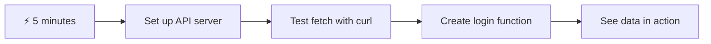

- **Minuutit 1-2**: Käynnistä API-palvelin (`cd api && npm start`) ja testaa yhteys
- **Minuutti 3**: Luo yksinkertainen `getAccount()`-funktio käyttäen fetchiä
- **Minuutti 4**: Yhdistä kirjautumislomake `action="javascript:login()"`
- **Minuutti 5**: Testaa kirjautuminen ja katso, kuinka tilitiedot ilmestyvät konsoliin

**Nopeat testikomennot**:
```bash
# Verify API is running
curl http://localhost:5000/api

# Test account data fetch
curl http://localhost:5000/api/accounts/test
```

**Miksi tämä on tärkeää**: Viidessä minuutissa näet asynkronisen tiedonhakumenetelmän taian, joka on jokaisen modernin verkkosovelluksen voimanlähde. Tämä on perusta, joka saa sovellukset tuntumaan responsiivisilta ja eläviltä.

## 🗺️ Oppimispolkusi dataohjattujen verkkosovellusten parissa

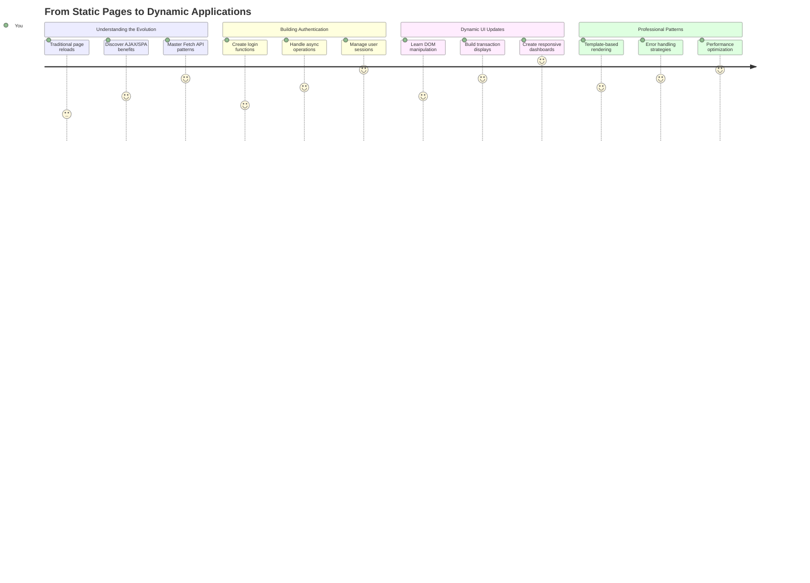

**Oppimispolkusi päämäärä**: Tämän oppitunnin lopussa ymmärrät, kuinka modernit verkkosovellukset hakevat, käsittelevät ja näyttävät tietoja dynaamisesti, luoden saumattomia käyttäjäkokemuksia, joita odotamme ammattimaisilta sovelluksilta.

## Ennakkokysely

[Ennakkokysely](https://ff-quizzes.netlify.app/web/quiz/45)

### Esivaatimukset

Ennen kuin sukellat tiedonhakuun, varmista, että sinulla on nämä komponentit valmiina:

- **Edellinen oppitunti**: Suorita [Kirjautumis- ja rekisteröintilomake](../2-forms/README.md) - rakennamme tämän pohjalta
- **Paikallinen palvelin**: Asenna [Node.js](https://nodejs.org) ja [käynnistä palvelin-API](../api/README.md) tilitietojen tarjoamiseksi
- **API-yhteys**: Testaa palvelinyhteys tällä komennolla:

```bash
curl http://localhost:5000/api
# Expected response: "Bank API v1.0.0"
```

Tämä nopea testi varmistaa, että kaikki komponentit kommunikoivat kunnolla:
- Varmistaa, että Node.js toimii oikein järjestelmässäsi
- Vahvistaa, että API-palvelimesi on aktiivinen ja vastaa
- Tarkistaa, että sovelluksesi voi tavoittaa palvelimen (kuten radiokontaktin tarkistus ennen tehtävää)

## 🧠 Tiedonhallinnan ekosysteemin yleiskatsaus

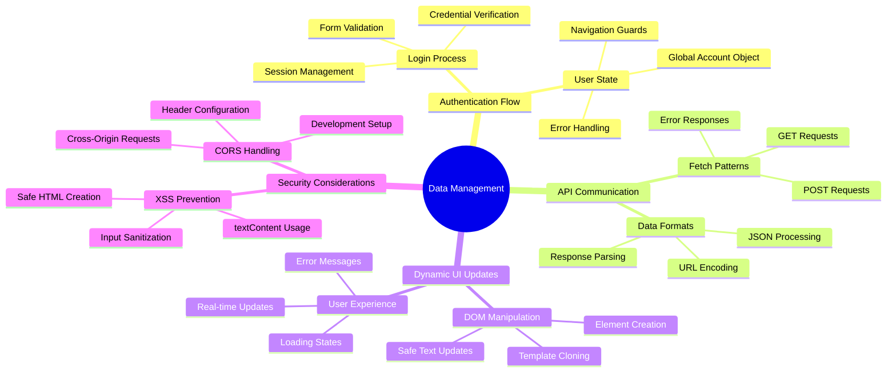

**Keskeinen periaate**: Modernit verkkosovellukset ovat tiedon orkestrointijärjestelmiä - ne koordinoivat käyttäjäliittymien, palvelin-API:iden ja selaimen turvallisuusmallien välillä luodakseen saumattomia, responsiivisia kokemuksia.

---

## Tiedonhaku modernissa verkkosovelluksessa

Tapa, jolla verkkosovellukset käsittelevät tietoja, on kehittynyt dramaattisesti viimeisten kahden vuosikymmenen aikana. Tämän kehityksen ymmärtäminen auttaa sinua arvostamaan, miksi modernit tekniikat, kuten AJAX ja Fetch API, ovat niin tehokkaita ja miksi ne ovat tärkeitä työkaluja verkkokehittäjille.

Tutkitaan, miten perinteiset verkkosivustot toimivat verrattuna dynaamisiin, responsiivisiin sovelluksiin, joita nykyään rakennamme.

### Perinteiset monisivuiset sovellukset (MPA)

Verkon alkuvaiheessa jokainen klikkaus oli kuin kanavan vaihtaminen vanhassa televisiossa - ruutu meni tyhjäksi ja sitten hitaasti virittyi uuteen sisältöön. Tämä oli todellisuutta varhaisissa verkkosovelluksissa, joissa jokainen vuorovaikutus tarkoitti koko sivun uudelleenrakentamista alusta alkaen.

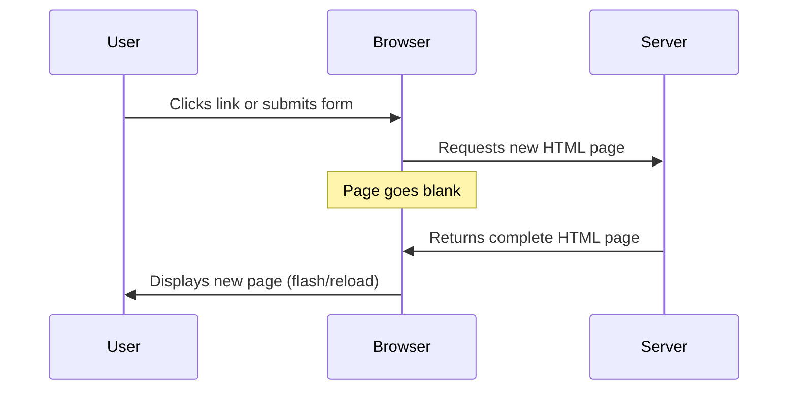


**Miksi tämä lähestymistapa tuntui kömpelöltä:**
- Jokainen klikkaus tarkoitti koko sivun uudelleenrakentamista
- Käyttäjät keskeytyivät kesken ajatuksen ärsyttävien sivuvälähdysten takia
- Internet-yhteytesi teki ylitöitä ladatessaan samaa otsikkoa ja alatunnistetta toistuvasti
- Sovellukset tuntuivat enemmän arkistokaapin selaamiselta kuin ohjelmiston käyttämiseltä

### Modernit yksisivuiset sovellukset (SPA)

AJAX (Asynchronous JavaScript and XML) muutti tämän paradigman täysin. Kuten kansainvälisen avaruusaseman modulaarinen suunnittelu, jossa astronautit voivat korvata yksittäisiä komponentteja ilman koko rakenteen uudelleenrakentamista, AJAX mahdollistaa tiettyjen verkkosivun osien päivittämisen ilman, että koko sivua ladataan uudelleen. Vaikka nimi mainitsee XML:n, käytämme nykyään enimmäkseen JSON:ia, mutta perusperiaate pysyy samana: päivitä vain se, mikä tarvitsee muuttua.

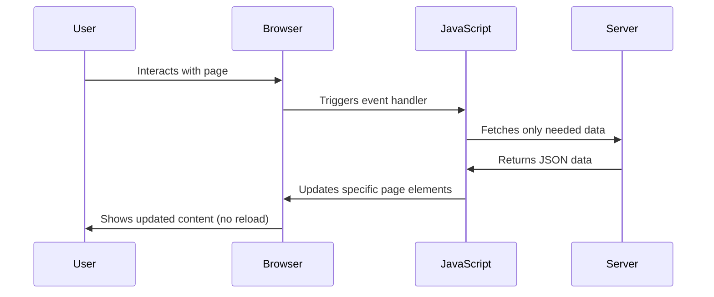


**Miksi SPA:t tuntuvat niin paljon paremmilta:**
- Vain ne osat, jotka oikeasti muuttuivat, päivitetään (fiksua, eikö?)
- Ei enää häiritseviä keskeytyksiä - käyttäjät pysyvät flow-tilassa
- Vähemmän dataa siirtyy verkon yli, mikä tarkoittaa nopeampaa latausta
- Kaikki tuntuu nopealta ja responsiiviselta, kuten puhelimen sovellukset

### Kehitys kohti modernia Fetch API:ta

Modernit selaimet tarjoavat [`Fetch` API:n](https://developer.mozilla.org/docs/Web/API/Fetch_API), joka korvaa vanhemman [`XMLHttpRequest`](https://developer.mozilla.org/docs/Web/API/XMLHttpRequest/Using_XMLHttpRequest). Kuten ero lennättimen ja sähköpostin välillä, Fetch API käyttää lupauksia siistimpään asynkroniseen koodiin ja käsittelee JSON:ia luonnollisesti.

| Ominaisuus | XMLHttpRequest | Fetch API |
|------------|----------------|-----------|
| **Syntaksi** | Monimutkainen, callback-pohjainen | Siisti, promise-pohjainen |
| **JSON-käsittely** | Vaatii manuaalista jäsentämistä | Sisäänrakennettu `.json()`-metodi |
| **Virheenkäsittely** | Rajoitettu virhetieto | Kattavat virhetiedot |
| **Moderni tuki** | Yhteensopiva vanhojen järjestelmien kanssa | ES6+ promises ja async/await |

> 💡 **Selainten yhteensopivuus**: Hyviä uutisia - Fetch API toimii kaikissa moderneissa selaimissa! Jos olet utelias tiettyjen versioiden suhteen, [caniuse.com](https://caniuse.com/fetch) tarjoaa täydellisen yhteensopivuustiedon.
> 
**Yhteenveto:**
- Toimii erinomaisesti Chromessa, Firefoxissa, Safarissa ja Edgessä (käytännössä kaikkialla, missä käyttäjäsi ovat)
- Vain Internet Explorer tarvitsee lisäapua (ja rehellisesti, on aika päästää IE menemään)
- Valmistaa sinut täydellisesti elegantteihin async/await-malleihin, joita käytämme myöhemmin

### Käyttäjän kirjautumisen ja tiedonhakemisen toteuttaminen

Nyt toteutamme kirjautumisjärjestelmän, joka muuttaa pankkisovelluksesi staattisesta näytöstä toimivaksi sovellukseksi. Kuten turvallisuusprotokollat, joita käytetään sotilaslaitoksissa, varmistamme käyttäjän tunnistetiedot ja tarjoamme sitten pääsyn heidän erityisiin tietoihinsa.

Rakennamme tämän vaiheittain, alkaen perusautentikoinnista ja lisäämällä sitten tiedonhakutoiminnallisuudet.

#### Vaihe 1: Luo kirjautumisfunktion perusta

Avaa `app.js`-tiedostosi ja lisää uusi `login`-funktio. Tämä käsittelee käyttäjän autentikointiprosessin:

```javascript
async function login() {
  const loginForm = document.getElementById('loginForm');
  const user = loginForm.user.value;
}
```

**Puretaan tämä osiin:**
- `async`-avainsana kertoo JavaScriptille "hei, tämä funktio saattaa joutua odottamaan asioita"
- Etsimme lomakkeen sivulta (ei mitään monimutkaista, vain ID:n perusteella)
- Sitten otamme talteen käyttäjän kirjoittaman käyttäjänimen
- Tässä on näppärä niksi: voit käyttää mitä tahansa lomakekenttää sen `name`-attribuutin avulla - ei tarvitse erikseen käyttää getElementById-kutsuja!

> 💡 **Lomakkeen käyttömalli**: Jokainen lomakekenttä voidaan hakea sen nimellä (asetettu HTML:ssä `name`-attribuutilla) lomake-elementin ominaisuutena. Tämä tarjoaa siistin ja luettavan tavan saada lomakedata.

#### Vaihe 2: Luo tilitietojen hakufunktio

Seuraavaksi luomme erillisen funktion tilitietojen hakemiseksi palvelimelta. Tämä noudattaa samaa kaavaa kuin rekisteröintifunktiosi, mutta keskittyy tiedonhakuun:

```javascript
async function getAccount(user) {
  try {
    const response = await fetch('//localhost:5000/api/accounts/' + encodeURIComponent(user));
    return await response.json();
  } catch (error) {
    return { error: error.message || 'Unknown error' };
  }
}
```

**Tämä koodi tekee seuraavaa:**
- **Käyttää** modernia `fetch` API:a tietojen hakemiseen asynkronisesti
- **Rakentaa** GET-pyynnön URL:n käyttäjänimen parametrilla
- **Käyttää** `encodeURIComponent()`-funktiota käsittelemään erikoismerkkejä URL:ssa turvallisesti
- **Muuntaa** vastauksen JSON-muotoon helppoa datan käsittelyä varten
- **Käsittelee** virheet siististi palauttamalla virheobjektin sen sijaan, että kaatuisi

> ⚠️ **Turvallisuusvinkki**: `encodeURIComponent()`-funktio käsittelee erikoismerkkejä URL:ssa. Kuten koodausjärjestelmät merivoimien viestinnässä, se varmistaa, että viestisi saapuu juuri sellaisena kuin oli tarkoitettu, estäen merkit kuten "#" tai "&" tulkitsemasta väärin.
> 
**Miksi tämä on tärkeää:**
- Estää erikoismerkkejä rikkomasta URL:ia
- Suojaa URL-manipulaatiohyökkäyksiltä
- Varmistaa, että palvelimesi vastaanottaa tarkoitetut tiedot
- Noudattaa turvallisen koodauksen käytäntöjä

#### HTTP GET -pyyntöjen ymmärtäminen

Saatat yllättyä: kun käytät `fetch`-funktiota ilman lisäasetuksia, se luo automaattisesti [`GET`](https://developer.mozilla.org/docs/Web/HTTP/Methods/GET)-pyynnön. Tämä sopii täydellisesti siihen, mitä teemme - pyydämme palvelinta "hei, voinko nähdä tämän käyttäjän tilitiedot?"

Ajattele GET-pyyntöjä kuin kohteliasta kirjan lainaamista kirjastosta - pyydät nähdäksesi jotain, joka jo olemassa. POST-pyynnöt (joita käytimme rekisteröinnissä) ovat enemmän kuin uuden kirjan lähettämistä lisättäväksi kokoelmaan.

| GET-pyyntö | POST-pyyntö |
|------------|-------------|
| **Tarkoitus** | Hakea olemassa olevaa dataa | Lähettää uutta dataa palvelimelle |
| **Parametrit** | URL-polussa/kyselymerkkijonossa | Pyynnön rungossa |
| **Välimuisti** | Selaimet voivat välimuistittaa | Ei yleensä välimuistia |
| **Turvallisuus** | Näkyy URL:ssa/lokeissa | Piilotettu pyynnön rungossa |

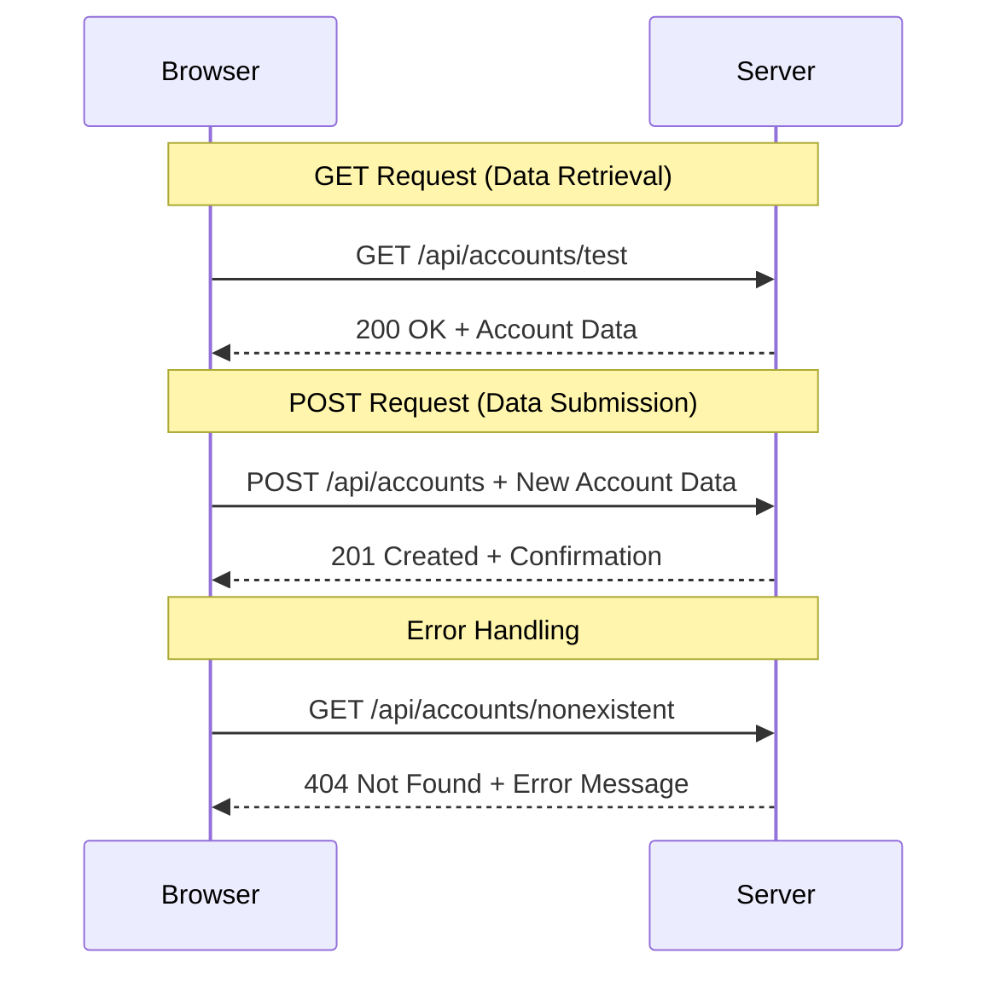

#### Vaihe 3: Yhdistä kaikki yhteen

Nyt tyydyttävä osa - yhdistetään tilitietojen hakufunktio kirjautumisprosessiin. Tässä kaikki loksahtaa paikoilleen:

```javascript
async function login() {
  const loginForm = document.getElementById('loginForm');
  const user = loginForm.user.value;
  const data = await getAccount(user);

  if (data.error) {
    return console.log('loginError', data.error);
  }

  account = data;
  navigate('/dashboard');
}
```

Tämä funktio seuraa selkeää järjestystä:
- Ottaa käyttäjänimen lomakekentästä
- Pyytää käyttäjän tilitietoja palvelimelta
- Käsittelee mahdolliset virheet prosessin aikana
- Tallentaa tilitiedot ja siirtyy onnistuneen kirjautumisen jälkeen etusivulle

> 🎯 **Async/Await-malli**: Koska `getAccount` on asynkroninen funktio, käytämme `await`-avainsanaa keskeyttääksemme suorituksen, kunnes palvelin vastaa. Tämä estää koodia jatkamasta määrittelemättömillä tiedoilla.

#### Vaihe 4: Luo paikka tiedoillesi

Sovelluksesi tarvitsee paikan, jossa se muistaa tilitiedot, kun ne on ladattu. Ajattele tätä sovelluksesi lyhytaikaisena muistina - paikkana, jossa nykyisen käyttäjän tiedot pidetään käden ulottuvilla. Lisää tämä rivi `app.js`-tiedoston alkuun:

```javascript
// This holds the current user's account data
let account = null;
```

**Miksi tämä on tarpeen:**
- Pitää tilitiedot saatavilla missä tahansa sovelluksessasi
- Aloittaminen `null`-arvolla tarkoittaa "kukaan ei ole vielä kirjautunut sisään"
- Päivitetään, kun joku kirjautuu tai rekisteröityy onnistuneesti
- Toimii yhtenä totuuden lähteenä - ei sekaannusta siitä, kuka on kirjautunut sisään

#### Vaihe 5: Yhdistä lomakkeesi

Yhdistetään nyt uusi hieno kirjautumisfunktiosi HTML-lomakkeeseen. Päivitä lomaketunnisteesi näin:

```html
<form id="loginForm" action="javascript:login()">
  <!-- Your existing form inputs -->
</form>
```

**Mitä tämä pieni muutos tekee:**
- Estää lomaketta tekemästä oletusarvoista "lataa koko sivu uudelleen" -toimintoa
- Kutsuu mukautettua JavaScript-funktiotasi sen sijaan
- Pitää kaiken sujuvana ja yksisivuisen sovelluksen kaltaisena
- Antaa sinulle täydellisen hallinnan siitä, mitä tapahtuu, kun käyttäjät painavat "Kirjaudu sisään"

#### Vaihe 6: Paranna rekisteröintifunktiotasi

Johdonmukaisuuden vuoksi päivitä `register`-funktiosi myös tallentamaan tilitiedot ja siirtymään etusivulle:

```javascript
// Add these lines at the end of your register function
account = result;
navigate('/dashboard');
```

**Tämä parannus tarjoaa:**
- **Saumattoman** siirtymän rekisteröinnistä etusivulle
- **Johdonmukaisen** käyttäjäkokemuksen kirjautumis- ja rekisteröintivaiheiden välillä
- **Välittömän** pääsyn tilitietoihin onnistuneen rekisteröinnin jälkeen

#### Toteutuksen testaaminen

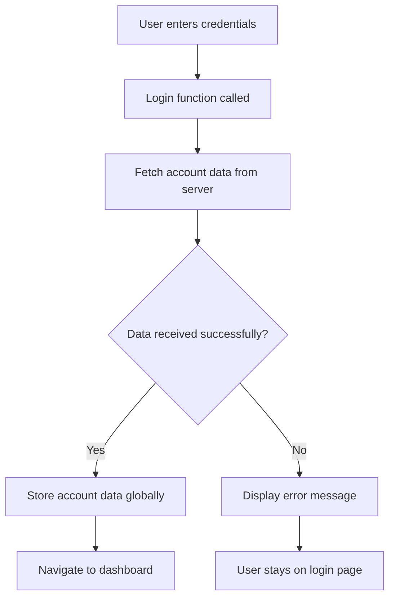

**Aika kokeilla käytännössä:**
1. Luo uusi tili varmistaaksesi, että kaikki toimii
2. Kokeile kirjautua sisään samoilla tunnuksilla
3. Kurkista selaimesi konsoliin (F12), jos jokin vaikuttaa oudolta
4. Varmista, että päädyt etusivulle onnistuneen kirjautumisen jälkeen

Jos jokin ei toimi, älä panikoi! Useimmat ongelmat ovat yksinkertaisia korjattavia, kuten kirjoitusvirheitä tai API-palvelimen käynnistämisen unohtaminen.

#### Pieni sana Cross-Origin-taikuudesta

Saatat miettiä: "Kuinka verkkosovellukseni voi kommunikoida tämän API-palvelimen kanssa, kun ne toimivat eri porteilla?" Hyvä kysymys! Tämä koskettaa jotain, mihin jokainen verkkokehittäjä törmää lopulta.

> 🔒 **Cross-Origin-turvallisuus**: Selaimet noudattavat "saman alkuperän politiikkaa" estääkseen luvattoman viestinnän eri verkkotunnusten välillä. Kuten Pentagonin tarkastuspistejärjestelmä, ne varmistavat, että viestintä on valtuutettua ennen kuin sallivat tiedonsiirron.
> 
**Meidän asetuksessamme:**
- Verkkosovelluksesi toimii `localhost:3000` (kehityspalvelin)
- API-palvelimesi toimii `localhost:5000` (taustapalvelin)
- API-palvelin sisältää [CORS-
DOM-manipulointi on tekniikka, joka muuttaa staattiset verkkosivut dynaamisiksi sovelluksiksi, jotka päivittävät sisältöään käyttäjän toimien ja palvelimen vastausten perusteella.

### Valitse oikea työkalu tehtävään

Kun päivität HTML:ää JavaScriptillä, sinulla on useita vaihtoehtoja. Ajattele näitä kuin työkaluja työkalupakissa - jokainen sopii täydellisesti tiettyyn tehtävään:

| Menetelmä | Mihin se sopii | Milloin käyttää | Turvallisuustaso |
|-----------|----------------|-----------------|------------------|
| `textContent` | Käyttäjädatan turvallinen näyttäminen | Aina kun näytät tekstiä | ✅ Erittäin turvallinen |
| `createElement()` + `append()` | Monimutkaisten rakenteiden luominen | Uusien osioiden/listojen luominen | ✅ Luotettava |
| `innerHTML` | HTML-sisällön asettaminen | ⚠️ Vältä tätä mahdollisuuksien mukaan | ❌ Riskialtis 

#### Turvallinen tapa näyttää teksti: textContent

[`textContent`](https://developer.mozilla.org/docs/Web/API/Node/textContent)-ominaisuus on paras ystäväsi, kun näytät käyttäjädataa. Se toimii kuin portinvartija verkkosivullesi - mikään haitallinen ei pääse läpi:

```javascript
// The safe, reliable way to update text
const balanceElement = document.getElementById('balance');
balanceElement.textContent = account.balance;
```

**textContentin edut:**
- Käsittelee kaiken tavallisena tekstinä (estää skriptien suorittamisen)
- Tyhjentää automaattisesti olemassa olevan sisällön
- Tehokas yksinkertaisten tekstipäivitysten tekemiseen
- Tarjoaa sisäänrakennetun suojan haitalliselta sisällöltä

#### Dynaamisten HTML-elementtien luominen

Monimutkaisempaa sisältöä varten yhdistä [`document.createElement()`](https://developer.mozilla.org/docs/Web/API/Document/createElement) ja [`append()`](https://developer.mozilla.org/docs/Web/API/ParentNode/append)-menetelmä:

```javascript
// Safe way to create new elements
const transactionItem = document.createElement('div');
transactionItem.className = 'transaction-item';
transactionItem.textContent = `${transaction.date}: ${transaction.description}`;
container.append(transactionItem);
```

**Tämän lähestymistavan ymmärtäminen:**
- **Luo** uusia DOM-elementtejä ohjelmallisesti
- **Säilyttää** täyden hallinnan elementtien ominaisuuksista ja sisällöstä
- **Mahdollistaa** monimutkaiset, sisäkkäiset elementtirakenteet
- **Säilyttää** turvallisuuden erottamalla rakenne sisällöstä

> ⚠️ **Turvallisuushuomio**: Vaikka [`innerHTML`](https://developer.mozilla.org/docs/Web/API/Element/innerHTML) näkyy monissa opetusohjelmissa, se voi suorittaa upotettuja skriptejä. Kuten CERNin turvallisuusprotokollat, jotka estävät luvattoman koodin suorittamisen, `textContent` ja `createElement` tarjoavat turvallisempia vaihtoehtoja.
> 
**innerHTML:n riskit:**
- Suorittaa käyttäjädatan sisältämät `<script>`-tagit
- Altis koodin injektointihyökkäyksille
- Luo mahdollisia turvallisuusaukkoja
- Käyttämämme turvallisemmat vaihtoehdot tarjoavat vastaavan toiminnallisuuden

### Virheiden tekeminen käyttäjäystävällisiksi

Tällä hetkellä kirjautumisvirheet näkyvät vain selaimen konsolissa, mikä on käyttäjille näkymätöntä. Kuten ero lentäjän sisäisten diagnostiikkajärjestelmien ja matkustajainformaation välillä, meidän täytyy viestiä tärkeä tieto oikean kanavan kautta.

Näkyvien virheilmoitusten toteuttaminen antaa käyttäjille välitöntä palautetta siitä, mikä meni pieleen ja miten edetä.

#### Vaihe 1: Lisää paikka virheilmoituksille

Lisätään ensin virheilmoituksille paikka HTML:ssä. Lisää tämä kirjautumispainikkeen eteen, jotta käyttäjät näkevät sen luonnollisesti:

```html
<!-- This is where error messages will appear -->
<div id="loginError" role="alert"></div>
<button>Login</button>
```

**Mitä tässä tapahtuu:**
- Luomme tyhjän säiliön, joka pysyy näkymättömänä, kunnes sitä tarvitaan
- Se sijoitetaan paikkaan, johon käyttäjät luonnollisesti katsovat "Kirjaudu sisään" -painikkeen jälkeen
- `role="alert"` on mukava lisä ruudunlukijoille - se kertoo apuvälineille "hei, tämä on tärkeää!"
- Uniikki `id` antaa JavaScriptille helpon kohteen

#### Vaihe 2: Luo kätevä apufunktio

Tehdään pieni apufunktio, joka voi päivittää minkä tahansa elementin tekstin. Tämä on yksi niistä "kirjoita kerran, käytä kaikkialla" -funktioista, jotka säästävät aikaa:

```javascript
function updateElement(id, text) {
  const element = document.getElementById(id);
  element.textContent = text;
}
```

**Funktion edut:**
- Yksinkertainen käyttöliittymä, joka vaatii vain elementin ID:n ja tekstisisällön
- Etsii ja päivittää DOM-elementit turvallisesti
- Uudelleenkäytettävä malli, joka vähentää koodin toistoa
- Säilyttää yhtenäisen päivityskäyttäytymisen sovelluksessa

#### Vaihe 3: Näytä virheet käyttäjille

Korvataan nyt piilotettu konsoliviesti jollain, mitä käyttäjät voivat oikeasti nähdä. Päivitä kirjautumisfunktio:

```javascript
// Instead of just logging to console, show the user what's wrong
if (data.error) {
  return updateElement('loginError', data.error);
}
```

**Tämä pieni muutos tekee suuren eron:**
- Virheilmoitukset näkyvät juuri siellä, missä käyttäjät katsovat
- Ei enää mystisiä hiljaisia epäonnistumisia
- Käyttäjät saavat välitöntä, toimivaa palautetta
- Sovelluksesi alkaa tuntua ammattimaiselta ja huomaavaiselta

Nyt kun testaat virheellisellä tilillä, näet hyödyllisen virheilmoituksen suoraan sivulla!


#### Vaihe 4: Ole inklusiivinen saavutettavuuden suhteen

Se `role="alert`, jonka lisäsimme aiemmin, ei ole vain koriste! Tämä pieni attribuutti luo niin sanotun [Live Region](https://developer.mozilla.org/docs/Web/Accessibility/ARIA/ARIA_Live_Regions)-alueen, joka ilmoittaa muutoksista ruudunlukijoille välittömästi:

```html
<div id="loginError" role="alert"></div>
```

**Miksi tämä on tärkeää:**
- Ruudunlukijakäyttäjät kuulevat virheilmoituksen heti sen ilmestyessä
- Kaikki saavat saman tärkeän tiedon riippumatta siitä, miten he navigoivat
- Se on yksinkertainen tapa tehdä sovelluksesi toimivaksi useammille ihmisille
- Osoittaa, että välität inklusiivisten kokemusten luomisesta

Tällaiset pienet yksityiskohdat erottavat hyvät kehittäjät loistavista!

### 🎯 Pedagoginen tarkistus: Autentikointimallit

**Pysähdy ja pohdi**: Olet juuri toteuttanut täydellisen autentikointivirran. Tämä on perustavanlaatuinen malli verkkokehityksessä.

**Nopea itsearviointi**:
- Osaatko selittää, miksi käytämme async/await API-kutsuihin?
- Mitä tapahtuisi, jos unohtaisimme `encodeURIComponent()`-funktion?
- Miten virheenkäsittelymme parantaa käyttäjäkokemusta?

**Yhteys tosielämään**: Oppimasi mallit (asynkroninen datan haku, virheenkäsittely, käyttäjäpalaute) ovat käytössä kaikissa suurissa verkkosovelluksissa sosiaalisen median alustoista verkkokauppoihin. Olet rakentamassa tuotantotason taitoja!

**Haastekysymys**: Miten voisit muokata tätä autentikointijärjestelmää käsittelemään useita käyttäjärooleja (asiakas, ylläpitäjä, kassanhoitaja)? Mieti tarvittavia tietorakenteita ja käyttöliittymän muutoksia.

#### Vaihe 5: Sovella samaa mallia rekisteröintiin

Johdonmukaisuuden vuoksi toteuta samanlainen virheenkäsittely rekisteröintilomakkeeseesi:

1. **Lisää** virheilmoituselementti rekisteröintisi HTML:ään:
```html
<div id="registerError" role="alert"></div>
```

2. **Päivitä** rekisteröintifunktiosi käyttämään samaa virheilmoitusmallia:
```javascript
if (data.error) {
  return updateElement('registerError', data.error);
}
```

**Johdonmukaisen virheenkäsittelyn edut:**
- **Tarjoaa** yhtenäisen käyttäjäkokemuksen kaikissa lomakkeissa
- **Vähentää** kognitiivista kuormitusta käyttämällä tuttuja malleja
- **Yksinkertaistaa** ylläpitoa uudelleenkäytettävällä koodilla
- **Varmistaa** saavutettavuusstandardien täyttymisen koko sovelluksessa

## Dynaamisen hallintapaneelin luominen

Nyt muutamme staattisen hallintapaneelisi dynaamiseksi käyttöliittymäksi, joka näyttää todelliset tilitiedot. Kuten ero painetun lentoaikataulun ja lentokenttien reaaliaikaisten lähtötaulujen välillä, siirrymme staattisesta tiedosta reaaliaikaisiin, reagoiviin näyttöihin.

Käyttämällä oppimiasi DOM-manipulointitekniikoita luomme hallintapaneelin, joka päivittyy automaattisesti nykyisten tilitietojen mukaan.

### Tutustu dataasi

Ennen kuin aloitamme rakentamisen, kurkistetaan, millaista dataa palvelimesi lähettää takaisin. Kun joku kirjautuu onnistuneesti sisään, tässä on tietoa, jonka saat:

```json
{
  "user": "test",
  "currency": "$",
  "description": "Test account",
  "balance": 75,
  "transactions": [
    { "id": "1", "date": "2020-10-01", "object": "Pocket money", "amount": 50 },
    { "id": "2", "date": "2020-10-03", "object": "Book", "amount": -10 },
    { "id": "3", "date": "2020-10-04", "object": "Sandwich", "amount": -5 }
  ]
}
```

**Tämä tietorakenne tarjoaa:**
- **`user`**: Täydellinen kokemuksen personointiin ("Tervetuloa takaisin, Sarah!")
- **`currency`**: Varmistaa, että rahamäärät näytetään oikein
- **`description`**: Tilin ystävällinen nimi
- **`balance`**: Kaiken tärkein nykyinen saldo
- **`transactions`**: Täydellinen tapahtumahistoria kaikilla yksityiskohdilla

Kaikki mitä tarvitset ammattimaisen pankkihallintapaneelin rakentamiseen!

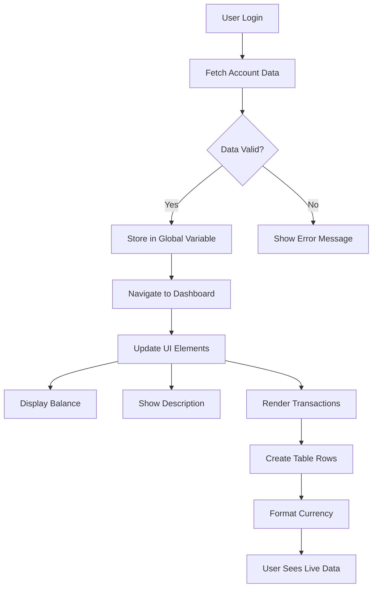

> 💡 **Vinkki**: Haluatko nähdä hallintapaneelisi toiminnassa heti? Käytä käyttäjänimeä `test`, kun kirjaudut sisään - se sisältää valmiiksi ladattua esimerkkidataa, jotta voit nähdä kaiken toimivan ilman, että sinun tarvitsee luoda tapahtumia ensin.
> 
**Miksi testitili on kätevä:**
- Sisältää realistista esimerkkidataa valmiiksi ladattuna
- Täydellinen nähdäksesi, miten tapahtumat näytetään
- Erinomainen hallintapaneelin ominaisuuksien testaamiseen
- Säästää sinut luomasta testidataa manuaalisesti

### Hallintapaneelin näyttöelementtien luominen

Rakennetaan hallintapaneelin käyttöliittymä askel askeleelta, alkaen tilin yhteenvetotiedoista ja siirtyen sitten monimutkaisempiin ominaisuuksiin, kuten tapahtumalistat.

#### Vaihe 1: Päivitä HTML-rakenne

Korvaa ensin staattinen "Saldo"-osio dynaamisilla paikkamerkkielementeillä, joita JavaScript voi täyttää:

```html
<section>
  Balance: <span id="balance"></span><span id="currency"></span>
</section>
```

Lisää seuraavaksi osio tilin kuvaukselle. Koska tämä toimii otsikkona hallintapaneelin sisällölle, käytä semanttista HTML:ää:

```html
<h2 id="description"></h2>
```

**HTML-rakenteen ymmärtäminen:**
- **Käyttää** erillisiä `<span>`-elementtejä saldolle ja valuutalle yksittäistä hallintaa varten
- **Soveltaa** uniikkeja ID-tunnisteita jokaiseen elementtiin JavaScriptin kohdistamista varten
- **Noudattaa** semanttista HTML:ää käyttämällä `<h2>`-elementtiä tilin kuvaukselle
- **Luo** loogisen hierarkian ruudunlukijoille ja SEO:lle

> ✅ **Saavutettavuusvinkki**: Tilin kuvaus toimii otsikkona hallintapaneelin sisällölle, joten se on merkitty semanttisesti otsikkona. Lue lisää siitä, miten [otsikkorakenne](https://www.nomensa.com/blog/2017/how-structure-headings-web-accessibility) vaikuttaa saavutettavuuteen. Voitko tunnistaa muita elementtejä sivullasi, jotka voisivat hyötyä otsikkotageista?

#### Vaihe 2: Luo hallintapaneelin päivitysfunktio

Luo nyt funktio, joka täyttää hallintapaneelin todellisilla tilitiedoilla:

```javascript
function updateDashboard() {
  if (!account) {
    return navigate('/login');
  }

  updateElement('description', account.description);
  updateElement('balance', account.balance.toFixed(2));
  updateElement('currency', account.currency);
}
```

**Askel askeleelta, mitä tämä funktio tekee:**
- **Varmistaa**, että tilitiedot ovat olemassa ennen etenemistä
- **Ohjaa** tunnistamattomat käyttäjät takaisin kirjautumissivulle
- **Päivittää** tilin kuvauksen käyttämällä uudelleenkäytettävää `updateElement`-funktiota
- **Muotoilee** saldon näyttämään aina kaksi desimaalia
- **Näyttää** oikean valuuttasymbolin

> 💰 **Rahan muotoilu**: Se [`toFixed(2)`](https://developer.mozilla.org/docs/Web/JavaScript/Reference/Global_Objects/Number/toFixed)-menetelmä on pelastus! Se varmistaa, että saldosi näyttää aina oikealta rahalta - "75.00" sen sijaan, että vain "75". Käyttäjäsi arvostavat tuttua valuuttamuotoilua.

#### Vaihe 3: Varmista, että hallintapaneeli päivittyy

Jotta hallintapaneeli päivittyy nykyisillä tiedoilla aina, kun joku vierailee siinä, meidän täytyy kytkeytyä navigointijärjestelmääsi. Jos olet suorittanut [oppitunti 1 tehtävän](../1-template-route/assignment.md), tämän pitäisi tuntua tutulta. Jos et, älä huoli - tässä mitä tarvitset:

Lisää tämä `updateRoute()`-funktion loppuun:

```javascript
if (typeof route.init === 'function') {
  route.init();
}
```

Päivitä sitten reitit sisällyttämään hallintapaneelin alustus:

```javascript
const routes = {
  '/login': { templateId: 'login' },
  '/dashboard': { templateId: 'dashboard', init: updateDashboard }
};
```

**Mitä tämä fiksu asetus tekee:**
- Tarkistaa, onko reitillä erityistä alustuslogiikkaa
- Suorittaa sen automaattisesti, kun reitti latautuu
- Varmistaa, että hallintapaneeli näyttää aina tuoreet, ajankohtaiset tiedot
- Pitää reitityksen logiikan siistinä ja järjestettynä

#### Testaa hallintapaneelisi

Kun olet toteuttanut nämä muutokset, testaa hallintapaneelisi:

1. **Kirjaudu sisään** testitilillä
2. **Varmista**, että sinut ohjataan hallintapaneeliin
3. **Tarkista**, että tilin kuvaus, saldo ja valuutta näkyvät oikein
4. **Kokeile kirjautua ulos ja takaisin sisään** varmistaaksesi, että tiedot päivittyvät kunnolla

Hallintapaneelisi pitäisi nyt näyttää dynaamiset tilitiedot, jotka päivittyvät kirjautuneen käyttäjän datan perusteella!

## Älykkäiden tapahtumalistojen luominen mallien avulla

Sen sijaan, että luot HTML:n manuaalisesti jokaiselle tapahtumalle, käytämme malleja luomaan johdonmukaista muotoilua automaattisesti. Kuten avaruusalusten valmistuksessa käytetyt standardoidut komponentit, mallit varmistavat, että jokainen tapahtumarivi noudattaa samaa rakennetta ja ulkoasua.

Tämä tekniikka skaalautuu tehokkaasti muutamasta tapahtumasta tuhansiin, säilyttäen johdonmukaisen suorituskyvyn ja esityksen.

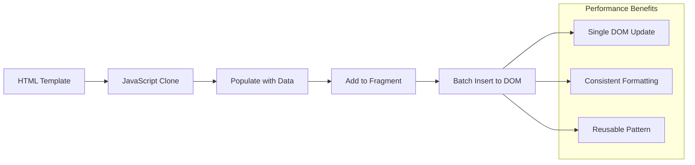

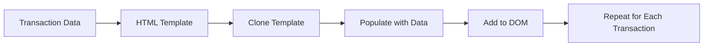

### Vaihe 1: Luo tapahtumamalli

Lisää ensin uudelleenkäytettävä malli tapahtumariveille HTML-`<body>`-osioon:

```html
<template id="transaction">
  <tr>
    <td></td>
    <td></td>
    <td></td>
  </tr>
</template>
```

**HTML-mallien ymmärtäminen:**
- **Määrittää** rakenteen yhdelle taulukon riville
- **Pysyy** näkymättömänä, kunnes se kloonataan ja täytetään JavaScriptillä
- **Sisältää** kolme solua päivämäärälle, kuvaukselle ja summalle
- **Tarjoaa** uudelleenkäytettävän mallin johdonmukaiselle muotoilulle

### Vaihe 2: Valmistele taulukko dynaamiselle sisällölle

Lisää seuraavaksi `id` taulukon runkoon, jotta JavaScript voi helposti kohdistaa sen:

```html
<tbody id="transactions"></tbody>
```

**Mitä tämä saavuttaa:**
- **Luo** selkeän kohteen tapahtumarivien lisäämiselle
- **Erottaa** taulukon rakenteen dynaamisesta sisällöstä
- **Mahdollistaa** tapahtumatietojen helpon tyhjentämisen ja täyttämisen uudelleen

### Vaihe 3: Rakenna tapahtumarivien tehdasfunktio

Luo nyt funktio, joka muuntaa tapahtumatiedot HTML-elementeiksi:

```javascript
function createTransactionRow(transaction) {
  const template = document.getElementById('transaction');
  const transactionRow = template.content.cloneNode(true);
  const tr = transactionRow.querySelector('tr');
  tr.children[0].textContent = transaction.date;
  tr.children[1].textContent = transaction.object;
  tr.children[2].textContent = transaction.amount.toFixed(2);
  return transactionRow;
}
```

**Tämän tehdasfunktion erittely:**
- **Hakee** mallielementin
> ⚡ **Suorituskyvyn optimointi**: [`document.createDocumentFragment()`](https://developer.mozilla.org/docs/Web/API/Document/createDocumentFragment) toimii kuin Boeingin kokoonpanoprosessi - komponentit valmistellaan päälinjan ulkopuolella ja asennetaan sitten kokonaisena yksikkönä. Tämä erätyöskentely vähentää DOM:n uudelleenvirtausta tekemällä yhden lisäyksen useiden yksittäisten operaatioiden sijaan.

### Vaihe 5: Päivitä päivitystoiminto sekasisältöä varten

Nykyinen `updateElement()`-funktiosi käsittelee vain tekstisisältöä. Päivitä se toimimaan sekä tekstin että DOM-solmujen kanssa:

```javascript
function updateElement(id, textOrNode) {
  const element = document.getElementById(id);
  element.textContent = ''; // Removes all children
  element.append(textOrNode);
}
```

**Keskeiset parannukset tässä päivityksessä:**
- **Poistaa** olemassa olevan sisällön ennen uuden sisällön lisäämistä
- **Hyväksyy** joko tekstimerkkijonoja tai DOM-solmuja parametreina
- **Käyttää** [`append()`](https://developer.mozilla.org/docs/Web/API/ParentNode/append)-metodia joustavuuden vuoksi
- **Säilyttää** taaksepäin yhteensopivuuden nykyisen tekstipohjaisen käytön kanssa

### Testaa kojelautasi käytännössä

Hetki totuuden hetkelle! Katsotaan, miten dynaaminen kojelautasi toimii:

1. Kirjaudu sisään `test`-tilillä (siinä on valmiiksi esimerkkidata)
2. Siirry kojelautaan
3. Tarkista, että tapahtumarivit näkyvät oikealla muotoilulla
4. Varmista, että päivämäärät, kuvaukset ja summat näyttävät hyviltä

Jos kaikki toimii, sinun pitäisi nähdä täysin toimiva tapahtumalista kojelautassasi! 🎉

**Mitä olet saavuttanut:**
- Rakentanut kojelaudan, joka skaalautuu minkä tahansa datamäärän mukaan
- Luonut uudelleenkäytettäviä malleja johdonmukaista muotoilua varten
- Toteuttanut tehokkaita DOM-manipulointitekniikoita
- Kehittänyt toiminnallisuutta, joka vastaa tuotantotason pankkisovelluksia

Olet onnistuneesti muuttanut staattisen verkkosivun dynaamiseksi verkkosovellukseksi.

### 🎯 Pedagoginen tarkistus: Dynaaminen sisällön generointi

**Arkkitehtuurin ymmärtäminen**: Olet toteuttanut kehittyneen data-UI-putken, joka heijastaa Reactin, Vuen ja Angularin kaltaisten kehysten käyttämää mallia.

**Keskeiset opitut käsitteet**:
- **Mallipohjainen renderöinti**: Uudelleenkäytettävien UI-komponenttien luominen
- **Dokumenttifragmentit**: DOM-suorituskyvyn optimointi
- **Turvallinen DOM-manipulointi**: Turva-aukkojen estäminen
- **Datamuunnos**: Palvelindatan muuntaminen käyttöliittymiksi

**Yhteys teollisuuteen**: Nämä tekniikat muodostavat modernien frontend-kehysten perustan. Reactin virtuaalinen DOM, Vuen mallijärjestelmä ja Angularin komponenttiarkkitehtuuri rakentuvat näiden ydinkonseptien päälle.

**Pohdintakysymys**: Kuinka laajentaisit tätä järjestelmää käsittelemään reaaliaikaisia päivityksiä (kuten uusia tapahtumia, jotka ilmestyvät automaattisesti)? Mieti WebSocketien tai Server-Sent Events -tekniikoiden käyttöä.

---

## 📈 Tietojen hallinnan osaamisen aikajana

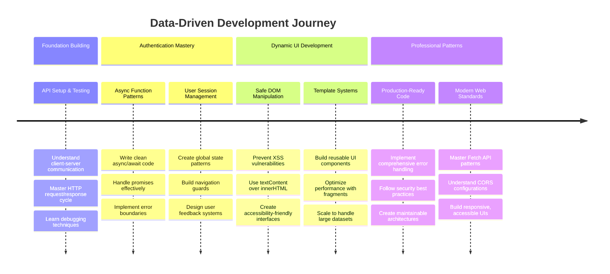

**🎓 Valmistumisen virstanpylväs**: Olet onnistuneesti rakentanut täydellisen datavetoisen verkkosovelluksen käyttäen moderneja JavaScript-malleja. Nämä taidot siirtyvät suoraan Reactin, Vuen tai Angularin kaltaisten kehysten käyttöön.

**🔄 Seuraavan tason kyvyt**:
- Valmis tutkimaan frontend-kehyksiä, jotka perustuvat näihin konsepteihin
- Valmis toteuttamaan reaaliaikaisia ominaisuuksia WebSocketien avulla
- Valmis rakentamaan progressiivisia verkkosovelluksia offline-ominaisuuksilla
- Perusta asetettu edistyneiden tilanhallintamallien oppimiseen

## GitHub Copilot Agent -haaste 🚀

Käytä Agent-tilaa suorittaaksesi seuraavan haasteen:

**Kuvaus:** Paranna pankkisovellusta toteuttamalla tapahtumien haku- ja suodatusominaisuus, joka mahdollistaa käyttäjien löytää tiettyjä tapahtumia päivämäärävälin, summan tai kuvauksen perusteella.

**Ohje:** Luo pankkisovellukseen hakutoiminto, joka sisältää: 1) Hakulomakkeen, jossa on syöttökentät päivämääräväliä (alku/loppu), vähimmäis-/enimmäissummaa ja tapahtuman kuvausavainsanoja varten, 2) `filterTransactions()`-funktion, joka suodattaa account.transactions-taulukon hakukriteerien perusteella, 3) Päivitä `updateDashboard()`-funktio näyttämään suodatetut tulokset, ja 4) Lisää "Tyhjennä suodattimet" -painike näkymän palauttamiseksi. Käytä moderneja JavaScript-taulukkometodeja, kuten `filter()`, ja käsittele tyhjien hakukriteerien erikoistapaukset.

Lisätietoja [agent-tilasta](https://code.visualstudio.com/blogs/2025/02/24/introducing-copilot-agent-mode) täällä.

## 🚀 Haaste

Valmis viemään pankkisovelluksesi seuraavalle tasolle? Tehdään siitä jotain, mitä oikeasti haluaisit käyttää. Tässä muutamia ideoita luovuutesi herättämiseksi:

**Tee siitä kaunis**: Lisää CSS-tyylittelyä muuttaaksesi toimivan kojelaudan visuaalisesti houkuttelevaksi. Ajattele selkeitä linjoja, hyvää tilankäyttöä ja ehkä jopa hienovaraisia animaatioita.

**Tee siitä responsiivinen**: Kokeile käyttää [media queries](https://developer.mozilla.org/docs/Web/CSS/Media_Queries) -tekniikkaa luodaksesi [responsiivisen suunnittelun](https://developer.mozilla.org/docs/Web/Progressive_web_apps/Responsive/responsive_design_building_blocks), joka toimii hyvin puhelimilla, tableteilla ja tietokoneilla. Käyttäjäsi kiittävät sinua!

**Lisää hieman säihkettä**: Harkitse tapahtumien värikoodausta (vihreä tuloille, punainen menoille), kuvakkeiden lisäämistä tai hover-efektejä, jotka tekevät käyttöliittymästä interaktiivisen tuntuisen.

Tältä viimeistelty kojelauta voisi näyttää:


Sinun ei tarvitse kopioida tätä täysin - käytä sitä inspiraationa ja tee siitä oman näköisesi!

## Luentojälkeinen kysely

[Luentojälkeinen kysely](https://ff-quizzes.netlify.app/web/quiz/46)

## Tehtävä

[Refaktoroi ja kommentoi koodisi](assignment.md)

---

**Vastuuvapauslauseke**:  
Tämä asiakirja on käännetty käyttämällä tekoälypohjaista käännöspalvelua [Co-op Translator](https://github.com/Azure/co-op-translator). Vaikka pyrimme tarkkuuteen, huomioithan, että automaattiset käännökset voivat sisältää virheitä tai epätarkkuuksia. Alkuperäistä asiakirjaa sen alkuperäisellä kielellä tulisi pitää ensisijaisena lähteenä. Kriittisen tiedon osalta suositellaan ammattimaista ihmiskäännöstä. Emme ole vastuussa väärinkäsityksistä tai virhetulkinnoista, jotka johtuvat tämän käännöksen käytöstä.