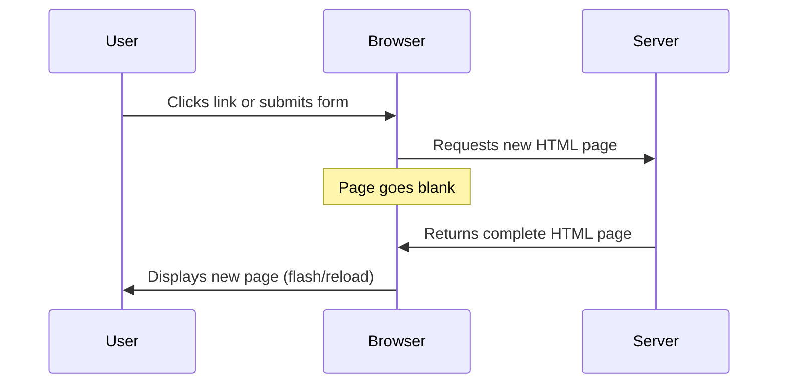
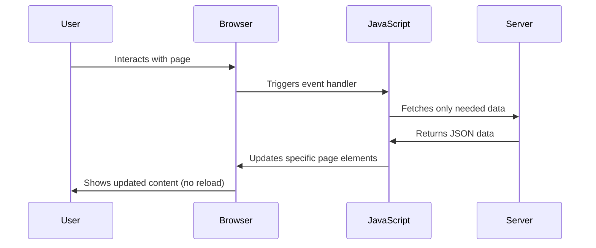
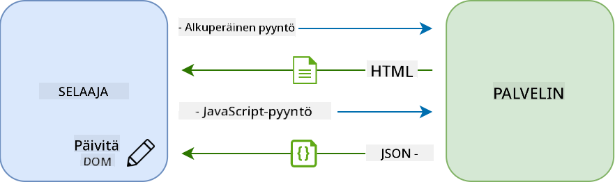
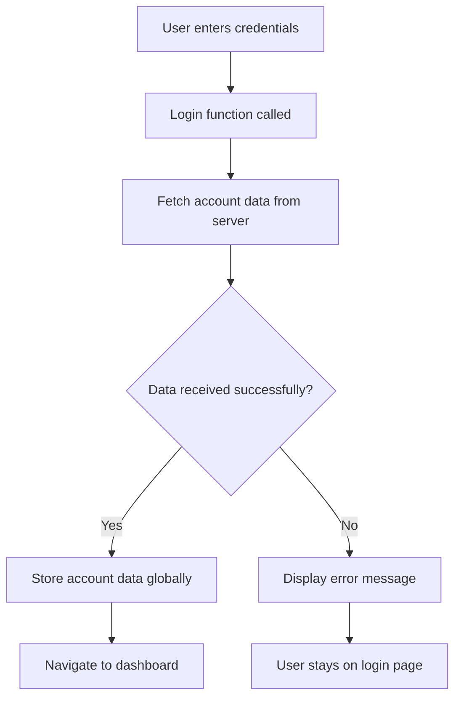
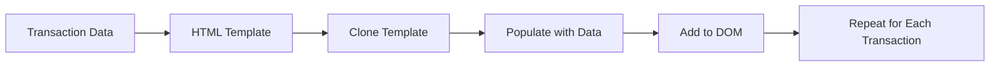
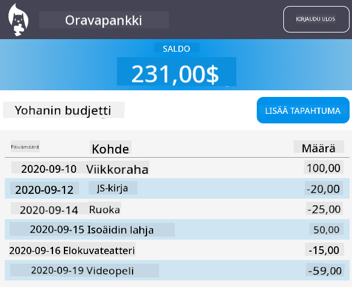

<!--
CO_OP_TRANSLATOR_METADATA:
{
  "original_hash": "2c1164912414820c8efd699b43f64954",
  "translation_date": "2025-10-23T00:33:35+00:00",
  "source_file": "7-bank-project/3-data/README.md",
  "language_code": "fi"
}
-->
# Rakenna pankkisovellus, osa 3: Tietojen hakeminen ja käyttö

Ajattele Enterprise-aluksen tietokonetta Star Trekissä - kun kapteeni Picard kysyy aluksen tilasta, tiedot ilmestyvät välittömästi ilman, että koko käyttöliittymä sulkeutuu ja rakentuu uudelleen. Juuri tällaista saumattoman tiedonkulun järjestelmää rakennamme tässä dynaamisella tietojen hakemisella.

Tällä hetkellä pankkisovelluksesi on kuin painettu sanomalehti - informatiivinen mutta staattinen. Muutamme sen joksikin NASA:n ohjauskeskuksen kaltaiseksi, jossa tiedot virtaavat jatkuvasti ja päivittyvät reaaliajassa keskeyttämättä käyttäjän työnkulkua.

Opit kommunikoimaan palvelimien kanssa asynkronisesti, käsittelemään eri aikoina saapuvia tietoja ja muuntamaan raakadataa käyttäjille merkitykselliseksi. Tämä erottaa demoversion tuotantovalmiista ohjelmistosta.

## Ennakkokysely

[Ennakkokysely](https://ff-quizzes.netlify.app/web/quiz/45)

### Esivaatimukset

Ennen kuin sukellat tietojen hakemiseen, varmista, että sinulla on nämä komponentit valmiina:

- **Edellinen oppitunti**: Suorita [kirjautumis- ja rekisteröintilomake](../2-forms/README.md) - rakennamme tämän pohjalta
- **Paikallinen palvelin**: Asenna [Node.js](https://nodejs.org) ja [käynnistä palvelin-API](../api/README.md) tilitietojen tarjoamiseksi
- **API-yhteys**: Testaa palvelinyhteytesi tällä komennolla:

```bash
curl http://localhost:5000/api
# Expected response: "Bank API v1.0.0"
```

Tämä nopea testi varmistaa, että kaikki komponentit kommunikoivat oikein:
- Varmistaa, että Node.js toimii oikein järjestelmässäsi
- Vahvistaa, että API-palvelimesi on aktiivinen ja vastaa
- Varmistaa, että sovelluksesi voi tavoittaa palvelimen (kuten tarkistettaisiin radiokontakti ennen tehtävää)

---

## Tietojen hakemisen ymmärtäminen moderneissa verkkosovelluksissa

Tapa, jolla verkkosovellukset käsittelevät tietoja, on kehittynyt dramaattisesti viimeisten kahden vuosikymmenen aikana. Tämän kehityksen ymmärtäminen auttaa sinua arvostamaan, miksi modernit tekniikat, kuten AJAX ja Fetch API, ovat niin tehokkaita ja miksi niistä on tullut välttämättömiä työkaluja verkkokehittäjille.

Tutkitaan, miten perinteiset verkkosivustot toimivat verrattuna dynaamisiin, responsiivisiin sovelluksiin, joita nykyään rakennamme.

### Perinteiset monisivuiset sovellukset (MPA)

Verkon alkuaikoina jokainen klikkaus oli kuin kanavan vaihtaminen vanhassa televisiossa - ruutu meni pimeäksi ja sitten hitaasti virittyi uuteen sisältöön. Tämä oli todellisuutta varhaisissa verkkosovelluksissa, joissa jokainen vuorovaikutus tarkoitti koko sivun uudelleenrakentamista alusta alkaen.




**Miksi tämä lähestymistapa tuntui kömpelöltä:**
- Jokainen klikkaus tarkoitti koko sivun uudelleenrakentamista alusta
- Käyttäjät keskeytyivät ärsyttävien sivuvälähdysten takia
- Internet-yhteytesi teki ylitöitä ladatessaan samaa otsikkoa ja alatunnistetta toistuvasti
- Sovellukset tuntuivat enemmän arkistokaapin selaamiselta kuin ohjelmiston käytöltä

### Modernit yksisivuiset sovellukset (SPA)

AJAX (Asynchronous JavaScript and XML) muutti tämän paradigman täysin. Kuten kansainvälisen avaruusaseman modulaarinen suunnittelu, jossa astronautit voivat korvata yksittäisiä komponentteja ilman, että koko rakennetta tarvitsee rakentaa uudelleen, AJAX mahdollistaa tiettyjen verkkosivun osien päivittämisen ilman, että koko sivua ladataan uudelleen. Vaikka nimi mainitsee XML:n, käytämme nykyään enimmäkseen JSON:ia, mutta perusperiaate pysyy samana: päivitetään vain se, mikä tarvitsee muuttua.





**Miksi SPA:t tuntuvat paremmilta:**
- Vain ne osat, jotka oikeasti muuttuivat, päivitetään (fiksua, eikö?)
- Ei enää häiritseviä keskeytyksiä - käyttäjät pysyvät työnsä parissa
- Vähemmän dataa siirtyy verkon yli, mikä tarkoittaa nopeampaa latausta
- Kaikki tuntuu sulavalta ja responsiiviselta, kuten puhelimen sovellukset

### Kehitys kohti modernia Fetch API:ta

Modernit selaimet tarjoavat [`Fetch` API:n](https://developer.mozilla.org/docs/Web/API/Fetch_API), joka korvaa vanhemman [`XMLHttpRequest`](https://developer.mozilla.org/docs/Web/API/XMLHttpRequest/Using_XMLHttpRequest). Kuten ero lennättimen ja sähköpostin välillä, Fetch API käyttää lupauksia siistimpään asynkroniseen koodiin ja käsittelee JSON:ia luonnollisesti.

| Ominaisuus | XMLHttpRequest | Fetch API |
|------------|----------------|-----------|
| **Syntaksi** | Monimutkainen, perustuu takaisinsoittoihin | Selkeä, perustuu lupauksiin |
| **JSON-käsittely** | Vaatii manuaalista jäsentämistä | Sisäänrakennettu `.json()`-metodi |
| **Virheenkäsittely** | Rajoitettu virhetieto | Kattavat virhetiedot |
| **Moderni tuki** | Yhteensopiva vanhojen järjestelmien kanssa | ES6+ lupaukset ja async/await |

> 💡 **Selainten yhteensopivuus**: Hyviä uutisia - Fetch API toimii kaikissa moderneissa selaimissa! Jos olet utelias tiettyjen versioiden suhteen, [caniuse.com](https://caniuse.com/fetch) tarjoaa täydellisen yhteensopivuustiedon.
> 
**Yhteenveto:**
- Toimii hyvin Chromessa, Firefoxissa, Safarissa ja Edgessä (käytännössä kaikkialla, missä käyttäjäsi ovat)
- Vain Internet Explorer tarvitsee lisäapua (ja rehellisesti, on aika päästää IE menemään)
- Valmistaa sinut täydellisesti tyylikkäisiin async/await-malleihin, joita käytämme myöhemmin

### Käyttäjän kirjautumisen ja tietojen hakemisen toteuttaminen

Nyt toteutamme kirjautumisjärjestelmän, joka muuttaa pankkisovelluksesi staattisesta näytöstä toimivaksi sovellukseksi. Kuten turvallisuusprotokollat, joita käytetään sotilaslaitoksissa, varmistamme käyttäjän tunnistetiedot ja annamme sitten pääsyn heidän erityisiin tietoihinsa.

Rakennamme tämän vaiheittain, alkaen perusautentikoinnista ja lisäämällä sitten tietojen hakutoimintoja.

#### Vaihe 1: Luo kirjautumistoiminnon perusta

Avaa `app.js`-tiedostosi ja lisää uusi `login`-funktio. Tämä käsittelee käyttäjän autentikointiprosessin:

```javascript
async function login() {
  const loginForm = document.getElementById('loginForm');
  const user = loginForm.user.value;
}
```

**Puretaan tämä osiin:**
- Tuo `async`-avainsana? Se kertoo JavaScriptille "hei, tämä funktio saattaa joutua odottamaan asioita"
- Etsimme lomakkeen sivulta (ei mitään erikoista, vain etsimme sen ID:n perusteella)
- Sitten otamme talteen sen, mitä käyttäjä kirjoitti käyttäjänimeksi
- Tässä on näppärä temppu: voit käyttää mitä tahansa lomakekenttää sen `name`-attribuutin avulla - ei tarvitse tehdä ylimääräisiä getElementById-kutsuja!

> 💡 **Lomakkeen käyttömalli**: Jokainen lomakekenttä voidaan käyttää sen nimen (HTML:ssä asetettu `name`-attribuutti) avulla lomake-elementin ominaisuutena. Tämä tarjoaa selkeän ja luettavan tavan saada lomaketiedot.

#### Vaihe 2: Luo tilitietojen hakutoiminto

Seuraavaksi luomme erillisen funktion tilitietojen hakemiseksi palvelimelta. Tämä noudattaa samaa mallia kuin rekisteröintifunktiosi, mutta keskittyy tietojen hakemiseen:

```javascript
async function getAccount(user) {
  try {
    const response = await fetch('//localhost:5000/api/accounts/' + encodeURIComponent(user));
    return await response.json();
  } catch (error) {
    return { error: error.message || 'Unknown error' };
  }
}
```

**Tämä koodi tekee seuraavaa:**
- **Käyttää** modernia `fetch` API:a tietojen asynkroniseen hakemiseen
- **Muodostaa** GET-pyynnön URL:n käyttäjänimen parametrilla
- **Käyttää** `encodeURIComponent()`-funktiota käsittelemään turvallisesti erikoismerkkejä URL-osoitteissa
- **Muuntaa** vastauksen JSON-muotoon helppoa tietojen käsittelyä varten
- **Käsittelee** virheet siististi palauttamalla virheobjektin kaatumisen sijaan

> ⚠️ **Turvallisuusvinkki**: `encodeURIComponent()`-funktio käsittelee erikoismerkkejä URL-osoitteissa. Kuten koodausjärjestelmät merivoimien viestinnässä, se varmistaa, että viestisi saapuu juuri sellaisena kuin oli tarkoitus, estäen merkkien kuten "#" tai "&" väärinkäytön.
> 
**Miksi tämä on tärkeää:**
- Estää erikoismerkkejä rikkomasta URL-osoitteita
- Suojaa URL-manipulaatiohyökkäyksiltä
- Varmistaa, että palvelimesi vastaanottaa tarkoitetut tiedot
- Noudattaa turvallisen koodauksen käytäntöjä

#### HTTP GET -pyyntöjen ymmärtäminen

Tässä on jotain, mikä saattaa yllättää sinut: kun käytät `fetch`-funktiota ilman lisäasetuksia, se luo automaattisesti [`GET`](https://developer.mozilla.org/docs/Web/HTTP/Methods/GET)-pyynnön. Tämä on täydellinen siihen, mitä teemme - pyydämme palvelimelta "hei, voinko nähdä tämän käyttäjän tilitiedot?"

Ajattele GET-pyyntöjä kuin kohteliaana tapana pyytää lainata kirjaa kirjastosta - pyydät nähdä jotain, mikä jo on olemassa. POST-pyynnöt (joita käytimme rekisteröinnissä) ovat enemmän kuin uuden kirjan lähettämistä lisättäväksi kokoelmaan.

| GET-pyyntö | POST-pyyntö |
|------------|-------------|
| **Tarkoitus** | Hakea olemassa olevia tietoja | Lähettää uusia tietoja palvelimelle |
| **Parametrit** | URL-polussa/kyselymerkkijonossa | Pyynnön sisällössä |
| **Välimuisti** | Selaimet voivat välimuistittaa | Ei yleensä välimuistia |
| **Turvallisuus** | Näkyy URL:ssa/lokeissa | Piilotettu pyynnön sisällössä |

#### Vaihe 3: Yhdistä kaikki yhteen

Nyt tyydyttävä osa - yhdistetään tilitietojen hakufunktio kirjautumisprosessiin. Tässä kaikki loksahtaa paikoilleen:

```javascript
async function login() {
  const loginForm = document.getElementById('loginForm');
  const user = loginForm.user.value;
  const data = await getAccount(user);

  if (data.error) {
    return console.log('loginError', data.error);
  }

  account = data;
  navigate('/dashboard');
}
```

Tämä funktio seuraa selkeää järjestystä:
- Ottaa käyttäjänimen lomakekentästä
- Pyytää käyttäjän tilitiedot palvelimelta
- Käsittelee prosessin aikana mahdollisesti ilmenevät virheet
- Tallentaa tilitiedot ja siirtyy onnistuneen kirjautumisen jälkeen hallintapaneeliin

> 🎯 **Async/Await-malli**: Koska `getAccount` on asynkroninen funktio, käytämme `await`-avainsanaa pysäyttääksemme suorituksen, kunnes palvelin vastaa. Tämä estää koodia jatkamasta määrittelemättömillä tiedoilla.

#### Vaihe 4: Luo paikka tiedoillesi

Sovelluksesi tarvitsee paikan, jossa se voi muistaa ladatut tilitiedot. Ajattele tätä kuin sovelluksesi lyhytaikaisena muistina - paikka, jossa nykyisen käyttäjän tiedot pidetään käden ulottuvilla. Lisää tämä rivi `app.js`-tiedoston alkuun:

```javascript
// This holds the current user's account data
let account = null;
```

**Miksi tämä on tarpeen:**
- Pitää tilitiedot saatavilla mistä tahansa sovelluksessasi
- Aloittaminen `null`-arvolla tarkoittaa "kukaan ei ole vielä kirjautunut sisään"
- Päivitetään, kun joku kirjautuu tai rekisteröityy onnistuneesti
- Toimii yhtenä totuuden lähteenä - ei sekaannusta siitä, kuka on kirjautuneena

#### Vaihe 5: Yhdistä lomakkeesi

Nyt yhdistetään uusi hieno kirjautumisfunktiosi HTML-lomakkeeseesi. Päivitä lomaketunnisteesi näin:

```html
<form id="loginForm" action="javascript:login()">
  <!-- Your existing form inputs -->
</form>
```

**Mitä tämä pieni muutos tekee:**
- Estää lomaketta tekemästä oletusarvoista "lataa koko sivu uudelleen" -toimintoa
- Kutsuu mukautettua JavaScript-funktiotasi sen sijaan
- Pitää kaiken sulavana ja yksisivuisen sovelluksen kaltaisena
- Antaa sinulle täydellisen hallinnan siitä, mitä tapahtuu, kun käyttäjät painavat "Kirjaudu sisään"

#### Vaihe 6: Paranna rekisteröintifunktiota

Johdonmukaisuuden vuoksi päivitä `register`-funktiosi myös tallentamaan tilitiedot ja siirtymään hallintapaneeliin:

```javascript
// Add these lines at the end of your register function
account = result;
navigate('/dashboard');
```

**Tämä parannus tarjoaa:**
- **Saumattoman** siirtymän rekisteröinnistä hallintapaneeliin
- **Johdonmukaisen** käyttäjäkokemuksen kirjautumis- ja rekisteröintivaiheiden välillä
- **Välittömän** pääsyn tilitietoihin onnistuneen rekisteröinnin jälkeen

#### Toteutuksen testaaminen



**Aika kokeilla:**
1. Luo uusi tili varmistaaksesi, että kaikki toimii
2. Kokeile kirjautua sisään samoilla tunnuksilla
3. Kurkista selaimesi konsoliin (F12), jos jokin vaikuttaa olevan pielessä
4. Varmista, että päädyt hallintapaneeliin onnistuneen kirjautumisen jälkeen

Jos jokin ei toimi, älä panikoi! Useimmat ongelmat ovat yksinkertaisia korjata, kuten kirjoitusvirheet tai API-palvelimen käynnistämisen unohtaminen.

#### Pieni sana Cross-Origin-taikuudesta

Saatat miettiä: "Miten verkkosovellukseni voi kommunikoida tämän API-palvelimen kanssa, kun ne toimivat eri porteilla?" Hyvä kysymys! Tämä koskee asiaa, johon jokainen verkkokehittäjä törmää lopulta.

> 🔒 **Cross-Origin-turvallisuus**: Selaimet noudattavat "saman alkuperän politiikkaa" estääkseen luvattoman viestinnän eri verkkotunnusten välillä. Kuten Pentagonin tarkistuspistejärjestelmä, ne varmistavat, että viestintä on valtuutettua ennen kuin sallivat tiedonsiirron.
> 
**Meidän asetuksessamme:**
- Verkkosovelluksesi toimii `localhost:3000` (kehityspalvelin)
- API-palvelimesi toimii `localhost:5000` (taustapalvelin)
- API-palvelin sisältää [CORS-otsikot](https://developer.mozilla.org/docs/Web/HTTP/CORS), jotka nimenomaisesti valtuuttavat viestinnän verkkosovelluksestasi

Tämä kokoonpano heijastaa todellista kehitystä, jossa frontend- ja backend-sovellukset toimivat tyypillisesti erillisillä palvelimilla.

> 📚 **Lisätietoa**: Sukella syvemmälle API:hin ja tietojen hakemiseen tämän kattavan [Microsoft Learn -moduulin avulla](https://docs.microsoft.com/learn/modules/use-apis-discover-museum-art/?WT.mc_id=academic-77807-sagibbon).

## Tietojen tuominen eloon HTML:ssä

Nyt teemme haetut tiedot näkyviksi käyttäjille DOM-manipulaation avulla. Kuten valokuvien kehittäminen pimiössä, otamme näkymättömän datan ja muutamme sen joksikin, mitä käyttäjät voivat nähdä ja käyttää.

DOM-manipulaatio on tekniikka, joka muuttaa staattiset verkkosivut dynaamisiksi sovelluksiksi, jotka päivittävät sisältöään käyttäjän vuorovaikutuksen ja palvelimen vastausten perusteella.

### Valitse oikea työkalu tehtävään

Kun päivität HTML:ää JavaScriptillä, sinulla on useita vaihtoehtoja. Ajattele näitä kuin eri työkaluja työkalupakissa - jokainen sopii täydellisesti tiettyihin tehtäviin:

| Menetelmä | Missä se on hyvä | Milloin käyttää | Turvallisuustaso |
|-----------|------------------|-----------------|------------------|
| `textContent` | Käyttäjätietojen turvallinen näyttäminen | Aina kun näytät tekstiä | ✅ Erittäin turvallinen
Yhdistä monimutkaisempaa sisältöä varten [`document.createElement()`](https://developer.mozilla.org/docs/Web/API/Document/createElement) -metodi [`append()`](https://developer.mozilla.org/docs/Web/API/ParentNode/append) -metodiin:

```javascript
// Safe way to create new elements
const transactionItem = document.createElement('div');
transactionItem.className = 'transaction-item';
transactionItem.textContent = `${transaction.date}: ${transaction.description}`;
container.append(transactionItem);
```

**Tämän lähestymistavan ymmärtäminen:**
- **Luo** uusia DOM-elementtejä ohjelmallisesti
- **Tarjoaa** täyden hallinnan elementtien attribuuteista ja sisällöstä
- **Mahdollistaa** monimutkaiset, sisäkkäiset elementtirakenteet
- **Säilyttää** turvallisuuden erottamalla rakenne sisällöstä

> ⚠️ **Turvallisuushuomio**: Vaikka [`innerHTML`](https://developer.mozilla.org/docs/Web/API/Element/innerHTML) esiintyy monissa opetusohjelmissa, se voi suorittaa upotettuja skriptejä. Kuten CERNin turvallisuusprotokollat estävät luvattoman koodin suorittamisen, `textContent` ja `createElement` tarjoavat turvallisempia vaihtoehtoja.
> 
**innerHTML:n riskit:**
- Suorittaa käyttäjän datassa olevat `<script>`-tagit
- Altis koodin injektointihyökkäyksille
- Luo mahdollisia turvallisuusriskejä
- Käyttämämme turvallisemmat vaihtoehdot tarjoavat vastaavan toiminnallisuuden

### Virheiden tekeminen käyttäjäystävälliseksi

Tällä hetkellä kirjautumisvirheet näkyvät vain selaimen konsolissa, mikä on käyttäjille näkymätöntä. Kuten ero lentäjän sisäisten diagnostiikkajärjestelmien ja matkustajainformaation välillä, meidän on viestittävä tärkeät tiedot oikean kanavan kautta.

Näkyvien virheilmoitusten toteuttaminen antaa käyttäjille välitöntä palautetta siitä, mikä meni pieleen ja miten edetä.

#### Vaihe 1: Lisää paikka virheilmoituksille

Lisätään ensin virheilmoituksille paikka HTML-koodiin. Lisää tämä juuri kirjautumispainikkeen yläpuolelle, jotta käyttäjät huomaavat sen luonnollisesti:

```html
<!-- This is where error messages will appear -->
<div id="loginError" role="alert"></div>
<button>Login</button>
```

**Mitä tässä tapahtuu:**
- Luomme tyhjän säiliön, joka pysyy näkymättömänä, kunnes sitä tarvitaan
- Se sijoitetaan paikkaan, johon käyttäjät luonnollisesti katsovat klikatessaan "Kirjaudu sisään"
- `role="alert"` on hyvä lisä ruudunlukijoille - se kertoo apuvälineille "hei, tämä on tärkeää!"
- Uniikki `id` antaa JavaScriptille helpon kohteen

#### Vaihe 2: Luo kätevä apufunktio

Tehdään pieni apufunktio, joka voi päivittää minkä tahansa elementin tekstin. Tämä on yksi niistä "kirjoita kerran, käytä kaikkialla" -funktioista, jotka säästävät aikaa:

```javascript
function updateElement(id, text) {
  const element = document.getElementById(id);
  element.textContent = text;
}
```

**Funktion edut:**
- Yksinkertainen käyttöliittymä, joka vaatii vain elementin ID:n ja tekstisisällön
- Etsii ja päivittää DOM-elementtejä turvallisesti
- Uudelleenkäytettävä malli, joka vähentää koodin toistoa
- Säilyttää johdonmukaisen päivityskäyttäytymisen sovelluksessa

#### Vaihe 3: Näytä virheet käyttäjille

Korvataan nyt piilotettu konsoliviesti jollakin, jonka käyttäjät voivat oikeasti nähdä. Päivitä kirjautumisfunktiosi:

```javascript
// Instead of just logging to console, show the user what's wrong
if (data.error) {
  return updateElement('loginError', data.error);
}
```

**Tämä pieni muutos tekee suuren eron:**
- Virheilmoitukset näkyvät juuri siellä, missä käyttäjät katsovat
- Ei enää mystisiä hiljaisia epäonnistumisia
- Käyttäjät saavat välitöntä, toimivaa palautetta
- Sovelluksesi alkaa tuntua ammattimaiselta ja huomaavaiselta

Kun testaat virheellisellä tilillä, näet hyödyllisen virheilmoituksen suoraan sivulla!


#### Vaihe 4: Ole inklusiivinen saavutettavuuden suhteen

Se `role="alert"`, jonka lisäsimme aiemmin, ei ole vain koriste! Tämä pieni attribuutti luo niin sanotun [Live Region](https://developer.mozilla.org/docs/Web/Accessibility/ARIA/ARIA_Live_Regions) -alueen, joka ilmoittaa muutoksista välittömästi ruudunlukijoille:

```html
<div id="loginError" role="alert"></div>
```

**Miksi tämä on tärkeää:**
- Ruudunlukijoiden käyttäjät kuulevat virheilmoituksen heti sen ilmestyessä
- Kaikki saavat saman tärkeän tiedon, riippumatta siitä, miten he navigoivat
- Yksinkertainen tapa tehdä sovelluksestasi toimiva useammille ihmisille
- Osoittaa, että välität inklusiivisten kokemusten luomisesta

Pienet yksityiskohdat, kuten tämä, erottavat hyvät kehittäjät loistavista!

#### Vaihe 5: Sovella samaa mallia rekisteröintiin

Johdonmukaisuuden vuoksi toteutetaan samanlainen virheenkäsittely rekisteröintilomakkeeseen:

1. **Lisää** virheilmoituselementti rekisteröintilomakkeesi HTML-koodiin:
```html
<div id="registerError" role="alert"></div>
```

2. **Päivitä** rekisteröintifunktiosi käyttämään samaa virheilmoitusmallia:
```javascript
if (data.error) {
  return updateElement('registerError', data.error);
}
```

**Johdonmukaisen virheenkäsittelyn edut:**
- **Tarjoaa** yhtenäisen käyttäjäkokemuksen kaikissa lomakkeissa
- **Vähentää** kognitiivista kuormitusta käyttämällä tuttuja malleja
- **Yksinkertaistaa** ylläpitoa uudelleenkäytettävällä koodilla
- **Varmistaa** saavutettavuusstandardien täyttymisen koko sovelluksessa

## Dynaamisen hallintapaneelin luominen

Nyt muutamme staattisen hallintapaneelisi dynaamiseksi käyttöliittymäksi, joka näyttää todelliset tilitiedot. Kuten ero painetun lentoaikataulun ja lentokentän reaaliaikaisten lähtötaulujen välillä, siirrymme staattisesta tiedosta reaaliaikaisiin, reagoiviin näyttöihin.

Käyttämällä oppimiasi DOM-manipulaatiotekniikoita luomme hallintapaneelin, joka päivittyy automaattisesti nykyisten tilitietojen mukaan.

### Tutustu tietoihisi

Ennen kuin aloitamme rakentamisen, kurkistetaan, millaisia tietoja palvelimesi lähettää takaisin. Kun joku kirjautuu onnistuneesti sisään, tässä on aarrearkku tietoa, jonka saat käyttöösi:

```json
{
  "user": "test",
  "currency": "$",
  "description": "Test account",
  "balance": 75,
  "transactions": [
    { "id": "1", "date": "2020-10-01", "object": "Pocket money", "amount": 50 },
    { "id": "2", "date": "2020-10-03", "object": "Book", "amount": -10 },
    { "id": "3", "date": "2020-10-04", "object": "Sandwich", "amount": -5 }
  ]
}
```

**Tämä tietorakenne tarjoaa:**
- **`user`**: Täydellinen henkilökohtaisen kokemuksen luomiseen ("Tervetuloa takaisin, Sarah!")
- **`currency`**: Varmistaa, että rahamäärät näytetään oikein
- **`description`**: Tilin ystävällinen nimi
- **`balance`**: Kaiken tärkein nykyinen saldo
- **`transactions`**: Täydellinen tapahtumahistoria kaikilla yksityiskohdilla

Kaikki, mitä tarvitset ammattimaisen pankkihallintapaneelin rakentamiseen!

> 💡 **Vinkki**: Haluatko nähdä hallintapaneelisi toiminnassa heti? Käytä käyttäjänimeä `test`, kun kirjaudut sisään - se sisältää valmiiksi ladattuja esimerkkitietoja, joten voit nähdä kaiken toiminnassa ilman, että sinun tarvitsee luoda tapahtumia ensin.
> 
**Miksi testitili on kätevä:**
- Sisältää realistisia esimerkkitietoja valmiiksi ladattuna
- Täydellinen tapahtumien näyttämisen tarkistamiseen
- Erinomainen hallintapaneelin ominaisuuksien testaamiseen
- Säästää sinut luomasta testidataa manuaalisesti

### Hallintapaneelin näyttöelementtien luominen

Rakennetaan hallintapaneelin käyttöliittymä vaihe vaiheelta, alkaen tilin yhteenvedosta ja siirtyen monimutkaisempiin ominaisuuksiin, kuten tapahtumaluetteloihin.

#### Vaihe 1: Päivitä HTML-rakenne

Korvaa ensin staattinen "Saldo"-osio dynaamisilla paikkamerkkielementeillä, jotka JavaScript voi täyttää:

```html
<section>
  Balance: <span id="balance"></span><span id="currency"></span>
</section>
```

Seuraavaksi lisää osio tilin kuvaukselle. Koska tämä toimii otsikkona hallintapaneelin sisällölle, käytä semanttista HTML:ää:

```html
<h2 id="description"></h2>
```

**HTML-rakenteen ymmärtäminen:**
- **Käyttää** erillisiä `<span>`-elementtejä saldolle ja valuutalle yksittäistä hallintaa varten
- **Soveltaa** uniikkeja ID-tunnisteita jokaiseen elementtiin JavaScriptin kohdistamista varten
- **Noudattaa** semanttista HTML:ää käyttämällä `<h2>`-elementtiä tilin kuvaukselle
- **Luo** loogisen hierarkian ruudunlukijoille ja SEO:lle

> ✅ **Saavutettavuusvinkki**: Tilin kuvaus toimii otsikkona hallintapaneelin sisällölle, joten se on merkitty semanttisesti otsikkona. Lue lisää siitä, miten [otsikkorakenne](https://www.nomensa.com/blog/2017/how-structure-headings-web-accessibility) vaikuttaa saavutettavuuteen. Voitko tunnistaa muita elementtejä sivullasi, jotka voisivat hyötyä otsikkotageista?

#### Vaihe 2: Luo hallintapaneelin päivitysfunktio

Luo nyt funktio, joka täyttää hallintapaneelisi todellisilla tilitiedoilla:

```javascript
function updateDashboard() {
  if (!account) {
    return navigate('/login');
  }

  updateElement('description', account.description);
  updateElement('balance', account.balance.toFixed(2));
  updateElement('currency', account.currency);
}
```

**Vaihe vaiheelta, mitä tämä funktio tekee:**
- **Varmistaa**, että tilitiedot ovat olemassa ennen etenemistä
- **Ohjaa** tunnistamattomat käyttäjät takaisin kirjautumissivulle
- **Päivittää** tilin kuvauksen uudelleenkäytettävän `updateElement`-funktion avulla
- **Muotoilee** saldon näyttämään aina kaksi desimaalia
- **Näyttää** oikean valuuttasymbolin

> 💰 **Rahan muotoilu**: [`toFixed(2)`](https://developer.mozilla.org/docs/Web/JavaScript/Reference/Global_Objects/Number/toFixed) -metodi on pelastus! Se varmistaa, että saldosi näyttää aina oikealta rahalta - "75.00" sen sijaan, että se olisi vain "75". Käyttäjäsi arvostavat tuttua valuuttamuotoilua.

#### Vaihe 3: Varmista, että hallintapaneeli päivittyy

Jotta hallintapaneelisi päivittyy ajantasaisilla tiedoilla aina, kun joku vierailee siinä, meidän on liitettävä se navigointijärjestelmääsi. Jos olet suorittanut [oppitunti 1 tehtävän](../1-template-route/assignment.md), tämän pitäisi tuntua tutulta. Jos et, älä huoli - tässä on mitä tarvitset:

Lisää tämä `updateRoute()`-funktion loppuun:

```javascript
if (typeof route.init === 'function') {
  route.init();
}
```

Päivitä sitten reittisi sisällyttämään hallintapaneelin alustaminen:

```javascript
const routes = {
  '/login': { templateId: 'login' },
  '/dashboard': { templateId: 'dashboard', init: updateDashboard }
};
```

**Mitä tämä nokkela asetus tekee:**
- Tarkistaa, onko reitillä erityistä alustuskoodia
- Suorittaa koodin automaattisesti, kun reitti latautuu
- Varmistaa, että hallintapaneeli näyttää aina tuoreet, ajantasaiset tiedot
- Pitää reitityksen logiikan siistinä ja järjestettynä

#### Testaa hallintapaneelisi

Näiden muutosten toteuttamisen jälkeen testaa hallintapaneelisi:

1. **Kirjaudu sisään** testitilillä
2. **Varmista**, että sinut ohjataan hallintapaneeliin
3. **Tarkista**, että tilin kuvaus, saldo ja valuutta näkyvät oikein
4. **Kokeile kirjautua ulos ja takaisin sisään**, jotta varmistat tietojen päivittymisen oikein

Hallintapaneelisi pitäisi nyt näyttää dynaamiset tilitiedot, jotka päivittyvät kirjautuneen käyttäjän tietojen mukaan!

## Älykkäiden tapahtumaluetteloiden rakentaminen mallien avulla

Sen sijaan, että loisit HTML:n manuaalisesti jokaiselle tapahtumalle, käytämme malleja automaattiseen ja johdonmukaiseen muotoiluun. Kuten avaruusalusten valmistuksessa käytetyt standardoidut komponentit, mallit varmistavat, että jokainen tapahtumarivi noudattaa samaa rakennetta ja ulkoasua.

Tämä tekniikka skaalautuu tehokkaasti muutamasta tapahtumasta tuhansiin, säilyttäen johdonmukaisen suorituskyvyn ja ulkoasun.



### Vaihe 1: Luo tapahtumamalli

Lisää ensin uudelleenkäytettävä malli tapahtumariveille HTML-koodisi `<body>`-osioon:

```html
<template id="transaction">
  <tr>
    <td></td>
    <td></td>
    <td></td>
  </tr>
</template>
```

**HTML-mallien ymmärtäminen:**
- **Määrittää** rakenteen yhdelle taulukkoriville
- **Pysyy** näkymättömänä, kunnes se kloonataan ja täytetään JavaScriptillä
- **Sisältää** kolme solua päivämäärälle, kuvaukselle ja summalle
- **Tarjoaa** uudelleenkäytettävän mallin johdonmukaiseen muotoiluun

### Vaihe 2: Valmistele taulukko dynaamiselle sisällölle

Lisää seuraavaksi `id` taulukon runkoon, jotta JavaScript voi helposti kohdistaa sen:

```html
<tbody id="transactions"></tbody>
```

**Mitä tämä saavuttaa:**
- **Luo** selkeän kohteen tapahtumarivien lisäämiselle
- **Erottaa** taulukon rakenteen dynaamisesta sisällöstä
- **Mahdollistaa** tapahtumatietojen helpon tyhjentämisen ja täyttämisen uudelleen

### Vaihe 3: Rakenna tapahtumarivien tehdasfunktio

Luo nyt funktio, joka muuntaa tapahtumatiedot HTML-elementeiksi:

```javascript
function createTransactionRow(transaction) {
  const template = document.getElementById('transaction');
  const transactionRow = template.content.cloneNode(true);
  const tr = transactionRow.querySelector('tr');
  tr.children[0].textContent = transaction.date;
  tr.children[1].textContent = transaction.object;
  tr.children[2].textContent = transaction.amount.toFixed(2);
  return transactionRow;
}
```

**Tämän tehdasfunktion erittely:**
- **Hakee** mallielementin sen ID:n avulla
- **Kloonaa** mallisisällön turvallista muokkausta varten
- **Valitsee** taulukkorivin kloonatusta sisällöstä
- **Täyttää** jokaisen solun tapahtumatiedoilla
- **Muotoilee** summan näyttämään oikeat desimaalit
- **Palauttaa** valmiin rivin lisättäväksi

### Vaihe 4: Luo useita tapahtumarivejä tehokkaasti

Lisää tämä koodi `updateDashboard()`-funktioon, jotta kaikki tapahtumat voidaan näyttää:

```javascript
const transactionsRows = document.createDocumentFragment();
for (const transaction of account.transactions) {
  const transactionRow = createTransactionRow(transaction);
  transactionsRows.appendChild(transactionRow);
}
updateElement('transactions', transactionsRows);
```

**Tämän tehokkaan lähestymistavan ymmärtäminen:**
- **Luo** dokumenttifragmentin ryhmä-DOM-operaatioita varten
- **Iteroi** kaikki tilitiedon tapahtumat läpi
- **Luo** rivin jokaiselle tapahtumalle tehdasfunktion avulla
- **Kerää** kaikki rivit fragmenttiin ennen niiden lisäämistä DOM:iin
- **Suorittaa** yhden DOM-päivityksen useiden yksittäisten lisäysten sijaan

> ⚡ **Suorituskyvyn optimointi**: [`document.createDocumentFragment()`](https://developer.mozilla.org/docs/Web/API/Document/createDocumentFragment) toimii kuin Boeingin kokoonpanoprosessi - komponentit valmistellaan päälinjan ulkopuolella ja asennetaan sitten kokonaisuutena. Tämä ryhmittelylähestymistapa minimoi DOM:n uudelleenmuotoilut suorittamalla yhden lisäyksen useiden yksittäisten operaatioiden sijaan.

### Vaihe 5: Paranna päivitysfunktiota sekasisällölle

Nykyinen `updateElement()`-funktiosi käsittelee vain tekstisisältöä. Päivitä se toimimaan sekä tekstin että DOM-solmujen kanssa:

```javascript
function updateElement(id, textOrNode) {
  const element = document.getElementById(id);
  element.textContent = ''; // Removes all children
  element.append(textOrNode);
}
```

**Tämän päivityksen keskeiset parannukset:**
- **Tyhjentää** olemassa olevan sisällön ennen uuden sisällön lisäämistä
- **Hyväksyy** joko tekstimerkkijonoja tai DOM-solmuja parametreina
- **Käyttää** [`append()`](https://developer.mozilla.org/docs/Web/API/ParentNode/append) -metodia joustavuuden vuoksi
- **Säilyttää** taaksepäin yhteensopivuuden nykyisen tekstipohjaisen käytön kanssa

### Testaa hallintapaneelisi

Hetki totuuden hetkelle! Katsotaan, miten dynaaminen hallintapaneelisi toimii:

1. Kirjaudu sisään käyttäen `test`-tiliä (se sisältää valmiita esimerkkitietoja)
2. Siirry hallintapaneeliin
3. Tarkista, että tapahtumarivit näkyvät oikealla muotoilulla
4. Varmista, että päivämäärät, kuvaukset ja summat näyttävät hyviltä

Jos kaikki toimii, sinun pitäisi nähdä täysin toimiva tapahtumaluettelo hallintapaneelissasi! 🎉

**M
**Prompt:** Luo hakutoiminto pankkisovellukseen, joka sisältää: 1) Hakulomakkeen, jossa on syöttökentät aikavälille (alku/loppu), vähimmäis-/maksimimäärälle ja tapahtuman kuvausavainsanoille, 2) `filterTransactions()`-funktion, joka suodattaa account.transactions-taulukon hakukriteerien perusteella, 3) Päivitä `updateDashboard()`-funktio näyttämään suodatetut tulokset, ja 4) Lisää "Tyhjennä suodattimet" -painike näkymän palauttamiseksi. Käytä moderneja JavaScript-taulukkometodeja, kuten `filter()`, ja käsittele tyhjien hakukriteerien erikoistapaukset.

Lisätietoja [agent mode](https://code.visualstudio.com/blogs/2025/02/24/introducing-copilot-agent-mode) -toiminnosta löytyy täältä.

## 🚀 Haaste

Valmis viemään pankkisovelluksesi seuraavalle tasolle? Tehdään siitä jotain, mitä oikeasti haluaisit käyttää. Tässä muutamia ideoita inspiraatioksi:

**Tee siitä kaunis**: Lisää CSS-tyylit, jotka muuttavat toiminnallisen hallintapaneelin visuaalisesti houkuttelevaksi. Ajattele selkeitä linjoja, hyvää tilankäyttöä ja ehkä jopa hienovaraisia animaatioita.

**Tee siitä responsiivinen**: Kokeile käyttää [media queries](https://developer.mozilla.org/docs/Web/CSS/Media_Queries) -tekniikkaa luodaksesi [responsiivisen suunnittelun](https://developer.mozilla.org/docs/Web/Progressive_web_apps/Responsive/responsive_design_building_blocks), joka toimii hyvin puhelimilla, tableteilla ja tietokoneilla. Käyttäjäsi kiittävät sinua!

**Lisää hieman tyylikkyyttä**: Harkitse tapahtumien värikoodausta (vihreä tuloille, punainen menoille), lisää ikoneita tai luo hover-efektejä, jotka tekevät käyttöliittymästä interaktiivisemman.

Tältä viimeistelty hallintapaneeli voisi näyttää:



Sinun ei tarvitse kopioida tätä täysin - käytä sitä inspiraationa ja luo oma versiosi!

## Luentojälkeinen kysely

[Luentojälkeinen kysely](https://ff-quizzes.netlify.app/web/quiz/46)

## Tehtävä

[Refaktoroi ja kommentoi koodisi](assignment.md)

---

**Vastuuvapauslauseke**:  
Tämä asiakirja on käännetty käyttämällä tekoälypohjaista käännöspalvelua [Co-op Translator](https://github.com/Azure/co-op-translator). Vaikka pyrimme tarkkuuteen, huomioithan, että automaattiset käännökset voivat sisältää virheitä tai epätarkkuuksia. Alkuperäinen asiakirja sen alkuperäisellä kielellä tulisi pitää ensisijaisena lähteenä. Kriittisen tiedon osalta suositellaan ammattimaista ihmiskäännöstä. Emme ole vastuussa väärinkäsityksistä tai virhetulkinnoista, jotka johtuvat tämän käännöksen käytöstä.