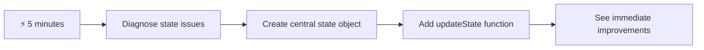
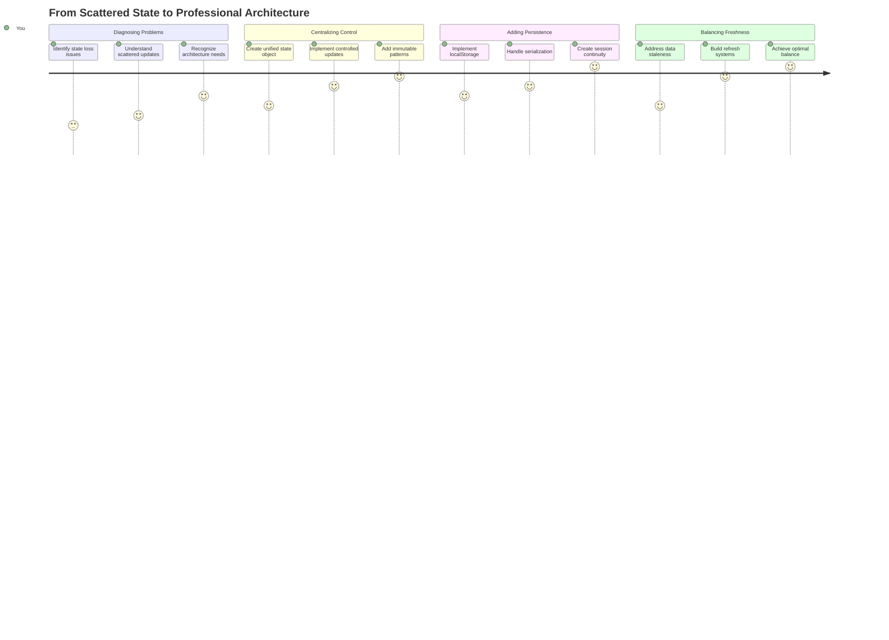
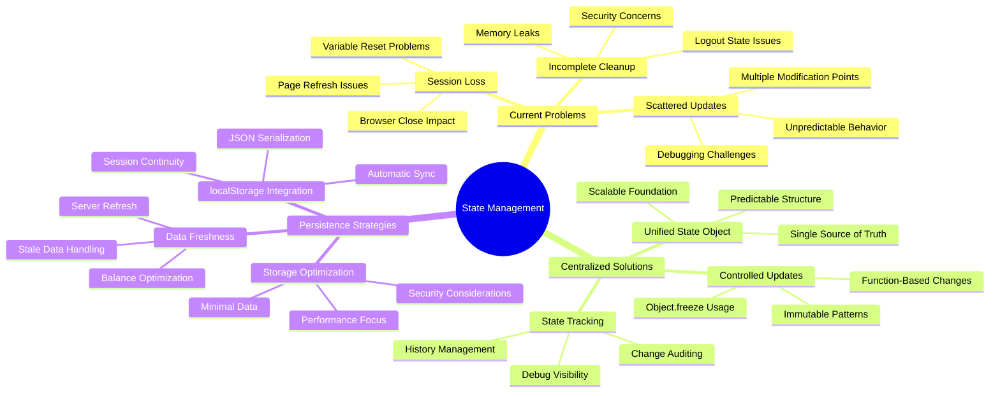
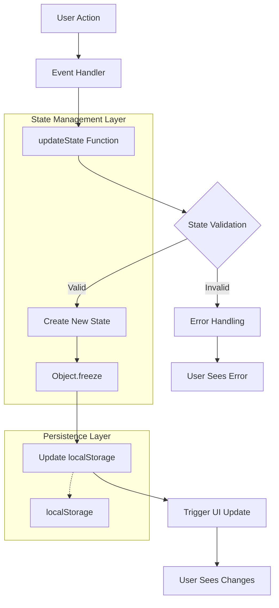
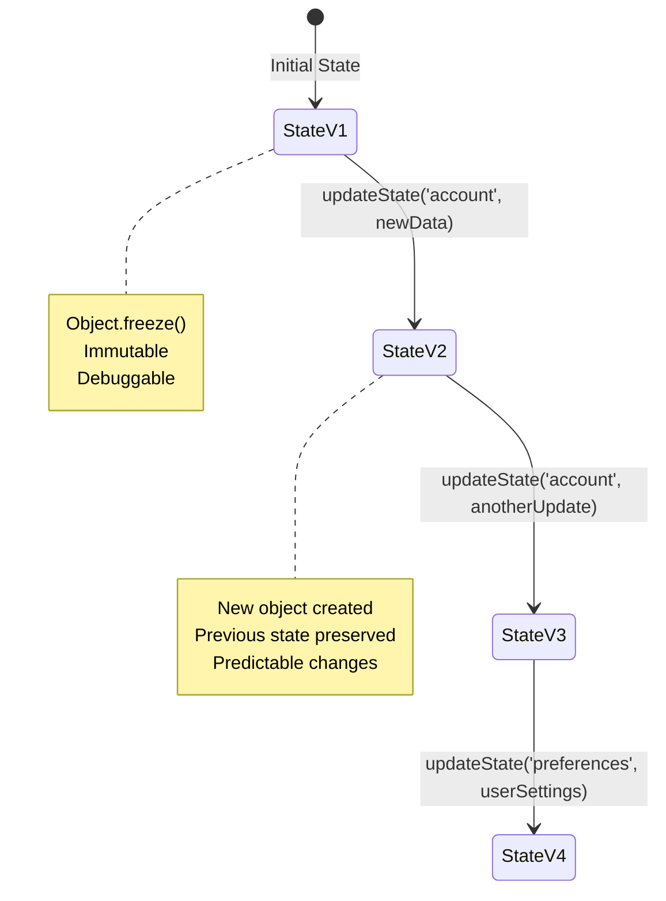
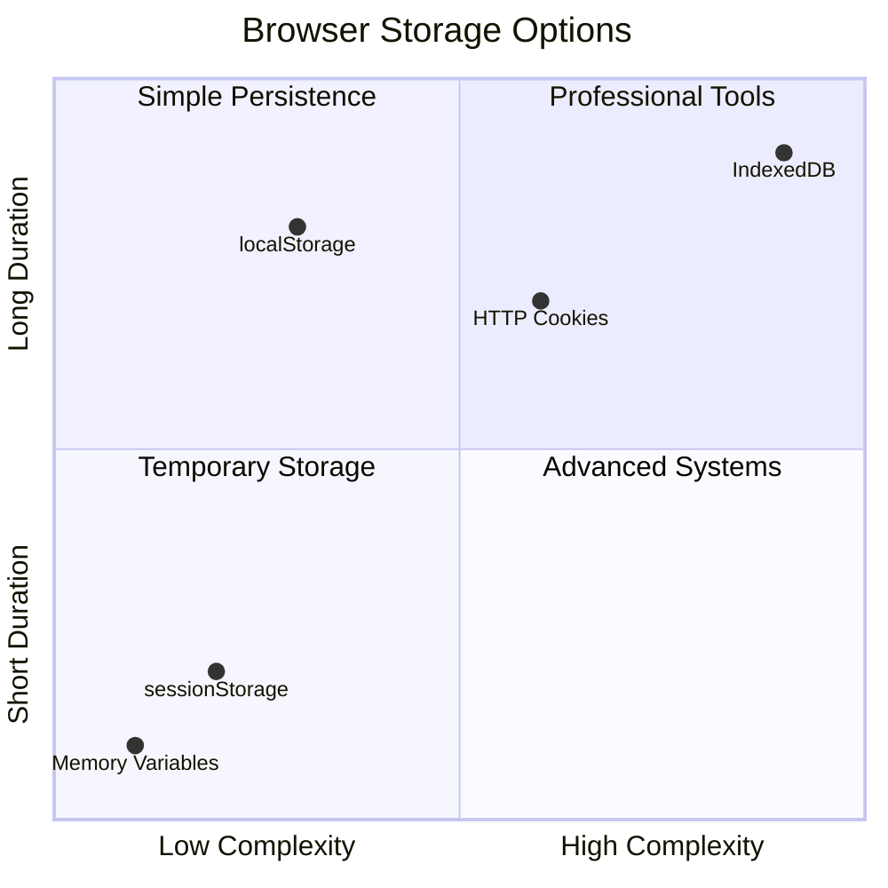
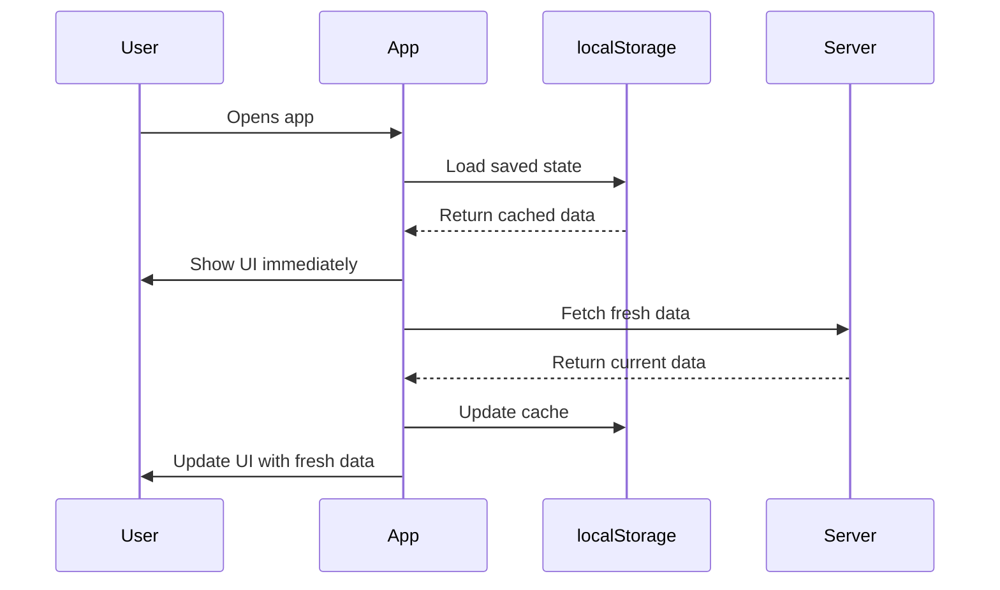
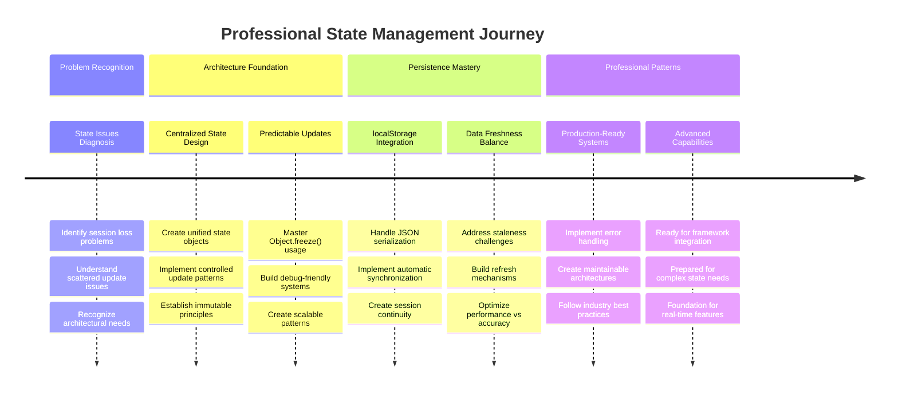

<!--
CO_OP_TRANSLATOR_METADATA:
{
  "original_hash": "b807b09df716dc48a2b750835bf8e933",
  "translation_date": "2025-11-04T01:30:38+00:00",
  "source_file": "7-bank-project/4-state-management/README.md",
  "language_code": "fi"
}
-->
# Rakenna pankkisovellus, osa 4: Tilanhallinnan periaatteet

## ⚡ Mitä voit tehdä seuraavan viiden minuutin aikana

**Nopea aloitus kiireisille kehittäjille**



- **Minuutti 1**: Testaa nykyinen tilaongelma - kirjaudu sisään, päivitä sivu, tarkkaile uloskirjautumista
- **Minuutti 2**: Korvaa `let account = null` koodilla `let state = { account: null }`
- **Minuutti 3**: Luo yksinkertainen `updateState()`-funktio hallittuja päivityksiä varten
- **Minuutti 4**: Päivitä yksi funktio käyttämään uutta mallia
- **Minuutti 5**: Testaa parannettu ennustettavuus ja virheenkorjauskyky

**Nopea diagnostiikkatesti**:
```javascript
// Before: Scattered state
let account = null; // Lost on refresh!

// After: Centralized state
let state = Object.freeze({ account: null }); // Controlled and trackable!
```

**Miksi tämä on tärkeää**: Viidessä minuutissa koet siirtymän kaoottisesta tilanhallinnasta ennustettaviin ja helposti virheenkorjattaviin malleihin. Tämä on perusta, joka tekee monimutkaisista sovelluksista ylläpidettäviä.

## 🗺️ Oppimismatka tilanhallinnan mestariksi



**Matkasi päämäärä**: Tämän oppitunnin lopussa olet rakentanut ammattimaisen tilanhallintajärjestelmän, joka käsittelee pysyvyyttä, datan tuoreutta ja ennustettavia päivityksiä - samoja malleja, joita käytetään tuotantosovelluksissa.

## Ennakkokysely

[Ennakkokysely](https://ff-quizzes.netlify.app/web/quiz/47)

## Johdanto

Tilanhallinta on kuin Voyager-avaruusaluksen navigointijärjestelmä – kun kaikki toimii sujuvasti, et juuri huomaa sen olemassaoloa. Mutta kun jokin menee pieleen, se voi olla ero tähtienväliseen avaruuteen pääsemisen ja kosmiseen tyhjyyteen eksymisen välillä. Verkkokehityksessä tila edustaa kaikkea, mitä sovelluksen täytyy muistaa: käyttäjän kirjautumistilanne, lomaketiedot, navigointihistoria ja väliaikaiset käyttöliittymän tilat.

Kun pankkisovelluksesi on kehittynyt yksinkertaisesta kirjautumislomakkeesta monimutkaisemmaksi sovellukseksi, olet todennäköisesti kohdannut joitakin yleisiä haasteita. Päivitä sivu, ja käyttäjät kirjautuvat ulos odottamatta. Sulje selain, ja kaikki edistys katoaa. Korjaa ongelmaa, ja etsit useista funktioista, jotka kaikki muokkaavat samaa dataa eri tavoin.

Nämä eivät ole merkkejä huonosta koodauksesta – ne ovat luonnollisia kasvukipuja, jotka ilmenevät, kun sovellukset saavuttavat tietyn monimutkaisuuden kynnyksen. Jokainen kehittäjä kohtaa nämä haasteet, kun heidän sovelluksensa siirtyvät "konseptitodistuksesta" "tuotantovalmiiksi".

Tässä oppitunnissa toteutamme keskitetyn tilanhallintajärjestelmän, joka muuttaa pankkisovelluksesi luotettavaksi, ammattimaiseksi sovellukseksi. Opit hallitsemaan datavirtoja ennustettavasti, säilyttämään käyttäjäistuntoja asianmukaisesti ja luomaan sujuvan käyttäjäkokemuksen, jota modernit verkkosovellukset vaativat.

## Esivaatimukset

Ennen kuin sukellat tilanhallinnan periaatteisiin, sinun on varmistettava, että kehitysympäristösi on asianmukaisesti asetettu ja pankkisovelluksesi perusta on kunnossa. Tämä oppitunti rakentuu suoraan tämän sarjan aiempien osien käsitteisiin ja koodiin.

Varmista, että sinulla on seuraavat komponentit valmiina ennen etenemistä:

**Vaadittava asennus:**
- Suorita [datan hakemisen oppitunti](../3-data/README.md) - sovelluksesi pitäisi onnistua lataamaan ja näyttämään tilitiedot
- Asenna [Node.js](https://nodejs.org) järjestelmääsi taustapalvelimen API:n suorittamista varten
- Käynnistä [palvelin-API](../api/README.md) paikallisesti tilitietojen käsittelyä varten

**Testaa ympäristösi:**

Varmista, että API-palvelimesi toimii oikein suorittamalla tämä komento terminaalissa:

```sh
curl http://localhost:5000/api
# -> should return "Bank API v1.0.0" as a result
```

**Mitä tämä komento tekee:**
- **Lähettää** GET-pyynnön paikalliselle API-palvelimellesi
- **Testaa** yhteyden ja varmistaa, että palvelin vastaa
- **Palauttaa** API-version tiedot, jos kaikki toimii oikein

## 🧠 Tilanhallinnan arkkitehtuurin yleiskatsaus



**Keskeinen periaate**: Ammattimainen tilanhallinta tasapainottaa ennustettavuuden, pysyvyyden ja suorituskyvyn luodakseen luotettavia käyttäjäkokemuksia, jotka skaalautuvat yksinkertaisista vuorovaikutuksista monimutkaisiin sovellusprosesseihin.

---

## Nykyisten tilaongelmien diagnosointi

Kuten Sherlock Holmes rikospaikkaa tutkiessaan, meidän on ymmärrettävä tarkalleen, mitä nykyisessä toteutuksessa tapahtuu, ennen kuin voimme ratkaista käyttäjäistuntojen katoamisen mysteerin.

Tehdään yksinkertainen kokeilu, joka paljastaa tilanhallinnan perusongelmat:

**🧪 Kokeile tätä diagnostiikkatestiä:**
1. Kirjaudu sisään pankkisovellukseesi ja siirry hallintapaneeliin
2. Päivitä selaimen sivu
3. Tarkkaile, mitä tapahtuu kirjautumistilallesi

Jos sinut ohjataan takaisin kirjautumisnäyttöön, olet löytänyt klassisen tilan pysyvyyden ongelman. Tämä käyttäytyminen johtuu siitä, että nykyinen toteutuksemme tallentaa käyttäjätiedot JavaScript-muuttujiin, jotka nollautuvat jokaisen sivun latauksen yhteydessä.

**Nykyisen toteutuksen ongelmat:**

Edellisen oppitunnin yksinkertainen `account`-muuttuja aiheuttaa kolme merkittävää ongelmaa, jotka vaikuttavat sekä käyttäjäkokemukseen että koodin ylläpidettävyyteen:

| Ongelma | Tekninen syy | Vaikutus käyttäjälle |
|---------|--------------|----------------------|
| **Istunnon menetys** | Sivun päivitys tyhjentää JavaScript-muuttujat | Käyttäjien täytyy kirjautua usein uudelleen |
| **Hajanaiset päivitykset** | Useat funktiot muokkaavat tilaa suoraan | Virheenkorjaus vaikeutuu |
| **Epätäydellinen siivous** | Uloskirjautuminen ei tyhjennä kaikkia tilaviittauksia | Mahdolliset turvallisuus- ja yksityisyysongelmat |

**Arkkitehtuurinen haaste:**

Kuten Titanicin osastoitu rakenne, joka vaikutti vankalta, kunnes useat osastot tulvivat samanaikaisesti, näiden ongelmien yksittäinen korjaaminen ei ratkaise taustalla olevaa arkkitehtuurista ongelmaa. Tarvitsemme kattavan tilanhallintaratkaisun.

> 💡 **Mitä oikeastaan yritämme saavuttaa?**

[Tilanhallinta](https://en.wikipedia.org/wiki/State_management) tarkoittaa kahden perusongelman ratkaisemista:

1. **Missä datani on?**: Seurataan, mitä tietoa meillä on ja mistä se tulee
2. **Ovatko kaikki samalla sivulla?**: Varmistetaan, että käyttäjien näkemä vastaa todellista tilannetta

**Suunnitelmamme:**

Sen sijaan, että juoksisimme ympyrää, luomme **keskitetyn tilanhallintajärjestelmän**. Ajattele sitä kuin yhtä todella järjestelmällistä henkilöä, joka vastaa kaikesta tärkeästä:




**Tämän datavirran ymmärtäminen:**
- **Keskittää** kaikki sovelluksen tilat yhteen paikkaan
- **Ohjaa** kaikki tilamuutokset hallittujen funktioiden kautta
- **Varmistaa**, että käyttöliittymä pysyy synkronoituna nykyisen tilan kanssa
- **Tarjoaa** selkeän ja ennustettavan mallin datan hallintaan

> 💡 **Ammattilaisen vinkki**: Tämä oppitunti keskittyy peruskäsitteisiin. Monimutkaisissa sovelluksissa kirjastot, kuten [Redux](https://redux.js.org), tarjoavat kehittyneempiä tilanhallintaominaisuuksia. Näiden periaatteiden ymmärtäminen auttaa sinua hallitsemaan mitä tahansa tilanhallintakirjastoa.

> ⚠️ **Edistynyt aihe**: Emme käsittele automaattisia käyttöliittymäpäivityksiä, jotka käynnistyvät tilamuutoksista, koska tämä liittyy [reaktiivisen ohjelmoinnin](https://en.wikipedia.org/wiki/Reactive_programming) käsitteisiin. Pidä tämä erinomaisena seuraavana askeleena oppimismatkallasi!

### Tehtävä: Keskitetyn tilarakenteen luominen

Aloitetaan hajanaisen tilanhallinnan muuttaminen keskitettyyn järjestelmään. Tämä ensimmäinen askel luo perustan kaikille seuraaville parannuksille.

**Vaihe 1: Luo keskitetty tilaobjekti**

Korvaa yksinkertainen `account`-määrittely:

```js
let account = null;
```

Rakenteellisella tilaobjektilla:

```js
let state = {
  account: null
};
```

**Miksi tämä muutos on tärkeä:**
- **Keskittää** kaikki sovelluksen data yhteen paikkaan
- **Valmistaa** rakenteen lisäämään myöhemmin lisää tilan ominaisuuksia
- **Luo** selkeän rajan tilan ja muiden muuttujien välille
- **Vakiinnuttaa** mallin, joka skaalautuu sovelluksen kasvaessa

**Vaihe 2: Päivitä tilan käyttömallit**

Päivitä funktiosi käyttämään uutta tilarakennetta:

**`register()` ja `login()`-funktioissa**, korvaa:
```js
account = ...
```

Koodilla:
```js
state.account = ...
```

**`updateDashboard()`-funktiossa**, lisää tämä rivi alkuun:
```js
const account = state.account;
```

**Mitä nämä päivitykset saavuttavat:**
- **Säilyttää** nykyisen toiminnallisuuden samalla kun parantaa rakennetta
- **Valmistaa** koodisi kehittyneempään tilanhallintaan
- **Luo** johdonmukaiset mallit tiladatan käyttöön
- **Vakiinnuttaa** perustan keskitettyihin tilapäivityksiin

> 💡 **Huomio**: Tämä refaktorointi ei välittömästi ratkaise ongelmiamme, mutta se luo olennaisen perustan tuleville tehokkaille parannuksille!

### 🎯 Pedagoginen tarkistus: Keskittämisen periaatteet

**Pysähdy ja pohdi**: Olet juuri toteuttanut keskitetyn tilanhallinnan perustan. Tämä on kriittinen arkkitehtuurinen päätös.

**Nopea itsearviointi**:
- Voitko selittää, miksi tilan keskittäminen yhteen objektiin on parempi kuin hajanaiset muuttujat?
- Mitä tapahtuisi, jos unohtaisit päivittää funktion käyttämään `state.account`-rakennetta?
- Kuinka tämä malli valmistaa koodisi kehittyneempiin ominaisuuksiin?

**Yhteys todellisuuteen**: Keskittämismalli, jonka olet oppinut, on modernien kehysten, kuten Reduxin, Vuexin ja React Contextin, perusta. Rakennat samaa arkkitehtuurista ajattelua, jota käytetään suurissa sovelluksissa.

**Haastekysymys**: Jos sinun pitäisi lisätä käyttäjän asetukset (teema, kieli) sovellukseesi, mihin lisäisit ne tilarakenteessa? Kuinka tämä skaalautuisi?

## Hallittujen tilapäivitysten toteuttaminen

Kun tilamme on keskitetty, seuraava askel on hallittujen mekanismien luominen datan muokkaamiseen. Tämä lähestymistapa varmistaa ennustettavat tilamuutokset ja helpomman virheenkorjauksen.

Perusperiaate muistuttaa lennonjohtoa: sen sijaan että useat funktiot muokkaisivat tilaa itsenäisesti, ohjaamme kaikki muutokset yhden hallitun funktion kautta. Tämä malli tarjoaa selkeän valvonnan siitä, milloin ja miten data muuttuu.

**Muuttumaton tilanhallinta:**

Käsittelemme `state`-objektia [*muuttumattomana*](https://en.wikipedia.org/wiki/Immutable_object), mikä tarkoittaa, että emme koskaan muokkaa sitä suoraan. Sen sijaan jokainen muutos luo uuden tilaobjektin päivitetyn datan kanssa.

Vaikka tämä lähestymistapa saattaa aluksi tuntua tehottomalta verrattuna suoriin muokkauksiin, se tarjoaa merkittäviä etuja virheenkorjauksessa, testauksessa ja sovelluksen ennustettavuuden ylläpitämisessä.

**Muuttumattoman tilanhallinnan edut:**

| Etu | Kuvaus | Vaikutus |
|-----|--------|----------|
| **Ennustettavuus** | Muutokset tapahtuvat vain hallittujen funktioiden kautta | Helpompi virheenkorjaus ja testaus |
| **Historian seuranta** | Jokainen tilamuutos luo uuden objektin | Mahdollistaa kumoamisen/tekemisen uudelleen |
| **Sivuvaikutusten estäminen** | Ei tahattomia muokkauksia | Estää mystisiä virheitä |
| **Suorituskyvyn optimointi** | Helppo havaita, kun tila todella muuttuu | Mahdollistaa tehokkaat käyttöliittymäpäivitykset |

**JavaScriptin muuttumattomuus `Object.freeze()`-metodilla:**

JavaScript tarjoaa [`Object.freeze()`](https://developer.mozilla.org/docs/Web/JavaScript/Reference/Global_Objects/Object/freeze)-metodin estämään objektin muokkaukset:

```js
const immutableState = Object.freeze({ account: userData });
// Any attempt to modify immutableState will throw an error
```

**Mitä tässä tapahtuu:**
- **Estää** suorat ominaisuuksien määritykset tai poistot
- **Heittää** poikkeuksia, jos muokkausyrityksiä tehdään
- **Varmistaa**, että tilamuutokset tapahtuvat hallittujen funktioiden kautta
- **Luo** selkeän sopimuksen siitä, miten tilaa voidaan päivittää

> 💡 **Syväsukellus**: Lue lisää *pintapuolisten* ja *syvien* muuttumattomien objektien eroista [MDN-dokumentaatiosta](https://developer.mozilla.org/docs/Web/JavaScript/Reference/Global_Objects/Object/freeze#What_is_shallow_freeze). Tämän eron ymmärtäminen on tärkeää monimutkaisille tilarakenteille.



### Tehtävä

Luodaan uusi `updateState()`-funktio:

```js
function updateState(property, newData) {
  state = Object.freeze({
    ...state,
    [property]: newData
  });
}
```

Tässä funktiossa luomme uuden tilaobjektin ja kopioimme datan edellisestä tilasta käyttämällä [*spread (`...`) operaattoria*](https://developer.mozilla.org/docs/Web/JavaScript/Reference/Operators/Spread_syntax#Spread_in_object_literals). Sitten ylikirjoitamme tietyn ominaisuuden tilaobjektista uudella datalla käyttämällä [hakasulkeiden notaatiota](https://developer.mozilla.org/docs/Web/JavaScript/Guide/Working_with_Objects#Objects_and_properties) `[property]` määrittelyyn. Lopuksi lukitsemme objektin estääksemme muokkaukset käyttämällä `Object.freeze()`. Tällä hetkellä meillä on vain `account`-ominaisuus tallennettuna tilassa, mutta tällä lähestymistavalla voit lisätä niin monta ominaisuutta kuin tarvitset tilaan.

Päivitämme myös `state`-alustuksen varmistaaksemme, että alkuperäinen tila on myös lukittu:

```js
let state = Object.freeze({
  account: null
});
```

Sen jälkeen päivitä `register`-funktio korvaamalla `state.account = result;` seuraavalla:

```js
updateState('account', result);
```

Tee sama `login`-funktiolle korvaamalla `state.account = data;` seuraavalla:

```js
updateState('account', data);
```

Käytämme nyt tilaisuutta korjataksemme ongelman, jossa tilitietoja ei tyhjennetä, kun käyttäjä napsauttaa *Kirjaudu ulos*.

Luo uusi funktio `logout()`:

```js
function logout() {
  updateState('account', null);
  navigate('/login');
}
```

`updateDashboard()`-funktiossa korvaa uudelleenohjaus `return navigate('/login');` koodilla `return logout();`;

Kokeile uuden tilin rekisteröintiä, uloskirjautumista ja uudelleen kirjautumista varmistaaksesi, että kaikki toimii edelleen oikein.

> Vinkki: voit tarkastella kaikkia tilamuutoksia lisäämällä `console.log(state)` `updateState()`-funktion loppuun ja
| **Kuinka kauan sen pitäisi säilyä?** | Kirjautumistila vs. väliaikaiset käyttöliittymäasetukset | Valitse sopiva säilytysaika |
| **Tarvitseeko palvelin sitä?** | Todennustunnukset vs. käyttöliittymäasetukset | Määritä jakamistarpeet |

**Selaimen tallennusvaihtoehdot:**

Modernit selaimet tarjoavat useita tallennusmekanismeja, jotka on suunniteltu eri käyttötarkoituksiin:

**Ensisijaiset tallennusrajapinnat:**

1. **[`localStorage`](https://developer.mozilla.org/docs/Web/API/Window/localStorage)**: Pysyvä [avain/arvo-tallennus](https://en.wikipedia.org/wiki/Key%E2%80%93value_database)
   - **Säilyttää** tiedot selaimen istuntojen välillä loputtomasti  
   - **Säilyy** selaimen uudelleenkäynnistyksissä ja tietokoneen uudelleenkäynnistyksissä
   - **Rajattu** tiettyyn verkkotunnukseen
   - **Täydellinen** käyttäjän asetuksille ja kirjautumistiloille

2. **[`sessionStorage`](https://developer.mozilla.org/docs/Web/API/Window/sessionStorage)**: Väliaikainen istuntotallennus
   - **Toimii** identtisesti localStoragen kanssa aktiivisten istuntojen aikana
   - **Tyhjentyy** automaattisesti, kun selaimen välilehti suljetaan
   - **Ihanteellinen** väliaikaisille tiedoille, jotka eivät saa säilyä

3. **[HTTP-evästeet](https://developer.mozilla.org/docs/Web/HTTP/Cookies)**: Palvelimen jakama tallennus
   - **Lähetetään automaattisesti** jokaisen palvelinpyynnön mukana
   - **Täydellinen** [todennustunnuksille](https://en.wikipedia.org/wiki/Authentication)
   - **Rajoitettu** kooltaan ja voi vaikuttaa suorituskykyyn

**Tietojen sarjoittamisen tarve:**

Sekä `localStorage` että `sessionStorage` tallentavat vain [merkkijonoja](https://developer.mozilla.org/docs/Web/JavaScript/Reference/Global_Objects/String):

```js
// Convert objects to JSON strings for storage
const accountData = { user: 'john', balance: 150 };
localStorage.setItem('account', JSON.stringify(accountData));

// Parse JSON strings back to objects when retrieving
const savedAccount = JSON.parse(localStorage.getItem('account'));
```

**Sarjoittamisen ymmärtäminen:**
- **Muuntaa** JavaScript-objektit JSON-merkkijonoiksi käyttäen [`JSON.stringify()`](https://developer.mozilla.org/docs/Web/JavaScript/Reference/Global_Objects/JSON/stringify)
- **Rakentaa uudelleen** objektit JSON:sta käyttäen [`JSON.parse()`](https://developer.mozilla.org/docs/Web/JavaScript/Reference/Global_Objects/JSON/parse)
- **Käsittelee** monimutkaisia sisäkkäisiä objekteja ja taulukoita automaattisesti
- **Epäonnistuu** funktioiden, määrittelemättömien arvojen ja syklisten viittausten kohdalla

> 💡 **Edistynyt vaihtoehto**: Monimutkaisille offline-sovelluksille, joissa on suuria tietomääriä, harkitse [`IndexedDB` API](https://developer.mozilla.org/docs/Web/API/IndexedDB_API). Se tarjoaa täysimittaisen asiakaspuolen tietokannan, mutta vaatii monimutkaisempaa toteutusta.



### Tehtävä: Toteuta localStorage-pysyvyys

Toteutetaan pysyvä tallennus, jotta käyttäjät pysyvät kirjautuneina, kunnes he kirjautuvat ulos. Käytämme `localStoragea` tilitietojen tallentamiseen selaimen istuntojen välillä.

**Vaihe 1: Määritä tallennuskonfiguraatio**

```js
const storageKey = 'savedAccount';
```

**Mitä tämä vakio tarjoaa:**
- **Luo** johdonmukaisen tunnisteen tallennetuille tiedoille
- **Estää** kirjoitusvirheet tallennusavaimen viittauksissa
- **Helpottaa** tallennusavaimen muuttamista tarvittaessa
- **Noudattaa** parhaita käytäntöjä ylläpidettävän koodin osalta

**Vaihe 2: Lisää automaattinen pysyvyys**

Lisää tämä rivi `updateState()`-funktion loppuun:

```js
localStorage.setItem(storageKey, JSON.stringify(state.account));
```

**Mitä tässä tapahtuu:**
- **Muuntaa** tiliobjektin JSON-merkkijonoksi tallennusta varten
- **Tallentaa** tiedot johdonmukaisella tallennusavaimella
- **Suorittaa** automaattisesti aina, kun tilamuutoksia tapahtuu
- **Varmistaa**, että tallennetut tiedot ovat aina synkronoituja nykyisen tilan kanssa

> 💡 **Arkkitehtuurin etu**: Koska keskityimme kaikki tilapäivitykset `updateState()`-funktioon, pysyvyyden lisääminen vaati vain yhden koodirivin. Tämä osoittaa hyvän arkkitehtuurin voiman!

**Vaihe 3: Palauta tila sovelluksen latauksessa**

Luo alustustoiminto tallennettujen tietojen palauttamiseksi:

```js
function init() {
  const savedAccount = localStorage.getItem(storageKey);
  if (savedAccount) {
    updateState('account', JSON.parse(savedAccount));
  }

  // Our previous initialization code
  window.onpopstate = () => updateRoute();
  updateRoute();
}

init();
```

**Alustuksen prosessin ymmärtäminen:**
- **Hakee** aiemmin tallennetut tilitiedot localStoragesta
- **Parsee** JSON-merkkijonon takaisin JavaScript-objektiksi
- **Päivittää** tilan hallitun päivitysfunktiomme avulla
- **Palauttaa** käyttäjän istunnon automaattisesti sivun latauksessa
- **Suorittaa** ennen reittipäivityksiä varmistaakseen, että tila on käytettävissä

**Vaihe 4: Optimoi oletusreitti**

Päivitä oletusreitti hyödyntämään pysyvyyttä:

Korvaa `updateRoute()`-funktiossa:
```js
// Replace: return navigate('/login');
return navigate('/dashboard');
```

**Miksi tämä muutos on järkevä:**
- **Hyödyntää** uutta pysyvyysjärjestelmää tehokkaasti
- **Mahdollistaa**, että hallintapaneeli käsittelee todennustarkistukset
- **Ohjaa** automaattisesti kirjautumiseen, jos tallennettua istuntoa ei ole
- **Luo** saumattomamman käyttäjäkokemuksen

**Testaa toteutuksesi:**

1. Kirjaudu pankkisovellukseesi
2. Päivitä selaimen sivu
3. Varmista, että pysyt kirjautuneena ja hallintapaneelissa
4. Sulje ja avaa selaimesi uudelleen
5. Siirry takaisin sovellukseesi ja varmista, että olet edelleen kirjautuneena

🎉 **Saavutus saavutettu**: Olet onnistuneesti toteuttanut pysyvän tilanhallinnan! Sovelluksesi toimii nyt kuin ammattimainen verkkosovellus.

### 🎯 Pedagoginen tarkistus: Pysyvyysarkkitehtuuri

**Arkkitehtuurin ymmärtäminen**: Olet toteuttanut kehittyneen pysyvyyskerroksen, joka tasapainottaa käyttäjäkokemuksen ja tietojen hallinnan monimutkaisuuden.

**Keskeiset opit**:
- **JSON-sarjoittaminen**: Monimutkaisten objektien muuntaminen tallennettaviksi merkkijonoiksi
- **Automaattinen synkronointi**: Tilamuutokset käynnistävät pysyvän tallennuksen
- **Istunnon palautus**: Sovellukset voivat palauttaa käyttäjän kontekstin keskeytysten jälkeen
- **Keskitetty pysyvyys**: Yksi päivitysfunktio hallitsee kaikkea tallennusta

**Yhteys teollisuuteen**: Tämä pysyvyysmalli on olennainen osa progressiivisia verkkosovelluksia (PWA), offline-ensisijaisia sovelluksia ja moderneja mobiiliverkkokokemuksia. Rakennat tuotantotason ominaisuuksia.

**Pohdintakysymys**: Kuinka muokkaisit tätä järjestelmää käsittelemään useita käyttäjätilejä samalla laitteella? Mieti yksityisyyden ja turvallisuuden vaikutuksia.

## Pysyvyyden ja tietojen tuoreuden tasapainottaminen

Pysyvyysjärjestelmämme ylläpitää käyttäjäistuntoja onnistuneesti, mutta tuo mukanaan uuden haasteen: tietojen vanhenemisen. Kun useat käyttäjät tai sovellukset muokkaavat samaa palvelintietoa, paikallisesti välimuistissa olevat tiedot vanhenevat.

Tämä tilanne muistuttaa viikinkinavigaattoreita, jotka luottivat sekä tallennettuihin tähtikarttoihin että ajankohtaisiin tähtihavaintoihin. Kartat tarjosivat johdonmukaisuutta, mutta navigaattorit tarvitsivat tuoreita havaintoja muuttuvien olosuhteiden huomioimiseksi. Samoin sovelluksemme tarvitsee sekä pysyvää käyttäjätilaa että ajankohtaisia palvelintietoja.

**🧪 Tietojen tuoreusongelman havaitseminen:**

1. Kirjaudu hallintapaneeliin käyttäen `test`-tiliä
2. Suorita tämä komento terminaalissa simuloidaksesi tapahtumaa toisesta lähteestä:

```sh
curl --request POST \
     --header "Content-Type: application/json" \
     --data "{ \"date\": \"2020-07-24\", \"object\": \"Bought book\", \"amount\": -20 }" \
     http://localhost:5000/api/accounts/test/transactions
```

3. Päivitä hallintapaneelin sivu selaimessa
4. Tarkista, näkyykö uusi tapahtuma

**Mitä tämä testi osoittaa:**
- **Näyttää**, kuinka localStorage voi "vanhentua" (olla vanhentunut)
- **Simuloi** todellisia tilanteita, joissa tietoja muutetaan sovelluksen ulkopuolella
- **Paljastaa** pysyvyyden ja tietojen tuoreuden välisen jännitteen

**Tietojen vanhenemisen haaste:**

| Ongelma | Syy | Käyttäjän vaikutus |
|---------|-----|--------------------|
| **Vanha tieto** | localStorage ei vanhene automaattisesti | Käyttäjät näkevät vanhentunutta tietoa |
| **Palvelinmuutokset** | Muut sovellukset/käyttäjät muokkaavat samoja tietoja | Epäjohdonmukaiset näkymät eri alustoilla |
| **Välimuisti vs. todellisuus** | Paikallinen välimuisti ei vastaa palvelimen tilaa | Huono käyttäjäkokemus ja hämmennys |

**Ratkaisustrategia:**

Toteutamme "päivitä latauksessa" -mallin, joka tasapainottaa pysyvyyden edut ja tietojen tarkkuuden tarpeen. Tämä lähestymistapa ylläpitää sujuvaa käyttäjäkokemusta samalla kun varmistaa tietojen tarkkuuden.



### Tehtävä: Toteuta tietojen päivitysjärjestelmä

Luomme järjestelmän, joka hakee automaattisesti tuoreita tietoja palvelimelta samalla kun säilyttää pysyvän tilanhallinnan edut.

**Vaihe 1: Luo tilitietojen päivittäjä**

```js
async function updateAccountData() {
  const account = state.account;
  if (!account) {
    return logout();
  }

  const data = await getAccount(account.user);
  if (data.error) {
    return logout();
  }

  updateState('account', data);
}
```

**Tämän funktion logiikan ymmärtäminen:**
- **Tarkistaa**, onko käyttäjä kirjautuneena (state.account olemassa)
- **Ohjaa** uloskirjautumiseen, jos kelvollista istuntoa ei löydy
- **Hakee** tuoreita tilitietoja palvelimelta käyttäen olemassa olevaa `getAccount()`-funktiota
- **Käsittelee** palvelinvirheet sujuvasti kirjautumalla ulos virheellisistä istunnoista
- **Päivittää** tilan tuoreilla tiedoilla hallitun päivitysjärjestelmän avulla
- **Käynnistää** automaattisen localStorage-pysyvyyden `updateState()`-funktion kautta

**Vaihe 2: Luo hallintapaneelin päivityskäsittelijä**

```js
async function refresh() {
  await updateAccountData();
  updateDashboard();
}
```

**Mitä tämä päivitysfunktio saavuttaa:**
- **Koordinoi** tietojen päivitys- ja käyttöliittymän päivitysprosessin
- **Odottaa**, että tuoreet tiedot ladataan ennen käyttöliittymän päivitystä
- **Varmistaa**, että hallintapaneeli näyttää ajankohtaisimmat tiedot
- **Säilyttää** selkeän erottelun tietojen hallinnan ja käyttöliittymän päivitysten välillä

**Vaihe 3: Integroi reittijärjestelmään**

Päivitä reittikonfiguraatiosi käynnistämään päivitys automaattisesti:

```js
const routes = {
  '/login': { templateId: 'login' },
  '/dashboard': { templateId: 'dashboard', init: refresh }
};
```

**Kuinka tämä integrointi toimii:**
- **Suorittaa** päivitysfunktion aina, kun hallintapaneelin reitti latautuu
- **Varmistaa**, että tuoreet tiedot näytetään aina, kun käyttäjät siirtyvät hallintapaneeliin
- **Säilyttää** olemassa olevan reittirakenteen samalla kun lisää tietojen tuoreuden
- **Tarjoaa** johdonmukaisen mallin reittikohtaiselle alustukselle

**Testaa tietojen päivitysjärjestelmäsi:**

1. Kirjaudu pankkisovellukseesi
2. Suorita aiempi curl-komento luodaksesi uuden tapahtuman
3. Päivitä hallintapaneelin sivu tai siirry pois ja takaisin
4. Varmista, että uusi tapahtuma näkyy välittömästi

🎉 **Täydellinen tasapaino saavutettu**: Sovelluksesi yhdistää nyt pysyvän tilan sujuvuuden ja tuoreiden palvelintietojen tarkkuuden!

## 📈 Tilanhallinnan mestaruusaikajana



**🎓 Valmistumismilestone**: Olet onnistuneesti rakentanut täydellisen tilanhallintajärjestelmän samoilla periaatteilla, jotka ohjaavat Reduxia, Vuexia ja muita ammattimaisia tilakirjastoja. Nämä mallit skaalautuvat yksinkertaisista sovelluksista yrityssovelluksiin.

**🔄 Seuraavan tason kyvyt**:
- Valmis hallitsemaan tilanhallintakehyksiä (Redux, Zustand, Pinia)
- Valmis toteuttamaan reaaliaikaisia ominaisuuksia WebSocketien avulla
- Valmis rakentamaan offline-ensisijaisia progressiivisia verkkosovelluksia
- Perusta asetettu kehittyneille malleille, kuten tilakoneille ja havainnoijille

## GitHub Copilot Agent -haaste 🚀

Käytä Agent-tilaa suorittaaksesi seuraavan haasteen:

**Kuvaus:** Toteuta kattava tilanhallintajärjestelmä, jossa on kumoa/tee uudelleen -toiminnallisuus pankkisovellukselle. Tämä haaste auttaa sinua harjoittelemaan kehittyneitä tilanhallintakonsepteja, kuten tilahistorian seuranta, muuttumattomat päivitykset ja käyttöliittymän synkronointi.

**Prompt:** Luo parannettu tilanhallintajärjestelmä, joka sisältää: 1) Tilahistoria-taulukon, joka seuraa kaikkia aiempia tiloja, 2) Kumoa ja tee uudelleen -funktiot, jotka voivat palauttaa aiempiin tiloihin, 3) Käyttöliittymän painikkeet kumoa/tee uudelleen -toimintoja varten hallintapaneelissa, 4) Enimmäishistorian rajan 10 tilaa muistiongelmien estämiseksi, ja 5) Historiatietojen asianmukainen siivous, kun käyttäjä kirjautuu ulos. Varmista, että kumoa/tee uudelleen -toiminnallisuus toimii tilisaldomuutosten kanssa ja säilyy selaimen päivityksissä.

Lisätietoja [agent-tilasta](https://code.visualstudio.com/blogs/2025/02/24/introducing-copilot-agent-mode) täällä.

## 🚀 Haaste: Tallennuksen optimointi

Toteutuksesi käsittelee nyt käyttäjäistuntoja, tietojen päivitystä ja tilanhallintaa tehokkaasti. Mieti kuitenkin, tasapainottaako nykyinen lähestymistapamme optimaalisesti tallennustehokkuuden ja toiminnallisuuden.

Kuten shakkimestarit, jotka erottavat olennaiset nappulat ja uhrattavat sotilaat, tehokas tilanhallinta vaatii tunnistamaan, mitkä tiedot on säilytettävä ja mitkä tulisi aina hakea palvelimelta tuoreina.

**Optimointianalyysi:**

Arvioi nykyistä localStorage-toteutustasi ja pohdi näitä strategisia kysymyksiä:
- Mikä on vähimmäistieto, joka tarvitaan käyttäjän todennuksen ylläpitämiseen?
- Mitkä tiedot muuttuvat niin usein, että paikallisesta välimuistista ei ole juurikaan hyötyä?
- Kuinka tallennuksen optimointi voi parantaa suorituskykyä heikentämättä käyttäjäkokemusta?

**Toteutusstrategia:**
- **Tunnista** olennaiset tiedot, jotka on säilytettävä (todennäköisesti vain käyttäjän tunnistaminen)
- **Muokkaa** localStorage-toteutustasi tallentamaan vain kriittiset istuntotiedot
- **Varmista**, että tuoreet tiedot ladataan aina palvelimelta hallintapaneelin vierailuilla
- **Testaa**, että optimoitu lähestymistapasi säilyttää saman käyttäjäkokemuksen

**Edistynyt harkinta:**
- **Vertaa** täyden tilitiedon tallentamisen ja pelkkien todennustunnusten tall

---

**Vastuuvapauslauseke**:  
Tämä asiakirja on käännetty käyttämällä tekoälypohjaista käännöspalvelua [Co-op Translator](https://github.com/Azure/co-op-translator). Vaikka pyrimme tarkkuuteen, huomioithan, että automaattiset käännökset voivat sisältää virheitä tai epätarkkuuksia. Alkuperäistä asiakirjaa sen alkuperäisellä kielellä tulisi pitää ensisijaisena lähteenä. Kriittisen tiedon osalta suositellaan ammattimaista ihmiskäännöstä. Emme ole vastuussa väärinkäsityksistä tai virhetulkinnoista, jotka johtuvat tämän käännöksen käytöstä.