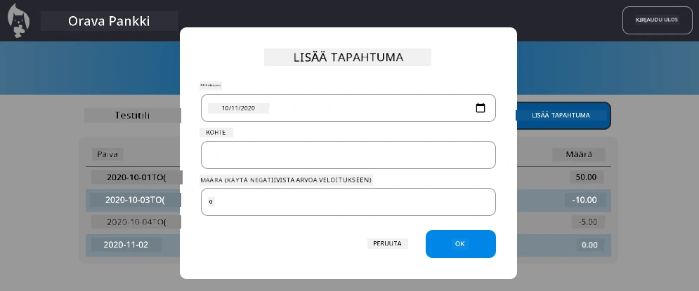

<!--
CO_OP_TRANSLATOR_METADATA:
{
  "original_hash": "50a7783473b39a2e0f133e271a102231",
  "translation_date": "2025-10-23T00:32:11+00:00",
  "source_file": "7-bank-project/4-state-management/assignment.md",
  "language_code": "fi"
}
-->
# Toteuta "Lisää tapahtuma" -dialogi

## Yleiskatsaus

Pankkisovelluksesi sisältää nyt vankan tilanhallinnan ja datan pysyvyyden, mutta siitä puuttuu tärkeä ominaisuus, jota oikeat pankkisovellukset tarvitsevat: käyttäjien mahdollisuus lisätä omia tapahtumia. Tässä tehtävässä toteutat täydellisen "Lisää tapahtuma" -dialogin, joka integroituu saumattomasti olemassa olevaan tilanhallintajärjestelmääsi.

Tämä tehtävä yhdistää kaiken, mitä olet oppinut neljässä pankkiaiheisessa oppitunnissa: HTML-templatointi, lomakkeiden käsittely, API-integraatio ja tilanhallinta.

## Oppimistavoitteet

Tehtävän suorittamalla opit:
- **Luomaan** käyttäjäystävällisen dialogikäyttöliittymän tietojen syöttämistä varten
- **Toteuttamaan** saavutettavan lomakemuotoilun, joka tukee näppäimistöä ja ruudunlukijoita
- **Integroimaan** uusia ominaisuuksia olemassa olevaan tilanhallintajärjestelmääsi
- **Harjoittelemaan** API-kommunikointia ja virheenkäsittelyä
- **Soveltamaan** moderneja web-kehityksen käytäntöjä todelliseen ominaisuuteen

## Ohjeet

### Vaihe 1: Lisää tapahtuma -painike

**Luo** "Lisää tapahtuma" -painike kojelautasivullesi, jotta käyttäjät voivat helposti löytää ja käyttää sitä.

**Vaatimukset:**
- **Sijoita** painike loogiseen paikkaan kojelaudalla
- **Käytä** selkeää, toimintaa kuvaavaa painiketekstiä
- **Muotoile** painike vastaamaan olemassa olevaa käyttöliittymäsuunnittelua
- **Varmista**, että painike on näppäimistön avulla käytettävissä

### Vaihe 2: Dialogin toteutus

Valitse yksi kahdesta lähestymistavasta dialogin toteuttamiseen:

**Vaihtoehto A: Erillinen sivu**
- **Luo** uusi HTML-templaatti tapahtumalomakkeelle
- **Lisää** uusi reitti reititysjärjestelmääsi
- **Toteuta** navigointi lomakesivulle ja takaisin

**Vaihtoehto B: Modaalidialogi (suositeltu)**
- **Käytä** JavaScriptiä dialogin näyttämiseen/piilottamiseen ilman kojelaudalta poistumista
- **Toteuta** käyttämällä [`hidden`-ominaisuutta](https://developer.mozilla.org/docs/Web/HTML/Global_attributes/hidden) tai CSS-luokkia
- **Luo** sujuva käyttäjäkokemus asianmukaisella fokuksen hallinnalla

### Vaihe 3: Saavutettavuuden toteutus

**Varmista**, että dialogisi täyttää [saavutettavuusstandardit modaalidialogeille](https://developer.paciellogroup.com/blog/2018/06/the-current-state-of-modal-dialog-accessibility/):

**Näppäimistönavigointi:**
- **Tuki** Escape-näppäimelle dialogin sulkemiseksi
- **Lukitse** fokus dialogin sisälle, kun se on avoinna
- **Palauta** fokus aktivointipainikkeeseen, kun dialogi suljetaan

**Ruudunlukijatuki:**
- **Lisää** asianmukaiset ARIA-tunnisteet ja roolit
- **Ilmoita** dialogin avaaminen/sulkeminen ruudunlukijoille
- **Tarjoa** selkeät lomakekenttien tunnisteet ja virheilmoitukset

### Vaihe 4: Lomakkeen luominen

**Suunnittele** HTML-lomake, joka kerää tapahtumatietoja:

**Pakolliset kentät:**
- **Päivämäärä**: Milloin tapahtuma tapahtui
- **Kuvaus**: Mihin tapahtuma liittyi
- **Summa**: Tapahtuman arvo (positiivinen tuloille, negatiivinen menoille)

**Lomakkeen ominaisuudet:**
- **Vahvista** käyttäjän syötteet ennen lähettämistä
- **Tarjoa** selkeät virheilmoitukset virheellisistä tiedoista
- **Sisällytä** hyödylliset paikkamerkkitekstit ja tunnisteet
- **Muotoile** yhtenäisesti olemassa olevan suunnittelun kanssa

### Vaihe 5: API-integraatio

**Yhdistä** lomakkeesi taustapalvelun API:in:

**Toteutusvaiheet:**
- **Tarkista** [palvelimen API-määrittelyt](../api/README.md) oikean päätepisteen ja datamuodon löytämiseksi
- **Luo** JSON-data lomakkeen syötteistä
- **Lähetä** data API:lle asianmukaisella virheenkäsittelyllä
- **Näytä** onnistumis-/epäonnistumisviestit käyttäjälle
- **Käsittele** verkkovirheet sujuvasti

### Vaihe 6: Tilanhallinnan integrointi

**Päivitä** kojelautasi uudella tapahtumalla:

**Integraatiovaatimukset:**
- **Päivitä** tilitiedot onnistuneen tapahtuman lisäämisen jälkeen
- **Päivitä** kojelaudan näyttö ilman sivun uudelleenlatausta
- **Varmista**, että uusi tapahtuma näkyy välittömästi
- **Säilytä** asianmukainen tilan johdonmukaisuus koko prosessin ajan

## Tekniset tiedot

**API-päätepisteen tiedot:**
Katso [palvelimen API-dokumentaatio](../api/README.md) saadaksesi tietoa:
- Tapahtumatietojen vaaditusta JSON-muodosta
- HTTP-metodista ja päätepisteen URL-osoitteesta
- Odotetusta vastausmuodosta
- Virhevastausten käsittelystä

**Odotettu tulos:**
Tehtävän suorittamisen jälkeen pankkisovelluksessasi pitäisi olla täysin toimiva "Lisää tapahtuma" -ominaisuus, joka näyttää ja käyttäytyy ammattimaisesti:

## Toteutuksen testaus

**Toiminnallinen testaus:**
1. **Varmista**, että "Lisää tapahtuma" -painike on selkeästi näkyvissä ja käytettävissä
2. **Testaa**, että dialogi avautuu ja sulkeutuu oikein
3. **Vahvista**, että lomakkeen validointi toimii kaikille vaadituille kentille
4. **Tarkista**, että onnistuneet tapahtumat näkyvät välittömästi kojelaudalla
5. **Varmista**, että virheenkäsittely toimii virheellisille tiedoille ja verkkoyhteysongelmille

**Saavutettavuustestaus:**
1. **Navigoi** koko prosessi läpi pelkästään näppäimistöllä
2. **Testaa** ruudunlukijalla varmistaaksesi asianmukaiset ilmoitukset
3. **Vahvista**, että fokuksen hallinta toimii oikein
4. **Tarkista**, että kaikilla lomake-elementeillä on asianmukaiset tunnisteet

## Arviointikriteerit

| Kriteeri | Erinomainen | Riittävä | Parannettavaa |
| -------- | ----------- | -------- | ------------- |
| **Toiminnallisuus** | Lisää tapahtuma -ominaisuus toimii moitteettomasti erinomaisella käyttäjäkokemuksella ja noudattaa kaikkia oppituntien parhaita käytäntöjä | Lisää tapahtuma -ominaisuus toimii oikein, mutta ei noudata kaikkia parhaita käytäntöjä tai sisältää pieniä käytettävyysongelmia | Lisää tapahtuma -ominaisuus toimii osittain tai sisältää merkittäviä käytettävyysongelmia |
| **Koodin laatu** | Koodi on hyvin organisoitu, noudattaa vakiintuneita malleja, sisältää asianmukaisen virheenkäsittelyn ja integroituu saumattomasti olemassa olevaan tilanhallintaan | Koodi toimii, mutta saattaa sisältää joitakin organisointiongelmia tai epäjohdonmukaisia malleja olemassa olevan koodipohjan kanssa | Koodissa on merkittäviä rakenteellisia ongelmia tai se ei integroitu hyvin olemassa oleviin malleihin |
| **Saavutettavuus** | Täysi näppäimistönavigointituki, ruudunlukijayhteensopivuus ja WCAG-ohjeiden noudattaminen erinomaisella fokuksen hallinnalla | Perussaavutettavuusominaisuudet toteutettu, mutta saattaa puuttua joitakin näppäimistönavigointi- tai ruudunlukijaominaisuuksia | Rajoitetut tai ei lainkaan saavutettavuusnäkökulmia toteutettu |
| **Käyttäjäkokemus** | Intuitiivinen, viimeistelty käyttöliittymä, jossa on selkeät palautteet, sujuvat vuorovaikutukset ja ammattimainen ulkoasu | Hyvä käyttäjäkokemus, mutta palautteessa tai visuaalisessa suunnittelussa on pieniä parannettavia kohtia | Huono käyttäjäkokemus, jossa on sekava käyttöliittymä tai puuttuva käyttäjäpalaute |

## Lisähaasteet (valinnainen)

Kun olet suorittanut perusvaatimukset, harkitse näitä parannuksia:

**Parannetut ominaisuudet:**
- **Lisää** tapahtumakategoriat (ruoka, kuljetus, viihde jne.)
- **Toteuta** syötteen validointi reaaliaikaisella palautteella
- **Luo** näppäinoikoteitä tehokäyttäjille
- **Lisää** tapahtumien muokkaus- ja poistomahdollisuudet

**Edistynyt integraatio:**
- **Toteuta** kumoamistoiminto äskettäin lisätyille tapahtumille
- **Lisää** massatapahtumien tuonti CSV-tiedostoista
- **Luo** tapahtumien haku- ja suodatusominaisuudet
- **Toteuta** datan vientiominaisuus

Nämä valinnaiset ominaisuudet auttavat sinua harjoittelemaan edistyneempiä web-kehityksen konsepteja ja luomaan entistä täydellisemmän pankkisovelluksen!

---

**Vastuuvapauslauseke**:  
Tämä asiakirja on käännetty käyttämällä tekoälypohjaista käännöspalvelua [Co-op Translator](https://github.com/Azure/co-op-translator). Vaikka pyrimme tarkkuuteen, huomioithan, että automaattiset käännökset voivat sisältää virheitä tai epätarkkuuksia. Alkuperäinen asiakirja sen alkuperäisellä kielellä tulisi pitää ensisijaisena lähteenä. Kriittisen tiedon osalta suositellaan ammattimaista ihmiskäännöstä. Emme ole vastuussa väärinkäsityksistä tai virhetulkinnoista, jotka johtuvat tämän käännöksen käytöstä.