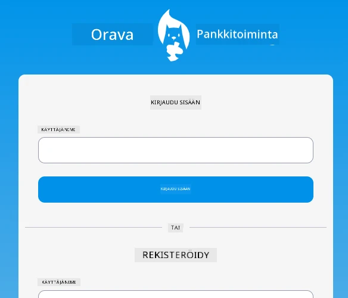
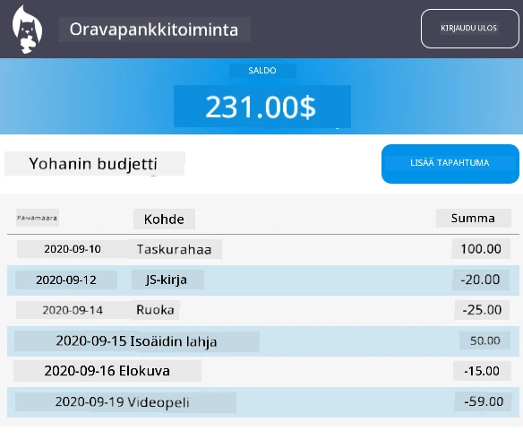

<!--
CO_OP_TRANSLATOR_METADATA:
{
  "original_hash": "830359535306594b448db6575ce5cdee",
  "translation_date": "2025-08-27T20:54:43+00:00",
  "source_file": "7-bank-project/README.md",
  "language_code": "fi"
}
-->
# :dollar: Rakenna Pankki

Tässä projektissa opit rakentamaan kuvitteellisen pankin. Näissä oppitunneissa annetaan ohjeita siitä, miten verkkosovellus suunnitellaan ja reitit määritetään, miten lomakkeita rakennetaan, tilaa hallitaan ja tietoja haetaan API:sta, josta voit hakea pankin tiedot.

|  |  |
|--------------------------------|--------------------------------|

## Oppitunnit

1. [HTML-mallit ja reitit verkkosovelluksessa](1-template-route/README.md)
2. [Kirjautumis- ja rekisteröintilomakkeen rakentaminen](2-forms/README.md)
3. [Tietojen hakemisen ja käyttämisen menetelmät](3-data/README.md)
4. [Tilanhallinnan periaatteet](4-state-management/README.md)

### Tekijät

Nämä oppitunnit on kirjoitettu :hearts: [Yohan Lasorsan](https://twitter.com/sinedied) toimesta.

Jos haluat oppia, miten näissä oppitunneissa käytetty [palvelin-API](/7-bank-project/api/README.md) rakennetaan, voit seurata [tätä videosarjaa](https://aka.ms/NodeBeginner) (erityisesti videot 17–21).

Voit myös tutustua [tähän interaktiiviseen Learn-oppaaseen](https://aka.ms/learn/express-api).

---

**Vastuuvapauslauseke**:  
Tämä asiakirja on käännetty käyttämällä tekoälypohjaista käännöspalvelua [Co-op Translator](https://github.com/Azure/co-op-translator). Vaikka pyrimme tarkkuuteen, huomioithan, että automaattiset käännökset voivat sisältää virheitä tai epätarkkuuksia. Alkuperäinen asiakirja sen alkuperäisellä kielellä tulisi pitää ensisijaisena lähteenä. Kriittisen tiedon osalta suositellaan ammattimaista ihmiskäännöstä. Emme ole vastuussa väärinkäsityksistä tai virhetulkinnoista, jotka johtuvat tämän käännöksen käytöstä.