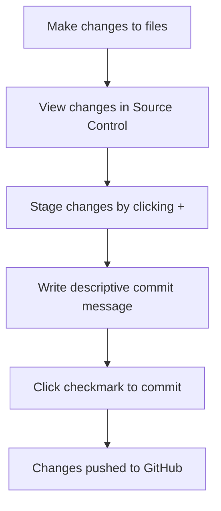

<!--
CO_OP_TRANSLATOR_METADATA:
{
  "original_hash": "cfd4a15974168ca426d50c67682ab9d4",
  "translation_date": "2025-10-23T00:15:15+00:00",
  "source_file": "8-code-editor/1-using-a-code-editor/README.md",
  "language_code": "fi"
}
-->
# Koodieditorin käyttö: VSCode.dev hallinta

Muistatko elokuvan *The Matrix*, kun Neo joutui kytkeytymään massiiviseen tietokoneeseen päästäkseen digitaaliseen maailmaan? Nykyajan web-kehitystyökalut kertovat aivan toisenlaisen tarinan – uskomattoman tehokkaat ominaisuudet ovat saatavilla mistä tahansa. VSCode.dev on selaimessa toimiva koodieditori, joka tuo ammattilaistason kehitystyökalut mihin tahansa laitteeseen, jossa on internetyhteys.

Aivan kuten kirjapainot tekivät kirjoista kaikkien saatavilla olevia, eivät vain luostareiden kirjureiden, VSCode.dev demokratisoi koodaamisen. Voit työskennellä projekteissa kirjaston tietokoneella, koulun laboratoriossa tai missä tahansa, missä sinulla on pääsy selaimeen. Ei asennuksia, ei "tarvitsen juuri tietynlaisen asetuksen" -rajoituksia.

Tämän oppitunnin lopussa ymmärrät, kuinka navigoida VSCode.devissä, avata GitHub-repositorioita suoraan selaimessa ja käyttää Git-versiohallintaa – kaikki taidot, joita ammattilaiskehittäjät käyttävät päivittäin.

## Mitä opit

Kun käymme tämän yhdessä läpi, osaat:

- Navigoida VSCode.devissä kuin se olisi toinen kotisi – löytää kaiken tarvitsemasi eksymättä
- Avata minkä tahansa GitHub-repositorion selaimessa ja aloittaa muokkaamisen välittömästi (tämä on melko taianomaista!)
- Käyttää Gitiä muutosten seuraamiseen ja edistymisen tallentamiseen kuin ammattilainen
- Tehostaa editoriasi laajennuksilla, jotka tekevät koodaamisesta nopeampaa ja hauskempaa
- Luoda ja järjestää projektitiedostoja itsevarmasti

## Mitä tarvitset

Vaadittavat asiat ovat yksinkertaisia:

- Ilmainen [GitHub-tili](https://github.com) (autamme sinua luomaan sen tarvittaessa)
- Perustiedot verkkoselaimista
- GitHub Basics -oppitunti tarjoaa hyödyllistä taustatietoa, vaikka se ei olekaan välttämätön

> 💡 **Uusi GitHubissa?** Tilin luominen on ilmaista ja vie vain muutaman minuutin. Aivan kuten kirjastokortti antaa pääsyn kirjoihin ympäri maailmaa, GitHub-tili avaa ovet koodirepositorioihin internetissä.

## Miksi verkkopohjaiset koodieditorit ovat tärkeitä

Ennen internetiä eri yliopistojen tutkijat eivät voineet helposti jakaa tutkimuksiaan. Sitten tuli ARPANET 1960-luvulla, joka yhdisti tietokoneet etäisyyksien yli. Verkkopohjaiset koodieditorit noudattavat samaa periaatetta – tehden tehokkaista työkaluista saatavilla olevia riippumatta fyysisestä sijainnistasi tai laitteestasi.

Koodieditori toimii kehitystyötilanasi, jossa kirjoitat, muokkaat ja järjestät kooditiedostoja. Toisin kuin yksinkertaiset tekstieditorit, ammattilaistason koodieditorit tarjoavat syntaksin korostusta, virheiden tunnistusta ja projektinhallintaominaisuuksia.

VSCode.dev tuo nämä ominaisuudet selaimeesi:

**Verkkopohjaisen muokkauksen edut:**

| Ominaisuus | Kuvaus | Käytännön hyöty |
|---------|-------------|----------|
| **Alustariippumattomuus** | Toimii millä tahansa laitteella, jossa on selain | Työskentele saumattomasti eri tietokoneilla |
| **Ei asennusta vaadita** | Käyttö verkkosivun kautta | Ohita ohjelmiston asennusrajoitukset |
| **Automaattiset päivitykset** | Käyttää aina uusinta versiota | Pääsy uusiin ominaisuuksiin ilman manuaalisia päivityksiä |
| **Repositorion integrointi** | Suora yhteys GitHubiin | Muokkaa koodia ilman paikallista tiedostonhallintaa |

**Käytännön vaikutukset:**
- Työn jatkuvuus eri ympäristöissä
- Yhtenäinen käyttöliittymä riippumatta käyttöjärjestelmästä
- Välittömät yhteistyömahdollisuudet
- Vähentyneet paikallisen tallennuksen vaatimukset

## VSCode.devin tutkiminen

Aivan kuten Marie Curien laboratorio sisälsi hienostuneita laitteita yksinkertaisessa tilassa, VSCode.dev pakkaa ammattilaistason kehitystyökalut selaimen käyttöliittymään. Tämä verkkosovellus tarjoaa samat ydintoiminnot kuin työpöydän koodieditorit.

Aloita siirtymällä [vscode.dev](https://vscode.dev) -sivustolle selaimessasi. Käyttöliittymä latautuu ilman latauksia tai järjestelmäasennuksia – suora sovellus pilvilaskennan periaatteiden mukaisesti.

### GitHub-tilin yhdistäminen

Aivan kuten Alexander Graham Bellin puhelin yhdisti kaukaisia paikkoja, GitHub-tilisi yhdistäminen luo sillan VSCode.devin ja koodirepositorioidesi välille. Kun sinua kehotetaan kirjautumaan sisään GitHubilla, tämän yhteyden hyväksyminen on suositeltavaa.

**GitHub-integraatio tarjoaa:**
- Suoran pääsyn repositorioihisi editorin sisällä
- Synkronoidut asetukset ja laajennukset eri laitteilla
- Virtaviivaistettu tallennustyönkulku GitHubiin
- Henkilökohtainen kehitysympäristö

### Tutustu uuteen työtilaasi

Kun kaikki latautuu, näet kauniin ja selkeän työtilan, joka on suunniteltu pitämään sinut keskittyneenä siihen, mikä on tärkeää – koodisi!

**Tässä on kierros naapurustossa:**
- **Toimintopalkki** (vasemmalla oleva kaistale): Päänavigointisi, jossa on Explorer 📁, Haku 🔍, Lähdehallinta 🌿, Laajennukset 🧩 ja Asetukset ⚙️
- **Sivupalkki** (sen vieressä oleva paneeli): Näyttää asiaankuuluvaa tietoa valintasi perusteella
- **Editorialue** (iso tila keskellä): Täällä tapahtuu taikuus – pääasiallinen koodausalueesi

**Tutustu hetki:**
- Klikkaa toimintopalkin kuvakkeita ja katso, mitä kukin tekee
- Huomaa, kuinka sivupalkki päivittyy näyttämään eri tietoja – aika kätevää, eikö?
- Explorer-näkymä (📁) on todennäköisesti paikka, jossa vietät suurimman osan ajastasi, joten tutustu siihen kunnolla

## GitHub-repositorioiden avaaminen

Ennen internetiä tutkijoiden piti matkustaa fyysisesti kirjastoihin päästäkseen käsiksi dokumentteihin. GitHub-repositoriot toimivat samalla tavalla – ne ovat etänä tallennettuja koodikokoelmia. VSCode.dev poistaa perinteisen vaiheen, jossa repositoriot ladataan paikalliselle koneelle ennen muokkaamista.

Tämä ominaisuus mahdollistaa välittömän pääsyn mihin tahansa julkiseen repositorioon katselua, muokkaamista tai osallistumista varten. Tässä on kaksi tapaa avata repositorioita:

### Menetelmä 1: Klikkaus ja valinta

Tämä on täydellinen, kun aloitat VSCode.devissä ja haluat avata tietyn repositorion. Se on yksinkertainen ja aloittelijaystävällinen:

**Näin teet sen:**

1. Siirry [vscode.dev](https://vscode.dev) -sivustolle, jos et ole jo siellä
2. Etsi "Open Remote Repository" -painike aloitusnäytöltä ja klikkaa sitä

   

3. Liitä mikä tahansa GitHub-repositorion URL-osoite (kokeile tätä: `https://github.com/microsoft/Web-Dev-For-Beginners`)
4. Paina Enter ja katso taikuutta tapahtuvan!

**Vinkki - Komentopaletti-pikakuvake:**

Haluatko tuntea itsesi koodausvelhoksi? Kokeile tätä näppäinyhdistelmää: Ctrl+Shift+P (tai Cmd+Shift+P Macilla) avataksesi Komentopaletin:

**Komentopaletti on kuin hakukone kaikelle, mitä voit tehdä:**
- Kirjoita "open remote", ja se löytää repositorion avaajan puolestasi
- Se muistaa repositoriot, jotka olet avannut äskettäin (superkätevää!)
- Kun totut siihen, tunnet koodaavasi salamannopeasti
- Se on käytännössä VSCode.devin versio "Hei Siri, mutta koodaamiseen"

### Menetelmä 2: URL-muokkaustekniikka

Aivan kuten HTTP ja HTTPS käyttävät eri protokollia säilyttäen saman verkkotunnusrakenteen, VSCode.dev käyttää URL-mallia, joka heijastaa GitHubin osoitejärjestelmää. Mikä tahansa GitHub-repositorion URL voidaan muokata avautumaan suoraan VSCode.devissä.

**URL-muunnosmalli:**

| Repositorion tyyppi | GitHub URL | VSCode.dev URL |
|----------------|---------------------|----------------|
| **Julkinen repositorio** | `github.com/microsoft/Web-Dev-For-Beginners` | `vscode.dev/github/microsoft/Web-Dev-For-Beginners` |
| **Henkilökohtainen projekti** | `github.com/your-username/my-project` | `vscode.dev/github/your-username/my-project` |
| **Mikä tahansa saavutettava repo** | `github.com/their-username/awesome-repo` | `vscode.dev/github/their-username/awesome-repo` |

**Toteutus:**
- Korvaa `github.com` `vscode.dev/github` -osoitteella
- Säilytä kaikki muut URL-komponentit muuttumattomina
- Toimii minkä tahansa julkisesti saavutettavan repositorion kanssa
- Tarjoaa välittömän muokkauspääsyn

> 💡 **Elämää muuttava vinkki**: Lisää kirjanmerkkeihin VSCode.dev-versiot suosikkirepositorioistasi. Minulla on kirjanmerkkejä kuten "Edit My Portfolio" ja "Fix Documentation", jotka vievät minut suoraan muokkaustilaan!

**Mitä menetelmää sinun pitäisi käyttää?**
- **Käyttöliittymämenetelmä**: Loistava, kun tutkit tai et muista tarkkoja repositorion nimiä
- **URL-temppu**: Täydellinen salamannopeaan pääsyyn, kun tiedät tarkalleen, minne olet menossa

## Tiedostojen ja projektien käsittely

Nyt kun olet avannut repositorion, aloitetaan rakentaminen! VSCode.dev antaa sinulle kaiken, mitä tarvitset kooditiedostojen luomiseen, muokkaamiseen ja järjestämiseen. Ajattele sitä digitaalisena työpajanasi – jokainen työkalu on juuri siellä, missä tarvitset sitä.

Sukelletaan päivittäisiin tehtäviin, jotka muodostavat suurimman osan koodausprosessistasi.

### Uusien tiedostojen luominen

Aivan kuten arkkitehdin toimistossa piirustusten järjestäminen, tiedostojen luominen VSCode.devissä noudattaa jäsenneltyä lähestymistapaa. Järjestelmä tukee kaikkia standardeja web-kehityksen tiedostotyyppejä.

**Tiedoston luomisprosessi:**

1. Siirry kohdekansioon Explorer-sivupalkissa
2. Vie hiiri kansion nimen päälle, jolloin "New File" -kuvake (📄+) tulee näkyviin
3. Kirjoita tiedoston nimi, mukaan lukien sopiva tiedostopääte (`style.css`, `script.js`, `index.html`)
4. Paina Enter luodaksesi tiedoston

**Nimeämiskäytännöt:**
- Käytä kuvailevia nimiä, jotka kertovat tiedoston tarkoituksen
- Sisällytä tiedostopäätteet oikean syntaksin korostuksen varmistamiseksi
- Noudata johdonmukaisia nimeämismalleja projektien läpi
- Käytä pieniä kirjaimia ja väliviivoja välilyöntien sijaan

### Tiedostojen muokkaaminen ja tallentaminen

Tässä alkaa todellinen hauskuus! VSCode.devin editori on täynnä hyödyllisiä ominaisuuksia, jotka tekevät koodaamisesta sujuvaa ja intuitiivista. Se on kuin todella älykäs kirjoitusavustaja, mutta koodille.

**Muokkaustyönkulku:**

1. Klikkaa mitä tahansa tiedostoa Explorerissa avataksesi sen pääalueelle
2. Aloita kirjoittaminen ja katso, kuinka VSCode.dev auttaa sinua väreillä, ehdotuksilla ja virheiden tunnistamisella
3. Tallenna työsi Ctrl+S (Windows/Linux) tai Cmd+S (Mac) – vaikka se tallentaa automaattisesti myös!

**Siistiä, mitä tapahtuu koodatessasi:**
- Koodisi saa kauniin värikoodauksen, joten sitä on helppo lukea
- VSCode.dev ehdottaa täydennyksiä kirjoittaessasi (kuten automaattinen korjaus, mutta paljon älykkäämpi)
- Se havaitsee kirjoitusvirheet ja virheet ennen kuin edes tallennat
- Voit pitää useita tiedostoja auki välilehdissä, aivan kuten selaimessa
- Kaikki tallentuu automaattisesti taustalla

> ⚠️ **Nopea vinkki**: Vaikka automaattinen tallennus on tukenasi, Ctrl+S tai Cmd+S painaminen on silti hyvä tapa. Se tallentaa kaiken välittömästi ja aktivoi joitain lisäominaisuuksia, kuten virheiden tarkistuksen.

### Versiohallinta Gitillä

Aivan kuten arkeologit luovat yksityiskohtaisia muistiinpanoja kaivauskerroksista, Git seuraa muutoksia koodissasi ajan mittaan. Tämä järjestelmä säilyttää projektin historian ja mahdollistaa palaamisen aiempiin versioihin tarvittaessa. VSCode.dev sisältää integroidun Git-toiminnallisuuden.

**Lähdehallintapaneeli:**

1. Pääset Lähdehallintapaneeliin 🌿-kuvakkeen kautta Toimintopalkissa
2. Muokatut tiedostot näkyvät "Changes"-osiossa
3. Värikoodaus osoittaa muutostyypit: vihreä lisäyksille, punainen poistoille

**Työn tallentaminen (commit-työnkulku):**

**Tässä vaiheittainen prosessisi:**
- Klikkaa "+"-kuvaketta niiden tiedostojen vieressä, jotka haluat tallentaa (tämä "vaiheistaa" ne)
- Tarkista, että olet tyytyväinen kaikkiin vaiheistettuihin muutoksiin
- Kirjoita lyhyt huomautus siitä, mitä teit (tämä on "commit-viestisi")
- Klikkaa valintamerkkipainiketta tallentaaksesi kaiken GitHubiin
- Jos muutat mieltäsi jostain, kumoa-kuvake antaa sinun hylätä muutokset

**Hyvien commit-viestien kirjoittaminen (tämä on helpompaa kuin luulet!):**
- Kuvaile vain, mitä teit, kuten "Lisää yhteydenottolomake" tai "Korjaa rikkinäinen navigointi"
- Pidä se lyhyenä ja ytimekkäänä – ajattele twiitin pituutta, ei esseetä
- Aloita toimintaverbeillä, kuten "Lisää", "Korjaa", "Päivitä" tai "Poista"
- **Hyviä esimerkkejä**: "Lisää responsiivinen navigointivalikko", "Korjaa mobiiliasettelun ongelmat", "Päivitä värit paremman saavutettavuuden vuoksi"

> 💡 **Nopea navigointivinkki**: Käytä vasemman yläkulman hampurilaisvalikkoa (☰) palataksesi GitHub-repositorioosi ja nähdäksesi commit-muutoksesi verkossa. Se on kuin portaali muokkausympäristösi ja projektisi kodin välillä GitHubissa!

## Toiminnallisuuden parantaminen laajennuksilla

Aivan kuten käsityöläisen työpajassa on erikoistyökaluja eri tehtäviin, VSCode.dev voidaan mukauttaa laajennuksilla, jotka lisäävät tiettyjä ominaisuuksia. Nämä yhteisön kehittämät lisäosat ratkaisevat yleisiä kehityshaasteita, kuten koodin muotoilua, reaaliaikaista esikatselua ja parannettua Git-integraatiota.

Laajennusmarkkinapaikka sisältää tuhansia il
- Jokainen laajennus näyttää arvostelut, latausmäärät ja oikeiden käyttäjien palautteet
- Saat kuvakaappauksia ja selkeitä kuvauksia siitä, mitä kukin laajennus tekee
- Kaikki on selkeästi merkitty yhteensopivuustiedoilla
- Samankaltaisia laajennuksia ehdotetaan, jotta voit vertailla vaihtoehtoja

### Laajennusten asentaminen (Se on todella helppoa!)

Uusien ominaisuuksien lisääminen editoriisi on yhtä helppoa kuin napin painaminen. Laajennukset asentuvat sekunneissa ja alkavat toimia heti – ei uudelleenkäynnistyksiä, ei odottelua.

**Näin se toimii:**

1. Etsi haluamasi (kokeile hakusanoja "live server" tai "prettier")
2. Klikkaa kiinnostavaa laajennusta nähdäksesi lisätietoja
3. Lue, mitä laajennus tekee, ja tarkista arvostelut
4. Paina sinistä "Asenna"-painiketta, ja se on siinä!

**Mitä tapahtuu kulissien takana:**
- Laajennus lataa itsensä ja asettuu automaattisesti
- Uudet ominaisuudet ilmestyvät käyttöliittymääsi heti
- Kaikki alkaa toimia välittömästi (oikeasti, se on näin nopeaa!)
- Jos olet kirjautuneena sisään, laajennus synkronoituu kaikille laitteillesi

**Suositeltavia laajennuksia aloitukseen:**
- **Live Server**: Näe verkkosivustosi päivittyvän reaaliajassa koodatessasi (tämä on taianomaista!)
- **Prettier**: Tekee koodistasi automaattisesti siistin ja ammattimaisen näköisen
- **Auto Rename Tag**: Muuta yhtä HTML-tägiä, ja sen pari päivittyy automaattisesti
- **Bracket Pair Colorizer**: Värittää hakasulkeet, jotta et eksy koodissa
- **GitLens**: Tehostaa Git-ominaisuuksia monilla hyödyllisillä tiedoilla

### Laajennusten muokkaaminen

Useimmissa laajennuksissa on asetuksia, joita voit säätää, jotta ne toimivat juuri haluamallasi tavalla. Ajattele sitä kuin auton istuimen ja peilien säätämistä – jokaisella on omat mieltymyksensä!

**Laajennusten asetusten säätäminen:**

1. Etsi asennettu laajennus Laajennukset-paneelista
2. Etsi pieni rataskuvake (⚙️) sen nimen vierestä ja klikkaa sitä
3. Valitse pudotusvalikosta "Laajennuksen asetukset"
4. Säädä asetuksia, kunnes ne sopivat täydellisesti työskentelytapaasi

**Yleisiä asioita, joita saatat haluta säätää:**
- Kuinka koodisi muotoillaan (sarkaimet vs välilyönnit, rivin pituus jne.)
- Mitkä pikanäppäimet käynnistävät eri toimintoja
- Mitä tiedostotyyppejä laajennuksen tulisi käsitellä
- Tiettyjen ominaisuuksien päälle/pois kytkeminen, jotta käyttöliittymä pysyy selkeänä

### Laajennusten järjestyksen ylläpitäminen

Kun löydät lisää upeita laajennuksia, haluat pitää kokoelmasi siistinä ja toimivana. VSCode.dev tekee hallinnan todella helpoksi.

**Laajennusten hallintavaihtoehdot:**

| Mitä voit tehdä | Milloin se on hyödyllistä | Vinkki |
|--------|---------|----------|
| **Poista käytöstä** | Testataksesi, aiheuttaako laajennus ongelmia | Parempi kuin poistaa kokonaan, jos haluat sen takaisin |
| **Poista** | Poista kokonaan laajennukset, joita et tarvitse | Pitää ympäristön siistinä ja nopeana |
| **Päivitä** | Saat uusimmat ominaisuudet ja korjaukset | Tapahtuu yleensä automaattisesti, mutta kannattaa tarkistaa |

**Näin itse hallitsen laajennuksia:**
- Käyn muutaman kuukauden välein läpi asennetut laajennukset ja poistan ne, joita en käytä
- Pidän laajennukset päivitettyinä, jotta saan uusimmat parannukset ja tietoturvakorjaukset
- Jos jokin tuntuu hitaalta, poistan laajennukset väliaikaisesti käytöstä nähdäkseni, onko jokin niistä syyllinen
- Luen päivitysmerkinnät, kun laajennukset saavat suuria päivityksiä – joskus mukana on upeita uusia ominaisuuksia!

> ⚠️ **Suorituskykyvinkki**: Laajennukset ovat mahtavia, mutta liian monet voivat hidastaa toimintaa. Keskity niihin, jotka oikeasti helpottavat elämääsi, äläkä pelkää poistaa käyttämättömiä.

## GitHub Copilot Agent -haaste 🚀

Kuten NASA:n järjestelmällinen lähestymistapa avaruusmissioihin, tämä haaste sisältää VSCode.dev-taitojen systemaattista soveltamista kokonaisvaltaisessa työnkulussa.

**Tavoite:** Osoita osaamisesi VSCode.dev:n käytössä luomalla kattava verkkokehityksen työnkulku.

**Projektivaatimukset:** Käytä Agent-tilan apua ja suorita seuraavat tehtävät:
1. Haarauta olemassa oleva repositorio tai luo uusi
2. Luo toimiva projektirakenne HTML-, CSS- ja JavaScript-tiedostoilla
3. Asenna ja konfiguroi kolme kehitystä tehostavaa laajennusta
4. Harjoittele versionhallintaa kuvailevilla commit-viesteillä
5. Kokeile ominaisuushaaran luomista ja muokkaamista
6. Dokumentoi prosessi ja opit README.md-tiedostoon

Tämä harjoitus yhdistää kaikki VSCode.dev-konseptit käytännön työnkulkuun, jota voit soveltaa tulevissa kehitysprojekteissa.

Lisätietoja [Agent-tilasta](https://code.visualstudio.com/blogs/2025/02/24/introducing-copilot-agent-mode) löydät täältä.

## Tehtävä

Aika testata näitä taitoja käytännössä! Minulla on sinulle käytännön projekti, jonka avulla voit harjoitella kaikkea oppimaasi: [Luo ansioluettelosivusto käyttäen VSCode.dev](./assignment.md)

Tämä tehtävä opastaa sinut ammattimaisen ansioluettelosivuston rakentamisessa kokonaan selaimessa. Käytät kaikkia VSCode.dev:n ominaisuuksia, joita olemme käsitelleet, ja lopuksi sinulla on sekä upean näköinen sivusto että vahva luottamus uuteen työnkulkuusi.

## Jatka tutkimista ja taitojesi kehittämistä

Sinulla on nyt vahva perusta, mutta paljon lisää siistejä juttuja on vielä löydettävissä! Tässä joitakin resursseja ja ideoita VSCode.dev-taitojesi viemiseksi seuraavalle tasolle:

**Viralliset dokumentit, jotka kannattaa tallentaa:**
- [VSCode Web Documentation](https://code.visualstudio.com/docs/editor/vscode-web?WT.mc_id=academic-0000-alfredodeza) – Täydellinen opas selaimessa tapahtuvaan koodaukseen
- [GitHub Codespaces](https://docs.github.com/en/codespaces) – Kun haluat vielä enemmän tehoa pilvessä

**Siistejä ominaisuuksia, joita kannattaa kokeilla seuraavaksi:**
- **Pikanäppäimet**: Opettele näppäinyhdistelmät, jotka saavat sinut tuntemaan itsesi koodausninjaksi
- **Työtilan asetukset**: Luo erilaisia ympäristöjä eri projektityypeille
- **Monijuuriset työtilat**: Työskentele useiden repositorioiden parissa samanaikaisesti (todella kätevää!)
- **Pääteintegraatio**: Käytä komentorivityökaluja suoraan selaimessa

**Harjoitteluideoita:**
- Osallistu avoimen lähdekoodin projekteihin ja anna panoksesi käyttäen VSCode.dev – loistava tapa antaa takaisin!
- Kokeile erilaisia laajennuksia löytääksesi täydellisen kokoonpanon
- Luo projektipohjia eniten rakentamillesi sivustotyypeille
- Harjoittele Git-työnkulkuja, kuten haarautumista ja yhdistämistä – nämä taidot ovat kullanarvoisia tiimiprojekteissa

---

**Olet hallinnut selaimessa tapahtuvan kehityksen!** 🎉 Kuten kannettavien instrumenttien keksiminen mahdollisti tutkijoille tutkimuksen tekemisen syrjäisillä alueilla, VSCode.dev mahdollistaa ammattimaisen koodauksen mistä tahansa internet-yhteyden kautta.

Nämä taidot heijastavat nykyisiä alan käytäntöjä – monet ammattikehittäjät käyttävät pilvipohjaisia kehitysympäristöjä niiden joustavuuden ja saavutettavuuden vuoksi. Olet oppinut työnkulun, joka skaalautuu yksittäisistä projekteista suuriin tiimiyhteistyöprojekteihin.

Sovella näitä tekniikoita seuraavaan kehitysprojektiisi! 🚀

---

**Vastuuvapauslauseke**:  
Tämä asiakirja on käännetty käyttämällä tekoälypohjaista käännöspalvelua [Co-op Translator](https://github.com/Azure/co-op-translator). Vaikka pyrimme tarkkuuteen, huomioithan, että automaattiset käännökset voivat sisältää virheitä tai epätarkkuuksia. Alkuperäinen asiakirja sen alkuperäisellä kielellä tulisi pitää ensisijaisena lähteenä. Kriittisen tiedon osalta suositellaan ammattimaista ihmiskäännöstä. Emme ole vastuussa väärinkäsityksistä tai virhetulkinnoista, jotka johtuvat tämän käännöksen käytöstä.