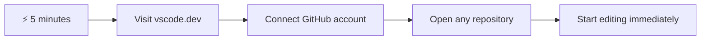
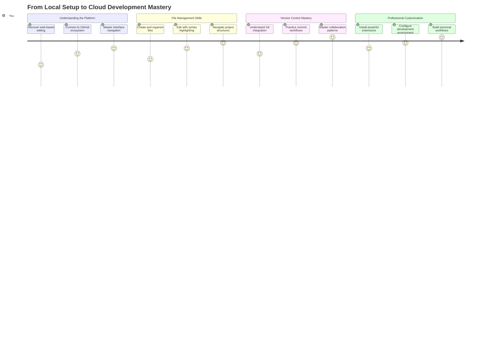
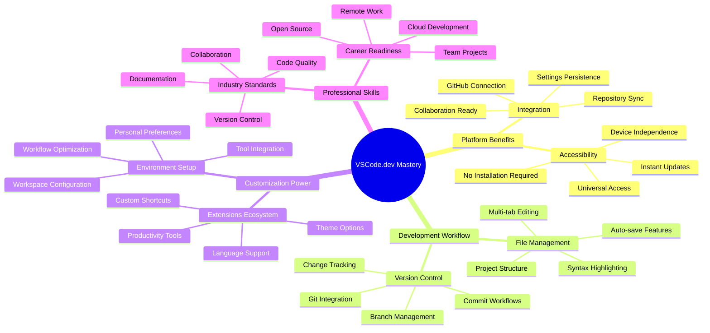
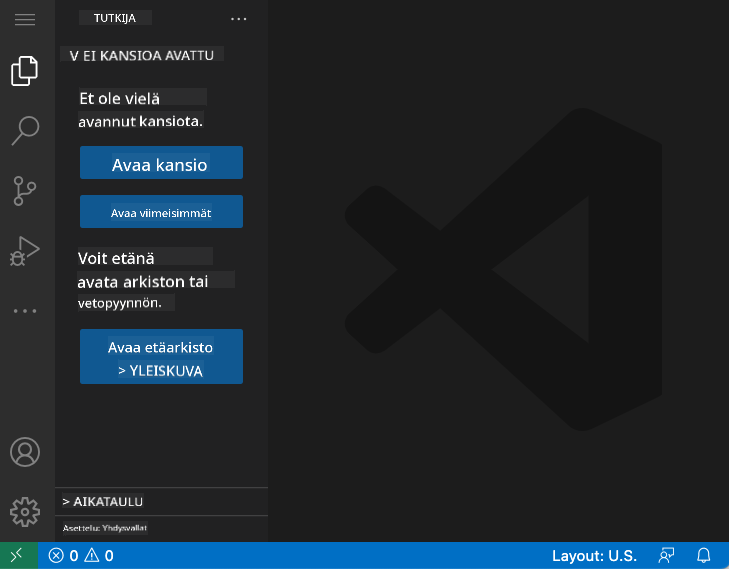
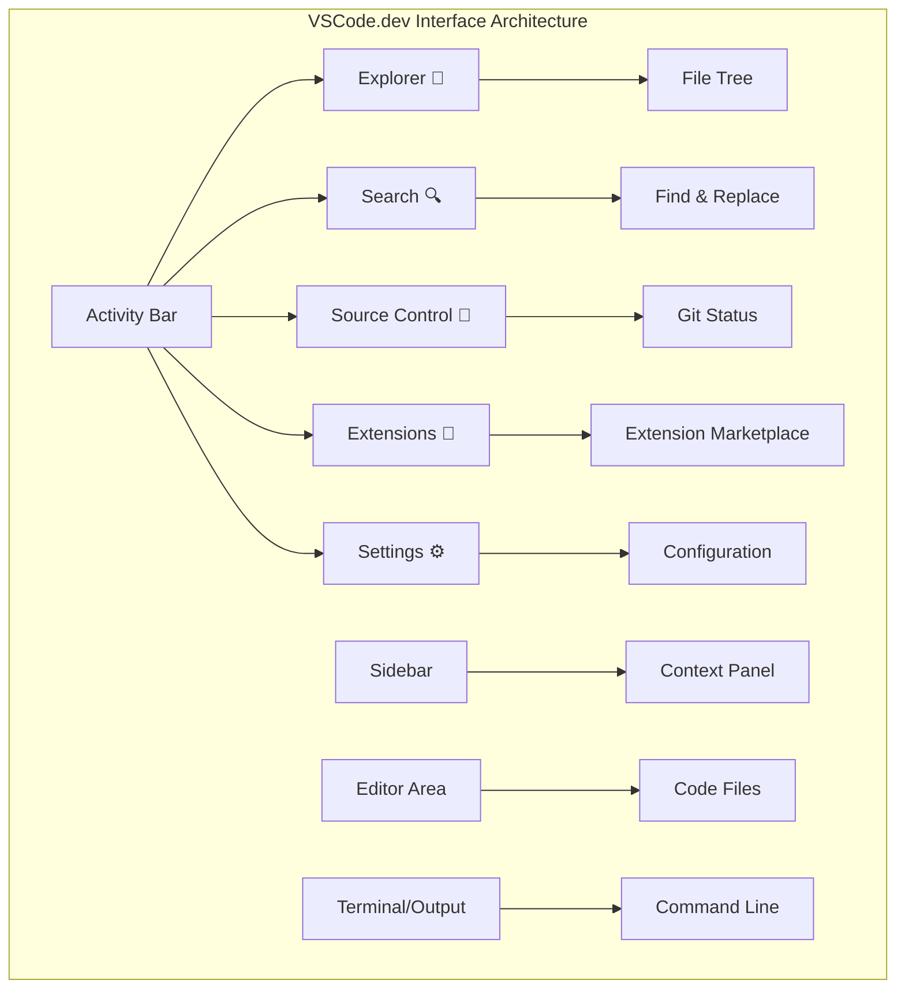
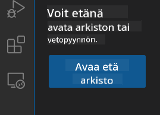
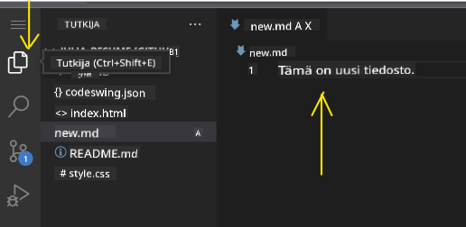
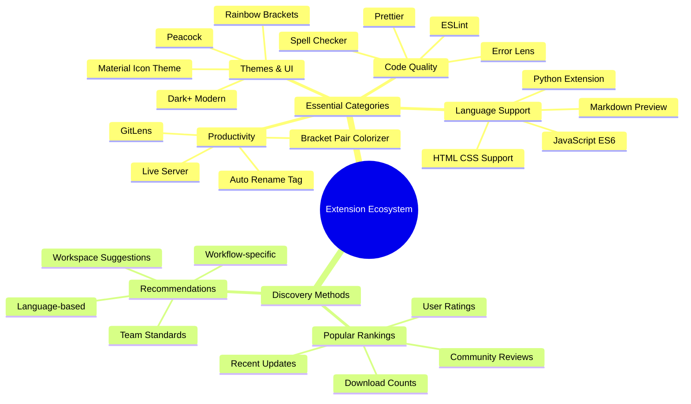
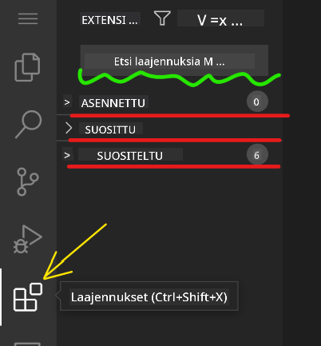
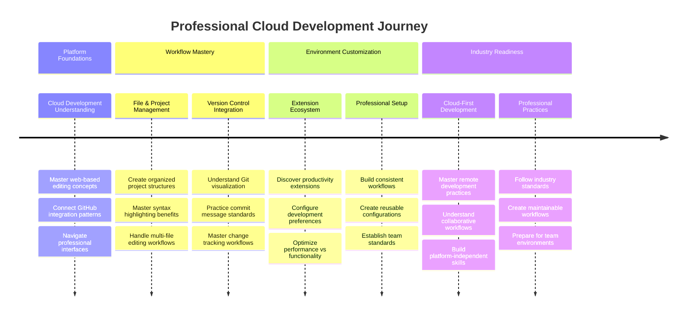

<!--
CO_OP_TRANSLATOR_METADATA:
{
  "original_hash": "a9a3bcc037a447e2d8994d99e871cd9f",
  "translation_date": "2025-11-04T01:13:38+00:00",
  "source_file": "8-code-editor/1-using-a-code-editor/README.md",
  "language_code": "fi"
}
-->
# Käyttämällä koodieditoria: Hallitse VSCode.dev

Muistatko *Matrixista*, kun Neo joutui kytkeytymään massiiviseen tietokoneeseen päästäkseen digitaaliseen maailmaan? Nykyajan web-kehitystyökalut kertovat aivan toisenlaisen tarinan – uskomattoman tehokkaat ominaisuudet ovat saatavilla mistä tahansa. VSCode.dev on selaimessa toimiva koodieditori, joka tuo ammattilaistason kehitystyökalut mihin tahansa laitteeseen, jossa on internetyhteys.

Aivan kuten kirjapainon keksiminen teki kirjoista kaikkien saatavilla olevia, ei vain luostarien kirjureiden, VSCode.dev demokratisoi koodaamisen. Voit työskennellä projekteissa kirjaston tietokoneella, koulun laboratoriossa tai missä tahansa, missä sinulla on pääsy selaimeen. Ei asennuksia, ei "tarvitsen juuri tietynlaisen asetuksen" rajoituksia.

Tämän oppitunnin lopussa ymmärrät, kuinka navigoida VSCode.devissä, avata GitHub-repositorioita suoraan selaimessa ja käyttää Git-versiohallintaa – kaikki taidot, joita ammattilaiskehittäjät käyttävät päivittäin.

## ⚡ Mitä voit tehdä seuraavan 5 minuutin aikana

**Nopea aloitus kiireisille kehittäjille**



- **Minuutti 1**: Siirry osoitteeseen [vscode.dev](https://vscode.dev) – ei asennusta tarvittu
- **Minuutti 2**: Kirjaudu sisään GitHubilla yhdistääksesi repositoriosi
- **Minuutti 3**: Kokeile URL-temppua: vaihda `github.com` muotoon `vscode.dev/github` missä tahansa repo-URL:ssa
- **Minuutti 4**: Luo uusi tiedosto ja katso, kuinka syntaksin korostus toimii automaattisesti
- **Minuutti 5**: Tee muutos ja commitoi se Source Control -paneelin kautta

**Nopea testaus-URL**:
```
# Transform this:
github.com/microsoft/Web-Dev-For-Beginners

# Into this:
vscode.dev/github/microsoft/Web-Dev-For-Beginners
```

**Miksi tämä on tärkeää**: Viidessä minuutissa koet vapauden koodata missä tahansa ammattilaistyökaluilla. Tämä edustaa kehityksen tulevaisuutta – saavutettavaa, tehokasta ja välitöntä.

## 🗺️ Oppimismatka pilvipohjaiseen kehitykseen



**Matkasi päämäärä**: Tämän oppitunnin lopussa hallitset ammattilaistason pilvikehitysympäristön, joka toimii millä tahansa laitteella, mahdollistaen koodaamisen samoilla työkaluilla, joita suurten teknologiayritysten kehittäjät käyttävät.

## Mitä opit

Kun käymme tämän läpi yhdessä, osaat:

- Navigoida VSCode.devissä kuin se olisi toinen kotisi – löytää kaiken tarvitsemasi eksymättä
- Avata minkä tahansa GitHub-repositorion selaimessa ja aloittaa muokkaamisen välittömästi (tämä on melko taianomaista!)
- Käyttää Gitiä muutosten seuraamiseen ja edistymisen tallentamiseen kuin ammattilainen
- Tehostaa editoriasi laajennuksilla, jotka tekevät koodaamisesta nopeampaa ja hauskempaa
- Luoda ja järjestää projektitiedostoja itsevarmasti

## Mitä tarvitset

Vaadittavat asiat ovat yksinkertaisia:

- Ilmainen [GitHub-tili](https://github.com) (autamme sinua luomaan sen tarvittaessa)
- Perustiedot verkkoselaimista
- GitHub Basics -oppitunti tarjoaa hyödyllistä taustatietoa, vaikka se ei olekaan välttämätön

> 💡 **Uusi GitHubissa?** Tilin luominen on ilmaista ja vie vain muutaman minuutin. Aivan kuten kirjastokortti antaa pääsyn kirjoihin ympäri maailmaa, GitHub-tili avaa ovet koodirepositorioihin internetissä.

## 🧠 Pilvikehityksen ekosysteemin yleiskatsaus



**Keskeinen periaate**: Pilvipohjaiset kehitysympäristöt edustavat koodaamisen tulevaisuutta – tarjoten ammattilaistason työkaluja, jotka ovat saavutettavia, yhteistyöhön perustuvia ja alustariippumattomia.

## Miksi verkkopohjaiset koodieditorit ovat tärkeitä

Ennen internetiä eri yliopistojen tutkijat eivät voineet helposti jakaa tutkimuksiaan. Sitten tuli ARPANET 1960-luvulla, yhdistäen tietokoneet etäisyyksien yli. Verkkopohjaiset koodieditorit noudattavat samaa periaatetta – tehden tehokkaat työkalut saavutettaviksi riippumatta fyysisestä sijainnistasi tai laitteestasi.

Koodieditori toimii kehitysympäristönäsi, jossa kirjoitat, muokkaat ja järjestät kooditiedostoja. Toisin kuin yksinkertaiset tekstieditorit, ammattilaistason koodieditorit tarjoavat syntaksin korostusta, virheiden tunnistusta ja projektinhallintaominaisuuksia.

VSCode.dev tuo nämä ominaisuudet selaimeesi:

**Verkkopohjaisen muokkauksen edut:**

| Ominaisuus | Kuvaus | Käytännön hyöty |
|------------|--------|----------------|
| **Alustariippumattomuus** | Toimii millä tahansa laitteella, jossa on selain | Työskentele saumattomasti eri tietokoneilla |
| **Ei asennusta tarvittu** | Käyttö verkkosivun kautta | Ohita ohjelmiston asennusrajoitukset |
| **Automaattiset päivitykset** | Käyttää aina uusinta versiota | Pääsy uusiin ominaisuuksiin ilman manuaalisia päivityksiä |
| **Repositorion integrointi** | Suora yhteys GitHubiin | Muokkaa koodia ilman paikallista tiedostonhallintaa |

**Käytännön vaikutukset:**
- Työn jatkuvuus eri ympäristöissä
- Yhtenäinen käyttöliittymä käyttöjärjestelmästä riippumatta
- Välittömät yhteistyömahdollisuudet
- Vähentyneet paikallisen tallennuksen vaatimukset

## VSCode.dev:n tutkiminen

Aivan kuten Marie Curien laboratorio sisälsi hienostuneita laitteita yksinkertaisessa tilassa, VSCode.dev pakkaa ammattilaistason kehitystyökalut selaimen käyttöliittymään. Tämä verkkosovellus tarjoaa samat keskeiset toiminnot kuin työpöydän koodieditorit.

Aloita siirtymällä selaimessasi osoitteeseen [vscode.dev](https://vscode.dev). Käyttöliittymä latautuu ilman latauksia tai järjestelmäasennuksia – suora sovellus pilvilaskennan periaatteista.

### GitHub-tilin yhdistäminen

Aivan kuten Alexander Graham Bellin puhelin yhdisti etäisiä paikkoja, GitHub-tilisi yhdistäminen luo sillan VSCode.dev:n ja koodirepositorioidesi välille. Kun sinua kehotetaan kirjautumaan sisään GitHubilla, tämän yhteyden hyväksyminen on suositeltavaa.

**GitHub-integraatio tarjoaa:**
- Suoran pääsyn repositorioihisi editorin sisällä
- Synkronoidut asetukset ja laajennukset eri laitteilla
- Tehostetun tallennustyönkulun GitHubiin
- Personoidun kehitysympäristön

### Tutustu uuteen työtilaasi

Kun kaikki on latautunut, näet kauniin ja selkeän työtilan, joka on suunniteltu pitämään sinut keskittyneenä siihen, mikä on tärkeää – koodisi!



**Tässä on kierros naapurustossa:**
- **Toimintopalkki** (vasemmalla oleva kaistale): Päänavigointisi, jossa on Explorer 📁, Search 🔍, Source Control 🌿, Extensions 🧩 ja Settings ⚙️
- **Sivupalkki** (sen vieressä oleva paneeli): Näyttää asiaankuuluvaa tietoa valintasi perusteella
- **Editorialue** (keskellä oleva iso tila): Täällä tapahtuu taikuus – pääkoodausalueesi

**Ota hetki tutkiaksesi:**
- Klikkaa toimintopalkin kuvakkeita ja katso, mitä kukin tekee
- Huomaa, kuinka sivupalkki päivittyy näyttämään erilaista tietoa – aika siistiä, eikö?
- Explorer-näkymä (📁) on todennäköisesti paikka, jossa vietät suurimman osan ajastasi, joten tutustu siihen kunnolla



## GitHub-repositorion avaaminen

Ennen internetiä tutkijoiden piti fyysisesti matkustaa kirjastoihin päästäkseen käsiksi dokumentteihin. GitHub-repositoriot toimivat samalla tavalla – ne ovat etänä tallennettuja koodikokoelmia. VSCode.dev poistaa perinteisen vaiheen, jossa repositoriot ladataan paikalliselle koneelle ennen muokkaamista.

Tämä ominaisuus mahdollistaa välittömän pääsyn mihin tahansa julkiseen repositorioon katselua, muokkaamista tai osallistumista varten. Tässä on kaksi tapaa avata repositorioita:

### Menetelmä 1: Klikkaus ja valinta

Tämä on täydellinen, kun aloitat VSCode.devissä ja haluat avata tietyn repositorion. Se on yksinkertainen ja aloittelijaystävällinen:

**Näin teet sen:**

1. Siirry osoitteeseen [vscode.dev](https://vscode.dev), jos et ole jo siellä
2. Etsi "Open Remote Repository" -painike aloitusnäytöltä ja klikkaa sitä

   

3. Liitä mikä tahansa GitHub-repositorion URL (kokeile tätä: `https://github.com/microsoft/Web-Dev-For-Beginners`)
4. Paina Enter ja katso, kuinka taikuus tapahtuu!

**Vinkki - Komentopalettin pikakuvake:**

Haluatko tuntea itsesi koodausvelhoksi? Kokeile tätä näppäinyhdistelmää: Ctrl+Shift+P (tai Cmd+Shift+P Macilla) avataksesi komentopalettin:


**Komentopaletti on kuin hakukone kaikelle, mitä voit tehdä:**
- Kirjoita "open remote", ja se löytää repositorion avaajan puolestasi
- Se muistaa äskettäin avaamasi repositoriot (todella kätevää!)
- Kun totut siihen, tunnet koodaavasi salamannopeasti
- Se on käytännössä VSCode.dev:n versio "Hei Siri, mutta koodaamiseen"

### Menetelmä 2: URL-muokkaustekniikka

Aivan kuten HTTP ja HTTPS käyttävät eri protokollia säilyttäen saman domain-rakenteen, VSCode.dev käyttää URL-mallia, joka heijastaa GitHubin osoitejärjestelmää. Mikä tahansa GitHub-repositorion URL voidaan muokata avautumaan suoraan VSCode.devissä.

**URL-muunnosmalli:**

| Repositorion tyyppi | GitHub-URL | VSCode.dev-URL |
|---------------------|------------|----------------|
| **Julkinen repositorio** | `github.com/microsoft/Web-Dev-For-Beginners` | `vscode.dev/github/microsoft/Web-Dev-For-Beginners` |
| **Henkilökohtainen projekti** | `github.com/your-username/my-project` | `vscode.dev/github/your-username/my-project` |
| **Mikä tahansa saavutettava repo** | `github.com/their-username/awesome-repo` | `vscode.dev/github/their-username/awesome-repo` |

**Toteutus:**
- Korvaa `github.com` muotoon `vscode.dev/github`
- Säilytä kaikki muut URL-komponentit ennallaan
- Toimii minkä tahansa julkisesti saavutettavan repositorion kanssa
- Tarjoaa välittömän muokkauspääsyn

> 💡 **Elämää muuttava vinkki**: Tallenna suosikkirepositorioidesi VSCode.dev-versiot kirjanmerkkeihin. Minulla on kirjanmerkkejä kuten "Muokkaa portfoliotani" ja "Korjaa dokumentaatio", jotka vievät minut suoraan muokkaustilaan!

**Mikä menetelmä kannattaa valita?**
- **Käyttöliittymämenetelmä**: Loistava, kun tutkit tai et muista tarkkoja repositorion nimiä
- **URL-temppu**: Täydellinen salamannopeaan pääsyyn, kun tiedät tarkalleen, minne olet menossa

### 🎯 Pedagoginen tarkistus: Pilvikehityksen käyttö

**Pysähdy ja pohdi**: Olet juuri oppinut kaksi tapaa päästä koodirepositorioihin verkkoselaimen kautta. Tämä edustaa perustavanlaatuista muutosta kehityksen toimintatavoissa.

**Nopea itsearviointi**:
- Voitko selittää, miksi verkkopohjainen muokkaus poistaa perinteisen "kehitysympäristön asennuksen"?
- Mitä etuja URL-muokkaustekniikka tarjoaa verrattuna paikalliseen git-klonaukseen?
- Kuinka tämä lähestymistapa muuttaa tapaa, jolla voisit osallistua avoimen lähdekoodin projekteihin?

**Yhteys tosielämään**: Suuret yritykset kuten GitHub, GitLab ja Replit ovat rakentaneet kehitysalustansa näiden pilvipohjaisten periaatteiden ympärille. Opit samoja työnkulkuja, joita ammattilaiskehitystiimit käyttävät maailmanlaajuisesti.

**Haastekysymys**: Kuinka pilvipohjainen kehitys voisi muuttaa tapaa, jolla koodausta opetetaan kouluissa? Mieti laitevaatimuksia, ohjelmiston hallintaa ja yhteistyömahdollisuuksia.

## Työskentely tiedostojen ja projektien kanssa

Nyt kun olet avannut repositorion, aloitetaan rakentaminen! VSCode.dev tarjoaa kaiken, mitä tarvitset kooditiedostojen luomiseen, muokkaamiseen ja järjestämiseen. Ajattele sitä digitaalisena työpajanasi – jokainen työkalu on juuri siellä, missä tarvitset.

Sukelletaan päivittäisiin tehtäviin, jotka muodostavat suurimman osan koodausprosessistasi.

### Uusien tiedostojen luominen

Aivan kuten arkkitehdin toimistossa piirustusten järjestäminen, tiedostojen luominen VSCode.devissä noudattaa jäsenneltyä lähestymistapaa. Järjestelmä tukee kaikkia standardeja web-kehityksen tiedostotyyppejä.

**Tiedoston luomisprosessi:**

1. Siirry kohdekansioon Explorer-sivupalkissa
2. Vie hiiri kansion nimen päälle, jolloin "New File" -kuvake (📄+) tulee näkyviin
3. Syötä tiedoston nimi, mukaan lukien oikea tiedostopääte (`style.css`, `script.js`, `index.html`)
4. Paina Enter luodaksesi tiedoston


**Nimeämiskäytännöt:**
- Käytä kuvailevia nimiä, jotka kertovat tiedoston tarkoituksen
- Sisällytä tiedostopäätteet oikean syntaksin korostuksen varmistamiseksi
- Noudata johdonmukaisia nimeämismalleja projektien läpi
- Käytä pieniä kirjaimia ja väliviivoja välilyöntien sijaan

### Tiedostojen muokkaaminen ja tallentaminen

Tässä alkaa todellinen hauskuus! VSCode.dev:n editori on täynnä hyödyllisiä ominaisuuksia, jotka tekevät koodaamisesta sujuvaa ja intuitiivista. Se on kuin todella älykäs kirjoitusavustaja, mutta koodille.

**Muokkaustyönkulku:**

1. Klikkaa mitä tahansa tiedostoa Explorerissa avataksesi sen pääalueelle
2. Aloita kirjoittaminen ja katso, kuinka VSCode.dev auttaa sinua väreillä, ehdotuksilla ja virheiden tunnistamisella
3. Tallenna työsi Ctrl+S (Windows/Linux) tai Cmd+S (Mac) – vaikka se tallentaa automaattisesti!



**Siistit jutut, jotka tapahtuvat koodatessasi:**
- Koodisi saa kauniin värikoodauksen, joten sitä on helppo lukea
- VSCode.dev ehdottaa täydennyksiä kirjoittaessasi (kuten automaattinen korjaus, mutta paljon älykkäämpi)
- Se havaitsee kirjoitusvirheet ja virheet ennen kuin edes tallennat
- Voit pitää useita tiedostoja auki välilehdissä, aivan kuten selaimessa
- Kaikki tallentuu automaattisesti taustalla

> ⚠️ **Nopea vinkki**: Vaikka automaattinen tallennus on tukenasi, Ctrl+S tai Cmd+S painaminen on silti hyvä tapa. Se tallentaa
- Tarkista huolellisesti, että olet tyytyväinen kaikkiin vaiheessa oleviin muutoksiisi
- Kirjoita lyhyt viesti, jossa selität, mitä teit (tämä on "commit-viestisi")
- Klikkaa valintamerkkipainiketta tallentaaksesi kaiken GitHubiin
- Jos muutat mielesi jostain, kumoamiskuvake antaa sinun hylätä muutokset

**Hyvien commit-viestien kirjoittaminen (helpompaa kuin luulet!):**
- Kuvaile vain, mitä teit, kuten "Lisää yhteydenottolomake" tai "Korjaa rikkinäinen navigaatio"
- Pidä se lyhyenä ja ytimekkäänä – ajattele twiitin pituutta, ei esseetä
- Aloita toimintaverbeillä kuten "Lisää", "Korjaa", "Päivitä" tai "Poista"
- **Hyviä esimerkkejä**: "Lisää responsiivinen navigointivalikko", "Korjaa mobiiliasettelun ongelmat", "Päivitä värit paremman saavutettavuuden vuoksi"

> 💡 **Nopea navigointivinkki**: Käytä hampurilaisvalikkoa (☰) vasemmassa yläkulmassa palataksesi GitHub-repositorioon ja nähdäksesi tallennetut muutokset verkossa. Se on kuin portaali muokkausympäristösi ja projektisi kotisivun välillä GitHubissa!

## Toiminnallisuuden parantaminen laajennuksilla

Aivan kuten käsityöläisen työpajassa on erikoistyökaluja eri tehtäviin, VSCode.dev voidaan räätälöidä laajennuksilla, jotka lisäävät tiettyjä ominaisuuksia. Nämä yhteisön kehittämät lisäosat vastaavat yleisiin kehitystarpeisiin, kuten koodin muotoiluun, reaaliaikaiseen esikatseluun ja parannettuun Git-integraatioon.

Laajennusmarkkinapaikka sisältää tuhansia ilmaisia työkaluja, jotka kehittäjät ympäri maailmaa ovat luoneet. Jokainen laajennus ratkaisee tiettyjä työnkulun haasteita, jolloin voit rakentaa henkilökohtaisen kehitysympäristön, joka sopii juuri sinun tarpeisiisi ja mieltymyksiisi.



### Täydellisten laajennusten löytäminen

Laajennusmarkkinapaikka on todella hyvin järjestetty, joten et eksy etsiessäsi tarvitsemaasi. Se on suunniteltu auttamaan sinua löytämään sekä tiettyjä työkaluja että siistejä juttuja, joista et edes tiennyt.

**Pääsy markkinapaikalle:**

1. Klikkaa Laajennukset-kuvaketta (🧩) Aktiviteettipalkissa
2. Selaa tai etsi jotain tiettyä
3. Klikkaa mitä tahansa kiinnostavaa saadaksesi lisätietoja



**Mitä siellä näet:**

| Osio | Sisältö | Miksi hyödyllinen |
|----------|---------|----------|
| **Asennetut** | Laajennukset, jotka olet jo lisännyt | Henkilökohtainen koodityökalupakkisi |
| **Suosituimmat** | Yleisön suosikit | Mitä useimmat kehittäjät vannovat |
| **Suositellut** | Älykkäät ehdotukset projektiisi | VSCode.dev:n hyödylliset suositukset |

**Mikä tekee selaamisesta helppoa:**
- Jokainen laajennus näyttää arviot, latausmäärät ja oikeiden käyttäjien arvostelut
- Näet kuvakaappauksia ja selkeitä kuvauksia siitä, mitä kukin tekee
- Kaikki on selkeästi merkitty yhteensopivuustiedoilla
- Samankaltaisia laajennuksia ehdotetaan, jotta voit vertailla vaihtoehtoja

### Laajennusten asentaminen (superhelppoa!)

Uusien ominaisuuksien lisääminen editoriisi on yhtä helppoa kuin painikkeen klikkaaminen. Laajennukset asentuvat sekunneissa ja alkavat toimia heti – ei uudelleenkäynnistyksiä, ei odottelua.

**Näin se tehdään:**

1. Etsi mitä haluat (kokeile etsiä "live server" tai "prettier")
2. Klikkaa kiinnostavaa laajennusta saadaksesi lisätietoja
3. Lue, mitä se tekee, ja tarkista arviot
4. Paina sinistä "Asenna"-painiketta ja olet valmis!


**Mitä tapahtuu kulissien takana:**
- Laajennus lataa itsensä ja asettuu automaattisesti
- Uudet ominaisuudet ilmestyvät käyttöliittymääsi heti
- Kaikki alkaa toimia välittömästi (oikeasti, se on niin nopeaa!)
- Jos olet kirjautunut sisään, laajennus synkronoituu kaikille laitteillesi

**Suositeltuja laajennuksia aloitukseen:**
- **Live Server**: Näe verkkosivustosi päivittyvän reaaliajassa koodatessasi (tämä on taianomaista!)
- **Prettier**: Saa koodisi näyttämään siistiltä ja ammattimaiselta automaattisesti
- **Auto Rename Tag**: Muuta yhtä HTML-tägiä, ja sen pari päivittyy myös
- **Bracket Pair Colorizer**: Värittää hakasulkeet, jotta et eksy
- **GitLens**: Tehostaa Git-ominaisuuksia monilla hyödyllisillä tiedoilla

### Laajennusten räätälöinti

Useimmissa laajennuksissa on asetuksia, joita voit säätää, jotta ne toimivat juuri haluamallasi tavalla. Ajattele sitä kuin auton istuimen ja peilien säätämistä – jokaisella on omat mieltymyksensä!

**Laajennusasetusten säätäminen:**

1. Etsi asennettu laajennus Laajennukset-paneelista
2. Etsi pieni rataskuvake (⚙️) sen nimen vierestä ja klikkaa sitä
3. Valitse "Laajennuksen asetukset" pudotusvalikosta
4. Säädä asetuksia, kunnes ne tuntuvat sopivilta työnkulullesi


**Yleisiä asioita, joita saatat haluta säätää:**
- Miten koodisi muotoillaan (välilehdet vs välilyönnit, rivin pituus jne.)
- Mitkä pikanäppäimet käynnistävät eri toiminnot
- Mitä tiedostotyyppejä laajennuksen tulisi käsitellä
- Tiettyjen ominaisuuksien päälle/pois kytkeminen siisteyden säilyttämiseksi

### Laajennusten järjestyksen ylläpitäminen

Kun löydät lisää siistejä laajennuksia, haluat pitää kokoelmasi siistinä ja toimivana. VSCode.dev tekee tämän todella helpoksi hallita.

**Laajennusten hallintavaihtoehdot:**

| Mitä voit tehdä | Milloin hyödyllistä | Vinkki |
|--------|---------|----------|
| **Poista käytöstä** | Testatessa, aiheuttaako laajennus ongelmia | Parempi kuin poistaa, jos haluat sen takaisin |
| **Poista** | Poista kokonaan laajennukset, joita et tarvitse | Pitää ympäristön siistinä ja nopeana |
| **Päivitä** | Hanki uusimmat ominaisuudet ja virheenkorjaukset | Tapahtuu yleensä automaattisesti, mutta kannattaa tarkistaa |

**Miten itse hallitsen laajennuksia:**
- Muutaman kuukauden välein tarkistan, mitä olen asentanut, ja poistan kaiken, mitä en käytä
- Pidän laajennukset päivitettyinä, jotta saan uusimmat parannukset ja tietoturvakorjaukset
- Jos jokin tuntuu hitaalta, poistan laajennukset väliaikaisesti käytöstä nähdäkseni, onko jokin niistä syyllinen
- Luen päivitysmerkinnät, kun laajennukset saavat suuria päivityksiä – joskus niissä on siistejä uusia ominaisuuksia!

> ⚠️ **Suorituskykyvinkki**: Laajennukset ovat mahtavia, mutta liian monen käyttäminen voi hidastaa asioita. Keskity niihin, jotka todella helpottavat elämääsi, äläkä pelkää poistaa niitä, joita et koskaan käytä.

### 🎯 Pedagoginen tarkistus: Kehitysympäristön räätälöinti

**Arkkitehtuurin ymmärtäminen**: Olet oppinut räätälöimään ammattimaisen kehitysympäristön yhteisön luomien laajennusten avulla. Tämä heijastaa, miten yritysten kehitystiimit rakentavat standardoituja työkaluketjuja.

**Keskeiset opitut käsitteet**:
- **Laajennusten löytäminen**: Työkalujen löytäminen, jotka ratkaisevat tiettyjä kehityshaasteita
- **Ympäristön konfigurointi**: Työkalujen räätälöinti henkilökohtaisiin tai tiimin mieltymyksiin
- **Suorituskyvyn optimointi**: Toiminnallisuuden ja järjestelmän suorituskyvyn tasapainottaminen
- **Yhteisön yhteistyö**: Työkalujen hyödyntäminen, jotka globaali kehittäjäyhteisö on luonut

**Yhteys teollisuuteen**: Laajennusekosysteemit tukevat suuria kehitysalustoja kuten VS Code, Chrome DevTools ja modernit IDE:t. Laajennusten arvioinnin, asentamisen ja konfiguroinnin ymmärtäminen on olennaista ammatillisissa kehitystyönkulkuissa.

**Pohdintakysymys**: Miten lähestyisit standardoidun kehitysympäristön luomista 10 kehittäjän tiimille? Mieti johdonmukaisuutta, suorituskykyä ja yksilöllisiä mieltymyksiä.

## 📈 Pilvipohjaisen kehityksen hallinnan aikajana



**🎓 Valmistumisen virstanpylväs**: Olet onnistuneesti hallinnut pilvipohjaisen kehityksen käyttäen samoja työkaluja ja työnkulkuja, joita ammattikehittäjät suurissa teknologiayrityksissä käyttävät. Nämä taidot edustavat ohjelmistokehityksen tulevaisuutta.

**🔄 Seuraavan tason kyvyt**:
- Valmis tutkimaan edistyneitä pilvipohjaisia kehitysalustoja (Codespaces, GitPod)
- Valmis työskentelemään hajautetuissa kehitystiimeissä
- Valmius osallistua avoimen lähdekoodin projekteihin maailmanlaajuisesti
- Perusta modernille DevOpsille ja jatkuvan integraation käytännöille

## GitHub Copilot Agent -haaste 🚀

Kuten NASA:n järjestelmällinen lähestymistapa avaruuslentoihin, tämä haaste sisältää VSCode.dev-taitojen systemaattisen soveltamisen täydellisessä työnkulun skenaariossa.

**Tavoite:** Osoita osaamisesi VSCode.dev:n avulla luomalla kattava verkkokehityksen työnkulku.

**Projektivaatimukset:** Käytä Agent-tilan apua ja suorita seuraavat tehtävät:
1. Haarauta olemassa oleva repositorio tai luo uusi
2. Luo toimiva projektirakenne HTML-, CSS- ja JavaScript-tiedostoilla
3. Asenna ja konfiguroi kolme kehitystä parantavaa laajennusta
4. Harjoittele versionhallintaa kuvaavilla commit-viesteillä
5. Kokeile ominaisuushaaran luomista ja muokkaamista
6. Dokumentoi prosessi ja opit README.md-tiedostoon

Tämä harjoitus yhdistää kaikki VSCode.dev-konseptit käytännön työnkulkuun, jota voidaan soveltaa tulevissa kehitysprojekteissa.

Lisätietoja [agent-tilasta](https://code.visualstudio.com/blogs/2025/02/24/introducing-copilot-agent-mode) täällä.

## Tehtävä

Aika testata nämä taidot käytännössä! Minulla on sinulle käytännön projekti, jonka avulla voit harjoitella kaikkea, mitä olemme käsitelleet: [Luo ansioluettelosivusto käyttäen VSCode.dev](./assignment.md)

Tämä tehtävä opastaa sinut rakentamaan ammattimaisen ansioluettelosivuston kokonaan selaimessasi. Käytät kaikkia VSCode.dev:n ominaisuuksia, joita olemme tutkineet, ja lopuksi sinulla on sekä upean näköinen verkkosivusto että vankka luottamus uuteen työnkulkuusi.

## Jatka tutkimista ja taitojesi kehittämistä

Sinulla on nyt vahva perusta, mutta paljon enemmän siistejä juttuja on vielä löydettävissä! Tässä joitain resursseja ja ideoita VSCode.dev-taitojesi viemiseksi seuraavalle tasolle:

**Viralliset dokumentit, jotka kannattaa tallentaa kirjanmerkkeihin:**
- [VSCode Web Documentation](https://code.visualstudio.com/docs/editor/vscode-web?WT.mc_id=academic-0000-alfredodeza) – Täydellinen opas selaimen kautta tapahtuvaan muokkaukseen
- [GitHub Codespaces](https://docs.github.com/en/codespaces) – Kun haluat vielä enemmän voimaa pilvessä

**Siistejä ominaisuuksia, joita kokeilla seuraavaksi:**
- **Pikanäppäimet**: Opettele näppäinyhdistelmät, jotka saavat sinut tuntemaan itsesi koodausninjaksi
- **Työtilan asetukset**: Luo erilaisia ympäristöjä eri projektityypeille
- **Monijuuriset työtilat**: Työskentele useiden repositorioiden kanssa samanaikaisesti (superkätevää!)
- **Päätteiden integrointi**: Käytä komentorivityökaluja suoraan selaimessasi

**Ideoita harjoitteluun:**
- Hyppää avoimen lähdekoodin projekteihin ja osallistu käyttäen VSCode.dev:ia – loistava tapa antaa takaisin!
- Kokeile erilaisia laajennuksia löytääksesi täydellisen kokoonpanosi
- Luo projektipohjia niille sivustotyypeille, joita rakennat useimmiten
- Harjoittele Git-työnkulkuja, kuten haaroittamista ja yhdistämistä – nämä taidot ovat kultaa tiimiprojekteissa

---

**Olet hallinnut selaimen kautta tapahtuvan kehityksen!** 🎉 Aivan kuten kannettavien instrumenttien keksiminen mahdollisti tutkimuksen tekemisen syrjäisillä alueilla, VSCode.dev mahdollistaa ammattimaisen koodauksen mistä tahansa internet-yhteydellä varustetusta laitteesta.

Nämä taidot heijastavat nykyisiä teollisuuden käytäntöjä – monet ammattikehittäjät käyttävät pilvipohjaisia kehitysympäristöjä niiden joustavuuden ja saavutettavuuden vuoksi. Olet oppinut työnkulun, joka skaalautuu yksittäisistä projekteista suuriin tiimiyhteistyöihin.

Sovella näitä tekniikoita seuraavaan kehitysprojektiisi! 🚀

---

**Vastuuvapauslauseke**:  
Tämä asiakirja on käännetty käyttämällä tekoälypohjaista käännöspalvelua [Co-op Translator](https://github.com/Azure/co-op-translator). Vaikka pyrimme tarkkuuteen, huomioithan, että automaattiset käännökset voivat sisältää virheitä tai epätarkkuuksia. Alkuperäinen asiakirja sen alkuperäisellä kielellä tulisi pitää ensisijaisena lähteenä. Kriittisen tiedon osalta suositellaan ammattimaista ihmiskäännöstä. Emme ole vastuussa tämän käännöksen käytöstä johtuvista väärinkäsityksistä tai virhetulkinnoista.