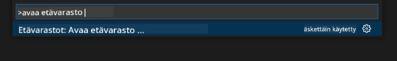
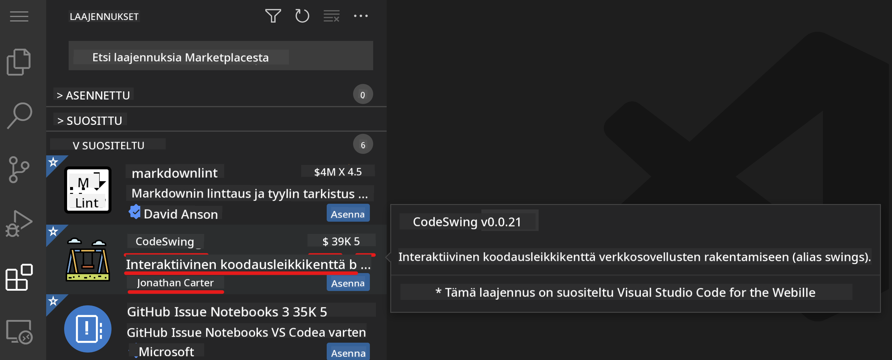
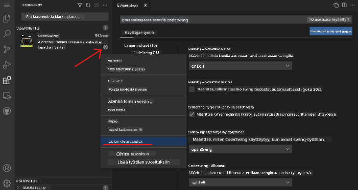

<!--
CO_OP_TRANSLATOR_METADATA:
{
  "original_hash": "1ba61d96a11309a2a6ea507496dcf7e5",
  "translation_date": "2025-08-29T00:46:19+00:00",
  "source_file": "8-code-editor/1-using-a-code-editor/README.md",
  "language_code": "fi"
}
-->
# Koodieditorin käyttö

Tässä oppitunnissa käsitellään [VSCode.dev](https://vscode.dev)-verkkopohjaisen koodieditorin perusteita, jotta voit tehdä muutoksia koodiisi ja osallistua projekteihin asentamatta mitään tietokoneellesi.

## Oppimistavoitteet

Tässä oppitunnissa opit:

- Käyttämään koodieditoria koodiprojektissa
- Seuraamaan muutoksia versionhallinnan avulla
- Mukauttamaan editoria kehitystyötä varten

### Esitiedot

Ennen kuin aloitat, sinun täytyy luoda tili [GitHubiin](https://github.com). Siirry [GitHubiin](https://github.com/) ja luo tili, jos sinulla ei vielä ole sellaista.

### Johdanto

Koodieditori on olennainen työkalu ohjelmien kirjoittamiseen ja yhteistyöhön olemassa olevien koodiprojektien parissa. Kun ymmärrät editorin perusteet ja osaat hyödyntää sen ominaisuuksia, voit soveltaa niitä koodin kirjoittamisessa.

## Aloittaminen VSCode.devillä

[VSCode.dev](https://vscode.dev) on verkkopohjainen koodieditori. Sen käyttö ei vaadi mitään asennuksia, aivan kuten minkä tahansa verkkosivun avaaminen. Aloittaaksesi editorin käytön, avaa seuraava linkki: [https://vscode.dev](https://vscode.dev). Jos et ole kirjautunut [GitHubiin](https://github.com/), seuraa ohjeita kirjautuaksesi sisään tai luodaksesi uuden tilin ja kirjaudu sitten sisään.

Kun editori latautuu, sen pitäisi näyttää tältä:


Editorissa on kolme pääosaa, vasemmalta oikealle:

1. _Toimintopalkki_ (activity bar), jossa on joitakin kuvakkeita, kuten suurennuslasi 🔎, hammasratas ⚙️ ja muita.
2. Laajennettu toimintopalkki, joka oletuksena näyttää _Resurssienhallinnan_ (Explorer) ja jota kutsutaan _sivupalkiksi_ (side bar).
3. Koodialue oikealla, jossa varsinainen koodin kirjoittaminen ja tarkastelu tapahtuu.

Klikkaa kutakin kuvaketta nähdäksesi eri valikot. Kun olet valmis, palaa _Resurssienhallintaan_ (Explorer), jotta olet takaisin aloitusnäkymässä.

Kun alat luoda tai muokata koodia, se tapahtuu oikeanpuoleisimmassa, suurimmassa alueessa. Käytät tätä aluetta myös tarkastellaksesi olemassa olevaa koodia, kuten seuraavaksi teet.

## GitHub-repositorion avaaminen

Ensimmäinen askel on avata GitHub-repositorio. Repositorion avaamiseen on useita tapoja. Tässä osiossa näet kaksi eri tapaa, joilla voit avata repositorion ja aloittaa muutosten tekemisen.

### 1. Editorin kautta

Käytä editoria avataksesi etärepositorio. Kun siirryt [VSCode.dev](https://vscode.dev)-sivustolle, näet _"Open Remote Repository"_ -painikkeen:


Voit myös käyttää komentopalettia. Komentopaletti on syöttökenttä, johon voit kirjoittaa minkä tahansa komennon tai toiminnon löytääksesi oikean komennon suoritettavaksi. Käytä vasemman yläkulman valikkoa, valitse _View_ ja sitten _Command Palette_, tai käytä seuraavaa pikanäppäintä: Ctrl-Shift-P (MacOS:lla Command-Shift-P).



Kun valikko avautuu, kirjoita _open remote repository_ ja valitse ensimmäinen vaihtoehto. Näet useita repositorioita, joihin kuulut tai jotka olet avannut äskettäin. Voit myös käyttää täydellistä GitHub-URL-osoitetta valitaksesi yhden. Käytä seuraavaa URL-osoitetta ja liitä se kenttään:

```
https://github.com/microsoft/Web-Dev-For-Beginners
```

✅ Jos onnistut, näet kaikki tämän repositorion tiedostot ladattuna tekstieditoriin.

### 2. URL-osoitteen avulla

Voit myös käyttää suoraan URL-osoitetta ladataksesi repositorion. Esimerkiksi tämänhetkisen repositorion täydellinen URL-osoite on [https://github.com/microsoft/Web-Dev-For-Beginners](https://github.com/microsoft/Web-Dev-For-Beginners), mutta voit vaihtaa GitHub-verkkotunnuksen `VSCode.dev/github`-muotoon ja ladata repositorion suoraan. Tuloksena oleva URL-osoite olisi [https://vscode.dev/github/microsoft/Web-Dev-For-Beginners](https://vscode.dev/github/microsoft/Web-Dev-For-Beginners).

## Tiedostojen muokkaaminen

Kun olet avannut repositorion selaimessa/vscode.devissä, seuraava askel on tehdä päivityksiä tai muutoksia projektiin.

### 1. Uuden tiedoston luominen

Voit luoda tiedoston joko olemassa olevan kansion sisälle tai juurihakemistoon. Luodaksesi uuden tiedoston, avaa sijainti/hakemisto, johon haluat tallentaa tiedoston, ja valitse toimintopalkista _'New file ...'_ -kuvake, anna tiedostolle nimi ja paina Enter.


### 2. Tiedoston muokkaaminen ja tallentaminen repositorioon

VSCode.dev on hyödyllinen, kun haluat tehdä nopeita päivityksiä projektiisi ilman, että sinun tarvitsee ladata mitään ohjelmistoa paikallisesti. Päivittääksesi koodiasi, klikkaa toimintopalkissa olevaa _Resurssienhallinta_-kuvaketta nähdäksesi repositorion tiedostot ja kansiot. Valitse tiedosto avataksesi sen koodialueelle, tee muutokset ja tallenna.


Kun olet tehnyt päivitykset projektiisi, valitse _`lähdekontrolli`_-kuvake, joka sisältää kaikki tekemäsi muutokset repositorioon.

Tarkastellaksesi tekemiäsi muutoksia, valitse tiedosto(t) `Changes`-kansiosta laajennetussa toimintopalkissa. Tämä avaa 'Working Tree' -näkymän, jossa voit visuaalisesti nähdä tiedostoon tekemäsi muutokset. Punainen väri osoittaa poistettuja osia, kun taas vihreä väri osoittaa lisäyksiä.


Jos olet tyytyväinen tekemiisi muutoksiin, vie hiiri `Changes`-kansion päälle ja klikkaa `+`-painiketta lisätäksesi muutokset vaiheeseen. Vaiheistus tarkoittaa muutosten valmistelua niiden sitomista varten GitHubiin.

Jos taas et ole tyytyväinen joihinkin muutoksiin ja haluat peruuttaa ne, vie hiiri `Changes`-kansion päälle ja valitse `undo`-kuvake.

Kirjoita sitten `commit message` _(kuvaus tekemästäsi muutoksesta projektiin)_, klikkaa `check`-kuvaketta sitouttaaksesi ja lähettääksesi muutokset.

Kun olet valmis projektisi kanssa, valitse vasemman yläkulman `hampurilaisvalikko`-kuvake palataksesi repositorioon github.comissa.


## Laajennusten käyttö

Laajennusten asentaminen VSCodeen mahdollistaa uusien ominaisuuksien lisäämisen ja kehitysympäristön mukauttamisen editorissa, mikä parantaa kehitystyön sujuvuutta. Nämä laajennukset auttavat myös lisäämään tukea useille ohjelmointikielille ja ovat usein joko yleisiä tai kielikohtaisia laajennuksia.

Selaa kaikkia saatavilla olevia laajennuksia klikkaamalla toimintopalkin _`Laajennukset`_-kuvaketta ja kirjoittamalla laajennuksen nimi tekstikenttään, jossa lukee _'Search Extensions in Marketplace'_.
Näet listan laajennuksista, joista jokaisessa on **laajennuksen nimi, julkaisijan nimi, yhden lauseen kuvaus, latausten määrä** ja **tähtiluokitus**.



Voit myös tarkastella aiemmin asennettuja laajennuksia laajentamalla _`Installed`_-kansion, suosittuja laajennuksia _`Popular`_-kansiossa ja sinulle suositeltuja laajennuksia joko saman työtilan käyttäjien tai äskettäin avattujen tiedostojen perusteella _`Recommended`_-kansiossa.


### 1. Laajennusten asentaminen

Asentaaksesi laajennuksen, kirjoita sen nimi hakukenttään ja klikkaa sitä nähdäksesi lisätietoja laajennuksesta koodialueella, kun se ilmestyy laajennettuun toimintopalkkiin.

Voit joko klikata _sinistä asennuspainiketta_ laajennetussa toimintopalkissa tai käyttää koodialueella näkyvää asennuspainiketta, kun valitset laajennuksen ladataksesi lisätietoja.


### 2. Laajennusten mukauttaminen

Asennettuasi laajennuksen saatat haluta muokata sen toimintaa ja mukauttaa sitä omien mieltymystesi mukaan. Tee tämä valitsemalla Laajennukset-kuvake, ja tällä kertaa laajennuksesi näkyy _Installed_-kansiossa. Klikkaa _**Hammasratas-kuvaketta**_ ja siirry _Extensions Setting_ -kohtaan.



### 3. Laajennusten hallinta

Asennettuasi ja käytettyäsi laajennusta vscode.dev tarjoaa vaihtoehtoja hallita laajennusta eri tarpeiden mukaan. Esimerkiksi voit:

- **Poistaa käytöstä:** _(Voit tilapäisesti poistaa laajennuksen käytöstä, jos et enää tarvitse sitä, mutta et halua poistaa sitä kokonaan.)_

    Valitse asennettu laajennus laajennetusta toimintopalkista > klikkaa Hammasratas-kuvaketta > valitse 'Disable' tai 'Disable (Workspace)' **TAI** avaa laajennus koodialueella ja klikkaa sinistä Disable-painiketta.

- **Poistaa asennuksen:** Valitse asennettu laajennus laajennetusta toimintopalkista > klikkaa Hammasratas-kuvaketta > valitse 'Uninstall' **TAI** avaa laajennus koodialueella ja klikkaa sinistä Uninstall-painiketta.

---

## Tehtävä
[Luo ansioluettelosivusto käyttämällä vscode.dev:iä](https://github.com/microsoft/Web-Dev-For-Beginners/blob/main/8-code-editor/1-using-a-code-editor/assignment.md)

## Kertaus ja itseopiskelu

Lue lisää [VSCode.devistä](https://code.visualstudio.com/docs/editor/vscode-web?WT.mc_id=academic-0000-alfredodeza) ja sen muista ominaisuuksista.

---

**Vastuuvapauslauseke**:  
Tämä asiakirja on käännetty käyttämällä tekoälypohjaista käännöspalvelua [Co-op Translator](https://github.com/Azure/co-op-translator). Pyrimme tarkkuuteen, mutta huomioithan, että automaattiset käännökset voivat sisältää virheitä tai epätarkkuuksia. Alkuperäistä asiakirjaa sen alkuperäisellä kielellä tulisi pitää ensisijaisena lähteenä. Kriittisen tiedon osalta suositellaan ammattimaista ihmiskääntämistä. Emme ole vastuussa väärinkäsityksistä tai virhetulkinnoista, jotka johtuvat tämän käännöksen käytöstä.