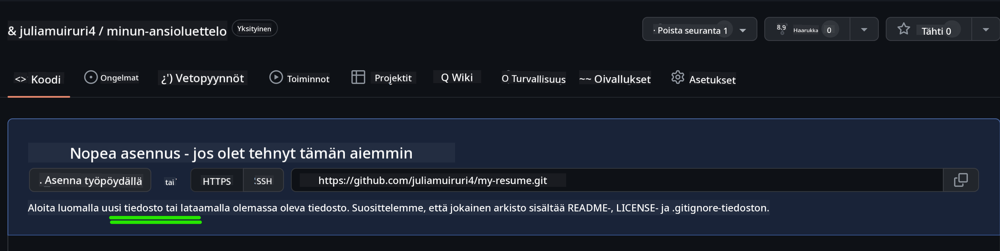
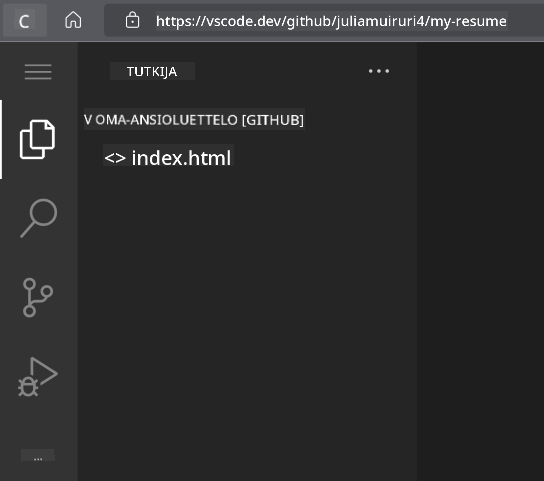
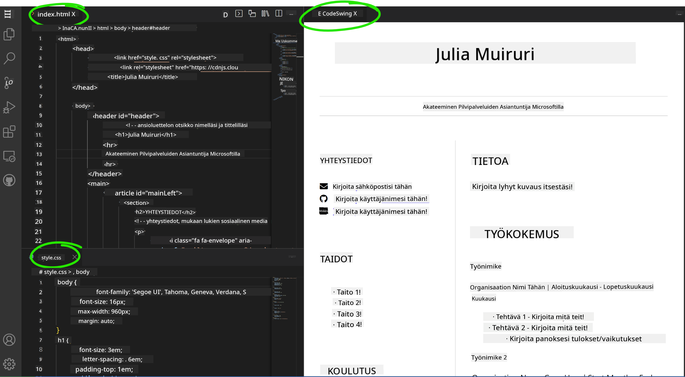

<!--
CO_OP_TRANSLATOR_METADATA:
{
  "original_hash": "2fcb983b8dbadadb1bc2e97f8c12dac5",
  "translation_date": "2025-08-27T20:41:14+00:00",
  "source_file": "8-code-editor/1-using-a-code-editor/assignment.md",
  "language_code": "fi"
}
-->
# Luo ansioluettelosivusto käyttäen vscode.dev

_Kuinka siistiä olisi, jos rekrytoija pyytäisi ansioluetteloasi ja voisit lähettää heille url-osoitteen?_ 😎

## Tavoitteet

Tämän tehtävän jälkeen opit:

- Luomaan verkkosivuston ansioluettelosi esittelyä varten

### Esivaatimukset

1. GitHub-tili. Siirry [GitHubiin](https://github.com/) ja luo tili, jos sinulla ei vielä ole sellaista.

## Vaiheet

**Vaihe 1:** Luo uusi GitHub-repositorio ja anna sille nimeksi `my-resume`

**Vaihe 2:** Luo `index.html`-tiedosto repositoriossasi. Lisäämme vähintään yhden tiedoston suoraan github.com-sivustolla, koska tyhjää repositoriota ei voi avata vscode.dev:ssä.

Klikkaa linkkiä `creating a new file`, kirjoita nimeksi `index.html` ja valitse `Commit new file` -painike.



**Vaihe 3:** Avaa [VSCode.dev](https://vscode.dev) ja valitse `Open Remote Repository` -painike.

Kopioi juuri luomasi repositorion url-osoite ja liitä se syöttökenttään:

_Korvaa `your-username` GitHub-käyttäjänimelläsi._

```
https://github.com/your-username/my-resume
```

✅ Jos onnistut, näet projektisi ja index.html-tiedoston avautuvan tekstieditorissa selaimessa.



**Vaihe 4:** Avaa `index.html`-tiedosto, liitä alla oleva koodi koodialueelle ja tallenna.

<details>
    <summary><b>HTML-koodi, joka vastaa ansioluettelosivustosi sisällöstä.</b></summary>
    
        <html>

            <head>
                <link href="style.css" rel="stylesheet">
                <link rel="stylesheet" href="https://cdnjs.cloudflare.com/ajax/libs/font-awesome/5.15.4/css/all.min.css">
                <title>Kirjoita nimesi tähän!</title>
            </head>
            <body>
                <header id="header">
                    <!-- ansioluettelon otsikko, jossa nimesi ja tittelisi -->
                    <h1>Kirjoita nimesi tähän!</h1>
                    <hr>
                    Roolisi!
                    <hr>
                </header>
                <main>
                    <article id="mainLeft">
                        <section>
                            <h2>YHTEYSTIEDOT</h2>
                            <!-- yhteystiedot, mukaan lukien sosiaalinen media -->
                            <p>
                                <i class="fa fa-envelope" aria-hidden="true"></i>
                                <a href="mailto:username@domain.top-level domain">Kirjoita sähköpostiosoitteesi tähän</a>
                            </p>
                            <p>
                                <i class="fab fa-github" aria-hidden="true"></i>
                                <a href="github.com/yourGitHubUsername">Kirjoita käyttäjänimesi tähän!</a>
                            </p>
                            <p>
                                <i class="fab fa-linkedin" aria-hidden="true"></i>
                                <a href="linkedin.com/yourLinkedInUsername">Kirjoita käyttäjänimesi tähän!</a>
                            </p>
                        </section>
                        <section>
                            <h2>TAIDOT</h2>
                            <!-- taitosi -->
                            <ul>
                                <li>Taito 1!</li>
                                <li>Taito 2!</li>
                                <li>Taito 3!</li>
                                <li>Taito 4!</li>
                            </ul>
                        </section>
                        <section>
                            <h2>KOULUTUS</h2>
                            <!-- koulutuksesi -->
                            <h3>Kirjoita kurssisi tähän!</h3>
                            <p>
                                Kirjoita oppilaitoksesi tähän!
                            </p>
                            <p>
                                Aloitus- ja lopetuspäivämäärä
                            </p>
                        </section>            
                    </article>
                    <article id="mainRight">
                        <section>
                            <h2>TIETOA</h2>
                            <!-- tietoa sinusta -->
                            <p>Kirjoita lyhyt kuvaus itsestäsi!</p>
                        </section>
                        <section>
                            <h2>TYÖKOKEMUS</h2>
                            <!-- työkokemuksesi -->
                            <h3>Työnimike</h3>
                            <p>
                                Organisaation nimi | Aloituskuukausi – Lopetuskuukausi
                            </p>
                            <ul>
                                    <li>Tehtävä 1 - Kirjoita mitä teit!</li>
                                    <li>Tehtävä 2 - Kirjoita mitä teit!</li>
                                    <li>Kirjoita panoksesi tulokset/vaikutukset</li>
                                    
                            </ul>
                            <h3>Työnimike 2</h3>
                            <p>
                                Organisaation nimi | Aloituskuukausi – Lopetuskuukausi
                            </p>
                            <ul>
                                    <li>Tehtävä 1 - Kirjoita mitä teit!</li>
                                    <li>Tehtävä 2 - Kirjoita mitä teit!</li>
                                    <li>Kirjoita panoksesi tulokset/vaikutukset</li>
                                    
                            </ul>
                        </section>
                    </article>
                </main>
            </body>
        </html>
</details>

Korvaa _paikkamerkkiteksti_ ansioluettelosi tiedoilla HTML-koodissa.

**Vaihe 5:** Vie hiiri My-Resume-kansion päälle, klikkaa `New File ...` -ikonia ja luo projektiisi 2 uutta tiedostoa: `style.css` ja `codeswing.json`.

**Vaihe 6:** Avaa `style.css`-tiedosto, liitä alla oleva koodi ja tallenna.

<details>
        <summary><b>CSS-koodi sivuston ulkoasun muotoiluun.</b></summary>
            
            body {
                font-family: 'Segoe UI', Tahoma, Geneva, Verdana, sans-serif;
                font-size: 16px;
                max-width: 960px;
                margin: auto;
            }
            h1 {
                font-size: 3em;
                letter-spacing: .6em;
                padding-top: 1em;
                padding-bottom: 1em;
            }

            h2 {
                font-size: 1.5em;
                padding-bottom: 1em;
            }

            h3 {
                font-size: 1em;
                padding-bottom: 1em;
            }
            main { 
                display: grid;
                grid-template-columns: 40% 60%;
                margin-top: 3em;
            }
            header {
                text-align: center;
                margin: auto 2em;
            }

            section {
                margin: auto 1em 4em 2em;
            }

            i {
                margin-right: .5em;
            }

            p {
                margin: .2em auto
            }

            hr {
                border: none;
                background-color: lightgray;
                height: 1px;
            }

            h1, h2, h3 {
                font-weight: 100;
                margin-bottom: 0;
            }
            #mainLeft {
                border-right: 1px solid lightgray;
            }
            
</details>

**Vaihe 6:** Avaa `codeswing.json`-tiedosto, liitä alla oleva koodi ja tallenna.

    {
    "scripts": [],
    "styles": []
    }

**Vaihe 7:** Asenna `Codeswing-laajennus` nähdäksesi ansioluettelosivuston koodialueella.

Klikkaa _`Extensions`_ -ikonia toimintopalkissa ja kirjoita Codeswing. Klikkaa joko _sinistä asennuspainiketta_ laajennetussa toimintopalkissa tai käytä asennuspainiketta, joka näkyy koodialueella, kun valitset laajennuksen lisätietojen lataamiseksi. Heti laajennuksen asentamisen jälkeen huomaat muutokset projektissasi 😃


Tältä projektisi näyttää näytölläsi laajennuksen asentamisen jälkeen.



Jos olet tyytyväinen tekemiisi muutoksiin, vie hiiri `Changes`-kansion päälle ja klikkaa `+`-painiketta lisätäksesi muutokset.

Kirjoita commit-viesti _(kuvaus projektin muutoksista)_ ja commitoi muutokset klikkaamalla `check`. Kun olet valmis projektisi kanssa, valitse vasemman yläkulman hampurilaisvalikkoikoni palataksesi GitHub-repositorioon.

Onnittelut 🎉 Olet juuri luonut ansioluettelosivuston käyttäen vscode.dev:ia muutamassa vaiheessa.

## 🚀 Haaste

Avaa etärepositorio, johon sinulla on muokkausoikeudet, ja päivitä joitakin tiedostoja. Seuraavaksi kokeile luoda uusi haara muutoksillasi ja tee Pull Request.

## Tarkistus ja itseopiskelu

Lue lisää [VSCode.devistä](https://code.visualstudio.com/docs/editor/vscode-web?WT.mc_id=academic-0000-alfredodeza) ja sen muista ominaisuuksista.

---

**Vastuuvapauslauseke**:  
Tämä asiakirja on käännetty käyttämällä tekoälypohjaista käännöspalvelua [Co-op Translator](https://github.com/Azure/co-op-translator). Vaikka pyrimme tarkkuuteen, huomioithan, että automaattiset käännökset voivat sisältää virheitä tai epätarkkuuksia. Alkuperäinen asiakirja sen alkuperäisellä kielellä tulisi pitää ensisijaisena lähteenä. Kriittisen tiedon osalta suositellaan ammattimaista ihmiskäännöstä. Emme ole vastuussa väärinkäsityksistä tai virhetulkinnoista, jotka johtuvat tämän käännöksen käytöstä.