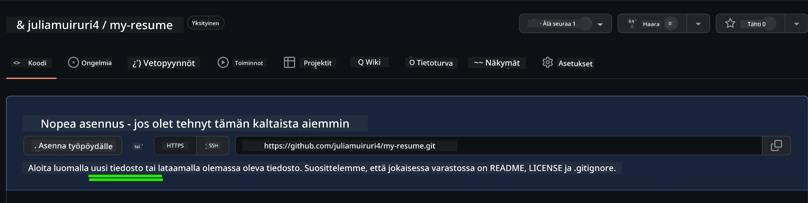
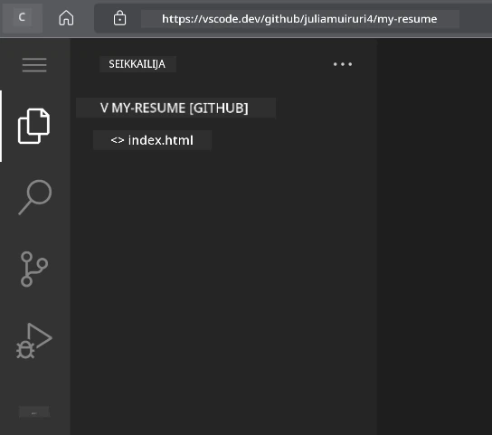
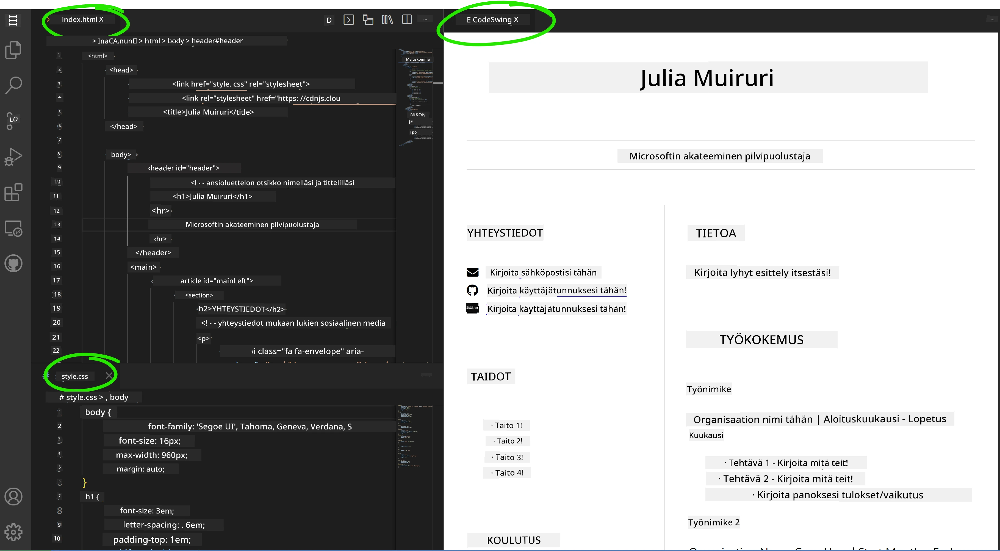

# Luo ansioluettelosivusto VSCode.dev:llä

Paranna uramahdollisuuksiasi rakentamalla ammattimainen ansioluettelosivusto, joka esittelee taitosi ja kokemuksesi interaktiivisessa, modernissa muodossa. Perinteisten PDF-tiedostojen lähettämisen sijaan voit tarjota rekrytoijille tyylikkään, responsiivisen verkkosivuston, joka osoittaa sekä pätevyytesi että verkkokehitystaitosi.

Tämä käytännön tehtävä hyödyntää kaikkia VSCode.dev-taitojasi samalla kun luot jotain todella hyödyllistä urallesi. Saat kokemusta koko verkkokehitysprosessista – aina projektin luomisesta sen julkaisuun – suoraan selaimessasi.

Kun olet suorittanut projektin, sinulla on ammattimainen verkkopresenssi, jota voit helposti jakaa potentiaalisille työnantajille, päivittää taitojesi kasvaessa ja mukauttaa henkilökohtaisen brändisi mukaan. Tämä on juuri sellainen käytännön projekti, joka osoittaa todellisia verkkokehitystaitoja.

## Oppimistavoitteet

Tehtävän suorittamisen jälkeen osaat:

- **Luoda** ja hallita kokonaisen verkkokehitysprojektin VSCode.dev:llä
- **Rakentaa** ammattimaisen verkkosivuston käyttäen semanttisia HTML-elementtejä
- **Muotoilla** responsiivisia asetteluja moderneilla CSS-tekniikoilla
- **Toteuttaa** interaktiivisia ominaisuuksia perusverkkoteknologioilla
- **Julkaista** toimivan verkkosivuston jaettavalla URL-osoitteella
- **Osoittaa** versionhallinnan parhaat käytännöt kehitysprosessin aikana

## Esivaatimukset

Ennen kuin aloitat tehtävän, varmista että sinulla on:

- GitHub-tili (luo sellainen osoitteessa [github.com](https://github.com/) tarvittaessa)
- VSCode.dev-kurssin suorittaminen, joka kattaa käyttöliittymän navigoinnin ja perustoiminnot
- Perustiedot HTML-rakenteesta ja CSS-muotoilukonsepteista

## Projektin perustaminen ja repositorion luominen

Aloitetaan projektin perustan luomisella. Tämä prosessi jäljittelee todellisia kehitystyönkulkuja, joissa projektit alkavat asianmukaisella repositorion alustuksella ja rakenteen suunnittelulla.

### Vaihe 1: Luo GitHub-repositorio

Dedikoidun repositorion luominen varmistaa, että projektisi on alusta alkaen asianmukaisesti organisoitu ja versionhallittu.

1. **Siirry** osoitteeseen [GitHub.com](https://github.com) ja kirjaudu sisään tilillesi
2. **Klikkaa** vihreää "New"-painiketta tai "+"-ikonia oikeassa yläkulmassa
3. **Nimeä** repositoriosi `my-resume` (tai valitse henkilökohtainen nimi, kuten `john-smith-resume`)
4. **Lisää** lyhyt kuvaus: "Ammattimainen ansioluettelosivusto, rakennettu HTML:llä ja CSS:llä"
5. **Valitse** "Public", jotta ansioluettelosi on potentiaalisten työnantajien saatavilla
6. **Rastita** "Add a README file" luodaksesi alkuperäisen projektikuvauksen
7. **Klikkaa** "Create repository" viimeistelläksesi asetukset

> 💡 **Repositorion nimeämisvinkki**: Käytä kuvailevia, ammattimaisia nimiä, jotka selkeästi ilmaisevat projektin tarkoituksen. Tämä auttaa työnantajia ja portfolioarvioinnin aikana.

### Vaihe 2: Alusta projektirakenne

Koska VSCode.dev vaatii vähintään yhden tiedoston repositorion avaamiseen, luomme pääasiallisen HTML-tiedoston suoraan GitHubissa ennen siirtymistä verkkopohjaiseen editoriin.

1. **Klikkaa** "creating a new file" -linkkiä uudessa repositoriossasi
2. **Kirjoita** `index.html` tiedostonimeksi
3. **Lisää** tämä alkuperäinen HTML-rakenne:

```html
<!DOCTYPE html>
<html lang="en">
<head>
    <meta charset="UTF-8">
    <meta name="viewport" content="width=device-width, initial-scale=1.0">
    <title>Your Name - Professional Resume</title>
</head>
<body>
    <h1>Your Name</h1>
    <p>Professional Resume Website</p>
</body>
</html>
```

4. **Kirjoita** commit-viesti: "Lisätty alkuperäinen HTML-rakenne"
5. **Klikkaa** "Commit new file" tallentaaksesi muutokset



**Mitä tämä alkuperäinen asetus saavuttaa:**
- **Luo** asianmukaisen HTML5-dokumenttirakenteen semanttisilla elementeillä
- **Sisältää** viewport meta -tagin responsiivisen suunnittelun yhteensopivuuden varmistamiseksi
- **Asettaa** kuvailevan sivun otsikon, joka näkyy selaimen välilehdissä
- **Luo** perustan ammattimaiselle sisällön organisoinnille

## Työskentely VSCode.dev:ssä

Nyt kun repositorion perusta on luotu, siirrytään VSCode.dev:iin varsinaista kehitystyötä varten. Tämä verkkopohjainen editori tarjoaa kaikki tarvittavat työkalut ammattimaiseen verkkokehitykseen.

### Vaihe 3: Avaa projektisi VSCode.dev:ssä

1. **Siirry** osoitteeseen [vscode.dev](https://vscode.dev) uudessa selaimen välilehdessä
2. **Klikkaa** "Open Remote Repository" aloitusnäytössä
3. **Kopioi** repositoriosi URL-osoite GitHubista ja liitä se syöttökenttään

   Muoto: `https://github.com/your-username/my-resume`
   
   *Korvaa `your-username` omalla GitHub-käyttäjänimelläsi*

4. **Paina** Enter ladataksesi projektisi

✅ **Onnistumisen merkki**: Näet projektitiedostosi Explorer-sivupalkissa ja `index.html`-tiedoston muokattavissa pääeditorialueella.



**Mitä näet käyttöliittymässä:**
- **Explorer-sivupalkki**: **Näyttää** repositorion tiedostot ja kansiorakenteen
- **Editorialue**: **Näyttää** valittujen tiedostojen sisällön muokattavaksi
- **Toimintopalkki**: **Tarjoaa** pääsyn ominaisuuksiin, kuten versionhallintaan ja laajennuksiin
- **Tilarivi**: **Ilmoittaa** yhteystilan ja nykyisen haaran tiedot

### Vaihe 4: Rakenna ansioluettelosi sisältö

Korvaa `index.html`-tiedoston paikkamerkkisisältö kattavalla ansioluettelorakenteella. Tämä HTML toimii perustana ammattimaiselle pätevyyksiesi esittelylle.

<details>
<summary><b>Valmis HTML-ansioluettelon rakenne</b></summary>

```html
<!DOCTYPE html>
<html lang="en">
<head>
    <meta charset="UTF-8">
    <meta name="viewport" content="width=device-width, initial-scale=1.0">
    <link href="style.css" rel="stylesheet">
    <link rel="stylesheet" href="https://cdnjs.cloudflare.com/ajax/libs/font-awesome/5.15.4/css/all.min.css">
    <title>Your Name - Professional Resume</title>
</head>
<body>
    <header id="header">
        <h1>Your Full Name</h1>
        <hr>
        <p class="role">Your Professional Title</p>
        <hr>
    </header>
    
    <main>
        <article id="mainLeft">
            <section>
                <h2>CONTACT</h2>
                <p>
                    <i class="fa fa-envelope" aria-hidden="true"></i>
                    <a href="mailto:your.email@domain.com">your.email@domain.com</a>
                </p>
                <p>
                    <i class="fab fa-github" aria-hidden="true"></i>
                    <a href="https://github.com/your-username">github.com/your-username</a>
                </p>
                <p>
                    <i class="fab fa-linkedin" aria-hidden="true"></i>
                    <a href="https://linkedin.com/in/your-profile">linkedin.com/in/your-profile</a>
                </p>
            </section>
            
            <section>
                <h2>SKILLS</h2>
                <ul>
                    <li>HTML5 & CSS3</li>
                    <li>JavaScript (ES6+)</li>
                    <li>Responsive Web Design</li>
                    <li>Version Control (Git)</li>
                    <li>Problem Solving</li>
                </ul>
            </section>
            
            <section>
                <h2>EDUCATION</h2>
                <h3>Your Degree or Certification</h3>
                <p>Institution Name</p>
                <p>Start Date - End Date</p>
            </section>
        </article>
        
        <article id="mainRight">
            <section>
                <h2>ABOUT</h2>
                <p>Write a compelling summary that highlights your passion for web development, key achievements, and career goals. This section should give employers insight into your personality and professional approach.</p>
            </section>
            
            <section>
                <h2>WORK EXPERIENCE</h2>
                <div class="job">
                    <h3>Job Title</h3>
                    <p class="company">Company Name | Start Date – End Date</p>
                    <ul>
                        <li>Describe a key accomplishment or responsibility</li>
                        <li>Highlight specific skills or technologies used</li>
                        <li>Quantify impact where possible (e.g., "Improved efficiency by 25%")</li>
                    </ul>
                </div>
                
                <div class="job">
                    <h3>Previous Job Title</h3>
                    <p class="company">Previous Company | Start Date – End Date</p>
                    <ul>
                        <li>Focus on transferable skills and achievements</li>
                        <li>Demonstrate growth and learning progression</li>
                        <li>Include any leadership or collaboration experiences</li>
                    </ul>
                </div>
            </section>
            
            <section>
                <h2>PROJECTS</h2>
                <div class="project">
                    <h3>Project Name</h3>
                    <p>Brief description of what the project accomplishes and technologies used.</p>
                    <a href="#" target="_blank">View Project</a>
                </div>
            </section>
        </article>
    </main>
</body>
</html>
```
</details>

**Mukautusohjeet:**
- **Korvaa** kaikki paikkamerkkitekstit omilla tiedoillasi
- **Säädä** osioita kokemustasosi ja urapainotuksesi mukaan
- **Lisää** tai poista osioita tarpeen mukaan (esim. Sertifikaatit, Vapaaehtoistyö, Kielet)
- **Sisällytä** linkit omiin profiileihisi ja projekteihisi

### Vaihe 5: Luo tukitiedostot

Ammattimaiset verkkosivustot vaativat organisoidut tiedostorakenteet. Luo CSS-tyylitiedosto ja konfiguraatiotiedostot, jotka ovat tarpeen täydellistä projektia varten.

1. **Vie hiiri** projektikansiosi nimen päälle Explorer-sivupalkissa
2. **Klikkaa** "New File" -ikonia (📄+), joka ilmestyy
3. **Luo** nämä tiedostot yksi kerrallaan:
   - `style.css` (tyylittelyä ja asettelua varten)
   - `codeswing.json` (esikatselulaajennuksen konfiguraatiota varten)

**CSS-tiedoston luominen (`style.css`):**

<details>
<summary><b>Ammattimainen CSS-muotoilu</b></summary>

```css
/* Modern Resume Styling */
body {
    font-family: 'Segoe UI', Tahoma, Geneva, Verdana, sans-serif;
    font-size: 16px;
    line-height: 1.6;
    max-width: 960px;
    margin: 0 auto;
    padding: 20px;
    color: #333;
    background-color: #f9f9f9;
}

/* Header Styling */
header {
    text-align: center;
    margin-bottom: 3em;
    padding: 2em;
    background: linear-gradient(135deg, #667eea 0%, #764ba2 100%);
    color: white;
    border-radius: 10px;
    box-shadow: 0 4px 6px rgba(0, 0, 0, 0.1);
}

h1 {
    font-size: 3em;
    letter-spacing: 0.1em;
    margin-bottom: 0.2em;
    font-weight: 300;
}

.role {
    font-size: 1.3em;
    font-weight: 300;
    margin: 1em 0;
}

/* Main Content Layout */
main {
    display: grid;
    grid-template-columns: 35% 65%;
    gap: 3em;
    margin-top: 3em;
    background: white;
    padding: 2em;
    border-radius: 10px;
    box-shadow: 0 2px 10px rgba(0, 0, 0, 0.1);
}

/* Typography */
h2 {
    font-size: 1.4em;
    font-weight: 600;
    margin-bottom: 1em;
    color: #667eea;
    border-bottom: 2px solid #667eea;
    padding-bottom: 0.3em;
}

h3 {
    font-size: 1.1em;
    font-weight: 600;
    margin-bottom: 0.5em;
    color: #444;
}

/* Section Styling */
section {
    margin-bottom: 2.5em;
}

#mainLeft {
    border-right: 1px solid #e0e0e0;
    padding-right: 2em;
}

/* Contact Links */
section a {
    color: #667eea;
    text-decoration: none;
    transition: color 0.3s ease;
}

section a:hover {
    color: #764ba2;
    text-decoration: underline;
}

/* Icons */
i {
    margin-right: 0.8em;
    width: 20px;
    text-align: center;
    color: #667eea;
}

/* Lists */
ul {
    list-style: none;
    padding-left: 0;
}

li {
    margin: 0.5em 0;
    padding: 0.3em 0;
    position: relative;
}

li:before {
    content: "▸";
    color: #667eea;
    margin-right: 0.5em;
}

/* Work Experience */
.job, .project {
    margin-bottom: 2em;
    padding-bottom: 1.5em;
    border-bottom: 1px solid #f0f0f0;
}

.company {
    font-style: italic;
    color: #666;
    margin-bottom: 0.5em;
}

/* Responsive Design */
@media (max-width: 768px) {
    main {
        grid-template-columns: 1fr;
        gap: 2em;
    }
    
    #mainLeft {
        border-right: none;
        border-bottom: 1px solid #e0e0e0;
        padding-right: 0;
        padding-bottom: 2em;
    }
    
    h1 {
        font-size: 2.2em;
    }
    
    body {
        padding: 10px;
    }
}

/* Print Styles */
@media print {
    body {
        background: white;
        color: black;
        font-size: 12pt;
    }
    
    header {
        background: none;
        color: black;
        box-shadow: none;
    }
    
    main {
        box-shadow: none;
    }
}
```
</details>

**Konfiguraatiotiedoston luominen (`codeswing.json`):**

```json
{
    "scripts": [],
    "styles": []
}
```

**CSS-ominaisuuksien ymmärtäminen:**
- **Käyttää** CSS Grid -tekniikkaa responsiivisen, ammattimaisen asettelun luomiseen
- **Toteuttaa** modernit värimaailmat gradienttialkuotsikoilla
- **Sisältää** hover-efektejä ja pehmeitä siirtymiä interaktiivisuutta varten
- **Tarjoaa** responsiivisen suunnittelun, joka toimii kaikilla laitekokoilla
- **Lisää** tulostusystävälliset tyylit PDF-tiedostojen luomista varten

### Vaihe 6: Asenna ja konfiguroi laajennukset

Laajennukset parantavat kehityskokemustasi tarjoamalla reaaliaikaisia esikatselumahdollisuuksia ja parannettuja työnkulun työkaluja. CodeSwing-laajennus on erityisen hyödyllinen verkkokehitysprojekteissa.

**CodeSwing-laajennuksen asentaminen:**

1. **Klikkaa** Laajennukset-ikonia (🧩) toimintopalkissa
2. **Etsi** "CodeSwing" markkinapaikan hakukentästä
3. **Valitse** CodeSwing-laajennus hakutuloksista
4. **Klikkaa** sinistä "Install"-painiketta


**Mitä CodeSwing tarjoaa:**
- **Mahdollistaa** verkkosivustosi reaaliaikaisen esikatselun muokkauksen aikana
- **Näyttää** muutokset välittömästi ilman manuaalista päivitystä
- **Tukee** useita tiedostotyyppejä, kuten HTML, CSS ja JavaScript
- **Tarjoaa** integroidun kehitysympäristökokemuksen

**Välittömät tulokset asennuksen jälkeen:**
Kun CodeSwing on asennettu, näet ansioluettelosivustosi reaaliaikaisen esikatselun editorissa. Tämä mahdollistaa sen, että näet tarkalleen, miltä sivustosi näyttää tehdessäsi muutoksia.



**Parannetun käyttöliittymän ymmärtäminen:**
- **Jaettu näkymä**: **Näyttää** koodisi toisella puolella ja reaaliaikaisen esikatselun toisella
- **Reaaliaikaiset päivitykset**: **Heijastaa** muutokset välittömästi kirjoittaessasi
- **Interaktiivinen esikatselu**: **Mahdollistaa** linkkien ja interaktioiden testaamisen
- **Mobiilisimulaatio**: **Tarjoaa** responsiivisen suunnittelun testausmahdollisuudet

### Vaihe 7: Versionhallinta ja julkaisu

Nyt kun ansioluettelosivustosi on valmis, käytä Git-ohjelmaa tallentaaksesi työsi ja tehdäksesi sen saataville verkossa.

**Muutosten tallentaminen:**

1. **Klikkaa** Versionhallinta-ikonia (🌿) toimintopalkissa
2. **Tarkista** kaikki luomasi ja muokkaamasi tiedostot "Changes"-osiossa
3. **Valitse** muutokset klikkaamalla "+"-ikonia kunkin tiedoston vieressä
4. **Kirjoita** kuvaileva commit-viesti, kuten:
   - "Lisätty täydellinen ansioluettelosivusto responsiivisella suunnittelulla"
   - "Toteutettu ammattimainen muotoilu ja sisällön rakenne"
5. **Klikkaa** valintamerkkiä (✓) tallentaaksesi ja lähettääksesi muutokset

**Hyviä commit-viestiesimerkkejä:**
- "Lisätty ammattimainen ansioluettelosisältö ja muotoilu"
- "Toteutettu responsiivinen suunnittelu mobiiliyhteensopivuuden varmistamiseksi"
- "Päivitetty yhteystiedot ja projektien linkit"

> 💡 **Ammattivinkki**: Hyvät commit-viestit auttavat seuraamaan projektisi kehitystä ja osoittavat huolellisuutta – ominaisuuksia, joita työnantajat arvostavat.

**Julkaistun sivuston käyttö:**
Kun muutokset on tallennettu, voit palata GitHub-repositorioosi käyttämällä vasemman yläkulman hampurilaisvalikkoa (☰). Ansioluettelosivustosi on nyt versionhallittu ja valmis julkaistavaksi tai jaettavaksi.

## Tulokset ja seuraavat askeleet

**Onnittelut! 🎉** Olet onnistuneesti luonut ammattimaisen ansioluettelosivuston VSCode.dev:llä. Projektisi osoittaa:
**Osoitetut tekniset taidot:**
- **Repositorion hallinta**: Luotu ja organisoitu täydellinen projektirakenne
- **Verkkokehitys**: Rakennettu responsiivinen verkkosivusto moderneilla HTML5- ja CSS3-tekniikoilla
- **Versionhallinta**: Toteutettu asianmukainen Git-työnkulku merkityksellisillä commit-viesteillä
- **Työkalujen hallinta**: Käytetty tehokkaasti VSCode.dev:n käyttöliittymää ja laajennusjärjestelmää

**Saavutetut ammatilliset tulokset:**
- **Verkkopresenssi**: Jaettava URL-osoite, joka esittelee pätevyytesi
- **Moderni formaatti**: Interaktiivinen vaihtoehto perinteisille PDF-ansioluetteloille
- **Todistettavat taidot**: Konkreettinen todiste verkkokehitystaidoistasi
- **Helppo päivitys**: Perusta, jota voit jatkuvasti parantaa ja mukauttaa

### Julkaisuvaihtoehdot

Jotta ansioluettelosi olisi työnantajien saatavilla, harkitse näitä hosting-vaihtoehtoja:

**GitHub Pages (suositeltava):**
1. Siirry GitHub-repositoriosi asetuksiin
2. Vieritä "Pages"-osioon
3. Valitse "Deploy from a branch" ja valitse "main"
4. Sivustosi on saatavilla osoitteessa `https://your-username.github.io/my-resume`

**Vaihtoehtoiset alustat:**
- **Netlify**: Automaattinen julkaisu mukautetuilla domaineilla
- **Vercel**: Nopea julkaisu moderneilla hosting-ominaisuuksilla
- **GitHub Codespaces**: Kehitysympäristö sisäänrakennetulla esikatselulla

### Parannusehdotukset

Jatka taitojesi kehittämistä lisäämällä nämä ominaisuudet:

**Tekniset parannukset:**
- **JavaScript-interaktiivisuus**: Lisää sujuva vieritys tai interaktiivisia elementtejä
- **Tumma tila -vaihtoehto**: Toteuta teeman vaihto käyttäjän mieltymyksen mukaan
- **Yhteydenottolomake**: Mahdollista suora yhteydenotto potentiaalisilta työnantajilta
- **SEO-optimointi**: Lisää meta-tageja ja jäsenneltyä dataa paremman hakunäkyvyyden saavuttamiseksi

**Sisällön parannukset:**
- **Projektisalkku**: Linkitä GitHub-repositorioihin ja toimiviin demoihin
- **Taitojen visualisointi**: Luo edistymispalkkeja tai taitoarviointijärjestelmiä
- **Suositusosio**: Sisällytä kollegoiden tai ohjaajien suosituksia
- **Blogi-integraatio**: Lisää blogiosio oppimismatkasi esittelemiseksi

## GitHub Copilot Agent -haaste 🚀

Käytä Agent-tilaa suorittaaksesi seuraavan haasteen:

**Kuvaus:** Paranna ansioluettelosivustoasi edistyneillä ominaisuuksilla, jotka osoittavat ammattimaisia verkkokehitystaitoja ja moderneja suunnitteluperiaatteita.

**Tehtävä:** Rakentaen olemassa olevan ansioluettelosivustosi päälle, toteuta nämä edistyneet ominaisuudet:
1. Lisää tumma/vaalea teeman vaihto sujuvilla siirtymillä
2. Luo interaktiivinen taito-osio animoiduilla edistymispalkkeilla
3. Toteuta yhteydenottolomake lomakevalidoinnilla
4. Lisää projektisalkkuosio hover-efekteillä ja modaalisilla ponnahdusikkunoilla
5. Sisällytä blogiosio, jossa on vähintään 3 esimerkkipostausta oppimismatkastasi
6. Optimoi SEO lisäämällä asianmukaiset meta-tagit, jäsennelty data ja suorituskyky
7. Julkaise parannettu sivusto käyttäen GitHub Pagesia tai Netlifyä
8. Dokumentoi kaikki uudet ominaisuudet README.md-tiedostossa kuvakaappauksilla

Parannettu verkkosivust
- **Saavutettavuus**: Tutustu WCAG-ohjeisiin inklusiivisen verkkosuunnittelun tueksi  
- **Suorituskyky**: Käytä työkaluja, kuten Lighthouse, optimointiin  
- **SEO**: Ymmärrä hakukoneoptimoinnin perusteet  

**Ammatillinen kehitys:**  
- **Portfolion rakentaminen**: Luo lisää projekteja esitelläksesi monipuolisia taitojasi  
- **Avoin lähdekoodi**: Osallistu olemassa oleviin projekteihin saadaksesi yhteistyökokemusta  
- **Verkostoituminen**: Jaa ansioluettelosivustosi kehittäjäyhteisöissä saadaksesi palautetta  
- **Jatkuva oppiminen**: Pysy ajan tasalla verkkokehityksen trendeistä ja teknologioista  

---

**Seuraavat askeleesi:** Jaa ansioluettelosivustosi ystävien, perheen tai mentorien kanssa saadaksesi palautetta. Käytä heidän ehdotuksiaan parantaaksesi suunnitteluasi. Muista, että tämä projekti ei ole vain ansioluettelo – se on osoitus kasvustasi verkkokehittäjänä!

---

**Vastuuvapauslauseke**:  
Tämä asiakirja on käännetty käyttämällä tekoälypohjaista käännöspalvelua [Co-op Translator](https://github.com/Azure/co-op-translator). Vaikka pyrimme tarkkuuteen, huomioithan, että automaattiset käännökset voivat sisältää virheitä tai epätarkkuuksia. Alkuperäinen asiakirja sen alkuperäisellä kielellä tulisi pitää ensisijaisena lähteenä. Kriittisen tiedon osalta suositellaan ammattimaista ihmiskäännöstä. Emme ole vastuussa väärinkäsityksistä tai virhetulkinnoista, jotka johtuvat tämän käännöksen käytöstä.