<!--
CO_OP_TRANSLATOR_METADATA:
{
  "original_hash": "2066c17078e9d18b5e309f31d8e8bc24",
  "translation_date": "2025-11-04T01:24:59+00:00",
  "source_file": "9-chat-project/README.md",
  "language_code": "fi"
}
-->
# Rakenna keskusteluavustaja tekoälyn avulla

Muistatko Star Trekistä, kun miehistö keskusteli rennosti aluksen tietokoneen kanssa, esitti monimutkaisia kysymyksiä ja sai harkittuja vastauksia? Se, mikä vaikutti 1960-luvulla puhtaalta tieteiskirjallisuudelta, on nyt jotain, jonka voit rakentaa käyttämällä jo tuntemiasi verkkoteknologioita.

Tässä oppitunnissa luomme tekoälyyn perustuvan keskusteluavustajan käyttäen HTML:ää, CSS:ää, JavaScriptiä ja hieman taustapalveluiden integrointia. Huomaat, kuinka samat taidot, joita olet oppinut, voivat yhdistyä tehokkaisiin tekoälypalveluihin, jotka ymmärtävät kontekstin ja tuottavat merkityksellisiä vastauksia.

Ajattele tekoälyä kuin valtavaa kirjastoa, joka ei ainoastaan löydä tietoa, vaan myös muotoilee sen yhtenäisiksi vastauksiksi, jotka on räätälöity juuri sinun kysymyksiisi. Sen sijaan, että etsisit tietoa tuhansista sivuista, saat suoria ja kontekstuaalisia vastauksia.

Integrointi tapahtuu tuttujen verkkoteknologioiden avulla. HTML luo keskustelukäyttöliittymän, CSS huolehtii visuaalisesta suunnittelusta, JavaScript hallitsee käyttäjävuorovaikutusta, ja taustapalvelun API yhdistää kaiken tekoälypalveluihin. Se on kuin orkesteri, jossa eri osat toimivat yhdessä luoden harmonisen sinfonian.

Rakennamme pohjimmiltaan sillan luonnollisen ihmisten välisen viestinnän ja koneellisen käsittelyn välille. Opit sekä tekoälypalveluiden teknisen toteutuksen että suunnittelumallit, jotka tekevät vuorovaikutuksesta intuitiivista.

Oppitunnin lopussa tekoälyn integrointi tuntuu vähemmän mystiseltä prosessilta ja enemmän kuin mikä tahansa API, jonka kanssa voit työskennellä. Ymmärrät perustavanlaatuiset mallit, jotka tukevat sovelluksia, kuten ChatGPT ja Claude, käyttäen samoja verkkokehityksen periaatteita, joita olet oppinut.

## ⚡ Mitä voit tehdä seuraavan 5 minuutin aikana

**Nopea aloitus kiireisille kehittäjille**

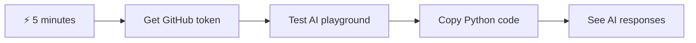

- **Minuutti 1**: Käy [GitHub Models Playground](https://github.com/marketplace/models/azure-openai/gpt-4o-mini/playground) -sivustolla ja luo henkilökohtainen käyttöoikeustunnus
- **Minuutti 2**: Testaa tekoälyvuorovaikutuksia suoraan Playground-käyttöliittymässä
- **Minuutti 3**: Klikkaa "Code"-välilehteä ja kopioi Python-koodinpätkä
- **Minuutti 4**: Suorita koodi paikallisesti tunnuksellasi: `GITHUB_TOKEN=your_token python test.py`
- **Minuutti 5**: Katso, kuinka ensimmäinen tekoälyvastaus syntyy omasta koodistasi

**Nopea testikoodi**:
```python
import os
from openai import OpenAI

client = OpenAI(
    base_url="https://models.github.ai/inference",
    api_key="your_token_here"
)

response = client.chat.completions.create(
    messages=[{"role": "user", "content": "Hello AI!"}],
    model="openai/gpt-4o-mini"
)

print(response.choices[0].message.content)
```

**Miksi tämä on tärkeää**: Viidessä minuutissa koet ohjelmallisen tekoälyvuorovaikutuksen taian. Tämä on perusta, joka tukee kaikkia käyttämiäsi tekoälysovelluksia.

Tältä valmis projektisi näyttää:


## 🗺️ Oppimismatka tekoälysovellusten kehittämiseen

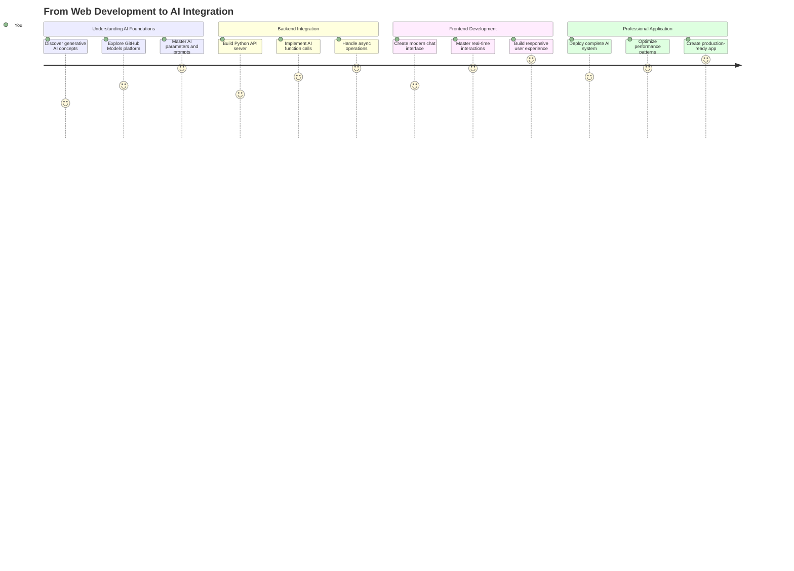

**Matkasi päämäärä**: Oppitunnin lopussa olet rakentanut täydellisen tekoälyllä toimivan sovelluksen käyttäen samoja teknologioita ja malleja, jotka tukevat moderneja tekoälyavustajia, kuten ChatGPT, Claude ja Google Bard.

## Tekoälyn ymmärtäminen: mysteeristä mestariksi

Ennen kuin sukellamme koodiin, ymmärretään, mitä olemme tekemässä. Jos olet käyttänyt API:ta aiemmin, tiedät peruskaavan: lähetä pyyntö, vastaanota vastaus.

Tekoäly-API:t noudattavat samanlaista rakennetta, mutta sen sijaan, että ne hakisivat ennalta tallennettuja tietoja tietokannasta, ne tuottavat uusia vastauksia perustuen valtavista tekstimääristä opittuihin malleihin. Ajattele sitä kuin ero kirjastoluettelon ja tietävän kirjastonhoitajan välillä, joka voi yhdistää tietoa useista lähteistä.

### Mitä "Generatiivinen tekoäly" oikeastaan on?

Ajattele, kuinka Rosetta-kivi auttoi tutkijoita ymmärtämään egyptiläisiä hieroglyfejä löytämällä malleja tunnettujen ja tuntemattomien kielten välillä. Tekoälymallit toimivat samalla tavalla – ne löytävät malleja valtavista tekstimääristä ymmärtääkseen, miten kieli toimii, ja käyttävät näitä malleja tuottaakseen sopivia vastauksia uusiin kysymyksiin.

**Selitän tämän yksinkertaisella vertauksella:**
- **Perinteinen tietokanta**: Kuten pyytäisit syntymätodistustasi – saat aina saman dokumentin
- **Hakukone**: Kuten pyytäisit kirjastonhoitajaa löytämään kirjoja kissoista – he näyttävät, mitä on saatavilla
- **Generatiivinen tekoäly**: Kuten kysyisit tietävältä ystävältä kissoista – he kertovat mielenkiintoisia asioita omilla sanoillaan, räätälöitynä tarpeisiisi

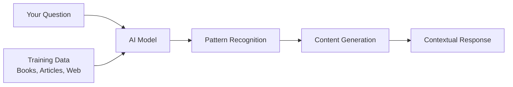

### Kuinka tekoälymallit oppivat (yksinkertaistettu versio)

Tekoälymallit oppivat altistumalla valtaville tekstiaineistoille, jotka sisältävät kirjoja, artikkeleita ja keskusteluja. Tämän prosessin kautta ne tunnistavat malleja:
- Kuinka ajatukset jäsentyvät kirjallisessa viestinnässä
- Mitkä sanat esiintyvät usein yhdessä
- Kuinka keskustelut yleensä etenevät
- Eroja muodollisen ja epämuodollisen viestinnän välillä

**Se on kuin arkeologit tulkitsevat muinaisia kieliä**: he analysoivat tuhansia esimerkkejä ymmärtääkseen kieliopin, sanaston ja kulttuurisen kontekstin, ja lopulta pystyvät tulkitsemaan uusia tekstejä oppimiensa mallien avulla.

### Miksi GitHub Models?

Käytämme GitHub Models -palvelua melko käytännöllisestä syystä – se antaa meille pääsyn yritystason tekoälyyn ilman, että meidän tarvitsee pystyttää omaa tekoälyinfrastruktuuria (mikä, usko pois, ei ole tällä hetkellä helppoa!). Ajattele sitä kuin sää-API:n käyttöä sen sijaan, että yrittäisit itse ennustaa säätä pystyttämällä sääasemia kaikkialle.

Se on pohjimmiltaan "tekoäly palveluna", ja paras osa? Aloittaminen on ilmaista, joten voit kokeilla ilman huolta suurista kustannuksista.

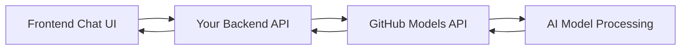

Käytämme GitHub Models -palvelua taustaintegraatioomme, joka tarjoaa pääsyn ammattitason tekoälyominaisuuksiin kehittäjäystävällisen käyttöliittymän kautta. [GitHub Models Playground](https://github.com/marketplace/models/azure-openai/gpt-4o-mini/playground) toimii testausympäristönä, jossa voit kokeilla erilaisia tekoälymalleja ja ymmärtää niiden ominaisuuksia ennen niiden toteuttamista koodissa.

## 🧠 Tekoälysovellusten kehityksen ekosysteemi

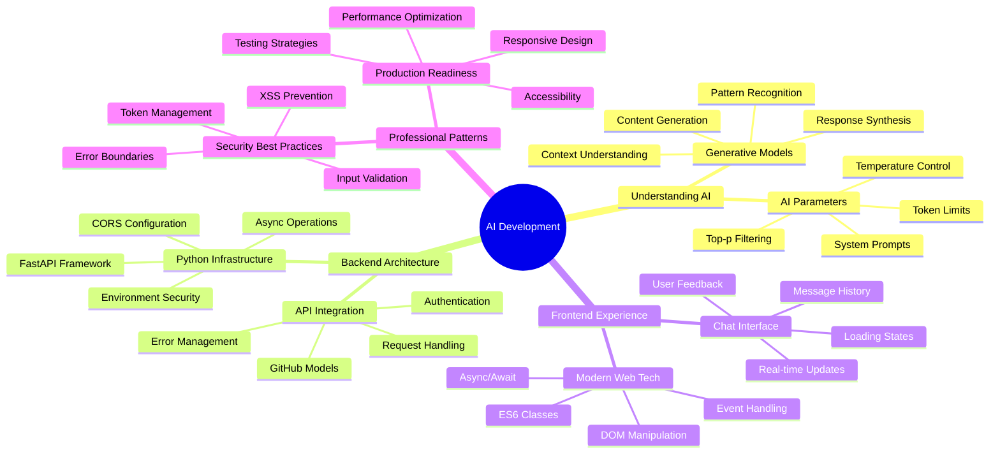

**Keskeinen periaate**: Tekoälysovellusten kehitys yhdistää perinteiset verkkokehitystaidot tekoälypalveluiden integrointiin, luoden älykkäitä sovelluksia, jotka tuntuvat käyttäjille luonnollisilta ja reagoivilta.

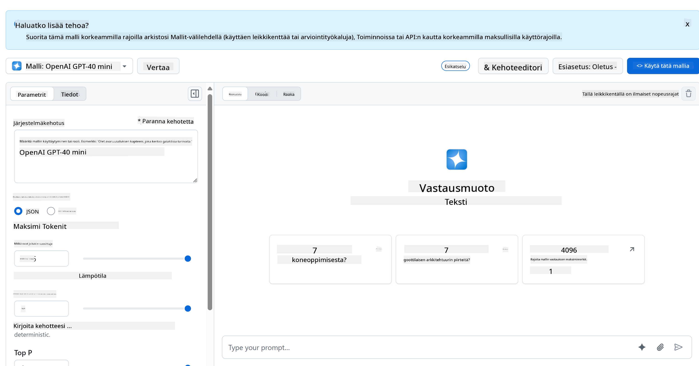

**Mikä tekee Playgroundista niin hyödyllisen:**
- **Kokeile** eri tekoälymalleja, kuten GPT-4o-mini, Claude ja muita (kaikki ilmaisia!)
- **Testaa** ideoitasi ja kysymyksiäsi ennen koodin kirjoittamista
- **Hanki** käyttövalmiita koodinpätkiä suosikkiohjelmointikielelläsi
- **Säädä** asetuksia, kuten luovuustasoa ja vastausten pituutta, nähdäksesi niiden vaikutukset tuloksiin

Kun olet kokeillut hieman, klikkaa vain "Code"-välilehteä ja valitse ohjelmointikieli saadaksesi toteutuskoodin, jota tarvitset.

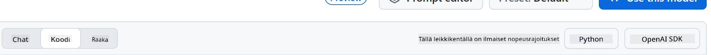

## Python-taustaintegraation asettaminen

Nyt toteutamme tekoälyintegraation Pythonilla. Python on erinomainen tekoälysovelluksille sen yksinkertaisen syntaksin ja tehokkaiden kirjastojen ansiosta. Aloitamme GitHub Models -palvelun Playgroundista saadulla koodilla ja muokkaamme sen uudelleenkäytettäväksi, tuotantovalmiiksi funktioksi.

### Perustoteutuksen ymmärtäminen

Kun haet Python-koodin Playgroundista, se näyttää suunnilleen tältä. Älä huoli, jos se vaikuttaa aluksi monimutkaiselta – käydään se läpi pala palalta:

```python
"""Run this model in Python

> pip install openai
"""
import os
from openai import OpenAI

# To authenticate with the model you will need to generate a personal access token (PAT) in your GitHub settings. 
# Create your PAT token by following instructions here: https://docs.github.com/en/authentication/keeping-your-account-and-data-secure/managing-your-personal-access-tokens
client = OpenAI(
    base_url="https://models.github.ai/inference",
    api_key=os.environ["GITHUB_TOKEN"],
)

response = client.chat.completions.create(
    messages=[
        {
            "role": "system",
            "content": "",
        },
        {
            "role": "user",
            "content": "What is the capital of France?",
        }
    ],
    model="openai/gpt-4o-mini",
    temperature=1,
    max_tokens=4096,
    top_p=1
)

print(response.choices[0].message.content)
```

**Mitä tässä koodissa tapahtuu:**
- **Tuomme** tarvittavat työkalut: `os` ympäristömuuttujien lukemiseen ja `OpenAI` tekoälyn kanssa kommunikointiin
- **Asetamme** OpenAI-asiakasohjelman osoittamaan GitHubin tekoälypalvelimiin suoraan OpenAI:n sijaan
- **Autentikoimme** erityisellä GitHub-tunnuksella (lisätietoa tästä myöhemmin!)
- **Rakennamme** keskustelun eri "rooleilla" – ajattele sitä kuin näytelmän lavastamista
- **Lähetämme** pyyntömme tekoälylle hienosäätöparametreilla
- **Poimimme** varsinaisen vastaustekstin kaikista takaisin tulevista tiedoista

### Viestiroolien ymmärtäminen: Tekoälykeskustelun rakenne

Tekoälykeskustelut käyttävät tiettyä rakennetta, jossa on erilaisia "rooleja", joilla on omat tehtävänsä:

```python
messages=[
    {
        "role": "system",
        "content": "You are a helpful assistant who explains things simply."
    },
    {
        "role": "user", 
        "content": "What is machine learning?"
    }
]
```

**Ajattele sitä kuin näytelmän ohjaamista:**
- **Järjestelmän rooli**: Kuten näyttelijän lavastusohjeet – se kertoo tekoälylle, miten käyttäytyä, millainen persoonallisuus sillä on ja miten vastata
- **Käyttäjän rooli**: Varsinainen kysymys tai viesti sovelluksen käyttäjältä
- **Avustajan rooli**: Tekoälyn vastaus (tätä ei lähetetä, mutta se näkyy keskusteluhistoriassa)

**Todellisen elämän vertaus**: Kuvittele, että esittelet ystäväsi jollekin juhlissa:
- **Järjestelmäviesti**: "Tämä on ystäväni Sarah, hän on lääkäri, joka osaa selittää lääketieteellisiä käsitteitä yksinkertaisesti"
- **Käyttäjäviesti**: "Voitko selittää, miten rokotteet toimivat?"
- **Avustajan vastaus**: Sarah vastaa ystävällisenä lääkärinä, ei lakimiehenä tai kokkina

### Tekoälyparametrien ymmärtäminen: Vastauskäyttäytymisen hienosäätö

Tekoäly-API-kutsujen numeeriset parametrit ohjaavat mallin tapaa tuottaa vastauksia. Näiden asetusten avulla voit säätää tekoälyn käyttäytymistä eri käyttötarkoituksiin:

#### Lämpötila (0,0–2,0): Luovuuden säätö

**Mitä se tekee**: Säätelee, kuinka luovia tai ennustettavia tekoälyn vastaukset ovat.

**Ajattele sitä kuin jazz-muusikon improvisaatiotasoa:**
- **Lämpötila = 0,1**: Soittaa aina saman melodian (erittäin ennustettavaa)
- **Lämpötila = 0,7**: Lisää tyylikkäitä variaatioita pysyen tunnistettavana (tasapainoinen luovuus)
- **Lämpötila = 1,5**: Täysi kokeellinen jazz odottamattomilla käänteillä (erittäin arvaamatonta)

```python
# Very predictable responses (good for factual questions)
response = client.chat.completions.create(
    messages=[{"role": "user", "content": "What is 2+2?"}],
    temperature=0.1  # Will almost always say "4"
)

# Creative responses (good for brainstorming)
response = client.chat.completions.create(
    messages=[{"role": "user", "content": "Write a creative story opening"}],
    temperature=1.2  # Will generate unique, unexpected stories
)
```

#### Max Tokens (1–4096+): Vastausten pituuden hallinta

**Mitä se tekee**: Asettaa rajan sille, kuinka pitkä tekoälyn vastaus voi olla.

**Ajattele tokeneita suunnilleen sanoina** (noin 1 token = 0,75 sanaa englanniksi):
- **max_tokens=50**: Lyhyt ja ytimekäs (kuten tekstiviesti)
- **max_tokens=500**: Mukava kappale tai kaksi
- **max_tokens=2000**: Yksityiskohtainen selitys esimerkkien kera

```python
# Short, concise answers
response = client.chat.completions.create(
    messages=[{"role": "user", "content": "Explain JavaScript"}],
    max_tokens=100  # Forces a brief explanation
)

# Detailed, comprehensive answers  
response = client.chat.completions.create(
    messages=[{"role": "user", "content": "Explain JavaScript"}],
    max_tokens=1500  # Allows for detailed explanations with examples
)
```

#### Top_p (0,0–1,0): Keskittymisparametri

**Mitä se tekee**: Säätelee, kuinka keskittynyt tekoäly pysyy todennäköisimmissä vastauksissa.

**Kuvittele tekoälyllä olevan valtava sanavarasto, jossa sanat on järjestetty todennäköisyyden mukaan:**
- **top_p=0,1**: Huomioi vain 10 % todennäköisimmistä sanoista (erittäin keskittynyt)
- **top_p=0,9**: Huomioi 90 % mahdollisista sanoista (luovempi)
- **top_p=1,0**: Huomioi kaiken (maksimaalinen vaihtelu)

**Esimerkiksi**: Jos kysyt "Taivas on yleensä..."
- **Matala top_p**: Vastaa melkein varmasti "sininen"
- **Korkea top_p**: Saattaa vastata "sininen", "pilvinen", "laaja", "muuttuva", "kaunis" jne.

### Kaiken yhdistäminen: Parametriyhdistelmät eri käyttötarkoituksiin

```python
# For factual, consistent answers (like a documentation bot)
factual_params = {
    "temperature": 0.2,
    "max_tokens": 300,
    "top_p": 0.3
}

# For creative writing assistance
creative_params = {
    "temperature": 1.1,
    "max_tokens": 1000,
    "top_p": 0.9
}

# For conversational, helpful responses (balanced)
conversational_params = {
    "temperature": 0.7,
    "max_tokens": 500,
    "top_p": 0.8
}
```

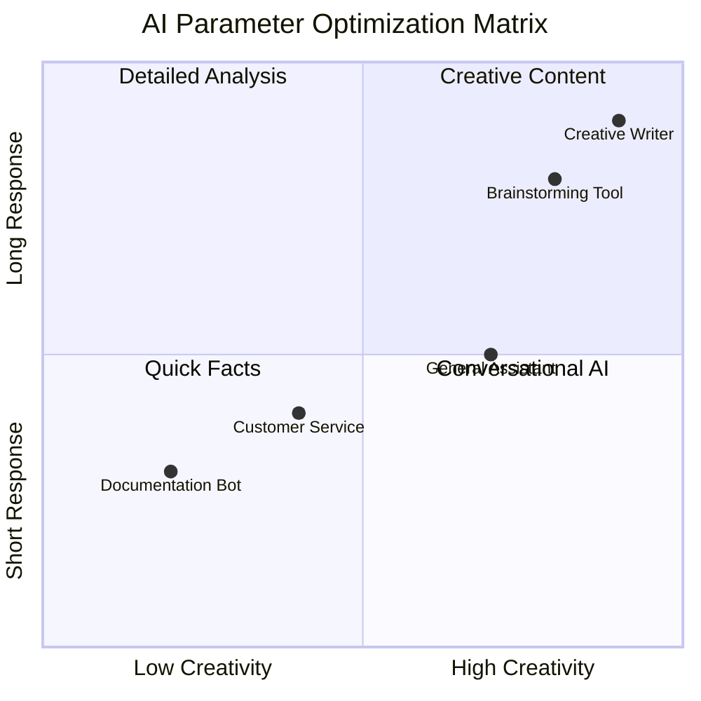

**Miksi nämä parametrit ovat tärkeitä**: Eri sovellukset tarvitsevat erilaisia vastauksia. Asiakaspalvelubotin tulisi olla johdonmukainen ja faktapohjainen (matala lämpötila), kun taas luova kirjoitusavustaja voi olla mielikuvituksellinen ja vaihteleva (korkea lämpötila). Näiden parametrien ymmärtäminen antaa sinulle hallinnan tekoälyn persoonallisuudesta ja vastaustyylistä.
```

**Here's what's happening in this code:**
- **We import** the tools we need: `os` for reading environment variables and `OpenAI` for talking to the AI
- **We set up** the OpenAI client to point to GitHub's AI servers instead of OpenAI directly
- **We authenticate** using a special GitHub token (more on that in a minute!)
- **We structure** our conversation with different "roles" – think of it like setting the scene for a play
- **We send** our request to the AI with some fine-tuning parameters
- **We extract** the actual response text from all the data that comes back

> 🔐 **Security Note**: Never hardcode API keys in your source code! Always use environment variables to store sensitive credentials like your `GITHUB_TOKEN`.

### Creating a Reusable AI Function

Let's refactor this code into a clean, reusable function that we can easily integrate into our web application:

```python
import asyncio
from openai import AsyncOpenAI

# Use AsyncOpenAI for better performance
client = AsyncOpenAI(
    base_url="https://models.github.ai/inference",
    api_key=os.environ["GITHUB_TOKEN"],
)

async def call_llm_async(prompt: str, system_message: str = "You are a helpful assistant."):
    """
    Sends a prompt to the AI model asynchronously and returns the response.
    
    Args:
        prompt: The user's question or message
        system_message: Instructions that define the AI's behavior and personality
    
    Returns:
        str: The AI's response to the prompt
    """
    try:
        response = await client.chat.completions.create(
            messages=[
                {
                    "role": "system",
                    "content": system_message,
                },
                {
                    "role": "user",
                    "content": prompt,
                }
            ],
            model="openai/gpt-4o-mini",
            temperature=1,
            max_tokens=4096,
            top_p=1
        )
        return response.choices[0].message.content
    except Exception as e:
        logger.error(f"AI API error: {str(e)}")
        return "I'm sorry, I'm having trouble processing your request right now."

# Backward compatibility function for synchronous calls
def call_llm(prompt: str, system_message: str = "You are a helpful assistant."):
    """Synchronous wrapper for async AI calls."""
    return asyncio.run(call_llm_async(prompt, system_message))
```

**Parannetun funktion ymmärtäminen:**
- **Hyväksyy** kaksi parametria: käyttäjän kysymyksen ja valinnaisen järjestelmäviestin
- **Tarjoaa** oletusjärjestelmäviestin yleiseen avustajakäyttäytymiseen
- **Käyttää** oikeita Python-tyyppivihjeitä paremman koodidokumentaation vuoksi
- **Palauttaa** vain vastaussisällön, mikä tekee siitä helppokäyttöisen verkkosovellusrajapinnassamme
- **Säilyttää** samat malliparametrit johdonmukaisen tekoälykäyttäytymisen varmistamiseksi

### Järjestelmäviestien taika: Tekoälyn persoonallisuuden ohjelmointi

Jos parametrit ohjaavat tekoälyn ajattelua, järjestelmäviestit ohjaavat sitä, kuka tekoäly kuvittelee olevansa. Tämä on rehellisesti sanottuna yksi siisteimmistä asioista tekoälyn kanssa työskentelyssä – annat tekoälylle käytännössä kokonaisen persoonallisuuden, asiantuntijuuden tason ja viestintätyylin.

**Ajattele järjestelmäviestejä kuin eri rooleihin valittuja näyttelijöitä**: Sen sijaan, että sinulla olisi yksi geneerinen avustaja, voit luoda erikoistuneita asiantuntijoita eri tilanteisiin. Tarvitsetko kärsivällisen opettajan? Luovan ideointikumppanin? Jämäkän liikeneuvojan? Vaihda vain järjestelmäviesti!

#### Miksi järjestelmäviestit ovat niin voimakkaita

Tässä on kiehtova osa: Tekoälymallit on koulutettu lukemattomilla keskusteluilla, joissa ihmiset omaksuvat erilaisia rooleja ja asiantuntijuuden tasoja. Kun annat tekoälylle tietyn roolin, se on kuin kytkisit päälle kytkimen, joka aktivoi kaikki nämä opitut mallit.

**Se on kuin metodinäyttelemistä tekoälylle**: Kerro näyttelijälle "olet viisas vanha professori" ja katso, kuinka hän automaattisesti muuttaa ryhtiään, sanastoaan ja eleitään. Tekoäly
**2. Tulostuksen muotoilu**: Kerro tekoälylle, miten vastaukset tulee jäsentää  
```python
system_prompt = """
You are a technical mentor. Always structure your responses as:
1. Quick Answer (1-2 sentences)
2. Detailed Explanation 
3. Code Example
4. Common Pitfalls to Avoid
5. Next Steps for Learning
"""
```
  
**3. Rajoitusten asettaminen**: Määrittele, mitä tekoäly EI saa tehdä  
```python
system_prompt = """
You are a coding tutor focused on teaching best practices. Never write complete 
solutions for the user - instead, guide them with hints and questions so they 
learn by doing. Always explain the 'why' behind coding decisions.
"""
```
  
#### Miksi tämä on tärkeää chat-avustajallesi  

Järjestelmäkehotteiden ymmärtäminen antaa sinulle uskomattoman voiman luoda erikoistuneita tekoälyavustajia:  
- **Asiakaspalvelubotti**: Avulias, kärsivällinen, tietoinen käytännöistä  
- **Oppimistutor**: Kannustava, vaiheittainen, tarkistaa ymmärryksen  
- **Luova kumppani**: Mielikuvituksellinen, kehittää ideoita, kysyy "entä jos?"  
- **Tekninen asiantuntija**: Tarkka, yksityiskohtainen, tietoturvatietoinen  

**Keskeinen oivallus**: Et vain käytä tekoäly-APIa – luot räätälöidyn tekoälypersoonan, joka palvelee juuri sinun käyttötarkoitustasi. Tämä tekee moderneista tekoälysovelluksista yksilöllisiä ja hyödyllisiä, eikä geneerisiä.  

### 🎯 Pedagoginen tarkistus: Tekoälypersoonan ohjelmointi  

**Pysähdy ja pohdi**: Olet juuri oppinut ohjelmoimaan tekoälypersoonia järjestelmäkehotteiden avulla. Tämä on perustaito modernissa tekoälysovelluskehityksessä.  

**Pikainen itsearviointi**:  
- Osaatko selittää, miten järjestelmäkehotteet eroavat tavallisista käyttäjäviesteistä?  
- Mikä ero on temperature- ja top_p-parametreilla?  
- Miten loisit järjestelmäkehotteen tiettyä käyttötarkoitusta varten (esim. koodausopettaja)?  

**Yhteys tosielämään**: Olet oppinut järjestelmäkehotetekniikoita, joita käytetään kaikissa suurimmissa tekoälysovelluksissa – GitHub Copilotin koodausavusta ChatGPT:n keskustelukäyttöliittymään. Hallitset samoja kaavoja, joita suurten teknologiayritysten tekoälytuotetiimit käyttävät.  

**Haastekysymys**: Miten suunnittelisit erilaisia tekoälypersoonia eri käyttäjätyypeille (aloittelija vs. asiantuntija)? Mieti, miten sama tekoälymalli voisi palvella eri yleisöjä kehotteiden suunnittelun avulla.  

## Web-rajapinnan rakentaminen FastAPI:lla: Korkean suorituskyvyn tekoälyviestintäkeskus  

Rakennetaan nyt taustajärjestelmä, joka yhdistää käyttöliittymäsi tekoälypalveluihin. Käytämme FastAPI:ta, modernia Python-kehystä, joka on erinomainen API:en rakentamiseen tekoälysovelluksia varten.  

FastAPI tarjoaa useita etuja tällaiselle projektille: sisäänrakennettu async-tuki samanaikaisten pyyntöjen käsittelyyn, automaattinen API-dokumentaation luonti ja erinomainen suorituskyky. FastAPI-palvelimesi toimii välittäjänä, joka vastaanottaa pyyntöjä käyttöliittymästä, kommunikoi tekoälypalveluiden kanssa ja palauttaa muotoillut vastaukset.  

### Miksi FastAPI tekoälysovelluksille?  

Saatat miettiä: "Eikö tekoälyä voi kutsua suoraan käyttöliittymän JavaScriptistä?" tai "Miksi FastAPI eikä Flask tai Django?" Hyviä kysymyksiä!  

**Tässä syyt, miksi FastAPI on täydellinen valinta:**
- **Async oletuksena**: Käsittelee useita tekoälypyyntöjä kerralla ilman jumiutumista  
- **Automaattiset dokumentit**: Käy osoitteessa `/docs` ja saat kauniin, interaktiivisen API-dokumentaation ilmaiseksi  
- **Sisäänrakennettu validointi**: Havaitsee virheet ennen kuin ne aiheuttavat ongelmia  
- **Huippunopea**: Yksi nopeimmista Python-kehyksistä  
- **Moderni Python**: Käyttää kaikkia uusimpia ja parhaita Python-ominaisuuksia  

**Ja tässä syyt, miksi tarvitsemme taustajärjestelmän:**  

**Turvallisuus**: Tekoäly-API-avaimesi on kuin salasana – jos laitat sen käyttöliittymän JavaScriptiin, kuka tahansa, joka näkee verkkosivustosi lähdekoodin, voi varastaa sen ja käyttää tekoälykrediittejäsi. Taustajärjestelmä pitää arkaluontoiset tunnukset turvassa.  

**Käyttörajoitukset ja hallinta**: Taustajärjestelmä antaa sinun hallita, kuinka usein käyttäjät voivat tehdä pyyntöjä, toteuttaa käyttäjätodennuksen ja lisätä lokitietoja käytön seuraamiseksi.  

**Tietojen käsittely**: Saatat haluta tallentaa keskusteluja, suodattaa sopimatonta sisältöä tai yhdistää useita tekoälypalveluita. Taustajärjestelmä on paikka, jossa tämä logiikka sijaitsee.  

**Arkkitehtuuri muistuttaa asiakas-palvelin-mallia:**  
- **Käyttöliittymä**: Käyttäjän vuorovaikutuskerros  
- **Taustajärjestelmän API**: Pyyntöjen käsittely- ja reitityskerros  
- **Tekoälypalvelu**: Ulkoinen laskenta ja vastausten generointi  
- **Ympäristömuuttujat**: Turvallinen konfiguraatio ja tunnusten tallennus  

### Pyyntö-vastausvirran ymmärtäminen  

Käydään läpi, mitä tapahtuu, kun käyttäjä lähettää viestin:  

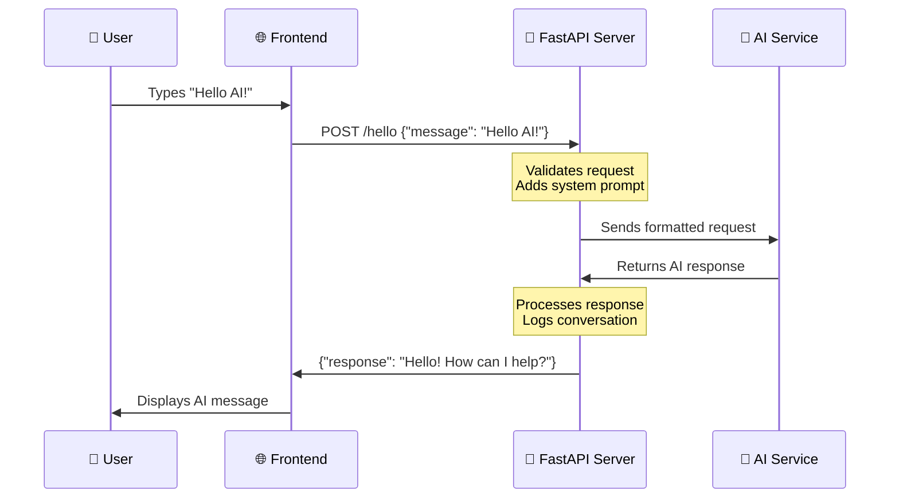
  
**Jokaisen vaiheen ymmärtäminen:**  
1. **Käyttäjän vuorovaikutus**: Henkilö kirjoittaa viestin keskustelukäyttöliittymään  
2. **Käyttöliittymän käsittely**: JavaScript tallentaa syötteen ja muotoilee sen JSON-muotoon  
3. **API-validointi**: FastAPI validoi pyynnön automaattisesti Pydantic-mallien avulla  
4. **Tekoälyintegraatio**: Taustajärjestelmä lisää kontekstin (järjestelmäkehotteen) ja kutsuu tekoälypalvelua  
5. **Vastauksen käsittely**: API vastaanottaa tekoälyn vastauksen ja voi muokata sitä tarvittaessa  
6. **Käyttöliittymän näyttö**: JavaScript näyttää vastauksen keskustelukäyttöliittymässä  

### API-arkkitehtuurin ymmärtäminen  

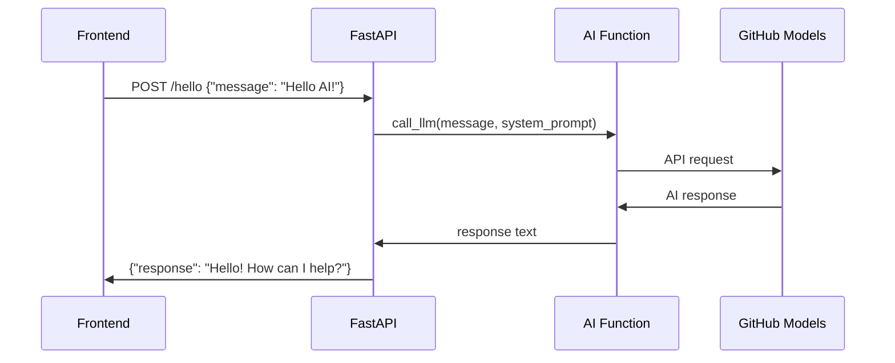
  
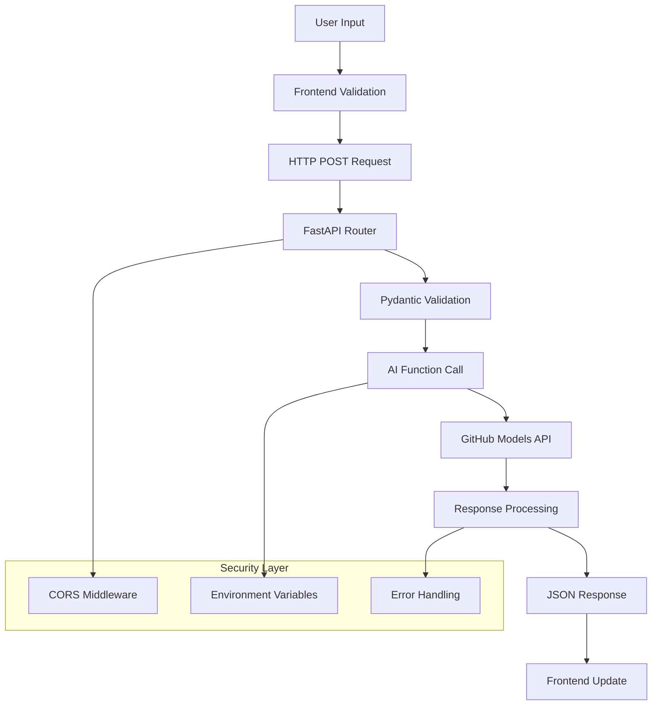
  
### FastAPI-sovelluksen luominen  

Rakennetaan API vaihe vaiheelta. Luo tiedosto nimeltä `api.py` seuraavalla FastAPI-koodilla:  

```python
# api.py
from fastapi import FastAPI, HTTPException
from fastapi.middleware.cors import CORSMiddleware
from pydantic import BaseModel
from llm import call_llm
import logging

# Configure logging
logging.basicConfig(level=logging.INFO)
logger = logging.getLogger(__name__)

# Create FastAPI application
app = FastAPI(
    title="AI Chat API",
    description="A high-performance API for AI-powered chat applications",
    version="1.0.0"
)

# Configure CORS
app.add_middleware(
    CORSMiddleware,
    allow_origins=["*"],  # Configure appropriately for production
    allow_credentials=True,
    allow_methods=["*"],
    allow_headers=["*"],
)

# Pydantic models for request/response validation
class ChatMessage(BaseModel):
    message: str

class ChatResponse(BaseModel):
    response: str

@app.get("/")
async def root():
    """Root endpoint providing API information."""
    return {
        "message": "Welcome to the AI Chat API",
        "docs": "/docs",
        "health": "/health"
    }

@app.get("/health")
async def health_check():
    """Health check endpoint."""
    return {"status": "healthy", "service": "ai-chat-api"}

@app.post("/hello", response_model=ChatResponse)
async def chat_endpoint(chat_message: ChatMessage):
    """Main chat endpoint that processes messages and returns AI responses."""
    try:
        # Extract and validate message
        message = chat_message.message.strip()
        if not message:
            raise HTTPException(status_code=400, detail="Message cannot be empty")
        
        logger.info(f"Processing message: {message[:50]}...")
        
        # Call AI service (note: call_llm should be made async for better performance)
        ai_response = await call_llm_async(message, "You are a helpful and friendly assistant.")
        
        logger.info("AI response generated successfully")
        return ChatResponse(response=ai_response)
        
    except HTTPException:
        raise
    except Exception as e:
        logger.error(f"Error processing chat message: {str(e)}")
        raise HTTPException(status_code=500, detail="Internal server error")

if __name__ == "__main__":
    import uvicorn
    uvicorn.run(app, host="0.0.0.0", port=5000, reload=True)
```
  
**FastAPI-toteutuksen ymmärtäminen:**  
- **Tuodaan** FastAPI modernin verkkokehyksen toiminnallisuuksia varten ja Pydantic tietojen validointiin  
- **Luodaan** automaattinen API-dokumentaatio (saatavilla osoitteessa `/docs`, kun palvelin on käynnissä)  
- **Mahdollistetaan** CORS-väliohjelmisto, jotta käyttöliittymäpyynnöt eri alkuperistä ovat sallittuja  
- **Määritellään** Pydantic-mallit automaattista pyyntöjen/vastausten validointia ja dokumentaatiota varten  
- **Käytetään** asynkronisia päätepisteitä paremman suorituskyvyn takaamiseksi samanaikaisissa pyynnöissä  
- **Toteutetaan** oikeat HTTP-tilakoodit ja virheenkäsittely HTTPExceptionin avulla  
- **Sisällytetään** jäsennelty lokitus seurantaa ja virheenkorjausta varten  
- **Tarjotaan** terveystarkistuspäätepiste palvelun tilan seuraamiseksi  

**Keskeiset FastAPI:n edut perinteisiin kehyksiin verrattuna:**  
- **Automaattinen validointi**: Pydantic-mallit varmistavat tietojen eheyden ennen käsittelyä  
- **Interaktiiviset dokumentit**: Käy osoitteessa `/docs` saadaksesi automaattisesti luodun, testattavan API-dokumentaation  
- **Tyyppiturvallisuus**: Python-tyyppivihjeet estävät ajonaikaisia virheitä ja parantavat koodin laatua  
- **Async-tuki**: Käsittelee useita tekoälypyyntöjä samanaikaisesti ilman estämistä  
- **Suorituskyky**: Merkittävästi nopeampi pyyntöjen käsittely reaaliaikaisissa sovelluksissa  

### CORS: Verkon turvavahti  

CORS (Cross-Origin Resource Sharing) on kuin rakennuksen turvamies, joka tarkistaa, saavatko vierailijat tulla sisään. Ymmärretään, miksi tämä on tärkeää ja miten se vaikuttaa sovellukseesi.  

#### Mikä on CORS ja miksi se on olemassa?  

**Ongelma**: Kuvittele, jos mikä tahansa verkkosivusto voisi tehdä pyyntöjä pankkisi verkkosivustolle puolestasi ilman lupaasi. Se olisi tietoturvakatastrofi! Selaimet estävät tämän oletuksena "Same-Origin Policy" -käytännön avulla.  

**Same-Origin Policy**: Selaimet sallivat verkkosivujen tehdä pyyntöjä vain samasta verkkotunnuksesta, portista ja protokollasta, josta ne ladattiin.  

**Tosielämän analogia**: Se on kuin kerrostalon turva – vain asukkaat (sama alkuperä) pääsevät rakennukseen oletuksena. Jos haluat päästää ystävän (eri alkuperä) sisään, sinun on nimenomaisesti ilmoitettava turvalle, että se on ok.  

#### CORS kehitysympäristössäsi  

Kehityksen aikana käyttöliittymäsi ja taustajärjestelmäsi toimivat eri porteissa:  
- Käyttöliittymä: `http://localhost:3000` (tai file:// jos avaat HTML:n suoraan)  
- Taustajärjestelmä: `http://localhost:5000`  

Nämä katsotaan "eri alkuperiksi", vaikka ne olisivat samalla tietokoneella!  

```python
from fastapi.middleware.cors import CORSMiddleware

app = FastAPI(__name__)
CORS(app)   # This tells browsers: "It's okay for other origins to make requests to this API"
```
  
**Mitä CORS-konfiguraatio tekee käytännössä:**  
- **Lisää** erityisiä HTTP-otsikoita API-vastauksiin, jotka kertovat selaimille, että "tämä eri alkuperän pyyntö on sallittu"  
- **Käsittelee** "esikysely"-pyyntöjä (selaimet tarkistavat joskus oikeudet ennen varsinaisen pyynnön lähettämistä)  
- **Estää** pelätyn "blocked by CORS policy" -virheen selaimen konsolissa  

#### CORS-turvallisuus: Kehitys vs tuotanto  

```python
# 🚨 Development: Allows ALL origins (convenient but insecure)
CORS(app)

# ✅ Production: Only allow your specific frontend domain
CORS(app, origins=["https://yourdomain.com", "https://www.yourdomain.com"])

# 🔒 Advanced: Different origins for different environments
if app.debug:  # Development mode
    CORS(app, origins=["http://localhost:3000", "http://127.0.0.1:3000"])
else:  # Production mode
    CORS(app, origins=["https://yourdomain.com"])
```
  
**Miksi tämä on tärkeää**: Kehityksessä `CORS(app)` on kuin jättäisit etuoven lukitsematta – kätevää mutta ei turvallista. Tuotannossa haluat määritellä tarkasti, mitkä verkkosivustot voivat kommunikoida API:si kanssa.  

#### Yleiset CORS-tilanteet ja ratkaisut  

| Tilanne | Ongelma | Ratkaisu |  
|----------|---------|----------|  
| **Paikallinen kehitys** | Käyttöliittymä ei pääse taustajärjestelmään | Lisää CORSMiddleware FastAPI:hin |  
| **GitHub Pages + Heroku** | Julkaistu käyttöliittymä ei pääse API:iin | Lisää GitHub Pages -URL CORS-alkuperiin |  
| **Oma verkkotunnus** | CORS-virheet tuotannossa | Päivitä CORS-alkuperät vastaamaan verkkotunnustasi |  
| **Mobiilisovellus** | Sovellus ei pääse verkkorajapintaan | Lisää sovelluksesi verkkotunnus tai käytä `*` varoen |  

**Vinkki**: Voit tarkistaa CORS-otsikot selaimesi kehittäjätyökaluista Verkko-välilehdeltä. Etsi vastauksesta otsikoita, kuten `Access-Control-Allow-Origin`.  

### Virheenkäsittely ja validointi  

Huomaa, kuinka API sisältää asianmukaisen virheenkäsittelyn:  

```python
# Validate that we received a message
if not message:
    return jsonify({"error": "Message field is required"}), 400
```
  
**Keskeiset validointiperiaatteet:**  
- **Tarkistaa** vaaditut kentät ennen pyyntöjen käsittelyä  
- **Palauttaa** merkitykselliset virheilmoitukset JSON-muodossa  
- **Käyttää** sopivia HTTP-tilakoodeja (400 virheellisille pyynnöille)  
- **Tarjoaa** selkeää palautetta, joka auttaa käyttöliittymäkehittäjiä virheiden selvittämisessä  

## Taustajärjestelmän asennus ja käynnistys  

Nyt kun tekoälyintegraatiomme ja FastAPI-palvelimemme on valmis, käynnistetään kaikki. Asennusprosessi sisältää Python-riippuvuuksien asentamisen, ympäristömuuttujien konfiguroinnin ja kehityspalvelimen käynnistämisen.  

### Python-ympäristön asennus  

Määritetään Python-kehitysympäristösi. Virtuaaliympäristöt ovat kuin Manhattan-projektin eristetty lähestymistapa – jokaisella projektilla on oma erillinen tila, jossa on tietyt työkalut ja riippuvuudet, mikä estää ristiriidat eri projektien välillä.  

```bash
# Navigate to your backend directory
cd backend

# Create a virtual environment (like creating a clean room for your project)
python -m venv venv

# Activate it (Linux/Mac)
source ./venv/bin/activate

# On Windows, use:
# venv\Scripts\activate

# Install the good stuff
pip install openai fastapi uvicorn python-dotenv
```
  
**Mitä juuri teimme:**  
- **Loin** oman pienen Python-kuplan, jossa voimme asentaa paketteja vaikuttamatta muihin projekteihin  
- **Aktivoin** sen, jotta terminaalimme tietää käyttää juuri tätä ympäristöä  
- **Asensin** olennaiset työkalut: OpenAI tekoälytaikuutta varten, FastAPI verkkorajapintaa varten, Uvicorn sen ajamiseen ja python-dotenv turvalliseen salaisuuksien hallintaan  

**Keskeiset riippuvuudet selitettynä:**  
- **FastAPI**: Moderni, nopea verkkokehys automaattisella API-dokumentaatiolla  
- **Uvicorn**: Huippunopea ASGI-palvelin, joka ajaa FastAPI-sovelluksia  
- **OpenAI**: Virallinen kirjasto GitHub-mallien ja OpenAI API:n integrointiin  
- **python-dotenv**: Turvallinen ympäristömuuttujien lataus .env-tiedostoista  

### Ympäristökonfiguraatio: Salaisuuksien pitäminen turvassa  

Ennen kuin käynnistämme API:mme, meidän on puhuttava yhdestä verkkokehityksen tärkeimmästä oppitunnista: kuinka pitää salaisuudet oikeasti salassa. Ympäristömuuttujat ovat kuin turvallinen holvi, johon vain sovelluksesi pääsee käsiksi.  

#### Mitä ympäristömuuttujat ovat?  

**Ajattele ympäristömuuttujia kuin tallelokeroa** – laitat arvokkaat tavarasi sinne, ja vain sinulla (ja sovelluksellasi) on avain niiden avaamiseen. Sen sijaan, että kirjoittaisit arkaluontoisia tietoja suoraan koodiin (jossa kuka tahansa voi nähdä ne), tallennat ne turvallisesti ympäristöön.  

**Tässä ero:**  
- **Väärä tapa**: Kirjoitat salasanasi muistilapulle ja kiinnität sen näyttöön  
- **Oikea tapa**: Säilytät salasanasi turvallisessa salasananhallinnassa, johon vain sinulla on pääsy  

#### Miksi ympäristömuuttujat ovat tärkeitä  

```python
# 🚨 NEVER DO THIS - API key visible to everyone
client = OpenAI(
    api_key="ghp_1234567890abcdef...",  # Anyone can steal this!
    base_url="https://models.github.ai/inference"
)

# ✅ DO THIS - API key stored securely
client = OpenAI(
    api_key=os.environ["GITHUB_TOKEN"],  # Only your app can access this
    base_url="https://models.github.ai/inference"
)
```
  
**Mitä tapahtuu, kun kovakoodaat salaisuuksia:**  
1. **Versionhallinnan paljastuminen**: Kuka tahansa, jolla on pääsy Git-repositorioon, näkee API-avaimesi  
2. **Julkiset repositoriot**: Jos lataat GitHubiin, avaimesi on näkyvissä koko internetille  
3. **Tiimijako**: Muut projektin kehittäjät saavat pääsyn henkilökohtaiseen API-avaimeesi  
4. **Tietoturvaloukkaukset**: Jos joku varastaa API-avaimesi, hän voi käyttää tekoälykrediittejäsi  

#### Ympäristötiedoston asettaminen  

Luo `.env`-tiedosto taustajärjestelmäsi hakemistoon. Tämä tiedosto tallentaa salaisuutesi paikallisesti:  

```bash
# .env file - This should NEVER be committed to Git
GITHUB_TOKEN=your_github_personal_access_token_here
FASTAPI_DEBUG=True
ENVIRONMENT=development
```
  
**.env-tiedoston ymmärtäminen:**  
- **Yksi salaisuus per rivi** muodossa `KEY=value`  
- **Ei välilyöntejä** yhtäläisyysmerkin ympärillä  
- **Ei lainausmerkkejä** arvojen ympärillä (yleensä)  
- **Kommentit** alkavat `#`-merkillä  

#### GitHubin henkilökohtaisen käyttöoikeustunnuksen luominen  

GitHub-tunnuksesi on kuin erityinen salasana, joka antaa sovelluks
Nyt tulee jännittävä hetki – käynnistetään FastAPI-kehityspalvelin ja nähdään, kuinka AI-integraatiosi herää eloon! FastAPI käyttää Uvicornia, salamannopeaa ASGI-palvelinta, joka on erityisesti suunniteltu asynkronisille Python-sovelluksille.

#### FastAPI-palvelimen käynnistysprosessin ymmärtäminen

```bash
# Method 1: Direct Python execution (includes auto-reload)
python api.py

# Method 2: Using Uvicorn directly (more control)
uvicorn api:app --host 0.0.0.0 --port 5000 --reload
```

Kun suoritat tämän komennon, seuraavat asiat tapahtuvat kulissien takana:

**1. Python lataa FastAPI-sovelluksesi**:
- Tuo kaikki tarvittavat kirjastot (FastAPI, Pydantic, OpenAI jne.)
- Lataa ympäristömuuttujat `.env`-tiedostostasi
- Luo FastAPI-sovellusinstanssin automaattisella dokumentaatiolla

**2. Uvicorn konfiguroi ASGI-palvelimen**:
- Liittyy porttiin 5000 asynkronisilla pyyntöjen käsittelyominaisuuksilla
- Asettaa pyyntöjen reitityksen automaattisella validoinnilla
- Mahdollistaa automaattisen uudelleenkäynnistyksen kehitystä varten (käynnistyy uudelleen tiedostomuutosten yhteydessä)
- Generoi interaktiivisen API-dokumentaation

**3. Palvelin alkaa kuunnella**:
- Päätteessäsi näkyy: `INFO: Uvicorn running on http://0.0.0.0:5000`
- Palvelin pystyy käsittelemään useita samanaikaisia AI-pyyntöjä
- API on valmis automaattisilla dokumenteilla osoitteessa `http://localhost:5000/docs`

#### Mitä sinun pitäisi nähdä, kun kaikki toimii

```bash
$ python api.py
INFO:     Will watch for changes in these directories: ['/your/project/path']
INFO:     Uvicorn running on http://0.0.0.0:5000 (Press CTRL+C to quit)
INFO:     Started reloader process [12345] using WatchFiles
INFO:     Started server process [12346]
INFO:     Waiting for application startup.
INFO:     Application startup complete.
```

**FastAPI:n tulosten ymmärtäminen:**
- **Tarkkailee muutoksia**: Automaattinen uudelleenkäynnistys kehitystä varten
- **Uvicorn käynnissä**: Suorituskykyinen ASGI-palvelin on aktiivinen
- **Uudelleenkäynnistysprosessi käynnistetty**: Tiedostojen tarkkailija automaattisia uudelleenkäynnistyksiä varten
- **Sovelluksen käynnistys valmis**: FastAPI-sovellus alustettu onnistuneesti
- **Interaktiivinen dokumentaatio saatavilla**: Käy `/docs`-osoitteessa automaattista API-dokumentaatiota varten

#### FastAPI:n testaaminen: useita tehokkaita lähestymistapoja

FastAPI tarjoaa useita käteviä tapoja testata API:ta, mukaan lukien automaattinen interaktiivinen dokumentaatio:

**Menetelmä 1: Interaktiivinen API-dokumentaatio (suositeltava)**
1. Avaa selaimesi ja mene osoitteeseen `http://localhost:5000/docs`
2. Näet Swagger UI:n, jossa kaikki päätepisteet on dokumentoitu
3. Klikkaa `/hello` → "Try it out" → Syötä testiviesti → "Execute"
4. Näe vastaus suoraan selaimessa oikeassa muodossa

**Menetelmä 2: Perustason selaintesti**
1. Mene osoitteeseen `http://localhost:5000` tarkistaaksesi juuripäätepisteen
2. Mene osoitteeseen `http://localhost:5000/health` tarkistaaksesi palvelimen tilan
3. Tämä vahvistaa, että FastAPI-palvelimesi toimii oikein

**Menetelmä 3: Komentorivitesti (edistynyt)**
```bash
# Test with curl (if available)
curl -X POST http://localhost:5000/hello \
  -H "Content-Type: application/json" \
  -d '{"message": "Hello AI!"}'

# Expected response:
# {"response": "Hello! I'm your AI assistant. How can I help you today?"}
```

**Menetelmä 4: Python-testiskripti**
```python
# test_api.py - Create this file to test your API
import requests
import json

# Test the API endpoint
url = "http://localhost:5000/hello"
data = {"message": "Tell me a joke about programming"}

response = requests.post(url, json=data)
if response.status_code == 200:
    result = response.json()
    print("AI Response:", result['response'])
else:
    print("Error:", response.status_code, response.text)
```

#### Yleisten käynnistysongelmien vianmääritys

| Virheilmoitus | Mitä se tarkoittaa | Kuinka korjata |
|---------------|--------------------|----------------|
| `ModuleNotFoundError: No module named 'fastapi'` | FastAPI ei ole asennettu | Suorita `pip install fastapi uvicorn` virtuaaliympäristössäsi |
| `ModuleNotFoundError: No module named 'uvicorn'` | ASGI-palvelin ei ole asennettu | Suorita `pip install uvicorn` virtuaaliympäristössäsi |
| `KeyError: 'GITHUB_TOKEN'` | Ympäristömuuttujaa ei löydy | Tarkista `.env`-tiedostosi ja `load_dotenv()`-kutsu |
| `Address already in use` | Portti 5000 on varattu | Lopeta muut prosessit, jotka käyttävät porttia 5000, tai vaihda portti |
| `ValidationError` | Pyyntödata ei vastaa Pydantic-mallia | Tarkista, että pyyntösi muoto vastaa odotettua kaavaa |
| `HTTPException 422` | Käsittelemätön entiteetti | Pyynnön validointi epäonnistui, tarkista `/docs` oikea muoto |
| `OpenAI API error` | AI-palvelun autentikointi epäonnistui | Varmista, että GitHub-tunnuksesi on oikein ja sillä on asianmukaiset oikeudet |

#### Kehityksen parhaat käytännöt

**Automaattinen uudelleenkäynnistys**: FastAPI ja Uvicorn tarjoavat automaattisen uudelleenkäynnistyksen, kun tallennat muutoksia Python-tiedostoihisi. Tämä tarkoittaa, että voit muokata koodiasi ja testata välittömästi ilman manuaalista uudelleenkäynnistystä.

```python
# Enable hot reloading explicitly
if __name__ == "__main__":
    app.run(host="0.0.0.0", port=5000, debug=True)  # debug=True enables hot reload
```

**Lokitus kehitystä varten**: Lisää lokitusta ymmärtääksesi, mitä tapahtuu:

```python
import logging

# Set up logging
logging.basicConfig(level=logging.INFO)
logger = logging.getLogger(__name__)

@app.route("/hello", methods=["POST"])
def hello():
    data = request.get_json()
    message = data.get("message", "")
    
    logger.info(f"Received message: {message}")
    
    if not message:
        logger.warning("Empty message received")
        return jsonify({"error": "Message field is required"}), 400
    
    try:
        response = call_llm(message, "You are a helpful and friendly assistant.")
        logger.info(f"AI response generated successfully")
        return jsonify({"response": response})
    except Exception as e:
        logger.error(f"AI API error: {str(e)}")
        return jsonify({"error": "AI service temporarily unavailable"}), 500
```

**Miksi lokitus auttaa**: Kehityksen aikana näet tarkalleen, mitä pyyntöjä tulee sisään, mitä AI vastaa ja missä virheet tapahtuvat. Tämä nopeuttaa virheiden korjaamista.

### GitHub Codespacesin konfigurointi: pilvikehitys helposti

GitHub Codespaces on kuin tehokas kehitystietokone pilvessä, johon pääset mistä tahansa selaimesta. Jos työskentelet Codespacesissa, on muutama lisävaihe, jotta backendisi on käytettävissä frontendillesi.

#### Codespaces-verkkoyhteyksien ymmärtäminen

Paikallisessa kehitysympäristössä kaikki toimii samalla tietokoneella:
- Backend: `http://localhost:5000`
- Frontend: `http://localhost:3000` (tai file://)

Codespacesissa kehitysympäristösi toimii GitHubin palvelimilla, joten "localhost" tarkoittaa jotain muuta. GitHub luo automaattisesti julkisia URL-osoitteita palveluillesi, mutta sinun täytyy konfiguroida ne oikein.

#### Vaiheittainen Codespaces-konfigurointi

**1. Käynnistä backend-palvelimesi**:
```bash
cd backend
python api.py
```

Näet tutun FastAPI/Uvicorn-käynnistysviestin, mutta huomaat sen toimivan Codespaces-ympäristössä.

**2. Konfiguroi portin näkyvyys**:
- Etsi "Ports"-välilehti VS Code:n alareunasta
- Löydä portti 5000 listasta
- Napsauta porttia 5000 oikealla
- Valitse "Port Visibility" → "Public"

**Miksi tehdä se julkiseksi?** Oletuksena Codespaces-portit ovat yksityisiä (vain sinulle käytettävissä). Julkiseksi tekeminen mahdollistaa frontendin (joka toimii selaimessa) kommunikoinnin backendin kanssa.

**3. Hanki julkinen URL-osoitteesi**:
Kun portti on julkinen, näet URL-osoitteen, kuten:
```
https://your-codespace-name-5000.app.github.dev
```

**4. Päivitä frontend-konfiguraatiosi**:
```javascript
// In your frontend app.js, update the BASE_URL:
this.BASE_URL = "https://your-codespace-name-5000.app.github.dev";
```

#### Codespaces-URL-osoitteiden ymmärtäminen

Codespaces-URL-osoitteet noudattavat ennustettavaa kaavaa:
```
https://[codespace-name]-[port].app.github.dev
```

**Tämän erittely:**
- `codespace-name`: Yksilöllinen tunniste Codespacesille (sisältää yleensä käyttäjänimesi)
- `port`: Porttinumero, jossa palvelusi toimii (5000 FastAPI-sovelluksellemme)
- `app.github.dev`: GitHubin verkkotunnus Codespaces-sovelluksille

#### Codespaces-asetusten testaaminen

**1. Testaa backend suoraan**:
Avaa julkinen URL-osoitteesi uudessa selainvälilehdessä. Sinun pitäisi nähdä:
```
Welcome to the AI Chat API. Send POST requests to /hello with JSON payload containing 'message' field.
```

**2. Testaa selaimen kehitystyökaluilla**:
```javascript
// Open browser console and test your API
fetch('https://your-codespace-name-5000.app.github.dev/hello', {
  method: 'POST',
  headers: {'Content-Type': 'application/json'},
  body: JSON.stringify({message: 'Hello from Codespaces!'})
})
.then(response => response.json())
.then(data => console.log(data));
```

#### Codespaces vs paikallinen kehitys

| Ominaisuus | Paikallinen kehitys | GitHub Codespaces |
|------------|---------------------|-------------------|
| **Asennusaika** | Pidempi (Pythonin ja riippuvuuksien asennus) | Välitön (esiasetettu ympäristö) |
| **URL-käyttö** | `http://localhost:5000` | `https://xyz-5000.app.github.dev` |
| **Porttien konfigurointi** | Automaattinen | Manuaalinen (porttien julkistaminen) |
| **Tiedostojen säilyvyys** | Paikallinen kone | GitHub-repositorio |
| **Yhteistyö** | Vaikea jakaa ympäristöä | Helppo jakaa Codespaces-linkki |
| **Internet-riippuvuus** | Vain AI-API-kutsuille | Tarvitaan kaikkeen |

#### Codespaces-kehitysvinkit

**Ympäristömuuttujat Codespacesissa**:
`.env`-tiedostosi toimii samalla tavalla Codespacesissa, mutta voit myös asettaa ympäristömuuttujia suoraan Codespacesissa:

```bash
# Set environment variable for the current session
export GITHUB_TOKEN="your_token_here"

# Or add to your .bashrc for persistence
echo 'export GITHUB_TOKEN="your_token_here"' >> ~/.bashrc
```

**Porttien hallinta**:
- Codespaces havaitsee automaattisesti, kun sovelluksesi alkaa kuunnella porttia
- Voit välittää useita portteja samanaikaisesti (hyödyllistä, jos lisäät myöhemmin tietokannan)
- Portit pysyvät käytettävissä niin kauan kuin Codespaces on käynnissä

**Kehitystyönkulku**:
1. Tee koodimuutoksia VS Code:ssa
2. FastAPI käynnistyy automaattisesti uudelleen (kiitos Uvicornin reload-tilan)
3. Testaa muutokset välittömästi julkisen URL-osoitteen kautta
4. Tee commit ja push, kun olet valmis

> 💡 **Vinkki**: Lisää Codespaces-backendisi URL kirjanmerkkeihin kehityksen aikana. Koska Codespaces-nimet ovat vakaita, URL ei muutu niin kauan kuin käytät samaa Codespacesia.

## Chat-käyttöliittymän luominen: missä ihmiset kohtaavat tekoälyn

Nyt rakennamme käyttöliittymän – osan, joka määrittää, miten ihmiset ovat vuorovaikutuksessa AI-avustajasi kanssa. Kuten alkuperäisen iPhonen käyttöliittymän suunnittelussa, keskitymme siihen, että monimutkainen teknologia tuntuu intuitiiviselta ja luonnolliselta käyttää.

### Modernin frontend-arkkitehtuurin ymmärtäminen

Chat-käyttöliittymämme tulee olemaan niin sanottu "Single Page Application" eli SPA. Sen sijaan, että vanhanaikaisella menetelmällä jokainen klikkaus lataisi uuden sivun, sovelluksemme päivittyy sujuvasti ja välittömästi:

**Vanhat verkkosivut**: Kuten fyysisen kirjan lukeminen – käännetään kokonaan uusi sivu
**Chat-sovelluksemme**: Kuten puhelimen käyttö – kaikki virtaa ja päivittyy saumattomasti

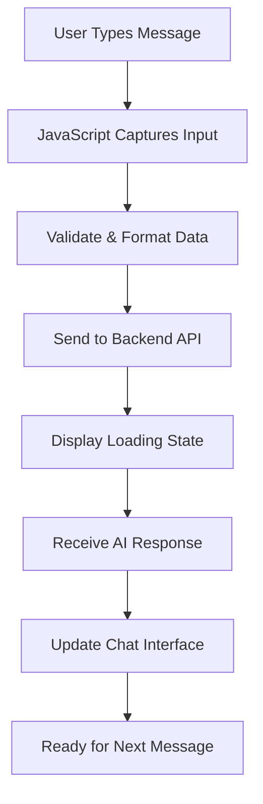

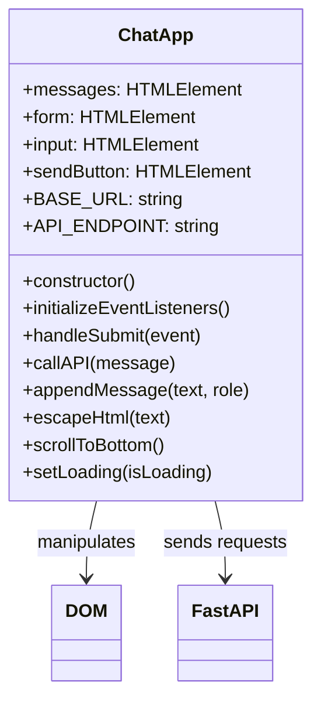

### Kolme frontend-kehityksen peruspilaria

Jokainen frontend-sovellus – yksinkertaisista verkkosivuista monimutkaisiin sovelluksiin, kuten Discord tai Slack – rakentuu kolmen ydinteknologian varaan. Ajattele niitä perustana kaikelle, mitä näet ja miten olet vuorovaikutuksessa verkossa:

**HTML (Rakenne)**: Tämä on perusta
- Määrittää, mitkä elementit ovat olemassa (painikkeet, tekstialueet, säiliöt)
- Antaa sisällölle merkityksen (tämä on otsikko, tämä on lomake jne.)
- Luo perusrakenteen, jonka päälle kaikki muu rakentuu

**CSS (Ulkoasu)**: Tämä on sisustussuunnittelijasi
- Saa kaiken näyttämään kauniilta (värit, fontit, asettelut)
- Käsittelee eri näyttökokoja (puhelin vs. kannettava tietokone vs. tabletti)
- Luo sulavia animaatioita ja visuaalista palautetta

**JavaScript (Käyttäytyminen)**: Tämä on aivot
- Reagoi käyttäjän toimintaan (klikkaukset, kirjoittaminen, vieritys)
- Keskustelee backendin kanssa ja päivittää sivua
- Tekee kaikesta interaktiivista ja dynaamista

**Ajattele sitä kuin arkkitehtuurisuunnittelua:**
- **HTML**: Rakenteellinen pohjapiirros (määrittää tilat ja suhteet)
- **CSS**: Esteettinen ja ympäristön suunnittelu (visuaalinen tyyli ja käyttäjäkokemus)
- **JavaScript**: Mekaaniset järjestelmät (toiminnallisuus ja interaktiivisuus)

### Miksi moderni JavaScript-arkkitehtuuri on tärkeää

Chat-sovelluksemme käyttää moderneja JavaScript-malleja, joita näet ammattimaisissa sovelluksissa. Näiden käsitteiden ymmärtäminen auttaa sinua kehittymään kehittäjänä:

**Luokkapohjainen arkkitehtuuri**: Järjestämme koodimme luokkiin, mikä on kuin luoda piirustuksia objekteille
**Async/Await**: Moderni tapa käsitellä operaatioita, jotka vievät aikaa (kuten API-kutsut)
**Tapahtumapohjainen ohjelmointi**: Sovelluksemme reagoi käyttäjän toimintaan (klikkaukset, näppäinpainallukset) sen sijaan, että se pyörisi silmukassa
**DOM-manipulaatio**: Päivittää verkkosivun sisältöä dynaamisesti käyttäjän vuorovaikutuksen ja API-vastausten perusteella

### Projektirakenteen luominen

Luo frontend-hakemisto tällä järjestelmällisellä rakenteella:

```text
frontend/
├── index.html      # Main HTML structure
├── app.js          # JavaScript functionality
└── styles.css      # Visual styling
```

**Arkkitehtuurin ymmärtäminen:**
- **Erottaa** rakenteen (HTML), käyttäytymisen (JavaScript) ja ulkoasun (CSS)
- **Ylläpitää** yksinkertaista tiedostorakennetta, joka on helppo navigoida ja muokata
- **Noudattaa** verkkokehityksen parhaita käytäntöjä järjestämisen ja ylläpidettävyyden osalta

### HTML-perustan rakentaminen: Semanttinen rakenne saavutettavuuden vuoksi

Aloitetaan HTML-rakenteesta. Moderni verkkokehitys korostaa "semanttista HTML:ää" – HTML-elementtien käyttöä, jotka kuvaavat selkeästi niiden tarkoituksen, eivät vain ulkonäköä. Tämä tekee sovelluksestasi saavutettavan ruudunlukijoille, hakukoneille ja muille työkaluille.

**Miksi semanttinen HTML on tärkeää**: Kuvittele, että kuvailet chat-sovellustasi jollekin puhelimessa. Sanoisit "siellä on otsikko yläosassa, pääalue, jossa keskustelut näkyvät, ja lomake alareunassa viestien kirjoittamista varten." Semanttinen HTML käyttää elementtejä, jotka vastaavat tätä luonnollista kuvausta.

Luo `index.html` tällä huolellisesti rakennetulla merkinnällä:

```html
<!DOCTYPE html>
<html lang="en">
<head>
    <meta charset="UTF-8">
    <meta name="viewport" content="width=device-width, initial-scale=1.0">
    <title>AI Chat Assistant</title>
    <link rel="stylesheet" href="styles.css">
</head>
<body>
    <div class="chat-container">
        <header class="chat-header">
            <h1>AI Chat Assistant</h1>
            <p>Ask me anything!</p>
        </header>
        
        <main class="chat-messages" id="messages" role="log" aria-live="polite">
            <!-- Messages will be dynamically added here -->
        </main>
        
        <form class="chat-form" id="chatForm">
            <div class="input-group">
                <input 
                    type="text" 
                    id="messageInput" 
                    placeholder="Type your message here..." 
                    required
                    aria-label="Chat message input"
                >
                <button type="submit" id="sendBtn" aria-label="Send message">
                    Send
                </button>
            </div>
        </form>
    </div>
    <script src="app.js"></script>
</body>
</html>
```

**Jokaisen HTML-elementin tarkoituksen ymmärtäminen:**

#### Dokumentin rakenne
- **`<!DOCTYPE html>`**: Kertoo selaimelle, että kyseessä on moderni HTML5
- **`<html lang="en">`**: Määrittää sivun kielen ruudunlukijoille ja käännöstyökaluille
- **`<meta charset="UTF-8">`**: Varmistaa oikean merkistökoodauksen kansainväliselle tekstille
- **`<meta name="viewport"...>`**: Tekee sivusta mobiiliystävällisen hallitsemalla zoomausta ja skaalausta

#### Semanttiset elementit
- **`<header>`**: Tunnistaa selkeästi yläosan otsikon ja kuvauksen kanssa
- **`<main>`**: Määrittää ensisijaisen sisältöalueen (missä keskustelut tapahtuvat)
- **`<form>`**: Semanttisesti oikea käyttäjän syötteelle, mahdollistaa asianmukaisen näppäimistön navigoinnin

#### Saavutettavuusominaisuudet
- **`role="log"`**: Kertoo ruudunlukijoille, että tämä alue sisältää kronologisen lokin viesteistä
- **`aria-live="polite"`**: Ilmoittaa uudet viestit ruudunlukijoille keskeyttämättä
- **`aria-label`**: Tarjoaa kuvailevat etiketit lomakekentille
- **`required`**: Selaimen validointi, että käyttäjät syöttävät viestin ennen lähettämistä

#### CSS- ja JavaScript-integraatio
- **`class`-attribuutit**: Tarjoavat tyylittelykoukkuja CSS:
Nyt rakennetaan JavaScript, joka herättää chat-käyttöliittymän eloon. Käytämme moderneja JavaScript-malleja, joita kohtaat ammatillisessa web-kehityksessä, kuten ES6-luokkia, async/await-menetelmiä ja tapahtumapohjaista ohjelmointia.

#### Modernin JavaScript-arkkitehtuurin ymmärtäminen

Sen sijaan, että kirjoittaisimme proseduraalista koodia (sarja peräkkäisiä funktioita), luomme **luokkapohjaisen arkkitehtuurin**. Ajattele luokkaa suunnitelmana, jonka avulla voidaan luoda objekteja – kuten arkkitehdin piirustusta, jota käytetään useiden talojen rakentamiseen.

**Miksi käyttää luokkia web-sovelluksissa?**
- **Organisointi**: Kaikki liittyvä toiminnallisuus on ryhmitelty yhteen
- **Uudelleenkäytettävyys**: Voit luoda useita chat-instansseja samalla sivulla
- **Ylläpidettävyys**: Helpompi debugata ja muokata tiettyjä ominaisuuksia
- **Ammatillinen standardi**: Tätä mallia käytetään esimerkiksi React-, Vue- ja Angular-kehyksissä

Luo `app.js` käyttäen tätä modernia, hyvin jäsenneltyä JavaScriptiä:

```javascript
// app.js - Modern chat application logic

class ChatApp {
    constructor() {
        // Get references to DOM elements we'll need to manipulate
        this.messages = document.getElementById("messages");
        this.form = document.getElementById("chatForm");
        this.input = document.getElementById("messageInput");
        this.sendButton = document.getElementById("sendBtn");
        
        // Configure your backend URL here
        this.BASE_URL = "http://localhost:5000"; // Update this for your environment
        this.API_ENDPOINT = `${this.BASE_URL}/hello`;
        
        // Set up event listeners when the chat app is created
        this.initializeEventListeners();
    }
    
    initializeEventListeners() {
        // Listen for form submission (when user clicks Send or presses Enter)
        this.form.addEventListener("submit", (e) => this.handleSubmit(e));
        
        // Also listen for Enter key in the input field (better UX)
        this.input.addEventListener("keypress", (e) => {
            if (e.key === "Enter" && !e.shiftKey) {
                e.preventDefault();
                this.handleSubmit(e);
            }
        });
    }
    
    async handleSubmit(event) {
        event.preventDefault(); // Prevent form from refreshing the page
        
        const messageText = this.input.value.trim();
        if (!messageText) return; // Don't send empty messages
        
        // Provide user feedback that something is happening
        this.setLoading(true);
        
        // Add user message to chat immediately (optimistic UI)
        this.appendMessage(messageText, "user");
        
        // Clear input field so user can type next message
        this.input.value = '';
        
        try {
            // Call the AI API and wait for response
            const reply = await this.callAPI(messageText);
            
            // Add AI response to chat
            this.appendMessage(reply, "assistant");
        } catch (error) {
            console.error('API Error:', error);
            this.appendMessage("Sorry, I'm having trouble connecting right now. Please try again.", "error");
        } finally {
            // Re-enable the interface regardless of success or failure
            this.setLoading(false);
        }
    }
    
    async callAPI(message) {
        const response = await fetch(this.API_ENDPOINT, {
            method: "POST",
            headers: { 
                "Content-Type": "application/json" 
            },
            body: JSON.stringify({ message })
        });
        
        if (!response.ok) {
            throw new Error(`HTTP error! status: ${response.status}`);
        }
        
        const data = await response.json();
        return data.response;
    }
    
    appendMessage(text, role) {
        const messageElement = document.createElement("div");
        messageElement.className = `message ${role}`;
        messageElement.innerHTML = `
            <div class="message-content">
                <span class="message-text">${this.escapeHtml(text)}</span>
                <span class="message-time">${new Date().toLocaleTimeString()}</span>
            </div>
        `;
        
        this.messages.appendChild(messageElement);
        this.scrollToBottom();
    }
    
    escapeHtml(text) {
        const div = document.createElement('div');
        div.textContent = text;
        return div.innerHTML;
    }
    
    scrollToBottom() {
        this.messages.scrollTop = this.messages.scrollHeight;
    }
    
    setLoading(isLoading) {
        this.sendButton.disabled = isLoading;
        this.input.disabled = isLoading;
        this.sendButton.textContent = isLoading ? "Sending..." : "Send";
    }
}

// Initialize the chat application when the page loads
document.addEventListener("DOMContentLoaded", () => {
    new ChatApp();
});
```

#### Jokaisen JavaScript-konseptin ymmärtäminen

**ES6-luokkarakenne**:
```javascript
class ChatApp {
    constructor() {
        // This runs when you create a new ChatApp instance
        // It's like the "setup" function for your chat
    }
    
    methodName() {
        // Methods are functions that belong to the class
        // They can access class properties using "this"
    }
}
```

**Async/Await-malli**:
```javascript
// Old way (callback hell):
fetch(url)
  .then(response => response.json())
  .then(data => console.log(data))
  .catch(error => console.error(error));

// Modern way (async/await):
try {
    const response = await fetch(url);
    const data = await response.json();
    console.log(data);
} catch (error) {
    console.error(error);
}
```

**Tapahtumapohjainen ohjelmointi**:
Sen sijaan, että jatkuvasti tarkistaisimme, onko jotain tapahtunut, "kuuntelemme" tapahtumia:
```javascript
// When form is submitted, run handleSubmit
this.form.addEventListener("submit", (e) => this.handleSubmit(e));

// When Enter key is pressed, also run handleSubmit
this.input.addEventListener("keypress", (e) => { /* ... */ });
```

**DOM-manipulaatio**:
```javascript
// Create new elements
const messageElement = document.createElement("div");

// Modify their properties
messageElement.className = "message user";
messageElement.innerHTML = "Hello world!";

// Add to the page
this.messages.appendChild(messageElement);
```

#### Turvallisuus ja parhaat käytännöt

**XSS:n estäminen**:
```javascript
escapeHtml(text) {
    const div = document.createElement('div');
    div.textContent = text;  // This automatically escapes HTML
    return div.innerHTML;
}
```

**Miksi tämä on tärkeää**: Jos käyttäjä kirjoittaa `<script>alert('hack')</script>`, tämä funktio varmistaa, että se näkyy tekstinä eikä suorita koodia.

**Virheenkäsittely**:
```javascript
try {
    const reply = await this.callAPI(messageText);
    this.appendMessage(reply, "assistant");
} catch (error) {
    // Show user-friendly error instead of breaking the app
    this.appendMessage("Sorry, I'm having trouble...", "error");
}
```

**Käyttäjäkokemuksen huomioiminen**:
- **Optimistinen käyttöliittymä**: Lisää käyttäjän viesti välittömästi, älä odota palvelimen vastausta
- **Lataustilat**: Poista painikkeet käytöstä ja näytä "Lähetetään..." odotuksen aikana
- **Automaattinen vieritys**: Pidä uusimmat viestit näkyvissä
- **Syötteen validointi**: Älä lähetä tyhjiä viestejä
- **Pikanäppäimet**: Enter-näppäin lähettää viestin (kuten oikeissa chat-sovelluksissa)

#### Sovelluksen kulun ymmärtäminen

1. **Sivun lataus** → `DOMContentLoaded`-tapahtuma käynnistyy → `new ChatApp()` luodaan
2. **Konstruktori käynnistyy** → Hakee DOM-elementtiviittaukset → Asettaa tapahtumakuuntelijat
3. **Käyttäjä kirjoittaa viestin** → Paina Enter tai klikkaa Lähetä → `handleSubmit` käynnistyy
4. **handleSubmit** → Validoi syötteen → Näyttää lataustilan → Kutsuu API:a
5. **API vastaa** → Lisää AI-viesti chattiin → Aktivoi käyttöliittymä uudelleen
6. **Valmis seuraavaan viestiin** → Käyttäjä voi jatkaa keskustelua

Tämä arkkitehtuuri on skaalautuva – voit helposti lisätä ominaisuuksia, kuten viestien muokkaamisen, tiedostojen lataamisen tai useita keskusteluketjuja ilman, että ydinrakennetta tarvitsee kirjoittaa uudelleen.

### 🎯 Pedagoginen tarkistus: Moderni frontend-arkkitehtuuri

**Arkkitehtuurin ymmärtäminen**: Olet toteuttanut täydellisen yhden sivun sovelluksen käyttäen moderneja JavaScript-malleja. Tämä edustaa ammatillisen tason frontend-kehitystä.

**Keskeiset opitut käsitteet**:
- **ES6-luokkarakenne**: Jäsennelty, helposti ylläpidettävä koodirakenne
- **Async/Await-mallit**: Moderni asynkroninen ohjelmointi
- **Tapahtumapohjainen ohjelmointi**: Reagoiva käyttöliittymäsuunnittelu
- **Turvallisuuden parhaat käytännöt**: XSS:n estäminen ja syötteen validointi

**Yhteys teollisuuteen**: Oppimasi mallit (luokkapohjainen arkkitehtuuri, asynkroniset toiminnot, DOM-manipulaatio) ovat modernien kehysten, kuten Reactin, Vuen ja Angularin, perusta. Rakennat samalla arkkitehtuuriajattelulla, jota käytetään tuotantosovelluksissa.

**Pohdintakysymys**: Miten laajentaisit tätä chat-sovellusta käsittelemään useita keskusteluja tai käyttäjäautentikointia? Mieti tarvittavia arkkitehtuurimuutoksia ja miten luokkarakenne kehittyisi.

### Chat-käyttöliittymän tyylittely

Nyt luodaan moderni, visuaalisesti houkutteleva chat-käyttöliittymä CSS:n avulla. Hyvä tyylittely tekee sovelluksesta ammattimaisen ja parantaa kokonaisvaltaista käyttäjäkokemusta. Käytämme moderneja CSS-ominaisuuksia, kuten Flexboxia, CSS Gridia ja mukautettuja ominaisuuksia responsiivisen, saavutettavan suunnittelun luomiseksi.

Luo `styles.css` näillä kattavilla tyyleillä:

```css
/* styles.css - Modern chat interface styling */

:root {
    --primary-color: #2563eb;
    --secondary-color: #f1f5f9;
    --user-color: #3b82f6;
    --assistant-color: #6b7280;
    --error-color: #ef4444;
    --text-primary: #1e293b;
    --text-secondary: #64748b;
    --border-radius: 12px;
    --shadow: 0 4px 6px -1px rgba(0, 0, 0, 0.1);
}

* {
    margin: 0;
    padding: 0;
    box-sizing: border-box;
}

body {
    font-family: -apple-system, BlinkMacSystemFont, 'Segoe UI', Roboto, sans-serif;
    background: linear-gradient(135deg, #667eea 0%, #764ba2 100%);
    min-height: 100vh;
    display: flex;
    align-items: center;
    justify-content: center;
    padding: 20px;
}

.chat-container {
    width: 100%;
    max-width: 800px;
    height: 600px;
    background: white;
    border-radius: var(--border-radius);
    box-shadow: var(--shadow);
    display: flex;
    flex-direction: column;
    overflow: hidden;
}

.chat-header {
    background: var(--primary-color);
    color: white;
    padding: 20px;
    text-align: center;
}

.chat-header h1 {
    font-size: 1.5rem;
    margin-bottom: 5px;
}

.chat-header p {
    opacity: 0.9;
    font-size: 0.9rem;
}

.chat-messages {
    flex: 1;
    padding: 20px;
    overflow-y: auto;
    display: flex;
    flex-direction: column;
    gap: 15px;
    background: var(--secondary-color);
}

.message {
    display: flex;
    max-width: 80%;
    animation: slideIn 0.3s ease-out;
}

.message.user {
    align-self: flex-end;
}

.message.user .message-content {
    background: var(--user-color);
    color: white;
    border-radius: var(--border-radius) var(--border-radius) 4px var(--border-radius);
}

.message.assistant {
    align-self: flex-start;
}

.message.assistant .message-content {
    background: white;
    color: var(--text-primary);
    border-radius: var(--border-radius) var(--border-radius) var(--border-radius) 4px;
    border: 1px solid #e2e8f0;
}

.message.error .message-content {
    background: var(--error-color);
    color: white;
    border-radius: var(--border-radius);
}

.message-content {
    padding: 12px 16px;
    box-shadow: var(--shadow);
    position: relative;
}

.message-text {
    display: block;
    line-height: 1.5;
    word-wrap: break-word;
}

.message-time {
    display: block;
    font-size: 0.75rem;
    opacity: 0.7;
    margin-top: 5px;
}

.chat-form {
    padding: 20px;
    border-top: 1px solid #e2e8f0;
    background: white;
}

.input-group {
    display: flex;
    gap: 10px;
    align-items: center;
}

#messageInput {
    flex: 1;
    padding: 12px 16px;
    border: 2px solid #e2e8f0;
    border-radius: var(--border-radius);
    font-size: 1rem;
    outline: none;
    transition: border-color 0.2s ease;
}

#messageInput:focus {
    border-color: var(--primary-color);
}

#messageInput:disabled {
    background: #f8fafc;
    opacity: 0.6;
    cursor: not-allowed;
}

#sendBtn {
    padding: 12px 24px;
    background: var(--primary-color);
    color: white;
    border: none;
    border-radius: var(--border-radius);
    font-size: 1rem;
    font-weight: 600;
    cursor: pointer;
    transition: background-color 0.2s ease;
    min-width: 80px;
}

#sendBtn:hover:not(:disabled) {
    background: #1d4ed8;
}

#sendBtn:disabled {
    background: #94a3b8;
    cursor: not-allowed;
}

@keyframes slideIn {
    from {
        opacity: 0;
        transform: translateY(10px);
    }
    to {
        opacity: 1;
        transform: translateY(0);
    }
}

/* Responsive design for mobile devices */
@media (max-width: 768px) {
    body {
        padding: 10px;
    }
    
    .chat-container {
        height: calc(100vh - 20px);
        border-radius: 8px;
    }
    
    .message {
        max-width: 90%;
    }
    
    .input-group {
        flex-direction: column;
        gap: 10px;
    }
    
    #messageInput {
        width: 100%;
    }
    
    #sendBtn {
        width: 100%;
    }
}

/* Accessibility improvements */
@media (prefers-reduced-motion: reduce) {
    .message {
        animation: none;
    }
    
    * {
        transition: none !important;
    }
}

/* Dark mode support */
@media (prefers-color-scheme: dark) {
    .chat-container {
        background: #1e293b;
        color: #f1f5f9;
    }
    
    .chat-messages {
        background: #0f172a;
    }
    
    .message.assistant .message-content {
        background: #334155;
        color: #f1f5f9;
        border-color: #475569;
    }
    
    .chat-form {
        background: #1e293b;
        border-color: #475569;
    }
    
    #messageInput {
        background: #334155;
        color: #f1f5f9;
        border-color: #475569;
    }
}
```

**CSS-arkkitehtuurin ymmärtäminen:**
- **Käyttää** CSS-mukautettuja ominaisuuksia (muuttujia) yhtenäiseen teemaan ja helppoon ylläpitoon
- **Toteuttaa** Flexbox-asettelun responsiiviseen suunnitteluun ja oikeaan kohdistukseen
- **Sisältää** pehmeitä animaatioita viestien ilmestymiseen ilman häiritsevyyttä
- **Tarjoaa** visuaalisen erottelun käyttäjän viestien, AI-vastausten ja virhetilojen välillä
- **Tukee** responsiivista suunnittelua, joka toimii sekä työpöydällä että mobiililaitteilla
- **Huomioi** saavutettavuuden vähennettyjen liikeasetusten ja oikeiden kontrastisuhteiden avulla
- **Tarjoaa** tumma tila -tuen käyttäjän järjestelmäasetusten perusteella

### Backend-URL:n määrittäminen

Viimeinen vaihe on päivittää `BASE_URL` JavaScriptissä vastaamaan backend-palvelintasi:

```javascript
// For local development
this.BASE_URL = "http://localhost:5000";

// For GitHub Codespaces (replace with your actual URL)
this.BASE_URL = "https://your-codespace-name-5000.app.github.dev";
```

**Backend-URL:n määrittäminen:**
- **Paikallinen kehitys**: Käytä `http://localhost:5000`, jos suoritat sekä frontendiä että backendiä paikallisesti
- **Codespaces**: Löydä backend-URL Ports-välilehdeltä, kun olet tehnyt portin 5000 julkiseksi
- **Tuotanto**: Korvaa todellisella verkkotunnuksellasi, kun julkaiset hosting-palveluun

> 💡 **Testausvinkki**: Voit testata backendiasi suoraan vierailemalla juuriosoitteessa selaimessasi. Sinun pitäisi nähdä FastAPI-palvelimen tervetuloviesti.

## Testaus ja julkaisu

Nyt kun olet rakentanut sekä frontend- että backend-komponentit, testataan, että kaikki toimii yhdessä, ja tutkitaan julkaisuvaihtoehtoja, jotta voit jakaa chat-avustajasi muiden kanssa.

### Paikallinen testausprosessi

Noudata näitä vaiheita testataksesi koko sovellustasi:

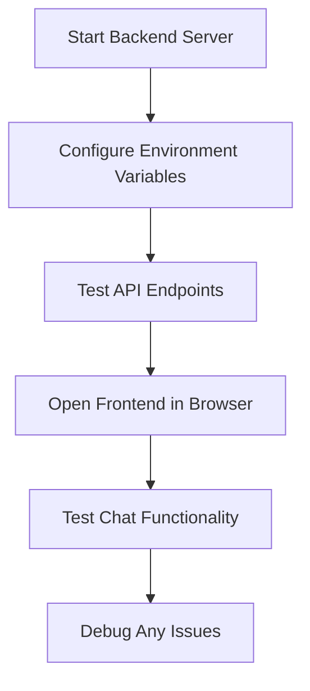

**Vaiheittainen testausprosessi:**

1. **Käynnistä backend-palvelin**:
   ```bash
   cd backend
   source venv/bin/activate  # or venv\Scripts\activate on Windows
   python api.py
   ```

2. **Varmista, että API toimii**:
   - Avaa `http://localhost:5000` selaimessasi
   - Sinun pitäisi nähdä FastAPI-palvelimen tervetuloviesti

3. **Avaa frontend**:
   - Siirry frontend-hakemistoosi
   - Avaa `index.html` verkkoselaimessasi
   - Tai käytä VS Code:n Live Server -laajennusta paremman kehityskokemuksen saamiseksi

4. **Testaa chat-toiminnallisuus**:
   - Kirjoita viesti syöttökenttään
   - Klikkaa "Lähetä" tai paina Enter
   - Varmista, että AI vastaa asianmukaisesti
   - Tarkista selaimen konsoli mahdollisten JavaScript-virheiden varalta

### Yleiset ongelmat ja niiden ratkaisut

| Ongelma | Oireet | Ratkaisu |
|---------|--------|----------|
| **CORS-virhe** | Frontend ei pääse backendiin | Varmista, että FastAPI CORSMiddleware on oikein konfiguroitu |
| **API-avainvirhe** | 401 Unauthorized -vastaukset | Tarkista `GITHUB_TOKEN` ympäristömuuttuja |
| **Yhteys hylätty** | Verkkovirheet frontendissä | Varmista backend-URL ja että Flask-palvelin on käynnissä |
| **Ei AI-vastausta** | Tyhjät tai virheelliset vastaukset | Tarkista backend-lokit API:n kiintiö- tai autentikointiongelmien varalta |

**Yleiset debuggausvaiheet:**
- **Tarkista** selaimen Developer Tools Console JavaScript-virheiden varalta
- **Varmista** Network-välilehdellä onnistuneet API-pyynnöt ja -vastaukset
- **Tarkista** backendin terminaalituloste Python-virheiden tai API-ongelmien varalta
- **Varmista** ympäristömuuttujien lataus ja saatavuus

## 📈 AI-sovelluskehityksen hallinnan aikajana

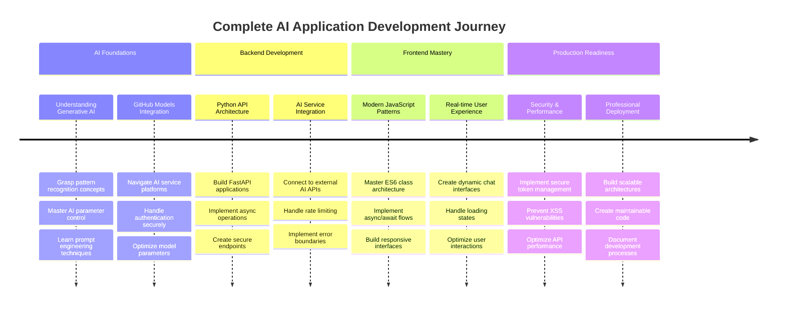

**🎓 Valmistumisen virstanpylväs**: Olet onnistuneesti rakentanut täydellisen AI-pohjaisen sovelluksen käyttäen samoja teknologioita ja arkkitehtuurimalleja, jotka voimaannuttavat moderneja AI-avustajia. Nämä taidot edustavat perinteisen web-kehityksen ja huipputeknologian AI-integraation risteystä.

**🔄 Seuraavan tason kyvyt**:
- Valmis tutkimaan kehittyneitä AI-kehyksiä (LangChain, LangGraph)
- Valmis rakentamaan multimodaalisia AI-sovelluksia (teksti, kuva, ääni)
- Valmis toteuttamaan vektoripohjaisia tietokantoja ja hakujärjestelmiä
- Perusta asetettu koneoppimiselle ja AI-mallien hienosäädölle

## GitHub Copilot Agent -haaste 🚀

Käytä Agent-tilaa suorittaaksesi seuraavan haasteen:

**Kuvaus:** Paranna chat-avustajaa lisäämällä keskusteluhistoria ja viestien pysyvyys. Tämä haaste auttaa sinua ymmärtämään, kuinka hallita tilaa chat-sovelluksissa ja toteuttaa datan tallennusta paremman käyttäjäkokemuksen saavuttamiseksi.

**Tehtävä:** Muokkaa chat-sovellusta sisältämään keskusteluhistorian, joka säilyy istuntojen välillä. Lisää toiminnallisuus tallentaa chat-viestit paikalliseen tallennustilaan, näyttää keskusteluhistorian sivun latautuessa ja sisällytä "Tyhjennä historia" -painike. Toteuta myös kirjoitusindikaattorit ja viestien aikaleimat, jotta chat-kokemus tuntuu realistisemmalta.

Lisätietoja [agent-tilasta](https://code.visualstudio.com/blogs/2025/02/24/introducing-copilot-agent-mode) täällä.

## Tehtävä: Rakenna oma AI-avustajasi

Nyt voit luoda oman AI-avustajasi. Sen sijaan, että vain kopioisit opetusohjelman koodin, tämä on tilaisuus soveltaa opittuja konsepteja ja rakentaa jotain, joka heijastaa omia kiinnostuksen kohteitasi ja käyttötapauksiasi.

### Projektivaatimukset

Luo projekti selkeällä, järjestelmällisellä rakenteella:

```text
my-ai-assistant/
├── backend/
│   ├── api.py          # Your FastAPI server
│   ├── llm.py          # AI integration functions
│   ├── .env            # Your secrets (keep this safe!)
│   └── requirements.txt # Python dependencies
├── frontend/
│   ├── index.html      # Your chat interface
│   ├── app.js          # The JavaScript magic
│   └── styles.css      # Make it look amazing
└── README.md           # Tell the world about your creation
```

### Keskeiset toteutustehtävät

**Backend-kehitys:**
- **Muokkaa** FastAPI-koodiamme ja tee siitä oma
- **Luo** ainutlaatuinen AI-persoonallisuus – ehkä avulias ruoanlaittoavustaja, luova kirjoituskumppani tai opiskelukaveri?
- **Lisää** vankka virheenkäsittely, jotta sovellus ei kaadu ongelmien ilmetessä
- **Kirjoita** selkeät dokumentaatiot, jotta kuka tahansa voi ymmärtää, miten API toimii

**Frontend-kehitys:**
- **Rakenna** chat-käyttöliittymä, joka tuntuu intuitiiviselta ja kutsuvalta
- **Kirjoita** siistiä, modernia JavaScriptiä, jota voisit ylpeänä näyttää muille kehittäjille
- **Suunnittele** mukautettu ulkoasu, joka heijastaa AI:n persoonallisuutta – hauska ja värikäs? Siisti ja minimalistinen? Täysin sinun päätettävissäsi!
- **Varmista**, että se toimii hyvin sekä puhelimilla että tietokoneilla

**Personointivaatimukset:**
- **Valitse** ainutlaatuinen nimi ja persoonallisuus AI-avustajallesi – ehkä jotain, joka heijastaa kiinnostuksen kohteitasi tai ratkaistavia ongelmia
- **Mukauta** visuaalinen suunnittelu vastaamaan avustajasi tyyliä
- **Kirjoita** houkutteleva tervetuloviesti, joka saa ihmiset haluamaan aloittaa keskustelun
- **Testaa** avustajasi erilaisilla kysymyksillä nähdäksesi, miten se vastaa

### Parannusideoita (valinnainen)

Haluatko viedä projektisi seuraavalle tasolle? Tässä muutamia hauskoja ideoita tutkittavaksi:

| Ominaisuus | Kuvaus | Harjoiteltavat taidot |
|------------|--------|-----------------------|
| **Viestihistoria** | Muista keskustelut jopa sivun päivityksen jälkeen | Työskentely localStoragen kanssa, JSON-käsittely |
| **Kirjoitusindikaattorit** | Näytä "AI kirjoittaa..." odottaessa vastauksia | CSS-animaatiot, asynkroninen ohjelmointi |
| **Viestien aikaleimat** | Näytä, milloin kukin viesti lähetettiin | Päivämäärä/aika-muotoilu, UX-suunnittelu |
| **Chatin vienti** | Anna käyttäjien ladata keskustelunsa | Tiedostojen käsittely, datan vienti |
| **Teeman vaihto** | Valo/tumma tila -vaihtoehto | CSS-muuttujat, käyttäjäasetukset |
| **Äänisyöte** | Lisää puheesta tekstiksi -toiminnallisuus | Web API:t, saavutettavuus |

### Testaus ja dokumentaatio

**Laadunvarmistus:**
- **Testaa** sovelluksesi erilaisilla syötetyypeillä ja reunatapauksilla
- **Varmista**, että responsiivinen suunnittelu toimii eri näyttökokoilla
- **Tarkista** saavutettavuus näppäimistön navigoinnilla ja ruudunlukijoilla
- **Vahvista** HTML- ja CSS-standardien mukaisuus

**Dokumentaatiovaatimukset:**
- **Kirjoita** README.md, joka selittää projektisi ja miten se suoritetaan
- **Sisällytä** kuvakaappauksia chat-käyttöliittymästä toiminnassa
- **Dokumentoi** kaikki ainutlaatuiset ominaisuudet tai mukautukset, jotka lisäsit
- **Anna** selkeät asennusohjeet muille kehittäjille

### Lähetysohjeet

**Projektin toimitettavat osat:**
1. Täydellinen projektikansio, joka sisältää kaiken lähdekoodin
2. README.md, jossa on projektin kuvaus ja asennusohjeet
3. Kuvakaappauksia, jotka esittävät chat-avustajasi toiminnassa
4. Lyhyt pohdinta siitä, mitä opit ja mitä haasteita kohtasit

**Arviointikriteerit:**
- **Toiminnallisuus**: Toimiiko chat-avustaja odotetusti?
- **Koodin laatu**: Onko koodi hyvin jäsennelty, kommentoitu ja ylläpidettävä?
- **Suunnittelu**: Onko käyttöliittymä visuaalisesti houkutteleva ja käyttäjäystävällinen?
- **Luovuus**: Kuinka ainutlaatuinen ja personoitu toteutuksesi on?
- **Dokumentaatio**: Ovatko asennusohjeet selkeät ja täydelliset?

> 💡 **Menestysvinkki**: Aloita perusvaatimuksista ja lisää parannuksia vasta, kun kaikki toimii. Keskity luomaan hiottu ydin kokemus ennen
- **Toteuta** älykkäitä ehdotuksia keskustelun aiheen perusteella  
- **Luo** pikavastauspainikkeita yleisimpiin kysymyksiin  

> 🎯 **Oppimistavoite**: Nämä lisähaasteet auttavat sinua ymmärtämään kehittyneitä web-kehityksen malleja ja tekoälyn integrointitekniikoita, joita käytetään tuotantosovelluksissa.

## Yhteenveto ja seuraavat askeleet  

Onnittelut! Olet onnistuneesti rakentanut alusta alkaen tekoälypohjaisen keskusteluavustajan. Tämä projekti on antanut sinulle käytännön kokemusta modernista web-kehitysteknologiasta ja tekoälyn integroinnista – taitoja, jotka ovat yhä arvokkaampia nykyisessä teknologia-alan ympäristössä.  

### Mitä olet saavuttanut  

Tämän oppitunnin aikana olet oppinut useita keskeisiä teknologioita ja käsitteitä:  

**Backend-kehitys:**  
- **Integroitu** GitHub Models API tekoälytoiminnallisuutta varten  
- **Rakennettu** RESTful API Flaskilla, jossa on asianmukainen virheenkäsittely  
- **Toteutettu** turvallinen autentikointi ympäristömuuttujien avulla  
- **Konfiguroitu** CORS mahdollistamaan frontendin ja backendin väliset pyynnöt  

**Frontend-kehitys:**  
- **Luotu** responsiivinen keskustelukäyttöliittymä semanttisella HTML:llä  
- **Toteutettu** modernia JavaScriptiä async/await- ja luokkapohjaisella arkkitehtuurilla  
- **Suunniteltu** houkutteleva käyttöliittymä CSS Gridin, Flexboxin ja animaatioiden avulla  
- **Lisätty** saavutettavuusominaisuuksia ja responsiivisen suunnittelun periaatteita  

**Full-stack-integraatio:**  
- **Yhdistetty** frontend ja backend HTTP API -kutsujen avulla  
- **Käsitelty** reaaliaikaisia käyttäjäinteraktioita ja asynkronista tiedon kulkua  
- **Toteutettu** virheenkäsittely ja käyttäjäpalautteet koko sovelluksessa  
- **Testattu** koko sovelluksen työnkulku käyttäjän syötteestä tekoälyn vastaukseen  

### Keskeiset oppimistulokset  

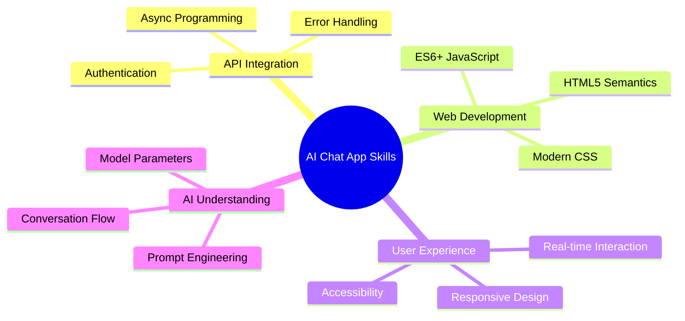
  
Tämä projekti on johdattanut sinut tekoälypohjaisten sovellusten rakentamisen perusteisiin, mikä edustaa web-kehityksen tulevaisuutta. Ymmärrät nyt, kuinka tekoälyominaisuuksia voidaan integroida perinteisiin web-sovelluksiin, luoden älykkäitä ja reagoivia käyttäjäkokemuksia.  

### Ammatilliset sovellukset  

Tässä oppitunnissa kehittämäsi taidot ovat suoraan sovellettavissa nykyaikaisiin ohjelmistokehityksen urapolkuihin:  

- **Full-stack-web-kehitys** modernien kehysten ja API:en avulla  
- **Tekoälyn integrointi** web-sovelluksiin ja mobiilisovelluksiin  
- **API-suunnittelu ja kehitys** mikropalveluarkkitehtuureille  
- **Käyttöliittymäkehitys** keskittyen saavutettavuuteen ja responsiiviseen suunnitteluun  
- **DevOps-käytännöt**, mukaan lukien ympäristön konfigurointi ja käyttöönotto  

### Jatka tekoälykehityksen parissa  

**Seuraavat oppimisaskeleet:**  
- **Tutustu** kehittyneempiin tekoälymalleihin ja API:hin (GPT-4, Claude, Gemini)  
- **Opettele** prompt engineering -tekniikoita parempien tekoälyvastausten saamiseksi  
- **Opiskele** keskustelusuunnittelua ja chatbot-käyttäjäkokemuksen periaatteita  
- **Tutki** tekoälyn turvallisuutta, etiikkaa ja vastuullisen tekoälyn kehittämistä  
- **Rakenna** monimutkaisempia sovelluksia, joissa on keskustelumuisti ja kontekstin ymmärrys  

**Edistyneet projektiehdotukset:**  
- Monen käyttäjän keskusteluhuoneet tekoälymoderoinnilla  
- Tekoälypohjaiset asiakaspalveluchatbotit  
- Koulutukselliset tutorointiavustajat, jotka tarjoavat yksilöllistä oppimista  
- Luovan kirjoittamisen yhteistyökumppanit, joilla on erilaisia tekoälypersoonallisuuksia  
- Teknisen dokumentaation avustajat kehittäjille  

## Aloita GitHub Codespacesilla  

Haluatko kokeilla tätä projektia pilvipohjaisessa kehitysympäristössä? GitHub Codespaces tarjoaa täydellisen kehitysympäristön suoraan selaimessasi, mikä on täydellistä tekoälysovellusten kokeiluun ilman paikallisia asennusvaatimuksia.  

### Kehitysympäristön asennus  

**Vaihe 1: Luo mallista**  
- **Siirry** [Web Dev For Beginners -repositoryyn](https://github.com/microsoft/Web-Dev-For-Beginners)  
- **Klikkaa** "Use this template" oikeassa yläkulmassa (varmista, että olet kirjautunut GitHubiin)  

  

**Vaihe 2: Käynnistä Codespaces**  
- **Avaa** juuri luomasi repository  
- **Klikkaa** vihreää "Code"-painiketta ja valitse "Codespaces"  
- **Valitse** "Create codespace on main" aloittaaksesi kehitysympäristön  

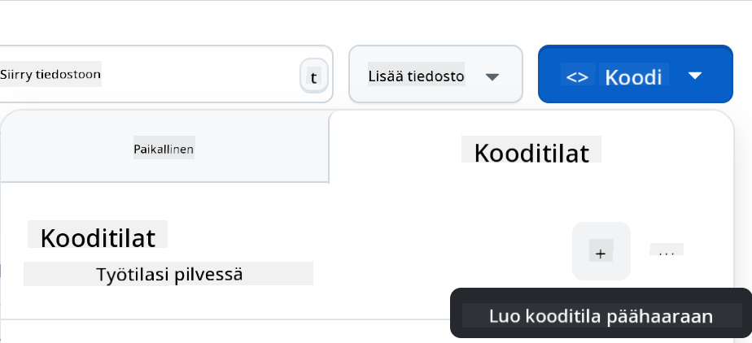  

**Vaihe 3: Ympäristön konfigurointi**  
Kun Codespace latautuu, sinulla on käytössäsi:  
- **Esiasennettu** Python, Node.js ja kaikki tarvittavat kehitystyökalut  
- **VS Code -käyttöliittymä**, jossa on laajennuksia web-kehitykseen  
- **Pääsy terminaaliin** backend- ja frontend-palvelimien ajamista varten  
- **Porttien uudelleenohjaus** sovellusten testaamiseen  

**Mitä Codespaces tarjoaa:**  
- **Poistaa** paikallisen ympäristön asennus- ja konfigurointiongelmat  
- **Tarjoaa** yhtenäisen kehitysympäristön eri laitteille  
- **Sisältää** esikonfiguroidut työkalut ja laajennukset web-kehitykseen  
- **Mahdollistaa** saumatonta integraatiota GitHubin kanssa versionhallintaa ja yhteistyötä varten  

> 🚀 **Vinkki**: Codespaces on täydellinen oppimiseen ja tekoälysovellusten prototyyppien kehittämiseen, koska se hoitaa automaattisesti kaikki monimutkaiset ympäristön asennukset, jolloin voit keskittyä rakentamiseen ja oppimiseen ilman konfigurointiongelmia.

---

**Vastuuvapauslauseke**:  
Tämä asiakirja on käännetty käyttämällä tekoälypohjaista käännöspalvelua [Co-op Translator](https://github.com/Azure/co-op-translator). Vaikka pyrimme tarkkuuteen, huomioithan, että automaattiset käännökset voivat sisältää virheitä tai epätarkkuuksia. Alkuperäistä asiakirjaa sen alkuperäisellä kielellä tulisi pitää ensisijaisena lähteenä. Kriittisen tiedon osalta suositellaan ammattimaista ihmiskäännöstä. Emme ole vastuussa väärinkäsityksistä tai virhetulkinnoista, jotka johtuvat tämän käännöksen käytöstä.