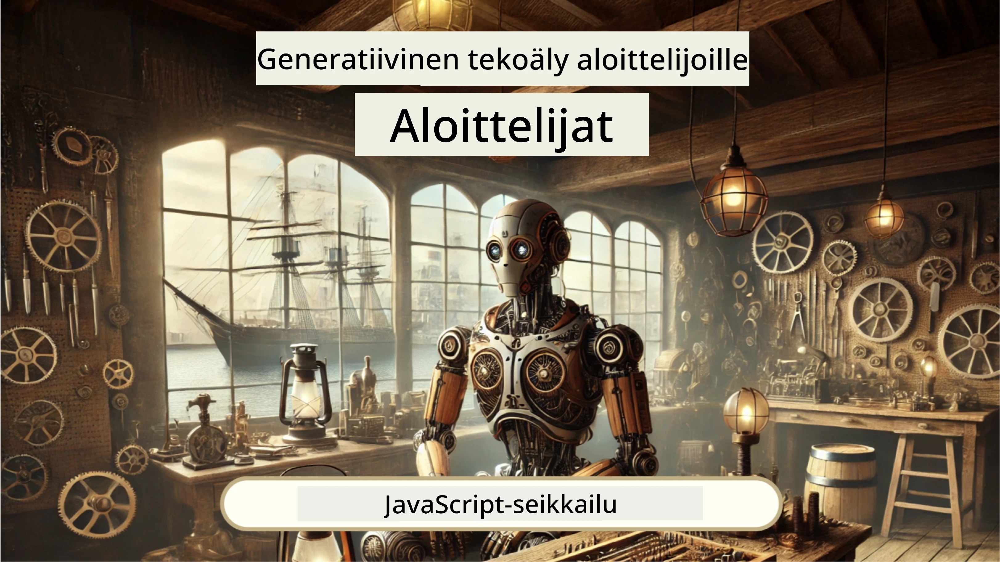
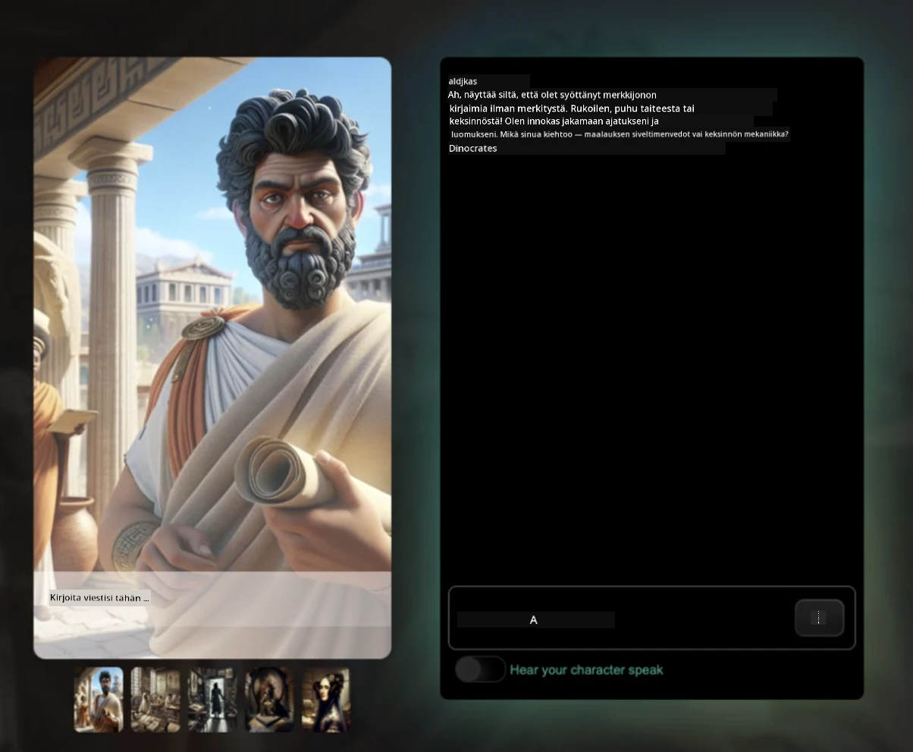
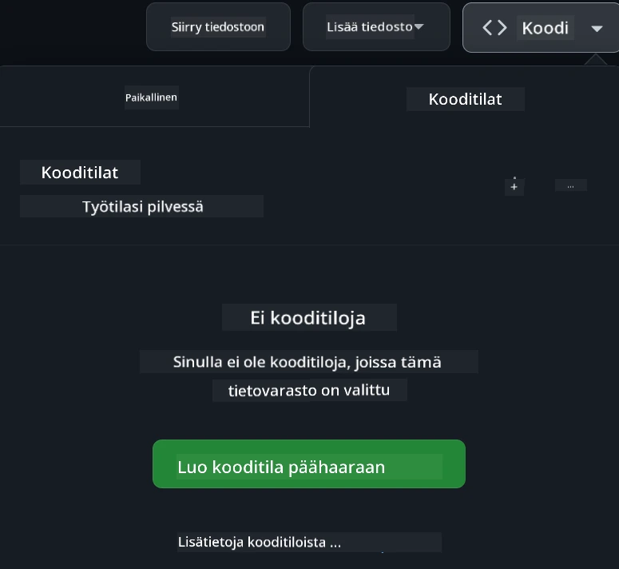

<!--
CO_OP_TRANSLATOR_METADATA:
{
  "original_hash": "fea3a0fceb8ad86fd640c09cf63a2aac",
  "translation_date": "2026-01-07T01:01:45+00:00",
  "source_file": "README.md",
  "language_code": "fi"
}
-->
[](https://github.com/microsoft/Web-Dev-For-Beginners/blob/master/LICENSE)
[](https://GitHub.com/microsoft/Web-Dev-For-Beginners/graphs/contributors/)
[](https://GitHub.com/microsoft/Web-Dev-For-Beginners/issues/)
[](https://GitHub.com/microsoft/Web-Dev-For-Beginners/pulls/)
[](http://makeapullrequest.com)

[](https://GitHub.com/microsoft/Web-Dev-For-Beginners/watchers/)
[](https://GitHub.com/microsoft/Web-Dev-For-Beginners/network/)
[](https://GitHub.com/microsoft/Web-Dev-For-Beginners/stargazers/)

[](https://discord.gg/nTYy5BXMWG)

# Verkkokehitys aloittelijoille - Opetussuunnitelma

Opi verkkokehityksen perusteet Microsoft Cloud Advocatesin 12 viikon kattavassa kurssissa. Jokainen 24 oppitunnista syventyy JavaScriptiin, CSS:ään ja HTML:ään käytännön projektien, kuten terrarionien, selainlaajennusten ja avaruuspeliensä kautta. Osallistu tietovisailuihin, keskusteluihin ja käytännön tehtäviin. Kehitä taitojasi ja optimoi oppimisesi tehokkaan projektioppimisen menetelmämme avulla. Aloita koodausmatkasi jo tänään!

Liity Azure AI Foundry Discord -yhteisöön

[](https://discord.gg/nTYy5BXMWG)

Noudata näitä ohjeita aloittaaksesi näiden resurssien käytön:
1. **Forkkaa repositorio**: Klikkaa [](https://GitHub.com/microsoft/Web-Dev-For-Beginners/fork)
2. **Kloonaa repositorio**:   `git clone https://github.com/microsoft/Web-Dev-For-Beginners.git`
3. [**Liity Azure AI Foundry Discordiin ja tapaa asiantuntijoita sekä muita kehittäjiä**](https://discord.com/invite/ByRwuEEgH4)

### 🌐 Monikielinen tuki

#### Tuettu GitHub Actionin kautta (Automaattinen & aina ajan tasalla)

<!-- CO-OP TRANSLATOR LANGUAGES TABLE START -->
[Arabic](../ar/README.md) | [Bengali](../bn/README.md) | [Bulgarian](../bg/README.md) | [Burmese (Myanmar)](../my/README.md) | [Chinese (Simplified)](../zh/README.md) | [Chinese (Traditional, Hong Kong)](../hk/README.md) | [Chinese (Traditional, Macau)](../mo/README.md) | [Chinese (Traditional, Taiwan)](../tw/README.md) | [Croatian](../hr/README.md) | [Czech](../cs/README.md) | [Danish](../da/README.md) | [Dutch](../nl/README.md) | [Estonian](../et/README.md) | [Finnish](./README.md) | [French](../fr/README.md) | [German](../de/README.md) | [Greek](../el/README.md) | [Hebrew](../he/README.md) | [Hindi](../hi/README.md) | [Hungarian](../hu/README.md) | [Indonesian](../id/README.md) | [Italian](../it/README.md) | [Japanese](../ja/README.md) | [Kannada](../kn/README.md) | [Korean](../ko/README.md) | [Lithuanian](../lt/README.md) | [Malay](../ms/README.md) | [Malayalam](../ml/README.md) | [Marathi](../mr/README.md) | [Nepali](../ne/README.md) | [Nigerian Pidgin](../pcm/README.md) | [Norwegian](../no/README.md) | [Persian (Farsi)](../fa/README.md) | [Polish](../pl/README.md) | [Portuguese (Brazil)](../br/README.md) | [Portuguese (Portugal)](../pt/README.md) | [Punjabi (Gurmukhi)](../pa/README.md) | [Romanian](../ro/README.md) | [Russian](../ru/README.md) | [Serbian (Cyrillic)](../sr/README.md) | [Slovak](../sk/README.md) | [Slovenian](../sl/README.md) | [Spanish](../es/README.md) | [Swahili](../sw/README.md) | [Swedish](../sv/README.md) | [Tagalog (Filipino)](../tl/README.md) | [Tamil](../ta/README.md) | [Telugu](../te/README.md) | [Thai](../th/README.md) | [Turkish](../tr/README.md) | [Ukrainian](../uk/README.md) | [Urdu](../ur/README.md) | [Vietnamese](../vi/README.md)

> **Haluatko kloonata paikallisesti?**

> Tämä repositorio sisältää yli 50 kielen käännökset, mikä lisää merkittävästi latauskokoa. Jos haluat kloonata ilman käännöksiä, käytä sparse checkoutia:
> ```bash
> git clone --filter=blob:none --sparse https://github.com/microsoft/Web-Dev-For-Beginners.git
> cd Web-Dev-For-Beginners
> git sparse-checkout set --no-cone '/*' '!translations' '!translated_images'
> ```
> Saat kaiken tarvitsemasi kurssin suorittamiseen huomattavasti nopeammalla latauksella.
<!-- CO-OP TRANSLATOR LANGUAGES TABLE END -->

**Jos haluat lisää tuettuja käännöskieliä, ne on listattu [tässä](https://github.com/Azure/co-op-translator/blob/main/getting_started/supported-languages.md)**

[](https://open.vscode.dev/microsoft/Web-Dev-For-Beginners)

#### 🧑‍🎓 _Oletko opiskelija?_

Vieraile [**Student Hub -sivulla**](https://docs.microsoft.com/learn/student-hub/?WT.mc_id=academic-77807-sagibbon), jolta löydät aloittelijan resurssit, opiskelijapaketit ja jopa tapoja saada ilmainen sertifikaattikuponki. Tämä on sivu, jonka haluat lisätä kirjanmerkkeihin ja tarkistaa säännöllisesti, sillä päivitämme sisältöä kuukausittain.

### 📣 Ilmoitus - Uudet GitHub Copilot Agent -tilan haasteet suoritettaviksi!

Uusi haaste lisätty, etsi "GitHub Copilot Agent Challenge 🚀" useimmista luvuista. Tämä on uusi haaste, jonka suoritat GitHub Copilotin ja Agent-tilan avulla. Jos et ole käyttänyt Agent-tilaa aiemmin, se pystyy paitsi tuottamaan tekstiä, myös luomaan ja muokkaamaan tiedostoja, suorittamaan komentoja ja paljon muuta.

### 📣 Ilmoitus - _Uusi Generatiivisen tekoälyn projekti_

Uusi AI-avustajaprojekti juuri lisätty, tutustu projektiin [tästä](./9-chat-project/README.md)

### 📣 Ilmoitus - _Uusi opetussuunnitelma_ Generatiivisesta tekoälystä JavaScriptille julkaistu

Älä jää paitsi uudesta Generatiivisen AI:n opetussuunnitelmastamme!

Käy osoitteessa [https://aka.ms/genai-js-course](https://aka.ms/genai-js-course) aloittaaksesi!



- Oppitunnit kattavat kaiken perusteista RAG:iin.
- Vuorovaikutus historiallisten hahmojen kanssa GenAI:n ja lisäsovelluksemme kautta.
- Hauska ja mukaansatempaava tarinankerronta, matkustat ajassa!




Jokaisessa oppitunnissa on tehtävä suoritettavaksi, tietoarviointi ja haaste, jotka ohjaavat sinua oppimaan aiheista kuten:
- Kehotteen kirjoittaminen ja kehoteinsinööritys
- Teksti- ja kuva-applikaatioiden generointi
- Hakusovellukset

Käy osoitteessa [https://aka.ms/genai-js-course](https://aka.ms/genai-js-course) aloittaaksesi!


## 🌱 Aloittaminen

> **Opettajat**, olemme [lisänneet joitakin ehdotuksia](for-teachers.md) siitä, miten tätä opetussuunnitelmaa voi käyttää. Haluaisimme saada palautetta [keskustelufoorumillamme](https://github.com/microsoft/Web-Dev-For-Beginners/discussions/categories/teacher-corner)!

**[Oppijat](https://aka.ms/student-page/?WT.mc_id=academic-77807-sagibbon)**, jokaista oppituntia varten aloita esiluentotestillä ja jatka luentomateriaalin lukemisella, erilaisten aktiviteettien suorittamisella ja tarkista ymmärryksesi jälkiluentotestillä.

Paranna oppimiskokemustasi yhdistämällä vertaisryhmiesi kanssa projektityöhön! Keskusteluja suositellaan [keskustelufoorumillamme](https://github.com/microsoft/Web-Dev-For-Beginners/discussions), jossa moderaattoritiimimme on valmiina vastaamaan kysymyksiisi.

Jatkaaksesi opiskelua suosittelemme vahvasti tutustumaan [Microsoft Learniin](https://learn.microsoft.com/users/wirelesslife/collections/p1ddcy5jwy0jkm?WT.mc_id=academic-77807-sagibbon) lisäoppimateriaalien saamiseksi.

### 📋 Ympäristön pystyttäminen

Tässä opetussuunnitelmassa on valmiiksi määritetty kehitysympäristö! Voit aloittaessasi valita suorittavasi opetussuunnitelman [Codespacessa](https://github.com/features/codespaces/) (_selainnäkymäinen, asennuksia ei tarvita_), tai paikallisesti tietokoneellasi tekstieditorilla, kuten [Visual Studio Code](https://code.visualstudio.com/?WT.mc_id=academic-77807-sagibbon).

#### Luo oma repositoriosi
Työsi tallentamisen helpottamiseksi on suositeltavaa luoda oma kopiosi tästä repositoriosta. Voit tehdä sen klikkaamalla sivun ylälaidasta kohtaa **Use this template**. Tämä luo uuden repositorion GitHub-tilillesi kopiona opetussuunnitelmasta.

Noudata näitä ohjeita:
1. **Forkkaa repositorio**: Klikkaa oikeasta yläkulmasta "Fork".
2. **Kloonaa repositorio**:   `git clone https://github.com/microsoft/Web-Dev-For-Beginners.git`

#### Opetussuunnitelman suorittaminen Codespacessa

Omassa kopiossasi tästä repositoriosta, jonka loit, klikkaa **Code** ja valitse **Open with Codespaces**. Tämä luo sinulle uuden Codespace-työtilan.



#### Opetussuunnitelman suorittaminen paikallisesti tietokoneella

Jos haluat suorittaa opetussuunnitelman paikallisesti tietokoneellasi, tarvitset tekstieditorin, selaimen ja komentorivityökalun. Ensimmäinen oppituntimme, [Ohjelmointikieliin ja työkaluisiin perehtyminen](../../1-getting-started-lessons/1-intro-to-programming-languages), opastaa sinut eri vaihtoehdoissa kuhunkin näistä työkaluista, jotta voit valita sinulle parhaiten sopivat.

Suosittelemme käyttämään editorina [Visual Studio Codea](https://code.visualstudio.com/?WT.mc_id=academic-77807-sagibbon), joka sisältää myös sisäänrakennetun [Päätteen](https://code.visualstudio.com/docs/terminal/basics/?WT.mc_id=academic-77807-sagibbon). Voit ladata Visual Studio Coden [tästä](https://code.visualstudio.com/?WT.mc_id=academic-77807-sagibbon).


1. Kloonaa repositoriosi tietokoneellesi. Voit tehdä tämän klikkaamalla **Code** ja kopioimalla URL-osoitteen:

    [CodeSpace](./images/createcodespace.png)
Sitten avaa [Terminal](https://code.visualstudio.com/docs/terminal/basics/?WT.mc_id=academic-77807-sagibbon) [Visual Studio Code](https://code.visualstudio.com/?WT.mc_id=academic-77807-sagibbon) -sovelluksessa ja suorita seuraava komento korvaten `<your-repository-url>` äsken kopioimallasi URL-osoitteella:

    ```bash 
    git clone <your-repository-url>
    ```

2. Avaa kansio Visual Studio Codessa. Voit tehdä tämän valitsemalla **File** > **Open Folder** ja valitsemalla juuri kloonatun kansion.


> Suositellut Visual Studio Code -laajennukset:
>
> * [Live Server](https://marketplace.visualstudio.com/items?itemName=ritwickdey.LiveServer&WT.mc_id=academic-77807-sagibbon) - HTML-sivujen esikatseluun suoraan Visual Studio Codessa
> * [Copilot](https://marketplace.visualstudio.com/items?itemName=GitHub.copilot&WT.mc_id=academic-77807-sagibbon) - auttamaan koodin kirjoittamisessa nopeammin

## 📂 Jokainen oppitunti sisältää:

- valinnaisen muistion
- valinnaisen lisävideo
- ennakkoharjoituksen / lämmittelykyselyn
- kirjallisen oppitunnin
- projektipohjaisissa oppitunneissa ohjeet projektin rakentamiseen vaihe vaiheelta
- tietotarkistuksia
- haasteen
- lisälukemista
- tehtävän
- [jälkioppitunnin kyselyn](https://ff-quizzes.netlify.app/web/)

> **Huomautus kyselyistä**: Kaikki kyselyt löytyvät Quiz-app-kansiosta, yhteensä 48 kyselyä, joissa jokaisessa on kolme kysymystä. Ne ovat saatavilla [tässä](https://ff-quizzes.netlify.app/web/). Kyselysovellus voidaan suorittaa paikallisesti tai ottaa käyttöön Azureen; noudata ohjeita `quiz-app`-kansiossa.

## 🗃️ Oppitunnit

|     |                       Projektin nimi                       |                            Opitut käsitteet                             | Oppimistavoitteet                                                                                                                 |                                                         Linkitetty oppitunti                                                          |         Tekijä          |
| :-: | :--------------------------------------------------------: | :--------------------------------------------------------------------: | ----------------------------------------------------------------------------------------------------------------------------------- | :----------------------------------------------------------------------------------------------------------------------------: | :---------------------: |
| 01  |                     Aloittaminen                          |           Johdatus ohjelmointiin ja työkaluihin                        | Opit ohjelmointikielten perustan ja ohjelmistot, jotka auttavat ammattilaisia työssään                                               | [Intro to Programming Languages and Tools of the Trade](./1-getting-started-lessons/1-intro-to-programming-languages/README.md) |         Jasmine         |
| 02  |                     Aloittaminen                          |             GitHubin perusteet, myös tiimityöskentely                  | Kuinka käyttää GitHubia projektissa ja miten tehdä yhteistyötä koodipohjalla                                                       |                            [Intro to GitHub](./1-getting-started-lessons/2-github-basics/README.md)                             |          Floor          |
| 03  |                     Aloittaminen                          |                             Esteettömyys                              | Opit verkkosivujen esteettömyyden perusteet                                                                                       |                       [Accessibility Fundamentals](./1-getting-started-lessons/3-accessibility/README.md)                       |       Christopher       |
| 04  |                        JS Basics                         |                         JavaScriptin tietotyypit                      | JavaScriptin tietotyyppien perusteet                                                                                              |                                       [Data Types](./2-js-basics/1-data-types/README.md)                                        |         Jasmine         |
| 05  |                        JS Basics                         |                         Funktiot ja metodit                          | Opit sovelluksen logiikan hallinnan funktioiden ja metodien avulla                                                                 |                              [Functions and Methods](./2-js-basics/2-functions-methods/README.md)                               | Jasmine ja Christopher  |
| 06  |                        JS Basics                         |                        Päätöksenteko JavaScriptillä                    | Kuinka luoda ehtoja koodissasi päätöksentekomenetelmien avulla                                                                    |                                 [Making Decisions](./2-js-basics/3-making-decisions/README.md)                                  |         Jasmine         |
| 07  |                        JS Basics                         |                            Taulukot ja silmukat                      | Työskentele datan kanssa taulukoiden ja silmukoiden avulla JavaScriptissä                                                           |                                   [Arrays and Loops](./2-js-basics/4-arrays-loops/README.md)                                    |         Jasmine         |
| 08  |       [Terrarium](./3-terrarium/solution/README.md)       |                            HTML käytännössä                           | Rakenna HTML luodaksesi online-terraariumin, keskittyen layoutin rakentamiseen                                                      |                                 [Introduction to HTML](./3-terrarium/1-intro-to-html/README.md)                                 |           Jen           |
| 09  |       [Terrarium](./3-terrarium/solution/README.md)       |                            CSS käytännössä                            | Rakenna CSS tyylittääksesi online-terraariumia, keskittyen CSS:n perusteisiin mukaan lukien sivun responsiivisuuden tekemisen     |                                  [Introduction to CSS](./3-terrarium/2-intro-to-css/README.md)                                  |           Jen           |
| 10  |            [Terrarium](./3-terrarium/solution/README.md)            |                 JavaScriptin sulut (closures), DOM-manipulointi       | Rakenna JavaScript, joka tekee terraariumista toimivan drag/drop-käyttöliittymän, keskittyen sulkuihin ja DOM-manipulointiin        |                  [JavaScript Closures, DOM manipulation](./3-terrarium/3-intro-to-DOM-and-closures/README.md)                   |           Jen           |
| 11  |          [Typing Game](./4-typing-game/solution/README.md)          |                          Kirjoituspelin rakentaminen                   | Opit käyttämään näppäimistötapahtumia JavaScript-sovelluksen logiikan ohjaamiseen                                                   |                                [Event-Driven Programming](./4-typing-game/typing-game/README.md)                                |       Christopher       |
| 12  | [Green Browser Extension](./5-browser-extension/solution/README.md) |                         Työskentely selainten kanssa                  | Opit, miten selaimet toimivat, niiden historian ja miten luoda ensimmäiset elementit selaimen laajennukseen                        |                               [About Browsers](./5-browser-extension/1-about-browsers/README.md)                                |           Jen           |
| 13  | [Green Browser Extension](./5-browser-extension/solution/README.md) | Lomakkeen rakentaminen, API-kutsut ja muuttujien tallennus paikalliseen muistiin | Rakenna selaimen laajennuksen JavaScript-elementit API:n kutsumiseen käyttäen muuttujiin tallennettuja paikalliseen muistiin         |                [APIs, Forms, and Local Storage](./5-browser-extension/2-forms-browsers-local-storage/README.md)                 |           Jen           |
| 14  | [Green Browser Extension](./5-browser-extension/solution/README.md) |          Taustaprosessit selaimessa, verkkosivuston suorituskyky      | Käytä selaimen taustaprosesseja hallitsemaan laajennuksen kuvaketta; opi web-suorituskyvystä ja optimoinnista                     |             [Background Tasks and Performance](./5-browser-extension/3-background-tasks-and-performance/README.md)              |           Jen           |
| 15  |           [Space Game](./6-space-game/solution/README.md)           |             Edistyneempi pelikehitys JavaScriptillä                  | Opit periytymisestä luokkien ja koostumisen avulla sekä Pub/Sub-kuvion, valmistautuen pelin rakentamiseen                            |                      [Introduction to Advanced Game Development](./6-space-game/1-introduction/README.md)                       |          Chris          |
| 16  |           [Space Game](./6-space-game/solution/README.md)           |                           Piirtäminen kankaalle                        | Opit Canvas API:sta, jota käytetään elementtien piirtämiseen näytölle                                                              |                                [Drawing to Canvas](./6-space-game/2-drawing-to-canvas/README.md)                                |          Chris          |
| 17  |           [Space Game](./6-space-game/solution/README.md)           |                   Elementtien liikuttaminen ruudulla                   | Opi, miten elementtejä voi liikuttaa kartesisilla koordinaateilla ja Canvas API:lla                                                  |                           [Moving Elements Around](./6-space-game/3-moving-elements-around/README.md)                           |          Chris          |
| 18  |           [Space Game](./6-space-game/solution/README.md)           |                          Törmäyksentunnistus                          | Tee elementeistä törmäileviä ja reagoivia toisiinsa näppäinpainallusten avulla, ja lisää cooldown-funktio pelin suorituskyvyn varmistamiseksi |                              [Collision Detection](./6-space-game/4-collision-detection/README.md)                              |          Chris          |
| 19  |           [Space Game](./6-space-game/solution/README.md)           |                             Pisteiden kirjaaminen                      | Suorita matemaattisia laskuja pelin tilan ja suorituskyvyn mukaan                                                                    |                                    [Keeping Score](./6-space-game/5-keeping-score/README.md)                                    |          Chris          |
| 20  |           [Space Game](./6-space-game/solution/README.md)           |                     Pelin lopetus ja uudelleenkäynnistys               | Opit pelin lopettamisesta ja uudelleenkäynnistyksestä, mukaan lukien resurssien siistimisestä ja muuttujien nollaamisesta             |                                [The Ending Condition](./6-space-game/6-end-condition/README.md)                                 |          Chris          |
| 21  |         [Banking App](./7-bank-project/solution/README.md)          |                 HTML-mallit ja reititykset web-sovelluksessa          | Opit rakentamaan monisivuisen verkkosivuston arkkitehtuurin reitityksen ja HTML-mallien avulla                                        |                            [HTML Templates and Routes](./7-bank-project/1-template-route/README.md)                             |          Yohan          |
| 22  |         [Banking App](./7-bank-project/solution/README.md)          |                  Kirjautumis- ja rekisteröitymislomakkeen rakentaminen | Opit lomakkeiden rakentamisesta ja validointirutiinien hallinnasta                                                                  |                                           [Forms](./7-bank-project/2-forms/README.md)                                           |          Yohan          |
| 23  |         [Banking App](./7-bank-project/solution/README.md)          |                   Tietojen hakemisen ja käytön menetelmät             | Kuinka tieto virtaa sovellukseen ja sieltä ulos, miten hakea, tallentaa ja poistaa sitä                                              |                                            [Data](./7-bank-project/3-data/README.md)                                            |          Yohan          |
| 24  |         [Banking App](./7-bank-project/solution/README.md)          |                      Tilanhallinnan käsitteet                         | Opit, kuinka sovelluksesi säilyttää tilaa ja miten sitä hallitaan ohjelmallisesti                                                   |                                [State Management](./7-bank-project/4-state-management/README.md)                                |          Yohan          |
| 25 | [Browser/VScode Code](../../8-code-editor) | Työskentely VScoden kanssa | Opit käyttämään koodieditoria | [Use VScode Code Editor](./8-code-editor/1-using-a-code-editor/README.md) | Chris |
| 26 | [AI Assistants](./9-chat-project/README.md) | Työskentely tekoälyn kanssa | Opit rakentamaan oman tekoälyavustajan | [AI Assistant project](./9-chat-project/README.md) | Chris |

## 🏫 Pedagogiikka

Opetussuunnitelmamme on suunniteltu kahden keskeisen pedagogisen periaatteen mukaan:
* projektipohjainen oppiminen
* usein toistuvat kyselyt

Ohjelma opettaa JavaScriptin, HTML:n ja CSS:n perusteet sekä viimeisimmät työkalut ja tekniikat, joita nykyiset web-kehittäjät käyttävät. Oppilaat pääsevät kehittämään käytännön kokemusta rakentamalla kirjoituspelin, virtuaalisen terraariumin, ympäristöystävällisen selaimen laajennuksen, avaruuslainen henkisen pelin ja pankkisovelluksen yrityksille. Sarjan lopussa oppilaat ovat saaneet vankan ymmärryksen web-kehityksestä.

> 🎓 Voit suorittaa tämän opetussuunnitelman ensimmäiset oppitunnit Microsoft Learnin [Learn Path](https://docs.microsoft.com/learn/paths/web-development-101/?WT.mc_id=academic-77807-sagibbon) -polun kautta!

Varmistamalla, että sisältö vastaa projekteja, prosessi on opiskelijoille mielekkäämpi ja käsitteiden muistaminen tehostuu. Kirjoitimme lisäksi useita aloitusoppitunteja JavaScriptin perusteista esitelläksemme käsitteitä, yhdistettynä videoihin "[Beginners Series to: JavaScript](https://channel9.msdn.com/Series/Beginners-Series-to-JavaScript/?WT.mc_id=academic-77807-sagibbon)" -videokokoelmasta, joiden tekijät osallistuivat tähän opetussuunnitelmaan.

Lisäksi oppituntia edeltävä matalariskinen kysely asettaa opiskelijalle opiskeluaiheen tavoitteen, ja oppitunnin jälkeinen toinen kysely varmistaa jatkumon. Tämä opetussuunnitelma on suunniteltu joustavaksi ja hauskaksi, ja sen voi suorittaa kokonaisuudessaan tai osittain. Projektit alkavat pieninä ja muuttuvat yhä vaativammiksi 12 viikon aikana.

Vaikka tarkoituksella olemme välttäneet JavaScript-kirjastojen käyttöönottoa keskittyäksemme verkkokehittäjän perustaitoihin ennen kehysten käyttöönottoa, hyvä seuraava askel tämän opetussuunnitelman jälkeen olisi oppia Node.js:stä toisen videokokoelman kautta: "[Beginner Series to: Node.js](https://channel9.msdn.com/Series/Beginners-Series-to-Nodejs/?WT.mc_id=academic-77807-sagibbon)".

> Tutustu [käyttäytymissääntöihimme](CODE_OF_CONDUCT.md) ja [osallistumisohjeisiin](CONTRIBUTING.md). Arvostamme rakentavaa palautettasi!


## 🧭 Offline-käyttö

Voit käyttää tätä dokumentaatiota offline-tilassa käyttämällä [Docsify](https://docsify.js.org/#/). Haarauta tämä repositorio, [asenna Docsify](https://docsify.js.org/#/quickstart) paikalliselle koneellesi ja siirry tämän repositorion juurikansioon, kirjoita `docsify serve`. Sivusto palvelee portissa 3000 paikallisessa koneessasi: `localhost:3000`.

## 📘 PDF

PDF-versio kaikista oppitunneista löytyy [täältä](https://microsoft.github.io/Web-Dev-For-Beginners/pdf/readme.pdf).


## 🎒 Muut kurssit
Tiimimme tuottaa myös muita kursseja! Tutustu:

<!-- CO-OP TRANSLATOR OTHER COURSES START -->
### LangChain
[](https://aka.ms/langchain4j-for-beginners)
[](https://aka.ms/langchainjs-for-beginners?WT.mc_id=m365-94501-dwahlin)

---

### Azure / Edge / MCP / Agents
[](https://github.com/microsoft/AZD-for-beginners?WT.mc_id=academic-105485-koreyst)
[](https://github.com/microsoft/edgeai-for-beginners?WT.mc_id=academic-105485-koreyst)
[](https://github.com/microsoft/mcp-for-beginners?WT.mc_id=academic-105485-koreyst)
[](https://github.com/microsoft/ai-agents-for-beginners?WT.mc_id=academic-105485-koreyst)

---
 
### Generative AI Series
[](https://github.com/microsoft/generative-ai-for-beginners?WT.mc_id=academic-105485-koreyst)
[-9333EA?style=for-the-badge&labelColor=E5E7EB&color=9333EA)](https://github.com/microsoft/Generative-AI-for-beginners-dotnet?WT.mc_id=academic-105485-koreyst)
[-C084FC?style=for-the-badge&labelColor=E5E7EB&color=C084FC)](https://github.com/microsoft/generative-ai-for-beginners-java?WT.mc_id=academic-105485-koreyst)
[-E879F9?style=for-the-badge&labelColor=E5E7EB&color=E879F9)](https://github.com/microsoft/generative-ai-with-javascript?WT.mc_id=academic-105485-koreyst)

---
 
### Core Learning
[](https://aka.ms/ml-beginners?WT.mc_id=academic-105485-koreyst)
[](https://aka.ms/datascience-beginners?WT.mc_id=academic-105485-koreyst)
[](https://aka.ms/ai-beginners?WT.mc_id=academic-105485-koreyst)
[](https://github.com/microsoft/Security-101?WT.mc_id=academic-96948-sayoung)
[](https://aka.ms/webdev-beginners?WT.mc_id=academic-105485-koreyst)
[](https://aka.ms/iot-beginners?WT.mc_id=academic-105485-koreyst)
[](https://github.com/microsoft/xr-development-for-beginners?WT.mc_id=academic-105485-koreyst)

---
 
### Copilot Series
[](https://aka.ms/GitHubCopilotAI?WT.mc_id=academic-105485-koreyst)
[](https://github.com/microsoft/mastering-github-copilot-for-dotnet-csharp-developers?WT.mc_id=academic-105485-koreyst)
[](https://github.com/microsoft/CopilotAdventures?WT.mc_id=academic-105485-koreyst)
<!-- CO-OP TRANSLATOR OTHER COURSES END -->

## Apua saatavana

Jos jumitut tai sinulla on kysyttävää tekoälysovellusten rakentamisesta. Liity muiden oppijoiden ja kokeneiden kehittäjien keskusteluihin MCP:stä. Se on kannustava yhteisö, jossa kysymykset ovat tervetulleita ja tieto jaetaan vapaasti.

[](https://discord.gg/nTYy5BXMWG)

Jos sinulla on tuotepalaute tai kohtaat virheitä rakentamisen aikana, käy:

[](https://aka.ms/foundry/forum)

## Lisenssi

Tämä arkisto on lisensoitu MIT-lisenssillä. Lisätietoja löydät tiedostosta [LICENSE](../../LICENSE).

---

<!-- CO-OP TRANSLATOR DISCLAIMER START -->
**Vastuuvapauslauseke**:  
Tämä asiakirja on käännetty tekoälypohjaisella käännöspalvelulla [Co-op Translator](https://github.com/Azure/co-op-translator). Vaikka pyrimme tarkkuuteen, automaattisissa käännöksissä saattaa esiintyä virheitä tai epätarkkuuksia. Alkuperäistä asiakirjaa sen omalla kielellä tulee pitää virallisena lähteenä. Tärkeiden tietojen osalta suositellaan ammattimaista ihmiskäännöstä. Emme ole vastuussa tämän käännöksen käytöstä aiheutuvista väärinymmärryksistä tai tulkinnoista.
<!-- CO-OP TRANSLATOR DISCLAIMER END -->