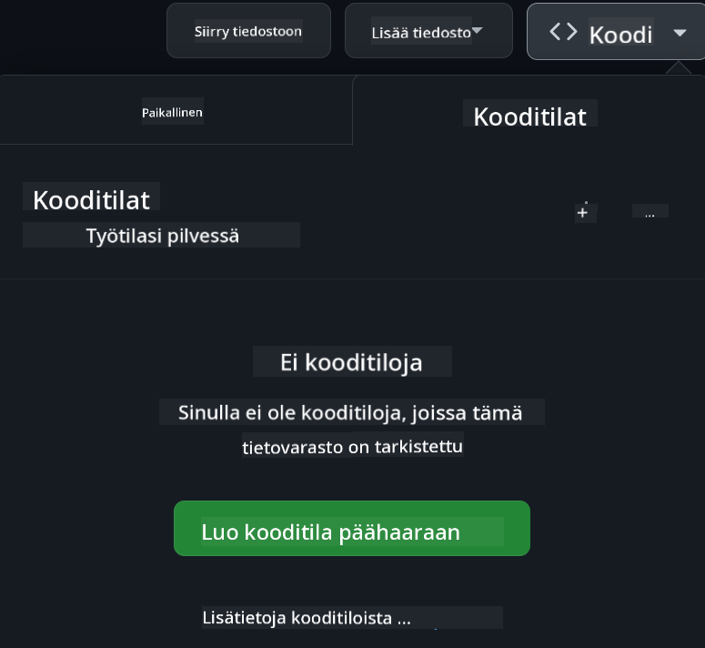

<!--
CO_OP_TRANSLATOR_METADATA:
{
  "original_hash": "63e29f5a308b533df9d70336bbb2e2b8",
  "translation_date": "2025-11-25T17:54:13+00:00",
  "source_file": "README.md",
  "language_code": "fi"
}
-->
[](https://github.com/microsoft/Web-Dev-For-Beginners/blob/master/LICENSE)  
[](https://GitHub.com/microsoft/Web-Dev-For-Beginners/graphs/contributors/)  
[](https://GitHub.com/microsoft/Web-Dev-For-Beginners/issues/)  
[](https://GitHub.com/microsoft/Web-Dev-For-Beginners/pulls/)  
[](http://makeapullrequest.com)  

[](https://GitHub.com/microsoft/Web-Dev-For-Beginners/watchers/)  
[](https://GitHub.com/microsoft/Web-Dev-For-Beginners/network/)  
[](https://GitHub.com/microsoft/Web-Dev-For-Beginners/stargazers/)  

[](https://discord.gg/nTYy5BXMWG)  

# Verkkokehitys aloittelijoille - Opetussuunnitelma  

Opi verkkokehityksen perusteet Microsoft Cloud Advocatesin 12 viikon kattavalla kurssilla. Jokainen 24 oppitunnista käsittelee JavaScriptiä, CSS:ää ja HTML:ää käytännön projektien, kuten terraarioiden, selainlaajennusten ja avaruuspelien, kautta. Osallistu visoihin, keskusteluihin ja käytännön tehtäviin. Paranna taitojasi ja optimoi oppimisesi tehokkaalla projektipohjaisella lähestymistavallamme. Aloita koodausmatkasi jo tänään!  

Liity Azure AI Foundry Discord -yhteisöön  

[](https://discord.gg/nTYy5BXMWG)  

Seuraa näitä ohjeita aloittaaksesi näiden resurssien käytön:  
1. **Haarauta arkisto**: Klikkaa [](https://GitHub.com/microsoft/Web-Dev-For-Beginners/fork)  
2. **Kloonaa arkisto**:   `git clone https://github.com/microsoft/Web-Dev-For-Beginners.git`  
3. [**Liity Azure AI Foundry Discordiin ja tapaa asiantuntijoita ja muita kehittäjiä**](https://discord.com/invite/ByRwuEEgH4)  

### 🌐 Monikielinen tuki  

#### Tuettu GitHub Actionin kautta (automaattinen ja aina ajan tasalla)  

<!-- CO-OP TRANSLATOR LANGUAGES TABLE START -->  
[Arabic](../ar/README.md) | [Bengali](../bn/README.md) | [Bulgarian](../bg/README.md) | [Burmese (Myanmar)](../my/README.md) | [Chinese (Simplified)](../zh/README.md) | [Chinese (Traditional, Hong Kong)](../hk/README.md) | [Chinese (Traditional, Macau)](../mo/README.md) | [Chinese (Traditional, Taiwan)](../tw/README.md) | [Croatian](../hr/README.md) | [Czech](../cs/README.md) | [Danish](../da/README.md) | [Dutch](../nl/README.md) | [Estonian](../et/README.md) | [Finnish](./README.md) | [French](../fr/README.md) | [German](../de/README.md) | [Greek](../el/README.md) | [Hebrew](../he/README.md) | [Hindi](../hi/README.md) | [Hungarian](../hu/README.md) | [Indonesian](../id/README.md) | [Italian](../it/README.md) | [Japanese](../ja/README.md) | [Korean](../ko/README.md) | [Lithuanian](../lt/README.md) | [Malay](../ms/README.md) | [Marathi](../mr/README.md) | [Nepali](../ne/README.md) | [Norwegian](../no/README.md) | [Persian (Farsi)](../fa/README.md) | [Polish](../pl/README.md) | [Portuguese (Brazil)](../br/README.md) | [Portuguese (Portugal)](../pt/README.md) | [Punjabi (Gurmukhi)](../pa/README.md) | [Romanian](../ro/README.md) | [Russian](../ru/README.md) | [Serbian (Cyrillic)](../sr/README.md) | [Slovak](../sk/README.md) | [Slovenian](../sl/README.md) | [Spanish](../es/README.md) | [Swahili](../sw/README.md) | [Swedish](../sv/README.md) | [Tagalog (Filipino)](../tl/README.md) | [Tamil](../ta/README.md) | [Thai](../th/README.md) | [Turkish](../tr/README.md) | [Ukrainian](../uk/README.md) | [Urdu](../ur/README.md) | [Vietnamese](../vi/README.md)  
<!-- CO-OP TRANSLATOR LANGUAGES TABLE END -->  

**Jos haluat lisätä uusia käännöksiä, tuetut kielet löytyvät [täältä](https://github.com/Azure/co-op-translator/blob/main/getting_started/supported-languages.md)**  

[](https://open.vscode.dev/microsoft/Web-Dev-For-Beginners)  

#### 🧑‍🎓 _Oletko opiskelija?_  

Vieraile [**Student Hub -sivulla**](https://docs.microsoft.com/learn/student-hub/?WT.mc_id=academic-77807-sagibbon), josta löydät aloitteleville suunnattuja resursseja, opiskelijapaketit ja jopa tapoja saada ilmainen sertifikaattivoucher. Tämä on sivu, jonka haluat tallentaa kirjanmerkkeihin ja tarkistaa säännöllisesti, sillä sisältö vaihtuu kuukausittain.  

### 📣 Ilmoitus - Uusia GitHub Copilot Agent -haasteita!  

Uusi haaste lisätty, etsi "GitHub Copilot Agent Challenge 🚀" useimmista luvuista. Tämä on uusi haaste, jonka voit suorittaa GitHub Copilotin ja Agent-tilan avulla. Jos et ole käyttänyt Agent-tilaa aiemmin, se ei vain luo tekstiä, vaan voi myös luoda ja muokata tiedostoja, suorittaa komentoja ja paljon muuta.  

### 📣 Ilmoitus - _Uusi projekti Generative AI:n avulla_  

Uusi AI Assistant -projekti on juuri lisätty, tutustu siihen [projekti](./09-chat-project/README.md)  

### 📣 Ilmoitus - _Uusi opetussuunnitelma_ Generative AI:sta JavaScriptille julkaistu  

Älä missaa uutta Generative AI -opetussuunnitelmaamme!  

Vieraile [https://aka.ms/genai-js-course](https://aka.ms/genai-js-course) aloittaaksesi!  

  

- Oppitunteja, jotka kattavat kaiken perusteista RAG:iin.  
- Keskustele historiallisten hahmojen kanssa GenAI:n ja kumppanisovelluksemme avulla.  
- Hauska ja mukaansatempaava tarina, jossa matkustat ajassa!  

  

Jokainen oppitunti sisältää tehtävän, tietotestin ja haasteen, jotka ohjaavat sinua oppimaan aiheita, kuten:  
- Kehotus ja kehotustekniikat  
- Teksti- ja kuvasovellusten luominen  
- Hakusovellukset  

Vieraile [https://aka.ms/genai-js-course](https://aka.ms/genai-js-course) aloittaaksesi!  

## 🌱 Aloittaminen  

> **Opettajat**, olemme [lisänneet joitakin ehdotuksia](for-teachers.md) tämän opetussuunnitelman käyttöön. Haluaisimme kuulla palautettanne [keskustelufoorumillamme](https://github.com/microsoft/Web-Dev-For-Beginners/discussions/categories/teacher-corner)!  

**[Oppijat](https://aka.ms/student-page/?WT.mc_id=academic-77807-sagibbon)**, jokaisessa oppitunnissa aloita ennakkotestillä ja jatka lukemalla oppimateriaali, suorittamalla erilaisia aktiviteetteja ja tarkista ymmärryksesi jälkitestillä.  

Parantaaksesi oppimiskokemustasi, yhdistä voimasi muiden kanssa työskennelläksesi projekteissa yhdessä! Keskustelut ovat tervetulleita [keskustelufoorumillamme](https://github.com/microsoft/Web-Dev-For-Beginners/discussions), jossa moderaattoritiimimme vastaa kysymyksiisi.  

Jatkaaksesi oppimistasi suosittelemme tutustumaan [Microsoft Learn](https://learn.microsoft.com/users/wirelesslife/collections/p1ddcy5jwy0jkm?WT.mc_id=academic-77807-sagibbon) -sivustoon lisämateriaalien löytämiseksi.  

### 📋 Ympäristön asettaminen  

Tämä opetussuunnitelma sisältää valmiin kehitysympäristön! Aloittaessasi voit valita, haluatko suorittaa opetussuunnitelman [Codespacessa](https://github.com/features/codespaces/) (_selaimessa toimiva ympäristö, ei asennuksia tarvita_) vai paikallisesti tietokoneellasi käyttämällä tekstieditoria, kuten [Visual Studio Code](https://code.visualstudio.com/?WT.mc_id=academic-77807-sagibbon).  

#### Luo oma arkistosi  
Jotta voit helposti tallentaa työsi, suosittelemme luomaan oman kopion tästä arkistosta. Voit tehdä tämän klikkaamalla **Käytä tätä mallia** -painiketta sivun yläosassa. Tämä luo uuden arkiston GitHub-tilillesi kopiona opetussuunnitelmasta.  

Seuraa näitä ohjeita:  
1. **Haarauta arkisto**: Klikkaa "Fork"-painiketta tämän sivun oikeassa yläkulmassa.  
2. **Kloonaa arkisto**:   `git clone https://github.com/microsoft/Web-Dev-For-Beginners.git`  

#### Opetussuunnitelman suorittaminen Codespacessa  

Omassa kopiossasi tästä arkistosta, jonka loit, klikkaa **Code**-painiketta ja valitse **Open with Codespaces**. Tämä luo uuden Codespacen, jossa voit työskennellä.  

  

#### Opetussuunnitelman suorittaminen paikallisesti tietokoneellasi  

Suorittaaksesi tämän opetussuunnitelman paikallisesti tietokoneellasi, tarvitset tekstieditorin, selaimen ja komentorivityökalun. Ensimmäinen oppituntimme, [Johdanto ohjelmointikieliin ja työkaluihin](../../1-getting-started-lessons/1-intro-to-programming-languages), opastaa sinut eri vaihtoehtojen läpi, jotta voit valita itsellesi parhaiten sopivat työkalut.  

Suosituksemme on käyttää [Visual Studio Code](https://code.visualstudio.com/?WT.mc_id=academic-77807-sagibbon) -editoria, jossa on myös sisäänrakennettu [Terminal](https://code.visualstudio.com/docs/terminal/basics/?WT.mc_id=academic-77807-sagibbon). Voit ladata Visual Studio Coden [täältä](https://code.visualstudio.com/?WT.mc_id=academic-77807-sagibbon).  

1. Kloonaa arkistosi tietokoneellesi. Voit tehdä tämän klikkaamalla **Code**-painiketta ja kopioimalla URL-osoitteen:  

    [CodeSpace](./images/createcodespace.png)  

    Avaa sitten [Terminal](https://code.visualstudio.com/docs/terminal/basics/?WT.mc_id=academic-77807-sagibbon) [Visual Studio Codessa](https://code.visualstudio.com/?WT.mc_id=academic-77807-sagibbon) ja suorita seuraava komento, korvaten `<your-repository-url>` juuri kopioimallasi URL-osoitteella:  

    ```bash 
    git clone <your-repository-url>
    ```
  
2. Avaa kansio Visual Studio Codessa. Voit tehdä tämän klikkaamalla **File** > **Open Folder** ja valitsemalla juuri kloonaamasi kansion.  

>  Suositellut Visual Studio Code -laajennukset:  
>  
> * [Live Server](https://marketplace.visualstudio.com/items?itemName=ritwickdey.LiveServer&WT.mc_id=academic-77807-sagibbon) - HTML-sivujen esikatseluun Visual Studio Codessa  
> * [Copilot](https://marketplace.visualstudio.com/items?itemName=GitHub.copilot&WT.mc_id=academic-77807-sagibbon) - auttaa sinua kirjoittamaan koodia nopeammin

## 📂 Jokainen oppitunti sisältää:

- valinnainen luonnosmuistiinpano
- valinnainen lisävideo
- alkulämmittelykysely ennen oppituntia
- kirjallinen oppitunti
- projektipohjaisissa oppitunneissa vaiheittaiset ohjeet projektin rakentamiseen
- tietojen tarkistukset
- haaste
- lisälukemista
- tehtävä
- [kysely oppitunnin jälkeen](https://ff-quizzes.netlify.app/web/)

> **Huomio kyselyistä**: Kaikki kyselyt löytyvät Quiz-app-kansiosta, yhteensä 48 kyselyä, joissa jokaisessa on kolme kysymystä. Ne ovat saatavilla [täällä](https://ff-quizzes.netlify.app/web/), ja kyselysovelluksen voi ajaa paikallisesti tai julkaista Azureen; seuraa ohjeita `quiz-app`-kansiossa.

## 🗃️ Oppitunnit

|     |                       Projektin nimi                       |                            Opetettavat käsitteet                             | Oppimistavoitteet                                                                                                                 |                                                         Linkitetty oppitunti                                                          |         Tekijä          |
| :-: | :------------------------------------------------------: | :--------------------------------------------------------------------: | ----------------------------------------------------------------------------------------------------------------------------------- | :----------------------------------------------------------------------------------------------------------------------------: | :---------------------: |
| 01  |                     Aloitetaan                      |           Johdatus ohjelmointiin ja työkaluihin           | Opi ohjelmointikielten perusperiaatteet ja ohjelmistot, jotka auttavat ammattilaiskehittäjiä työssään | [Johdatus ohjelmointikieliin ja työkaluihin](./1-getting-started-lessons/1-intro-to-programming-languages/README.md) |         Jasmine         |
| 02  |                     Aloitetaan                      |             GitHubin perusteet, sisältää tiimityöskentelyn             | Kuinka käyttää GitHubia projektissasi ja tehdä yhteistyötä muiden kanssa koodipohjassa                                                    |                            [Johdatus GitHubiin](./1-getting-started-lessons/2-github-basics/README.md)                             |          Floor          |
| 03  |                     Aloitetaan                      |                             Saavutettavuus                              | Opi verkkosaavutettavuuden perusteet                                                                                               |                       [Saavutettavuuden perusteet](./1-getting-started-lessons/3-accessibility/README.md)                       |       Christopher       |
| 04  |                        JS:n perusteet                         |                         JavaScriptin tietotyypit                          | JavaScriptin tietotyyppien perusteet                                                                                                 |                                       [Tietotyypit](./2-js-basics/1-data-types/README.md)                                        |         Jasmine         |
| 05  |                        JS:n perusteet                         |                         Funktiot ja metodit                          | Opi funktioista ja metodeista sovelluksen logiikan hallintaan                                                             |                              [Funktiot ja metodit](./2-js-basics/2-functions-methods/README.md)                               | Jasmine ja Christopher |
| 06  |                        JS:n perusteet                         |                        Päätöksenteko JS:llä                        | Opi luomaan ehtoja koodissasi päätöksentekomenetelmien avulla                                                           |                                 [Päätöksenteko](./2-js-basics/3-making-decisions/README.md)                                  |         Jasmine         |
| 07  |                        JS:n perusteet                         |                            Taulukot ja silmukat                            | Työskentele datan kanssa JavaScriptin taulukoiden ja silmukoiden avulla                                                                                 |                                   [Taulukot ja silmukat](./2-js-basics/4-arrays-loops/README.md)                                    |         Jasmine         |
| 08  |       [Terraario](./3-terrarium/solution/README.md)       |                            HTML käytännössä                            | Rakenna HTML luodaksesi verkkoterraarion, keskittyen asettelun rakentamiseen                                                         |                                 [Johdatus HTML:ään](./3-terrarium/1-intro-to-html/README.md)                                 |           Jen           |
| 09  |       [Terraario](./3-terrarium/solution/README.md)       |                            CSS käytännössä                             | Rakenna CSS tyylittääksesi verkkoterraarion, keskittyen CSS:n perusteisiin, mukaan lukien sivun responsiivisuus                     |                                  [Johdatus CSS:ään](./3-terrarium/2-intro-to-css/README.md)                                  |           Jen           |
| 10  |            [Terraario](./3-terrarium/solution/README.md)            |                 JavaScriptin sulkeumat, DOM-manipulointi                  | Rakenna JavaScript, jotta terraario toimii vedä/pudota-käyttöliittymänä, keskittyen sulkeumiin ja DOM-manipulointiin             |                  [JavaScriptin sulkeumat, DOM-manipulointi](./3-terrarium/3-intro-to-DOM-and-closures/README.md)                   |           Jen           |
| 11  |          [Kirjoituspeli](./4-typing-game/solution/README.md)          |                          Rakenna kirjoituspeli                           | Opi käyttämään näppäimistötapahtumia JavaScript-sovelluksesi logiikan ohjaamiseen                                                          |                                [Tapahtumapohjainen ohjelmointi](./4-typing-game/typing-game/README.md)                                |       Christopher       |
| 12  | [Vihreä selainlaajennus](./5-browser-extension/solution/README.md) |                         Työskentely selainten kanssa                          | Opi, miten selaimet toimivat, niiden historia ja miten luoda selainlaajennuksen ensimmäiset elementit                               |                               [Tietoa selaimista](./5-browser-extension/1-about-browsers/README.md)                                |           Jen           |
| 13  | [Vihreä selainlaajennus](./5-browser-extension/solution/README.md) | Lomakkeen rakentaminen, API-kutsut ja muuttujien tallentaminen paikallisesti | Rakenna selainlaajennuksesi JavaScript-elementit kutsumaan API:a käyttäen paikallisesti tallennettuja muuttujia                      |                [API:t, lomakkeet ja paikallinen tallennus](./5-browser-extension/2-forms-browsers-local-storage/README.md)                 |           Jen           |
| 14  | [Vihreä selainlaajennus](./5-browser-extension/solution/README.md) |          Taustaprosessit selaimessa, verkkosuorituskyky          | Käytä selaimen taustaprosesseja hallitsemaan laajennuksen kuvaketta; opi verkkosuorituskyvystä ja optimoinneista   |             [Taustatehtävät ja suorituskyky](./5-browser-extension/3-background-tasks-and-performance/README.md)              |           Jen           |
| 15  |           [Avaruuspeli](./6-space-game/solution/README.md)           |             Edistyneempi pelikehitys JavaScriptillä             | Opi perimästä käyttäen sekä luokkia että koostumusta sekä Pub/Sub-mallia pelin rakentamisen valmistelussa              |                      [Johdatus edistyneeseen pelikehitykseen](./6-space-game/1-introduction/README.md)                       |          Chris          |
| 16  |           [Avaruuspeli](./6-space-game/solution/README.md)           |                           Piirtäminen kankaalle                            | Opi Canvas API:sta, jota käytetään elementtien piirtämiseen näytölle                                                                       |                                [Piirtäminen kankaalle](./6-space-game/2-drawing-to-canvas/README.md)                                |          Chris          |
| 17  |           [Avaruuspeli](./6-space-game/solution/README.md)           |                   Elementtien liikuttaminen näytöllä                    | Opi, miten elementit voivat liikkua käyttäen koordinaatistoa ja Canvas API:a                                            |                           [Elementtien liikuttaminen](./6-space-game/3-moving-elements-around/README.md)                           |          Chris          |
| 18  |           [Avaruuspeli](./6-space-game/solution/README.md)           |                          Törmäyksen tunnistus                           | Tee elementeistä törmääviä ja reagoivia toisiinsa näppäinpainallusten avulla ja tarjoa viivefunktio pelin suorituskyvyn varmistamiseksi    |                              [Törmäyksen tunnistus](./6-space-game/4-collision-detection/README.md)                              |          Chris          |
| 19  |           [Avaruuspeli](./6-space-game/solution/README.md)           |                             Pisteiden laskeminen                              | Suorita matemaattisia laskelmia pelin tilan ja suorituskyvyn perusteella                                                                |                                    [Pisteiden laskeminen](./6-space-game/5-keeping-score/README.md)                                    |          Chris          |
| 20  |           [Avaruuspeli](./6-space-game/solution/README.md)           |                     Pelin lopettaminen ja uudelleenkäynnistys                     | Opi pelin lopettamisesta ja uudelleenkäynnistämisestä, mukaan lukien resurssien siivoaminen ja muuttujien arvojen palauttaminen                              |                                [Lopetusehto](./6-space-game/6-end-condition/README.md)                                 |          Chris          |
| 21  |         [Pankkisovellus](./7-bank-project/solution/README.md)          |                 HTML-mallit ja reitit verkkosovelluksessa                 | Opi luomaan monisivuisen verkkosivuston arkkitehtuurin perusta käyttäen reititystä ja HTML-malleja                             |                            [HTML-mallit ja reitit](./7-bank-project/1-template-route/README.md)                             |          Yohan          |
| 22  |         [Pankkisovellus](./7-bank-project/solution/README.md)          |                  Kirjautumis- ja rekisteröintilomakkeen rakentaminen                   | Opi rakentamaan lomakkeita ja käsittelemään validointirutiineja                                                                          |                                           [Lomakkeet](./7-bank-project/2-forms/README.md)                                           |          Yohan          |
| 23  |         [Pankkisovellus](./7-bank-project/solution/README.md)          |                   Datan hakemisen ja käytön menetelmät                   | Miten data virtaa sovellukseesi, miten sitä haetaan, tallennetaan ja hävitetään                                                 |                                            [Data](./7-bank-project/3-data/README.md)                                            |          Yohan          |
| 24  |         [Pankkisovellus](./7-bank-project/solution/README.md)          |                      Tilanhallinnan käsitteet                      | Opi, miten sovelluksesi säilyttää tilan ja miten sitä hallitaan ohjelmallisesti                                                              |                                [Tilanhallinta](./7-bank-project/4-state-management/README.md)                                |          Yohan          |
| 25 | [Selain/VSCode-koodi](../../8-code-editor) | Työskentely VSCode:lla | Opi käyttämään koodieditoria | [Käytä VSCode-koodieditoria](./8-code-editor/1-using-a-code-editor/README.md) | Chris |
| 26 | [AI-avustajat](./9-chat-project/README.md) | Työskentely tekoälyn kanssa | Opi rakentamaan oma tekoälyavustaja | [Tekoälyavustajaprojekti](./9-chat-project/README.md) | Chris |

## 🏫 Pedagogiikka

Opetussuunnitelmamme on suunniteltu kahden keskeisen pedagogisen periaatteen mukaisesti:
* projektipohjainen oppiminen
* toistuvat kyselyt

Ohjelma opettaa JavaScriptin, HTML:n ja CSS:n perusteet sekä uusimmat työkalut ja tekniikat, joita nykypäivän verkkokehittäjät käyttävät. Opiskelijat saavat käytännön kokemusta rakentamalla kirjoituspelin, virtuaalisen terraarion, ympäristöystävällisen selainlaajennuksen, avaruusinvader-tyylisen pelin ja yrityksille suunnatun pankkisovelluksen. Sarjan lopussa opiskelijoilla on vankka ymmärrys verkkokehityksestä.

> 🎓 Voit suorittaa tämän opetussuunnitelman ensimmäiset oppitunnit [Learn Path](https://docs.microsoft.com/learn/paths/web-development-101/?WT.mc_id=academic-77807-sagibbon) -kurssina Microsoft Learnissa!

Varmistamalla, että sisältö liittyy projekteihin, prosessi on opiskelijoille kiinnostavampi ja käsitteiden muistaminen paranee. Kirjoitimme myös useita JavaScriptin perusteisiin liittyviä aloitusoppitunteja käsitteiden esittelemiseksi, yhdistettynä videoon "[Beginners Series to: JavaScript](https://channel9.msdn.com/Series/Beginners-Series-to-JavaScript/?WT.mc_id=academic-77807-sagibbon)" -videotutoriaalikokoelmasta, joiden tekijät osallistuivat tämän opetussuunnitelman laatimiseen.

Lisäksi matalan kynnyksen kysely ennen oppituntia suuntaa opiskelijan huomion aiheen oppimiseen, kun taas toinen kysely oppitunnin jälkeen varmistaa paremman muistamisen. Tämä opetussuunnitelma on suunniteltu joustavaksi ja hauskaksi, ja sen voi suorittaa kokonaan tai osittain. Projektit alkavat pienistä ja muuttuvat yhä monimutkaisemmiksi 12 viikon jakson loppuun mennessä.

Vaikka olemme tarkoituksella välttäneet JavaScript-kehysten esittelyä keskittyäksemme verkkokehittäjänä tarvittaviin perustaitoihin ennen kehysten käyttöönottoa, hyvä seuraava askel tämän opetussuunnitelman suorittamisen jälkeen olisi oppia Node.js:stä toisen videosarjan kautta: "[Beginner Series to: Node.js](https://channel9.msdn.com/Series/Beginners-Series-to-Nodejs/?WT.mc_id=academic-77807-sagibbon)".

> Tutustu [käytännesääntöihimme](CODE_OF_CONDUCT.md) ja [ohjeisiin osallistumiseen](CONTRIBUTING.md). Otamme mielellämme vastaan rakentavaa palautettasi!


## 🧭 Offline-käyttö

Voit käyttää tätä dokumentaatiota offline-tilassa käyttämällä [Docsify](https://docsify.js.org/#/). Haarauta tämä repo, [asenna Docsify](https://docsify.js.org/#/quickstart) paikalliselle koneellesi ja kirjoita tämän repon juurikansiossa `docsify serve`. Verkkosivusto palvelee portissa 3000 localhostissasi: `localhost:3000`.

## 📘 PDF

Kaikkien oppituntien PDF löytyy [täältä](https://microsoft.github.io/Web-Dev-For-Beginners/pdf/readme.pdf).


## 🎒 Muut kurssit

Tiimimme tuottaa myös muita kursseja! Tutustu:

<!-- CO-OP TRANSLATOR OTHER COURSES START -->
### Azure / Edge / MCP / Agents
[](https://github.com/microsoft/AZD-for-beginners?WT.mc_id=academic-105485-koreyst)
[](https://github.com/microsoft/edgeai-for-beginners?WT.mc_id=academic-105485-koreyst)  
[](https://github.com/microsoft/mcp-for-beginners?WT.mc_id=academic-105485-koreyst)  
[](https://github.com/microsoft/ai-agents-for-beginners?WT.mc_id=academic-105485-koreyst)  

---

### Generatiivisen tekoälyn sarja  
[](https://github.com/microsoft/generative-ai-for-beginners?WT.mc_id=academic-105485-koreyst)  
[-9333EA?style=for-the-badge&labelColor=E5E7EB&color=9333EA)](https://github.com/microsoft/Generative-AI-for-beginners-dotnet?WT.mc_id=academic-105485-koreyst)  
[-C084FC?style=for-the-badge&labelColor=E5E7EB&color=C084FC)](https://github.com/microsoft/generative-ai-for-beginners-java?WT.mc_id=academic-105485-koreyst)  
[-E879F9?style=for-the-badge&labelColor=E5E7EB&color=E879F9)](https://github.com/microsoft/generative-ai-with-javascript?WT.mc_id=academic-105485-koreyst)  

---

### Keskeiset oppimateriaalit  
[](https://aka.ms/ml-beginners?WT.mc_id=academic-105485-koreyst)  
[](https://aka.ms/datascience-beginners?WT.mc_id=academic-105485-koreyst)  
[](https://aka.ms/ai-beginners?WT.mc_id=academic-105485-koreyst)  
[](https://github.com/microsoft/Security-101?WT.mc_id=academic-96948-sayoung)  
[](https://aka.ms/webdev-beginners?WT.mc_id=academic-105485-koreyst)  
[](https://aka.ms/iot-beginners?WT.mc_id=academic-105485-koreyst)  
[](https://github.com/microsoft/xr-development-for-beginners?WT.mc_id=academic-105485-koreyst)  

---

### Copilot-sarja  
[](https://aka.ms/GitHubCopilotAI?WT.mc_id=academic-105485-koreyst)  
[](https://github.com/microsoft/mastering-github-copilot-for-dotnet-csharp-developers?WT.mc_id=academic-105485-koreyst)  
[](https://github.com/microsoft/CopilotAdventures?WT.mc_id=academic-105485-koreyst)  
<!-- CO-OP TRANSLATOR OTHER COURSES END -->

## Apua saatavilla  

Jos jäät jumiin tai sinulla on kysymyksiä tekoälysovellusten rakentamisesta, liity muiden oppijoiden ja kokeneiden kehittäjien keskusteluihin MCP:stä. Se on tukevainen yhteisö, jossa kysymykset ovat tervetulleita ja tietoa jaetaan avoimesti.  

[](https://discord.gg/nTYy5BXMWG)  

Jos sinulla on tuotepalautetta tai virheitä rakentamisen aikana, vieraile:  

[](https://aka.ms/foundry/forum)  

## Lisenssi  

Tämä arkisto on lisensoitu MIT-lisenssillä. Katso [LICENSE](../../LICENSE) tiedosto saadaksesi lisätietoja.  

---

<!-- CO-OP TRANSLATOR DISCLAIMER START -->
**Vastuuvapauslauseke**:  
Tämä asiakirja on käännetty käyttämällä tekoälypohjaista käännöspalvelua [Co-op Translator](https://github.com/Azure/co-op-translator). Vaikka pyrimme tarkkuuteen, huomioithan, että automaattiset käännökset voivat sisältää virheitä tai epätarkkuuksia. Alkuperäinen asiakirja sen alkuperäisellä kielellä tulisi pitää ensisijaisena lähteenä. Kriittisen tiedon osalta suositellaan ammattimaista ihmiskäännöstä. Emme ole vastuussa väärinkäsityksistä tai virhetulkinnoista, jotka johtuvat tämän käännöksen käytöstä.
<!-- CO-OP TRANSLATOR DISCLAIMER END -->