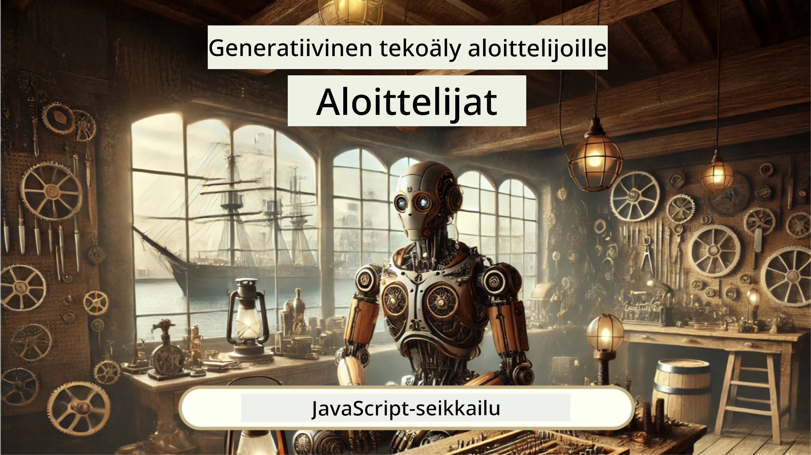
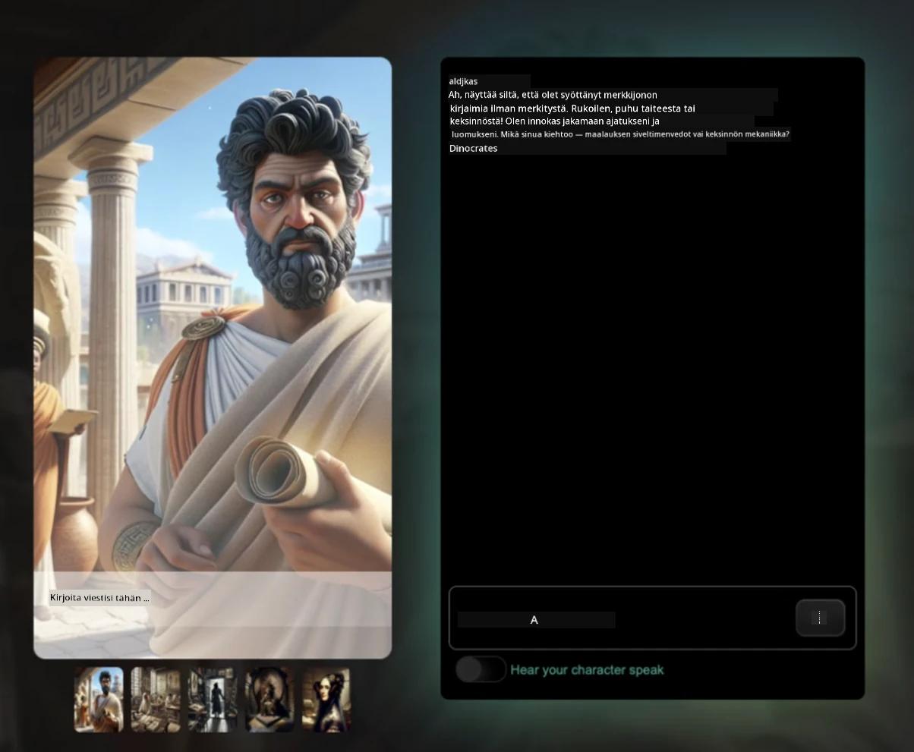
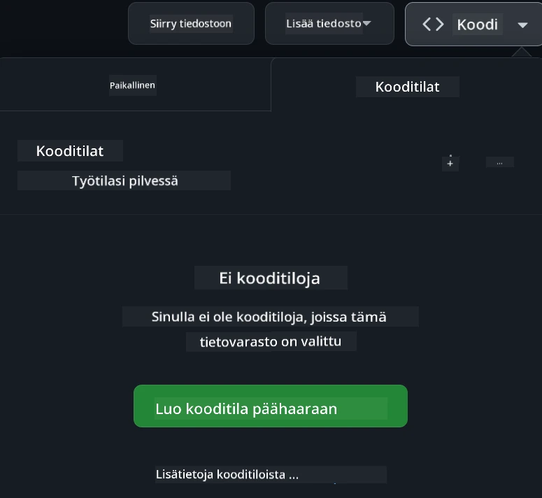

[](https://github.com/microsoft/Web-Dev-For-Beginners/blob/master/LICENSE)
[](https://GitHub.com/microsoft/Web-Dev-For-Beginners/graphs/contributors/)
[](https://GitHub.com/microsoft/Web-Dev-For-Beginners/issues/)
[](https://GitHub.com/microsoft/Web-Dev-For-Beginners/pulls/)
[](http://makeapullrequest.com) 

[](https://GitHub.com/microsoft/Web-Dev-For-Beginners/watchers/)
[](https://GitHub.com/microsoft/Web-Dev-For-Beginners/network/)
[](https://GitHub.com/microsoft/Web-Dev-For-Beginners/stargazers/)

[](https://discord.gg/nTYy5BXMWG)

# Verkkokehitys aloittelijoille - Opetussuunnitelma

Opi verkkokehityksen perusteet kattavalla 12 viikon kurssillamme, jonka on laatinut Microsoft Cloud Advocates. Jokainen 24 oppitunnista syventyy JavaScriptiin, CSS:ään ja HTML:ään käytännön projektien, kuten terraarioiden, selaimen laajennusten ja avaruuspelien kautta. Osallistu tietokilpailuihin, keskusteluihin ja käytännön tehtäviin. Kehitä taitojasi ja optimoi tietojesi omaksuminen tehokkaan projektilähtöisen pedagogiikkamme avulla. Aloita koodausmatkasi tänään!

Liity Azure AI Foundryn Discord-yhteisöön

[](https://discord.gg/nTYy5BXMWG)

Seuraa näitä ohjeita aloittaaksesi näiden resurssien käytön:
1. **Forkkaa repositorio**: Klikkaa [](https://GitHub.com/microsoft/Web-Dev-For-Beginners/fork)
2. **Kloonaa repositorio**:   `git clone https://github.com/microsoft/Web-Dev-For-Beginners.git`
3. [**Liity Azure AI Foundryn Discordiin ja tapaa asiantuntijoita sekä muita kehittäjiä**](https://discord.com/invite/ByRwuEEgH4)

### 🌐 Monikielinen tuki

#### Tuettu GitHub Actionin kautta (automaattinen & aina ajan tasalla)

<!-- CO-OP TRANSLATOR LANGUAGES TABLE START -->
[Arabic](../ar/README.md) | [Bengali](../bn/README.md) | [Bulgarian](../bg/README.md) | [Burmese (Myanmar)](../my/README.md) | [Chinese (Simplified)](../zh-CN/README.md) | [Chinese (Traditional, Hong Kong)](../zh-HK/README.md) | [Chinese (Traditional, Macau)](../zh-MO/README.md) | [Chinese (Traditional, Taiwan)](../zh-TW/README.md) | [Croatian](../hr/README.md) | [Czech](../cs/README.md) | [Danish](../da/README.md) | [Dutch](../nl/README.md) | [Estonian](../et/README.md) | [Finnish](./README.md) | [French](../fr/README.md) | [German](../de/README.md) | [Greek](../el/README.md) | [Hebrew](../he/README.md) | [Hindi](../hi/README.md) | [Hungarian](../hu/README.md) | [Indonesian](../id/README.md) | [Italian](../it/README.md) | [Japanese](../ja/README.md) | [Kannada](../kn/README.md) | [Khmer](../km/README.md) | [Korean](../ko/README.md) | [Lithuanian](../lt/README.md) | [Malay](../ms/README.md) | [Malayalam](../ml/README.md) | [Marathi](../mr/README.md) | [Nepali](../ne/README.md) | [Nigerian Pidgin](../pcm/README.md) | [Norwegian](../no/README.md) | [Persian (Farsi)](../fa/README.md) | [Polish](../pl/README.md) | [Portuguese (Brazil)](../pt-BR/README.md) | [Portuguese (Portugal)](../pt-PT/README.md) | [Punjabi (Gurmukhi)](../pa/README.md) | [Romanian](../ro/README.md) | [Russian](../ru/README.md) | [Serbian (Cyrillic)](../sr/README.md) | [Slovak](../sk/README.md) | [Slovenian](../sl/README.md) | [Spanish](../es/README.md) | [Swahili](../sw/README.md) | [Swedish](../sv/README.md) | [Tagalog (Filipino)](../tl/README.md) | [Tamil](../ta/README.md) | [Telugu](../te/README.md) | [Thai](../th/README.md) | [Turkish](../tr/README.md) | [Ukrainian](../uk/README.md) | [Urdu](../ur/README.md) | [Vietnamese](../vi/README.md)

> **Haluatko kloonata paikallisesti?**
>
> Tämä repositorio sisältää yli 50 kieliversiota, mikä lisää huomattavasti latauskokoa. Kloonataksesi ilman käännöksiä, käytä sparse checkoutia:
>
> **Bash / macOS / Linux:**
> ```bash
> git clone --filter=blob:none --sparse https://github.com/microsoft/Web-Dev-For-Beginners.git
> cd Web-Dev-For-Beginners
> git sparse-checkout set --no-cone '/*' '!translations' '!translated_images'
> ```
>
> **CMD (Windows):**
> ```cmd
> git clone --filter=blob:none --sparse https://github.com/microsoft/Web-Dev-For-Beginners.git
> cd Web-Dev-For-Beginners
> git sparse-checkout set --no-cone "/*" "!translations" "!translated_images"
> ```
>
> Saat kaiken tarvittavan kurssin suorittamiseen paljon nopeammalla latauksella.
<!-- CO-OP TRANSLATOR LANGUAGES TABLE END -->

**Jos haluat, että muita käännöskieliä tuetaan, ne löytyvät [täältä](https://github.com/Azure/co-op-translator/blob/main/getting_started/supported-languages.md)**

[](https://open.vscode.dev/microsoft/Web-Dev-For-Beginners)

#### 🧑‍🎓 _Oletko opiskelija?_

Vieraile [**Student Hub -sivulla**](https://docs.microsoft.com/learn/student-hub/?WT.mc_id=academic-77807-sagibbon), josta löydät aloittelijoille suunnattuja resursseja, opiskelijapaketit ja jopa tapoja saada ilmainen todistuksen voucher. Tämä sivu kannattaa lisätä kirjanmerkkeihin ja tarkistaa säännöllisesti, koska sisältö vaihtuu kuukausittain.

### 📣 Ilmoitus - Uudet GitHub Copilot Agent -tilahaasteet suoritettavaksi!

Uusi haaste lisätty, etsi "GitHub Copilot Agent Challenge 🚀" useimmista luvuista. Tämä on uusi haaste, jonka voit suorittaa käyttäen GitHub Copilotia ja Agent-tilaa. Jos et ole aiemmin käyttänyt Agent-tilaa, se pystyy tuottamaan ei pelkästään tekstiä, vaan myös luomaan ja muokkaamaan tiedostoja, suorittamaan komentoja ja muuta.

### 📣 Ilmoitus - _Uusi projekti rakennettavaksi Generatiivisella AI:lla_

Uusi AI-avustajaprojekti juuri lisätty, tutustu [projektiin](./9-chat-project/README.md)

### 📣 Ilmoitus - _Uusi opetussuunnitelma_ Generatiivisesta AI:sta JavaScriptille juuri julkaistu

Älä missaa uutta Generatiivisen AI:n opetussuunnitelmaamme!

Siirry sivulle [https://aka.ms/genai-js-course](https://aka.ms/genai-js-course) aloittaaksesi!



- Oppitunnit kattavat kaiken perusteista RAG:iin saakka.
- Keskustele historiallisten hahmojen kanssa GenAI:n ja kumppanisovelluksemme avulla.
- Hauska ja mukaansatempaava kertomus, jossa aikamatkustat!



Jokaisessa oppitunnissa on suoritettava tehtävä, tietotesti ja haaste, jotka ohjaavat oppimaan aiheita kuten:
- Kehote- ja prompteinsinööritaito
- Tekstin ja kuvan sovellustuotanto
- Hakusovellukset

Siirry sivulle [https://aka.ms/genai-js-course](https://aka.ms/genai-js-course) aloittaaksesi!


## 🌱 Aloittaminen

> **Opettajat**, olemme lisänneet [joitakin ehdotuksia](for-teachers.md) tämän opetussuunnitelman käyttöön. Arvostamme palautettanne [keskustelufoorumillamme](https://github.com/microsoft/Web-Dev-For-Beginners/discussions/categories/teacher-corner)!

**[Oppijat](https://aka.ms/student-page/?WT.mc_id=academic-77807-sagibbon)**, jokaiselle oppitunnille, aloita ennakko-oppitentin tekemisellä ja etene lukemalla luentomateriaali, suorittamalla erilaiset tehtävät ja tarkista ymmärryksesi jälkitentin avulla.

Parantaaksesi oppimiskokemustasi, yhdistä voimasi vertaistesi kanssa projektien parissa! Keskusteluja suositaan [keskustelufoorumillamme](https://github.com/microsoft/Web-Dev-For-Beginners/discussions), jossa moderaattoritiimimme on valmiina vastaamaan kysymyksiisi.

Koulutuksesi syventämiseksi suosittelemme lämpimästi tutustumaan [Microsoft Learniin](https://learn.microsoft.com/users/wirelesslife/collections/p1ddcy5jwy0jkm?WT.mc_id=academic-77807-sagibbon) lisäoppimateriaaleja varten.

### 📋 Ympäristön asennus

Tässä opetussuunnitelmassa on kehitysympäristö valmiina käytettäväksi! Aloittaessasi voit valita opetussuunnitelman ajamisen [Codespace](https://github.com/features/codespaces/) -ympäristössä (_selainpohjainen, ei asennuksia tarvitseva ympäristö_) tai paikallisesti tietokoneellasi käyttämällä tekstieditoria, kuten [Visual Studio Codea](https://code.visualstudio.com/?WT.mc_id=academic-77807-sagibbon).

#### Luo oma repositoriosi
Jotta voit helposti tallentaa työsi, on suositeltavaa luoda oma kopio tästä repositoriosta. Voit tehdä sen klikkaamalla sivun ylälaidassa olevaa **Use this template** -painiketta. Tämä luo uuden repositorion GitHub-tilillesi, jossa on kopio opetussuunnitelmasta.

Seuraa nämä vaiheet:
1. **Forkkaa repositorio**: Klikkaa "Fork" -painiketta tämän sivun oikeassa yläkulmassa.
2. **Kloonaa repositorio**:   `git clone https://github.com/microsoft/Web-Dev-For-Beginners.git`

#### Opetussuunnitelman suorittaminen Codespacessa

Luo omaan kopioosi tästä repositoriosta, jonka teit, klikkaa **Code** -painiketta ja valitse **Open with Codespaces**. Tämä luo sinulle uuden Codespace-ympäristön työskentelyä varten.



#### Opetussuunnitelman suorittaminen paikallisesti tietokoneellasi

Suorittaaksesi tämän opetussuunnitelman paikallisesti tietokoneellasi tarvitset tekstieditorin, selaimen ja komentorivityökalun. Ensimmäinen oppituntimme, [Johdanto ohjelmointikieliin ja työkaluihin](../../1-getting-started-lessons/1-intro-to-programming-languages), opastaa sinua erilaisten työkaluvaihtoehtojen läpi, joista voit valita sinulle parhaiten sopivat.

Suosittelemme käyttämään editorina [Visual Studio Codea](https://code.visualstudio.com/?WT.mc_id=academic-77807-sagibbon), jossa on myös sisäänrakennettu [Komentorivi](https://code.visualstudio.com/docs/terminal/basics/?WT.mc_id=academic-77807-sagibbon). Voit ladata Visual Studio Coden [tästä](https://code.visualstudio.com/?WT.mc_id=academic-77807-sagibbon).
1. Kloonaa arkistosi tietokoneellesi. Voit tehdä tämän napsauttamalla **Code**-painiketta ja kopioimalla URL-osoitteen:

    [CodeSpace](./images/createcodespace.png)

    Avaa sitten [Terminal](https://code.visualstudio.com/docs/terminal/basics/?WT.mc_id=academic-77807-sagibbon) [Visual Studio Codessa](https://code.visualstudio.com/?WT.mc_id=academic-77807-sagibbon) ja suorita seuraava komento korvaten `<your-repository-url>` juuri kopioimallasi URL-osoitteella:

    ```bash 
    git clone <your-repository-url>
    ```

2. Avaa kansio Visual Studio Codessa. Voit tehdä tämän napsauttamalla **File** > **Open Folder** ja valitsemalla juuri kloonaamasi kansion.


>  Suositellut Visual Studio Code -laajennukset:
>
> * [Live Server](https://marketplace.visualstudio.com/items?itemName=ritwickdey.LiveServer&WT.mc_id=academic-77807-sagibbon) - HTML-sivujen esikatselua varten Visual Studio Codessa
> * [Copilot](https://marketplace.visualstudio.com/items?itemName=GitHub.copilot&WT.mc_id=academic-77807-sagibbon) - auttaa sinua kirjoittamaan koodia nopeammin

## 📂 Jokainen oppitunti sisältää:

- valinnaisen sketchnoten
- valinnaisen tukevan videon
- lämmittelykyselyn ennen oppituntia
- kirjallisen oppitunnin
- projektipohjaisissa oppitunneissa vaiheittaiset ohjeet projektin rakentamiseen
- tietämyksen tarkistukset
- haasteen
- tukevan lukemisen
- tehtävän
- [oppitunnin jälkeisen kyselyn](https://ff-quizzes.netlify.app/web/)

> **Huomio kyselyistä**: Kaikki kyselyt ovat Quiz-app-kansiossa, yhteensä 48 kyselyä, joissa jokaisessa on kolme kysymystä. Ne ovat saatavilla [tästä](https://ff-quizzes.netlify.app/web/). Kyselysovellusta voi käyttää paikallisesti tai ottaa käyttöön Azuren kautta; noudata ohjeita `quiz-app`-kansiossa.

## 🗃️ Oppitunnit

|     |                        Projektin nimi                        |                            Käsitellyt käsitteet                             | Oppimistavoitteet                                                                                                                 |                                                       Linkitetty oppitunti                                                        |         Tekijä          |
| :-: | :----------------------------------------------------------: | :------------------------------------------------------------------------: | --------------------------------------------------------------------------------------------------------------------------------- | :-------------------------------------------------------------------------------------------------------------------------------: | :---------------------: |
| 01  |                        Getting Started                       |               Ohjelmoinnin perusteet ja työkalut               | Opi useimpien ohjelmointikielten perustukset ja ohjelmistot, jotka auttavat ammattilaiskehittäjiä työssään | [Johdatus ohjelmointikieliin ja työkaluihin](./1-getting-started-lessons/1-intro-to-programming-languages/README.md) |         Jasmine         |
| 02  |                        Getting Started                       |                GitHubin perusteet, sisältää yhteistyön tiimissä                | Kuinka käyttää GitHubia projektissasi, miten tehdä yhteistyötä muiden kanssa koodikannan parissa                                    |                              [Johdatus GitHubiin](./1-getting-started-lessons/2-github-basics/README.md)                             |          Floor          |
| 03  |                        Getting Started                       |                                Esteettömyys                                | Opi verkkosisällön saavutettavuuden perusteet                                                                                     |                          [Esteettömyyden perusteet](./1-getting-started-lessons/3-accessibility/README.md)                          |       Christopher       |
| 04  |                           JS Basics                          |                          JavaScriptin tietotyypit                           | JavaScriptin tietotyyppien perusteet                                                                                             |                                     [Tietotyypit](./2-js-basics/1-data-types/README.md)                                      |         Jasmine         |
| 05  |                           JS Basics                          |                           Funktiot ja metodit                            | Opi funktioista ja metodeista sovelluksen logiikan hallinnassa                                                                    |                                [Funktiot ja metodit](./2-js-basics/2-functions-methods/README.md)                                  | Jasmine ja Christopher  |
| 06  |                           JS Basics                          |                          Päätöksenteko JS:llä                          | Opi luomaan ehtoisuuksia koodissasi päätöksentekomenetelmillä                                                                     |                                 [Päätöksenteko](./2-js-basics/3-making-decisions/README.md)                                  |         Jasmine         |
| 07  |                           JS Basics                          |                             Taulukot ja silmukat                            | Työskentele datan kanssa taulukoiden ja silmukoiden avulla JavaScriptissä                                                         |                                   [Taulukot ja silmukat](./2-js-basics/4-arrays-loops/README.md)                                  |         Jasmine         |
| 08  |         [Terrarium](./3-terrarium/solution/README.md)        |                            HTML käytännössä                            | Rakenna HTML luodaksesi verkkoterraarion keskittyen asettelun rakentamiseen                                                        |                                 [Johdatus HTML:ään](./3-terrarium/1-intro-to-html/README.md)                                  |           Jen           |
| 09  |         [Terrarium](./3-terrarium/solution/README.md)        |                            CSS käytännössä                             | Luo CSS tyylitelläksesi verkkoterraariota, keskittyen CSS:n perusteisiin ja sivun responsiivisuuteen                              |                                  [Johdatus CSS:ään](./3-terrarium/2-intro-to-css/README.md)                                   |           Jen           |
| 10  |            [Terrarium](./3-terrarium/solution/README.md)             |              JavaScript Closuret, DOM-manipulointi               | Rakenna JavaScript, joka tekee terrariumin toimivaksi drag/drop-käyttöliittymänä, keskittyen closureihin ja DOM-manipulointiin   |                [JavaScript Closuret, DOM-manipulointi](./3-terrarium/3-intro-to-DOM-and-closures/README.md)                   |           Jen           |
| 11  |           [Typing Game](./4-typing-game/solution/README.md)           |                          Typing-pelin rakentaminen                           | Opi käyttämään näppäimistötapahtumia JavaScript-sovelluksesi logiikan ohjaamiseen                                                 |                             [Tapahtumaohjautuva ohjelmointi](./4-typing-game/typing-game/README.md)                             |       Christopher       |
| 12  | [Green Browser Extension](./5-browser-extension/solution/README.md) |                          Toimiminen selaimissa                          | Opi, miten selaimet toimivat, niiden historia ja miten rakentaa selaimien laajennuksen ensimmäiset elementit                      |                              [Tietoa selaimista](./5-browser-extension/1-about-browsers/README.md)                              |           Jen           |
| 13  | [Green Browser Extension](./5-browser-extension/solution/README.md) | Lomakkeen rakentaminen, API:n käyttäminen ja muuttujien tallentaminen paikalliseen muistiin | Rakenna selainlaajennuksen JavaScript-elementit API-kutsujen tekemiseen käyttäen paikalliseen muistiin tallennettuja muuttujia      |              [API:t, lomakkeet ja paikallinen muisti](./5-browser-extension/2-forms-browsers-local-storage/README.md)             |           Jen           |
| 14  | [Green Browser Extension](./5-browser-extension/solution/README.md) |            Taustaprosessit selaimessa ja verkkosuorituskyky            | Käytä selaimen taustaprosesseja laajennuksen kuvakkeen hallintaan; opi verkkosuorituskyvystä ja joistakin optimoinneista         |              [Taustatehtävät ja suorituskyky](./5-browser-extension/3-background-tasks-and-performance/README.md)              |           Jen           |
| 15  |            [Space Game](./6-space-game/solution/README.md)            |                 Edistyneempi pelinkehitys JavaScriptillä                | Opi perinnäisyydestä käyttäen sekä luokkia että koostetta sekä Pub/Sub-mallista pelin rakentamista varten                         |                  [Johdatus edistyneeseen pelinkehitykseen](./6-space-game/1-introduction/README.md)                             |          Chris          |
| 16  |            [Space Game](./6-space-game/solution/README.md)            |                          Piirtäminen canvakselle                         | Opi Canvas API:sta, jota käytetään elementtien piirtämiseen näytölle                                                             |                               [Piirtäminen canvakselle](./6-space-game/2-drawing-to-canvas/README.md)                          |          Chris          |
| 17  |            [Space Game](./6-space-game/solution/README.md)            |                      Elementtien liikuttaminen näytöllä                   | Tutustu, miten elementtejä voi liikuttaa käyttäen karteesisia koordinaatteja ja Canvas API:a                                      |                            [Elementtien liikuttaminen](./6-space-game/3-moving-elements-around/README.md)                      |          Chris          |
| 18  |            [Space Game](./6-space-game/solution/README.md)            |                            Törmäysten havaitseminen                       | Tee elementtien törmäämisestä ja reagoimisesta toisiinsa näppäinpainallusten avulla ja lisää cooldown-toiminto pelin suorituskyvyn varmistamiseksi |                            [Törmäysten havaitseminen](./6-space-game/4-collision-detection/README.md)                            |          Chris          |
| 19  |            [Space Game](./6-space-game/solution/README.md)            |                                  Pisteiden seuranta                        | Tee matemaattisia laskelmia pelin tilan ja suorituskyvyn perusteella                                                             |                                      [Pisteiden seuranta](./6-space-game/5-keeping-score/README.md)                              |          Chris          |
| 20  |            [Space Game](./6-space-game/solution/README.md)            |                             Pelin lopetus ja uudelleen käynnistys               | Opi pelin lopettamisesta ja uudelleenkäynnistyksestä, mukaan lukien resurssien siivouksesta ja muuttujien nollauksesta              |                                [Lopetusehto](./6-space-game/6-end-condition/README.md)                                         |          Chris          |
| 21  |          [Banking App](./7-bank-project/solution/README.md)           |                    HTML-mallit ja reititys web-sovelluksessa              | Opi luomaan monisivuisen verkkosivuston runko reitityksen ja HTML-mallien avulla                                                    |                              [HTML-mallit ja reititys](./7-bank-project/1-template-route/README.md)                              |          Yohan          |
| 22  |          [Banking App](./7-bank-project/solution/README.md)           |                      Kirjautumis- ja rekisteröitymislomakkeen rakentaminen                     | Opi lomakkeiden rakentamisesta ja validoinnin käsittelystä                                                                        |                                      [Lomakkeet](./7-bank-project/2-forms/README.md)                                         |          Yohan          |
| 23  |          [Banking App](./7-bank-project/solution/README.md)           |                    Tietojen hakemisen ja käytön menetelmät                  | Kuinka tieto virtaa sovelluksessasi, miten sitä haetaan, tallennetaan ja hävitetään                                                |                                           [Tieto](./7-bank-project/3-data/README.md)                                         |          Yohan          |
| 24  |          [Banking App](./7-bank-project/solution/README.md)           |                           Tilanhallinnan käsitteet                         | Opi, miten sovelluksesi säilyttää tilaa ja hallinnoi sitä ohjelmallisesti                                                         |                                  [Tilanhallinta](./7-bank-project/4-state-management/README.md)                               |          Yohan          |
| 25 | [Browser/VScode Code](../../8-code-editor) | Työskentely VScoden kanssa | Opi käyttämään koodieditoria| [Käytä VScode-koodieditoria](./8-code-editor/1-using-a-code-editor/README.md) | Chris |
| 26 | [AI Assistants](./9-chat-project/README.md) | Työskentely tekoälyn kanssa | Opi rakentamaan oma tekoälyavustajasi | [Tekoälyavustajaprojekti](./9-chat-project/README.md) | Chris |

## 🏫 Pedagogiikka

Oppimateriaalimme on suunniteltu kahden keskeisen pedagogisen periaatteen pohjalta:
* projektipohjainen oppiminen
* säännölliset kyselyt

Ohjelma opettaa JavaScriptin, HTML:n ja CSS:n perusteet sekä uusimmat työkalut ja tekniikat, joita nykypäivän web-kehittäjät käyttävät. Opiskelijat saavat käytännön kokemusta rakentamalla kirjoituspelin, virtuaalisen terrarion, ympäristöystävällisen selainlaajennuksen, avaruuslajin pelin sekä pankkisovelluksen yrityksille. Sarjan lopuksi opiskelijoilla on vankka ymmärrys web-kehityksestä.

> 🎓 Voit suorittaa tämän oppimateriaalin ensimmäiset oppitunnit osana [Learn Path](https://docs.microsoft.com/learn/paths/web-development-101/?WT.mc_id=academic-77807-sagibbon) -opintopolkua Microsoft Learnissä!

Sisällön linkittäminen projekteihin tekee prosessista opiskelijalle mielekkäämpää ja käsitteiden muistaminen paranee. Kirjoitimme myös useita aloittavia JavaScriptin perusteisiin keskittyviä oppitunteja, joissa perehdytään käsitteisiin, ja ne ovat parina videon kanssa "[Beginners Series to: JavaScript](https://channel9.msdn.com/Series/Beginners-Series-to-JavaScript/?WT.mc_id=academic-77807-sagibbon)" kokoelmasta, jonka osa tekijöistä osallistui tämän oppimateriaalin laadintaan.

Lisäksi kevyt kysely ennen luentoa asettaa opiskelijan opiskelutavoitetta ja toinen kysely luennon jälkeen varmistaa sisällön parempaa omaksumista. Tämä oppimateriaali on tarkoitettu joustavaksi ja hauskaksi, ja sen voi suorittaa kokonaan tai osittain. Projektit alkavat yksinkertaisista ja monimutkaistuvat 12 viikon jaksolla.

Vaikka tarkoituksella vältimme JavaScript-kirjastojen esittelyä keskittyäksemme verkkokehittäjän perustaitoihin ennen kirjastoihin siirtymistä, seuraava hyvä askel tämän oppimateriaalin jälkeen olisi Node.js:n opiskelu toisen videosarjan avulla: "[Beginner Series to: Node.js](https://channel9.msdn.com/Series/Beginners-Series-to-Nodejs/?WT.mc_id=academic-77807-sagibbon)".

> Tutustu [käyttäytymissääntöihimme](CODE_OF_CONDUCT.md) ja [osallistumisohjeisiimme](CONTRIBUTING.md). Otamme mielellämme vastaan rakentavaa palautettasi!


## 🧭 Offline-käyttö

Voit käyttää tätä dokumentaatiota offline-tilassa käyttämällä [Docsify](https://docsify.js.org/#/). Haarauta tämä arkisto, [asenna Docsify](https://docsify.js.org/#/quickstart) paikallisesti koneellesi, ja kirjoita tämän arkiston juurikansiossa `docsify serve`. Sivusto palvelee portissa 3000 paikallisessa ympäristössä: `localhost:3000`.

## 📘 PDF
Kaikkiin oppitunteihin liittyvän PDF:n löydät täältä [here](https://microsoft.github.io/Web-Dev-For-Beginners/pdf/readme.pdf).


## 🎒 Muut kurssit

Tiimimme tuottaa myös muita kursseja! Tutustu:

<!-- CO-OP TRANSLATOR OTHER COURSES START -->
### LangChain
[](https://aka.ms/langchain4j-for-beginners)
[](https://aka.ms/langchainjs-for-beginners?WT.mc_id=m365-94501-dwahlin)
[](https://github.com/microsoft/langchain-for-beginners?WT.mc_id=m365-94501-dwahlin)
---

### Azure / Edge / MCP / Agents
[](https://github.com/microsoft/AZD-for-beginners?WT.mc_id=academic-105485-koreyst)
[](https://github.com/microsoft/edgeai-for-beginners?WT.mc_id=academic-105485-koreyst)
[](https://github.com/microsoft/mcp-for-beginners?WT.mc_id=academic-105485-koreyst)
[](https://github.com/microsoft/ai-agents-for-beginners?WT.mc_id=academic-105485-koreyst)

---
 
### Generatiivinen tekoäly -sarja
[](https://github.com/microsoft/generative-ai-for-beginners?WT.mc_id=academic-105485-koreyst)
[-9333EA?style=for-the-badge&labelColor=E5E7EB&color=9333EA)](https://github.com/microsoft/Generative-AI-for-beginners-dotnet?WT.mc_id=academic-105485-koreyst)
[-C084FC?style=for-the-badge&labelColor=E5E7EB&color=C084FC)](https://github.com/microsoft/generative-ai-for-beginners-java?WT.mc_id=academic-105485-koreyst)
[-E879F9?style=for-the-badge&labelColor=E5E7EB&color=E879F9)](https://github.com/microsoft/generative-ai-with-javascript?WT.mc_id=academic-105485-koreyst)

---
 
### Perusopiskelu
[](https://aka.ms/ml-beginners?WT.mc_id=academic-105485-koreyst)
[](https://aka.ms/datascience-beginners?WT.mc_id=academic-105485-koreyst)
[](https://aka.ms/ai-beginners?WT.mc_id=academic-105485-koreyst)
[](https://github.com/microsoft/Security-101?WT.mc_id=academic-96948-sayoung)
[](https://aka.ms/webdev-beginners?WT.mc_id=academic-105485-koreyst)
[](https://aka.ms/iot-beginners?WT.mc_id=academic-105485-koreyst)
[](https://github.com/microsoft/xr-development-for-beginners?WT.mc_id=academic-105485-koreyst)

---
 
### Copilot-sarja
[](https://aka.ms/GitHubCopilotAI?WT.mc_id=academic-105485-koreyst)
[](https://github.com/microsoft/mastering-github-copilot-for-dotnet-csharp-developers?WT.mc_id=academic-105485-koreyst)
[](https://github.com/microsoft/CopilotAdventures?WT.mc_id=academic-105485-koreyst)
<!-- CO-OP TRANSLATOR OTHER COURSES END -->

## Apua

Jos juutut tai sinulla on kysyttävää tekoälysovellusten rakentamisesta, liity muiden oppijoiden ja kokeneiden kehittäjien keskusteluihin MCP:stä. Se on kannustava yhteisö, jossa kysymykset ovat tervetulleita ja tieto jaetaan vapaasti.

[](https://discord.gg/nTYy5BXMWG)

Jos sinulla on palautetta tuotteesta tai löydät virheitä rakentaessasi, käy:

[](https://aka.ms/foundry/forum)

## Lisenssi

Tämä arkisto on lisensoitu MIT-lisenssillä. Katso lisätietoja [LICENSE](../../LICENSE)-tiedostosta.

---

<!-- CO-OP TRANSLATOR DISCLAIMER START -->
**Vastuuvapauslauseke**:  
Tämä asiakirja on käännetty käyttämällä tekoälypohjaista käännöspalvelua [Co-op Translator](https://github.com/Azure/co-op-translator). Vaikka pyrimme tarkkuuteen, ota huomioon, että automaattikäännöksissä saattaa esiintyä virheitä tai epätarkkuuksia. Alkuperäistä asiakirjaa sen omalla kielellä tulisi pitää virallisena lähteenä. Tärkeiden tietojen osalta suositellaan ammattimaista ihmiskäännöstä. Emme ole vastuussa tämän käännöksen käytöstä johtuvista väärinymmärryksistä tai tulkinnoista.
<!-- CO-OP TRANSLATOR DISCLAIMER END -->