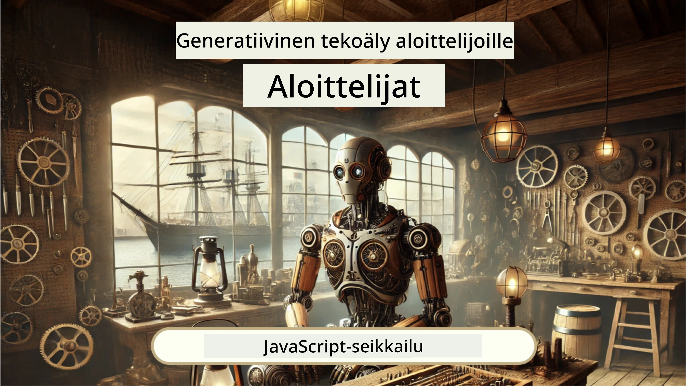
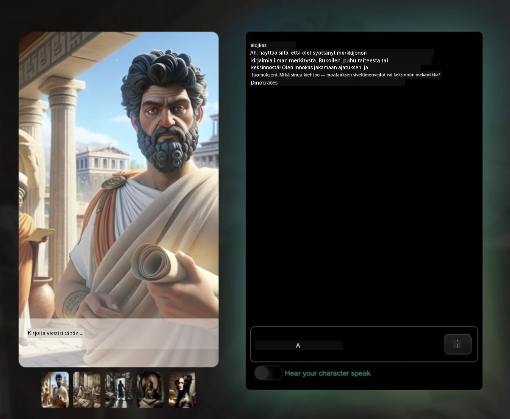
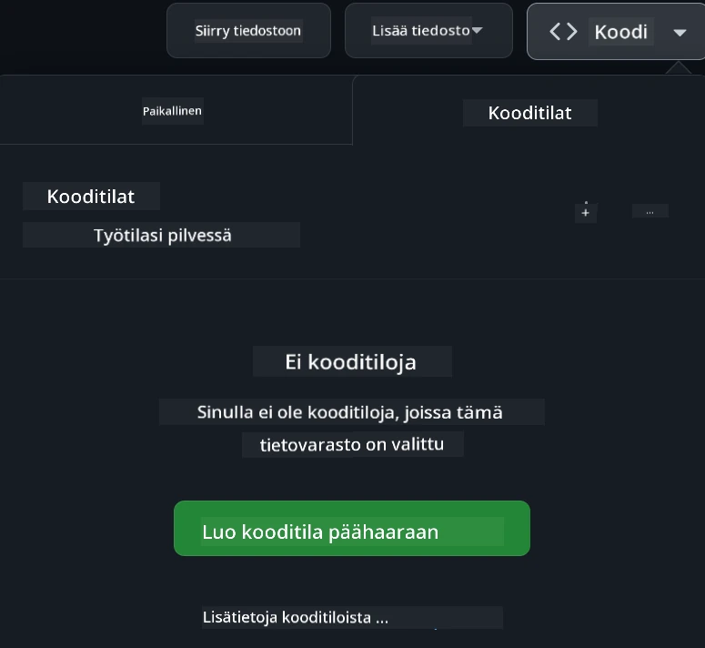

[](https://github.com/microsoft/Web-Dev-For-Beginners/blob/master/LICENSE)
[](https://GitHub.com/microsoft/Web-Dev-For-Beginners/graphs/contributors/)
[](https://GitHub.com/microsoft/Web-Dev-For-Beginners/issues/)
[](https://GitHub.com/microsoft/Web-Dev-For-Beginners/pulls/)
[](http://makeapullrequest.com) 

[](https://GitHub.com/microsoft/Web-Dev-For-Beginners/watchers/)
[](https://GitHub.com/microsoft/Web-Dev-For-Beginners/network/)
[](https://GitHub.com/microsoft/Web-Dev-For-Beginners/stargazers/)

[](https://discord.gg/nTYy5BXMWG)

# Verkkokehitys aloittelijoille – Opetussuunnitelma

Opi verkkokehityksen perusteet Microsoft Cloud Advocatesin 12 viikon kattavan kurssin avulla. Jokainen 24 oppitunnista sukeltaa JavaScriptin, CSS:n ja HTML:n maailmaan käytännön projekteilla, kuten terraarioilla, selainlaajennuksilla ja avaruuspeleillä. Osallistu tietovisoihin, keskusteluihin ja käytännön tehtäviin. Kehitä taitojasi ja optimoi tiedon omaksuminen tehokkaan projektiperusteisen opetuksen avulla. Aloita koodausmatkasi tänään!

Liity Azure AI Foundryn Discord-palvelimeen ja tapaa asiantuntijoita ja muita kehittäjiä.

[](https://discord.gg/nTYy5BXMWG)

Seuraa näitä ohjeita aloittaaksesi näiden materiaalien käytön:
1. **Tee forkki arkistosta**: Klikkaa [](https://GitHub.com/microsoft/Web-Dev-For-Beginners/fork)
2. **Kloonaa arkisto**:   `git clone https://github.com/microsoft/Web-Dev-For-Beginners.git`
3. [**Liity Azure AI Foundryn Discordiin ja tapaa asiantuntijat ja kehittäjäkollegat**](https://discord.com/invite/ByRwuEEgH4)

### 🌐 Monikielinen tuki

#### Tuettu GitHub Actionin kautta (automaattinen ja aina ajan tasalla)

<!-- CO-OP TRANSLATOR LANGUAGES TABLE START -->
[Arabic](../ar/README.md) | [Bengali](../bn/README.md) | [Bulgarian](../bg/README.md) | [Burmese (Myanmar)](../my/README.md) | [Chinese (Simplified)](../zh-CN/README.md) | [Chinese (Traditional, Hong Kong)](../zh-HK/README.md) | [Chinese (Traditional, Macau)](../zh-MO/README.md) | [Chinese (Traditional, Taiwan)](../zh-TW/README.md) | [Croatian](../hr/README.md) | [Czech](../cs/README.md) | [Danish](../da/README.md) | [Dutch](../nl/README.md) | [Estonian](../et/README.md) | [Finnish](./README.md) | [French](../fr/README.md) | [German](../de/README.md) | [Greek](../el/README.md) | [Hebrew](../he/README.md) | [Hindi](../hi/README.md) | [Hungarian](../hu/README.md) | [Indonesian](../id/README.md) | [Italian](../it/README.md) | [Japanese](../ja/README.md) | [Kannada](../kn/README.md) | [Khmer](../km/README.md) | [Korean](../ko/README.md) | [Lithuanian](../lt/README.md) | [Malay](../ms/README.md) | [Malayalam](../ml/README.md) | [Marathi](../mr/README.md) | [Nepali](../ne/README.md) | [Nigerian Pidgin](../pcm/README.md) | [Norwegian](../no/README.md) | [Persian (Farsi)](../fa/README.md) | [Polish](../pl/README.md) | [Portuguese (Brazil)](../pt-BR/README.md) | [Portuguese (Portugal)](../pt-PT/README.md) | [Punjabi (Gurmukhi)](../pa/README.md) | [Romanian](../ro/README.md) | [Russian](../ru/README.md) | [Serbian (Cyrillic)](../sr/README.md) | [Slovak](../sk/README.md) | [Slovenian](../sl/README.md) | [Spanish](../es/README.md) | [Swahili](../sw/README.md) | [Swedish](../sv/README.md) | [Tagalog (Filipino)](../tl/README.md) | [Tamil](../ta/README.md) | [Telugu](../te/README.md) | [Thai](../th/README.md) | [Turkish](../tr/README.md) | [Ukrainian](../uk/README.md) | [Urdu](../ur/README.md) | [Vietnamese](../vi/README.md)

> **Haluatko kloonata paikallisesti?**
>
> Tämä arkisto sisältää yli 50 käännettyä kieltä, mikä lisää huomattavasti latauskokoa. Kloonataksesi ilman käännöksiä, käytä sparse checkoutia:
>
> **Bash / macOS / Linux:**
> ```bash
> git clone --filter=blob:none --sparse https://github.com/microsoft/Web-Dev-For-Beginners.git
> cd Web-Dev-For-Beginners
> git sparse-checkout set --no-cone '/*' '!translations' '!translated_images'
> ```
>
> **CMD (Windows):**
> ```cmd
> git clone --filter=blob:none --sparse https://github.com/microsoft/Web-Dev-For-Beginners.git
> cd Web-Dev-For-Beginners
> git sparse-checkout set --no-cone "/*" "!translations" "!translated_images"
> ```
>
> Tämä antaa sinulle kaiken tarvittavan kurssin suorittamiseen huomattavasti nopeammalla latauksella.
<!-- CO-OP TRANSLATOR LANGUAGES TABLE END -->

**Jos haluat lisää käännöksiä, tuetut kielet löytyvät täältä. [tästä](https://github.com/Azure/co-op-translator/blob/main/getting_started/supported-languages.md)**

[](https://open.vscode.dev/microsoft/Web-Dev-For-Beginners)

#### 🧑‍🎓 _Oletko opiskelija?_

Vieraile [**Student Hub -sivulla**](https://docs.microsoft.com/learn/student-hub/?WT.mc_id=academic-77807-sagibbon), josta löydät aloittelijoille suunnattuja resursseja, opiskelijapakkauksia ja jopa tapoja saada ilmainen sertifikaattikuponki. Tämä on sivu, joka kannattaa lisätä kirjanmerkkeihisi ja tarkistaa aika ajoin, koska päivitämme sisältöä kuukausittain.

### 📣 Ilmoitus – Uudet GitHub Copilot Agent -tilan haasteet suoritettavaksi!

Uusi haaste lisätty, etsi „GitHub Copilot Agent Challenge 🚀” useimmista luvuista. Tämä on uusi haaste sinulle käytettäväksi GitHub Copilotin ja Agent-tilan avulla. Jos et ole aiemmin käyttänyt Agent-tilaa, se pystyy tuottamaan tekstiä, mutta myös luomaan ja muokkaamaan tiedostoja, suorittamaan komentoja ja muuta.

### 📣 Ilmoitus – _Uusi Generatiiviseen tekoälyyn perustuva projekti rakenteilla_ 

Uusi tekoälyavustajaprojekti juuri lisätty, tutustu [projektiin](./9-chat-project/README.md)

### 📣 Ilmoitus – _Uusi opetussuunnitelma_ generatiivisesta tekoälystä JavaScriptillä juuri julkaistu

Älä missaa uutta Generatiivisen tekoälyn opetussuunnitelmaamme!

Aloita osoitteessa [https://aka.ms/genai-js-course](https://aka.ms/genai-js-course)



- Oppitunnit kattavat kaiken perusasioista RAG:iin (Retrieval-Augmented Generation).
- Vuorovaikutusta historiallisten hahmojen kanssa GenAI:n ja seurassovelluksemme avulla.
- Hauska ja mukaansatempaava tarinankerronta, matkustat ajassa!



Jokainen oppitunti sisältää tehtävän, tietotestin ja haasteen, jotka ohjaavat sinua oppimaan aiheita kuten:
- Kehote- ja kehotesuunnittelu
- Tekstin ja kuvan sovellusgenerointi
- Hakusovellukset

Aloita osoitteessa [https://aka.ms/genai-js-course](https://aka.ms/genai-js-course)


## 🌱 Aloita

> **Opettajat**, olemme [lisänneet joitakin vinkkejä](for-teachers.md) kuinka käyttää tätä opetussuunnitelmaa. Arvostamme palautettanne [keskustelufoorumissamme](https://github.com/microsoft/Web-Dev-For-Beginners/discussions/categories/teacher-corner)!

**[Oppijat](https://aka.ms/student-page/?WT.mc_id=academic-77807-sagibbon)**, aloita jokainen oppitunti esiluentokyselyllä ja jatka lukemalla luentomateriaalit, tekemällä eri harjoitukset ja tarkista ymmärryksesi jälkiluentokyselyllä.

Paranna oppimiskokemustasi yhdistämällä muiden oppijoiden kanssa työskentelemään projekteissa yhdessä! Keskusteluja suositellaan [keskustelufoorumissamme](https://github.com/microsoft/Web-Dev-For-Beginners/discussions), jossa moderaattoritiimimme vastaa kysymyksiisi.

Jatkaaksesi opiskelua suosittelemme lämpimästi tutustumaan [Microsoft Learniin](https://learn.microsoft.com/users/wirelesslife/collections/p1ddcy5jwy0jkm?WT.mc_id=academic-77807-sagibbon) saadaksesi lisämateriaaleja.

### 📋 Ympäristön asennus

Tämä opetussuunnitelma sisältää valmiin kehitysympäristön! Aloittaessasi voit valita suorittaa opetussuunnitelman [Codespacessa](https://github.com/features/codespaces/) (_selainpohjainen ympäristö, johon ei tarvitse asentaa mitään_) tai paikallisesti tietokoneellasi tekstieditorilla kuten [Visual Studio Code](https://code.visualstudio.com/?WT.mc_id=academic-77807-sagibbon).

#### Luo oma arkistosi
Työsi tallentamisen helpottamiseksi on suositeltavaa tehdä oma kopiosi tästä arkistosta. Voit tehdä sen klikkaamalla sivun ylälaidassa painiketta **Use this template**. Tämä luo uuden arkiston GitHub-tilillesi opetussuunnitelman kopion kanssa.

Noudata näitä ohjeita:
1. **Tee forkki arkistosta**: Klikkaa sivun oikeassa yläkulmassa olevaa "Fork"-painiketta.
2. **Kloonaa arkisto**:   `git clone https://github.com/microsoft/Web-Dev-For-Beginners.git`

#### Opetussuunnitelman suorittaminen Codespacessa

Oman luomasi kopion arkistosta kohdalla klikkaa **Code**-painiketta ja valitse **Open with Codespaces**. Tämä luo sinulle uuden Codespace-työalueen.



#### Opetussuunnitelman suorittaminen paikallisesti tietokoneella

Suorittaaksesi opetussuunnitelman paikallisesti sinun tulee asentaa tekstieditori, selain ja komentorivityökalu. Ensimmäinen oppituntimme, [Johdatus ohjelmointikieliin ja työkaluihin](../../1-getting-started-lessons/1-intro-to-programming-languages), esittelee sinulle erilaisia vaihtoehtoja jokaiselle näistä työkaluista, jotta voit valita sinulle parhaiten sopivat.

Suosittelemme käyttämään tekstieditorina [Visual Studio Codea](https://code.visualstudio.com/?WT.mc_id=academic-77807-sagibbon), joka sisältää myös sisäisen [Komentorivin (Terminaalin)](https://code.visualstudio.com/docs/terminal/basics/?WT.mc_id=academic-77807-sagibbon). Voit ladata Visual Studio Coden [tästä](https://code.visualstudio.com/?WT.mc_id=academic-77807-sagibbon).
1. Kloonaa oma repositoriosi tietokoneellesi. Voit tehdä tämän napsauttamalla **Code**-painiketta ja kopioimalla URL-osoitteen:

    [CodeSpace](./images/createcodespace.png)

    Avaa sitten [Terminal](https://code.visualstudio.com/docs/terminal/basics/?WT.mc_id=academic-77807-sagibbon) [Visual Studio Code](https://code.visualstudio.com/?WT.mc_id=academic-77807-sagibbon) -sovelluksessa ja suorita seuraava komento korvaamalla `<your-repository-url>` juuri kopioimallasi URL-osoitteella:

    ```bash 
    git clone <your-repository-url>
    ```

2. Avaa kansio Visual Studio Codessa. Voit tehdä tämän napsauttamalla **File** > **Open Folder** ja valitsemalla juuri kloonaamasi kansion.


>  Suositellut Visual Studio Code -laajennukset:
>
> * [Live Server](https://marketplace.visualstudio.com/items?itemName=ritwickdey.LiveServer&WT.mc_id=academic-77807-sagibbon) - HTML-sivujen esikatseluun Visual Studio Codessa
> * [Copilot](https://marketplace.visualstudio.com/items?itemName=GitHub.copilot&WT.mc_id=academic-77807-sagibbon) - auttaa sinua kirjoittamaan koodia nopeammin

## 📂 Jokainen oppitunti sisältää:

- valinnaisen sketchnoten
- valinnaisen lisävideon
- ennen oppituntia tehtävän lämmittelykyselyn
- kirjallisen oppitunnin
- projektilähtöisissä oppitunneissa vaiheittaiset ohjeet projektin rakentamiseen
- tietovisiot
- haasteen
- lisälukemista
- tehtävän
- [oppitunnin jälkeisen kyselyn](https://ff-quizzes.netlify.app/web/)

> **Huomautus kyselyistä**: Kaikki kyselyt löytyvät Quiz-app-kansiosta, yhteensä 48 kyselyä, joissa jokaisessa on kolme kysymystä. Ne ovat saatavilla [tässä](https://ff-quizzes.netlify.app/web/). Quiz-sovellusta voi ajaa paikallisesti tai ottaa käyttöön Azuren kautta; noudata ohjeita `quiz-app`-kansiossa.

## 🗃️ Oppitunnit

|     |                       Projektin nimi                       |                            Käsiteltävät käsitteet                             | Oppimistavoitteet                                                                                                                 |                                                         Linkitetty oppitunti                                                          |         Tekijä          |
| :-: | :------------------------------------------------------: | :--------------------------------------------------------------------: | ----------------------------------------------------------------------------------------------------------------------------------- | :----------------------------------------------------------------------------------------------------------------------------: | :---------------------: |
| 01  |                     Aloittaminen                      |           Johdatus ohjelmointiin ja työkaluihin           | Opi ohjelmointikielten perusperiaatteet ja ohjelmistot, jotka auttavat ammattilaiskehittäjiä työssään | [Johdatus ohjelmointikieliin ja työkaluihin](./1-getting-started-lessons/1-intro-to-programming-languages/README.md) |         Jasmine         |
| 02  |                     Aloittaminen                      |             GitHubin perusteet, tiimityöskentely             | Kuinka käyttää GitHubia projektissa, kuinka tehdä yhteistyötä muiden kanssa koodipohjan parissa                                                    |                            [Johdatus GitHubiin](./1-getting-started-lessons/2-github-basics/README.md)                             |          Floor          |
| 03  |                     Aloittaminen                      |                             Esteettömyys                              | Opi web-estettömyyden perusteet                                                                                               |                       [Esteettömyyden perusteet](./1-getting-started-lessons/3-accessibility/README.md)                       |       Christopher       |
| 04  |                        JS Perusteet                         |                         JavaScriptin tietotyypit                          | JavaScriptin tietotyyppien perusteet                                                                                                 |                                       [Tietotyypit](./2-js-basics/1-data-types/README.md)                                        |         Jasmine         |
| 05  |                        JS Perusteet                         |                         Funktiot ja metodit                          | Opi funktioista ja metodeista sovelluksen logiikan hallintaan                                                             |                              [Funktiot ja metodit](./2-js-basics/2-functions-methods/README.md)                               | Jasmine ja Christopher |
| 06  |                        JS Perusteet                         |                        Päätöksenteko JS:llä                        | Opi luomaan ehtoisuuksia koodissasi päätöksentekomenetelmillä                                                           |                                 [Päätöksenteko](./2-js-basics/3-making-decisions/README.md)                                  |         Jasmine         |
| 07  |                        JS Perusteet                         |                            Taulukot ja silmukat                            | Työskentele datan kanssa käyttäen taulukoita ja silmukoita JavaScriptissä                                                                                 |                                   [Taulukot ja silmukat](./2-js-basics/4-arrays-loops/README.md)                                    |         Jasmine         |
| 08  |       [Terrarium](./3-terrarium/solution/README.md)       |                            HTML käytännössä                            | Rakenna HTML luodaksesi online-terrarion, keskitytään sivun asetteluun                                                         |                                 [Johdatus HTML:ään](./3-terrarium/1-intro-to-html/README.md)                                 |           Jen           |
| 09  |       [Terrarium](./3-terrarium/solution/README.md)       |                            CSS käytännössä                             | Rakenna CSS tyylittelemään online-terrariota, keskitytään CSS:n perusteisiin, mukaan lukien responsiivisuus                     |                                  [Johdatus CSS:ään](./3-terrarium/2-intro-to-css/README.md)                                  |           Jen           |
| 10  |            [Terrarium](./3-terrarium/solution/README.md)            |                 JavaScriptin sulkeet, DOM-manipulointi                  | Rakenna JavaScript, joka tekee terrariosta toimivan vedä/posta -käyttöliittymän, painottaen sulkeita ja DOM-manipulointia             |                  [JavaScript-sulkeet, DOM-manipulointi](./3-terrarium/3-intro-to-DOM-and-closures/README.md)                   |           Jen           |
| 11  |          [Typing Game](./4-typing-game/solution/README.md)          |                          Rakenna kirjoituspeli                           | Opi käyttämään näppäimistötapahtumia JavaScript-sovelluksesi logiikan ohjaamiseen                                                          |                                [Tapahtumapohjainen ohjelmointi](./4-typing-game/typing-game/README.md)                                |       Christopher       |
| 12  | [Green Browser Extension](./5-browser-extension/solution/README.md) |                         Työskentely selainten kanssa                          | Opi selainten toiminnasta, historiasta ja selaimen laajennuksen ensimmäisten elementtien luomisesta                               |                               [Tietoa selaimista](./5-browser-extension/1-about-browsers/README.md)                                |           Jen           |
| 13  | [Green Browser Extension](./5-browser-extension/solution/README.md) | Lomakkeen rakentaminen, API-kutsut ja muuttujien tallennus paikalliseen tallennustilaan | Rakenna selaimen laajennuksen JavaScript-elementit, jotka kutsuvat API:a käyttäen paikalliseen tallennustilaan tallennettuja muuttujia                      |                [API:t, lomakkeet ja paikallinen tallennus](./5-browser-extension/2-forms-browsers-local-storage/README.md)                 |           Jen           |
| 14  | [Green Browser Extension](./5-browser-extension/solution/README.md) |          Taustaprosessit selaimessa, web-suorituskyky          | Hyödynnä selaimen taustaprosesseja laajennuksen kuvakkeen hallintaan; opi web-suorituskyvystä ja joistakin optimoinneista suorituskyvyn parantamiseksi   |             [Taustatehtävät ja suorituskyky](./5-browser-extension/3-background-tasks-and-performance/README.md)              |           Jen           |
| 15  |           [Space Game](./6-space-game/solution/README.md)           |             Edistyneempi pelikehitys JavaScriptillä             | Opi perinnöstä käyttäen luokkia ja koostamista sekä Pub/Sub-mallia pelin rakentamista varten              |                      [Johdatus edistyneeseen pelikehitykseen](./6-space-game/1-introduction/README.md)                       |          Chris          |
| 16  |           [Space Game](./6-space-game/solution/README.md)           |                           Piirtäminen canvasilla                            | Opi Canvas-API:sta, jota käytetään elementtien piirtämiseen näytölle                                                                       |                                [Piirtäminen canvasille](./6-space-game/2-drawing-to-canvas/README.md)                                |          Chris          |
| 17  |           [Space Game](./6-space-game/solution/README.md)           |                   Elementtien liikuttaminen näytöllä                    | Tutustu, kuinka elementit saavat liikkeen käyttäen karteesisia koordinaatteja ja Canvas API:a                                            |                           [Elementtien liikuttaminen](./6-space-game/3-moving-elements-around/README.md)                           |          Chris          |
| 18  |           [Space Game](./6-space-game/solution/README.md)           |                          Törmäystunnistus                           | Tee elementeistä törmäyskelpoisia ja reagoi toisiinsa näppäinten avulla, sekä lisää viivefunktio pelin suorituskyvyn turvaamiseksi    |                              [Törmäystunnistus](./6-space-game/4-collision-detection/README.md)                              |          Chris          |
| 19  |           [Space Game](./6-space-game/solution/README.md)           |                             Pistelasku                              | Suorita matemaattisia laskelmia pelin tilan ja suorituskyvyn perusteella                                                                |                                    [Pistelasku](./6-space-game/5-keeping-score/README.md)                                    |          Chris          |
| 20  |           [Space Game](./6-space-game/solution/README.md)           |                     Pelin lopettaminen ja uudelleenkäynnistys                     | Opi pelin lopettamisesta ja uudelleenkäynnistyksestä, mukaan lukien resurssien siivous ja muuttujien nollaaminen                              |                                [Lopetusehto](./6-space-game/6-end-condition/README.md)                                 |          Chris          |
| 21  |         [Banking App](./7-bank-project/solution/README.md)          |                 HTML-mallit ja reitit web-sovelluksessa                 | Opi luomaan monisivuisen verkkosivuston arkkitehtuurin runko reitityksen ja HTML-mallien avulla                             |                            [HTML-mallit ja reitit](./7-bank-project/1-template-route/README.md)                             |          Yohan          |
| 22  |         [Banking App](./7-bank-project/solution/README.md)          |                  Kirjautumis- ja rekisteröintilomakkeen rakentaminen                   | Opi lomakkeiden rakentamisesta ja validointirutiinien käsittelystä                                                                          |                                           [Lomakkeet](./7-bank-project/2-forms/README.md)                                           |          Yohan          |
| 23  |         [Banking App](./7-bank-project/solution/README.md)          |                   Tietojen hakemisen ja käytön menetelmät                   | Kuinka data virtaa sovellukseen ja sieltä pois, kuinka hakea sitä, tallentaa ja käsitellä                                                 |                                            [Data](./7-bank-project/3-data/README.md)                                            |          Yohan          |
| 24  |         [Banking App](./7-bank-project/solution/README.md)          |                      Tilanhallinnan käsitteet                      | Opi kuinka sovelluksesi säilyttää tilan ja hallitsee sitä ohjelmallisesti                                                              |                                [Tilanhallinta](./7-bank-project/4-state-management/README.md)                                |          Yohan          |
| 25 | [Browser/VScode Code](../../8-code-editor) | Työskentely VScoden kanssa | Opi käyttämään koodieditoria | [Käytä VScode -koodieditoria](./8-code-editor/1-using-a-code-editor/README.md) | Chris |
| 26 | [AI Assistants](./9-chat-project/README.md) | Työskentely tekoälyn kanssa | Opi rakentamaan oma tekoälyavustajasi | [AI-avustajaprojekti](./9-chat-project/README.md) | Chris |

## 🏫 Pedagogiikka

Oppiaineemme on suunniteltu kahden tärkeän pedagogisen periaatteen pohjalta:
* projektilähtöinen oppiminen
* tiheät kyselyt

Ohjelma opettaa JavaScriptin, HTML:n ja CSS:n perusteet sekä uusimmat työkalut ja tekniikat, joita nykyiset web-kehittäjät käyttävät. Opiskelijat pääsevät käytännön kokemukseen rakentamalla kirjoituspelin, virtuaaliterrarion, ympäristöystävällisen selaimen laajennuksen, avaruuslajityylisen pelin ja pankkisovelluksen yrityksille. Sarjan lopussa opiskelijoilla on vahva ymmärrys web-kehityksestä.

> 🎓 Voit suorittaa tämän opintokokonaisuuden ensimmäiset oppitunnit Microsoft Learnissä [Learn Pathin](https://docs.microsoft.com/learn/paths/web-development-101/?WT.mc_id=academic-77807-sagibbon) kautta!

Varmistamalla, että sisältö vastaa projekteja, prosessi on opiskelijoille kiinnostavampi ja käsitteiden pysyvyys paranee. Kirjoitimme myös useita alkutason JavaScript-perusteiden oppitunteja käsitteiden esittelyä varten, jotka yhdistettiin videoon "[Beginners Series to: JavaScript](https://channel9.msdn.com/Series/Beginners-Series-to-JavaScript/?WT.mc_id=academic-77807-sagibbon)" -video-opetusmateriaalikokoelmasta, jonka jotkut tekijöistä osallistuivat tämän opetussuunnitelman laatimiseen.

Lisäksi matalan panoksen kysely ennen tuntia suuntaa opiskelijan aikomuksen oppia aihetta, ja toinen kysely tunnin jälkeen varmistaa käsitteiden paremman muistamisen. Tämä opetussuunnitelma on suunniteltu joustavaksi ja hauskaksi ja sen voi suorittaa kokonaan tai osittain. Projektit alkavat pienestä ja monimutkaistuvat vähitellen 12 viikon aikana.

Vaikka olemme tietoisesti välttäneet JavaScript-kehysten esittelyä keskittyäksemme web-kehittäjälle tarvittaviin perusvalmiuksiin ennen kehyksen käyttöönottoa, hyvä seuraava askel tämän opetussuunnitelman jälkeen olisi opiskella Node.js:ää toisen videosarjan kautta: "[Beginner Series to: Node.js](https://channel9.msdn.com/Series/Beginners-Series-to-Nodejs/?WT.mc_id=academic-77807-sagibbon)".

> Tutustu [käyttäytymissääntöihimme](CODE_OF_CONDUCT.md) ja [osallistumisohjeisiimme](CONTRIBUTING.md). Otamme mielellämme vastaan rakentavaa palautetta!


## 🧭 Offline-käyttö

Voit käyttää tätä dokumentaatiota offline-tilassa käyttämällä [Docsify](https://docsify.js.org/#/). Haarauta tämä repositorio, [asenna Docsify](https://docsify.js.org/#/quickstart) paikalliselle koneellesi, ja kirjoita tämän repositorion juurikansiossa `docsify serve`. Verkkosivusto palvellaan portissa 3000 osoitteessa localhost: `localhost:3000`.

## 📘 PDF
Kaikkien oppituntien PDF löytyy täältä [here](https://microsoft.github.io/Web-Dev-For-Beginners/pdf/readme.pdf).


## 🎒 Muut kurssit

Tiimimme tuottaa muita kursseja! Tutustu:

<!-- CO-OP TRANSLATOR OTHER COURSES START -->
### LangChain
[](https://aka.ms/langchain4j-for-beginners)
[](https://aka.ms/langchainjs-for-beginners?WT.mc_id=m365-94501-dwahlin)
[](https://github.com/microsoft/langchain-for-beginners?WT.mc_id=m365-94501-dwahlin)
---

### Azure / Edge / MCP / Agentit
[](https://github.com/microsoft/AZD-for-beginners?WT.mc_id=academic-105485-koreyst)
[](https://github.com/microsoft/edgeai-for-beginners?WT.mc_id=academic-105485-koreyst)
[](https://github.com/microsoft/mcp-for-beginners?WT.mc_id=academic-105485-koreyst)
[](https://github.com/microsoft/ai-agents-for-beginners?WT.mc_id=academic-105485-koreyst)

---
 
### Generatiivinen AI -sarja
[](https://github.com/microsoft/generative-ai-for-beginners?WT.mc_id=academic-105485-koreyst)
[-9333EA?style=for-the-badge&labelColor=E5E7EB&color=9333EA)](https://github.com/microsoft/Generative-AI-for-beginners-dotnet?WT.mc_id=academic-105485-koreyst)
[-C084FC?style=for-the-badge&labelColor=E5E7EB&color=C084FC)](https://github.com/microsoft/generative-ai-for-beginners-java?WT.mc_id=academic-105485-koreyst)
[-E879F9?style=for-the-badge&labelColor=E5E7EB&color=E879F9)](https://github.com/microsoft/generative-ai-with-javascript?WT.mc_id=academic-105485-koreyst)

---
 
### Ydinopinnot
[](https://aka.ms/ml-beginners?WT.mc_id=academic-105485-koreyst)
[](https://aka.ms/datascience-beginners?WT.mc_id=academic-105485-koreyst)
[](https://aka.ms/ai-beginners?WT.mc_id=academic-105485-koreyst)
[](https://github.com/microsoft/Security-101?WT.mc_id=academic-96948-sayoung)
[](https://aka.ms/webdev-beginners?WT.mc_id=academic-105485-koreyst)
[](https://aka.ms/iot-beginners?WT.mc_id=academic-105485-koreyst)
[](https://github.com/microsoft/xr-development-for-beginners?WT.mc_id=academic-105485-koreyst)

---
 
### Copilot-sarja
[](https://aka.ms/GitHubCopilotAI?WT.mc_id=academic-105485-koreyst)
[](https://github.com/microsoft/mastering-github-copilot-for-dotnet-csharp-developers?WT.mc_id=academic-105485-koreyst)
[](https://github.com/microsoft/CopilotAdventures?WT.mc_id=academic-105485-koreyst)
<!-- CO-OP TRANSLATOR OTHER COURSES END -->

## Apua

Jos jäät jumiin tai sinulla on kysyttävää tekoälysovellusten rakentamisesta, liity muiden oppijoiden ja kokeneiden kehittäjien keskusteluihin MCP:stä. Se on kannustava yhteisö, jossa kysymyksiä voi esittää ja tietoa jaetaan vapaasti.

[](https://discord.gg/nTYy5BXMWG)

Jos sinulla on palautetta tuotteesta tai kohtaat virheitä rakennusvaiheessa, vieraile:

[](https://aka.ms/foundry/forum)

## Lisenssi

Tämä arkisto on lisensoitu MIT-lisenssillä. Lisätietoja on tiedostossa [LICENSE](../../LICENSE).

---

<!-- CO-OP TRANSLATOR DISCLAIMER START -->
**Vastuuvapauslauseke**:
Tämä asiakirja on käännetty käyttämällä tekoälypohjaista käännöspalvelua [Co-op Translator](https://github.com/Azure/co-op-translator). Pyrimme tarkkuuteen, mutta huomioithan, että automaattikäännöksissä voi esiintyä virheitä tai epätarkkuuksia. Alkuperäistä asiakirjaa sen omalla kielellä tulee pitää auktoriteettisena lähteenä. Tärkeiden tietojen osalta suositellaan ammattilaisen tekemää käännöstä. Emme ole vastuussa tämän käännöksen käytöstä aiheutuvista väärinymmärryksistä tai virhetulkinnoista.
<!-- CO-OP TRANSLATOR DISCLAIMER END -->