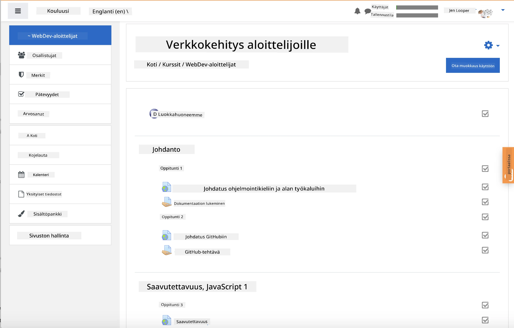
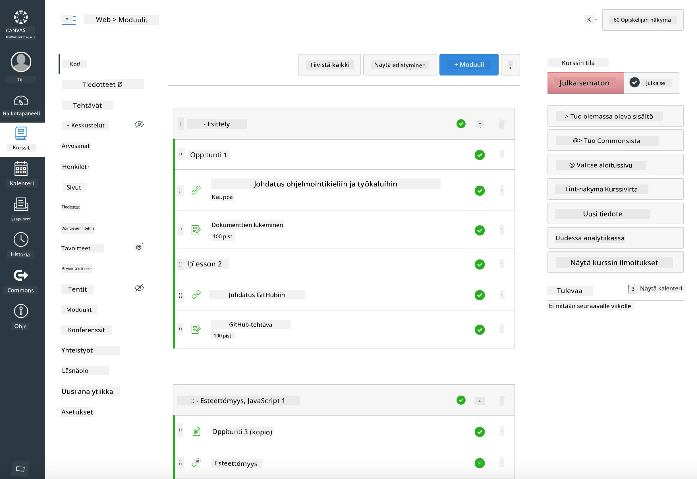

### Opettajille

Voit käyttää tätä opetusohjelmaa luokassasi. Se toimii saumattomasti GitHub Classroomin ja johtavien LMS-alustojen kanssa, ja sitä voidaan käyttää myös itsenäisenä repositoriona opiskelijoiden kanssa.

### Käyttö GitHub Classroomin kanssa

Hallinnoidaksesi oppitunteja ja tehtäviä ryhmittäin, luo yksi repositorio per oppitunti, jotta GitHub Classroom voi liittää jokaisen tehtävän itsenäisesti.

- Haarauta tämä repositorio organisaatioosi.
- Luo erillinen repositorio jokaiselle oppitunnille siirtämällä kunkin oppitunnin kansio omaan repositorioon.
  - Vaihtoehto A: Luo tyhjät repositoriot (yksi per oppitunti) ja kopioi oppitunnin kansion sisältö kuhunkin.
  - Vaihtoehto B: Käytä Git-historian säilyttävää lähestymistapaa (esim. jaa kansio uuteen repositorioon), jos tarvitset alkuperätietoja.
- GitHub Classroomissa luo tehtävä per oppitunti ja osoita se vastaavaan oppitunnin repositorioon.
- Suositellut asetukset:
  - Repositorion näkyvyys: yksityinen opiskelijoiden töille.
  - Käytä aloituskoodia oppitunnin repositorion oletushaarasta.
  - Lisää ongelma- ja pull request -mallit visailuja ja palautuksia varten.
  - Konfiguroi tarvittaessa automaattinen arviointi ja testit, jos oppitunneilla on niitä.
- Hyödylliset käytännöt:
  - Repositorion nimet, kuten lesson-01-intro, lesson-02-html jne.
  - Tunnisteet: quiz, assignment, needs-review, late, resubmission.
  - Tagit/julkaisut ryhmittäin (esim. v2025-term1).

Vinkki: Vältä repositorioiden tallentamista synkronoituihin kansioihin (esim. OneDrive/Google Drive) Git-konfliktien välttämiseksi Windowsissa.

### Käyttö Moodlen, Canvasin tai Blackboardin kanssa

Tämä opetusohjelma sisältää tuontipaketteja yleisiin LMS-työnkulkuihin.

- Moodle: Käytä Moodle-tiedostoa [Moodle upload file](../../../../../../../teaching-files/webdev-moodle.mbz) ladataksesi koko kurssin.
- Common Cartridge: Käytä Common Cartridge -tiedostoa [Common Cartridge file](../../../../../../../teaching-files/webdev-common-cartridge.imscc) laajempaan LMS-yhteensopivuuteen.
- Huomioita:
  - Moodle Cloud tukee rajoitetusti Common Cartridgea. Suosi yllä olevaa Moodle-tiedostoa, joka voidaan myös ladata Canvasiin.
  - Tuonnin jälkeen tarkista moduulit, määräajat ja visailuasetukset, jotta ne vastaavat lukukautesi aikataulua.

> Opetusohjelma Moodle-luokassa

> Opetusohjelma Canvasissa

### Repositorion käyttö suoraan (ilman Classroomia)

Jos et halua käyttää GitHub Classroomia, voit suorittaa kurssin suoraan tästä repositoriosta.

- Synkroniset/verkkopohjaiset muodot (Zoom/Teams):
  - Pidä lyhyitä mentorin vetämiä alkulämmittelyjä; käytä ryhmähuoneita visailuja varten.
  - Ilmoita visailujen aikaväli; opiskelijat lähettävät vastaukset GitHub Issueina.
  - Yhteistyötehtäviä varten opiskelijat työskentelevät julkisissa oppituntirepositorioissa ja avaavat pull requesteja.
- Yksityiset/asynkroniset muodot:
  - Opiskelijat haarauttavat jokaisen oppitunnin omiin **yksityisiin** repositorioihinsa ja lisäävät sinut yhteistyökumppaniksi.
  - He palauttavat tehtävät Issueina (visailut) ja Pull Requesteina (tehtävät) luokkasi repositorioon tai omiin yksityisiin haaroihinsa.

### Parhaat käytännöt

- Tarjoa orientaatio-oppitunti Git/GitHubin perusteista, Issueista ja PR:stä.
- Käytä tarkistuslistoja Issueissa monivaiheisia visailuja/tehtäviä varten.
- Lisää CONTRIBUTING.md ja CODE_OF_CONDUCT.md luokan normeja varten.
- Lisää saavutettavuusmuistiinpanot (alt-teksti, kuvatekstit) ja tarjoa tulostettavia PDF-tiedostoja.
- Versioi sisältösi lukukausittain ja jäädytä oppituntirepositoriot julkaisun jälkeen.

### Palaute ja tuki

Haluamme, että tämä opetusohjelma toimii sinulle ja opiskelijoillesi. Avaa uusi Issue tässä repositoriossa virheiden, pyyntöjen tai parannusten osalta, tai aloita keskustelu Teacher Cornerissa.

---

**Vastuuvapauslauseke**:  
Tämä asiakirja on käännetty käyttämällä tekoälypohjaista käännöspalvelua [Co-op Translator](https://github.com/Azure/co-op-translator). Vaikka pyrimme tarkkuuteen, huomioithan, että automaattiset käännökset voivat sisältää virheitä tai epätarkkuuksia. Alkuperäistä asiakirjaa sen alkuperäisellä kielellä tulisi pitää ensisijaisena lähteenä. Kriittisen tiedon osalta suositellaan ammattimaista ihmiskäännöstä. Emme ole vastuussa väärinkäsityksistä tai virhetulkinnoista, jotka johtuvat tämän käännöksen käytöstä.