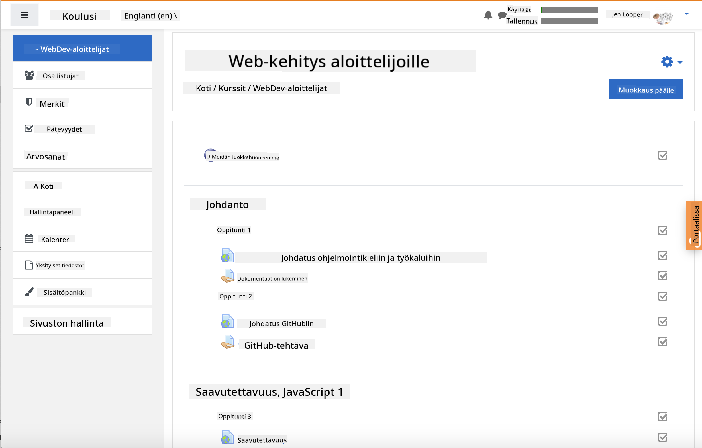

<!--
CO_OP_TRANSLATOR_METADATA:
{
  "original_hash": "75cb51f7ca9ea0b097ef4a1287e9290c",
  "translation_date": "2025-08-27T20:02:29+00:00",
  "source_file": "for-teachers.md",
  "language_code": "fi"
}
-->
## Opettajille

Haluaisitko käyttää tätä opetussuunnitelmaa luokassasi? Ole hyvä ja käytä vapaasti!

Itse asiassa voit käyttää sitä suoraan GitHubissa hyödyntämällä GitHub Classroomia.

Tätä varten haaroita tämä repositorio. Sinun täytyy luoda repositorio jokaiselle oppitunnille, joten sinun täytyy jakaa jokainen kansio erilliseen repositorioon. Näin [GitHub Classroom](https://classroom.github.com/classrooms) voi käsitellä jokaisen oppitunnin erikseen.

Nämä [täydelliset ohjeet](https://github.blog/2020-03-18-set-up-your-digital-classroom-with-github-classroom/) antavat sinulle käsityksen siitä, miten luokkahuoneesi voi asettaa.

## Käyttö Moodle-, Canvas- tai Blackboard-järjestelmissä

Tämä opetussuunnitelma toimii hyvin näissä oppimisen hallintajärjestelmissä! Käytä [Moodle-tiedostoa](../../../../../../../teaching-files/webdev-moodle.mbz) saadaksesi koko sisällön, tai kokeile [Common Cartridge -tiedostoa](../../../../../../../teaching-files/webdev-common-cartridge.imscc), joka sisältää osan sisällöstä. Moodle Cloud ei tue täydellisiä Common Cartridge -vientejä, joten on suositeltavaa käyttää Moodle-lataustiedostoa, joka voidaan ladata Canvas-järjestelmään. Kerro meille, miten voimme parantaa tätä kokemusta.

> Opetussuunnitelma Moodle-luokkahuoneessa

> Opetussuunnitelma Canvasissa

## Repositorion käyttö sellaisenaan

Jos haluat käyttää tätä repositoriota sellaisenaan ilman GitHub Classroomia, sekin onnistuu. Sinun täytyy vain kertoa opiskelijoillesi, minkä oppitunnin parissa työskennellään yhdessä.

Verkko-opetuksessa (Zoom, Teams tai muu vastaava) voit muodostaa pienryhmiä visailuja varten ja ohjata opiskelijoita valmistautumaan oppimiseen. Kutsu sitten opiskelijat visailuihin ja pyydä heitä lähettämään vastauksensa 'issueina' tiettyyn aikaan. Voit tehdä saman myös tehtävien kanssa, jos haluat opiskelijoiden työskentelevän yhteistyössä avoimesti.

Jos haluat mieluummin yksityisemmän lähestymistavan, pyydä opiskelijoita haaroittamaan opetussuunnitelma oppitunti kerrallaan omiin yksityisiin GitHub-repositorioihinsa ja antamaan sinulle käyttöoikeus. Tämän jälkeen he voivat suorittaa visailut ja tehtävät yksityisesti ja lähettää ne sinulle issueina luokkahuoneesi repositorioon.

On monia tapoja saada tämä toimimaan verkkoluokkahuoneessa. Kerro meille, mikä toimii parhaiten sinulle!

## Kerro meille mielipiteesi!

Haluamme tehdä tästä opetussuunnitelmasta toimivan sinulle ja opiskelijoillesi. Ota meihin yhteyttä [Opettajien nurkkauksessa](https://github.com/microsoft/Web-Dev-For-Beginners/discussions/categories/teacher-corner) ja avaa [**uusi issue**](https://github.com/microsoft/Web-Dev-For-Beginners/issues/new/choose) esittääksesi pyyntöjä, raportoimaan virheitä tai antamaan palautetta.

---

**Vastuuvapauslauseke**:  
Tämä asiakirja on käännetty käyttämällä tekoälypohjaista käännöspalvelua [Co-op Translator](https://github.com/Azure/co-op-translator). Vaikka pyrimme tarkkuuteen, huomioithan, että automaattiset käännökset voivat sisältää virheitä tai epätarkkuuksia. Alkuperäistä asiakirjaa sen alkuperäisellä kielellä tulisi pitää ensisijaisena lähteenä. Kriittisen tiedon osalta suositellaan ammattimaista ihmiskäännöstä. Emme ole vastuussa väärinkäsityksistä tai virhetulkinnoista, jotka johtuvat tämän käännöksen käytöstä.