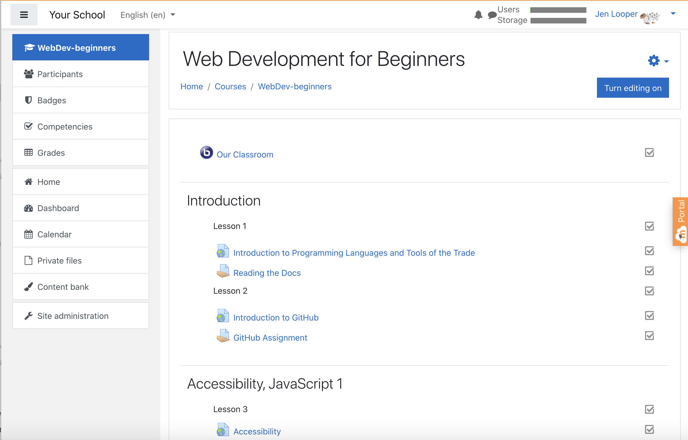
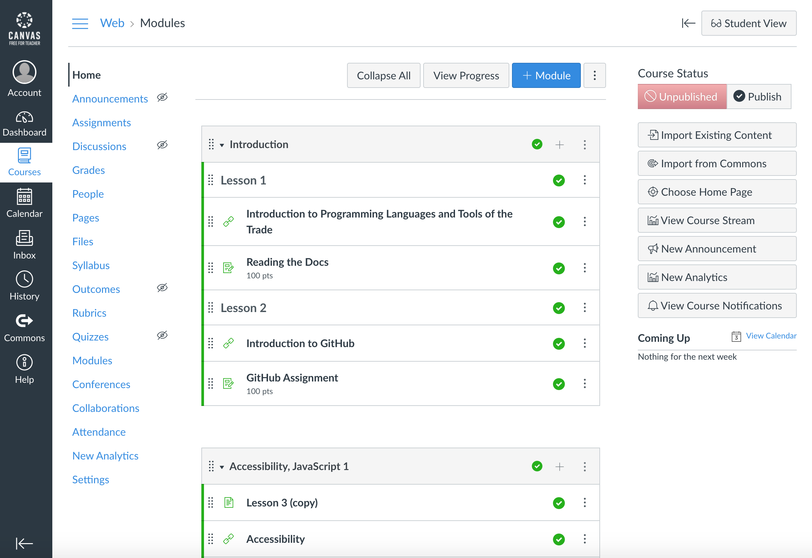

## கல்வியாளர்களுக்கு

உங்கள் வகுப்பறையில் இந்தப் பாடத்திட்டத்தை பயன்படுத்த விரும்புகிறீர்களா? தயவுசெய்து சுதந்திரமாக உணருங்கள்!

உண்மையில், நீங்கள் கீதுப் வகுப்பறையைப் பயன்படுத்தி அதை கீதுப்க்குள் பயன்படுத்தலாம்.

அதை செய்ய, இந்த ரெப்போவை முட்கரண்டி. நீங்கள் ஒவ்வொரு பாடத்திற்கும் ஒரு ரெப்போவை உருவாக்க வேண்டும், எனவே நீங்கள் ஒவ்வொரு கோப்புறையை ஒரு தனி ரெப்போவில் பிரித்தெடுக்க வேண்டும்.அந்த வழியில், [கிட்ஹப் வகுப்பறை](https://classroom.github.com/classrooms) ஒவ்வொரு பாடமும் தனித்தனியாக எடுக்க முடியும்.

இந்த [முழு அறிவுறுத்தல்கள்](https://github.blog/2020-03-18-set-up-your-digital-classroom-with-github-classroom/) உங்கள் வகுப்பறையை எவ்வாறு அமைப்பது என்பது பற்றிய ஒரு யோசனையை உங்களுக்கு வழங்கும்.

## மூடல், கேன்வாஸ் அல்லது பிளாக்போர்டில் அதைப் பயன்படுத்துதல்

இந்த பாடத்திட்டம் இந்த கற்றல் மேலாண்மை அமைப்புகளில் நன்றாக வேலை செய்கிறது! முழு உள்ளடக்கத்திற்கு [மூடல் பதிவேற்றக் கோப்பை](../teaching-files/webdev-moodle.mbz) பயன்படுத்தவும், அல்லது உள்ளடக்கத்தில் சிலவற்றைக் கொண்ட [பொதுவான பொதியுறை கோப்பு](../teaching-files/webdev-common-cartridge.imscc) முயற்சிக்கவும்.

> ஒரு மூடல் வகுப்பறையில் பாடத்திட்டம்

> கேன்வாஸ் பாடத்திட்டம்

## ரெப்போவைப் பயன்படுத்துதல்

நீங்கள் இந்த ரெப்போவை தற்போது உள்ளது போல் பயன்படுத்த விரும்பினால், கிட்ஹப் வகுப்பறையைப் பயன்படுத்தாமல், அதையும் செய்யலாம். நீங்கள் ஒன்றாக வேலை செய்ய எந்த பாடம் உங்கள் மாணவர்களுடன் தொடர்பு கொள்ள வேண்டும்.

ஒரு ஆன்லைன் வடிவத்தில் (ஜூம், அணிகள், அல்லது பிற) நீங்கள் வினாடி வினாக்களுக்கு பிரேக்அவுட் அறைகளை உருவாக்கலாம், மேலும் மாணவர்கள் கற்றுக்கொள்ள தயாராக உதவஉதவலாம். பின்னர் வினாடி வினாக்களுக்கு மாணவர்களை அழைத்து, ஒரு குறிப்பிட்ட நேரத்தில் 'சிக்கல்களாக' தங்கள் பதில்களை சமர்ப்பிக்கவும். மாணவர்கள் திறந்த வெளியில் கூட்டாக வேலை செய்ய விரும்பினால், நீங்கள் நியமிப்புகளிலும் அதையே செய்யலாம்.

நீங்கள் ஒரு தனிப்பட்ட வடிவத்தை விரும்பினால், உங்கள் மாணவர்களை பாடத்திட்டத்தை, பாடத்தின் மூலம் பாடம், தங்கள் சொந்த கிட்ஹப் ரெப்போக்களை தனியார் ரெப்போக்களாக க்ளெக் செய்யுமாறு கேளுங்கள், உங்களுக்கு அணுகலை வழங்கவும். பின்னர் அவர்கள் தனிப்பட்ட முறையில் வினாடி வினாக்கள் மற்றும் பணிகளை முடிக்க மற்றும் உங்கள் வகுப்பறை ரெப்போ பிரச்சினைகள் மூலம் நீங்கள் அவற்றை சமர்ப்பிக்க முடியும்.

ஒரு ஆன்லைன் வகுப்பறை வடிவத்தில் இந்த வேலை செய்ய பல வழிகள் உள்ளன. உங்களுக்கு எது சிறந்தது என்பதை எங்களுக்குத் தெரியப்படுத்துங்கள்!

## தயவுசெய்து உங்கள் எண்ணங்களை எங்களுக்குத் கொடுங்கள்!

இந்த பாடத்திட்டத்தை உங்களுக்கும் உங்கள் மாணவர்களுக்கும் வேலை செய்ய விரும்புகிறோம். தயவுசெய்து எங்களுக்கு [கருத்து](https://github.com/microsoft/Web-Dev-For-Beginners/discussions/categories/teacher-corner) கொடுங்கள்