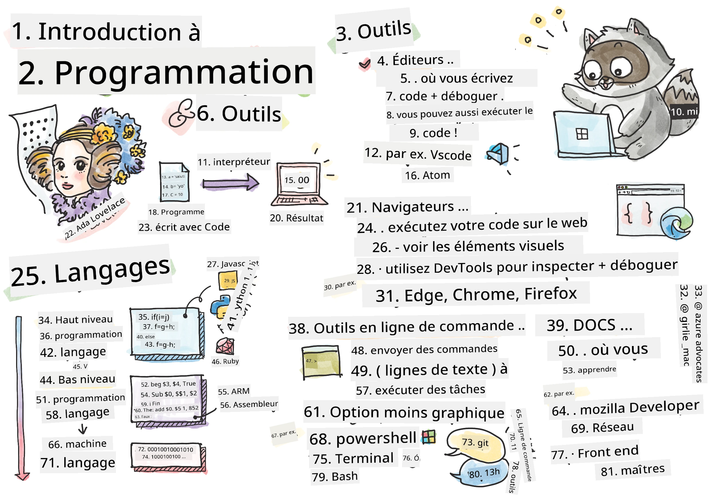
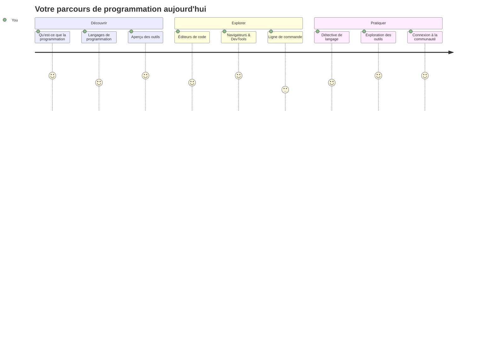
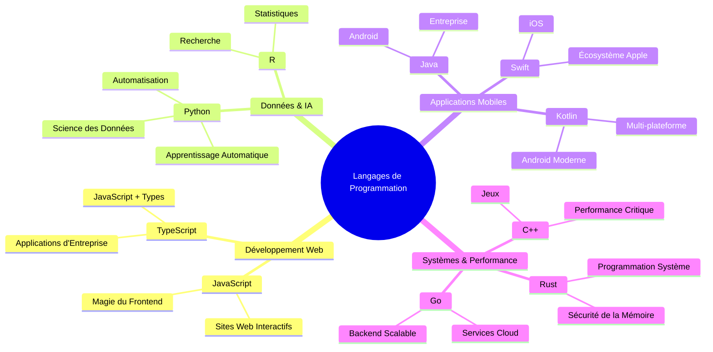
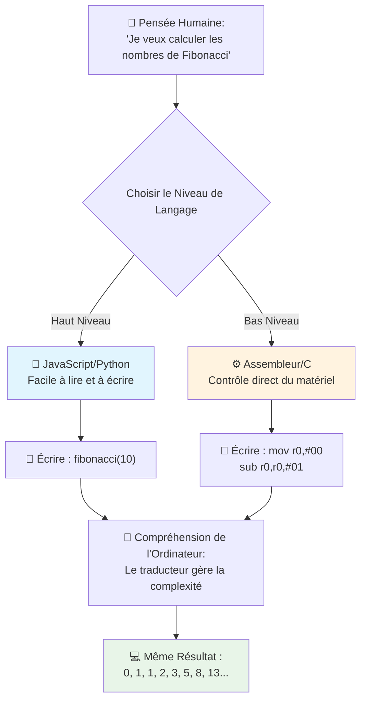
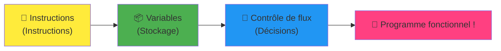
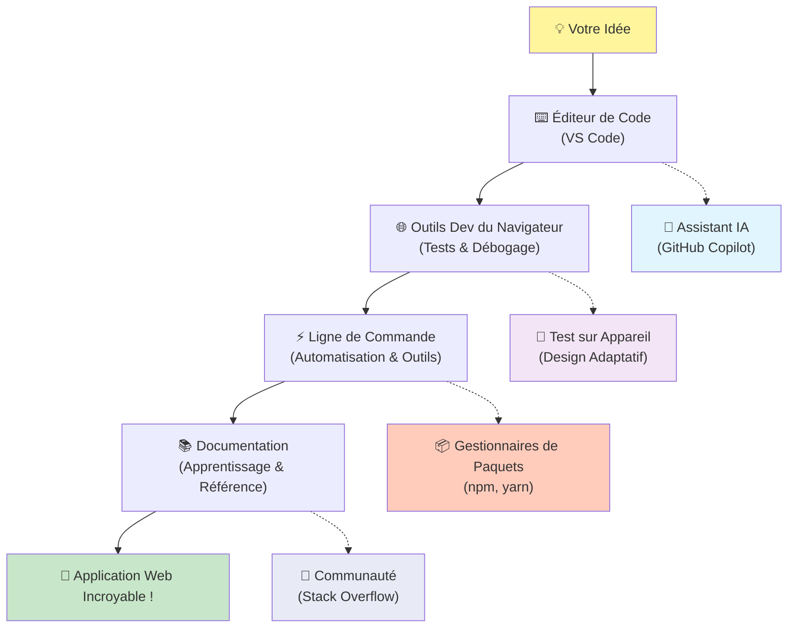
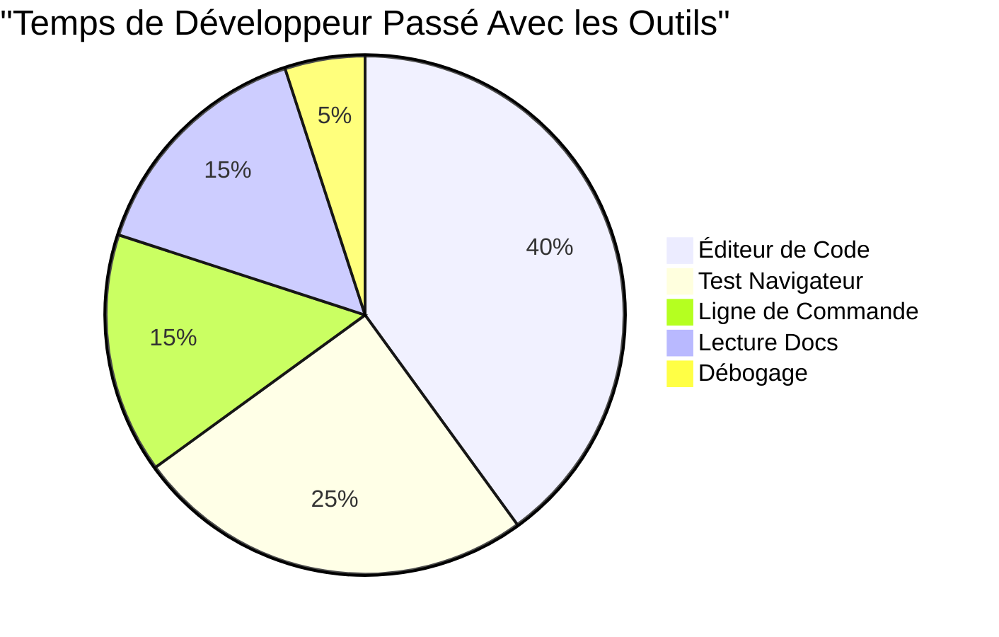
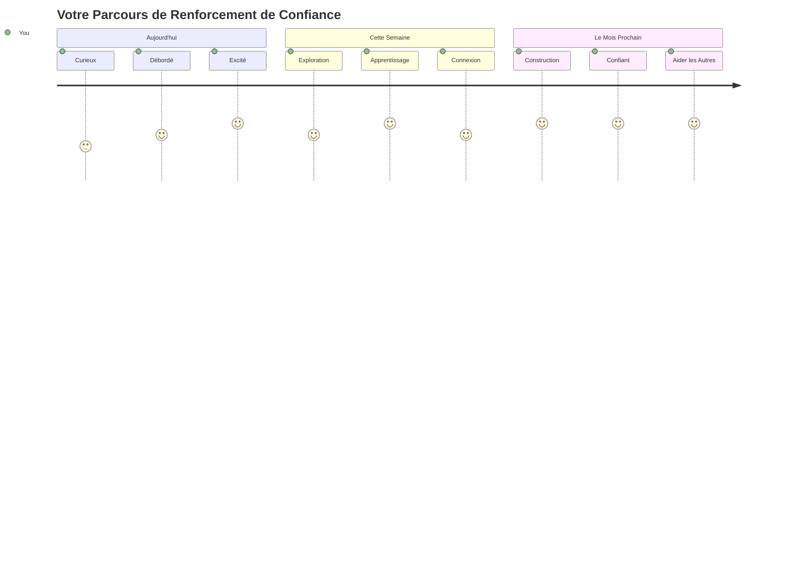

# Introduction aux langages de programmation et aux outils modernes pour développeurs

Salut, futur développeur ! 👋 Puis-je te dire quelque chose qui me donne encore des frissons chaque jour ? Tu es sur le point de découvrir que la programmation ne concerne pas seulement les ordinateurs – c’est un véritable super-pouvoir pour donner vie à tes idées les plus folles !

Tu connais ce moment où tu utilises ton application préférée et tout s’emboîte parfaitement ? Quand tu appuies sur un bouton et qu’il se passe quelque chose de tellement magique que tu te dis « wow, comment ont-ils FAIT ça ? » Eh bien, quelqu’un comme toi – probablement assis dans son café préféré à 2 heures du matin avec son troisième espresso – a écrit le code qui a créé cette magie. Et voici ce qui va te faire halluciner : à la fin de cette leçon, non seulement tu comprendras comment ils l’ont fait, mais tu auras envie d’essayer toi-même !

Écoute, je comprends totalement si la programmation te paraît intimidante pour l’instant. Quand j’ai commencé, je pensais honnêtement qu’il fallait être un génie en maths ou coder depuis que tu as cinq ans. Mais ce qui a complètement changé ma perspective, c’est ça : programmer, c’est exactement comme apprendre à avoir des conversations dans une nouvelle langue. Tu commences par « bonjour » et « merci », puis tu progresses jusqu’à commander un café, et avant même de t’en rendre compte, tu tiens des discussions philosophiques approfondies ! Sauf que là, tu converses avec des ordinateurs, et honnêtement ? Ce sont les partenaires de conversation les plus patients que tu puisses avoir – ils ne jugent jamais tes erreurs et sont toujours ravis d’essayer encore !

Aujourd’hui, nous allons explorer les outils incroyables qui rendent le développement web moderne non seulement possible, mais carrément addictif. Je parle exactement des éditeurs, navigateurs et flux de travail que les développeurs de Netflix, Spotify et ton studio d’applications indie préféré utilisent chaque jour. Et voici la partie qui va te faire danser de joie : la plupart de ces outils professionnels, standards de l’industrie, sont complètement gratuits !


> Sketchnote par [Tomomi Imura](https://twitter.com/girlie_mac)


## Voyons ce que tu sais déjà !

Avant de plonger dans les choses amusantes, je suis curieux – que sais-tu déjà de ce monde de la programmation ? Et écoute, si en voyant ces questions tu te dis « je n’y comprends absolument rien », ce n’est pas juste okay, c’est parfait ! Cela signifie que tu es exactement au bon endroit. Pense à ce quiz comme un échauffement avant une séance de sport – on fait juste chauffer les muscles du cerveau !

[Faire le quiz pré-leçon](https://forms.office.com/r/dru4TE0U9n?origin=lprLink)


## L’aventure que nous allons vivre ensemble

D’accord, je suis vraiment excité par ce que nous allons explorer aujourd’hui ! Sérieusement, j’aimerais voir ta tête quand certains de ces concepts vont enfin s’éclairer. Voici le fabuleux voyage que nous allons faire ensemble :

- **Ce qu’est vraiment la programmation (et pourquoi c’est le truc le plus cool qui soit !)** – Nous allons découvrir comment le code est littéralement la magie invisible qui fait fonctionner tout autour de toi, de ce réveil qui sait que c’est lundi matin à l’algorithme qui sélectionne parfaitement tes recommandations Netflix
- **Les langages de programmation et leurs personnalités incroyables** – Imagine que tu arrives à une fête où chaque personne possède des super-pouvoirs et des manières différentes de résoudre les problèmes. C’est ça le monde des langages de programmation, et tu vas adorer les rencontrer !
- **Les blocs fondamentaux qui font la magie numérique** – Considère-les comme le set ultime de LEGO créatif. Une fois que tu comprends comment ces pièces s’assemblent, tu réalises que tu peux littéralement construire tout ce que ton imagination invente
- **Les outils professionnels qui te donneront l’impression qu’on vient de te remettre une baguette de magicien** – Je ne rigole pas – ces outils vont vraiment te faire sentir que tu as des super-pouvoirs, et le meilleur ? Ce sont les mêmes que les pros utilisent !

> 💡 **Voici le truc** : Ne pense même pas à essayer de tout mémoriser aujourd’hui ! Pour l’instant, je veux juste que tu ressentes cette étincelle d’excitation sur ce qui est possible. Les détails viendront naturellement avec la pratique – c’est comme ça que la vraie apprentissage se passe !

> Tu peux suivre cette leçon sur [Microsoft Learn](https://docs.microsoft.com/learn/modules/web-development-101/introduction-programming/?WT.mc_id=academic-77807-sagibbon) !

## Alors, c’est quoi *vraiment* la programmation ?

Bon, attaquons la question à un million : c’est quoi la programmation, au fond ?

Je vais te raconter une histoire qui a complètement changé ma manière de voir les choses. La semaine dernière, j’essayais d’expliquer à ma mère comment utiliser la nouvelle télécommande intelligente de notre télé. Je me suis surpris à dire des choses comme « Appuie sur le bouton rouge, mais pas le gros bouton rouge, le petit bouton rouge à gauche… non, ton autre gauche… d’accord, maintenant tiens-le deux secondes, pas une, pas trois… » Ça te parle ? 😅

C’est ça la programmation ! C’est l’art de donner des instructions incroyablement précises, étape par étape, à quelque chose de très puissant mais qui a besoin qu’on lui explique tout parfaitement. Sauf qu’au lieu d’expliquer à ta mère (qui peut demander « quel bouton rouge ?! »), tu expliques à un ordinateur (qui fait exactement ce que tu dis, même si ce que tu as dit n’est pas tout à fait ce que tu voulais).

Voici ce qui m’a bluffé quand j’ai appris ça : les ordinateurs sont en réalité assez simples en leur cœur. Ils comprennent littéralement deux choses – 1 et 0, ce qui revient à dire « oui » et « non » ou « allumé » et « éteint ». C’est tout ! Mais voici où la magie intervient – on n’a pas à parler en 1 et 0 comme dans Matrix. C’est là que les **langages de programmation** interviennent. Ce sont comme le meilleur traducteur du monde qui prend tes pensées humaines parfaitement normales et les transforme en langage informatique.

Et voici ce qui me donne encore des frissons chaque matin au réveil : littéralement *tout* ce qui est numérique dans ta vie a commencé avec quelqu’un comme toi, probablement en pyjama avec une tasse de café, en train de taper du code sur son ordinateur portable. Ce filtre Instagram qui te rend parfait ? Quelqu’un l’a codé. La recommandation qui t’a fait découvrir ta nouvelle chanson préférée ? Un développeur a construit cet algorithme. L’application qui t’aide à diviser les notes de restaurant entre amis ? Oui, quelqu’un a pensé « c’est chiant, je peux sûrement régler ça » et puis… il l’a fait !

Quand tu apprends à programmer, tu ne te contentes pas d’acquérir une nouvelle compétence – tu deviens membre d’une communauté incroyable de personnes qui passent leurs journées à se demander, « Et si je pouvais créer quelque chose qui rendait la journée de quelqu’un un peu meilleure ? » Franchement, y a-t-il quelque chose de plus cool ?

✅ **Chasse aux faits amusants** : Voici un truc super cool à chercher quand tu as un moment libre – selon toi, qui a été le tout premier programmeur informatique au monde ? Je te donne un indice : ce n’est peut-être pas celui que tu imagines ! L’histoire de cette personne est fascinante et montre que la programmation a toujours été une question de créativité et de pensée hors des sentiers battus.

### 🧠 **Petit point : comment tu te sens ?**

**Prends un moment pour réfléchir :**
- L’idée de « donner des instructions aux ordinateurs » te paraît-elle claire maintenant ?
- Peux-tu penser à une tâche quotidienne que tu aimerais automatiser grâce à la programmation ?
- Quelles questions te viennent à l’esprit à propos de tout ce truc de programmation ?

> **Souviens-toi** : c’est normal si certains concepts te semblent flous maintenant. Apprendre la programmation, c’est comme apprendre une nouvelle langue – il faut du temps pour que ton cerveau crée ces connexions neuronales. Tu gères !

## Les langages de programmation, c’est comme des saveurs différentes de magie

Bon, ça va peut-être paraître bizarre, mais reste avec moi – les langages de programmation sont un peu comme différents styles de musique. Imagine : tu as le jazz, qui est doux et improvisé, le rock, qui est puissant et direct, le classique, élégant et structuré, et le hip-hop, créatif et expressif. Chaque style a son ambiance, sa communauté de fans passionnés, et chacun est parfait pour différentes humeurs et occasions.

Les langages de programmation fonctionnent exactement de la même manière ! Tu n’utiliserais pas le même langage pour créer un jeu mobile amusant que pour analyser d’énormes volumes de données climatiques, tout comme tu ne mettrais pas du death metal pendant un cours de yoga (enfin, la plupart des cours de yoga ! 😄).

Mais voici ce qui me fascine à chaque fois que j’y pense : ces langages sont comme le traducteur le plus brillant et patient du monde qui serait assis juste à côté de toi. Tu peux exprimer tes idées de manière naturelle, et ils s’occupent de tout ce travail incroyablement complexe qui consiste à traduire ça en 1 et 0 que les ordinateurs comprennent vraiment. C’est comme avoir un ami parfaitement bilingue en « créativité humaine » et « logique machine » – qui ne se fatigue jamais, n’a jamais besoin de pause café et ne te juge jamais de poser la même question deux fois !

### Langages de programmation populaires et leurs usages


| Langage | Idéal pour | Pourquoi il est populaire |
|---------|------------|----------------------------|
| **JavaScript** | Développement web, interfaces utilisateur | Fonctionne dans les navigateurs et alimente les sites interactifs |
| **Python** | Data science, automatisation, IA | Facile à lire et apprendre, bibliothèques puissantes |
| **Java** | Applications d’entreprise, applications Android | Indépendant de la plateforme, robuste pour les grands systèmes |
| **C#** | Applications Windows, développement de jeux | Fort soutien de l’écosystème Microsoft |
| **Go** | Services cloud, systèmes backend | Rapide, simple, conçu pour l’informatique moderne |

### Langages de haut niveau vs bas niveau

Bon, c’est honnêtement le concept qui m’a fait exploser le cerveau quand j’ai commencé, alors je vais partager l’analogie qui m’a enfin fait comprendre – et j’espère vraiment qu’elle t’aidera aussi !

Imagine que tu visites un pays où tu ne parles pas la langue, et que tu as désespérément besoin de trouver les toilettes (on est tous passés par là, non ? 😅) :

- **La programmation bas niveau** c’est comme apprendre le dialecte local tellement bien que tu peux discuter avec la grand-mère qui vend des fruits à l’angle de la rue en utilisant des références culturelles, du jargon local et des blagues que seuls les vrais natifs comprennent. Super impressionnant et ultra efficace… si tu es fluent ! Mais assez écrasant quand tu cherches juste les toilettes.

- **La programmation haut niveau** c’est comme avoir cet ami local incroyable qui comprend tout de suite. Tu peux dire « j’ai vraiment besoin de trouver des toilettes » en anglais simple, et il s’occupe de toute la traduction culturelle et te donne des indications compréhensibles par ton cerveau non-local.

Dans les termes de la programmation :
- **Les langages bas niveau** (comme l’assembleur ou C) te permettent d’avoir des conversations ultra détaillées avec le matériel réel de l’ordinateur, mais tu dois penser comme une machine, ce qui est… disons que c’est un gros changement mental !
- **Les langages haut niveau** (comme JavaScript, Python ou C#) te laissent penser comme un humain pendant qu’ils gèrent tout le langage machine en coulisse. En plus, ils ont des communautés super accueillantes remplies de personnes qui se souviennent de ce que c’était d’être nouveau et qui veulent vraiment aider !

Devine ceux avec lesquels je vais te suggérer de commencer ? 😉 Les langages haut niveau sont comme des roulettes d’entraînement que tu ne voudras jamais retirer parce qu’elles rendent l’expérience tellement plus agréable !


### Laisse-moi te montrer pourquoi les langages haut niveau sont tellement plus sympathiques

D’accord, je vais te montrer quelque chose qui illustre parfaitement pourquoi je suis tombé amoureux des langages haut niveau, mais d’abord – il faut que tu me promettes quelque chose. Quand tu verras ce premier exemple de code, ne panique pas ! C’est fait pour sembler intimidant. C’est exactement le point que je veux faire passer !

Nous allons regarder la même tâche écrite dans deux styles complètement différents. Les deux créent ce qu’on appelle la suite de Fibonacci – un magnifique motif mathématique où chaque nombre est la somme des deux précédents : 0, 1, 1, 2, 3, 5, 8, 13... (Fait amusant : tu trouveras ce motif littéralement partout dans la nature – dans les spirales des graines de tournesol, les motifs des cônes de pin, même la formation des galaxies !)

Prêt à voir la différence ? On y va !

**Langage haut niveau (JavaScript) – Facile à comprendre :**

```javascript
// Étape 1 : Configuration de base de Fibonacci
const fibonacciCount = 10;
let current = 0;
let next = 1;

console.log('Fibonacci sequence:');
```

**Voici ce que fait ce code :**
- **Déclare** une constante pour spécifier combien de nombres de Fibonacci on veut générer
- **Initialise** deux variables pour suivre le nombre actuel et le suivant dans la séquence
- **Configure** les valeurs de départ (0 et 1) qui définissent le motif de Fibonacci
- **Affiche** un message d’en-tête pour identifier notre sortie

```javascript
// Étape 2 : Générer la séquence avec une boucle
for (let i = 0; i < fibonacciCount; i++) {
  console.log(`Position ${i + 1}: ${current}`);
  
  // Calculer le nombre suivant dans la séquence
  const sum = current + next;
  current = next;
  next = sum;
}
```

**Détaillons ce qui se passe ici :**
- **Parcourt** chaque position dans notre séquence avec une boucle `for`
- **Affiche** chaque nombre avec sa position en utilisant la syntaxe template literal
- **Calcule** le prochain nombre de Fibonacci en additionnant les valeurs actuelle et suivante
- **Met à jour** les variables de suivi pour passer à l’itération suivante

```javascript
// Étape 3 : Approche fonctionnelle moderne
const generateFibonacci = (count) => {
  const sequence = [0, 1];
  
  for (let i = 2; i < count; i++) {
    sequence[i] = sequence[i - 1] + sequence[i - 2];
  }
  
  return sequence;
};

// Exemple d'utilisation
const fibSequence = generateFibonacci(10);
console.log(fibSequence);
```

**Dans le code ci-dessus, nous avons :**
- **Créé** une fonction réutilisable avec la syntaxe moderne des fonctions fléchées
- **Construis** un tableau pour stocker la séquence complète au lieu de l’afficher nombre par nombre
- **Utilisé** l’indexation de tableau pour calculer chaque nouveau nombre à partir des précédents
- **Retourné** la séquence complète pour une utilisation flexible dans d’autres parties du programme

**Langage bas niveau (assembleur ARM) – Compréhensible par l’ordinateur :**

```assembly
 area ascen,code,readonly
 entry
 code32
 adr r0,thumb+1
 bx r0
 code16
thumb
 mov r0,#00
 sub r0,r0,#01
 mov r1,#01
 mov r4,#10
 ldr r2,=0x40000000
back add r0,r1
 str r0,[r2]
 add r2,#04
 mov r3,r0
 mov r0,r1
 mov r1,r3
 sub r4,#01
 cmp r4,#00
 bne back
 end
```

Remarque à quel point la version JavaScript se lit presque comme des instructions en anglais, tandis que la version assembleur utilise des commandes cryptiques qui contrôlent directement le processeur de l’ordinateur. Les deux accomplissent exactement la même tâche, mais le langage haut niveau est beaucoup plus facile à comprendre, écrire et maintenir pour les humains.

**Différences clés que tu remarqueras :**
- **Lisibilité** : JavaScript utilise des noms descriptifs comme `fibonacciCount` tandis que l’assembleur utilise des étiquettes cryptiques comme `r0`, `r1`
- **Commentaires** : Les langages de haut niveau encouragent les commentaires explicatifs qui rendent le code auto-documenté
- **Structure** : Le flux logique de JavaScript correspond à la façon dont les humains réfléchissent aux problèmes étape par étape
- **Maintenance** : Mettre à jour la version JavaScript pour différentes exigences est simple et clair

✅ **À propos de la suite de Fibonacci** : Ce magnifique motif numérique (où chaque nombre est égal à la somme des deux précédents : 0, 1, 1, 2, 3, 5, 8...) apparaît littéralement *partout* dans la nature ! Vous le trouverez dans les spirales des tournesols, les motifs des pommes de pin, la façon dont les coquilles de nautile se courbent, et même dans la croissance des branches des arbres. C’est assez incroyable de voir comment les mathématiques et le code peuvent nous aider à comprendre et recréer les motifs que la nature utilise pour créer la beauté !


## Les blocs de base qui font fonctionner la magie

D'accord, maintenant que vous avez vu à quoi ressemblent les langages de programmation en action, décomposons les éléments fondamentaux qui composent littéralement tous les programmes jamais écrits. Pensez-y comme les ingrédients essentiels de votre recette préférée – une fois que vous comprenez ce que chacun fait, vous pourrez lire et écrire du code dans à peu près n'importe quel langage !

C’est un peu comme apprendre la grammaire de la programmation. Vous vous souvenez quand à l’école vous avez appris les noms, les verbes et comment construire des phrases ? La programmation a sa propre version de la grammaire, et honnêtement, elle est bien plus logique et tolérante que la grammaire anglaise ne l’a jamais été ! 😄

### Instructions : Les consignes étape par étape

Commençons par les **instructions** – ce sont comme des phrases individuelles dans une conversation avec votre ordinateur. Chaque instruction dit à l’ordinateur de faire une chose spécifique, un peu comme donner des directions : "Tournez à gauche ici," "Arrêtez-vous au feu rouge," "Garez-vous à cet endroit."

Ce que j’adore avec les instructions, c’est à quel point elles sont généralement lisibles. Regardez ça :

```javascript
// Instructions de base qui effectuent des actions uniques
const userName = "Alex";                    
console.log("Hello, world!");              
const sum = 5 + 3;                         
```

**Voici ce que ce code fait :**
- **Déclare** une variable constante pour stocker le nom d’un utilisateur
- **Affiche** un message de bienvenue dans la console
- **Calcule** et stocke le résultat d’une opération mathématique

```javascript
// Instructions qui interagissent avec les pages web
document.title = "My Awesome Website";      
document.body.style.backgroundColor = "lightblue";
```

**Étape par étape, voici ce qui se passe :**
- **Modifie** le titre de la page qui apparaît dans l’onglet du navigateur
- **Change** la couleur de fond de tout le corps de la page

### Variables : Le système de mémoire de votre programme

D’accord, les **variables** sont honnêtement l’un de mes concepts favoris à enseigner parce qu’elles ressemblent tellement à des choses que vous utilisez déjà chaque jour !

Pensez à votre liste de contacts téléphoniques une seconde. Vous ne mémorisez pas le numéro de téléphone de tout le monde – à la place, vous sauvegardez "Maman," "Meilleur Ami," ou "Pizzeria qui livre jusqu’à 2h" et vous laissez votre téléphone se souvenir des numéros réels. Les variables fonctionnent exactement de la même manière ! Ce sont comme des contenants étiquetés où votre programme peut stocker des informations et les retrouver plus tard en utilisant un nom qui a du sens.

Ce qui est vraiment cool : les variables peuvent changer au fur et à mesure que votre programme s’exécute (d’où le nom "variable" – vous voyez ce qu’ils ont fait ?). Tout comme vous pourriez mettre à jour ce contact pizzeria quand vous découvrez un endroit encore meilleur, les variables peuvent être mises à jour à mesure que votre programme apprend de nouvelles informations ou que les situations changent !

Laissez-moi vous montrer à quel point cela peut être simple et élégant :

```javascript
// Étape 1 : Création des variables de base
const siteName = "Weather Dashboard";        
let currentWeather = "sunny";               
let temperature = 75;                       
let isRaining = false;                      
```

**Comprendre ces concepts :**
- **Stocker** des valeurs fixes dans des variables `const` (comme le nom du site)
- **Utiliser** `let` pour des valeurs qui peuvent changer au cours du programme
- **Assigner** différents types de données : chaînes de caractères, nombres, booléens (vrai/faux)
- **Choisir** des noms descriptifs qui expliquent ce que contient chaque variable

```javascript
// Étape 2 : Travailler avec des objets pour regrouper des données connexes
const weatherData = {                       
  location: "San Francisco",
  humidity: 65,
  windSpeed: 12
};
```

**Dans l’exemple ci-dessus, nous avons :**
- **Créé** un objet pour grouper ensemble des informations météorologiques associées
- **Organisé** plusieurs données sous un seul nom de variable
- **Utilisé** des paires clé-valeur pour étiqueter chaque donnée clairement

```javascript
// Étape 3 : Utilisation et mise à jour des variables
console.log(`${siteName}: Today is ${currentWeather} and ${temperature}°F`);
console.log(`Wind speed: ${weatherData.windSpeed} mph`);

// Mise à jour des variables modifiables
currentWeather = "cloudy";                  
temperature = 68;                          
```

**Comprenons chaque partie :**
- **Afficher** l’information en utilisant des littéraux de modèle avec la syntaxe `${}`
- **Accéder** aux propriétés de l’objet par notation par point (`weatherData.windSpeed`)
- **Mettre à jour** les variables déclarées avec `let` pour refléter les conditions changeantes
- **Combiner** plusieurs variables pour créer des messages significatifs

```javascript
// Étape 4 : Déstructuration moderne pour un code plus propre
const { location, humidity } = weatherData; 
console.log(`${location} humidity: ${humidity}%`);
```

**Ce que vous devez savoir :**
- **Extraire** des propriétés spécifiques d’objets grâce à l’assignation par décomposition
- **Créer** automatiquement de nouvelles variables avec les mêmes noms que les clés de l’objet
- **Simplifier** le code en évitant la répétition de la notation par point

### Flux de contrôle : Apprendre à votre programme à réfléchir

D’accord, c’est ici que la programmation devient absolument incroyable ! Le **flux de contrôle** consiste essentiellement à apprendre à votre programme à prendre des décisions intelligentes, exactement comme vous le faites chaque jour sans même y penser.

Imaginez ceci : ce matin, vous avez probablement vécu quelque chose comme "S’il pleut, je prends un parapluie. S’il fait froid, je mets une veste. Si je suis en retard, je saute le petit-déjeuner et prends un café en chemin." Votre cerveau suit naturellement cette logique conditionnelle des dizaines de fois par jour !

C’est ce qui donne aux programmes cette impression d’intelligence et de vie, au lieu de juste suivre un script ennuyeux et prévisible. Ils peuvent regarder une situation, évaluer ce qui se passe, et répondre de façon appropriée. C’est comme donner un cerveau à votre programme pour qu’il puisse s’adapter et faire des choix !

Vous voulez voir à quel point cela marche bien ? Laissez-moi vous montrer :

```javascript
// Étape 1 : Logique conditionnelle de base
const userAge = 17;

if (userAge >= 18) {
  console.log("You can vote!");
} else {
  const yearsToWait = 18 - userAge;
  console.log(`You'll be able to vote in ${yearsToWait} year(s).`);
}
```

**Voici ce que ce code fait :**
- **Vérifie** si l’âge de l’utilisateur remplit la condition de vote
- **Exécute** différents blocs de code selon le résultat de la condition
- **Calcule** et affiche le temps restant avant d’être éligible au vote si moins de 18 ans
- **Fournit** un retour clair et utile pour chaque scénario

```javascript
// Étape 2 : Plusieurs conditions avec des opérateurs logiques
const userAge = 17;
const hasPermission = true;

if (userAge >= 18 && hasPermission) {
  console.log("Access granted: You can enter the venue.");
} else if (userAge >= 16) {
  console.log("You need parent permission to enter.");
} else {
  console.log("Sorry, you must be at least 16 years old.");
}
```

**Décomposons ce qui se passe ici :**
- **Combine** plusieurs conditions avec l’opérateur `&&` (et)
- **Crée** une hiérarchie de conditions avec `else if` pour plusieurs cas
- **Gère** tous les cas possibles avec une dernière instruction `else`
- **Fournit** un retour clair et exploitable pour chaque situation différente

```javascript
// Étape 3 : Condition concise avec opérateur ternaire
const votingStatus = userAge >= 18 ? "Can vote" : "Cannot vote yet";
console.log(`Status: ${votingStatus}`);
```

**Ce que vous devez retenir :**
- **Utilisez** l’opérateur ternaire (`? :`) pour des conditions simples à deux options
- **Écrivez** d’abord la condition, suivie de `?`, puis le résultat vrai, puis `:`, puis le résultat faux
- **Appliquez** ce modèle quand vous avez besoin d’assigner des valeurs selon une condition

```javascript
// Étape 4 : Gestion de plusieurs cas spécifiques
const dayOfWeek = "Tuesday";

switch (dayOfWeek) {
  case "Monday":
  case "Tuesday":
  case "Wednesday":
  case "Thursday":
  case "Friday":
    console.log("It's a weekday - time to work!");
    break;
  case "Saturday":
  case "Sunday":
    console.log("It's the weekend - time to relax!");
    break;
  default:
    console.log("Invalid day of the week");
}
```

**Ce code réalise ce qui suit :**
- **Compare** la valeur de la variable à plusieurs cas spécifiques
- **Groupe** les cas similaires (jours de semaine vs week-ends)
- **Exécute** le bloc de code approprié quand un cas correspond
- **Inclut** un cas `default` pour gérer les valeurs inattendues
- **Utilise** des instructions `break` pour éviter que le code continue vers le cas suivant

> 💡 **Analogie dans la vraie vie** : Pensez au flux de contrôle comme au GPS le plus patient du monde qui vous donne des instructions. Il peut dire "S’il y a du trafic sur Main Street, prends l’autoroute à la place. S’il y a des travaux sur l’autoroute, essaie l’itinéraire panoramique." Les programmes utilisent exactement ce même type de logique conditionnelle pour répondre intelligemment à différentes situations et toujours offrir aux utilisateurs la meilleure expérience possible.

### 🎯 **Test de compréhension : Maîtrise des blocs de base**

**Voyons comment vous vous en sortez avec les fondamentaux :**
- Pouvez-vous expliquer la différence entre une variable et une instruction avec vos propres mots ?
- Pensez à un scénario de la vie réelle où vous utiliseriez une décision if-then (comme notre exemple de vote)
- Qu’est-ce qui vous a surpris dans la logique de programmation ?

**Petit boost de confiance :**

✅ **Ce qui arrive ensuite** : Nous allons nous amuser comme des fous à plonger plus profondément dans ces concepts en continuant ce voyage incroyable ensemble ! Pour l’instant, concentrez-vous juste sur l’excitation de toutes les possibilités incroyables qui vous attendent. Les compétences spécifiques et les techniques viendront naturellement au fur et à mesure que nous pratiquerons ensemble – je vous promets que ce sera bien plus amusant que ce que vous imaginez !

## Les outils du métier

Bon, ici c’est honnêtement le moment où je suis tellement excité que je peux à peine me contenir ! 🚀 Nous allons parler des outils incroyables qui vont vous donner l’impression qu’on vient de vous confier les clés d’un vaisseau spatial numérique.

Vous savez comment un chef a ces couteaux parfaitement équilibrés qui deviennent comme une extension de ses mains ? Ou comment un musicien a cette guitare qui semble chanter dès qu’il la touche ? Eh bien, les développeurs ont leur propre version de ces outils magiques, et voici ce qui va vous époustoufler – la plupart d’entre eux sont complètement gratuits !

Je suis presque en train de sauter sur ma chaise à l’idée de vous les présenter parce qu’ils ont complètement révolutionné la façon dont on construit des logiciels. On parle d’assistants de codage alimentés par l’IA qui peuvent vous aider à écrire votre code (je ne plaisante même pas !), d’environnements cloud où vous pouvez construire des applications entières littéralement de n’importe où avec un Wi-Fi, et d’outils de débogage si sophistiqués qu’ils donnent une vision à rayons X de vos programmes.

Et voici la partie qui me donne toujours des frissons : ce ne sont pas des "outils pour débutants" que vous allez dépasser. Ce sont exactement les mêmes outils professionnels que les développeurs de Google, Netflix, et ce studio d’applications indie que vous adorez utilisent en ce moment même. Vous allez vous sentir comme un vrai pro en les utilisant !


### Éditeurs de code et IDE : vos nouveaux meilleurs amis numériques

Parlons des éditeurs de code – ceux-ci vont sérieusement devenir vos endroits préférés où passer du temps ! Pensez-y comme à votre sanctuaire personnel de codage où vous passerez la majeure partie de votre temps à créer et peaufiner vos œuvres numériques.

Mais voici ce qui est absolument magique avec les éditeurs modernes : ce ne sont pas de simples éditeurs de texte sophistiqués. C’est comme avoir le mentor en codage le plus brillant et le plus encourageant assis juste à côté de vous 24h/24, 7j/7. Ils détectent vos fautes de frappe avant même que vous ne les remarquiez, suggèrent des améliorations qui vous font paraître génial, vous aident à comprendre chaque morceau de code, et certains peuvent même prédire ce que vous allez taper et vous proposer de finir vos idées !

Je me souviens quand j’ai découvert l’auto-complétion – j’avais littéralement l’impression de vivre dans le futur. Vous commencez à taper quelque chose, et votre éditeur vous dit : "Hey, vous pensiez à cette fonction qui fait exactement ce dont vous avez besoin ?" C’est comme avoir un lecteur de pensées comme compagnon de codage !

**Qu’est-ce qui rend ces éditeurs si incroyables ?**

Les éditeurs de code modernes offrent un éventail impressionnant de fonctionnalités conçues pour augmenter votre productivité :

| Fonctionnalité | Ce qu’elle fait | Pourquoi c’est utile |
|---------|--------------|--------------|
| **Coloration syntaxique** | Colore différentes parties de votre code | Rend le code plus facile à lire et à repérer les erreurs |
| **Auto-complétion** | Suggère du code au fur et à mesure que vous tapez | Accélère la saisie et réduit les fautes de frappe |
| **Outils de débogage** | Aide à trouver et corriger les erreurs | Économise des heures de dépannage |
| **Extensions** | Ajoutent des fonctionnalités spécialisées | Personnalisez votre éditeur pour toutes les technologies |
| **Assistants IA** | Suggèrent du code et des explications | Accélère l’apprentissage et la productivité |

> 🎥 **Ressource vidéo** : Vous voulez voir ces outils en action ? Regardez cette [vidéo Tools of the Trade](https://youtube.com/watch?v=69WJeXGBdxg) pour un aperçu complet.

#### Éditeurs recommandés pour le développement web

**[Visual Studio Code](https://code.visualstudio.com/?WT.mc_id=academic-77807-sagibbon)** (Gratuit)
- Le plus populaire chez les développeurs web
- Excellente écosystème d’extensions
- Terminal intégré et intégration Git
- **Extensions incontournables** :
  - [GitHub Copilot](https://marketplace.visualstudio.com/items?itemName=GitHub.copilot) - Suggestions de code alimentées par l’IA
  - [Live Share](https://marketplace.visualstudio.com/items?itemName=MS-vsliveshare.vsliveshare) - Collaboration en temps réel
  - [Prettier](https://marketplace.visualstudio.com/items?itemName=esbenp.prettier-vscode) - Formatage automatique du code
  - [Code Spell Checker](https://marketplace.visualstudio.com/items?itemName=streetsidesoftware.code-spell-checker) - Détecte les fautes de frappe dans le code

**[JetBrains WebStorm](https://www.jetbrains.com/webstorm/)** (Payant, gratuit pour les étudiants)
- Outils avancés de débogage et de tests
- Auto-complétion intelligente
- Contrôle de version intégré

**IDEs basés sur le cloud** (Divers tarifs)
- [GitHub Codespaces](https://github.com/features/codespaces) - VS Code complet dans votre navigateur
- [Replit](https://replit.com/) - Idéal pour apprendre et partager du code
- [StackBlitz](https://stackblitz.com/) - Développement web full-stack instantané

> 💡 **Conseil pour débuter** : Commencez avec Visual Studio Code – il est gratuit, largement utilisé dans l’industrie, et dispose d’une énorme communauté qui crée des tutoriels et extensions utiles.


### Navigateurs web : votre laboratoire secret de développement

OK, préparez-vous à être complètement époustouflé ! Vous savez comment vous utilisez les navigateurs pour faire défiler les réseaux sociaux et regarder des vidéos ? Eh bien, il s’avère qu’ils cachaient ce laboratoire de développement secret incroyable tout ce temps, attendant juste que vous le découvriez !

Chaque fois que vous faites un clic droit sur une page web et sélectionnez "Inspecter l’élément", vous ouvrez un monde caché d’outils de développement qui sont honnêtement plus puissants que certains logiciels coûteux pour lesquels je payais des centaines d’euros auparavant. C’est comme découvrir que votre vieille cuisine cache un laboratoire de chef professionnel derrière un panneau secret !
La première fois que quelqu'un m'a montré les DevTools du navigateur, j'ai passé environ trois heures à cliquer partout en me disant « ATTENDS, IL PEUT FAIRE ÇA AUSSI ?! » Vous pouvez littéralement modifier n'importe quel site web en temps réel, voir exactement la rapidité de chargement, tester l'apparence de votre site sur différents appareils, et même déboguer JavaScript comme un vrai pro. C'est absolument époustouflant !

**Voici pourquoi les navigateurs sont votre arme secrète :**

Lorsque vous créez un site web ou une application web, vous devez voir comment il s'affiche et se comporte dans le monde réel. Les navigateurs affichent non seulement votre travail mais fournissent également des retours détaillés sur les performances, l'accessibilité et les problèmes potentiels.

#### Outils de développement du navigateur (DevTools)

Les navigateurs modernes incluent des suites de développement complètes :

| Catégorie d'outil | Ce qu'il fait | Exemple d'utilisation |
|-------------------|---------------|----------------------|
| **Inspecteur d'éléments** | Voir et modifier HTML/CSS en temps réel | Ajuster le style pour voir les résultats immédiatement |
| **Console** | Voir les messages d'erreur et tester JavaScript | Déboguer des problèmes et expérimenter avec le code |
| **Moniteur réseau** | Suivre le chargement des ressources | Optimiser les performances et les temps de chargement |
| **Vérificateur d'accessibilité** | Tester pour un design inclusif | S'assurer que votre site fonctionne pour tous les utilisateurs |
| **Simulateur d'appareil** | Prévisualiser sur différentes tailles d'écran | Tester la conception responsive sans plusieurs appareils |

#### Navigateurs recommandés pour le développement

- **[Chrome](https://developers.google.com/web/tools/chrome-devtools/)** - DevTools standard de l'industrie avec une documentation étendue
- **[Firefox](https://developer.mozilla.org/docs/Tools)** - Excellents outils CSS Grid et accessibilité
- **[Edge](https://docs.microsoft.com/microsoft-edge/devtools-guide-chromium/?WT.mc_id=academic-77807-sagibbon)** - Basé sur Chromium avec les ressources de développement de Microsoft

> ⚠️ **Astuce importante pour les tests** : Testez toujours vos sites web dans plusieurs navigateurs ! Ce qui fonctionne parfaitement sur Chrome peut apparaître différemment sur Safari ou Firefox. Les développeurs professionnels testent sur tous les principaux navigateurs pour assurer une expérience utilisateur cohérente.


### Outils en ligne de commande : votre porte d'entrée vers des super-pouvoirs de développeur

Bon, soyons honnêtes un moment sur la ligne de commande, car je veux que vous entendiez ça de quelqu'un qui comprend vraiment. La première fois que je l'ai vue – juste cet écran noir effrayant avec du texte clignotant – j'ai littéralement pensé, « Non, absolument pas ! Ça ressemble à quelque chose sorti d'un film de hacker des années 80, et je ne suis clairement pas assez intelligent pour ça ! » 😅

Mais voilà ce que j'aurais aimé qu'on me dise à l'époque, et ce que je vous dis maintenant : la ligne de commande n'est pas effrayante – c'est en fait comme avoir une conversation directe avec votre ordinateur. Imaginez ça comme la différence entre commander de la nourriture via une application sophistiquée avec images et menus (ce qui est sympa et facile) et entrer dans votre restaurant local préféré où le chef sait exactement ce que vous aimez et peut préparer quelque chose de parfait juste parce que vous dites « surprends-moi avec quelque chose d'incroyable ».

La ligne de commande est là où les développeurs se sentent comme de vrais magiciens. Vous tapez quelques mots apparemment magiques (bon, ce ne sont que des commandes, mais elles semblent magiques !), appuyez sur Entrée, et BOUM – vous avez créé des structures de projet entières, installé des outils puissants du monde entier, ou déployé votre application sur Internet pour des millions de personnes. Une fois que vous avez goûté à ce pouvoir, c'est franchement très addictif !

**Pourquoi la ligne de commande deviendra votre outil préféré :**

Alors que les interfaces graphiques sont excellentes pour de nombreuses tâches, la ligne de commande excelle dans l'automatisation, la précision et la rapidité. De nombreux outils de développement fonctionnent principalement via des interfaces en ligne de commande, et apprendre à les utiliser efficacement peut améliorer considérablement votre productivité.

```bash
# Étape 1 : Créez et accédez au répertoire du projet
mkdir my-awesome-website
cd my-awesome-website
```

**Voici ce que fait ce code :**
- **Créer** un nouveau répertoire appelé "my-awesome-website" pour votre projet
- **Naviguer** dans le répertoire nouvellement créé pour commencer à travailler

```bash
# Étape 2 : Initialiser le projet avec package.json
npm init -y

# Installer des outils de développement modernes
npm install --save-dev vite prettier eslint
npm install --save-dev @eslint/js
```

**Étape par étape, voici ce qui se passe :**
- **Initialiser** un nouveau projet Node.js avec les paramètres par défaut en utilisant `npm init -y`
- **Installer** Vite comme outil de build moderne pour des développements et builds de production rapides
- **Ajouter** Prettier pour le formatage automatique du code et ESLint pour la vérification de la qualité du code
- **Utiliser** le drapeau `--save-dev` pour marquer ces dépendances comme uniquement pour le développement

```bash
# Étape 3 : Créez la structure et les fichiers du projet
mkdir src assets
echo '<!DOCTYPE html><html><head><title>My Site</title></head><body><h1>Hello World</h1></body></html>' > index.html

# Démarrer le serveur de développement
npx vite
```

**Dans ce qui précède, nous avons :**
- **Organisé** notre projet en créant des dossiers séparés pour le code source et les assets
- **Généré** un fichier HTML de base avec une structure de document appropriée
- **Démarré** le serveur de développement Vite pour le rechargement en direct et le remplacement à chaud des modules

#### Outils essentiels en ligne de commande pour le développement web

| Outil | But | Pourquoi vous en avez besoin |
|-------|-----|------------------------------|
| **[Git](https://git-scm.com/)** | Contrôle de version | Suivre les modifications, collaborer avec d'autres, sauvegarder votre travail |
| **[Node.js & npm](https://nodejs.org/)** | Runtime JavaScript & gestion de paquets | Exécuter JavaScript hors navigateur, installer des outils modernes de développement |
| **[Vite](https://vitejs.dev/)** | Outil de build & serveur de dev | Développement ultra-rapide avec remplacement à chaud des modules |
| **[ESLint](https://eslint.org/)** | Qualité du code | Trouver et corriger automatiquement les problèmes dans votre JavaScript |
| **[Prettier](https://prettier.io/)** | Formatage du code | Garder votre code formaté de façon cohérente et lisible |

#### Options spécifiques aux plateformes

**Windows :**
- **[Windows Terminal](https://docs.microsoft.com/windows/terminal/?WT.mc_id=academic-77807-sagibbon)** - Terminal moderne doté de nombreuses fonctionnalités
- **[PowerShell](https://docs.microsoft.com/powershell/?WT.mc_id=academic-77807-sagibbon)** 💻 - Environnement de scripting puissant
- **[Invite de commandes](https://docs.microsoft.com/windows-server/administration/windows-commands/?WT.mc_id=academic-77807-sagibbon)** 💻 - Ligne de commande traditionnelle Windows

**macOS :**
- **[Terminal](https://support.apple.com/guide/terminal/)** 💻 - Application Terminal intégrée
- **[iTerm2](https://iterm2.com/)** - Terminal amélioré avec fonctionnalités avancées

**Linux :**
- **[Bash](https://www.gnu.org/software/bash/)** 💻 - Shell Linux standard
- **[KDE Konsole](https://docs.kde.org/trunk5/en/konsole/konsole/index.html)** - Émulateur de terminal avancé

> 💻 = Préinstallé sur le système d'exploitation

> 🎯 **Parcours d'apprentissage** : Commencez par les commandes de base telles que `cd` (changer de répertoire), `ls` ou `dir` (lister les fichiers), et `mkdir` (créer un dossier). Entraînez-vous avec des commandes modernes de workflow comme `npm install`, `git status` et `code .` (ouvre le répertoire courant dans VS Code). Une fois à l'aise, vous apprendrez naturellement des commandes plus avancées et des techniques d'automatisation.


### Documentation : votre mentor d'apprentissage toujours disponible

OK, laissez-moi partager un petit secret qui va vous faire sentir bien mieux à l'idée d'être débutant : même les développeurs les plus expérimentés passent une énorme partie de leur temps à lire la documentation. Et ce n'est pas parce qu'ils ne savent pas ce qu'ils font – c'est en fait un signe de sagesse !

Considérez la documentation comme ayant accès aux enseignants les plus patients et les plus compétents du monde, disponibles 24h/24 et 7j/7. Bloqué sur un problème à 2h du matin ? La documentation est là avec un câlin virtuel chaleureux et exactement la réponse dont vous avez besoin. Vous voulez apprendre une nouvelle fonctionnalité dont tout le monde parle ? La documentation est là avec des exemples pas à pas. Vous essayez de comprendre pourquoi quelque chose fonctionne ainsi ? Vous l'avez deviné – la documentation est prête à vous l'expliquer d'une manière qui finit par vous éclairer !

Voici quelque chose qui a complètement changé ma perspective : le monde du développement web évolue incroyablement vite, et personne (je dis bien personne !) ne mémorise tout. J'ai vu des développeurs seniors avec plus de 15 ans d'expérience chercher la syntaxe de base, et vous savez quoi ? Ce n'est pas embarrassant – c'est intelligent ! Ce n'est pas une question d'avoir une mémoire parfaite ; c'est savoir où trouver rapidement des réponses fiables et comprendre comment les appliquer.

**C'est là que la vraie magie opère :**

Les développeurs professionnels passent une grande partie de leur temps à lire la documentation – pas parce qu'ils ne savent pas ce qu'ils font, mais parce que le paysage du développement web évolue si rapidement que rester à jour nécessite un apprentissage continu. Une bonne documentation vous aide à comprendre non seulement *comment* utiliser quelque chose, mais *pourquoi* et *quand* l'utiliser.

#### Ressources de documentation essentielles

**[Mozilla Developer Network (MDN)](https://developer.mozilla.org/docs/Web)**
- La référence d'or pour la documentation des technologies web
- Guides complets pour HTML, CSS, et JavaScript
- Informations sur la compatibilité des navigateurs
- Exemples pratiques et démos interactives

**[Web.dev](https://web.dev)** (par Google)
- Meilleures pratiques modernes du développement web
- Guides d’optimisation des performances
- Principes d’accessibilité et de design inclusif
- Études de cas issues de projets réels

**[Microsoft Developer Documentation](https://docs.microsoft.com/microsoft-edge/#microsoft-edge-for-developers)**
- Ressources pour le développement avec le navigateur Edge
- Guides pour les Progressive Web Apps
- Perspectives sur le développement multiplateforme

**[Frontend Masters Learning Paths](https://frontendmasters.com/learn/)**
- Programmes d’apprentissage structurés
- Cours vidéo par des experts du secteur
- Exercices pratiques de codage

> 📚 **Stratégie d’étude** : Ne tentez pas de mémoriser la documentation – apprenez plutôt à la parcourir efficacement. Mettez en favoris les références utilisées fréquemment et exercez-vous à utiliser les fonctions de recherche pour trouver rapidement des informations spécifiques.

### 🔧 **Maîtrise des outils : Qu'est-ce qui vous parle le plus ?**

**Prenez un moment pour réfléchir :**
- Quel outil avez-vous le plus hâte d'essayer en premier ? (Il n'y a pas de mauvaise réponse !)
- La ligne de commande vous semble-t-elle toujours intimidante, ou êtes-vous curieux d’en découvrir plus ?
- Pouvez-vous imaginer utiliser les DevTools du navigateur pour jeter un coup d’œil dans les coulisses de vos sites préférés ?


> **Petit fait amusant** : La plupart des développeurs passent environ 40 % de leur temps dans leur éditeur de code, mais remarquez combien de temps va aux tests, à l’apprentissage et à la résolution de problèmes. La programmation ne consiste pas seulement à écrire du code – c’est créer des expériences !

✅ **Sujet de réflexion** : Voici une question intéressante – comment pensez-vous que les outils pour construire des sites web (développement) peuvent différer des outils pour concevoir leur apparence (design) ? C’est comme la différence entre un architecte qui dessine une belle maison et l’entrepreneur qui la construit réellement. Les deux sont cruciaux, mais ils demandent des boîtes à outils différentes ! Ce genre de réflexion vous aidera vraiment à voir la vue d’ensemble de la manière dont les sites web prennent vie.

## Défi Agent GitHub Copilot 🚀

Utilisez le mode Agent pour réaliser le défi suivant :

**Description :** Explorez les fonctionnalités d’un éditeur de code ou IDE moderne et montrez comment il peut améliorer votre workflow en tant que développeur web.

**Consigne :** Choisissez un éditeur de code ou IDE (comme Visual Studio Code, WebStorm, ou un IDE basé sur le cloud). Listez trois fonctionnalités ou extensions qui vous aident à écrire, déboguer ou maintenir le code plus efficacement. Pour chacune, fournissez une brève explication de la manière dont elle bénéficie à votre workflow.

---

## 🚀 Défi

**Alors, détective, prêt pour votre première enquête ?**

Maintenant que vous avez cette base géniale, j'ai une aventure qui va vous aider à voir à quel point le monde de la programmation est incroyablement diversifié et fascinant. Et écoutez – il ne s'agit pas encore d'écrire du code, donc pas de pression ! Considérez-vous comme un détective en langues de programmation sur votre toute première affaire excitante !

**Votre mission, si vous l'acceptez :**
1. **Devenez explorateur de langages** : Choisissez trois langages de programmation issus d’univers complètement différents – peut-être un qui construit des sites web, un qui crée des applications mobiles, et un qui traite des données scientifiques. Trouvez des exemples de la même tâche simple écrite dans chaque langage. Je vous promets que vous serez absolument émerveillé de voir à quel point ils peuvent sembler différents tout en faisant exactement la même chose !

2. **Découvrez leur histoire d’origine** : Qu’est-ce qui rend chaque langage spécial ? Voici un fait sympa – chaque langage de programmation a été créé parce que quelqu'un a pensé : « Vous savez quoi ? Il doit y avoir une meilleure façon de résoudre ce problème précis. » Pouvez-vous deviner quels étaient ces problèmes ? Certaines de ces histoires sont vraiment fascinantes !

3. **Rencontrez les communautés** : Découvrez à quel point la communauté de chaque langage est accueillante et passionnée. Certaines comptent des millions de développeurs qui partagent leurs connaissances et s’entraident, d’autres sont plus petites mais incroyablement soudées et solidaires. Vous allez adorer voir les différentes personnalités de ces communautés !

4. **Suivez votre intuition** : Quel langage vous paraît le plus accessible pour le moment ? Ne stressez pas pour faire le « choix parfait » – écoutez juste votre instinct ! Il n’y a honnêtement pas de mauvaise réponse ici, et vous pourrez toujours explorer d’autres langages plus tard.

**Petit travail de détective supplémentaire** : Essayez de découvrir quels grands sites web ou applications majeures sont construits avec chaque langage. Je vous garantis que vous serez surpris d’apprendre ce qui propulse Instagram, Netflix, ou ce jeu mobile auquel vous ne pouvez pas arrêter de jouer !

> 💡 **Rappelez-vous** : Vous ne cherchez pas à devenir expert dans ces langages aujourd'hui. Vous apprenez simplement à connaître le quartier avant de décider où vous voulez vous installer. Prenez votre temps, amusez-vous, et laissez votre curiosité vous guider !

## Célébrons ce que vous avez découvert !

Oh là là, vous avez absorbé tellement d'informations incroyables aujourd'hui ! Je suis sincèrement enthousiaste à l'idée de voir combien de cette formidable aventure vous a marqué. Et rappelez-vous – ce n’est pas un test où il faut tout réussir parfaitement. C’est plus une célébration de toutes les super choses que vous avez apprises sur ce monde fascinant dans lequel vous vous apprêtez à plonger !

[Passer le quiz post-leçon](https://ff-quizzes.netlify.app/web/)
## Révision & Auto-apprentissage

**Prenez votre temps pour explorer et vous amuser !**

Vous avez couvert beaucoup de choses aujourd'hui, et c'est quelque chose dont vous pouvez être fier ! Maintenant vient la partie amusante – explorer les sujets qui ont éveillé votre curiosité. Rappelez-vous, ce n'est pas des devoirs – c'est une aventure !

**Approfondissez ce qui vous passionne :**

**Mettez-vous en pratique avec des langages de programmation :**
- Visitez les sites officiels de 2-3 langages qui ont attiré votre attention. Chacun a sa propre personnalité et son histoire !
- Essayez des environnements de codage en ligne comme [CodePen](https://codepen.io/), [JSFiddle](https://jsfiddle.net/), ou [Replit](https://replit.com/). N'ayez pas peur d'expérimenter – vous ne pouvez rien casser !
- Lisez comment votre langage préféré est né. Sérieusement, certaines de ces histoires d'origine sont fascinantes et vous aideront à comprendre pourquoi les langages fonctionnent comme ils le font.

**Familiarisez-vous avec vos nouveaux outils :**
- Téléchargez Visual Studio Code si ce n'est pas déjà fait – c'est gratuit et vous allez adorer !
- Passez quelques minutes à parcourir le marketplace des Extensions. C'est comme une boutique d'applications pour votre éditeur de code !
- Ouvrez les outils de développement de votre navigateur et cliquez un peu partout. Ne vous inquiétez pas de tout comprendre – habituez-vous simplement à ce qui est disponible.

**Rejoignez la communauté :**
- Suivez quelques communautés de développeurs sur [Dev.to](https://dev.to/), [Stack Overflow](https://stackoverflow.com/), ou [GitHub](https://github.com/). La communauté des programmeurs est incroyablement accueillante pour les débutants !
- Regardez des vidéos de codage pour débutants sur YouTube. Il y a plein de créateurs formidables qui se souviennent de ce que c'est que de débuter.
- Envisagez de rejoindre des meetups locaux ou des communautés en ligne. Croyez-moi, les développeurs adorent aider les nouveaux venus !

> 🎯 **Écoutez, voici ce que je veux que vous reteniez** : On ne s'attend pas à ce que vous deveniez un magicien du code du jour au lendemain ! Pour l'instant, vous découvrez juste ce monde incroyable dont vous allez faire partie. Prenez votre temps, profitez du voyage, et souvenez-vous – chaque développeur que vous admirez était assis exactement là où vous êtes maintenant, excité et peut-être un peu dépassé. C'est tout à fait normal, et cela signifie que vous êtes sur la bonne voie !

## Travail à faire

[Reading the Docs](assignment.md)

> 💡 **Un petit coup de pouce pour votre travail** : J'adorerais vraiment vous voir explorer des outils que nous n'avons pas encore abordés ! Évitez les éditeurs, navigateurs et outils en ligne de commande dont nous avons déjà parlé – il existe tout un univers incroyable d'outils de développement géniaux qui n’attendent que d’être découverts. Cherchez ceux qui sont activement maintenus et ont des communautés dynamiques et aidantes (ceux-ci ont tendance à proposer les meilleurs tutoriels et les personnes les plus bienveillantes lorsque vous serez bloqué et aurez besoin d'un coup de main amical).

---

## 🚀 Votre calendrier de parcours en programmation

### ⚡ **Ce que vous pouvez faire dans les 5 prochaines minutes**
- [ ] Mettre en favoris les sites web de 2-3 langages de programmation qui ont attiré votre attention
- [ ] Télécharger Visual Studio Code si ce n'est pas déjà fait
- [ ] Ouvrir les DevTools de votre navigateur (F12) et cliquer un peu partout sur n'importe quel site web
- [ ] Rejoindre une communauté de programmation (Dev.to, Reddit r/webdev, ou Stack Overflow)

### ⏰ **Ce que vous pouvez accomplir pendant cette heure**
- [ ] Compléter le quiz post-leçon et réfléchir à vos réponses
- [ ] Configurer VS Code avec l’extension GitHub Copilot
- [ ] Essayer un exemple "Hello World" dans 2 langages de programmation différents en ligne
- [ ] Regarder une vidéo « Une journée dans la vie d’un développeur » sur YouTube
- [ ] Commencer votre enquête sur les langages de programmation (depuis le défi)

### 📅 **Votre aventure sur une semaine**
- [ ] Terminer le travail à faire et explorer 3 nouveaux outils de développement
- [ ] Suivre 5 développeurs ou comptes de programmation sur les réseaux sociaux
- [ ] Essayer de créer quelque chose de petit sur CodePen ou Replit (même juste "Bonjour, [Votre Nom] !")
- [ ] Lire un billet de blog d’un développeur à propos de son parcours en programmation
- [ ] Participer à un meetup virtuel ou regarder une conférence sur la programmation
- [ ] Commencer à apprendre le langage choisi via des tutoriels en ligne

### 🗓️ **Votre transformation sur un mois**
- [ ] Construire votre premier petit projet (même une page web simple compte !)
- [ ] Contribuer à un projet open-source (commencez par des corrections de documentation)
- [ ] Encadrer quelqu’un qui débute dans la programmation
- [ ] Créer votre site portfolio de développeur
- [ ] Vous connecter avec des communautés locales de développeurs ou des groupes d’étude
- [ ] Commencer à planifier votre prochain objectif d’apprentissage

### 🎯 **Bilan final**

**Avant de continuer, prenez un moment pour célébrer :**
- Qu’est-ce qui vous a le plus enthousiasmé à propos de la programmation aujourd’hui ?
- Quel outil ou concept souhaitez-vous explorer en premier ?
- Comment vous sentez-vous à l’idée de commencer ce voyage de programmation ?
- Quelle est la question que vous aimeriez poser à un développeur en ce moment ?


> 🌟 **Rappelez-vous** : Tout expert a d'abord été un débutant. Tout développeur senior s'est déjà senti exactement comme vous vous sentez en ce moment – enthousiaste, peut-être un peu dépassé, et certainement curieux de ce qui est possible. Vous êtes en excellente compagnie, et ce voyage va être incroyable. Bienvenue dans le merveilleux monde de la programmation ! 🎉

---

<!-- CO-OP TRANSLATOR DISCLAIMER START -->
**Avertissement** :  
Ce document a été traduit à l’aide du service de traduction automatique [Co-op Translator](https://github.com/Azure/co-op-translator). Bien que nous nous efforcions d’assurer l’exactitude, veuillez noter que les traductions automatiques peuvent comporter des erreurs ou des inexactitudes. Le document original dans sa langue native doit être considéré comme la source faisant foi. Pour des informations cruciales, il est recommandé de faire appel à une traduction professionnelle humaine. Nous déclinons toute responsabilité en cas de malentendus ou de mauvaises interprétations résultant de l’utilisation de cette traduction.
<!-- CO-OP TRANSLATOR DISCLAIMER END -->