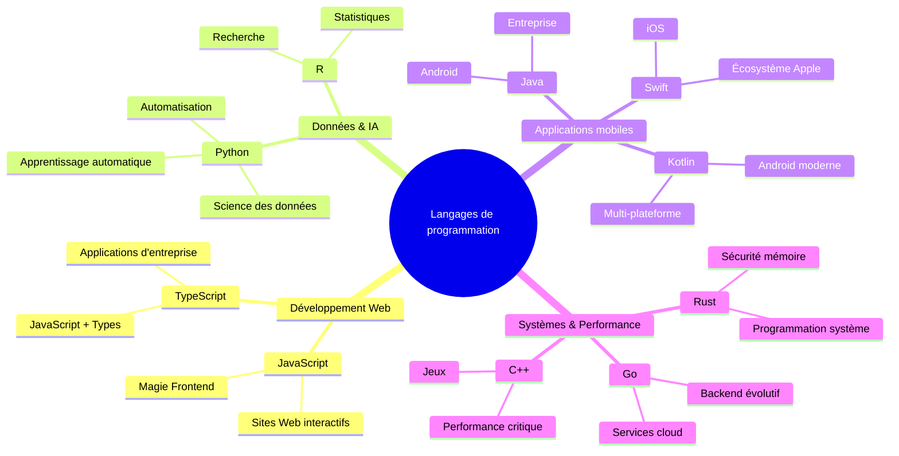
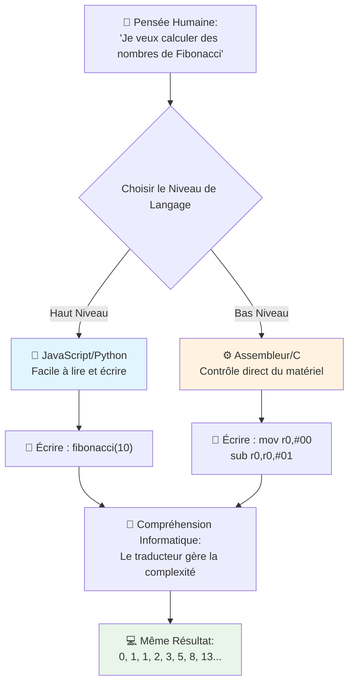
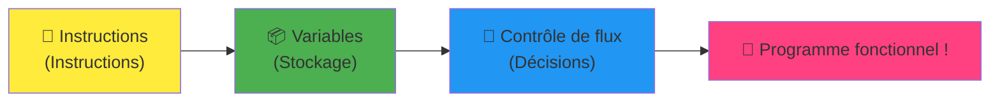
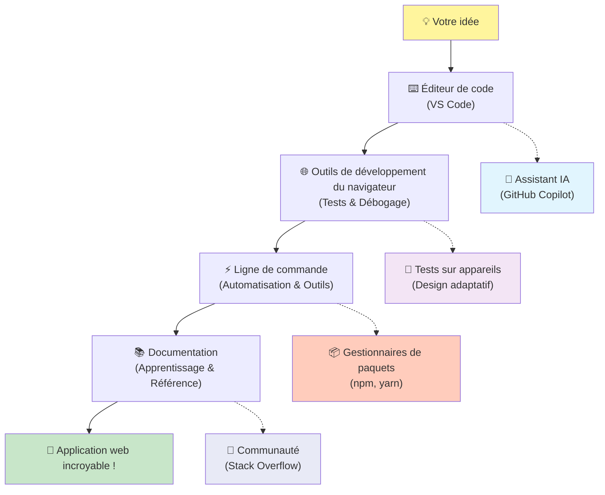
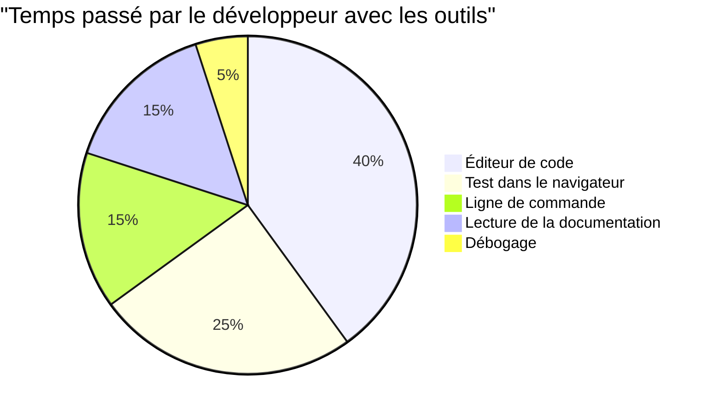
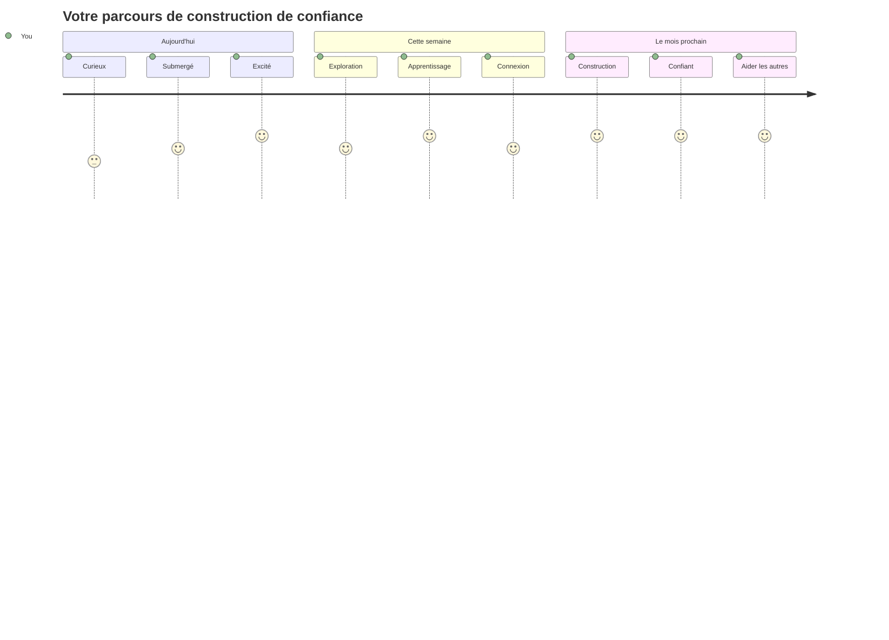

# Introduction aux langages de programmation et aux outils modernes pour développeurs
 
Salut toi, futur développeur ! 👋 Puis-je te confier quelque chose qui me donne encore des frissons chaque jour ? Tu es sur le point de découvrir que la programmation, ce n’est pas seulement des ordinateurs – c’est avoir de véritables super-pouvoirs pour donner vie à tes idées les plus folles !

Tu connais ce moment où tu utilises ton appli préférée et tout fonctionne parfaitement ? Quand tu tapes sur un bouton et qu’il se passe quelque chose de vraiment magique qui te fait dire "wow, comment ont-ils FAIT ça ?" Eh bien, quelqu’un comme toi – probablement assis dans son café préféré à 2h du matin avec son troisième espresso – a écrit le code qui a créé cette magie. Et voici ce qui va te faire halluciner : à la fin de cette leçon, non seulement tu comprendras comment ils l’ont fait, mais tu vas avoir hâte de tenter toi-même !

Écoute, je comprends parfaitement si la programmation te paraît intimidante pour l’instant. Quand j’ai commencé, je pensais honnêtement qu’il fallait être un génie des maths ou coder depuis l’âge de cinq ans. Mais voici ce qui a complètement changé ma perspective : programmer, c’est exactement comme apprendre à avoir des conversations dans une nouvelle langue. Tu commences par dire "bonjour" et "merci", puis tu arrives à commander un café, et avant que tu t’en rendes compte, tu as des discussions philosophiques profondes ! Sauf qu’ici, tu dialogues avec des ordinateurs, et franchement ? Ce sont les interlocuteurs les plus patients que tu puisses avoir – ils ne jugent jamais tes erreurs et ils sont toujours contents d’essayer encore !

Aujourd’hui, nous allons explorer les outils incroyables qui rendent le développement web moderne non seulement possible, mais carrément addictif. Je parle des mêmes éditeurs, navigateurs et workflows que les développeurs chez Netflix, Spotify, et ton studio d’applis indie préféré utilisent chaque jour. Et voici la partie qui va te faire faire la danse de la joie : la plupart de ces outils professionnels, standards dans l’industrie, sont complètement gratuits !


> Sketchnote par [Tomomi Imura](https://twitter.com/girlie_mac)


```mermaid
journey
    title Votre Parcours de Programmation Aujourd'hui
    section Découvrir
      Qu'est-ce que la programmation : 5 : Vous
      Langages de programmation : 4 : Vous
      Vue d'ensemble des outils : 5 : Vous
    section Explorer
      Éditeurs de code : 4 : Vous
      Navigateurs & Outils de dev : 5 : Vous
      Ligne de commande : 3 : Vous
    section Pratiquer
      Détective de langage : 4 : Vous
      Exploration des outils : 5 : Vous
      Connexion à la communauté : 5 : Vous
```
## Voyons ce que tu sais déjà !

Avant de plonger dans le fun, je suis curieux – que sais-tu déjà de ce monde de la programmation ? Et écoute, si en voyant ces questions tu te dis "je n’ai absolument aucune idée de tout ça," ce n’est pas juste ok, c’est parfait ! Cela signifie que tu es exactement au bon endroit. Considère ce quiz comme un étirement avant l’entraînement – on chauffe juste ces muscles du cerveau !

[Faire le quiz précédent la leçon](https://ff-quizzes.netlify.app/web/)


## L’aventure que nous allons vivre ensemble

Ok, je suis vraiment survolté d’excitation pour ce qu’on va découvrir aujourd’hui ! Sérieusement, j’aimerais voir ta tête quand certains de ces concepts vont s’éclairer. Voilà le voyage incroyable que nous allons faire ensemble :

- **Ce qu’est vraiment la programmation (et pourquoi c’est la chose la plus cool du monde !) :** Nous allons découvrir comment le code est littéralement la magie invisible qui alimente tout autour de toi, de ce réveil qui sait miraculeusement que c’est lundi matin à l’algorithme qui choisit parfaitement tes recommandations Netflix
- **Les langages de programmation et leurs personnalités étonnantes :** Imagine arriver à une fête où chaque personne a des super-pouvoirs et des façons totalement différentes de résoudre des problèmes. C’est ça le monde des langages de programmation, et tu vas adorer faire leur connaissance !
- **Les éléments fondamentaux qui font marcher la magie digitale :** Pense à cela comme à un énorme set de LEGO créatif. Une fois que tu comprends comment ces pièces s’assemblent, tu réalises que tu peux littéralement construire tout ce que ton imagination crée
- **Les outils professionnels qui vont te faire sentir comme si on te tendait une baguette magique :** Je ne dramatise pas – ces outils te feront vraiment sentir que tu as des super-pouvoirs, et le mieux ? Ce sont les mêmes que les pros utilisent !

> 💡 **Voici le truc** : Ne pense même pas à essayer de tout mémoriser aujourd’hui ! Pour l’instant, je veux juste que tu ressentes cette étincelle d’excitation sur ce qui est possible. Les détails viendront naturellement avec la pratique – c’est comme ça qu’on apprend vraiment !

> Tu peux suivre cette leçon sur [Microsoft Learn](https://learn.microsoft.com/en-us/learn/modules/web-development-101/introduction-programming/?WT.mc_id=academic-77807-sagibbon) !

## Alors c’est quoi *exactement* la programmation ?

Bon, attaquons la question à un million : qu’est-ce que la programmation, au juste ?

Je vais te raconter une histoire qui a changé ma manière de voir les choses. La semaine dernière, j’essayais d’expliquer à ma mère comment utiliser notre nouvelle télécommande de smart TV. Je me suis surpris à dire des choses comme "Appuie sur le bouton rouge, mais pas le gros bouton rouge, le petit bouton rouge à gauche… non, ton autre gauche… ok, maintenant maintiens-le appuyé deux secondes, pas une, pas trois…" Ça te parle ? 😅

C’est ça la programmation ! C’est l’art de donner des instructions incroyablement détaillées, étape par étape, à quelque chose de très puissant mais qui a besoin qu’on lui explique chaque chose parfaitement. Sauf que, au lieu d’expliquer à ta mère (qui peut demander "lequel rouge ?!"), tu expliques à un ordinateur (qui fait exactement ce que tu dis, même si ce que tu as dit n’est pas tout à fait ce que tu voulais dire).

Voici ce qui m’a époustouflé quand j’ai appris ça : les ordinateurs sont en fait assez simples à la base. Ils ne comprennent littéralement que deux choses – 1 et 0, ce qui revient à dire "oui" et "non" ou "allumé" et "éteint." C’est tout ! Mais là où ça devient magique – on n’a pas besoin de parler en 1 et 0 comme dans Matrix. C’est là que les **langages de programmation** interviennent. Ce sont comme les meilleurs traducteurs du monde qui prennent tes pensées humaines parfaitement normales et les convertissent en langage informatique.

Et voici ce qui me donne encore des frissons chaque matin quand je me réveille : littéralement *tout* ce qui est digital dans ta vie a commencé avec quelqu’un comme toi, probablement en pyjama avec une tasse de café, tapant du code sur son ordinateur portable. Ce filtre Instagram qui te fait paraître parfait ? Quelqu’un l’a codé. La recommandation qui t’a fait découvrir ta nouvelle chanson préférée ? Un développeur a créé cet algorithme. L’application qui t’aide à partager les additions au resto avec tes amis ? Oui, quelqu’un a pensé "c’est énervant, je peux sûrement régler ça" et puis… il l’a fait !

Quand tu apprends à programmer, tu ne te contentes pas d’acquérir une nouvelle compétence – tu rejoins une communauté incroyable de résolveurs de problèmes qui passent leurs journées à penser, "Et si je pouvais construire quelque chose qui rend la journée de quelqu’un un peu meilleure ?" Honnêtement, y a-t-il quelque chose de plus cool que ça ?

✅ **Chasse au fait amusant** : Voilà quelque chose de super à chercher quand tu as un moment libre – qui était le premier programmeur informatique au monde, selon toi ? Je te donne un indice : ce n’est peut-être pas celui auquel tu t’attends ! L’histoire de cette personne est absolument fascinante et montre que la programmation a toujours été une affaire de créativité et de pensée originale.

### 🧠 **Petit check-in : comment te sens-tu ?**

**Prends un moment pour réfléchir :**
- L’idée de "donner des instructions aux ordinateurs" te semble-t-elle plus claire maintenant ?
- Peux-tu penser à une tâche quotidienne que tu aimerais automatiser grâce à la programmation ?
- Quelles questions te viennent à l’esprit sur tout ce concept de programmation ?

> **Souviens-toi** : c’est tout à fait normal si certains concepts semblent flous pour l’instant. Apprendre la programmation, c’est comme apprendre une nouvelle langue – il faut du temps pour que ton cerveau crée ces connexions neuronales. Tu te débrouilles très bien !

## Les langages de programmation, c’est comme différents styles de magie

Ok, ça va paraître bizarre, mais tiens bon – les langages de programmation sont un peu comme différents genres de musique. Pense-y : il y a le jazz, fluide et improvisé, le rock puissant et direct, le classique élégant et structuré, et le hip-hop créatif et expressif. Chaque style a son ambiance, sa communauté passionnée, et chacun est parfait pour différentes humeurs et occasions.

Les langages de programmation fonctionnent exactement pareil ! Tu n’utiliserais pas le même langage pour créer un jeu mobile amusant que celui pour traiter d’énormes quantités de données climatiques, tout comme tu ne mettrais pas du death metal lors d’un cours de yoga (enfin, pas dans la plupart des cours de yoga ! 😄).

Mais ce qui me bluffe à chaque fois que j’y pense : ces langages, c’est comme avoir l’interprète le plus patient et brillant du monde assis juste à côté de toi. Tu peux exprimer tes idées de manière naturelle pour ton cerveau humain, et eux s’occupent de tout le travail incroyablement complexe de traduire ça en 1 et 0 que les ordinateurs comprennent vraiment. C’est comme avoir un ami parfaitement bilingue en "créativité humaine" et "logique informatique" – et qui ne se fatigue jamais, ne prend jamais de pause café, et ne te juge jamais de poser la même question deux fois !

### Langages de programmation populaires et leurs usages


```mermaid
mindmap
  root((Langages de programmation))
    Développement Web
      JavaScript
        Magie Frontend
        Sites Web interactifs
      TypeScript
        JavaScript + Types
        Applications d'entreprise
    Données & IA
      Python
        Science des données
        Apprentissage automatique
        Automatisation
      R
        Statistiques
        Recherche
    Applications mobiles
      Java
        Android
        Entreprise
      Swift
        iOS
        Écosystème Apple
      Kotlin
        Android moderne
        Multi-plateforme
    Systèmes & Performance
      C++
        Jeux
        Performance critique
      Rust
        Sécurité mémoire
        Programmation système
      Go
        Services cloud
        Backend évolutif
```
| Langage | Meilleur pour | Pourquoi c’est populaire |
|----------|----------|------------------|
| **JavaScript** | Développement web, interfaces utilisateurs | Fonctionne dans les navigateurs et alimente les sites interactifs |
| **Python** | Science des données, automatisation, IA | Facile à lire et apprendre, bibliothèques puissantes |
| **Java** | Applications d’entreprise, apps Android | Indépendant de la plateforme, robuste pour les grands systèmes |
| **C#** | Applications Windows, développement de jeux | Fort support dans l’écosystème Microsoft |
| **Go** | Services cloud, systèmes backend | Rapide, simple, conçu pour l’informatique moderne |

### Langages de haut niveau vs langue de bas niveau

Alors honnêtement, c’est ce concept qui m’avait fait exploser le cerveau quand j’ai commencé, donc je vais partager l’analogie qui m’a enfin fait comprendre – et j’espère que ça t’aidera aussi !

Imagine que tu visites un pays dont tu ne parles pas la langue, et que tu dois absolument trouver les toilettes les plus proches (on est tous passés par là, non ? 😅) :

- **La programmation de bas niveau** est comme apprendre le dialecte local si bien que tu peux discuter avec la grand-mère qui vend des fruits au coin de la rue en utilisant des références culturelles, l’argot local, et des blagues internes que seuls les natifs comprennent. Super impressionnant et très efficace… si tu es fluent ! Mais assez écrasant quand tu cherches juste des toilettes.

- **La programmation de haut niveau** c’est plutôt comme avoir un ami local génial qui te comprend. Tu peux dire "I really need to find a restroom" en anglais simple, et il fait toute la traduction culturelle et te donne des directions qui ont parfaitement du sens pour ton cerveau non local.

En termes de programmation :
- **Les langages bas niveau** (comme l’assembleur ou C) te permettent d’avoir des conversations ultra détaillées avec le matériel réel de l’ordinateur, mais tu dois penser comme une machine, ce qui est… disons-le, un gros changement mental !
- **Les langages de haut niveau** (comme JavaScript, Python ou C#) te permettent de penser comme un humain pendant qu’eux gèrent tout le langage machine dans les coulisses. En plus, ils ont des communautés super accueillantes remplies de gens qui se souviennent de ce que c’était d’être débutant et qui veulent vraiment aider !

Devine par lesquels je vais te conseiller de commencer ? 😉 Les langages de haut niveau sont comme des petites roues d’entraînement que tu ne voudras jamais vraiment enlever parce qu’elles rendent toute l’expérience tellement plus agréable !


```mermaid
flowchart TB
    A["👤 Pensée Humaine:<br/>'Je veux calculer des nombres de Fibonacci'"] --> B{Choisir le Niveau de Langage}
    
    B -->|Haut Niveau| C["🌟 JavaScript/Python<br/>Facile à lire et écrire"]
    B -->|Bas Niveau| D["⚙️ Assembleur/C<br/>Contrôle direct du matériel"]
    
    C --> E["📝 Écrire : fibonacci(10)"]
    D --> F["📝 Écrire : mov r0,#00<br/>sub r0,r0,#01"]
    
    E --> G["🤖 Compréhension Informatique:<br/>Le traducteur gère la complexité"]
    F --> G
    
    G --> H["💻 Même Résultat:<br/>0, 1, 1, 2, 3, 5, 8, 13..."]
    
    style C fill:#e1f5fe
    style D fill:#fff3e0
    style H fill:#e8f5e8
```
### Laisse-moi te montrer pourquoi les langages de haut niveau sont tellement plus sympas

Bon, je vais te montrer quelque chose qui démontre parfaitement pourquoi j’ai adoré les langages de haut niveau, mais avant ça – promets-moi un truc. Quand tu verras ce premier exemple de code, ne panique pas ! Il est censé paraître intimidant. C’est justement ce que je veux te montrer !

On va regarder la même tâche écrite dans deux styles complètement différents. Les deux créent ce qu’on appelle la suite de Fibonacci – c’est un joli motif mathématique où chaque nombre est la somme des deux précédents : 0, 1, 1, 2, 3, 5, 8, 13… (Petit fait : tu trouveras ce motif partout dans la nature – des spirales des graines de tournesol, aux motifs des pommes de pin, jusqu’à la formation des galaxies !)

Prêt à voir la différence ? C’est parti !

**Langage de haut niveau (JavaScript) – Facile à lire :**

```javascript
// Étape 1 : Configuration de base de Fibonacci
const fibonacciCount = 10;
let current = 0;
let next = 1;

console.log('Fibonacci sequence:');
```

**Voici ce que fait ce code :**
- **Déclare** une constante pour spécifier combien de nombres de Fibonacci on veut générer
- **Initie** deux variables pour suivre le nombre actuel et le suivant dans la séquence
- **Définit** les valeurs de départ (0 et 1) qui définissent le motif Fibonacci
- **Affiche** un message titre pour identifier notre sortie

```javascript
// Étape 2 : Générer la séquence avec une boucle
for (let i = 0; i < fibonacciCount; i++) {
  console.log(`Position ${i + 1}: ${current}`);
  
  // Calculer le nombre suivant dans la séquence
  const sum = current + next;
  current = next;
  next = sum;
}
```

**Explication détaillée :**
- **Boucle** à travers chaque position dans notre séquence avec une boucle `for`
- **Affiche** chaque nombre avec sa position grâce à la syntaxe de template string
- **Calcule** le prochain nombre de Fibonacci en additionnant les valeurs actuelles et suivantes
- **Met à jour** nos variables de suivi pour passer à la prochaine itération

```javascript
// Étape 3 : Approche fonctionnelle moderne
const generateFibonacci = (count) => {
  const sequence = [0, 1];
  
  for (let i = 2; i < count; i++) {
    sequence[i] = sequence[i - 1] + sequence[i - 2];
  }
  
  return sequence;
};

// Exemple d'utilisation
const fibSequence = generateFibonacci(10);
console.log(fibSequence);
```

**Dans l’exemple ci-dessus, on a :**
- **Créé** une fonction réutilisable en utilisant la syntaxe moderne de fonction fléchée
- **Construit** un tableau pour stocker la séquence complète plutôt que d’afficher nombre par nombre
- **Utilisé** l’indexation de tableau pour calculer chaque nouveau nombre à partir des précédents
- **Renvoi** la séquence complète pour un usage flexible dans d’autres parties de notre programme

**Langage bas niveau (ARM Assembly) – Adapté à la machine :**

```assembly
 area ascen,code,readonly
 entry
 code32
 adr r0,thumb+1
 bx r0
 code16
thumb
 mov r0,#00
 sub r0,r0,#01
 mov r1,#01
 mov r4,#10
 ldr r2,=0x40000000
back add r0,r1
 str r0,[r2]
 add r2,#04
 mov r3,r0
 mov r0,r1
 mov r1,r3
 sub r4,#01
 cmp r4,#00
 bne back
 end
```

Remarque comme la version JavaScript ressemble presque à des instructions en anglais, tandis que la version assembleur utilise des commandes cryptiques qui contrôlent directement le processeur de l’ordinateur. Les deux accomplissent exactement la même tâche, mais le langage de haut niveau est beaucoup plus facile à comprendre, écrire et maintenir pour les humains.

**Différences clés que tu vas remarquer :**
- **Lisibilité** : JavaScript utilise des noms descriptifs comme `fibonacciCount` tandis qu'Assembly utilise des étiquettes cryptiques comme `r0`, `r1`
- **Commentaires** : Les langages de haut niveau encouragent les commentaires explicatifs qui rendent le code auto-documenté
- **Structure** : Le déroulement logique de JavaScript correspond à la façon dont les humains pensent aux problèmes étape par étape
- **Maintenance** : Mettre à jour la version JavaScript pour différentes exigences est simple et clair

✅ **À propos de la suite de Fibonacci** : Ce motif numérique absolument splendide (où chaque nombre est la somme des deux précédents : 0, 1, 1, 2, 3, 5, 8...) apparaît littéralement *partout* dans la nature ! Vous le trouverez dans les spirales des tournesols, les motifs des pommes de pin, la courbe des coquilles de nautile, et même dans la façon dont les branches des arbres poussent. C'est assez époustouflant de voir comment les mathématiques et le code peuvent nous aider à comprendre et recréer les motifs que la nature utilise pour créer la beauté !


## Les éléments fondamentaux qui font marcher la magie

Bien, maintenant que vous avez vu à quoi ressemblent les langages de programmation en action, décomposons les pièces fondamentales qui composent littéralement chaque programme jamais écrit. Considérez-les comme les ingrédients essentiels de votre recette préférée – une fois que vous comprenez ce que fait chacun, vous pourrez lire et écrire du code dans quasiment n'importe quel langage !

C’est un peu comme apprendre la grammaire de la programmation. Vous vous rappelez à l'école quand vous appreniez les noms, les verbes, et comment construire des phrases ? La programmation a sa propre version de la grammaire, et honnêtement, elle est bien plus logique et indulgente que la grammaire anglaise ! 😄

### Instructions : Les consignes étape par étape

Commençons par les **instructions** – ce sont comme des phrases individuelles dans une conversation avec votre ordinateur. Chaque instruction dit à l’ordinateur de faire une chose spécifique, un peu comme donner des directions : "Tourne à gauche ici," "Arrête-toi au feu rouge," "Gare-toi à cet endroit."

Ce que j’aime avec les instructions, c’est à quel point elles sont généralement lisibles. Regardez ceci :

```javascript
// Instructions de base qui effectuent des actions simples
const userName = "Alex";                    
console.log("Hello, world!");              
const sum = 5 + 3;                         
```

**Voici ce que fait ce code :**
- **Déclare** une variable constante pour stocker le nom d’un utilisateur
- **Affiche** un message de salutation dans la console
- **Calcule** et stocke le résultat d’une opération mathématique

```javascript
// Instructions qui interagissent avec les pages web
document.title = "My Awesome Website";      
document.body.style.backgroundColor = "lightblue";
```

**Étape par étape, voici ce qui se passe :**
- **Modifie** le titre de la page web qui apparaît dans l’onglet du navigateur
- **Change** la couleur d’arrière-plan de tout le corps de la page

### Variables : Le système de mémoire de votre programme

D’accord, les **variables** sont honnêtement un de mes concepts préférés à enseigner parce qu’elles ressemblent tellement à des choses que vous utilisez déjà tous les jours !

Pensez à votre liste de contacts téléphoniques un instant. Vous ne mémorisez pas les numéros de téléphone de tout le monde – à la place, vous sauvegardez "Maman," "Meilleur Ami," ou "Pizzeria qui livre jusqu’à 2h du matin" et vous laissez votre téléphone se souvenir des numéros réels. Les variables fonctionnent exactement de la même manière ! Ce sont comme des conteneurs étiquetés où votre programme peut stocker des informations et les récupérer plus tard en utilisant un nom qui a du sens.

Voici ce qui est vraiment génial : les variables peuvent changer pendant que votre programme s’exécute (d’où leur nom "variable" – vous voyez ce qu’ils ont fait ?). Tout comme vous mettez à jour le contact de la pizzeria si vous trouvez un endroit encore meilleur, les variables peuvent être mises à jour au fur et à mesure que votre programme apprend de nouvelles informations ou que les situations changent !

Laissez-moi vous montrer à quel point c’est simple et beau :

```javascript
// Étape 1 : Création des variables de base
const siteName = "Weather Dashboard";        
let currentWeather = "sunny";               
let temperature = 75;                       
let isRaining = false;                      
```

**Comprendre ces concepts :**
- **Stocker** des valeurs invariables dans des variables `const` (comme le nom du site)
- **Utiliser** `let` pour des valeurs qui peuvent changer au cours du programme
- **Assigner** différents types de données : chaînes (texte), nombres, et booléens (vrai/faux)
- **Choisir** des noms descriptifs qui expliquent ce que contient chaque variable

```javascript
// Étape 2 : Travailler avec des objets pour regrouper des données connexes
const weatherData = {                       
  location: "San Francisco",
  humidity: 65,
  windSpeed: 12
};
```

**Dans l’exemple ci-dessus, nous avons :**
- **Créé** un objet pour regrouper des informations météorologiques liées
- **Organisé** plusieurs éléments sous un seul nom de variable
- **Utilisé** des paires clé-valeur pour étiqueter clairement chaque information

```javascript
// Étape 3 : Utilisation et mise à jour des variables
console.log(`${siteName}: Today is ${currentWeather} and ${temperature}°F`);
console.log(`Wind speed: ${weatherData.windSpeed} mph`);

// Mise à jour des variables modifiables
currentWeather = "cloudy";                  
temperature = 68;                          
```

**Comprenons chaque partie :**
- **Afficher** des informations en utilisant des littéraux de gabarits avec la syntaxe `${}`
- **Accéder** aux propriétés d’un objet avec la notation par point (`weatherData.windSpeed`)
- **Mettre à jour** les variables déclarées avec `let` pour refléter des conditions changeantes
- **Combiner** plusieurs variables pour créer des messages significatifs

```javascript
// Étape 4 : Destructuration moderne pour un code plus propre
const { location, humidity } = weatherData; 
console.log(`${location} humidity: ${humidity}%`);
```

**Ce que vous devez savoir :**
- **Extraire** des propriétés spécifiques d’objets avec l’affectation par décomposition
- **Créer** automatiquement de nouvelles variables aux mêmes noms que les clés d’un objet
- **Simplifier** le code en évitant de répéter la notation par point

### Flux de contrôle : Apprendre à votre programme à réfléchir

D’accord, c’est là que la programmation devient absolument bluffante ! Le **flux de contrôle** consiste essentiellement à apprendre à votre programme à prendre des décisions intelligentes, exactement comme vous le faites tous les jours sans même y penser.

Imaginez ceci : ce matin, vous avez probablement fait quelque chose comme « S'il pleut, je prends un parapluie. S’il fait froid, je mets une veste. Si je suis en retard, je saute le petit déjeuner et prends un café en chemin. » Votre cerveau suit naturellement cette logique si-alors des dizaines de fois par jour !

C’est ce qui donne aux programmes cette impression d’intelligence et de vie, au lieu de simplement suivre un script ennuyeux et prévisible. Ils peuvent réellement analyser une situation, évaluer ce qui se passe, et répondre de manière appropriée. C’est comme donner un cerveau à votre programme capable de s’adapter et de faire des choix !

Vous voulez voir à quel point cela fonctionne magnifiquement ? Laissez-moi vous montrer :

```javascript
// Étape 1 : Logique conditionnelle de base
const userAge = 17;

if (userAge >= 18) {
  console.log("You can vote!");
} else {
  const yearsToWait = 18 - userAge;
  console.log(`You'll be able to vote in ${yearsToWait} year(s).`);
}
```

**Voici ce que fait ce code :**
- **Vérifier** si l’âge de l’utilisateur remplit la condition pour voter
- **Exécuter** différents blocs de code selon le résultat de la condition
- **Calculer** et afficher le temps restant avant l’éligibilité au vote si moins de 18 ans
- **Fournir** un retour spécifique et utile pour chaque scénario

```javascript
// Étape 2 : Conditions multiples avec opérateurs logiques
const userAge = 17;
const hasPermission = true;

if (userAge >= 18 && hasPermission) {
  console.log("Access granted: You can enter the venue.");
} else if (userAge >= 16) {
  console.log("You need parent permission to enter.");
} else {
  console.log("Sorry, you must be at least 16 years old.");
}
```

**Décomposons ce qui se passe ici :**
- **Combiner** plusieurs conditions avec l’opérateur `&&` (et)
- **Créer** une hiérarchie de conditions avec `else if` pour plusieurs scénarios
- **Gérer** tous les cas possibles avec une instruction finale `else`
- **Donner** un retour clair et exploitable pour chaque situation différente

```javascript
// Étape 3 : Condition concise avec l'opérateur ternaire
const votingStatus = userAge >= 18 ? "Can vote" : "Cannot vote yet";
console.log(`Status: ${votingStatus}`);
```

**À retenir :**
- **Utiliser** l’opérateur ternaire (`? :`) pour des conditions simples à deux options
- **Écrire** d’abord la condition, suivie de `?`, puis le résultat si vrai, ensuite `:`, puis le résultat si faux
- **Appliquer** ce modèle quand vous devez affecter des valeurs selon des conditions

```javascript
// Étape 4 : Gestion de plusieurs cas spécifiques
const dayOfWeek = "Tuesday";

switch (dayOfWeek) {
  case "Monday":
  case "Tuesday":
  case "Wednesday":
  case "Thursday":
  case "Friday":
    console.log("It's a weekday - time to work!");
    break;
  case "Saturday":
  case "Sunday":
    console.log("It's the weekend - time to relax!");
    break;
  default:
    console.log("Invalid day of the week");
}
```

**Ce code réalise ce qui suit :**
- **Comparer** la valeur d’une variable à plusieurs cas spécifiques
- **Grouper** des cas similaires (jours de semaine vs week-ends)
- **Exécuter** le bloc de code approprié lorsqu’un cas correspond
- **Inclure** un cas `default` pour gérer les valeurs inattendues
- **Utiliser** des `break` pour éviter que le code ne continue vers le cas suivant

> 💡 **Analogie du monde réel** : Pensez au flux de contrôle comme à un GPS super patient qui vous guide. Il pourrait dire « S’il y a un bouchon sur la rue principale, prenez l’autoroute. Si un chantier bloque l’autoroute, essayez la route panoramique. » Les programmes utilisent exactement ce type de logique conditionnelle pour répondre intelligemment à différentes situations et offrir toujours la meilleure expérience possible.

### 🎯 **Vérification des concepts : Maîtrise des éléments fondamentaux**

**Voyons comment vous vous en sortez avec les bases :**
- Pouvez-vous expliquer la différence entre une variable et une instruction avec vos propres mots ?
- Pensez à un scénario réel où vous utiliseriez une décision if-alors (comme notre exemple de vote)
- Quelle chose dans la logique de programmation vous a surpris ?

**Petit coup de boost de confiance :**

```mermaid
flowchart LR
    A["📝 Instructions<br/>(Instructions)"] --> B["📦 Variables<br/>(Stockage)"] --> C["🔀 Contrôle de flux<br/>(Décisions)"] --> D["🎉 Programme fonctionnel !"]
    
    style A fill:#ffeb3b
    style B fill:#4caf50
    style C fill:#2196f3
    style D fill:#ff4081
```
✅ **Ce qui arrive ensuite** : Nous allons nous amuser énormément en approfondissant ces concepts au fil de ce voyage incroyable ! Pour l’instant, concentrez-vous juste sur l’excitation devant toutes les possibilités incroyables qui vous attendent. Les compétences et techniques spécifiques vont venir naturellement avec la pratique – je promets que ça va être bien plus amusant que vous ne l’imaginez !

## Les outils du métier

Bon, c’est honnêtement là que je deviens tellement enthousiaste que j’ai du mal à me contenir ! 🚀 Nous allons parler des outils incroyables qui vont vous donner l’impression qu’on vous a remis les clés d’un vaisseau spatial numérique.

Vous savez comment un chef a ces couteaux parfaitement équilibrés qui semblent être une extension de ses mains ? Ou comment un musicien possède cette guitare qui semble chanter au premier contact ? Eh bien, les développeurs ont leur propre version de ces outils magiques, et voilà ce qui va absolument vous épater – la plupart sont totalement gratuits !

Je suis presque en train de sautiller sur ma chaise en pensant à vous les présenter parce qu’ils ont complètement révolutionné la manière dont nous construisons le logiciel. On parle d’assistants de codage pilotés par IA qui peuvent vous aider à écrire votre code (je ne blague même pas !), d'environnements cloud où vous pouvez construire des applications entières littéralement de n'importe où avec du Wi-Fi, et d’outils de débogage si sophistiqués qu’ils ressemblent à une vision aux rayons X pour vos programmes.

Et là où ça me donne encore des frissons : ce ne sont pas des outils pour débutants que vous allez rapidement dépasser. Ce sont les mêmes outils professionnels utilisés par des développeurs chez Google, Netflix, et ce studio d’apps indie que vous adorez, à l’instant même. Vous allez vous sentir tellement pro en les utilisant !


```mermaid
graph TD
    A["💡 Votre idée"] --> B["⌨️ Éditeur de code<br/>(VS Code)"] 
    B --> C["🌐 Outils de développement du navigateur<br/>(Tests & Débogage)"]
    C --> D["⚡ Ligne de commande<br/>(Automatisation & Outils)"]
    D --> E["📚 Documentation<br/>(Apprentissage & Référence)"]
    E --> F["🚀 Application web incroyable !"]
    
    B -.-> G["🤖 Assistant IA<br/>(GitHub Copilot)"]
    C -.-> H["📱 Tests sur appareils<br/>(Design adaptatif)"]
    D -.-> I["📦 Gestionnaires de paquets<br/>(npm, yarn)"]
    E -.-> J["👥 Communauté<br/>(Stack Overflow)"]
    
    style A fill:#fff59d
    style F fill:#c8e6c9
    style G fill:#e1f5fe
    style H fill:#f3e5f5
    style I fill:#ffccbc
    style J fill:#e8eaf6
```
### Éditeurs de code et IDE : vos nouveaux meilleurs amis numériques

Parlons des éditeurs de code – ils sont sur le point de devenir vos endroits préférés pour coder ! Pensez à eux comme votre sanctuaire personnel de codage où vous passerez la majorité de votre temps à créer et peaufiner vos créations numériques.

Mais ce qu’il y a de vraiment magique avec les éditeurs modernes, c’est qu’ils ne sont pas de simples éditeurs de texte sophistiqués. C’est comme avoir le mentor de codage le plus brillant et encourageant assis à côté de vous, 24h/24 et 7j/7. Ils corrigent vos fautes avant même que vous ne les remarquiez, suggèrent des améliorations qui vous font passer pour un génie, vous aident à comprendre chaque morceau de code, et certains peuvent même prédire ce que vous allez taper et vous proposer de finir vos phrases !

Je me souviens de ma première découverte de l’auto-complétion – j’avais littéralement l’impression de vivre dans le futur. Vous commencez à taper quelque chose, et votre éditeur vous dit, "Hé, est-ce que tu pensais à cette fonction qui fait exactement ce dont tu as besoin ?" C’est comme avoir un lecteur de pensées comme pote de codage !

**Qu’est-ce qui rend ces éditeurs si incroyables ?**

Les éditeurs modernes offrent une gamme impressionnante de fonctionnalités conçues pour booster votre productivité :

| Fonctionnalité | Ce que ça fait | Pourquoi c’est utile |
|----------------|----------------|---------------------|
| **Coloration syntaxique** | Colore différentes parties de votre code | Facilite la lecture et la détection d’erreurs |
| **Auto-complétion** | Suggère du code en cours de frappe | Accélère la saisie et réduit les fautes |
| **Outils de débogage** | Aide à trouver et corriger les erreurs | Économise des heures de dépannage |
| **Extensions** | Ajoutent des fonctionnalités spécialisées | Personnalisez votre éditeur pour chaque technologie |
| **Assistants IA** | Proposent code et explications | Accélèrent l’apprentissage et la productivité |

> 🎥 **Ressource vidéo** : Vous voulez voir ces outils en action ? Regardez cette [vidéo Outils du métier](https://youtube.com/watch?v=69WJeXGBdxg) pour un aperçu complet.

#### Éditeurs recommandés pour le développement web

**[Visual Studio Code](https://code.visualstudio.com/?WT.mc_id=academic-77807-sagibbon)** (Gratuit)
- Le plus populaire chez les développeurs web
- Excellent écosystème d’extensions
- Terminal intégré et intégration Git
- **Extensions indispensables** :
  - [GitHub Copilot](https://marketplace.visualstudio.com/items?itemName=GitHub.copilot) - Suggestions de code pilotées par IA
  - [Live Share](https://marketplace.visualstudio.com/items?itemName=MS-vsliveshare.vsliveshare) - Collaboration en temps réel
  - [Prettier](https://marketplace.visualstudio.com/items?itemName=esbenp.prettier-vscode) - Formatage automatique du code
  - [Code Spell Checker](https://marketplace.visualstudio.com/items?itemName=streetsidesoftware.code-spell-checker) - Repère les fautes de frappe dans le code

**[JetBrains WebStorm](https://www.jetbrains.com/webstorm/)** (Payant, gratuit pour les étudiants)
- Outils avancés de débogage et de test
- Complétion intelligente du code
- Contrôle de version intégré

**IDE basés sur le cloud** (Différents tarifs)
- [GitHub Codespaces](https://github.com/features/codespaces) - VS Code complet dans votre navigateur
- [Replit](https://replit.com/) - Idéal pour apprendre et partager du code
- [StackBlitz](https://stackblitz.com/) - Développement web full-stack instantané

> 💡 **Conseil pour débuter** : Commencez par Visual Studio Code – c’est gratuit, largement utilisé dans l’industrie, et dispose d’une communauté énorme qui produit tutoriels et extensions utiles.


### Navigateurs web : votre laboratoire de développement secret

Préparez-vous à être totalement époustouflé ! Vous savez comment vous utilisez les navigateurs pour faire défiler les réseaux sociaux et regarder des vidéos ? Eh bien, il s’avère qu’ils cachaient depuis toujours ce laboratoire de développement secret incroyable, juste en attendant que vous le découvriez !

Chaque fois que vous faites un clic droit sur une page web et sélectionnez "Inspecter l’élément", vous ouvrez un monde caché d’outils pour développeurs qui sont honnêtement plus puissants que certains logiciels coûteux pour lesquels je payais des centaines de dollars. C’est comme découvrir que votre vieille cuisine abritait depuis toujours un laboratoire de chef professionnel derrière un panneau secret !
La première fois que quelqu’un m’a montré les DevTools du navigateur, j’ai passé genre trois heures à cliquer partout en me disant « ATTENDS, ÇA PEUT FAIRE ÇA AUSSI ?! » Tu peux littéralement modifier n’importe quel site web en temps réel, voir exactement à quelle vitesse tout se charge, tester comment ton site s’affiche sur différents appareils, et même déboguer du JavaScript comme un pro total. C’est absolument phénoménal !

**Voici pourquoi les navigateurs sont ton arme secrète :**

Quand tu crées un site web ou une application web, tu as besoin de voir à quoi ça ressemble et comment ça se comporte dans le monde réel. Les navigateurs affichent non seulement ton travail, mais fournissent aussi des retours détaillés sur la performance, l’accessibilité, et les problèmes potentiels.

#### Outils de développeur pour navigateur (DevTools)

Les navigateurs modernes incluent des suites de développement complètes :

| Catégorie d’outil | Ce qu’il fait | Exemple d’utilisation |
|-------------------|---------------|-----------------------|
| **Inspecteur d’éléments** | Voir et modifier le HTML/CSS en temps réel | Ajuster le style pour voir les résultats immédiats |
| **Console** | Voir les messages d’erreur et tester le JavaScript | Déboguer les problèmes et expérimenter avec le code |
| **Moniteur réseau** | Suivre le chargement des ressources | Optimiser la performance et les temps de chargement |
| **Vérificateur d’accessibilité** | Tester pour un design inclusif | S’assurer que ton site fonctionne pour tous les utilisateurs |
| **Simulateur d’appareil** | Aperçu sur différentes tailles d’écran | Tester le design adaptatif sans plusieurs appareils |

#### Navigateurs recommandés pour le développement

- **[Chrome](https://developers.google.com/web/tools/chrome-devtools/)** – DevTools standard de l’industrie avec une documentation étendue  
- **[Firefox](https://developer.mozilla.org/docs/Tools)** – Excellents outils pour CSS Grid et l’accessibilité  
- **[Edge](https://docs.microsoft.com/microsoft-edge/devtools-guide-chromium/?WT.mc_id=academic-77807-sagibbon)** – Basé sur Chromium avec les ressources de Microsoft pour développeurs  

> ⚠️ **Conseil important pour les tests** : Teste toujours tes sites web sur plusieurs navigateurs ! Ce qui fonctionne parfaitement sur Chrome peut sembler différent sur Safari ou Firefox. Les développeurs pros testent sur tous les principaux navigateurs pour assurer une expérience utilisateur cohérente.


### Outils en ligne de commande : ta passerelle vers des super-pouvoirs de développeur

Bon, soyons complètement honnêtes ici à propos de la ligne de commande, parce que je veux que tu entendes ça de quelqu’un qui connaît vraiment le sujet. La première fois que je l’ai vue – juste ce noir effrayant avec du texte qui clignote – j’ai littéralement pensé : « Nope, absolument pas ! Ça ressemble à un truc sorti d’un film de hackers des années 80, et je suis clairement pas assez intelligent pour ça ! » 😅

Mais voilà ce que j’aurais aimé qu’on me dise à l’époque, et que je te dis tout de suite : la ligne de commande n’est pas effrayante – c’est en fait comme avoir une conversation directe avec ton ordinateur. Pense à ça comme la différence entre commander de la nourriture via une application stylée avec photos et menus (ce qui est agréable et facile) et entrer dans ton restaurant local préféré où le chef sait exactement ce que tu aimes et peut te préparer quelque chose de parfait simplement parce que tu lui dis « surprends-moi avec quelque chose d’incroyable ».

La ligne de commande, c’est là où les développeurs se sentent comme des magiciens absolus. Tu tapes quelques mots apparemment magiques (d’accord, ce ne sont que des commandes, mais ça fait magique !), tu appuies sur Entrée, et BOUM – tu as créé des structures de projet entières, installé des outils puissants venus du monde entier, ou déployé ton appli sur Internet pour que des millions de personnes la voient. Une fois que tu as goûté à ce pouvoir, c’est franchement assez addictif !

**Pourquoi la ligne de commande deviendra ton outil préféré :**

Alors que les interfaces graphiques sont super pour beaucoup de tâches, la ligne de commande excelle dans l’automatisation, la précision et la rapidité. Beaucoup d’outils de développement fonctionnent principalement via l’interface en ligne de commande, et apprendre à les utiliser efficacement peut dramatiquement améliorer ta productivité.

```bash
# Étape 1 : Créez et accédez au répertoire du projet
mkdir my-awesome-website
cd my-awesome-website
```
  
**Voici ce que fait ce code :**  
- **Créer** un nouveau répertoire appelé "my-awesome-website" pour ton projet  
- **Naviguer** dans le répertoire fraîchement créé pour commencer à travailler  

```bash
# Étape 2 : Initialiser le projet avec package.json
npm init -y

# Installer des outils de développement modernes
npm install --save-dev vite prettier eslint
npm install --save-dev @eslint/js
```
  
**Étape par étape, voilà ce qui se passe :**  
- **Initialiser** un nouveau projet Node.js avec les réglages par défaut via `npm init -y`  
- **Installer** Vite comme outil de build moderne pour un développement rapide et des builds production  
- **Ajouter** Prettier pour le formatage automatique du code et ESLint pour les contrôles qualité  
- **Utiliser** le drapeau `--save-dev` pour marquer ces dépendances comme uniquement pour le développement  

```bash
# Étape 3 : Créer la structure et les fichiers du projet
mkdir src assets
echo '<!DOCTYPE html><html><head><title>My Site</title></head><body><h1>Hello World</h1></body></html>' > index.html

# Démarrer le serveur de développement
npx vite
```
  
**Dans ce qui précède, nous avons :**  
- **Organisé** notre projet en créant des dossiers séparés pour le code source et les assets  
- **Généré** un fichier HTML basique avec une structure document correcte  
- **Démarré** le serveur de développement Vite pour un rechargement en direct et un remplacement à chaud des modules  

#### Outils en ligne de commande essentiels pour le développement web

| Outil | But | Pourquoi tu en as besoin |
|-------|-----|--------------------------|
| **[Git](https://git-scm.com/)** | Contrôle de version | Suivre les changements, collaborer avec d’autres, sauvegarder ton travail |
| **[Node.js & npm](https://nodejs.org/)** | Runtime JavaScript & gestion de paquets | Exécuter du JavaScript hors navigateur, installer des outils de dev modernes |
| **[Vite](https://vitejs.dev/)** | Outil de build & serveur dev | Développement ultra-rapide avec remplacement à chaud des modules |
| **[ESLint](https://eslint.org/)** | Qualité du code | Trouver et corriger automatiquement les problèmes dans ton JavaScript |
| **[Prettier](https://prettier.io/)** | Formatage du code | Garder ton code uniformément formaté et lisible |

#### Options selon la plateforme

**Windows :**  
- **[Windows Terminal](https://docs.microsoft.com/windows/terminal/?WT.mc_id=academic-77807-sagibbon)** – Terminal moderne et riche en fonctionnalités  
- **[PowerShell](https://docs.microsoft.com/powershell/?WT.mc_id=academic-77807-sagibbon)** 💻 – Environnement de scripting puissant  
- **[Invite de commandes](https://learn.microsoft.com/windows-server/administration/windows-commands/windows-commands)** 💻 – Ligne de commande traditionnelle Windows  

**macOS :**  
- **[Terminal](https://support.apple.com/guide/terminal/)** 💻 – Application terminal intégrée  
- **[iTerm2](https://iterm2.com/)** – Terminal amélioré avec fonctionnalités avancées  

**Linux :**  
- **[Bash](https://www.gnu.org/software/bash/)** 💻 – Shell standard Linux  
- **[KDE Konsole](https://docs.kde.org/trunk5/en/konsole/konsole/index.html)** – Émulateur de terminal avancé  

> 💻 = Préinstallé sur le système d’exploitation

> 🎯 **Parcours d’apprentissage** : Commence par les commandes basiques comme `cd` (changer de répertoire), `ls` ou `dir` (lister les fichiers), et `mkdir` (créer un dossier). Entraîne-toi avec des commandes modernes du workflow comme `npm install`, `git status`, et `code .` (ouvre le répertoire courant dans VS Code). Au fur et à mesure que tu te sens plus à l’aise, tu apprendras naturellement des commandes plus avancées et des techniques d’automatisation.


### Documentation : ton mentor d’apprentissage toujours disponible

Bon, laisse-moi partager un petit secret qui va te faire sentir tellement mieux d’être débutant : même les développeurs les plus expérimentés passent une énorme partie de leur temps à lire la documentation. Et ce n’est pas parce qu’ils ne savent pas ce qu’ils font – c’est en fait un signe de sagesse !

Pense à la documentation comme un accès aux professeurs les plus patients et les plus érudits du monde disponibles 24h/24. Bloqué sur un problème à 2 heures du matin ? La documentation est là avec un câlin virtuel chaleureux et exactement la réponse dont tu as besoin. Tu veux apprendre une nouvelle fonctionnalité dont tout le monde parle ? La documentation est là pour toi avec des exemples pas à pas. Tu essaies de comprendre pourquoi quelque chose fonctionne comme ça ? Tu l’as deviné – la documentation est prête à l’expliquer de façon à ce que ça te fasse enfin « clic » !

Voici quelque chose qui a totalement changé ma perspective : le monde du développement web évolue incroyablement vite, et personne (je dis bien personne !) ne garde tout en mémoire. J’ai vu des développeurs seniors avec plus de 15 ans d’expérience chercher la syntaxe basique, et tu sais quoi ? Ce n’est pas embarrassant – c’est intelligent ! Ce n’est pas avoir une mémoire parfaite ; c’est savoir où trouver des réponses fiables rapidement et comment les appliquer.

**C’est là où la vraie magie opère :**

Les développeurs pros passent une part importante de leur temps à lire la documentation – pas parce qu’ils ignorent ce qu’ils font, mais parce que l’univers du développement web évolue si vite que rester à jour demande un apprentissage continu. Une bonne documentation t’aide à comprendre non seulement *comment* utiliser quelque chose, mais *pourquoi* et *quand* l’utiliser.

#### Ressources essentielles de documentation

**[Mozilla Developer Network (MDN)](https://developer.mozilla.org/docs/Web)**  
- La référence en or pour la documentation des technologies web  
- Guides complets pour HTML, CSS, et JavaScript  
- Informations sur la compatibilité des navigateurs  
- Exemples pratiques et démonstrations interactives  

**[Web.dev](https://web.dev)** (par Google)  
- Meilleures pratiques modernes du développement web  
- Guides d’optimisation des performances  
- Principes d’accessibilité et design inclusif  
- Études de cas de projets réels  

**[Documentation des développeurs Microsoft](https://docs.microsoft.com/microsoft-edge/#microsoft-edge-for-developers)**  
- Ressources pour le navigateur Edge  
- Guides pour Progressive Web Apps  
- Infos sur le développement multiplateforme  

**[Frontend Masters Learning Paths](https://frontendmasters.com/learn/)**  
- Programmes d’apprentissage structurés  
- Cours vidéo par des experts de l’industrie  
- Exercices pratiques de codage  

> 📚 **Stratégie d’étude** : Ne cherche pas à mémoriser la documentation – apprends plutôt à la parcourir efficacement. Mets en favoris les références utilisées fréquemment et entraîne-toi à utiliser les fonctions de recherche pour trouver rapidement des infos spécifiques.

### 🔧 **Vérification de maîtrise des outils : Qu’est-ce qui te parle le plus ?**

**Prends un moment pour réfléchir :**  
- Quel outil as-tu le plus hâte d’essayer en premier ? (Il n’y a pas de mauvaise réponse !)  
- La ligne de commande te fait-elle toujours peur ou est-ce que tu es curieux à son sujet ?  
- Peux-tu imaginer utiliser les DevTools de navigateur pour jeter un œil dans les coulisses de tes sites préférés ?


```mermaid
pie title "Temps passé par le développeur avec les outils"
    "Éditeur de code" : 40
    "Test dans le navigateur" : 25
    "Ligne de commande" : 15
    "Lecture de la documentation" : 15
    "Débogage" : 5
```  
> **Fait amusant** : La plupart des développeurs passent environ 40 % de leur temps dans leur éditeur de code, mais remarque combien de temps ils passent à tester, apprendre, et résoudre des problèmes. Programmer ce n’est pas juste écrire du code – c’est créer des expériences !

✅ **À méditer** : Voilà une réflexion intéressante – penses-tu que les outils pour construire des sites web (développement) pourraient être différents des outils pour concevoir leur apparence (design) ? C’est comme la différence entre un architecte qui dessine une belle maison et l’entrepreneur qui la construit vraiment. Les deux sont cruciaux, mais ils ont des boîtes à outils différentes ! Ce genre de réflexion va vraiment t’aider à voir la grande image de comment les sites web prennent vie.

## Défi GitHub Copilot Agent 🚀

Utilise le mode Agent pour accomplir le défi suivant :

**Description :** Explore les fonctionnalités d’un éditeur de code ou IDE moderne et montre comment il peut améliorer ton flux de travail en tant que développeur web.

**Consigne :** Choisis un éditeur de code ou un IDE (comme Visual Studio Code, WebStorm, ou un IDE basé sur le cloud). Liste trois fonctionnalités ou extensions qui t’aident à écrire, déboguer ou maintenir le code plus efficacement. Pour chacune, donne une brève explication de comment elle bénéfice ton flux de travail.

---

## 🚀 Défi

**Alors, détective, prêt pour ta première enquête ?**

Maintenant que tu as cette super base, j’ai une aventure qui va t’aider à voir à quel point le monde de la programmation est incroyablement divers et fascinant. Et écoute – il ne s’agit pas encore d’écrire du code, donc pas de pression ! Considère-toi comme un détective en langages de programmation sur ta toute première enquête excitante !

**Ta mission, si tu l’acceptes :**  
1. **Deviens explorateur de langages** : Choisis trois langages de programmation issus de mondes complètement différents – peut-être un qui construit des sites web, un qui crée des applications mobiles, et un qui crunch des données pour des scientifiques. Trouve des exemples d’une même tâche simple écrite dans chaque langage. Je te promets que tu vas être absolument étonné de voir à quel point ils peuvent être différents tout en faisant exactement la même chose !  
2. **Découvre leur histoire** : Qu’est-ce qui rend chaque langage spécial ? Voilà un fait sympa – chaque langage de programmation a été créé parce que quelqu’un a pensé : « Tu sais quoi ? Il doit y avoir un meilleur moyen de résoudre ce problème spécifique. » Peux-tu deviner quels étaient ces problèmes ? Certaines de ces histoires sont vraiment fascinantes !  
3. **Rencontre les communautés** : Regarde à quel point les communautés autour de chaque langage sont accueillantes et passionnées. Certaines comptent des millions de développeurs partageant leurs connaissances et s’entraidant, d’autres sont plus petites mais incroyablement soudées et solidaires. Tu vas adorer découvrir les différentes personnalités de ces communautés !  
4. **Suis ton intuition** : Quel langage te semble le plus accessible maintenant ? Ne te stresse pas à faire le « choix parfait » – écoute juste ton instinct ! Il n’y a honnêtement pas de mauvaise réponse ici, et tu pourras toujours en explorer d’autres plus tard.

**Travail de détective bonus** : Essaie de découvrir quels sites ou applis majeurs sont construits avec chaque langage. Je garantis que tu seras choqué de savoir ce qui fait tourner Instagram, Netflix, ou ce jeu mobile auquel tu ne peux plus t’arrêter de jouer !

> 💡 **Souviens-toi** : Tu n’essaies pas de devenir expert dans ces langages aujourd’hui. Tu fais juste connaissance avec le quartier avant de décider où tu veux poser tes valises. Prends ton temps, amuse-toi, et laisse ta curiosité te guider !

## Célébrons ce que tu as découvert !

Oh la vache, tu as absorbé tellement d’infos incroyables aujourd’hui ! Je suis vraiment ravi de voir combien de ce fabuleux voyage t’est resté. Et rappelle-toi – ce n’est pas un test où il faut tout réussir parfaitement. C’est plutôt une célébration de toutes les choses cool que tu as apprises sur ce monde fascinant dans lequel tu t’apprêtes à plonger !

[Passe le quiz post-leçon](https://ff-quizzes.netlify.app/web/)

## Revue & Auto-étude

**Prends ton temps pour explorer et amuse-toi bien !**
Vous avez couvert beaucoup de terrain aujourd'hui, et c'est quelque chose dont vous pouvez être fier ! Maintenant, vient la partie amusante – explorer les sujets qui ont suscité votre curiosité. Rappelez-vous, ce n'est pas des devoirs – c'est une aventure !

**Approfondissez ce qui vous enthousiasme :**

**Mettez-vous au travail avec des langages de programmation :**
- Visitez les sites officiels de 2-3 langages qui ont attiré votre attention. Chacun a sa propre personnalité et histoire !
- Essayez quelques environnements de codage en ligne comme [CodePen](https://codepen.io/), [JSFiddle](https://jsfiddle.net/), ou [Replit](https://replit.com/). N'ayez pas peur d'expérimenter – vous ne risquez rien !
- Lisez sur la façon dont votre langage préféré est né. Sérieusement, certaines de ces histoires d'origine sont fascinantes et vous aideront à comprendre pourquoi les langages fonctionnent comme ils le font.

**Familiarisez-vous avec vos nouveaux outils :**
- Téléchargez Visual Studio Code si ce n'est pas déjà fait – c'est gratuit et vous allez adorer !
- Passez quelques minutes à parcourir la marketplace des Extensions. C'est comme une boutique d'applications pour votre éditeur de code !
- Ouvrez les outils de développement de votre navigateur et cliquez un peu partout. Ne vous inquiétez pas de tout comprendre – familiarisez-vous simplement avec ce qu'il y a.

**Rejoignez la communauté :**
- Suivez quelques communautés de développeurs sur [Dev.to](https://dev.to/), [Stack Overflow](https://stackoverflow.com/), ou [GitHub](https://github.com/). La communauté de programmation est incroyablement accueillante pour les débutants !
- Regardez des vidéos de codage adaptées aux débutants sur YouTube. Il y a tellement de créateurs formidables qui se souviennent de ce que c'est de commencer.
- Envisagez de rejoindre des rencontres locales ou des communautés en ligne. Croyez-moi, les développeurs adorent aider les nouveaux venus !

> 🎯 **Écoutez, voici ce que je veux que vous reteniez** : On ne s’attend pas à ce que vous deveniez un expert en codage du jour au lendemain ! Pour l’instant, vous faites simplement connaissance avec ce nouveau monde incroyable dont vous allez faire partie. Prenez votre temps, profitez du voyage, et souvenez-vous – chaque développeur que vous admirez a déjà été assis exactement là où vous êtes maintenant, enthousiaste et peut-être un peu dépassé. C’est tout à fait normal, et cela veut dire que vous êtes sur la bonne voie !


## Devoir

[Reading the Docs](assignment.md)

> 💡 **Un petit coup de pouce pour votre devoir** : J'aimerais vraiment que vous exploriez quelques outils que nous n'avons pas encore vus ! Oubliez les éditeurs, navigateurs et outils en ligne de commande dont nous avons déjà parlé – il existe tout un univers incroyable d’outils de développement fantastiques qui attendent juste d’être découverts. Cherchez ceux qui sont activement maintenus et qui disposent de communautés dynamiques et aidantes (ceux-ci ont généralement les meilleurs tutoriels et les personnes les plus supportives quand vous serez inévitablement bloqué et aurez besoin d’un coup de main amical).

---

## 🚀 Votre calendrier de parcours en programmation

### ⚡ **Ce que vous pouvez faire dans les 5 prochaines minutes**
- [ ] Mettre en favoris 2-3 sites web de langages de programmation qui ont retenu votre attention
- [ ] Télécharger Visual Studio Code si ce n'est pas déjà fait
- [ ] Ouvrir les DevTools de votre navigateur (F12) et cliquer un peu sur un site web au hasard
- [ ] Rejoindre une communauté de programmation (Dev.to, Reddit r/webdev, ou Stack Overflow)

### ⏰ **Ce que vous pouvez accomplir cette heure**
- [ ] Terminer le quiz post-lesson et réfléchir à vos réponses
- [ ] Configurer VS Code avec l’extension GitHub Copilot
- [ ] Essayer un exemple "Hello World" dans 2 langages de programmation différents en ligne
- [ ] Regarder une vidéo "Une journée dans la vie d’un développeur" sur YouTube
- [ ] Commencer vos recherches sur les langages de programmation (depuis le défi)

### 📅 **Votre aventure sur une semaine**
- [ ] Terminer le devoir et explorer 3 nouveaux outils de développement
- [ ] Suivre 5 développeurs ou comptes liés à la programmation sur les réseaux sociaux
- [ ] Essayer de créer quelque chose de tout petit sur CodePen ou Replit (même juste "Hello, [Votre Nom] !")
- [ ] Lire un billet de blog d’un développeur racontant son parcours en codage
- [ ] Rejoindre une rencontre virtuelle ou regarder une conférence sur la programmation
- [ ] Commencer à apprendre votre langage choisi avec des tutoriels en ligne

### 🗓️ **Votre transformation sur un mois**
- [ ] Construire votre premier petit projet (même une simple page web compte !)
- [ ] Contribuer à un projet open source (commencez par des corrections dans la documentation)
- [ ] Devenir mentor pour quelqu’un qui débute en programmation
- [ ] Créer votre site portfolio de développeur
- [ ] Se connecter avec des communautés locales de développeurs ou des groupes d'étude
- [ ] Commencer à planifier votre prochain objectif d’apprentissage

### 🎯 **Bilan de réflexion final**

**Avant de passer à la suite, prenez un moment pour célébrer :**
- Qu’est-ce qui vous a enthousiasmé aujourd’hui en programmation ?
- Quel outil ou concept souhaitez-vous explorer en premier ?
- Comment vous sentez-vous à l’idée de commencer ce parcours de programmation ?
- Quelle est la question que vous aimeriez poser à un développeur en ce moment ?


```mermaid
journey
    title Votre parcours de construction de confiance
    section Aujourd'hui
      Curieux: 3: You
      Submergé: 4: You
      Excité: 5: You
    section Cette semaine
      Exploration: 4: You
      Apprentissage: 5: You
      Connexion: 4: You
    section Le mois prochain
      Construction: 5: You
      Confiant: 5: You
      Aider les autres: 5: You
```
> 🌟 **Souvenez-vous** : Tout expert a été débutant un jour. Chaque développeur senior s’est déjà senti exactement comme vous maintenant – enthousiaste, peut-être un peu dépassé, et définitivement curieux de ce qui est possible. Vous êtes en excellente compagnie, et ce voyage va être incroyable. Bienvenue dans le merveilleux monde de la programmation ! 🎉

---

<!-- CO-OP TRANSLATOR DISCLAIMER START -->
**Avertissement** :  
Ce document a été traduit à l’aide du service de traduction automatique [Co-op Translator](https://github.com/Azure/co-op-translator). Bien que nous nous efforcions d’assurer l’exactitude, veuillez noter que les traductions automatisées peuvent comporter des erreurs ou des inexactitudes. Le document original dans sa langue native doit être considéré comme la source faisant foi. Pour les informations critiques, une traduction professionnelle humaine est recommandée. Nous ne sommes pas responsables des malentendus ou des interprétations erronées résultant de l’utilisation de cette traduction.
<!-- CO-OP TRANSLATOR DISCLAIMER END -->