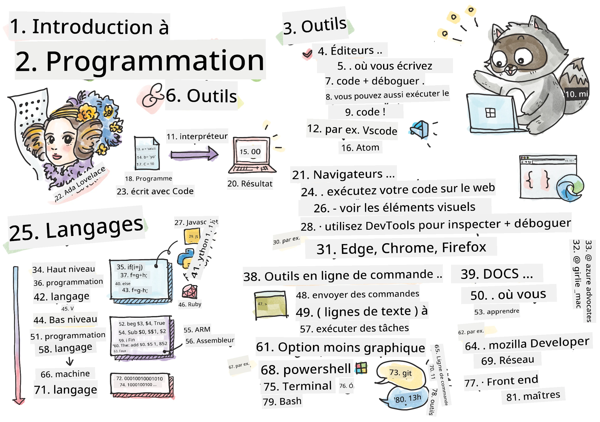
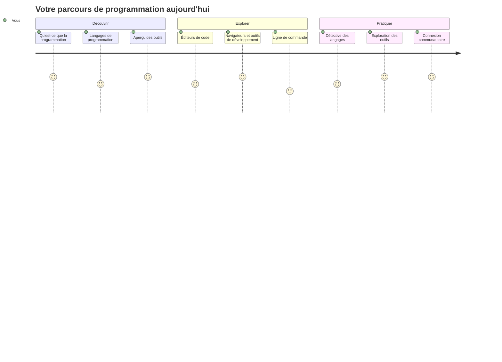
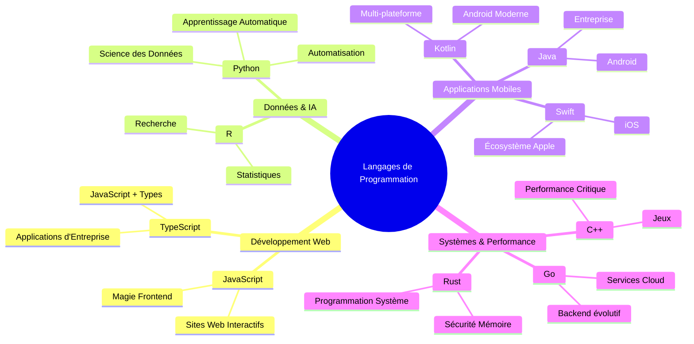
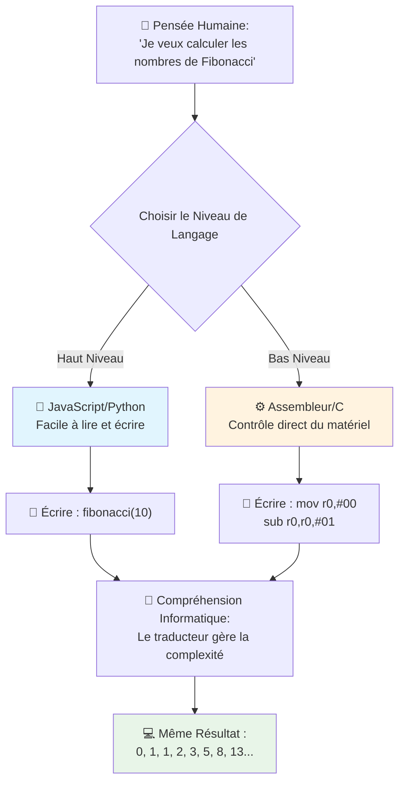
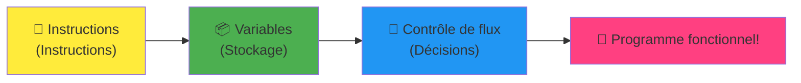
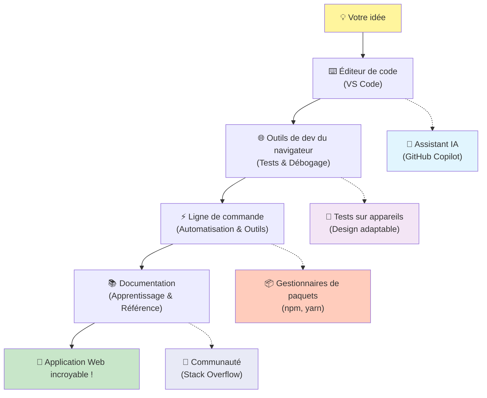
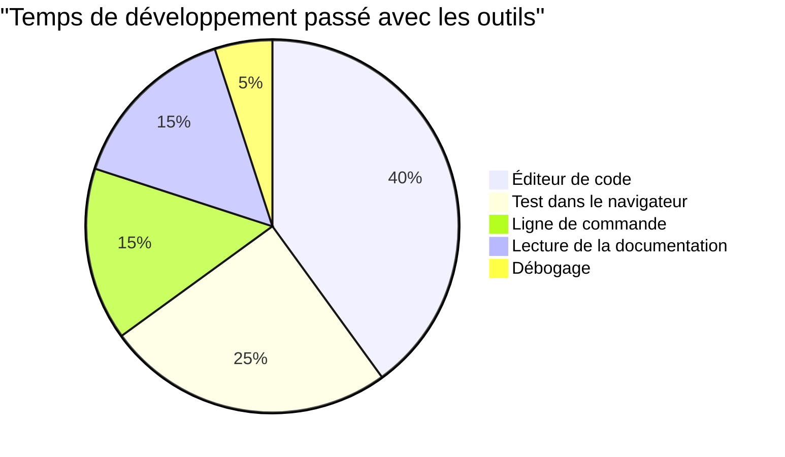
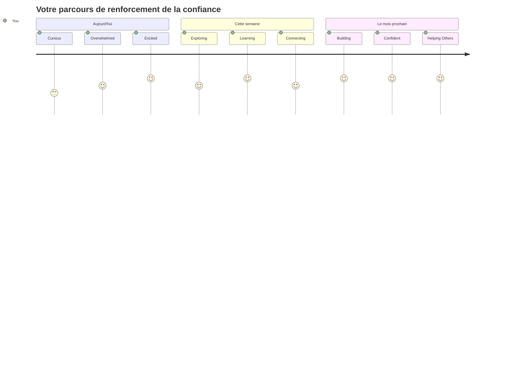

# Introduction aux langages de programmation et aux outils modernes pour développeurs
 
Salut, futur développeur ! 👋 Puis-je te dire quelque chose qui me donne encore des frissons chaque jour ? Tu es sur le point de découvrir que la programmation ne concerne pas seulement les ordinateurs – c’est avoir de véritables super-pouvoirs pour donner vie à tes idées les plus folles !

Tu connais ce moment où tu utilises ton application préférée et tout fonctionne parfaitement ? Quand tu appuies sur un bouton et quelque chose de vraiment magique se produit, te faisant dire « waouh, comment ONT-ILS FAIT ça ? » Eh bien, quelqu’un comme toi – probablement assis dans son café préféré à 2 heures du matin avec son troisième expresso – a écrit le code qui a créé cette magie. Et voici ce qui va te laisser sans voix : à la fin de cette leçon, non seulement tu comprendras comment ils l’ont fait, mais tu auras hâte d’essayer toi-même !

Écoute, je comprends totalement si la programmation te semble intimidante pour l’instant. Quand j’ai commencé, je pensais vraiment qu’il fallait être un génie des maths ou coder depuis que tu as cinq ans. Mais voici ce qui a complètement changé ma perspective : programmer, c’est exactement comme apprendre à converser dans une nouvelle langue. Tu commences par « bonjour » et « merci », puis tu passes à commander un café, et avant que tu ne t’en rendes compte, tu as des discussions philosophiques profondes ! Sauf que dans ce cas, tu parles aux ordinateurs, et honnêtement ? Ce sont les partenaires de conversation les plus patients que tu puisses avoir – ils ne jugent jamais tes erreurs et sont toujours ravis d’essayer à nouveau !

Aujourd’hui, nous allons explorer les outils incroyables qui rendent le développement web moderne non seulement possible, mais sérieusement addictif. Je parle des mêmes éditeurs, navigateurs et flux de travail que les développeurs de Netflix, Spotify et ton studio d’applications indépendant préféré utilisent chaque jour. Et voici la partie qui va te faire faire une petite danse de joie : la plupart de ces outils professionnels, standard de l’industrie, sont complètement gratuits !


> Croquis par [Tomomi Imura](https://twitter.com/girlie_mac)


```mermaid
journey
    title Votre parcours de programmation aujourd'hui
    section Découvrir
      Qu'est-ce que la programmation : 5 : Vous
      Langages de programmation : 4 : Vous
      Aperçu des outils : 5 : Vous
    section Explorer
      Éditeurs de code : 4 : Vous
      Navigateurs et outils de développement : 5 : Vous
      Ligne de commande : 3 : Vous
    section Pratiquer
      Détective des langages : 4 : Vous
      Exploration des outils : 5 : Vous
      Connexion communautaire : 5 : Vous
```
## Voyons ce que tu sais déjà !

Avant de plonger dans les choses amusantes, je suis curieux – que sais-tu déjà sur ce monde de la programmation ? Et écoute, si en regardant ces questions tu penses « Je n’ai absolument aucune idée de tout ça », ce n’est pas juste ok, c’est parfait ! Cela signifie que tu es exactement au bon endroit. Pense à ce quiz comme un étirement avant une séance d’entraînement – on échauffe juste ces muscles cérébraux !

[Fais le quiz pré-leçon](https://ff-quizzes.netlify.app/web/)

## L’aventure dans laquelle nous allons nous lancer ensemble

D’accord, je suis vraiment excité par ce que nous allons explorer aujourd’hui ! Sérieusement, j’aimerais voir ta tête quand certains de ces concepts deviendront clairs. Voici le voyage incroyable que nous allons faire ensemble :

- **Ce qu’est vraiment la programmation (et pourquoi c’est la meilleure chose qui soit !)** – Nous allons découvrir comment le code est littéralement la magie invisible qui alimente tout autour de toi, depuis ce réveil qui sait mystérieusement que c’est lundi matin jusqu’à l’algorithme qui sélectionne parfaitement tes recommandations Netflix
- **Les langages de programmation et leurs personnalités étonnantes** – Imagine entrer à une fête où chaque personne a des super-pouvoirs complètement différents et des façons uniques de résoudre des problèmes. C’est ça le monde des langages de programmation, et tu vas adorer les rencontrer !
- **Les blocs fondamentaux qui rendent la magie digitale possible** – Pense à cela comme le jeu ultime de LEGO créatif. Une fois que tu comprends comment ces morceaux s’emboîtent, tu te rends compte que tu peux construire littéralement tout ce que ton imagination rêve
- **Les outils professionnels qui te feront sentir comme si on venait de te donner une baguette de magicien** – Je ne dramatise pas – ces outils vont vraiment te faire sentir que tu as des super-pouvoirs, et le meilleur dans tout ça ? Ce sont les mêmes que les pros utilisent !

> 💡 **Voici le truc** : ne pense même pas à essayer de tout mémoriser aujourd’hui ! En ce moment, je veux juste que tu sentes cette étincelle d’excitation pour ce qui est possible. Les détails resteront naturellement en mémoire à mesure que nous pratiquerons ensemble – c’est comme ça que l’apprentissage réel se fait !

> Tu peux suivre cette leçon sur [Microsoft Learn](https://learn.microsoft.com/en-us/learn/modules/web-development-101/introduction-programming/?WT.mc_id=academic-77807-sagibbon) !

## Alors, qu’est-ce que *c’est* exactement la programmation ?

D’accord, attaquons la question à un million de dollars : qu’est-ce que la programmation, vraiment ?

Je vais te raconter une histoire qui a complètement changé ma manière de voir les choses. La semaine dernière, j’essayais d’expliquer à ma mère comment utiliser notre nouvelle télécommande de TV intelligente. Je me suis surpris à dire des choses comme « Appuie sur le bouton rouge, mais pas le gros bouton rouge, le petit bouton rouge à gauche… non, ton autre gauche… d’accord, maintenant tiens-le pendant deux secondes, pas une, pas trois… » Ça te parle ? 😅

C’est ça, la programmation ! C’est l’art de donner des instructions très détaillées, étape par étape, à quelque chose de très puissant qui a besoin que tout soit parfaitement expliqué. Sauf qu’au lieu d’expliquer à ta mère (qui peut demander « quel bouton rouge ?! »), tu expliques à un ordinateur (qui fait exactement ce que tu dis, même si ce que tu as dit n’était pas tout à fait ce que tu voulais).

Voici ce qui m’a bluffé quand j’ai appris cela : les ordinateurs sont en fait assez simples à la base. Ils ne comprennent littéralement que deux choses – 1 et 0, ce qui revient en gros à « oui » et « non » ou « allumé » et « éteint ». C’est tout ! Mais là où ça devient magique – on ne doit pas parler en 1 et 0 comme dans Matrix. C’est là que **les langages de programmation** entrent en jeu. Ils sont comme avoir le meilleur traducteur du monde qui prend tes pensées humaines parfaitement normales et les convertit en langage informatique.

Et voici ce qui me donne encore des frissons chaque matin au réveil : littéralement *tout* ce qui est digital dans ta vie a commencé avec quelqu’un comme toi, probablement en pyjama avec une tasse de café, tapant du code sur son ordinateur portable. Ce filtre Instagram qui te rend parfait ? Quelqu’un l’a codé. La recommandation qui t’a fait découvrir ta nouvelle chanson préférée ? Un développeur a construit cet algorithme. L’application qui t’aide à diviser l’addition du dîner avec des amis ? Oui, quelqu’un a pensé « ça m’agace, je parie que je peux régler ça » et ensuite… il l’a fait !

Quand tu apprends à programmer, tu n’acquières pas juste une nouvelle compétence – tu deviens partie prenante de cette communauté incroyable de résolveurs de problèmes qui passent leurs journées à se dire « Et si je pouvais construire quelque chose qui rend la journée de quelqu’un un peu meilleure ? » Franchement, y a-t-il quelque chose de plus cool ?

✅ **Chasse au fait amusant** : voici quelque chose de super cool à chercher quand tu as un moment libre – qui penses-tu qu’était le tout premier programmeur informatique au monde ? Je te donne un indice : ce n’est peut-être pas celui que tu attends ! L’histoire de cette personne est absolument fascinante et montre que la programmation a toujours été une question de résolution créative de problèmes et de pensée hors des sentiers battus.

### 🧠 **Check-in : comment te sens-tu ?**

**Prends un instant pour réfléchir :**
- L’idée de « donner des instructions aux ordinateurs » te paraît-elle claire maintenant ?
- Peux-tu penser à une tâche quotidienne que tu aimerais automatiser avec la programmation ?
- Quelles questions te viennent à l’esprit à propos de tout ce truc de programmation ?

> **Rappelle-toi** : c’est totalement normal si certains concepts te semblent flous pour l’instant. Apprendre à programmer, c’est comme apprendre une nouvelle langue – ton cerveau a besoin de temps pour créer ces connexions neuronales. Tu te débrouilles très bien !

## Les langages de programmation sont comme différentes saveurs de magie

Ok, ça va peut-être paraître bizarre, mais accroche-toi – les langages de programmation sont beaucoup comme différents types de musique. Pense-y : il y a le jazz, fluide et improvisé, le rock, puissant et simple, la musique classique, élégante et structurée, et le hip-hop, créatif et expressif. Chaque style a sa propre ambiance, sa propre communauté de fans passionnés, et chaque style est parfait pour des humeurs et occasions différentes.

Les langages de programmation fonctionnent exactement de la même manière ! Tu n’utiliserais pas le même langage pour créer un jeu mobile amusant que celui pour traiter des quantités massives de données climatiques, tout comme tu ne jouerais pas du death metal pendant un cours de yoga (enfin, la plupart des cours de yoga en tout cas ! 😄).

Mais voici ce qui me fascine chaque fois que j’y pense : ces langages sont comme avoir l’interprète le plus patient et brillant du monde assis juste à côté de toi. Tu peux exprimer tes idées de la manière qui te semble naturelle, et ils gèrent tout le travail incroyablement complexe de les traduire en 1 et 0 que les ordinateurs comprennent. C’est comme avoir un ami parfaitement bilingue en « créativité humaine » et « logique informatique » – qui ne se fatigue jamais, n’a jamais besoin de pause café et ne te juge jamais pour poser la même question deux fois !

### Langages de programmation populaires et leurs usages


```mermaid
mindmap
  root((Langages de Programmation))
    Développement Web
      JavaScript
        Magie Frontend
        Sites Web Interactifs
      TypeScript
        JavaScript + Types
        Applications d'Entreprise
    Données & IA
      Python
        Science des Données
        Apprentissage Automatique
        Automatisation
      R
        Statistiques
        Recherche
    Applications Mobiles
      Java
        Android
        Entreprise
      Swift
        iOS
        Écosystème Apple
      Kotlin
        Android Moderne
        Multi-plateforme
    Systèmes & Performance
      C++
        Jeux
        Performance Critique
      Rust
        Sécurité Mémoire
        Programmation Système
      Go
        Services Cloud
        Backend évolutif
```
| Langage | Meilleur pour | Pourquoi il est populaire |
|----------|---------------|--------------------------|
| **JavaScript** | Développement web, interfaces utilisateur | S’exécute dans les navigateurs et alimente les sites interactifs |
| **Python** | Science des données, automatisation, IA | Facile à lire et apprendre, bibliothèques puissantes |
| **Java** | Applications d’entreprise, applications Android | Indépendant de la plateforme, robuste pour les grands systèmes |
| **C#** | Applications Windows, développement de jeux | Fort support de l’écosystème Microsoft |
| **Go** | Services cloud, systèmes backend | Rapide, simple, conçu pour l’informatique moderne |

### Langages de haut niveau vs bas niveau

Bon, c’est honnêtement le concept qui m’avait le plus embrouillé au début, donc je vais partager l’analogie qui m’a finalement fait tout comprendre – et j’espère que ça va t’aider aussi !

Imagine que tu visites un pays où tu ne parles pas la langue, et que tu as désespérément besoin de trouver les toilettes les plus proches (on est tous passés par là, non ? 😅) :

- **La programmation bas niveau** c’est comme apprendre le dialecte local si bien que tu peux discuter avec la grand-mère qui vend des fruits au coin de la rue en utilisant des références culturelles, du jargon local et des blagues qu’on comprend seulement si on a grandi là-bas. C’est super impressionnant et incroyablement efficace… si tu es fluent ! Mais c’est un peu écrasant quand tu essaies juste de trouver des toilettes.

- **La programmation haut niveau** c’est comme avoir cet ami local génial qui te comprend parfaitement. Tu peux dire « J’ai vraiment besoin de trouver des toilettes » en anglais simple, et il gère toutes les traductions culturelles et te donne des directions qui ont parfaitement du sens pour ton cerveau de non-locuteur.

En termes de programmation :
- **Les langages bas niveau** (comme l’Assemblée ou le C) te permettent d’avoir des conversations extrêmement détaillées avec le matériel réel de l’ordinateur, mais tu dois penser comme une machine, ce qui est… disons, un gros changement mental !
- **Les langages haut niveau** (comme JavaScript, Python ou C#) te permettent de penser comme un humain pendant qu’ils gèrent tout le langage machine en coulisses. En plus, ils ont des communautés incroyablement accueillantes pleines de gens qui se souviennent de ce que c’était d’être débutant et qui veulent vraiment aider !

Devine avec quoi je vais te suggérer de commencer ? 😉 Les langages haut niveau sont comme des roulettes d’entraînement que tu ne veux jamais enlever parce qu’elles rendent toute l’expérience tellement plus agréable !


```mermaid
flowchart TB
    A["👤 Pensée Humaine:<br/>'Je veux calculer les nombres de Fibonacci'"] --> B{Choisir le Niveau de Langage}
    
    B -->|Haut Niveau| C["🌟 JavaScript/Python<br/>Facile à lire et écrire"]
    B -->|Bas Niveau| D["⚙️ Assembleur/C<br/>Contrôle direct du matériel"]
    
    C --> E["📝 Écrire : fibonacci(10)"]
    D --> F["📝 Écrire : mov r0,#00<br/>sub r0,r0,#01"]
    
    E --> G["🤖 Compréhension Informatique:<br/>Le traducteur gère la complexité"]
    F --> G
    
    G --> H["💻 Même Résultat :<br/>0, 1, 1, 2, 3, 5, 8, 13..."]
    
    style C fill:#e1f5fe
    style D fill:#fff3e0
    style H fill:#e8f5e8
```
### Laisse-moi te montrer pourquoi les langages haut niveau sont beaucoup plus sympathiques

D’accord, je suis sur le point de te montrer quelque chose qui illustre parfaitement pourquoi je suis tombé amoureux des langages haut niveau, mais d’abord – je veux que tu me fasses une promesse. Quand tu verras ce premier exemple de code, ne panique pas ! C’est censé paraître intimidant. C’est exactement le point que je veux faire !

Nous allons regarder la même tâche écrite de deux manières complètement différentes. Les deux créent ce qu’on appelle la séquence de Fibonacci – c’est un magnifique motif mathématique où chaque nombre est la somme des deux précédents : 0, 1, 1, 2, 3, 5, 8, 13... (Fait amusant : tu trouveras ce motif littéralement partout dans la nature – spirales de graines de tournesol, motifs de pommes de pin, même la formation des galaxies !)

Prêt à voir la différence ? Allons-y !

**Langage haut niveau (JavaScript) – convivial :**

```javascript
// Étape 1 : Configuration de base de Fibonacci
const fibonacciCount = 10;
let current = 0;
let next = 1;

console.log('Fibonacci sequence:');
```

**Voici ce que fait ce code :**
- **Déclare** une constante pour spécifier combien de nombres Fibonacci nous voulons générer
- **Initialise** deux variables pour suivre le nombre actuel et le suivant dans la séquence
- **Configure** les valeurs de départ (0 et 1) qui définissent le motif de Fibonacci
- **Affiche** un message d’en-tête pour identifier notre sortie

```javascript
// Étape 2 : Générer la séquence avec une boucle
for (let i = 0; i < fibonacciCount; i++) {
  console.log(`Position ${i + 1}: ${current}`);
  
  // Calculer le nombre suivant dans la séquence
  const sum = current + next;
  current = next;
  next = sum;
}
```

**Décomposons ce qui se passe ici :**
- **Boucle** à travers chaque position dans notre séquence avec une boucle `for`
- **Affiche** chaque nombre avec sa position en utilisant le formatage de template literal
- **Calcule** le prochain nombre de Fibonacci en additionnant les valeurs actuelles et suivantes
- **Met à jour** nos variables de suivi pour passer à l’itération suivante

```javascript
// Étape 3 : Approche fonctionnelle moderne
const generateFibonacci = (count) => {
  const sequence = [0, 1];
  
  for (let i = 2; i < count; i++) {
    sequence[i] = sequence[i - 1] + sequence[i - 2];
  }
  
  return sequence;
};

// Exemple d'utilisation
const fibSequence = generateFibonacci(10);
console.log(fibSequence);
```

**Dans l’exemple ci-dessus, nous avons :**
- **Créé** une fonction réutilisable avec la syntaxe moderne des fonctions fléchées
- **Construit** un tableau pour stocker la séquence complète plutôt que d’afficher un par un
- **Utilisé** l’indexation du tableau pour calculer chaque nouveau nombre à partir des valeurs précédentes
- **Renvoie** la séquence complète pour un usage flexible dans d’autres parties de notre programme

**Langage bas niveau (ARM Assembly) – convivial pour l’ordinateur :**

```assembly
 area ascen,code,readonly
 entry
 code32
 adr r0,thumb+1
 bx r0
 code16
thumb
 mov r0,#00
 sub r0,r0,#01
 mov r1,#01
 mov r4,#10
 ldr r2,=0x40000000
back add r0,r1
 str r0,[r2]
 add r2,#04
 mov r3,r0
 mov r0,r1
 mov r1,r3
 sub r4,#01
 cmp r4,#00
 bne back
 end
```

Remarque comment la version JavaScript se lit presque comme des instructions en anglais, tandis que la version Assembly utilise des commandes cryptiques qui contrôlent directement le processeur de l’ordinateur. Les deux accomplissent la même tâche, mais le langage haut niveau est beaucoup plus facile à comprendre, écrire et maintenir pour les humains.

**Différences clés que tu remarqueras :**
- **Lisibilité** : JavaScript utilise des noms descriptifs comme `fibonacciCount` tandis qu'Assembly utilise des labels cryptiques comme `r0`, `r1`.
- **Commentaires** : Les langages de haut niveau encouragent les commentaires explicatifs qui rendent le code auto-documenté.
- **Structure** : Le flux logique de JavaScript correspond à la manière dont les humains pensent les problèmes étape par étape.
- **Maintenance** : Mettre à jour la version JavaScript pour différents besoins est simple et clair.

✅ **À propos de la suite de Fibonacci** : Ce motif numérique absolument magnifique (où chaque nombre est la somme des deux précédents : 0, 1, 1, 2, 3, 5, 8...) apparaît littéralement *partout* dans la nature ! Vous le trouverez dans les spirales de tournesols, les motifs des pommes de pin, la manière dont les coquilles de nautile se courbent, et même dans la croissance des branches d'arbre. C'est assez incroyable comment les mathématiques et le code peuvent nous aider à comprendre et recréer les motifs que la nature utilise pour créer la beauté !

## Les Blocs de Construction Qui Font la Magie

Bon, maintenant que vous avez vu à quoi ressemblent les langages de programmation en action, décomposons les éléments fondamentaux qui composent littéralement tous les programmes jamais écrits. Pensez à ceux-ci comme les ingrédients essentiels de votre recette préférée – une fois que vous comprenez ce que chacun fait, vous pourrez lire et écrire du code dans pratiquement n'importe quel langage !

C'est un peu comme apprendre la grammaire de la programmation. Vous vous souvenez quand à l'école vous avez appris les noms, les verbes, et comment construire des phrases ? La programmation a sa propre version de la grammaire, et honnêtement, elle est bien plus logique et indulgente que la grammaire anglaise ne l'a jamais été ! 😄

### Instructions : Les Instructions Étape par Étape

Commençons par les **instructions** – ce sont comme des phrases individuelles dans une conversation avec votre ordinateur. Chaque instruction dit à l'ordinateur de faire une chose spécifique, un peu comme donner des indications : « Tournez à gauche ici », « Arrêtez-vous au feu rouge », « Garez-vous à cet endroit ».

Ce que j'aime dans les instructions, c'est à quel point elles sont généralement lisibles. Regardez ceci :

```javascript
// Instructions de base qui exécutent des actions uniques
const userName = "Alex";                    
console.log("Hello, world!");              
const sum = 5 + 3;                         
```

**Voici ce que ce code fait :**
- **Déclare** une variable constante pour stocker le nom d'un utilisateur
- **Affiche** un message de bienvenue sur la console
- **Calcule** et stocke le résultat d'une opération mathématique

```javascript
// Instructions qui interagissent avec les pages web
document.title = "My Awesome Website";      
document.body.style.backgroundColor = "lightblue";
```

**Étape par étape, voici ce qui se passe :**
- **Modifie** le titre de la page web qui apparaît dans l'onglet du navigateur
- **Change** la couleur de fond du corps entier de la page

### Variables : Le Système Mémoire de Votre Programme

D'accord, les **variables** sont honnêtement l'un de mes concepts préférés à enseigner parce qu'ils ressemblent beaucoup à des choses que vous utilisez déjà tous les jours !

Pensez pendant une seconde à votre liste de contacts sur votre téléphone. Vous ne mémorisez pas le numéro de téléphone de tout le monde – à la place, vous enregistrez « Maman », « Meilleur Ami », ou « Pizzeria qui livre jusqu'à 2h du matin » et laissez votre téléphone se souvenir des numéros réels. Les variables fonctionnent exactement de la même manière ! Ce sont comme des contenants étiquetés où votre programme peut stocker des informations et les récupérer plus tard en utilisant un nom qui a du sens.

Voici ce qui est vraiment cool : les variables peuvent changer pendant que votre programme s'exécute (d'où le nom « variable » – vous voyez ce qu'ils ont fait là ?). Tout comme vous pourriez mettre à jour ce contact de la pizzeria quand vous découvrez un endroit encore meilleur, les variables peuvent être mises à jour au fur et à mesure que votre programme apprend de nouvelles informations ou que les situations changent !

Laissez-moi vous montrer à quel point cela peut être simple :

```javascript
// Étape 1 : Création des variables de base
const siteName = "Weather Dashboard";        
let currentWeather = "sunny";               
let temperature = 75;                       
let isRaining = false;                      
```

**Comprendre ces concepts :**
- **Stocker** des valeurs constantes dans des variables `const` (comme le nom du site)
- **Utiliser** `let` pour les valeurs qui peuvent changer pendant l'exécution
- **Attribuer** différents types de données : chaînes (texte), nombres, et booléens (vrai/faux)
- **Choisir** des noms descriptifs qui expliquent ce que chaque variable contient

```javascript
// Étape 2 : Travailler avec des objets pour regrouper des données liées
const weatherData = {                       
  location: "San Francisco",
  humidity: 65,
  windSpeed: 12
};
```

**Dans l'exemple ci-dessus, nous avons :**
- **Créé** un objet pour regrouper des informations météorologiques liées
- **Organisé** plusieurs données sous un seul nom de variable
- **Utilisé** des paires clé-valeur pour nommer clairement chaque donnée

```javascript
// Étape 3 : Utilisation et mise à jour des variables
console.log(`${siteName}: Today is ${currentWeather} and ${temperature}°F`);
console.log(`Wind speed: ${weatherData.windSpeed} mph`);

// Mise à jour des variables modifiables
currentWeather = "cloudy";                  
temperature = 68;                          
```

**Comprenons chaque partie :**
- **Afficher** des informations en utilisant les template literals avec la syntaxe `${}`
- **Accéder** aux propriétés de l'objet avec la notation par point (`weatherData.windSpeed`)
- **Mettre à jour** des variables déclarées avec `let` pour refléter les changements
- **Combiner** plusieurs variables pour créer des messages significatifs

```javascript
// Étape 4 : Déstructuration moderne pour un code plus propre
const { location, humidity } = weatherData; 
console.log(`${location} humidity: ${humidity}%`);
```

**Ce que vous devez savoir :**
- **Extraire** des propriétés spécifiques d'objets en utilisant l'affectation par déstructuration
- **Créer** automatiquement de nouvelles variables avec les mêmes noms que les clés d'objet
- **Simplifier** le code en évitant la répétition de la notation par point

### Flux de Contrôle : Apprendre à Votre Programme à Réfléchir

D'accord, c'est ici que la programmation devient absolument époustouflante ! Le **flux de contrôle** consiste essentiellement à apprendre à votre programme à prendre des décisions intelligentes, exactement comme vous le faites chaque jour sans même y penser.

Imaginez ceci : ce matin, vous avez probablement fait quelque chose comme « Si il pleut, je prends un parapluie. Si il fait froid, je mets une veste. Si je suis en retard, je saute le petit-déjeuner et je prends un café en route. » Votre cerveau suit naturellement cette logique conditionnelle « si-alors » des dizaines de fois par jour !

C'est ce qui fait que les programmes semblent intelligents et vivants au lieu de simplement suivre un script ennuyeux et prévisible. Ils peuvent réellement regarder une situation, évaluer ce qui se passe, et répondre de manière appropriée. C'est comme donner un cerveau à votre programme qui peut s'adapter et faire des choix !

Vous voulez voir à quel point ça fonctionne bien ? Laissez-moi vous montrer :

```javascript
// Étape 1 : Logique conditionnelle de base
const userAge = 17;

if (userAge >= 18) {
  console.log("You can vote!");
} else {
  const yearsToWait = 18 - userAge;
  console.log(`You'll be able to vote in ${yearsToWait} year(s).`);
}
```

**Voici ce que ce code fait :**
- **Vérifie** si l'âge de l'utilisateur correspond à l'âge légal pour voter
- **Exécute** différents blocs de code selon le résultat de la condition
- **Calcule** et affiche le temps restant jusqu'à l'éligibilité au vote si moins de 18 ans
- **Donne** un retour spécifique et utile pour chaque scénario

```javascript
// Étape 2 : Conditions multiples avec des opérateurs logiques
const userAge = 17;
const hasPermission = true;

if (userAge >= 18 && hasPermission) {
  console.log("Access granted: You can enter the venue.");
} else if (userAge >= 16) {
  console.log("You need parent permission to enter.");
} else {
  console.log("Sorry, you must be at least 16 years old.");
}
```

**Détaillons ce qui se passe ici :**
- **Combine** plusieurs conditions avec l'opérateur `&&` (et)
- **Crée** une hiérarchie de conditions avec `else if` pour plusieurs scénarios
- **Gère** tous les cas possibles avec une déclaration finale `else`
- **Fournit** un retour clair et actionnable pour chaque situation différente

```javascript
// Étape 3 : Condition concise avec opérateur ternaire
const votingStatus = userAge >= 18 ? "Can vote" : "Cannot vote yet";
console.log(`Status: ${votingStatus}`);
```

**Ce que vous devez retenir :**
- **Utilisez** l'opérateur ternaire (`? :`) pour les conditions simples à deux options
- **Écrivez** la condition d'abord, suivie de `?`, puis la valeur vraie, ensuite `:`, puis la valeur fausse
- **Appliquez** ce modèle lorsque vous devez attribuer des valeurs selon une condition

```javascript
// Étape 4 : Gestion de plusieurs cas spécifiques
const dayOfWeek = "Tuesday";

switch (dayOfWeek) {
  case "Monday":
  case "Tuesday":
  case "Wednesday":
  case "Thursday":
  case "Friday":
    console.log("It's a weekday - time to work!");
    break;
  case "Saturday":
  case "Sunday":
    console.log("It's the weekend - time to relax!");
    break;
  default:
    console.log("Invalid day of the week");
}
```

**Ce code réalise ce qui suit :**
- **Compare** la valeur d'une variable à plusieurs cas spécifiques
- **Regroupe** les cas similaires (jours de semaine vs week-ends)
- **Exécute** le bloc de code approprié lorsqu'une correspondance est trouvée
- **Inclut** un cas `default` pour gérer les valeurs inattendues
- **Utilise** des instructions `break` pour empêcher la continuation vers le cas suivant

> 💡 **Analogie réelle** : Pensez au flux de contrôle comme avoir le GPS le plus patient du monde qui vous donne des directions. Il pourrait dire « S'il y a du trafic sur la rue principale, prenez l'autoroute à la place. S'il y a des travaux sur l'autoroute, essayez la route pittoresque. » Les programmes utilisent exactement ce type de logique conditionnelle pour répondre intelligemment aux différentes situations et toujours offrir la meilleure expérience possible aux utilisateurs.

### 🎯 **Vérification des Concepts : Maîtrise des Blocs de Construction**

**Voyons comment vous vous en sortez avec les fondamentaux :**
- Pouvez-vous expliquer la différence entre une variable et une instruction avec vos propres mots ?
- Pensez à un scénario réel où vous utiliseriez une décision « si-alors » (comme notre exemple du vote)
- Quelle est la chose qui vous a surpris dans la logique de programmation ?

**Petit boost de confiance :**

```mermaid
flowchart LR
    A["📝 Instructions<br/>(Instructions)"] --> B["📦 Variables<br/>(Stockage)"] --> C["🔀 Contrôle de flux<br/>(Décisions)"] --> D["🎉 Programme fonctionnel!"]
    
    style A fill:#ffeb3b
    style B fill:#4caf50
    style C fill:#2196f3
    style D fill:#ff4081
```
✅ **Ce qui arrive ensuite** : Nous allons nous amuser énormément à approfondir ces concepts tout au long de cette incroyable aventure ensemble ! Pour l'instant, concentrez-vous simplement sur cet enthousiasme pour toutes les possibilités incroyables qui vous attendent. Les compétences spécifiques et les techniques viendront naturellement au fur et à mesure de notre pratique – je vous promets que ce sera bien plus amusant que vous ne l'imaginez !

## Les Outils du Métier

Bon, c'est honnêtement ici que je deviens tellement excité que j'arrive à peine à me contenir ! 🚀 Nous allons parler des outils incroyables qui vont vous faire sentir comme si on venait de vous remettre les clés d'un vaisseau spatial numérique.

Vous savez comment un chef dispose de ces couteaux parfaitement équilibrés qui semblent être une extension de ses mains ? Ou comment un musicien a cette guitare qui semble chanter dès qu'il la touche ? Eh bien, les développeurs ont leur propre version de ces outils magiques, et voici ce qui va absolument vous épater – la plupart sont entièrement gratuits !

Je suis quasiment en train de bondir sur ma chaise rien qu'en pensant à les partager avec vous parce qu'ils ont complètement révolutionné notre façon de construire des logiciels. On parle d'assistants de programmation alimentés par l'IA qui peuvent vous aider à écrire votre code (je ne plaisante même pas !), d'environnements cloud où vous pouvez développer des applications entières depuis littéralement n'importe où avec Wi-Fi, et d'outils de débogage tellement sophistiqués qu'on croirait avoir une vision à rayons X de vos programmes.

Et voici la partie qui me donne encore des frissons : ce ne sont pas des « outils pour débutants » dont vous allez rapidement vous lasser. Ce sont exactement les mêmes outils professionnels que les développeurs chez Google, Netflix, et ce studio d'applications indépendant que vous adorez utilisent en ce moment précis. Vous allez vous sentir super pro en les utilisant !


```mermaid
graph TD
    A["💡 Votre idée"] --> B["⌨️ Éditeur de code<br/>(VS Code)"] 
    B --> C["🌐 Outils de dev du navigateur<br/>(Tests & Débogage)"]
    C --> D["⚡ Ligne de commande<br/>(Automatisation & Outils)"]
    D --> E["📚 Documentation<br/>(Apprentissage & Référence)"]
    E --> F["🚀 Application Web incroyable !"]
    
    B -.-> G["🤖 Assistant IA<br/>(GitHub Copilot)"]
    C -.-> H["📱 Tests sur appareils<br/>(Design adaptable)"]
    D -.-> I["📦 Gestionnaires de paquets<br/>(npm, yarn)"]
    E -.-> J["👥 Communauté<br/>(Stack Overflow)"]
    
    style A fill:#fff59d
    style F fill:#c8e6c9
    style G fill:#e1f5fe
    style H fill:#f3e5f5
    style I fill:#ffccbc
    style J fill:#e8eaf6
```
### Éditeurs de Code et IDE : Vos Nouveaux Meilleurs Amis Numériques

Parlons des éditeurs de code – ils vont sérieusement devenir vos nouveaux endroits préférés ! Pensez à eux comme votre sanctuaire personnel de codage où vous passerez la plupart de votre temps à créer et perfectionner vos créations numériques.

Mais voici ce qui est absolument magique avec les éditeurs modernes : ce ne sont pas que de simples éditeurs de texte raffinés. C’est comme avoir le mentor de codage le plus brillant et le plus encourageant assis juste à côté de vous 24 heures sur 24, 7 jours sur 7. Ils détectent vos fautes de frappe avant même que vous ne les remarquiez, suggèrent des améliorations qui vous font passer pour un génie, vous aident à comprendre ce que chaque morceau de code fait, et certains peuvent même prédire ce que vous allez taper et vous proposer de finir vos pensées !

Je me souviens quand j'ai découvert l'auto-complétion – c'était littéralement comme vivre dans le futur. Vous commencez à taper quelque chose, et votre éditeur vous dit : « Hé, tu pensais à cette fonction qui fait exactement ce dont tu as besoin ? » C’est comme avoir un devin comme copain de codage !

**Qu'est-ce qui rend ces éditeurs si incroyables ?**

Les éditeurs de code modernes offrent une gamme impressionnante de fonctionnalités conçues pour booster votre productivité :

| Fonctionnalité            | Ce qu'elle fait                      | Pourquoi c'est utile                   |
|--------------------------|------------------------------------|--------------------------------------|
| **Coloration syntaxique** | Colore différentes parties du code | Rend le code plus facile à lire et repérer les erreurs |
| **Auto-complétion**       | Suggère du code au fur et à mesure  | Accélère le codage et réduit les fautes de frappe |
| **Outils de débogage**    | Aide à trouver et corriger les erreurs | Économise des heures de recherche de bugs |
| **Extensions**            | Ajoute des fonctionnalités spécialisées | Personnalise votre éditeur pour toute technologie |
| **Assistants IA**         | Suggère du code et des explications | Accélère l’apprentissage et la productivité |

> 🎥 **Ressource vidéo** : Vous voulez voir ces outils en action ? Regardez cette [vidéo Outils du Métier](https://youtube.com/watch?v=69WJeXGBdxg) pour un aperçu complet.

#### Éditeurs recommandés pour le développement Web

**[Visual Studio Code](https://code.visualstudio.com/?WT.mc_id=academic-77807-sagibbon)** (Gratuit)
- Le plus populaire parmi les développeurs web
- Excellent écosystème d’extensions
- Terminal intégré et intégration Git
- **Extensions indispensables** :
  - [GitHub Copilot](https://marketplace.visualstudio.com/items?itemName=GitHub.copilot) - Suggestions de code alimentées par IA
  - [Live Share](https://marketplace.visualstudio.com/items?itemName=MS-vsliveshare.vsliveshare) - Collaboration en temps réel
  - [Prettier](https://marketplace.visualstudio.com/items?itemName=esbenp.prettier-vscode) - Formatage automatique du code
  - [Code Spell Checker](https://marketplace.visualstudio.com/items?itemName=streetsidesoftware.code-spell-checker) - Correction des fautes de frappe dans votre code

**[JetBrains WebStorm](https://www.jetbrains.com/webstorm/)** (Payant, gratuit pour les étudiants)
- Outils avancés de débogage et de tests
- Complétion intelligente du code
- Contrôle de version intégré

**IDE basés sur le Cloud** (Tarification variable)
- [GitHub Codespaces](https://github.com/features/codespaces) - VS Code complet dans votre navigateur
- [Replit](https://replit.com/) - Idéal pour apprendre et partager du code
- [StackBlitz](https://stackblitz.com/) - Développement web full-stack instantané

> 💡 **Conseil pour commencer** : Commencez par Visual Studio Code – c’est gratuit, largement utilisé dans l’industrie, et il y a une énorme communauté qui crée des tutoriels et extensions utiles.

### Navigateurs Web : Votre Laboratoire Secret de Développement

D'accord, préparez-vous à être complètement surpris ! Vous savez comment vous avez utilisé les navigateurs pour faire défiler les réseaux sociaux et regarder des vidéos ? Eh bien, il s’avère qu’ils ont caché tout ce temps un incroyable laboratoire de développement secret, juste en attendant que vous le découvriez !

Chaque fois que vous faites un clic droit sur une page web et sélectionnez « Inspecter l’élément », vous ouvrez un monde caché d’outils de développement qui sont honnêtement plus puissants que certains logiciels coûteux pour lesquels je payais des centaines d’euros. C’est comme découvrir que votre vieille cuisine ordinaire cachait un laboratoire de chef professionnel derrière un panneau secret !
La première fois que quelqu’un m’a montré les DevTools du navigateur, j’ai passé environ trois heures à cliquer partout en disant « ATTENDS, ÇA PEUT FAIRE ÇA AUSSI ?! » Vous pouvez littéralement modifier n’importe quel site web en temps réel, voir exactement à quelle vitesse tout charge, tester l’apparence de votre site sur différents appareils, et même déboguer du JavaScript comme un pro total. C’est absolument bluffant !

**Voici pourquoi les navigateurs sont votre arme secrète :**

Quand vous créez un site web ou une application web, vous devez voir comment il s’affiche et se comporte dans le monde réel. Les navigateurs affichent non seulement votre travail mais fournissent aussi des retours détaillés sur la performance, l’accessibilité et les problèmes potentiels.

#### Outils de développement des navigateurs (DevTools)

Les navigateurs modernes incluent des suites de développement complètes :

| Catégorie d’outil | Ce qu’il fait | Exemple d’utilisation |
|-------------------|---------------|----------------------|
| **Inspecteur d’éléments** | Visualiser et modifier le HTML/CSS en temps réel | Ajuster le style pour voir les résultats immédiats |
| **Console** | Voir les messages d’erreur et tester le JavaScript | Déboguer les problèmes et expérimenter le code |
| **Moniteur réseau** | Suivre le chargement des ressources | Optimiser la performance et les temps de chargement |
| **Vérificateur d’accessibilité** | Tester la conception inclusive | S’assurer que votre site fonctionne pour tous les utilisateurs |
| **Simulateur d’appareil** | Prévisualiser sur différentes tailles d’écran | Tester le design responsive sans plusieurs appareils |

#### Navigateurs recommandés pour le développement

- **[Chrome](https://developers.google.com/web/tools/chrome-devtools/)** – DevTools standards de l’industrie avec une documentation extensive
- **[Firefox](https://developer.mozilla.org/docs/Tools)** – Excellent outils CSS Grid et accessibilité
- **[Edge](https://docs.microsoft.com/microsoft-edge/devtools-guide-chromium/?WT.mc_id=academic-77807-sagibbon)** – Basé sur Chromium avec les ressources développeur de Microsoft

> ⚠️ **Astuce importante pour les tests** : Testez toujours vos sites dans plusieurs navigateurs ! Ce qui fonctionne parfaitement dans Chrome peut s’afficher différemment dans Safari ou Firefox. Les développeurs professionnels testent sur tous les navigateurs majeurs pour garantir une expérience utilisateur cohérente.


### Outils en ligne de commande : votre passerelle vers les super-pouvoirs de développeur

Bon, soyons totalement honnêtes ici à propos de la ligne de commande, parce que je veux que vous entendiez ça de quelqu’un qui comprend vraiment. La première fois que je l’ai vue – ce simple écran noir effrayant avec du texte clignotant – j’ai littéralement pensé : « Non, absolument pas ! Ça ressemble à un truc sorti d’un film de hackers des années 80, et je ne suis définitivement pas assez malin pour ça ! » 😅

Mais voici ce que j’aurais aimé que quelqu’un me dise à l’époque, et ce que je vous dis maintenant : la ligne de commande n’est pas effrayante – c’est en fait comme avoir une conversation directe avec votre ordinateur. Imaginez que c’est comme la différence entre commander de la nourriture via une application sophistiquée avec des images et des menus (ce qui est simple et pratique) et entrer dans votre restaurant local préféré où le chef sait exactement ce que vous aimez et peut préparer quelque chose de parfait rien qu’en lui disant « surprise-moi avec quelque chose d’incroyable. »

La ligne de commande est l’endroit où les développeurs se sentent comme de véritables magiciens. Vous tapez quelques mots qui semblent magiques (bon, ce ne sont que des commandes, mais elles ont l’air magiques !), vous appuyez sur entrée, et BOUM – vous avez créé une structure de projet entière, installé des outils puissants du monde entier, ou déployé votre application sur Internet pour des millions de personnes. Une fois que vous goûtez à ce pouvoir, c’est vraiment addictif !

**Pourquoi la ligne de commande deviendra votre outil préféré :**

Bien que les interfaces graphiques soient excellentes pour beaucoup de tâches, la ligne de commande excelle en automatisation, précision et rapidité. Beaucoup d’outils de développement fonctionnent principalement via des interfaces en ligne de commande, et apprendre à les utiliser efficacement peut considérablement améliorer votre productivité.

```bash
# Étape 1 : Créez et accédez au répertoire du projet
mkdir my-awesome-website
cd my-awesome-website
```
  
**Voici ce que ce code fait :**  
- **Créer** un nouveau répertoire appelé « my-awesome-website » pour votre projet  
- **Naviguer** dans le répertoire nouvellement créé pour commencer à travailler  

```bash
# Étape 2 : Initialiser le projet avec package.json
npm init -y

# Installer des outils de développement modernes
npm install --save-dev vite prettier eslint
npm install --save-dev @eslint/js
```
  
**Étape par étape, voici ce qui se passe :**  
- **Initialiser** un nouveau projet Node.js avec les paramètres par défaut grâce à `npm init -y`  
- **Installer** Vite comme outil de build moderne pour un développement rapide et des builds en production  
- **Ajouter** Prettier pour le formatage automatique du code et ESLint pour les vérifications de qualité  
- **Utiliser** le flag `--save-dev` pour marquer ces dépendances comme uniquement pour le développement  

```bash
# Étape 3 : Créez la structure de projet et les fichiers
mkdir src assets
echo '<!DOCTYPE html><html><head><title>My Site</title></head><body><h1>Hello World</h1></body></html>' > index.html

# Démarrer le serveur de développement
npx vite
```
  
**Dans ce qui précède, nous avons :**  
- **Organisé** notre projet en créant des dossiers séparés pour le code source et les assets  
- **Généré** un fichier HTML basique avec une structure correcte  
- **Lancé** le serveur de développement Vite pour le rechargement en direct et le remplacement à chaud des modules  

#### Outils essentiels en ligne de commande pour le développement web

| Outil | But | Pourquoi vous en avez besoin |
|-------|-----|------------------------------|
| **[Git](https://git-scm.com/)** | Contrôle de version | Suivre les changements, collaborer, sauvegarder votre travail |
| **[Node.js & npm](https://nodejs.org/)** | Runtime JavaScript & gestionnaire de paquets | Exécuter du JavaScript hors des navigateurs, installer des outils modernes |
| **[Vite](https://vitejs.dev/)** | Outil de build & serveur dev | Développement ultra-rapide avec remplacement à chaud des modules |
| **[ESLint](https://eslint.org/)** | Qualité du code | Trouver et corriger automatiquement les problèmes dans votre JavaScript |
| **[Prettier](https://prettier.io/)** | Formatage du code | Garder votre code toujours formaté de manière cohérente et lisible |

#### Options spécifiques à la plateforme

**Windows :**  
- **[Windows Terminal](https://docs.microsoft.com/windows/terminal/?WT.mc_id=academic-77807-sagibbon)** – Terminal moderne et riche en fonctionnalités  
- **[PowerShell](https://docs.microsoft.com/powershell/?WT.mc_id=academic-77807-sagibbon)** 💻 – Environnement de scripting puissant  
- **[Invite de commandes](https://docs.microsoft.com/windows-server/administration/windows-commands/?WT.mc_id=academic-77807-sagibbon)** 💻 – Ligne de commande traditionnelle Windows  

**macOS :**  
- **[Terminal](https://support.apple.com/guide/terminal/)** 💻 – Application terminal intégrée  
- **[iTerm2](https://iterm2.com/)** – Terminal amélioré avec fonctionnalités avancées  

**Linux :**  
- **[Bash](https://www.gnu.org/software/bash/)** 💻 – Shell Linux standard  
- **[KDE Konsole](https://docs.kde.org/trunk5/en/konsole/konsole/index.html)** – Émulateur de terminal avancé  

> 💻 = Préinstallé sur le système d’exploitation

> 🎯 **Parcours d’apprentissage** : Commencez par des commandes basiques comme `cd` (changer de répertoire), `ls` ou `dir` (lister les fichiers), et `mkdir` (créer un dossier). Entraînez-vous avec des commandes de workflow modernes telles que `npm install`, `git status`, et `code .` (ouvre le répertoire courant dans VS Code). À mesure que vous gagnez en confiance, vous apprendrez naturellement des commandes plus avancées et des techniques d’automatisation.


### Documentation : votre mentor d’apprentissage toujours disponible

Bon, laissez-moi partager un petit secret qui va vous faire vous sentir beaucoup mieux d’être débutant : même les développeurs les plus expérimentés passent une énorme partie de leur temps à lire la documentation. Et ce n’est pas parce qu’ils ne savent pas ce qu’ils font – c’est en fait un signe de sagesse !

Considérez la documentation comme un accès aux enseignants les plus patients et compétents du monde, disponibles 24h/24 et 7j/7. Bloqué sur un problème à 2 h du matin ? La documentation est là avec un câlin virtuel chaleureux et exactement la réponse dont vous avez besoin. Vous voulez apprendre une nouvelle fonctionnalité dont tout le monde parle ? La documentation vous soutient avec des exemples étape par étape. Vous essayez de comprendre pourquoi quelque chose fonctionne comme ça ? Vous l’avez deviné – la documentation est prête à l’expliquer d’une manière qui vous fera tout saisir enfin !

Voici quelque chose qui a complètement changé ma perspective : le monde du développement web évolue incroyablement vite, et personne (je veux dire absolument personne !) ne retient tout par cœur. J’ai vu des développeurs seniors avec plus de 15 ans d’expérience consulter la syntaxe basique, et vous savez quoi ? Ce n’est pas embarrassant – c’est intelligent ! Ce n’est pas une question de mémoire parfaite ; c’est une question de savoir où trouver vite des réponses fiables et comment les appliquer.

**Voici où la vraie magie opère :**

Les développeurs professionnels passent une grande partie de leur temps à lire la documentation – pas parce qu’ils ne savent pas, mais parce que le paysage du développement web évolue si rapidement qu’il faut apprendre en continu pour rester à jour. Une bonne documentation vous aide à comprendre non seulement *comment* utiliser quelque chose, mais *pourquoi* et *quand* l’utiliser.

#### Ressources essentielles de documentation

**[Mozilla Developer Network (MDN)](https://developer.mozilla.org/docs/Web)**  
- La référence ultime pour la documentation des technologies web  
- Guides complets pour HTML, CSS et JavaScript  
- Informations sur la compatibilité des navigateurs  
- Exemples pratiques et démos interactives  

**[Web.dev](https://web.dev)** (par Google)  
- Bonnes pratiques modernes du développement web  
- Guides d’optimisation des performances  
- Principes d’accessibilité et de design inclusif  
- Études de cas issues de projets réels  

**[Microsoft Developer Documentation](https://docs.microsoft.com/microsoft-edge/#microsoft-edge-for-developers)**  
- Ressources pour le développement sur navigateur Edge  
- Guides sur les Progressive Web Apps  
- Perspectives pour le développement multiplateforme  

**[Frontend Masters Learning Paths](https://frontendmasters.com/learn/)**  
- Programmes d’apprentissage structurés  
- Cours vidéo par des experts du métier  
- Exercices pratiques de codage  

> 📚 **Stratégie d’étude** : Ne tentez pas de mémoriser la documentation – apprenez plutôt à la naviguer efficacement. Mettez en favori vos références les plus utilisées et entraînez-vous à utiliser les fonctions de recherche pour trouver rapidement des informations spécifiques.

### 🔧 **Maîtrise des outils : Qu’est-ce qui vous parle le plus ?**

**Prenez un moment pour réfléchir :**  
- Quel outil avez-vous le plus hâte d’essayer en premier ? (Il n’y a pas de mauvaise réponse !)  
- La ligne de commande vous semble-t-elle toujours intimidante ou êtes-vous curieux d’essayer ?  
- Pouvez-vous imaginer utiliser les DevTools du navigateur pour jeter un coup d’œil derrière le rideau de vos sites web favoris ?


```mermaid
pie title "Temps de développement passé avec les outils"
    "Éditeur de code" : 40
    "Test dans le navigateur" : 25
    "Ligne de commande" : 15
    "Lecture de la documentation" : 15
    "Débogage" : 5
```  
> **Petite révélation sympa** : La plupart des développeurs passent environ 40 % de leur temps dans leur éditeur de code, mais regardez combien de temps est consacré aux tests, à l’apprentissage et à la résolution de problèmes. Programmer, ce n’est pas qu’écrire du code – c’est créer des expériences !

✅ **Réflexion** : Voici une chose intéressante à méditer – comment pensez-vous que les outils pour construire des sites (développement) diffèrent des outils pour en dessiner l’apparence (design) ? C’est comme la différence entre un architecte qui dessine une belle maison et l’entrepreneur qui la construit réellement. Les deux sont cruciaux, mais ils ont besoin de boîtes à outils différentes ! Ce genre de réflexion vous aidera vraiment à voir la vision d’ensemble de la création d’un site.

## Défi Agent GitHub Copilot 🚀

Utilisez le mode Agent pour relever le défi suivant :

**Description :** Explorez les fonctionnalités d’un éditeur de code moderne ou d’un IDE et montrez comment il peut améliorer votre flux de travail en tant que développeur web.

**Consigne :** Choisissez un éditeur de code ou IDE (comme Visual Studio Code, WebStorm ou un IDE cloud). Listez trois fonctionnalités ou extensions qui vous aident à écrire, déboguer ou maintenir le code plus efficacement. Pour chacune, donnez une brève explication de ses bénéfices pour votre flux de travail.

---

## 🚀 Défi

**Alors détective, prêt pour votre premier dossier ?**

Maintenant que vous avez cette superbe base, j’ai une aventure qui va vous aider à voir à quel point le monde de la programmation est incroyablement divers et fascinant. Et écoutez – il ne s’agit pas encore de coder, donc pas de pression ! Considérez-vous comme un détective des langages de programmation sur votre tout premier affaire excitante !

**Votre mission, si vous l’acceptez :**  
1. **Devenez explorateur de langages** : Choisissez trois langages de programmation issus d’univers totalement différents – peut-être un qui construit des sites web, un qui crée des applis mobiles, et un qui traite les données pour les scientifiques. Trouvez des exemples d’une même tâche simple écrite dans chaque langage. Je vous promets que vous serez absolument émerveillé de voir à quel point ils peuvent différer tout en faisant exactement la même chose !

2. **Découvrez leurs histoires d’origine** : Qu’est-ce qui rend chaque langage spécial ? Voici un fait intéressant – chaque langage de programmation a été créé parce que quelqu’un a pensé : « Tu sais quoi ? Il doit y avoir une meilleure façon de résoudre ce problème précis. » Pouvez-vous deviner quels étaient ces problèmes ? Certaines histoires sont vraiment fascinantes !

3. **Rencontrez les communautés** : Regardez à quel point les communautés de chaque langage sont accueillantes et passionnées. Certaines comptent des millions de développeurs partageant leurs connaissances et s’aidant mutuellement, d’autres sont plus petites mais incroyablement soudées et solidaires. Vous allez adorer voir les différentes personnalités de ces communautés !

4. **Suivez votre instinct** : Quel langage vous semble le plus accessible pour l’instant ? Ne stressez pas pour faire le « choix parfait » – écoutez juste vos intuitions ! Honnêtement, il n’y a pas de mauvaise réponse, et vous pouvez toujours explorer les autres plus tard.

**Bonus détective** : Essayez de découvrir quels grands sites ou applis sont construits avec chaque langage. Je vous garantis que vous serez choqué d’apprendre ce qui fait tourner Instagram, Netflix ou ce jeu mobile dont vous ne pouvez plus vous passer !

> 💡 **N’oubliez pas** : Vous n’essayez pas de devenir expert en ces langages aujourd’hui. Vous faites juste connaissance avec le quartier avant de décider où vous voulez vous installer. Prenez votre temps, amusez-vous, et laissez votre curiosité vous guider !

## Célébrons ce que vous avez découvert !

Incroyable, vous avez absorbé tellement d’informations géniales aujourd’hui ! Je suis vraiment impatient de voir combien de ce magnifique voyage vous avez retenu. Et souvenez-vous – ce n’est pas un test où vous devez être parfait. C’est plutôt une célébration de toutes les choses cool que vous avez apprises sur cet univers fascinant dans lequel vous êtes sur le point de plonger !

[Participer au quiz post-lesson](https://ff-quizzes.netlify.app/web/)

## Révision & auto-apprentissage

**Prenez votre temps pour explorer et amusez-vous !**
Vous avez couvert beaucoup de terrain aujourd'hui, et c'est quelque chose dont vous pouvez être fier ! Maintenant arrive la partie amusante – explorer les sujets qui ont suscité votre curiosité. Souvenez-vous, ce n'est pas un devoir – c'est une aventure !

**Approfondissez ce qui vous passionne :**

**Mettez-vous en pratique avec des langages de programmation :**
- Visitez les sites officiels de 2-3 langages qui ont attiré votre attention. Chacun a sa propre personnalité et son histoire !
- Essayez des terrains de jeu de codage en ligne comme [CodePen](https://codepen.io/), [JSFiddle](https://jsfiddle.net/), ou [Replit](https://replit.com/). N'ayez pas peur d'expérimenter – vous ne pouvez rien casser !
- Lisez comment votre langage préféré est né. Sérieusement, certaines de ces histoires d'origine sont fascinantes et vous aideront à comprendre pourquoi les langages fonctionnent comme ils le font.

**Prenez en main vos nouveaux outils :**
- Téléchargez Visual Studio Code si ce n'est pas déjà fait – c'est gratuit et vous allez l'adorer !
- Passez quelques minutes à parcourir le marketplace des Extensions. C'est comme un magasin d'applications pour votre éditeur de code !
- Ouvrez les outils de développement de votre navigateur et cliquez un peu partout. Ne vous inquiétez pas de tout comprendre – familiarisez-vous simplement avec ce qui est là.

**Rejoignez la communauté :**
- Suivez quelques communautés de développeurs sur [Dev.to](https://dev.to/), [Stack Overflow](https://stackoverflow.com/), ou [GitHub](https://github.com/). La communauté de programmation est incroyablement accueillante pour les débutants !
- Regardez des vidéos de codage adaptées aux débutants sur YouTube. Il y a tellement de créateurs formidables qui se souviennent de ce que c'est que de commencer.
- Envisagez de rejoindre des meetups locaux ou des communautés en ligne. Croyez-moi, les développeurs adorent aider les nouveaux venus !

> 🎯 **Écoutez, voici ce que je veux que vous reteniez** : On ne s'attend pas à ce que vous deveniez un expert en codage du jour au lendemain ! Pour l'instant, vous êtes juste en train de découvrir ce nouveau monde incroyable dont vous allez faire partie. Prenez votre temps, profitez du voyage, et souvenez-vous – chaque développeur que vous admirez a été un jour assis exactement là où vous êtes en ce moment, excité et peut-être un peu dépassé. C'est tout à fait normal, et ça veut dire que vous êtes sur la bonne voie !


## Devoir

[Reading the Docs](assignment.md)

> 💡 **Un petit coup de pouce pour votre devoir** : J'adorerais vous voir explorer des outils que nous n'avons pas encore abordés ! Évitez les éditeurs, navigateurs, et outils en ligne de commande dont nous avons déjà parlé – il existe tout un univers incroyable d'outils de développement extraordinaires qui n'attendent qu'à être découverts. Cherchez ceux qui sont activement maintenus et qui ont des communautés dynamiques et aidantes (ceux-là ont tendance à proposer les meilleurs tutoriels et les personnes les plus solidaires quand vous bloquez et avez besoin d'un coup de main amical).

---

## 🚀 Votre chronologie de parcours de programmation

### ⚡ **Ce que vous pouvez faire dans les 5 prochaines minutes**
- [ ] Mettre en favoris 2-3 sites web de langages de programmation qui ont attiré votre attention
- [ ] Télécharger Visual Studio Code si ce n'est pas déjà fait
- [ ] Ouvrir les DevTools de votre navigateur (F12) et cliquer un peu partout sur un site web
- [ ] Rejoindre une communauté de programmation (Dev.to, Reddit r/webdev, ou Stack Overflow)

### ⏰ **Ce que vous pouvez accomplir cette heure**
- [ ] Compléter le quiz post-leçon et réfléchir à vos réponses
- [ ] Configurer VS Code avec l'extension GitHub Copilot
- [ ] Essayer un exemple "Hello World" dans 2 langages de programmation différents en ligne
- [ ] Regarder une vidéo "Un jour dans la vie d’un développeur" sur YouTube
- [ ] Commencer vos recherches sur les langages de programmation (depuis le challenge)

### 📅 **Votre aventure d'une semaine**
- [ ] Réaliser le devoir et explorer 3 nouveaux outils de développement
- [ ] Suivre 5 développeurs ou comptes liés à la programmation sur les réseaux sociaux
- [ ] Essayer de construire quelque chose de petit dans CodePen ou Replit (même juste "Hello, [Votre Nom] !")
- [ ] Lire un billet de blog d’un développeur sur son parcours de codage
- [ ] Participer à un meetup virtuel ou regarder une conférence sur la programmation
- [ ] Commencer à apprendre votre langage choisi avec des tutoriels en ligne

### 🗓️ **Votre transformation d'un mois**
- [ ] Construire votre premier petit projet (même une simple page web compte !)
- [ ] Contribuer à un projet open source (commencez par des corrections de documentation)
- [ ] Mentorer quelqu’un qui débute en programmation
- [ ] Créer votre site portfolio de développeur
- [ ] Vous connecter avec des communautés locales de développeurs ou des groupes d’étude
- [ ] Commencer à planifier votre prochaine étape d’apprentissage

### 🎯 **Bilan final**

**Avant de continuer, prenez un moment pour célébrer :**
- Quelle est la chose qui vous a le plus enthousiasmé aujourd'hui dans la programmation ?
- Quel outil ou concept voulez-vous explorer en premier ?
- Comment vous sentez-vous à l'idée de commencer ce parcours de programmation ?
- Quelle est la question que vous aimeriez poser à un développeur en ce moment ?


```mermaid
journey
    title Votre parcours de renforcement de la confiance
    section Aujourd'hui
      Curious: 3: You
      Overwhelmed: 4: You
      Excited: 5: You
    section Cette semaine
      Exploring: 4: You
      Learning: 5: You
      Connecting: 4: You
    section Le mois prochain
      Building: 5: You
      Confident: 5: You
      Helping Others: 5: You
```
> 🌟 **N'oubliez pas** : Tout expert a été un débutant. Tout développeur senior s’est déjà senti exactement comme vous vous sentez maintenant – enthousiaste, peut-être un peu dépassé, et définitivement curieux de découvrir ce qui est possible. Vous êtes en excellente compagnie, et ce voyage va être incroyable. Bienvenue dans le merveilleux monde de la programmation ! 🎉

---

<!-- CO-OP TRANSLATOR DISCLAIMER START -->
**Avertissement** :  
Ce document a été traduit à l’aide du service de traduction automatique [Co-op Translator](https://github.com/Azure/co-op-translator). Bien que nous nous efforcions d’assurer l’exactitude, veuillez noter que les traductions automatiques peuvent contenir des erreurs ou des inexactitudes. Le document original dans sa langue d’origine doit être considéré comme la source faisant foi. Pour toute information critique, une traduction professionnelle humaine est recommandée. Nous ne saurions être tenus responsables de tout malentendu ou mauvaise interprétation résultant de l’utilisation de cette traduction.
<!-- CO-OP TRANSLATOR DISCLAIMER END -->